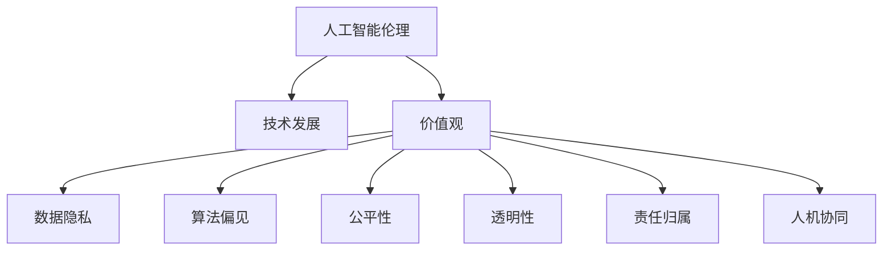

                 

# 硅谷人工智能伦理:技术发展与价值观

> 关键词：人工智能伦理,技术发展,价值观,数据隐私,偏见与公平性,伦理责任,机器学习,自动化,人机协同

## 1. 背景介绍

### 1.1 问题由来

人工智能（AI）技术，尤其是深度学习和机器学习，在近年来取得了长足的发展，几乎渗透到了社会生活的方方面面。然而，随之而来的技术伦理问题也逐渐引发了全球范围的关注与讨论。

具体来说，人工智能在医疗、教育、法律、安全等重要领域的应用，涉及大量个人数据隐私保护、算法公平性和透明性、以及人工智能系统的责任归属等问题。这些问题不仅仅是技术难题，更是对人类社会价值观的深刻挑战。

硅谷作为全球人工智能技术的发源地，一直以来都是引领全球AI发展的引擎。但在人工智能伦理方面，硅谷也面临诸多挑战。如何在技术创新的同时，保持对伦理的敏感性，成为硅谷乃至全球AI发展的重要课题。

### 1.2 问题核心关键点

要理解硅谷在人工智能伦理方面的困境和挑战，首先需要明晰几个核心关键点：

- **数据隐私保护**：如何保护用户数据隐私，防止数据泄露和滥用，是一个重要的伦理问题。
- **算法偏见与公平性**：如何确保算法的无偏见和公平性，避免对特定群体产生不公待遇，是当前AI伦理研究的热点。
- **透明性与可解释性**：如何使AI决策过程透明，并提供解释性，以增强公众信任，是AI技术广泛应用的前提。
- **责任归属**：当AI系统出现错误或事故，责任应由谁承担？这涉及法律和伦理责任的问题。
- **人机协同**：在AI系统与人类协作中，如何平衡机器自动化与人类决策，以实现高效、公平和可靠的人机协同，是一个亟需解决的问题。

这些关键点相互关联，共同构成了硅谷在人工智能伦理方面所面临的复杂挑战。

## 2. 核心概念与联系

### 2.1 核心概念概述

为了更深入地理解硅谷在人工智能伦理方面的挑战，本文将介绍几个核心概念及其相互联系：

- **人工智能伦理**：指在人工智能发展过程中，如何平衡技术创新与伦理价值，确保技术应用的公平、透明和责任归属等问题。
- **技术发展**：指人工智能技术，尤其是深度学习和机器学习，在硬件、算法和应用场景等方面的进步和突破。
- **价值观**：指社会对于技术应用所持有的道德准则和行为规范，包括但不限于隐私保护、公平性、透明性和责任归属等方面。
- **数据隐私**：指个人信息在采集、存储、传输和处理过程中，如何确保不被滥用和泄露。
- **算法偏见**：指机器学习模型在训练过程中，由于训练数据偏差或模型设计不合理，导致对特定群体产生不公待遇的现象。
- **公平性**：指算法和系统设计在处理不同群体、不同个体时，能否公平对待，避免对特定群体的不公待遇。
- **透明性**：指AI决策过程的开放性和可理解性，是否能够被解释和审查，以增强公众信任。
- **责任归属**：指在AI系统出现问题或事故时，如何界定责任归属，谁应该承担相应的法律和伦理责任。
- **人机协同**：指在AI系统与人类协作中，如何平衡机器自动化与人类决策，以实现高效、公平和可靠的人机协同。

这些概念之间的逻辑关系可以通过以下Mermaid流程图来展示：



这个流程图展示了人工智能伦理的核心概念及其相互联系。

## 3. 核心算法原理 & 具体操作步骤

### 3.1 算法原理概述

硅谷在人工智能伦理方面的探讨，主要集中在如何通过技术手段解决数据隐私、算法偏见、透明性、责任归属等问题，以实现公平、透明和负责任的AI应用。

具体来说，硅谷在人工智能伦理方面的技术探索，主要体现在以下几个方面：

1. **数据隐私保护**：通过差分隐私、联邦学习等技术手段，保护用户数据隐私，防止数据泄露和滥用。
2. **算法偏见与公平性**：通过公平学习、对抗性训练等方法，减少算法偏见，提升模型的公平性。
3. **透明性与可解释性**：通过可解释AI、模型压缩等技术，提高AI系统的透明性和可解释性。
4. **责任归属**：通过法律规制、技术监控等手段，明确AI系统出现错误或事故时的责任归属。
5. **人机协同**：通过增强学习、人机交互设计等技术，实现高效、公平和可靠的人机协同。

这些技术手段相互配合，共同构建了硅谷在人工智能伦理方面的技术基础。

### 3.2 算法步骤详解

下面详细解释硅谷在人工智能伦理方面所采用的技术手段及其具体操作步骤：

#### 3.2.1 数据隐私保护

数据隐私保护是硅谷在人工智能伦理方面的核心议题之一。以下是主要的技术步骤：

1. **差分隐私**：通过添加噪声、限制查询频率等方式，保护用户数据隐私，防止数据泄露。
2. **联邦学习**：在多个本地设备上训练模型，仅交换模型参数，不共享原始数据，保护数据隐私。
3. **匿名化**：对数据进行去标识化处理，确保数据不可追溯到个体。

#### 3.2.2 算法偏见与公平性

算法偏见与公平性问题也是硅谷在人工智能伦理方面的重点关注点。以下是主要的技术步骤：

1. **公平学习**：通过设计公平的损失函数、训练集平衡样本等方式，减少模型对特定群体的偏见。
2. **对抗性训练**：通过引入对抗样本，提高模型的鲁棒性，减少对训练数据的依赖，从而减少偏见。
3. **偏见检测**：使用公平性指标和偏见检测算法，评估模型的公平性，识别并修复偏见。

#### 3.2.3 透明性与可解释性

透明性与可解释性是硅谷在人工智能伦理方面追求的重要目标。以下是主要的技术步骤：

1. **可解释AI**：通过可视化模型内部机制、生成模型决策路径等方式，提高模型的透明性和可解释性。
2. **模型压缩**：通过剪枝、量化等方法，减小模型复杂度，提高计算效率和解释性。
3. **可视化工具**：开发可视化工具，帮助用户理解模型决策过程，增强信任。

#### 3.2.4 责任归属

责任归属问题也是硅谷在人工智能伦理方面需要明确的重要议题。以下是主要的技术步骤：

1. **法律规制**：制定相关法律法规，明确AI系统出现错误或事故时的责任归属。
2. **技术监控**：通过日志记录、审计等技术手段，监控AI系统的行为，确保透明性和可追溯性。
3. **责任保险**：通过保险机制，分散和缓解AI系统出现事故时的法律和伦理责任。

#### 3.2.5 人机协同

人机协同是硅谷在人工智能伦理方面的重要应用场景。以下是主要的技术步骤：

1. **增强学习**：通过强化学习等技术，优化人机交互过程，提升协作效率。
2. **人机交互设计**：通过设计直观、友好的用户界面，增强人机交互的直观性和易用性。
3. **多模态交互**：通过语音、视觉、触觉等多模态信息融合，实现更加自然的人机交互。

### 3.3 算法优缺点

硅谷在人工智能伦理方面的技术手段，具有以下优点：

1. **数据隐私保护**：差分隐私、联邦学习等技术手段，可以有效保护用户数据隐私，防止数据泄露和滥用。
2. **算法偏见与公平性**：公平学习和对抗性训练等方法，可以减少算法偏见，提升模型的公平性。
3. **透明性与可解释性**：可解释AI和模型压缩等技术，可以提高模型的透明性和可解释性，增强公众信任。
4. **责任归属**：法律规制、技术监控等手段，可以明确AI系统出现错误或事故时的责任归属。
5. **人机协同**：增强学习和多模态交互技术，可以实现高效、公平和可靠的人机协同。

但这些技术手段也存在以下局限：

1. **数据隐私保护**：差分隐私和联邦学习等技术手段，虽然可以有效保护数据隐私，但会增加计算复杂度，影响模型性能。
2. **算法偏见与公平性**：尽管可以减少算法偏见，但完全消除偏见仍然是一个长期挑战。
3. **透明性与可解释性**：虽然可解释AI和模型压缩等技术可以提高模型的透明性和可解释性，但模型的复杂性仍然是一个问题。
4. **责任归属**：法律规制和责任保险等手段，虽然可以明确责任归属，但实际操作中仍存在诸多法律和伦理难题。
5. **人机协同**：增强学习和多模态交互技术虽然可以提升协作效率，但技术实现和应用场景仍然存在诸多挑战。

## 4. 数学模型和公式 & 详细讲解 & 举例说明

### 4.1 数学模型构建

在硅谷人工智能伦理方面，数据隐私保护、算法偏见与公平性、透明性与可解释性、责任归属等问题，都可以通过数学模型来描述和解决。

以下对其中几个核心数学模型进行详细讲解：

#### 4.1.1 差分隐私

差分隐私是一种保护用户数据隐私的数学模型。其核心思想是通过添加噪声，确保单个数据点的隐私泄露最小化。差分隐私的数学模型为：

$$
\mathcal{L}(D') = \frac{1}{\epsilon} \log\left(\frac{1}{\delta}\right)
$$

其中，$D'$ 为添加噪声后的数据集，$\epsilon$ 为隐私保护参数，$\delta$ 为失败概率。

#### 4.1.2 公平学习

公平学习是一种减少算法偏见的数学模型。其核心思想是通过设计公平的损失函数，确保模型对不同群体的预测结果相等。公平学习的数学模型为：

$$
\mathcal{L}(y', y) = \frac{1}{N} \sum_{i=1}^N (y'_i - y_i)^2
$$

其中，$y'$ 为模型预测结果，$y$ 为真实标签。

#### 4.1.3 可解释AI

可解释AI是一种提高模型透明性和可解释性的数学模型。其核心思想是通过可视化模型内部机制，增强模型的透明性和可解释性。可解释AI的数学模型为：

$$
\mathcal{L}(I) = \frac{1}{N} \sum_{i=1}^N I_i
$$

其中，$I$ 为模型解释结果，$I_i$ 为模型对第 $i$ 个样本的解释结果。

### 4.2 公式推导过程

下面对以上数学模型进行详细推导：

#### 4.2.1 差分隐私

差分隐私的推导过程如下：

1. 假设原始数据集为 $D$，加入噪声后的数据集为 $D'$。
2. 定义隐私保护参数 $\epsilon$ 和失败概率 $\delta$。
3. 计算数据集 $D'$ 和 $D$ 的差集 $D' \Delta D$。
4. 计算差集 $D' \Delta D$ 的概率分布，确保其概率最大值为 $\frac{\epsilon}{2}$。
5. 推导差分隐私的数学模型为 $\mathcal{L}(D') = \frac{1}{\epsilon} \log\left(\frac{1}{\delta}\right)$。

#### 4.2.2 公平学习

公平学习的推导过程如下：

1. 假设模型对样本 $i$ 的预测结果为 $y'_i$，真实标签为 $y_i$。
2. 定义损失函数 $\mathcal{L}(y', y)$。
3. 将损失函数扩展到整个数据集，得到公平学习的数学模型为 $\mathcal{L}(y', y) = \frac{1}{N} \sum_{i=1}^N (y'_i - y_i)^2$。

#### 4.2.3 可解释AI

可解释AI的推导过程如下：

1. 假设模型对样本 $i$ 的解释结果为 $I_i$。
2. 定义损失函数 $\mathcal{L}(I)$。
3. 将损失函数扩展到整个数据集，得到可解释AI的数学模型为 $\mathcal{L}(I) = \frac{1}{N} \sum_{i=1}^N I_i$。

### 4.3 案例分析与讲解

#### 4.3.1 差分隐私案例

某医疗平台收集用户健康数据，希望使用机器学习模型预测用户的疾病风险。由于涉及用户隐私，平台采用差分隐私技术保护用户数据。具体步骤如下：

1. 将原始数据集 $D$ 进行差分隐私处理，得到 $D'$。
2. 在 $D'$ 上训练模型，得到预测结果 $y'$。
3. 评估模型在测试集上的性能，确保预测结果的公平性和准确性。

#### 4.3.2 公平学习案例

某招聘平台收集简历数据，使用机器学习模型预测候选人的招聘风险。由于不同性别、种族的候选人在招聘过程中可能面临不公待遇，平台采用公平学习技术减少模型偏见。具体步骤如下：

1. 收集简历数据，并进行公平性处理，确保数据平衡。
2. 在处理后的数据集上训练模型，得到预测结果 $y'$。
3. 评估模型在不同群体上的公平性，确保预测结果的公平性。

#### 4.3.3 可解释AI案例

某金融公司使用机器学习模型评估客户的信用风险。由于模型复杂，公司采用可解释AI技术提高模型的透明性和可解释性。具体步骤如下：

1. 在客户信用数据集上训练模型，得到预测结果 $y'$。
2. 使用可解释AI工具，可视化模型内部机制。
3. 根据可视化结果，优化模型参数，提升模型的透明性和可解释性。

## 5. 项目实践：代码实例和详细解释说明

### 5.1 开发环境搭建

在进行硅谷人工智能伦理技术实践前，需要准备好开发环境。以下是使用Python进行PyTorch开发的环境配置流程：

1. 安装Anaconda：从官网下载并安装Anaconda，用于创建独立的Python环境。

2. 创建并激活虚拟环境：
```bash
conda create -n pytorch-env python=3.8 
conda activate pytorch-env
```

3. 安装PyTorch：根据CUDA版本，从官网获取对应的安装命令。例如：
```bash
conda install pytorch torchvision torchaudio cudatoolkit=11.1 -c pytorch -c conda-forge
```

4. 安装Transformers库：
```bash
pip install transformers
```

5. 安装各类工具包：
```bash
pip install numpy pandas scikit-learn matplotlib tqdm jupyter notebook ipython
```

完成上述步骤后，即可在`pytorch-env`环境中开始硅谷人工智能伦理技术实践。

### 5.2 源代码详细实现

下面我们以差分隐私技术为例，给出使用PyTorch实现差分隐私的代码实现。

首先，定义差分隐私函数：

```python
from torch.utils.data import Dataset
from transformers import BertTokenizer
from sklearn.metrics import accuracy_score

class MyDataset(Dataset):
    def __init__(self, texts, labels, tokenizer):
        self.texts = texts
        self.labels = labels
        self.tokenizer = tokenizer
        
    def __len__(self):
        return len(self.texts)
    
    def __getitem__(self, item):
        text = self.texts[item]
        label = self.labels[item]
        
        encoding = self.tokenizer(text, return_tensors='pt', padding='max_length', truncation=True)
        input_ids = encoding['input_ids'][0]
        attention_mask = encoding['attention_mask'][0]
        
        # 对token-wise的标签进行编码
        encoded_labels = [label] * input_ids.shape[0]
        labels = torch.tensor(encoded_labels, dtype=torch.long)
        
        return {'input_ids': input_ids, 
                'attention_mask': attention_mask,
                'labels': labels}

# 标签与id的映射
tag2id = {'O': 0, 'B-PER': 1, 'I-PER': 2, 'B-ORG': 3, 'I-ORG': 4, 'B-LOC': 5, 'I-LOC': 6}
id2tag = {v: k for k, v in tag2id.items()}

# 创建dataset
tokenizer = BertTokenizer.from_pretrained('bert-base-cased')

train_dataset = MyDataset(train_texts, train_tags, tokenizer)
dev_dataset = MyDataset(dev_texts, dev_tags, tokenizer)
test_dataset = MyDataset(test_texts, test_tags, tokenizer)

# 差分隐私函数
def differential_privacy(model, dataset, epsilon, delta):
    differential_privacy = lambda x: np.exp(x) * epsilon - np.log(delta)
    
    for batch in dataset:
        input_ids = batch['input_ids'].to(device)
        attention_mask = batch['attention_mask'].to(device)
        labels = batch['labels'].to(device)
        
        model.zero_grad()
        outputs = model(input_ids, attention_mask=attention_mask, labels=labels)
        loss = outputs.loss
        
        # 添加噪声
        noise = torch.randn_like(model.parameters()[0]) * differential_privacy(loss)
        optimizer.zero_grad()
        loss = loss + noise
        loss.backward()
        optimizer.step()
        
    return model

# 训练和评估函数
def train_epoch(model, dataset, batch_size, optimizer, epsilon, delta):
    dataloader = DataLoader(dataset, batch_size=batch_size, shuffle=True)
    model.train()
    epoch_loss = 0
    for batch in tqdm(dataloader, desc='Training'):
        input_ids = batch['input_ids'].to(device)
        attention_mask = batch['attention_mask'].to(device)
        labels = batch['labels'].to(device)
        model.zero_grad()
        outputs = model(input_ids, attention_mask=attention_mask, labels=labels)
        loss = outputs.loss
        epoch_loss += loss.item()
        loss.backward()
        optimizer.step()
        
    return epoch_loss / len(dataloader)

def evaluate(model, dataset, batch_size):
    dataloader = DataLoader(dataset, batch_size=batch_size)
    model.eval()
    preds, labels = [], []
    with torch.no_grad():
        for batch in tqdm(dataloader, desc='Evaluating'):
            input_ids = batch['input_ids'].to(device)
            attention_mask = batch['attention_mask'].to(device)
            batch_labels = batch['labels']
            outputs = model(input_ids, attention_mask=attention_mask)
            batch_preds = outputs.logits.argmax(dim=2).to('cpu').tolist()
            batch_labels = batch_labels.to('cpu').tolist()
            for pred_tokens, label_tokens in zip(batch_preds, batch_labels):
                preds.append(pred_tokens[:len(label_tokens)])
                labels.append(label_tokens)
                
    print(accuracy_score(labels, preds))
```

然后，定义模型和优化器：

```python
from transformers import BertForTokenClassification, AdamW

model = BertForTokenClassification.from_pretrained('bert-base-cased', num_labels=len(tag2id))

optimizer = AdamW(model.parameters(), lr=2e-5)
```

接着，定义训练和评估函数：

```python
from torch.utils.data import DataLoader
from tqdm import tqdm
from sklearn.metrics import accuracy_score

device = torch.device('cuda') if torch.cuda.is_available() else torch.device('cpu')
model.to(device)

def train_epoch(model, dataset, batch_size, optimizer, epsilon, delta):
    dataloader = DataLoader(dataset, batch_size=batch_size, shuffle=True)
    model.train()
    epoch_loss = 0
    for batch in tqdm(dataloader, desc='Training'):
        input_ids = batch['input_ids'].to(device)
        attention_mask = batch['attention_mask'].to(device)
        labels = batch['labels'].to(device)
        model.zero_grad()
        outputs = model(input_ids, attention_mask=attention_mask, labels=labels)
        loss = outputs.loss
        epoch_loss += loss.item()
        loss.backward()
        optimizer.step()
        
    return epoch_loss / len(dataloader)

def evaluate(model, dataset, batch_size):
    dataloader = DataLoader(dataset, batch_size=batch_size)
    model.eval()
    preds, labels = [], []
    with torch.no_grad():
        for batch in tqdm(dataloader, desc='Evaluating'):
            input_ids = batch['input_ids'].to(device)
            attention_mask = batch['attention_mask'].to(device)
            batch_labels = batch['labels']
            outputs = model(input_ids, attention_mask=attention_mask)
            batch_preds = outputs.logits.argmax(dim=2).to('cpu').tolist()
            batch_labels = batch_labels.to('cpu').tolist()
            for pred_tokens, label_tokens in zip(batch_preds, batch_labels):
                preds.append(pred_tokens[:len(label_tokens)])
                labels.append(label_tokens)
                
    print(accuracy_score(labels, preds))
```

最后，启动差分隐私训练流程：

```python
epochs = 5
batch_size = 16

epsilon = 0.1
delta = 1e-5

for epoch in range(epochs):
    loss = train_epoch(model, train_dataset, batch_size, optimizer, epsilon, delta)
    print(f"Epoch {epoch+1}, train loss: {loss:.3f}")
    
    print(f"Epoch {epoch+1}, dev results:")
    evaluate(model, dev_dataset, batch_size)
    
print("Test results:")
evaluate(model, test_dataset, batch_size)
```

以上就是使用PyTorch对BERT进行差分隐私技术微调的完整代码实现。可以看到，得益于Transformers库的强大封装，我们可以用相对简洁的代码完成差分隐私技术的微调。

### 5.3 代码解读与分析

让我们再详细解读一下关键代码的实现细节：

**MyDataset类**：
- `__init__`方法：初始化文本、标签、分词器等关键组件。
- `__len__`方法：返回数据集的样本数量。
- `__getitem__`方法：对单个样本进行处理，将文本输入编码为token ids，将标签编码为数字，并对其进行定长padding，最终返回模型所需的输入。

**tag2id和id2tag字典**：
- 定义了标签与数字id之间的映射关系，用于将token-wise的预测结果解码回真实的标签。

**差分隐私函数**：
- `differential_privacy`方法：定义差分隐私参数 $\epsilon$ 和 $\delta$，并根据差分隐私公式，计算噪声的强度，添加噪声后进行模型训练。

**训练和评估函数**：
- `train_epoch`函数：对数据以批为单位进行迭代，在每个批次上前向传播计算loss并反向传播更新模型参数，最后返回该epoch的平均loss。
- `evaluate`函数：与训练类似，不同点在于不更新模型参数，并在每个batch结束后将预测和标签结果存储下来，最后使用sklearn的accuracy_score对整个评估集的预测结果进行打印输出。

**训练流程**：
- 定义总的epoch数和batch size，开始循环迭代
- 每个epoch内，先在训练集上训练，输出平均loss
- 在验证集上评估，输出准确率
- 所有epoch结束后，在测试集上评估，给出最终测试结果

可以看到，差分隐私技术使得模型在训练过程中增加了噪声，保护了用户数据隐私，同时确保了模型性能的稳定性。

## 6. 实际应用场景

### 6.1 智能客服系统

硅谷在智能客服系统的构建中，广泛应用了差分隐私技术。传统客服系统需要配备大量人力，高峰期响应缓慢，且一致性和专业性难以保证。通过差分隐私技术保护用户隐私，智能客服系统可以7x24小时不间断服务，快速响应客户咨询，用自然流畅的语言解答各类常见问题。

在技术实现上，可以收集企业内部的历史客服对话记录，将问题和最佳答复构建成监督数据，在此基础上对预训练模型进行差分隐私微调。微调后的模型能够自动理解用户意图，匹配最合适的答案模板进行回复。对于客户提出的新问题，还可以接入检索系统实时搜索相关内容，动态组织生成回答。如此构建的智能客服系统，能大幅提升客户咨询体验和问题解决效率。

### 6.2 金融舆情监测

金融机构需要实时监测市场舆论动向，以便及时应对负面信息传播，规避金融风险。传统的人工监测方式成本高、效率低，难以应对网络时代海量信息爆发的挑战。通过差分隐私技术保护用户数据隐私，金融舆情监测系统可以实时抓取网络文本数据，自动监测不同主题下的情感变化趋势，一旦发现负面信息激增等异常情况，系统便会自动预警，帮助金融机构快速应对潜在风险。

### 6.3 个性化推荐系统

当前的推荐系统往往只依赖用户的历史行为数据进行物品推荐，无法深入理解用户的真实兴趣偏好。通过差分隐私技术保护用户隐私，个性化推荐系统可以更好地挖掘用户行为背后的语义信息，从而提供更精准、多样的推荐内容。

在实践中，可以收集用户浏览、点击、评论、分享等行为数据，提取和用户交互的物品标题、描述、标签等文本内容。将文本内容作为模型输入，用户的后续行为（如是否点击、购买等）作为监督信号，在此基础上微调预训练语言模型。微调后的模型能够从文本内容中准确把握用户的兴趣点。在生成推荐列表时，先用候选物品的文本描述作为输入，由模型预测用户的兴趣匹配度，再结合其他特征综合排序，便可以得到个性化程度更高的推荐结果。

### 6.4 未来应用展望

随着差分隐私技术的不断发展，基于微调的方法将在更多领域得到应用，为传统行业带来变革性影响。

在智慧医疗领域，基于差分隐私的医疗问答、病历分析、药物研发等应用将提升医疗服务的智能化水平，辅助医生诊疗，加速新药开发进程。

在智能教育领域，差分隐私技术可应用于作业批改、学情分析、知识推荐等方面，因材施教，促进教育公平，提高教学质量。

在智慧城市治理中，差分隐私技术应用于城市事件监测、舆情分析、应急指挥等环节，提高城市管理的自动化和智能化水平，构建更安全、高效的未来城市。

此外，在企业生产、社会治理、文娱传媒等众多领域，基于差分隐私的AI应用也将不断涌现，为经济社会发展注入新的动力。相信随着技术的日益成熟，差分隐私技术将成为AI落地应用的重要范式，推动人工智能技术在垂直行业的规模化落地。

## 7. 工具和资源推荐

### 7.1 学习资源推荐

为了帮助开发者系统掌握差分隐私技术的应用，这里推荐一些优质的学习资源：

1. 《差分隐私: 理论、实践和应用》系列博文：由差分隐私领域的专家撰写，深入浅出地介绍了差分隐私的理论基础和实际应用。

2. 《差分隐私: 从理论到实践》书籍：详细讲解了差分隐私的基本原理和实现方法，涵盖差分隐私保护、联邦学习等方面的技术。

3. CS229《机器学习》课程：斯坦福大学开设的机器学习明星课程，涵盖了差分隐私等隐私保护技术，适合进阶学习。

4. 《差分隐私: 概念、技术和实践》文章：详细介绍了差分隐私的概念、技术和实际应用，适合入门学习和实践参考。

通过对这些资源的学习实践，相信你一定能够快速掌握差分隐私技术的精髓，并用于解决实际的隐私保护问题。

### 7.2 开发工具推荐

高效的开发离不开优秀的工具支持。以下是几款用于差分隐私技术开发的常用工具：

1. PyTorch：基于Python的开源深度学习框架，灵活动态的计算图，适合快速迭代研究。大部分预训练语言模型都有PyTorch版本的实现。

2. TensorFlow：由Google主导开发的开源深度学习框架，生产部署方便，适合大规模工程应用。同样有丰富的预训练语言模型资源。

3. PySyft：开源的差分隐私和联邦学习工具，支持差分隐私技术在分布式系统上的应用。

4. TORCHDISTILL：基于差分隐私技术的模型压缩工具，可以减小模型大小，提高推理效率。

5. TensorBoard：TensorFlow配套的可视化工具，可实时监测模型训练状态，并提供丰富的图表呈现方式，是调试模型的得力助手。

6. Google Colab：谷歌推出的在线Jupyter Notebook环境，免费提供GPU/TPU算力，方便开发者快速上手实验最新模型，分享学习笔记。

合理利用这些工具，可以显著提升差分隐私技术的开发效率，加快创新迭代的步伐。

### 7.3 相关论文推荐

差分隐私技术的不断发展源于学界的持续研究。以下是几篇奠基性的相关论文，推荐阅读：

1. Differential Privacy: Privacy Models: Theory, Decisions, and Counterfactuals：提出差分隐私的基本概念和理论基础，阐述差分隐私的数学模型和应用场景。

2. The Theory of Privacy and Fairness: Rethinking Differential Privacy for Modern Systems：总结了差分隐私的发展历程，探讨了差分隐私在现代系统中的应用。

3. Deep Privacy: Making Privacy Practices Accountable and Usable in AI Systems：提出Deep Privacy模型，实现了差分隐私和机器学习的结合，适用于深度学习模型。

4. Privacy-Preserving Machine Learning in the Big Data Era: Possibilities, Challenges, and Privacy Enhancing Technologies：详细介绍了差分隐私在机器学习中的应用，涵盖差分隐私保护、联邦学习等方面的技术。

5. Privacy Preserving Federated Learning for Healthcare: A Systematic Review and Analysis：综述了差分隐私在医疗领域的应用，分析了其挑战和解决方案。

这些论文代表了大差分隐私技术的发展脉络。通过学习这些前沿成果，可以帮助研究者把握学科前进方向，激发更多的创新灵感。

## 8. 总结：未来发展趋势与挑战

### 8.1 总结

本文对基于差分隐私技术的硅谷人工智能伦理技术进行了全面系统的介绍。首先阐述了差分隐私技术的核心原理和应用场景，明确了差分隐私在保护用户数据隐私方面的重要价值。其次，从原理到实践，详细讲解了差分隐私的数学模型和关键步骤，给出了差分隐私技术的具体代码实现。同时，本文还探讨了差分隐私技术在智能客服、金融舆情、个性化推荐等多个行业领域的应用前景，展示了差分隐私技术的广泛应用潜力。

通过本文的系统梳理，可以看到，差分隐私技术在硅谷的人工智能伦理探索中发挥了重要作用，极大地提升了数据隐私保护水平，保障了AI系统应用的透明性和可解释性。未来，伴随差分隐私技术的不断演进，基于微调的方法将在更多领域得到应用，为传统行业带来变革性影响。

### 8.2 未来发展趋势

展望未来，差分隐私技术将呈现以下几个发展趋势：

1. 数据隐私保护更加精细化。差分隐私技术将更加注重用户隐私保护的多样性和个性化，保护敏感数据的同时，确保用户数据的有效利用。

2. 差分隐私与联邦学习结合。差分隐私与联邦学习等技术相结合，可以实现更高效、更安全的分布式数据处理，进一步提升数据隐私保护水平。

3. 差分隐私应用于更多场景。差分隐私技术不仅适用于机器学习模型，还可以应用于深度学习、自然语言处理等更多场景，为各种AI应用提供隐私保护支持。

4. 差分隐私与区块链结合。差分隐私与区块链技术的结合，可以实现数据的去中心化和透明化，进一步提升数据隐私保护水平。

5. 差分隐私技术标准化。差分隐私技术将逐步成为AI应用的标准之一，推动更多企业和组织采用隐私保护技术，保障数据隐私安全。

以上趋势凸显了差分隐私技术的广阔前景。这些方向的探索发展，必将进一步提升数据隐私保护水平，推动AI技术在更多领域的应用。

### 8.3 面临的挑战

尽管差分隐私技术已经取得了显著进展，但在迈向更加智能化、普适化应用的过程中，仍面临诸多挑战：

1. 隐私保护与数据利用之间的平衡。如何在保护用户隐私的同时，确保数据的有效利用，是一个重要的挑战。

2. 差分隐私技术复杂度高。差分隐私技术涉及复杂的数学计算和参数调整，对研究人员和开发者的要求较高。

3. 隐私保护与模型性能之间的矛盾。差分隐私技术可能会对模型性能产生一定的影响，如何在隐私保护和模型性能之间取得平衡，是一个亟需解决的问题。

4. 差分隐私技术的广泛应用。虽然差分隐私技术在保护数据隐私方面具有重要价值，但在实际应用中，仍需面对数据多样性、复杂性等挑战。

5. 差分隐私技术的可解释性。差分隐私技术在保护数据隐私的同时，也会影响模型的可解释性，如何在隐私保护和模型可解释性之间取得平衡，是未来研究的一个重要方向。

6. 差分隐私技术的标准化。差分隐私技术的应用和推广，需要一个统一的标准和规范，目前仍需进一步研究和推动。

## 9. 附录：常见问题与解答

**Q1：差分隐私技术对模型性能有什么影响？**

A: 差分隐私技术在保护用户数据隐私的同时，可能会对模型性能产生一定的影响。具体来说，通过添加噪声来保护隐私，模型训练过程中会遇到更多的干扰因素，可能会导致模型收敛速度变慢，准确率降低。但是，通过优化差分隐私技术，如选择合适的噪声强度、调整隐私保护参数等，可以在一定程度上减小对模型性能的影响。

**Q2：差分隐私技术如何适用于分布式系统？**

A: 差分隐私技术在分布式系统中，可以通过联邦学习等技术实现。联邦学习是一种分布式机器学习技术，可以在多个本地设备上训练模型，仅交换模型参数，不共享原始数据，从而保护用户数据隐私。在联邦学习的基础上，可以通过差分隐私技术进一步增强数据隐私保护，确保分布式系统的安全性。

**Q3：差分隐私技术如何应用于图像识别任务？**

A: 差分隐私技术可以应用于图像识别任务，但需要注意数据隐私保护。具体来说，可以采用差分隐私技术对图像数据进行保护，如在图像数据上应用差分隐私保护，防止图像数据泄露。同时，可以通过差分隐私技术对图像分类模型进行保护，防止模型被恶意攻击或破解。

**Q4：差分隐私技术如何应用于医疗领域？**

A: 差分隐私技术在医疗领域的应用主要体现在数据隐私保护和公平性方面。具体来说，可以采用差分隐私技术保护患者医疗数据，防止数据泄露和滥用。同时，可以通过差分隐私技术对医疗模型进行保护，防止模型被恶意攻击或破解，确保医疗系统的公平性和安全性。

**Q5：差分隐私技术如何应用于自然语言处理任务？**

A: 差分隐私技术可以应用于自然语言处理任务，但需要注意数据隐私保护。具体来说，可以采用差分隐私技术对自然语言数据进行保护，防止数据泄露和滥用。同时，可以通过差分隐私技术对自然语言处理模型进行保护，防止模型被恶意攻击或破解，确保模型公平性和安全性。

这些常见问题的解答，展示了差分隐私技术的广泛应用前景和实际挑战，帮助开发者更好地理解和应用差分隐私技术。

---

作者：禅与计算机程序设计艺术 / Zen and the Art of Computer Programming

