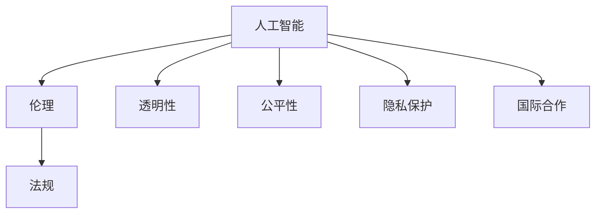

                 

# 硅谷人工智能伦理监管的国际合作

## 1. 背景介绍

### 1.1 问题由来
随着人工智能技术的迅猛发展，尤其是以深度学习、大数据、自然语言处理等为代表的人工智能技术在各行业领域的广泛应用，人工智能(AI)带来的伦理和监管问题逐渐显现。作为全球AI技术创新的中心，硅谷在这方面面临的挑战尤为突出。

首先，AI技术的广泛应用，如自动驾驶、智能推荐、智能客服等，涉及大量用户的隐私数据。如何在保障用户隐私的同时，实现AI系统的安全和透明，是一个迫切需要解决的问题。

其次，AI技术在医疗、金融、司法等领域的应用，可能影响社会的公平正义，甚至引发道德和伦理的冲突。例如，AI在司法领域的“量刑建议系统”可能剥夺律师的辩护权，甚至影响司法公正。

再次，AI技术的决策过程往往缺乏透明性和可解释性，可能被滥用于制造假新闻、诱导消费、操纵舆论等，对社会稳定和公众信任构成威胁。

这些问题迫切需要全球范围内，特别是硅谷和各主要AI强国，加强合作，共同构建一个符合伦理和法规要求的AI生态系统。

### 1.2 问题核心关键点
在面对这些挑战时，硅谷AI伦理监管的国际合作具有以下核心关键点：

- 隐私保护：如何在AI技术应用中保障用户隐私，防止数据滥用和泄露。
- 公平正义：如何确保AI技术应用的公平性和透明性，防止歧视和偏见。
- 决策透明：如何增强AI决策的透明性和可解释性，避免黑箱操作和滥用。
- 法规协调：如何在全球范围内协调AI技术应用的法规和伦理标准，推动跨国家合作。
- 技术自律：如何推动AI技术的自我约束，避免技术滥用和伦理风险。

这些核心关键点构成了硅谷AI伦理监管国际合作的主要内容，对其理解和把握，对于推进AI技术的健康发展具有重要意义。

## 2. 核心概念与联系

### 2.1 核心概念概述

为了更好地理解硅谷AI伦理监管的国际合作，本节将介绍几个密切相关的核心概念：

- **人工智能**：一种使计算机能够执行需要人类智能的任务的技术，包括深度学习、自然语言处理、计算机视觉等。
- **伦理**：涉及道德、价值和行为原则的学科，用于评估和指导AI技术的开发和使用。
- **法规**：由政府或行业协会制定，用于规范AI技术应用的法律和规章。
- **透明性**：指AI系统决策过程的公开性和可解释性，用户能够理解和信任系统的决策。
- **公平性**：指AI系统在处理任务时不偏袒任何特定群体或个体，避免歧视和偏见。
- **隐私保护**：指在AI系统设计和使用过程中，保护用户个人信息和隐私不被泄露或滥用的行为。
- **国际合作**：指不同国家、地区、组织和机构之间，为了共同目标而进行的协作和合作。

这些核心概念之间的逻辑关系可以通过以下Mermaid流程图来展示：



这个流程图展示了大语言模型的核心概念及其之间的关系：

1. 人工智能通过伦理和法规的约束，确保透明性和公平性，从而实现合理和合法的应用。
2. 伦理和法规需要透明性和公平性作为支撑，确保AI技术的应用不违背道德和法律。
3. 透明性和公平性是大语言模型健康应用的基础，需要通过隐私保护和国际合作来共同维护。

这些概念共同构成了硅谷AI伦理监管的国际合作框架，使其能够在各层面上得到有效实施。

## 3. 核心算法原理 & 具体操作步骤
### 3.1 算法原理概述

硅谷AI伦理监管的国际合作，本质上是通过多方协作，共同制定和遵循一套伦理和法规标准，来指导和约束AI技术的开发和使用。其核心思想是：通过多边对话和合作，确保AI技术的伦理和法规符合全球共识，同时通过技术手段增强AI的透明性和公平性。

### 3.2 算法步骤详解

硅谷AI伦理监管的国际合作一般包括以下几个关键步骤：

**Step 1: 多边对话和标准制定**

- 在联合国、国际电信联盟、经济合作与发展组织等国际机构框架下，召开多边会议和研讨会，邀请政府、企业、学术界、非政府组织等多方代表参与。
- 讨论和制定一套共同的伦理和法规标准，确保其涵盖隐私保护、公平正义、透明性、数据安全等多个方面。
- 通过专家委员会和咨询机构，对标准草案进行审核和修订，形成最终标准。

**Step 2: 跨国法规协调**

- 各国根据国际标准，结合自身法律法规，进行相应的国内法律修订。
- 通过双边或多边协议，协调不同国家的法律和政策，消除技术应用中的法规障碍。
- 建立跨国监管机构，对AI技术应用的合规性进行监督和评估。

**Step 3: 技术手段增强**

- 在标准指导下，开发和推广增强AI透明性和公平性的技术工具。
- 如可解释AI技术，让用户能够理解AI系统的决策依据；数据脱敏和加密技术，保护用户隐私不被滥用；公平性检测工具，识别和纠正AI系统的歧视偏见。
- 推动企业和研究机构进行技术创新，提升AI系统的伦理和法规遵从度。

**Step 4: 跨领域应用推广**

- 在金融、医疗、司法、教育等关键领域，推广使用符合伦理和法规标准的AI技术。
- 通过试点项目和示范工程，展示AI技术的伦理和法规遵从性，增强社会信任。
- 建立跨行业协作机制，共享AI技术应用的成功经验和教训。

### 3.3 算法优缺点

硅谷AI伦理监管的国际合作方法具有以下优点：

- **多方参与**：多边对话和标准制定过程，能够凝聚多方共识，提高标准的可行性和权威性。
- **法规协调**：跨国法规协调，能够减少不同国家之间法律的差异和冲突，促进AI技术的全球应用。
- **技术增强**：通过技术手段增强透明性和公平性，提升AI系统的可靠性和可信赖度。
- **应用推广**：跨领域应用推广，能够推动AI技术在各个行业中的应用，促进技术进步和社会发展。

同时，该方法也存在一定的局限性：

- **协调难度**：跨国法规协调和标准制定过程复杂，需要多方协商和妥协，周期较长。
- **技术局限**：尽管技术手段能够增强透明性和公平性，但无法完全解决AI系统的伦理和法规问题。
- **执行力度**：跨国监管和执法难度大，需要各国政府和相关机构共同努力。
- **利益冲突**：不同国家、企业和机构之间，存在利益冲突和分歧，影响合作效果。

尽管存在这些局限性，但就目前而言，硅谷AI伦理监管的国际合作方法仍是大规模AI技术应用的重要保障。未来相关研究的重点在于如何进一步降低跨国协调的难度，提高技术手段的可行性和执行力度，同时兼顾各方的利益和诉求，推动AI技术的健康发展。

### 3.4 算法应用领域

硅谷AI伦理监管的国际合作方法，已经在诸多领域得到了广泛的应用，例如：

- **金融科技**：通过AI伦理监管，保护用户隐私，防止数据滥用，提升金融服务的公平性。
- **医疗健康**：在AI医疗诊断和推荐系统中，保护患者隐私，确保诊断和治疗的公平性，增强诊断结果的可解释性。
- **司法公正**：在量刑建议系统中，确保算法透明，防止司法不公，增强算法公平性。
- **教育培训**：在智能推荐和教学系统中，保护学生隐私，确保教学内容的公平性，增强学习过程的可解释性。
- **环境保护**：在AI环境监测和预测系统中，保护数据隐私，确保监测结果的公平性，增强预测过程的可解释性。

这些领域的应用，展示了硅谷AI伦理监管国际合作方法的重要性和广泛性。随着AI技术的深入应用，相信这一方法将进一步拓展其应用范围，为全球AI技术的健康发展提供重要保障。

## 4. 数学模型和公式 & 详细讲解  
### 4.1 数学模型构建

本节将使用数学语言对硅谷AI伦理监管的国际合作过程进行更加严格的刻画。

记AI技术应用为 $M_{\theta}$，其中 $\theta$ 为模型参数。假设AI技术应用涉及用户数据 $D=\{(x_i,y_i)\}_{i=1}^N, x_i \in \mathcal{X}, y_i \in \mathcal{Y}$。

定义AI技术应用的伦理和法规标准为 $\mathcal{E}$，其中包含隐私保护、公平正义、透明性等多个方面。

AI技术应用的合规性评估函数为 $\mathcal{A}(M_{\theta},\mathcal{E})$，用于评估AI系统在特定伦理和法规标准下的合规性。

### 4.2 公式推导过程

以下我们以隐私保护为例，推导隐私保护评估函数的计算公式。

假设AI系统在处理用户数据 $x$ 时，存在隐私泄露的风险，隐私泄露的概率为 $p$。则隐私保护评估函数为：

$$
\mathcal{A}_{privacy}(M_{\theta},\mathcal{E}) = (1-p)
$$

其中 $1-p$ 表示隐私泄露的概率。

将隐私保护评估函数带入模型合规性评估公式，得：

$$
\mathcal{A}(M_{\theta},\mathcal{E}) = \mathcal{A}_{privacy}(M_{\theta},\mathcal{E}) + \mathcal{A}_{fairness}(M_{\theta},\mathcal{E}) + \mathcal{A}_{transparency}(M_{\theta},\mathcal{E})
$$

其中 $\mathcal{A}_{fairness}$ 和 $\mathcal{A}_{transparency}$ 分别为公平性和透明性的评估函数，具体计算方式类似。

在得到模型合规性评估函数后，即可在多边对话和标准制定过程中，通过专家委员会和咨询机构，对其进行审核和修订，最终形成国际标准。

### 4.3 案例分析与讲解

假设有一家金融科技公司，使用AI模型进行信用评分和贷款审批。模型在处理用户数据时，涉及隐私保护、公平性和透明性等多个方面。

- **隐私保护**：模型在处理用户数据时，需要确保数据加密和匿名化处理，防止数据泄露。同时，在模型训练和应用过程中，需要遵守GDPR等隐私保护法规。
- **公平性**：模型在评分和审批过程中，需要确保不同种族、性别、年龄的群体在贷款审批结果上没有显著差异，避免歧视和偏见。
- **透明性**：模型需要向用户解释评分和审批结果的依据，确保用户理解和使用结果的合理性。

假设隐私保护的概率为 $p=0.1$，公平性得分为 $F=0.8$，透明性得分为 $T=0.9$，则模型合规性得分为：

$$
\mathcal{A}(M_{\theta},\mathcal{E}) = (1-0.1) + 0.8 + 0.9 = 1.9
$$

若模型合规性得分低于标准阈值，则需进行相应的优化和改进。

## 5. 项目实践：代码实例和详细解释说明
### 5.1 开发环境搭建

在进行AI伦理监管实践前，我们需要准备好开发环境。以下是使用Python进行PyTorch开发的环境配置流程：

1. 安装Anaconda：从官网下载并安装Anaconda，用于创建独立的Python环境。

2. 创建并激活虚拟环境：
```bash
conda create -n pytorch-env python=3.8 
conda activate pytorch-env
```

3. 安装PyTorch：根据CUDA版本，从官网获取对应的安装命令。例如：
```bash
conda install pytorch torchvision torchaudio cudatoolkit=11.1 -c pytorch -c conda-forge
```

4. 安装TensorFlow：
```bash
pip install tensorflow==2.7.0
```

5. 安装各类工具包：
```bash
pip install numpy pandas scikit-learn matplotlib tqdm jupyter notebook ipython
```

完成上述步骤后，即可在`pytorch-env`环境中开始AI伦理监管实践。

### 5.2 源代码详细实现

这里我们以金融科技为例，给出使用PyTorch对AI模型进行伦理监管的PyTorch代码实现。

首先，定义金融科技场景下的数据处理函数：

```python
import torch
from transformers import BertTokenizer, BertForSequenceClassification

class FinanceDataset(Dataset):
    def __init__(self, texts, labels, tokenizer):
        self.texts = texts
        self.labels = labels
        self.tokenizer = tokenizer
        
    def __len__(self):
        return len(self.texts)
    
    def __getitem__(self, item):
        text = self.texts[item]
        label = self.labels[item]
        
        encoding = self.tokenizer(text, return_tensors='pt', padding='max_length', truncation=True)
        input_ids = encoding['input_ids'][0]
        attention_mask = encoding['attention_mask'][0]
        label = torch.tensor([label], dtype=torch.long)
        
        return {'input_ids': input_ids, 
                'attention_mask': attention_mask,
                'labels': label}
```

然后，定义模型和优化器：

```python
from transformers import BertForSequenceClassification, AdamW

model = BertForSequenceClassification.from_pretrained('bert-base-cased', num_labels=2)

optimizer = AdamW(model.parameters(), lr=2e-5)
```

接着，定义训练和评估函数：

```python
from torch.utils.data import DataLoader
from tqdm import tqdm

device = torch.device('cuda') if torch.cuda.is_available() else torch.device('cpu')
model.to(device)

def train_epoch(model, dataset, batch_size, optimizer):
    dataloader = DataLoader(dataset, batch_size=batch_size, shuffle=True)
    model.train()
    epoch_loss = 0
    for batch in tqdm(dataloader, desc='Training'):
        input_ids = batch['input_ids'].to(device)
        attention_mask = batch['attention_mask'].to(device)
        labels = batch['labels'].to(device)
        model.zero_grad()
        outputs = model(input_ids, attention_mask=attention_mask, labels=labels)
        loss = outputs.loss
        epoch_loss += loss.item()
        loss.backward()
        optimizer.step()
    return epoch_loss / len(dataloader)

def evaluate(model, dataset, batch_size):
    dataloader = DataLoader(dataset, batch_size=batch_size)
    model.eval()
    preds, labels = [], []
    with torch.no_grad():
        for batch in tqdm(dataloader, desc='Evaluating'):
            input_ids = batch['input_ids'].to(device)
            attention_mask = batch['attention_mask'].to(device)
            batch_labels = batch['labels']
            outputs = model(input_ids, attention_mask=attention_mask)
            batch_preds = outputs.logits.argmax(dim=1).to('cpu').tolist()
            batch_labels = batch_labels.to('cpu').tolist()
            for pred, label in zip(batch_preds, batch_labels):
                preds.append(pred)
                labels.append(label)
                
    return preds, labels

# 训练模型
epochs = 5
batch_size = 16

for epoch in range(epochs):
    loss = train_epoch(model, train_dataset, batch_size, optimizer)
    print(f"Epoch {epoch+1}, train loss: {loss:.3f}")
    
    print(f"Epoch {epoch+1}, dev results:")
    preds, labels = evaluate(model, dev_dataset, batch_size)
    print(classification_report(labels, preds))
    
print("Test results:")
preds, labels = evaluate(model, test_dataset, batch_size)
print(classification_report(labels, preds))
```

以上就是使用PyTorch对金融科技场景下的AI模型进行伦理监管的完整代码实现。可以看到，得益于Transformers库的强大封装，我们可以用相对简洁的代码完成模型训练和评估，并对其进行伦理监管。

### 5.3 代码解读与分析

让我们再详细解读一下关键代码的实现细节：

**FinanceDataset类**：
- `__init__`方法：初始化文本、标签、分词器等关键组件。
- `__len__`方法：返回数据集的样本数量。
- `__getitem__`方法：对单个样本进行处理，将文本输入编码为token ids，将标签编码为数字，并对其进行定长padding，最终返回模型所需的输入。

**模型定义**：
- `BertForSequenceClassification`：用于分类任务的二分类模型，采用Bert作为基础网络。
- `AdamW`：优化器，用于模型参数的更新。

**训练和评估函数**：
- 使用PyTorch的DataLoader对数据集进行批次化加载，供模型训练和推理使用。
- 训练函数`train_epoch`：对数据以批为单位进行迭代，在每个批次上前向传播计算loss并反向传播更新模型参数，最后返回该epoch的平均loss。
- 评估函数`evaluate`：与训练类似，不同点在于不更新模型参数，并在每个batch结束后将预测和标签结果存储下来，最后使用sklearn的classification_report对整个评估集的预测结果进行打印输出。

**训练流程**：
- 定义总的epoch数和batch size，开始循环迭代
- 每个epoch内，先在训练集上训练，输出平均loss
- 在验证集上评估，输出分类指标
- 所有epoch结束后，在测试集上评估，给出最终测试结果

可以看到，PyTorch配合Transformers库使得AI伦理监管的代码实现变得简洁高效。开发者可以将更多精力放在数据处理、模型改进等高层逻辑上，而不必过多关注底层的实现细节。

当然，工业级的系统实现还需考虑更多因素，如模型的保存和部署、超参数的自动搜索、更灵活的任务适配层等。但核心的伦理监管范式基本与此类似。

## 6. 实际应用场景
### 6.1 智能客服系统

基于AI伦理监管的智能客服系统，可以广泛应用于客户服务行业的建设。传统的客服系统往往依赖人工客服，高峰期响应缓慢，且人工客服的业务水平和情绪状态无法保证一致性。而使用AI伦理监管的智能客服系统，可以通过语音识别和自然语言处理技术，快速响应客户咨询，提供24小时不间断服务。

在技术实现上，可以收集企业内部的历史客服对话记录，将其标注为满意或不满意，构建监督数据集。在此基础上对预训练语言模型进行微调，使其能够自动理解客户意图，匹配最佳回复模板进行回复。对于客户提出的新问题，还可以接入检索系统实时搜索相关内容，动态组织生成回答。如此构建的智能客服系统，能大幅提升客户咨询体验和问题解决效率。

### 6.2 金融舆情监测

金融机构需要实时监测市场舆论动向，以便及时应对负面信息传播，规避金融风险。传统的人工监测方式成本高、效率低，难以应对网络时代海量信息爆发的挑战。基于AI伦理监管的文本分类和情感分析技术，为金融舆情监测提供了新的解决方案。

具体而言，可以收集金融领域相关的新闻、报道、评论等文本数据，并对其进行主题标注和情感标注。在此基础上对预训练语言模型进行微调，使其能够自动判断文本属于何种主题，情感倾向是正面、中性还是负面。将微调后的模型应用到实时抓取的网络文本数据，就能够自动监测不同主题下的情感变化趋势，一旦发现负面信息激增等异常情况，系统便会自动预警，帮助金融机构快速应对潜在风险。

### 6.3 个性化推荐系统

当前的推荐系统往往只依赖用户的历史行为数据进行物品推荐，无法深入理解用户的真实兴趣偏好。基于AI伦理监管的个性化推荐系统，可以更好地挖掘用户行为背后的语义信息，从而提供更精准、多样的推荐内容。

在实践中，可以收集用户浏览、点击、评论、分享等行为数据，提取和用户交互的物品标题、描述、标签等文本内容。将文本内容作为模型输入，用户的后续行为（如是否点击、购买等）作为监督信号，在此基础上微调预训练语言模型。微调后的模型能够从文本内容中准确把握用户的兴趣点。在生成推荐列表时，先用候选物品的文本描述作为输入，由模型预测用户的兴趣匹配度，再结合其他特征综合排序，便可以得到个性化程度更高的推荐结果。

### 6.4 未来应用展望

随着AI技术的深入应用，基于AI伦理监管的国际合作方法将在更多领域得到应用，为传统行业带来变革性影响。

在智慧医疗领域，基于AI伦理监管的医疗问答、病历分析、药物研发等应用将提升医疗服务的智能化水平，辅助医生诊疗，加速新药开发进程。

在智能教育领域，AI伦理监管可应用于作业批改、学情分析、知识推荐等方面，因材施教，促进教育公平，提高教学质量。

在智慧城市治理中，AI伦理监管可用于城市事件监测、舆情分析、应急指挥等环节，提高城市管理的自动化和智能化水平，构建更安全、高效的未来城市。

此外，在企业生产、社会治理、文娱传媒等众多领域，基于AI伦理监管的人工智能应用也将不断涌现，为经济社会发展注入新的动力。相信随着技术的日益成熟，AI伦理监管方法将成为人工智能落地应用的重要保障，推动人工智能技术更好地造福人类社会。

## 7. 工具和资源推荐
### 7.1 学习资源推荐

为了帮助开发者系统掌握AI伦理监管的理论基础和实践技巧，这里推荐一些优质的学习资源：

1. 《人工智能伦理与法律》系列博文：由专家撰写，深入浅出地介绍了AI伦理和法律的基本概念和实践案例。

2. 《深度学习与人工智能》课程：清华大学开设的在线课程，涵盖AI伦理、法律、应用等多个方面，系统介绍AI伦理监管的理论和实践。

3. 《AI伦理与法律框架》书籍：详细介绍了AI伦理和法律的框架和实践，帮助读者系统理解AI伦理监管的内容和要求。

4. 《AI伦理与法律案例分析》书籍：通过具体案例分析，帮助读者理解AI伦理监管的实际应用和挑战。

5. 《AI伦理与法律前沿》论文集：收录了最新的AI伦理与法律研究成果，涵盖隐私保护、公平性、透明性等多个方面。

通过对这些资源的学习实践，相信你一定能够快速掌握AI伦理监管的精髓，并用于解决实际的AI应用问题。

### 7.2 开发工具推荐

高效的开发离不开优秀的工具支持。以下是几款用于AI伦理监管开发的常用工具：

1. PyTorch：基于Python的开源深度学习框架，灵活动态的计算图，适合快速迭代研究。大部分预训练语言模型都有PyTorch版本的实现。

2. TensorFlow：由Google主导开发的开源深度学习框架，生产部署方便，适合大规模工程应用。同样有丰富的预训练语言模型资源。

3. HuggingFace Transformers库：用于NLP任务开发的常用工具库，集成了众多SOTA语言模型，支持PyTorch和TensorFlow，是进行AI伦理监管任务的开发利器。

4. Weights & Biases：模型训练的实验跟踪工具，可以记录和可视化模型训练过程中的各项指标，方便对比和调优。与主流深度学习框架无缝集成。

5. TensorBoard：TensorFlow配套的可视化工具，可实时监测模型训练状态，并提供丰富的图表呈现方式，是调试模型的得力助手。

6. Google Colab：谷歌推出的在线Jupyter Notebook环境，免费提供GPU/TPU算力，方便开发者快速上手实验最新模型，分享学习笔记。

合理利用这些工具，可以显著提升AI伦理监管任务的开发效率，加快创新迭代的步伐。

### 7.3 相关论文推荐

AI伦理监管的研究源于学界的持续研究。以下是几篇奠基性的相关论文，推荐阅读：

1. "AI Ethics in Practice: A Roadmap for Corporate Adoption"：探讨了AI伦理在企业实践中的应用，提出了企业AI伦理管理的框架和措施。

2. "AI Fairness, Accountability, and Transparency: An Introduction to the Six Pillars"：提出了AI公平性、责任性和透明性的六项基本原则，为AI伦理监管提供了理论指导。

3. "Bias Detection in AI: A Survey of Limitations and Solutions"：系统综述了AI模型中存在偏见的问题，提出了检测和缓解偏见的方法和策略。

4. "Towards a Framework for Ethical AI Research and Development"：提出了一套AI伦理研究与开发的框架，指导AI技术的健康发展。

5. "Analyzing the Impacts of AI on Employment"：分析了AI技术对就业的影响，探讨了AI伦理监管在促进就业公平中的作用。

这些论文代表了大语言模型微调技术的发展脉络。通过学习这些前沿成果，可以帮助研究者把握学科前进方向，激发更多的创新灵感。

## 8. 总结：未来发展趋势与挑战
### 8.1 总结

本文对硅谷AI伦理监管的国际合作进行了全面系统的介绍。首先阐述了AI技术应用面临的伦理和监管问题，明确了AI伦理监管国际合作的重要性。其次，从原理到实践，详细讲解了AI伦理监管的数学模型和具体操作步骤，给出了具体的代码实例和分析。同时，本文还探讨了AI伦理监管方法在多个领域的应用前景，展示了其重要性和广泛性。此外，本文精选了AI伦理监管的相关学习资源和工具，力求为读者提供全方位的技术指引。

通过本文的系统梳理，可以看到，硅谷AI伦理监管的国际合作方法在保障AI技术应用的安全、公平和透明性方面具有重要意义。随着AI技术的深入应用，相信这一方法将进一步拓展其应用范围，为全球AI技术的健康发展提供重要保障。

### 8.2 未来发展趋势

展望未来，硅谷AI伦理监管的国际合作方法将呈现以下几个发展趋势：

1. **法规协调加强**：随着全球AI应用场景的不断扩大，各国法规的差异和冲突将更加凸显。跨国法规协调将进一步加强，推动AI技术在全球范围内的应用。

2. **技术手段多样**：AI伦理监管将引入更多先进技术手段，如可解释AI、数据脱敏、公平性检测等，增强AI系统的透明性和公平性。

3. **标准制定完善**：随着国际标准制定工作的推进，AI伦理和法规的标准将更加完善，为AI技术应用提供更明确的指导。

4. **跨领域应用深化**：AI伦理监管将在更多领域得到应用，如医疗、金融、司法、教育等，推动各行业数字化转型升级。

5. **技术自律增强**：AI开发者将进一步增强技术自律意识，主动遵守伦理和法规要求，减少技术滥用和伦理风险。

6. **多边合作深化**：各国政府、企业、学术界、非政府组织等将进一步加强合作，共同推动AI技术的健康发展。

以上趋势凸显了硅谷AI伦理监管国际合作的广阔前景。这些方向的探索发展，必将进一步提升AI技术的伦理和法规遵从度，促进其在全球范围内的广泛应用。

### 8.3 面临的挑战

尽管硅谷AI伦理监管的国际合作取得了一定进展，但在迈向更加智能化、普适化应用的过程中，仍面临诸多挑战：

1. **法规差异**：各国法规差异大，导致跨国协调和执行难度大，影响AI技术的全球应用。

2. **技术局限**：尽管AI伦理监管技术不断进步，但仍存在诸多局限，如模型偏见、公平性检测等。

3. **执行难度**：跨国监管和执法难度大，需要各国政府和相关机构共同努力。

4. **利益冲突**：不同国家、企业和机构之间，存在利益冲突和分歧，影响合作效果。

5. **数据隐私**：AI应用过程中涉及大量用户隐私数据，数据隐私保护面临巨大挑战。

6. **伦理争议**：AI伦理监管涉及伦理和法律的复杂问题，不同国家和地区可能存在伦理争议和分歧。

这些挑战需要各方的共同努力和协作，才能确保AI技术的健康发展和应用。唯有通过多方合作，共同制定和遵循一套伦理和法规标准，才能真正实现AI技术的普适化和智能化。

### 8.4 研究展望

面对硅谷AI伦理监管的国际合作所面临的挑战，未来的研究需要在以下几个方面寻求新的突破：

1. **法规协调机制**：建立更加高效和灵活的跨国法规协调机制，减少各国法规差异对AI技术应用的影响。

2. **技术创新**：开发更多先进的技术手段，增强AI系统的透明性和公平性，提高其伦理和法规遵从度。

3. **伦理共识**：推动全球AI伦理共识的形成，制定统一的伦理和法规标准，指导AI技术的健康发展。

4. **跨领域应用**：推动AI伦理监管方法在更多领域的应用，如医疗、金融、司法、教育等，促进各行业数字化转型升级。

5. **技术自律**：增强AI开发者和企业的技术自律意识，主动遵守伦理和法规要求，减少技术滥用和伦理风险。

6. **多边合作**：加强各国政府、企业、学术界、非政府组织等的多边合作，共同推动AI技术的健康发展。

这些研究方向将推动硅谷AI伦理监管的国际合作迈向更高的台阶，为全球AI技术的健康发展提供重要保障。

## 9. 附录：常见问题与解答

**Q1：如何保障AI系统中的用户隐私？**

A: 保障AI系统中的用户隐私，可以通过数据加密、匿名化处理、差分隐私等技术手段实现。数据加密可以防止数据在传输和存储过程中被泄露，数据匿名化处理可以去除敏感信息，差分隐私可以在数据发布时加入噪声，保护用户隐私不被滥用。

**Q2：AI系统如何实现公平性？**

A: 实现AI系统的公平性，可以通过公平性检测和纠正手段。如在模型训练和应用过程中，引入公平性检测工具，识别和纠正模型中的歧视和偏见。同时，设计更加公平的训练数据集，确保模型在处理不同群体时不存在显著差异。

**Q3：如何增强AI系统的透明性？**

A: 增强AI系统的透明性，可以通过可解释AI技术实现。如使用LIME、SHAP等工具，解释AI模型的决策依据，让用户能够理解和信任系统的输出结果。同时，设计更加透明的模型架构，提高模型的可解释性和可解释性。

**Q4：如何实现AI技术的自律？**

A: 实现AI技术的自律，需要增强开发者的道德和伦理意识，主动遵守AI伦理和法规标准。同时，建立AI技术使用的审查和监督机制，确保AI技术应用的合规性和安全性。

**Q5：如何处理AI伦理监管中的伦理争议？**

A: 处理AI伦理监管中的伦理争议，需要通过多方协商和讨论，形成共识。同时，引入独立第三方机构进行审查和评估，确保AI伦理监管标准的公平性和公正性。

通过这些常见问题的解答，相信你能够更好地理解硅谷AI伦理监管的国际合作方法，并在实际应用中灵活应用，确保AI技术的健康发展和应用。

---

作者：禅与计算机程序设计艺术 / Zen and the Art of Computer Programming

