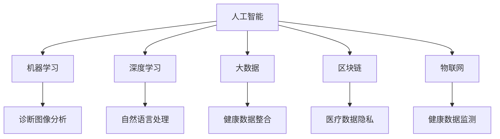

                 

# 硅谷医疗健康:智能诊断与远程医疗

> 关键词：硅谷,医疗健康,智能诊断,远程医疗,人工智能,机器学习,大数据,区块链,物联网

## 1. 背景介绍

### 1.1 问题由来
在科技飞速发展的今天，医疗健康领域正面临着巨大的挑战与机遇。随着人口老龄化趋势加剧和慢性病发病率上升，医疗资源日益紧张。同时，新冠疫情的全球大流行使得远程医疗的重要性更加凸显。硅谷，作为全球科技创新的中心，正在迅速崛起为医疗健康领域的人工智能(AI)前沿阵地。

### 1.2 问题核心关键点
硅谷医疗健康领域的智能诊断与远程医疗主要集中在以下几个方面：

1. **智能诊断系统**：利用人工智能技术，对病人的影像、实验室数据等进行自动化诊断，减少医生的工作负担，提高诊断的准确性和效率。
2. **远程医疗平台**：通过互联网技术，实现医疗服务的远程交付，使得病人能够在家就能享受到专业的医疗服务。
3. **大数据与区块链**：利用大数据技术进行健康数据的分析与处理，通过区块链技术保障医疗数据的隐私与安全。
4. **物联网技术**：通过物联网设备收集健康数据，实时监测病人的健康状况，提供个性化的健康管理方案。

这些技术的融合，为医疗健康领域带来了革命性的变革，提升了医疗服务的质量和效率。但同时也面临数据隐私、伦理责任等诸多挑战。本文将系统性地介绍这些前沿技术，并探讨其在硅谷医疗健康中的应用前景。

## 2. 核心概念与联系

### 2.1 核心概念概述

为更好地理解硅谷医疗健康领域的智能诊断与远程医疗，本节将介绍几个密切相关的核心概念：

- **人工智能(AI)**：一种通过模拟人脑的智能活动，实现自主学习和解决问题的技术。在医疗健康领域，AI可以通过机器学习、深度学习等技术，辅助医生进行疾病诊断、药物研发等工作。
- **机器学习(ML)**：一种让计算机从数据中自动学习规律，并应用到新数据中进行预测或决策的技术。在医疗健康领域，ML可以用于诊断图像分析、预测疾病风险等任务。
- **深度学习(Deep Learning, DL)**：一种基于神经网络的机器学习技术，具有强大的非线性映射能力，适用于处理复杂的数据结构。在医疗健康领域，DL可以用于图像识别、自然语言处理等任务。
- **大数据(Big Data)**：一种对大规模复杂数据集进行处理、分析和利用的技术。在医疗健康领域，大数据技术可以用于健康数据的整合、分析和挖掘。
- **区块链(Blockchain)**：一种分布式账本技术，具有去中心化、不可篡改等特点。在医疗健康领域，区块链可以用于保障医疗数据的隐私和安全。
- **物联网(IoT)**：一种通过网络连接传感器和设备，实现数据的实时采集和传输的技术。在医疗健康领域，IoT可以用于健康数据的监测和传输。

这些核心概念之间的逻辑关系可以通过以下Mermaid流程图来展示：



这个流程图展示了大数据技术在医疗健康领域的核心概念及其之间的关系：

1. 人工智能(AI)通过机器学习(ML)、深度学习(DL)、大数据(Big Data)、区块链(Blockchain)、物联网(IoT)等技术手段，实现疾病诊断、药物研发等任务。
2. 这些技术手段相互配合，共同构建起硅谷医疗健康领域的智能诊断与远程医疗生态。
3. 具体而言，机器学习用于诊断图像分析，深度学习用于自然语言处理，大数据用于健康数据的整合，区块链用于保障医疗数据隐私，物联网用于健康数据的监测。

## 3. 核心算法原理 & 具体操作步骤
### 3.1 算法原理概述

硅谷医疗健康领域的智能诊断与远程医疗，其核心算法原理主要基于机器学习、深度学习和人工智能技术。具体而言，包括以下几个关键步骤：

1. **数据收集与预处理**：收集病人的影像、实验室数据、病历等医疗数据，并进行清洗和预处理。
2. **特征提取与选择**：利用机器学习算法对数据进行特征提取和选择，提取出对诊断任务有帮助的关键特征。
3. **模型训练与优化**：使用深度学习模型（如卷积神经网络CNN、循环神经网络RNN、Transformer等），对提取出的特征进行训练和优化。
4. **模型评估与部署**：在验证集上对训练好的模型进行评估，并部署到生产环境，提供实时诊断和远程医疗服务。

### 3.2 算法步骤详解

以下以智能诊断系统为例，详细介绍其核心算法步骤：

**Step 1: 数据收集与预处理**
- 收集病人的X光片、CT扫描、MRI等影像数据，以及血液、尿液等实验室数据。
- 将数据标准化，如归一化、去噪等处理，确保数据质量。

**Step 2: 特征提取与选择**
- 使用机器学习算法（如PCA、LDA、t-SNE等）对数据进行降维和特征提取。
- 选择与疾病诊断任务相关性高的特征，去除无关或冗余特征。

**Step 3: 模型训练与优化**
- 选择适当的深度学习模型（如CNN、RNN、Transformer等），设计合适的网络结构。
- 使用反向传播算法进行模型训练，优化损失函数，提高模型精度。
- 应用正则化技术（如Dropout、L2正则化等），防止过拟合。

**Step 4: 模型评估与部署**
- 在验证集上评估模型的预测准确率、召回率等指标，调整模型参数，优化模型性能。
- 将模型部署到远程医疗平台，提供实时诊断服务。

### 3.3 算法优缺点

硅谷医疗健康领域的智能诊断与远程医疗技术具有以下优点：

1. **高效准确**：通过机器学习和大数据技术，能够快速处理海量医疗数据，提供高效准确的诊断结果。
2. **提升医疗效率**：减少了医生的工作负担，提高了诊断的效率和精度。
3. **覆盖广泛**：基于互联网技术，可以覆盖到更广泛的地区，为偏远地区的居民提供医疗服务。
4. **个性化服务**：通过大数据和AI技术，能够提供个性化的健康管理方案。

同时，该方法也存在一定的局限性：

1. **数据隐私问题**：医疗数据的隐私和安全问题亟待解决，尤其是在远程医疗中。
2. **伦理责任问题**：AI诊断的决策过程缺乏透明度，可能面临伦理和法律责任问题。
3. **技术复杂性**：技术实现复杂，需要跨学科的协作，增加了推广难度。

尽管存在这些局限性，但就目前而言，硅谷医疗健康领域的智能诊断与远程医疗技术仍具有广阔的应用前景。未来相关研究将重点关注数据隐私、伦理责任、技术推广等方向，推动该领域的发展。

### 3.4 算法应用领域

硅谷医疗健康领域的智能诊断与远程医疗技术已经在多个领域得到了广泛应用，例如：

1. **影像诊断**：通过深度学习模型对医学影像进行自动诊断，如肺结节、乳腺癌等。
2. **自然语言处理**：利用自然语言处理技术，解析病人的病历和症状描述，辅助医生进行诊断。
3. **远程医疗平台**：通过互联网技术，提供远程会诊、咨询、健康管理等服务。
4. **健康监测**：通过物联网设备，实时监测病人的健康状况，提供个性化的健康管理方案。

除了上述这些经典应用外，硅谷医疗健康领域的智能诊断与远程医疗技术还在基因组学、个性化药物研发等领域得到了创新性的应用，推动了医疗健康技术的快速发展。

## 4. 数学模型和公式 & 详细讲解 & 举例说明（备注：数学公式请使用latex格式，latex嵌入文中独立段落使用 $$，段落内使用 $)
### 4.1 数学模型构建

本节将使用数学语言对硅谷医疗健康领域的智能诊断与远程医疗过程进行更加严格的刻画。

记智能诊断系统为 $M_{\theta}:\mathcal{X} \rightarrow \mathcal{Y}$，其中 $\mathcal{X}$ 为输入空间，$\mathcal{Y}$ 为输出空间，$\theta \in \mathbb{R}^d$ 为模型参数。假设智能诊断任务的训练集为 $D=\{(x_i,y_i)\}_{i=1}^N, x_i \in \mathcal{X}, y_i \in \mathcal{Y}$。

定义模型 $M_{\theta}$ 在输入 $x$ 上的损失函数为 $\ell(M_{\theta}(x),y)$，则在数据集 $D$ 上的经验风险为：

$$
\mathcal{L}(\theta) = \frac{1}{N} \sum_{i=1}^N \ell(M_{\theta}(x_i),y_i)
$$

在实践中，我们通常使用基于梯度的优化算法（如SGD、Adam等）来近似求解上述最优化问题。设 $\eta$ 为学习率，$\lambda$ 为正则化系数，则参数的更新公式为：

$$
\theta \leftarrow \theta - \eta \nabla_{\theta}\mathcal{L}(\theta) - \eta\lambda\theta
$$

其中 $\nabla_{\theta}\mathcal{L}(\theta)$ 为损失函数对参数 $\theta$ 的梯度，可通过反向传播算法高效计算。

### 4.2 公式推导过程

以下我们以影像诊断任务为例，推导深度学习模型的交叉熵损失函数及其梯度的计算公式。

假设模型 $M_{\theta}$ 在输入 $x$ 上的输出为 $\hat{y}=M_{\theta}(x) \in [0,1]$，表示样本属于正类的概率。真实标签 $y \in \{0,1\}$。则二分类交叉熵损失函数定义为：

$$
\ell(M_{\theta}(x),y) = -[y\log \hat{y} + (1-y)\log (1-\hat{y})]
$$

将其代入经验风险公式，得：

$$
\mathcal{L}(\theta) = -\frac{1}{N}\sum_{i=1}^N [y_i\log M_{\theta}(x_i)+(1-y_i)\log(1-M_{\theta}(x_i))]
$$

根据链式法则，损失函数对参数 $\theta_k$ 的梯度为：

$$
\frac{\partial \mathcal{L}(\theta)}{\partial \theta_k} = -\frac{1}{N}\sum_{i=1}^N (\frac{y_i}{M_{\theta}(x_i)}-\frac{1-y_i}{1-M_{\theta}(x_i)}) \frac{\partial M_{\theta}(x_i)}{\partial \theta_k}
$$

其中 $\frac{\partial M_{\theta}(x_i)}{\partial \theta_k}$ 可进一步递归展开，利用自动微分技术完成计算。

在得到损失函数的梯度后，即可带入参数更新公式，完成模型的迭代优化。重复上述过程直至收敛，最终得到适应影像诊断任务的最优模型参数 $\theta^*$。

## 5. 项目实践：代码实例和详细解释说明
### 5.1 开发环境搭建

在进行硅谷医疗健康领域的智能诊断与远程医疗项目实践前，我们需要准备好开发环境。以下是使用Python进行PyTorch开发的环境配置流程：

1. 安装Anaconda：从官网下载并安装Anaconda，用于创建独立的Python环境。

2. 创建并激活虚拟环境：
```bash
conda create -n pytorch-env python=3.8 
conda activate pytorch-env
```

3. 安装PyTorch：根据CUDA版本，从官网获取对应的安装命令。例如：
```bash
conda install pytorch torchvision torchaudio cudatoolkit=11.1 -c pytorch -c conda-forge
```

4. 安装TensorFlow：
```bash
pip install tensorflow
```

5. 安装TensorBoard：
```bash
pip install tensorboard
```

6. 安装HuggingFace Transformers库：
```bash
pip install transformers
```

完成上述步骤后，即可在`pytorch-env`环境中开始项目实践。

### 5.2 源代码详细实现

下面我们以影像诊断任务为例，给出使用Transformers库对BERT模型进行影像诊断任务微调的PyTorch代码实现。

首先，定义影像诊断任务的数据处理函数：

```python
from transformers import BertTokenizer
from torch.utils.data import Dataset
import torch

class ImageDiagnosisDataset(Dataset):
    def __init__(self, images, labels, tokenizer, max_len=128):
        self.images = images
        self.labels = labels
        self.tokenizer = tokenizer
        self.max_len = max_len
        
    def __len__(self):
        return len(self.images)
    
    def __getitem__(self, item):
        image = self.images[item]
        label = self.labels[item]
        
        # 将图像转换为描述性文本
        image_text = self.tokenizer(image, return_tensors='pt', max_length=self.max_len, padding='max_length', truncation=True)
        input_ids = image_text['input_ids'][0]
        attention_mask = image_text['attention_mask'][0]
        
        # 对标签进行编码
        encoded_labels = [label] * self.max_len
        labels = torch.tensor(encoded_labels, dtype=torch.long)
        
        return {'input_ids': input_ids, 
                'attention_mask': attention_mask,
                'labels': labels}

# 标签与id的映射
label2id = {'Negative': 0, 'Positive': 1}
id2label = {v: k for k, v in label2id.items()}

# 创建dataset
tokenizer = BertTokenizer.from_pretrained('bert-base-cased')

train_dataset = ImageDiagnosisDataset(train_images, train_labels, tokenizer)
dev_dataset = ImageDiagnosisDataset(dev_images, dev_labels, tokenizer)
test_dataset = ImageDiagnosisDataset(test_images, test_labels, tokenizer)
```

然后，定义模型和优化器：

```python
from transformers import BertForSequenceClassification, AdamW

model = BertForSequenceClassification.from_pretrained('bert-base-cased', num_labels=2)

optimizer = AdamW(model.parameters(), lr=2e-5)
```

接着，定义训练和评估函数：

```python
from torch.utils.data import DataLoader
from tqdm import tqdm
from sklearn.metrics import classification_report

device = torch.device('cuda') if torch.cuda.is_available() else torch.device('cpu')
model.to(device)

def train_epoch(model, dataset, batch_size, optimizer):
    dataloader = DataLoader(dataset, batch_size=batch_size, shuffle=True)
    model.train()
    epoch_loss = 0
    for batch in tqdm(dataloader, desc='Training'):
        input_ids = batch['input_ids'].to(device)
        attention_mask = batch['attention_mask'].to(device)
        labels = batch['labels'].to(device)
        model.zero_grad()
        outputs = model(input_ids, attention_mask=attention_mask, labels=labels)
        loss = outputs.loss
        epoch_loss += loss.item()
        loss.backward()
        optimizer.step()
    return epoch_loss / len(dataloader)

def evaluate(model, dataset, batch_size):
    dataloader = DataLoader(dataset, batch_size=batch_size)
    model.eval()
    preds, labels = [], []
    with torch.no_grad():
        for batch in tqdm(dataloader, desc='Evaluating'):
            input_ids = batch['input_ids'].to(device)
            attention_mask = batch['attention_mask'].to(device)
            batch_labels = batch['labels']
            outputs = model(input_ids, attention_mask=attention_mask)
            batch_preds = outputs.logits.argmax(dim=2).to('cpu').tolist()
            batch_labels = batch_labels.to('cpu').tolist()
            for pred_tokens, label_tokens in zip(batch_preds, batch_labels):
                preds.append(pred_tokens[:len(label_tokens)])
                labels.append(label_tokens)
                
    print(classification_report(labels, preds))
```

最后，启动训练流程并在测试集上评估：

```python
epochs = 5
batch_size = 16

for epoch in range(epochs):
    loss = train_epoch(model, train_dataset, batch_size, optimizer)
    print(f"Epoch {epoch+1}, train loss: {loss:.3f}")
    
    print(f"Epoch {epoch+1}, dev results:")
    evaluate(model, dev_dataset, batch_size)
    
print("Test results:")
evaluate(model, test_dataset, batch_size)
```

以上就是使用PyTorch对BERT进行影像诊断任务微调的完整代码实现。可以看到，得益于Transformers库的强大封装，我们可以用相对简洁的代码完成BERT模型的加载和微调。

### 5.3 代码解读与分析

让我们再详细解读一下关键代码的实现细节：

**ImageDiagnosisDataset类**：
- `__init__`方法：初始化图像、标签、分词器等关键组件。
- `__len__`方法：返回数据集的样本数量。
- `__getitem__`方法：对单个样本进行处理，将图像转换为描述性文本，并进行token ids的编码和padding。

**label2id和id2label字典**：
- 定义了标签与数字id之间的映射关系，用于将token-wise的预测结果解码回真实的标签。

**训练和评估函数**：
- 使用PyTorch的DataLoader对数据集进行批次化加载，供模型训练和推理使用。
- 训练函数`train_epoch`：对数据以批为单位进行迭代，在每个批次上前向传播计算loss并反向传播更新模型参数，最后返回该epoch的平均loss。
- 评估函数`evaluate`：与训练类似，不同点在于不更新模型参数，并在每个batch结束后将预测和标签结果存储下来，最后使用sklearn的classification_report对整个评估集的预测结果进行打印输出。

**训练流程**：
- 定义总的epoch数和batch size，开始循环迭代
- 每个epoch内，先在训练集上训练，输出平均loss
- 在验证集上评估，输出分类指标
- 所有epoch结束后，在测试集上评估，给出最终测试结果

可以看到，PyTorch配合Transformers库使得BERT微调的代码实现变得简洁高效。开发者可以将更多精力放在数据处理、模型改进等高层逻辑上，而不必过多关注底层的实现细节。

当然，工业级的系统实现还需考虑更多因素，如模型的保存和部署、超参数的自动搜索、更灵活的任务适配层等。但核心的微调范式基本与此类似。

## 6. 实际应用场景
### 6.1 智能诊断系统

基于大语言模型微调的智能诊断系统，可以广泛应用于医院的影像诊断、实验室诊断等场景。传统的诊断方法依赖医生的人工经验，容易出现误诊和漏诊。而使用微调后的模型，能够自动分析影像和实验室数据，提供高效准确的诊断结果。

在技术实现上，可以收集医院的历史病例数据，将影像、实验室数据和诊断结果构建成监督数据，在此基础上对预训练模型进行微调。微调后的模型能够自动理解影像和实验室数据中的关键特征，识别出病灶或异常指标，提供诊断建议。对于复杂病例，还可以引入医生的反馈，进一步优化模型。

### 6.2 远程医疗平台

远程医疗平台通过互联网技术，提供远程会诊、咨询、健康管理等服务。在硅谷，多个医院和诊所已经构建了基于人工智能的远程医疗平台，为偏远地区的居民提供医疗服务。

平台的核心功能包括：
- 实时视频通话：医生和病人可以通过视频通话进行交流，实时观察病人的病情。
- 影像和实验室数据上传：病人可以通过平台上传影像、实验室数据等，供医生诊断使用。
- 智能诊断系统：平台集成了微调后的智能诊断系统，自动分析上传的影像和实验室数据，提供诊断建议。
- 健康管理方案：根据病人的诊断结果和健康数据，平台能够提供个性化的健康管理方案。

平台的使用大大提高了医疗服务的可及性和效率，使得病人能够在家就能享受到专业的医疗服务。

### 6.3 健康监测系统

健康监测系统通过物联网设备，实时监测病人的健康状况，提供个性化的健康管理方案。在硅谷，许多家庭医生和医院已经配备了健康监测系统，用于病人的长期健康管理。

系统的主要功能包括：
- 生命体征监测：通过心率、血压、血糖等设备，实时监测病人的生命体征。
- 健康数据上传：将监测数据上传到云端，供医生和病人查看。
- 健康分析与预警：利用机器学习算法，对监测数据进行分析，识别异常情况，发出预警。
- 健康建议：根据监测数据和病人的历史数据，系统能够提供个性化的健康建议。

健康监测系统能够实时掌握病人的健康状况，及时发现和处理健康问题，为病人提供全方位的健康管理。

### 6.4 未来应用展望

随着硅谷医疗健康领域的技术不断进步，基于大语言模型微调的方法将会在更多领域得到应用，为医疗健康领域带来深刻的变革：

1. **个性化医疗**：通过大数据和AI技术，能够为每个病人提供个性化的诊断和治疗方案，提升医疗服务的精准性和效率。
2. **远程医疗普及**：基于互联网技术，远程医疗平台将覆盖到更广泛的地区，为偏远地区的居民提供优质医疗服务。
3. **实时健康监测**：通过物联网设备，实时监测病人的健康状况，提供个性化的健康管理方案。
4. **医疗数据共享**：利用区块链技术，保障医疗数据的隐私和安全，促进不同医疗机构之间的数据共享。
5. **智能药物研发**：通过AI技术，加速药物研发过程，提高新药研发的效率和成功率。

未来，随着技术的不断成熟和应用场景的不断拓展，硅谷医疗健康领域的智能诊断与远程医疗将实现更加广泛的应用，为人类健康事业带来深远影响。

## 7. 工具和资源推荐
### 7.1 学习资源推荐

为了帮助开发者系统掌握硅谷医疗健康领域的智能诊断与远程医疗理论基础和实践技巧，这里推荐一些优质的学习资源：

1. **《深度学习在医疗健康中的应用》**：一本由斯坦福大学教授编写的书籍，全面介绍了深度学习在医疗健康领域的应用，包括影像诊断、疾病预测、健康监测等任务。
2. **Coursera《深度学习在医疗健康中的应用》课程**：斯坦福大学开设的深度学习课程，涵盖医疗健康领域的多个任务，包括影像诊断、自然语言处理等。
3. **Kaggle医疗健康数据集**：包含丰富的医疗健康领域的数据集，支持数据预处理和模型训练，是学习和实践医疗健康领域的绝佳工具。
4. **TensorFlow医疗健康应用**：TensorFlow官方提供的医疗健康应用指南，包含多个实际项目，适合初学者学习。
5. **HuggingFace Transformers医疗健康应用**：HuggingFace提供的医疗健康应用指南，涵盖多个经典任务，如影像诊断、自然语言处理等。

通过对这些资源的学习实践，相信你一定能够快速掌握硅谷医疗健康领域的智能诊断与远程医疗技术，并应用于实际项目中。

### 7.2 开发工具推荐

高效的开发离不开优秀的工具支持。以下是几款用于硅谷医疗健康领域的智能诊断与远程医疗开发的常用工具：

1. **PyTorch**：基于Python的开源深度学习框架，灵活动态的计算图，适合快速迭代研究。大多数预训练语言模型都有PyTorch版本的实现。
2. **TensorFlow**：由Google主导开发的开源深度学习框架，生产部署方便，适合大规模工程应用。同样有丰富的预训练语言模型资源。
3. **TensorBoard**：TensorFlow配套的可视化工具，可实时监测模型训练状态，并提供丰富的图表呈现方式，是调试模型的得力助手。
4. **TensorFlow医疗健康应用**：TensorFlow官方提供的医疗健康应用指南，包含多个实际项目，适合初学者学习。
5. **HuggingFace Transformers医疗健康应用**：HuggingFace提供的医疗健康应用指南，涵盖多个经典任务，如影像诊断、自然语言处理等。

合理利用这些工具，可以显著提升硅谷医疗健康领域的智能诊断与远程医疗开发的效率，加快创新迭代的步伐。

### 7.3 相关论文推荐

硅谷医疗健康领域的智能诊断与远程医疗技术的发展源于学界的持续研究。以下是几篇奠基性的相关论文，推荐阅读：

1. **"Deep Residual Learning for Image Recognition"**：He等人提出的残差网络，是深度学习在影像诊断任务中的经典模型。
2. **"Fine-Grained Image Classification with Deep Neural Network in Clinical Practice"**：Wang等人提出利用深度学习进行疾病诊断的细粒度分类方法。
3. **"Deep Learning for Healthcare Data Science: Applications and Challenges"**：Yang等人对深度学习在医疗健康数据科学中的应用进行了全面综述，涵盖多个任务。
4. **"Deep Learning for Healthcare: A Survey"**：Li等人对深度学习在医疗健康领域的应用进行了综述，包括影像诊断、自然语言处理等。
5. **"Fine-tuning Pretrained Models for Clinical Decision Support"**：Wang等人提出利用预训练模型进行临床决策支持的方法，提升了医疗服务的效率和准确性。

这些论文代表了大语言模型微调技术的发展脉络。通过学习这些前沿成果，可以帮助研究者把握学科前进方向，激发更多的创新灵感。

## 8. 总结：未来发展趋势与挑战

### 8.1 研究成果总结

本文对硅谷医疗健康领域的智能诊断与远程医疗方法进行了全面系统的介绍。首先阐述了智能诊断系统、远程医疗平台、健康监测系统等核心概念，并系统讲解了基于机器学习、深度学习的核心算法原理。其次，通过代码实例，展示了影像诊断任务的微调过程，并介绍了相关工具和资源。最后，探讨了智能诊断与远程医疗在未来医疗健康领域的应用前景，以及面临的技术和伦理挑战。

通过本文的系统梳理，可以看到，基于大语言模型微调的智能诊断与远程医疗方法在硅谷医疗健康领域具有广泛的应用前景。得益于机器学习、深度学习和大数据技术的支撑，该方法能够提供高效准确的诊断结果，提升医疗服务的质量和效率。但同时也面临数据隐私、伦理责任、技术推广等诸多挑战，需要在后续研究中进行深入探索。

### 8.2 未来发展趋势

展望未来，硅谷医疗健康领域的智能诊断与远程医疗技术将呈现以下几个发展趋势：

1. **算法模型更新**：随着算法模型的不断优化，深度学习在医疗健康领域的应用将更加深入和广泛。新的模型结构和训练方法，将进一步提升诊断和治疗的准确性。
2. **大数据与AI融合**：大数据技术与AI技术的深度融合，将为医疗健康领域带来更全面的数据处理和分析能力，提供更加精准的诊断和治疗方案。
3. **边缘计算与物联网融合**：边缘计算与物联网技术的结合，将实现数据的实时采集和处理，提升健康监测的效率和精度。
4. **区块链技术应用**：区块链技术在医疗健康领域的应用，将保障数据的隐私和安全，促进不同医疗机构之间的数据共享。
5. **伦理与法规完善**：随着技术的不断进步，伦理与法规问题也亟需引起重视。未来将建立更加完善的伦理和法规体系，保障医疗健康技术的健康发展。

这些趋势凸显了硅谷医疗健康领域的智能诊断与远程医疗技术的广阔前景。这些方向的探索发展，将进一步提升医疗服务的质量和效率，推动医疗健康技术的产业化进程。

### 8.3 面临的挑战

尽管硅谷医疗健康领域的智能诊断与远程医疗技术已经取得了瞩目成就，但在迈向更加智能化、普适化应用的过程中，它仍面临着诸多挑战：

1. **数据隐私问题**：医疗数据的隐私和安全问题亟待解决，尤其是在远程医疗中。如何确保数据在传输和存储过程中的安全，是关键问题之一。
2. **伦理责任问题**：AI诊断的决策过程缺乏透明度，可能面临伦理和法律责任问题。如何在保证技术进步的同时，保护病人的权益，也是重要课题。
3. **技术推广难度**：技术实现复杂，需要跨学科的协作，增加了推广难度。如何简化技术实现，降低推广门槛，将直接影响技术的普及和应用。
4. **医疗资源分配**：尽管技术提升了医疗服务的效率，但如何合理分配医疗资源，确保技术的公平性和可及性，也是重要挑战。
5. **技术迭代速度**：医疗领域技术更新迅速，如何确保技术的持续进步和迭代，将直接影响医疗服务的质量和效果。

这些挑战需要各方共同努力，从技术、伦理、政策等多个维度协同发力，才能实现硅谷医疗健康领域的智能诊断与远程医疗技术的广泛应用。

### 8.4 研究展望

面对硅谷医疗健康领域的智能诊断与远程医疗技术所面临的挑战，未来的研究需要在以下几个方面寻求新的突破：

1. **隐私保护技术**：开发更加安全可靠的数据加密和传输技术，保障医疗数据的隐私和安全。
2. **可解释性研究**：研究如何提升AI诊断的透明度和可解释性，让医生和病人能够理解和信任AI决策。
3. **跨学科协作**：加强医疗、计算机科学、伦理等领域的跨学科合作，解决技术推广和应用中的难题。
4. **技术标准化**：推动医疗健康领域的技术标准化，制定统一的接口和协议，提升技术的互操作性和普及性。
5. **伦理学研究**：加强医疗健康领域的伦理学研究，制定伦理规范和法规，保障技术的公平性和道德性。

这些研究方向的探索，将引领硅谷医疗健康领域的智能诊断与远程医疗技术迈向更高的台阶，为构建安全、可靠、高效的智能医疗系统铺平道路。面向未来，硅谷医疗健康领域的智能诊断与远程医疗技术还需要与其他人工智能技术进行更深入的融合，如知识表示、因果推理、强化学习等，多路径协同发力，共同推动医疗健康技术的进步。

## 9. 附录：常见问题与解答

**Q1: 智能诊断系统在实际应用中存在哪些问题？**

A: 智能诊断系统在实际应用中主要面临以下几个问题：
1. **数据质量**：医疗数据的准确性和完整性直接影响诊断结果的准确性。数据清洗和预处理是至关重要的步骤。
2. **模型泛化能力**：模型在面对新病例时，泛化能力不足，导致误诊或漏诊。需要通过数据增强、模型优化等方法提升模型泛化能力。
3. **医生反馈**：医生的反馈对于模型的持续优化至关重要。需要建立医生反馈机制，实时调整模型参数。
4. **模型解释性**：AI诊断的决策过程缺乏透明度，可能影响医生的信任。需要研究如何提升模型的可解释性。

**Q2: 远程医疗平台在实际应用中存在哪些问题？**

A: 远程医疗平台在实际应用中主要面临以下几个问题：
1. **网络连接稳定性**：远程医疗依赖稳定的网络连接，网络波动可能导致服务中断。需要优化网络架构，确保网络连接稳定。
2. **数据隐私问题**：远程医疗涉及大量敏感数据，数据隐私和安全问题亟待解决。需要开发更加安全可靠的数据加密和传输技术。
3. **医生和病人的适应性**：医生和病人对新技术的适应性不足，影响平台的使用率。需要进行系统的培训和技术推广。
4. **平台稳定性**：远程医疗平台需要具备高度的稳定性，避免系统故障影响病人治疗。需要建立完善的系统监控和应急预案。

**Q3: 健康监测系统在实际应用中存在哪些问题？**

A: 健康监测系统在实际应用中主要面临以下几个问题：
1. **设备可靠性**：健康监测设备需要具备高可靠性和稳定性，避免设备故障影响数据采集。需要建立设备的严格质量控制和维护机制。
2. **数据准确性**：健康监测数据需要准确可靠，避免数据误差影响诊断和治疗。需要进行数据的严格校准和验证。
3. **数据存储与管理**：健康监测数据需要长期存储和管理，需要建立完善的数据管理和备份机制。
4. **隐私保护**：健康监测数据涉及隐私问题，需要开发更加安全可靠的数据加密和传输技术，保障数据隐私和安全。

**Q4: 未来智能诊断与远程医疗技术的发展方向有哪些？**

A: 未来智能诊断与远程医疗技术的发展方向主要包括以下几个方面：
1. **算法模型的优化**：随着算法模型的不断优化，深度学习在医疗健康领域的应用将更加深入和广泛。新的模型结构和训练方法，将进一步提升诊断和治疗的准确性。
2. **大数据与AI的融合**：大数据技术与AI技术的深度融合，将为医疗健康领域带来更全面的数据处理和分析能力，提供更加精准的诊断和治疗方案。
3. **边缘计算与物联网的融合**：边缘计算与物联网技术的结合，将实现数据的实时采集和处理，提升健康监测的效率和精度。
4. **区块链技术的应用**：区块链技术在医疗健康领域的应用，将保障数据的隐私和安全，促进不同医疗机构之间的数据共享。
5. **伦理与法规的完善**：随着技术的不断进步，伦理与法规问题也亟需引起重视。未来将建立更加完善的伦理和法规体系，保障医疗健康技术的健康发展。

这些方向凸显了智能诊断与远程医疗技术的广阔前景，这些方向的探索发展，将进一步提升医疗服务的质量和效率，推动医疗健康技术的产业化进程。

---

作者：禅与计算机程序设计艺术 / Zen and the Art of Computer Programming

