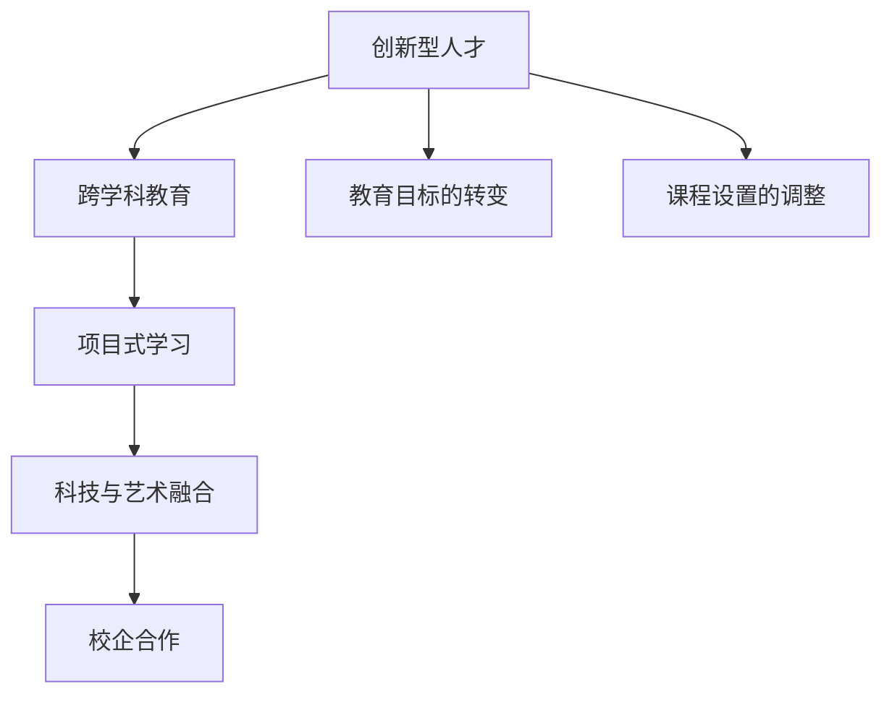

                 

# 硅谷教育改革:培养创新型人才

## 1. 背景介绍

### 1.1 问题由来

硅谷作为全球科技创新中心，不仅孕育了大量的高科技公司和创业公司，也培养了数不胜数的世界级人才。然而，随着科技的迅猛发展，当前的教育体系面临着诸多挑战。一方面，传统教育模式难以适应快速变化的科技环境，急需改革以培养创新型人才。另一方面，社会对于具备高素质技能和创新能力的人才需求日益增长，教育体系必须做出调整以应对这一变化。

硅谷的教育改革正是在这种背景下应运而生的。本文将探讨硅谷教育改革的背景、目标和实施策略，并分析其对培养创新型人才的重要意义。

### 1.2 问题核心关键点

硅谷教育改革的核心关键点主要包括：

- **教育目标的转变**：从传统的应试教育转变为培养创新思维和综合素质的教育模式。
- **课程设置的调整**：引入更多跨学科课程，增强学生对不同领域的理解和应用能力。
- **实践与理论结合**：强调实践操作和项目体验，以提高学生的实际操作能力和创新能力。
- **科技与艺术的融合**：鼓励学生将科技与艺术相结合，提升跨界思维和创造力。
- **合作与交流**：加强校企合作，搭建开放平台，促进知识共享与交流。

这些关键点共同构成了硅谷教育改革的总体框架，旨在培养具备创新思维、综合素质和实践能力的高端人才。

## 2. 核心概念与联系

### 2.1 核心概念概述

在硅谷的教育改革中，涉及多个核心概念，包括：

- **创新型人才**：具备创新思维、跨界融合能力、高效解决问题的能力，能够在复杂多变的科技环境中不断突破。
- **跨学科教育**：打破学科界限，整合不同领域的知识和方法，培养具有综合素质和跨界思维的复合型人才。
- **项目式学习**：通过真实项目和实践操作，增强学生的实际操作能力和问题解决能力，促进理论与实践的结合。
- **科技与艺术融合**：鼓励学生将科技与艺术相结合，提升创造力和跨界思维，培养全面的创新人才。
- **校企合作**：通过与企业的紧密合作，为学生提供实习、创业等机会，实现知识的转化和应用。

这些概念之间有着紧密的联系，共同构成了硅谷教育改革的完整框架。

### 2.2 核心概念原理和架构的 Mermaid 流程图(Mermaid 流程节点中不要有括号、逗号等特殊字符)



这个流程图展示了硅谷教育改革中各个核心概念之间的联系和相互作用。创新型人才的培养不仅仅是单一教育的成果，而是多个概念共同作用的结果。

## 3. 核心算法原理 & 具体操作步骤

### 3.1 算法原理概述

硅谷教育改革的核心算法原理主要围绕以下几个方面展开：

1. **目标导向**：明确培养目标，设置创新型人才所需的知识结构、技能和素质。
2. **跨学科融合**：通过跨学科课程设置，增强学生对不同领域的理解和应用能力。
3. **实践操作**：通过项目式学习和实习体验，提高学生的实际操作能力和创新能力。
4. **合作与交流**：通过校企合作和开放平台，促进知识的共享与交流，增强学生的合作能力和实践经验。
5. **科技与艺术结合**：鼓励学生将科技与艺术相结合，提升创造力和跨界思维。

### 3.2 算法步骤详解

1. **确定教育目标**：
   - 分析当前社会和科技环境对人才的需求。
   - 制定具体、明确的教育目标，包括知识、技能和素质要求。

2. **调整课程设置**：
   - 引入跨学科课程，如计算机科学、设计学、心理学、艺术学等。
   - 将课程内容与实际应用场景相结合，增强学生对不同领域的理解和应用能力。

3. **实施项目式学习**：
   - 设计真实的项目，让学生在实际操作中学习和应用所学知识。
   - 鼓励学生提出自己的问题，进行独立研究和团队合作。

4. **强化科技与艺术融合**：
   - 提供科技与艺术结合的课程和项目，如编程艺术、交互设计等。
   - 鼓励学生在项目中运用艺术思维方式，提升创新能力。

5. **加强校企合作**：
   - 与企业建立合作关系，为学生提供实习、创业等机会。
   - 建立开放平台，促进知识共享和交流。

6. **持续评估和改进**：
   - 定期评估教育改革的效果，收集反馈意见。
   - 根据评估结果进行改进和优化，确保教育改革持续推进。

### 3.3 算法优缺点

硅谷教育改革的优点包括：

- **适应性强**：灵活调整课程设置，适应快速变化的科技环境。
- **注重实践**：通过项目式学习和实习，提高学生的实际操作能力和创新能力。
- **跨学科融合**：增强学生的综合素质和跨界思维，适应复杂多变的科技需求。
- **科技与艺术结合**：提升学生的创造力和跨界思维，培养全面的创新人才。

其缺点主要在于：

- **资源投入大**：实施教育改革需要大量的资源投入，包括资金、师资和设备等。
- **课程设计复杂**：跨学科课程和项目式学习的设置需要精心设计和协调，增加了课程设计的复杂度。
- **评估难度大**：对学生创新能力和综合素质的评估难度较大，缺乏统一的标准和方法。

### 3.4 算法应用领域

硅谷教育改革的算法原理和操作步骤可以应用于多个领域，包括但不限于：

- **高等教育**：通过调整课程设置和实施项目式学习，培养具有创新思维和综合素质的高端人才。
- **基础教育**：通过跨学科教育和实践操作，增强学生的基础知识和实际操作能力。
- **职业培训**：通过校企合作和实习体验，提高学生的实际操作能力和就业竞争力。

## 4. 数学模型和公式 & 详细讲解 & 举例说明

### 4.1 数学模型构建

硅谷教育改革的数学模型构建主要涉及以下几个方面：

1. **目标函数**：
   - 确定教育目标，构建目标函数 $F$，表示教育目标的实现程度。
   - 目标函数包括知识、技能和素质等多个维度，如 $F=\sum_i a_iK_i + \sum_i b_iS_i + \sum_i c_iQ_i$，其中 $K_i, S_i, Q_i$ 分别表示知识、技能和素质，$a_i, b_i, c_i$ 为权重系数。

2. **约束条件**：
   - 课程设置、实践操作、校企合作等方面的约束条件，如 $C=\sum_j a_jC_j$，其中 $C_j$ 表示课程、实践、合作等方面的约束条件。

3. **优化过程**：
   - 通过优化算法，如遗传算法、模拟退火等，求解目标函数 $F$ 的最优解。
   - 优化过程需要考虑多目标冲突，如知识与实践的平衡、理论与操作的结合等。

### 4.2 公式推导过程

以项目式学习为例，推导其数学模型：

1. **项目评估指标**：
   - 确定项目评估指标，如完成度、创新性、实用性等，设指标集合为 $\Omega$。
   - 评估指标的权重向量为 $w \in \mathbb{R}^n$。

2. **项目得分**：
   - 对项目进行打分，得分向量为 $S \in \mathbb{R}^n$。
   - 得分向量由学生、教师和评委综合打分得到，如 $S=\alpha S_s + \beta S_t + \gamma S_j$，其中 $\alpha, \beta, \gamma$ 为权重系数。

3. **目标函数**：
   - 构建项目式学习目标函数 $G$，表示项目评估指标的实现程度。
   - 目标函数为 $G=\sum_{i \in \Omega}w_iS_i$，其中 $w_i$ 为第 $i$ 个评估指标的权重。

4. **优化过程**：
   - 通过优化算法，如粒子群算法、遗传算法等，求解目标函数 $G$ 的最优解。
   - 优化过程需要考虑项目多样性、创新性、实用性等多个因素，确保项目的高质量和高效果。

### 4.3 案例分析与讲解

以斯坦福大学计算机科学系为例，分析其项目式学习的应用：

1. **课程设置**：
   - 斯坦福大学计算机科学系通过跨学科课程设置，如“编程与艺术”、“数据科学与心理学”等，增强学生对不同领域的理解和应用能力。
   - 课程内容与实际应用场景相结合，如“机器学习与医疗”项目，让学生在实际操作中学习和应用所学知识。

2. **项目式学习**：
   - 通过项目式学习，如“自动驾驶模拟”、“区块链应用开发”等，提高学生的实际操作能力和创新能力。
   - 学生需要提出自己的问题，进行独立研究和团队合作，提高综合素质和跨界思维。

3. **科技与艺术结合**：
   - 提供科技与艺术结合的课程和项目，如“编程艺术”、“交互设计”等，提升学生的创造力和跨界思维。
   - 鼓励学生在项目中运用艺术思维方式，提升创新能力。

4. **校企合作**：
   - 与Google、Facebook等企业建立合作关系，为学生提供实习、创业等机会。
   - 建立开放平台，促进知识共享和交流，如“Stanford Tech Factory”，提供创业空间和资源支持。

## 5. 项目实践：代码实例和详细解释说明

### 5.1 开发环境搭建

为了进行硅谷教育改革的实践，我们需要搭建合适的开发环境。以下是详细的搭建步骤：

1. **安装Python**：
   - 从官网下载并安装Python，选择最新版本，确保与后续工具的兼容性。
   - 安装pip工具，用于包管理。

2. **安装相关工具**：
   - 安装Jupyter Notebook，用于编写和运行代码。
   - 安装Numpy、Pandas、Matplotlib等数据科学库，用于数据处理和可视化。
   - 安装Scikit-learn等机器学习库，用于项目式学习中的模型训练和评估。

3. **配置开发环境**：
   - 创建虚拟环境，确保代码包的独立性。
   - 配置环境变量，方便后续开发和部署。

### 5.2 源代码详细实现

以斯坦福大学的“编程与艺术”课程为例，给出项目式学习的代码实现：

1. **项目描述**：
   - 设计一个艺术作品生成系统，将编程技术与艺术创作相结合。
   - 要求系统能够根据用户输入的参数生成不同风格和形式的艺术作品。

2. **课程设计**：
   - 分为多个步骤，包括需求分析、系统设计、编码实现、测试和反馈等。
   - 每个步骤都有具体的任务和目标，学生需要在限定时间内完成。

3. **代码实现**：
   - 使用Python编写程序，使用Numpy和Pandas处理数据，使用Matplotlib可视化结果。
   - 代码示例如下：
     ```python
     import numpy as np
     import pandas as pd
     import matplotlib.pyplot as plt

     def generate_artwork(style, color, size):
         # 根据用户输入的参数生成艺术作品
         # 使用Numpy生成随机数据
         data = np.random.normal(0, 1, size=(size, size))
         # 使用Pandas处理数据
         df = pd.DataFrame(data)
         # 使用Matplotlib可视化结果
         plt.imshow(data, cmap='viridis')
         plt.title(style + ' Artwork')
         plt.show()

     # 调用函数生成不同风格和形式的艺术作品
     generate_artwork('Abstract', 'Blue', 10)
     ```

### 5.3 代码解读与分析

1. **需求分析**：
   - 确定项目的目标和要求，如艺术作品的风格、颜色、尺寸等。
   - 分析项目的技术难点和实现方案，如数据生成、数据处理和可视化等。

2. **系统设计**：
   - 设计项目的整体架构和模块划分，确保代码的可维护性和可扩展性。
   - 选择合适的工具和技术，如Numpy、Pandas和Matplotlib等，提高开发效率。

3. **编码实现**：
   - 按照系统设计，逐步实现项目的各个功能模块。
   - 代码示例展示了如何使用Numpy生成随机数据，使用Pandas处理数据，使用Matplotlib可视化结果。

4. **测试和反馈**：
   - 对项目进行全面测试，确保功能的正确性和稳定性。
   - 收集学生的反馈意见，不断优化项目设计和技术实现。

### 5.4 运行结果展示

1. **项目结果展示**：
   - 生成不同风格和形式的艺术作品，如抽象画、印象派画、现代画等。
   - 学生可以根据生成的作品进行评估和改进，提升艺术创作的能力。

2. **项目评估和反馈**：
   - 邀请教师和学生对项目进行评估，提出改进意见。
   - 通过评估结果，调整课程设置和教学方法，提高教育质量。

## 6. 实际应用场景

### 6.1 硅谷教育改革的实际应用

1. **高等教育**：
   - 斯坦福大学、麻省理工学院等高等教育机构通过调整课程设置和实施项目式学习，培养了一大批创新型人才。
   - 如Google的创始人Serious Larry Page和Jeff Bezos，他们在斯坦福大学期间就参与了多个创新项目，为创业奠定了坚实基础。

2. **基础教育**：
   - 硅谷的学校通过跨学科教育和项目式学习，提高学生的综合素质和实际操作能力。
   - 如Palo Alto Unified School，通过项目式学习，让学生在实际操作中学习和应用所学知识。

3. **职业培训**：
   - 硅谷的培训机构和社区学院通过校企合作和实习体验，提高学生的实际操作能力和就业竞争力。
   - 如Silicon Community College，通过与企业的紧密合作，为学生提供实习、创业等机会。

### 6.2 未来应用展望

1. **AI与教育结合**：
   - 利用人工智能技术，如自然语言处理、机器学习等，提升教育质量和效率。
   - 开发智能教育平台，提供个性化的学习方案和反馈。

2. **虚拟现实和增强现实**：
   - 利用虚拟现实和增强现实技术，构建沉浸式的学习环境。
   - 通过虚拟实验室和模拟训练，增强学生的实际操作能力和创新能力。

3. **全球化教育**：
   - 利用互联网技术，打破地域和时间的限制，实现全球化教育。
   - 搭建开放平台，促进国际间的知识共享和交流，培养具有全球视野的创新型人才。

## 7. 工具和资源推荐

### 7.1 学习资源推荐

为了帮助开发者系统掌握硅谷教育改革的理论基础和实践技巧，以下是一些优质的学习资源：

1. **《人工智能教育》系列博文**：由硅谷教育专家撰写，深入浅出地介绍了AI在教育领域的应用和发展趋势。
2. **《教育科技》杂志**：专注于教育科技领域的最新动态和技术进展，提供丰富的案例和分析。
3. **Coursera和edX平台**：提供大量高质量的教育课程和资源，涵盖计算机科学、人工智能、教育科技等多个领域。
4. **IEEE Transactions on Learning Technologies**：发表教育技术领域的研究成果，提供前沿的学术和技术交流平台。

通过学习这些资源，相信你一定能够快速掌握硅谷教育改革的理论基础和实践技巧，应用于实际的教育工作中。

### 7.2 开发工具推荐

为了提高硅谷教育改革的开发效率，以下是几款常用的开发工具：

1. **Jupyter Notebook**：基于Web的交互式编程环境，支持Python、R等多种语言，方便代码编写和共享。
2. **Git和GitHub**：版本控制工具和代码托管平台，方便团队协作和代码管理。
3. **Anaconda**：数据科学和人工智能领域的开源发行版，包含大量的Python包和工具，方便开发和部署。
4. **Google Colab**：免费的在线Jupyter Notebook环境，支持GPU和TPU算力，方便快速实验和调试。

合理利用这些工具，可以显著提升硅谷教育改革的开发效率，加速创新迭代的步伐。

### 7.3 相关论文推荐

硅谷教育改革的研究涉及多个学科和领域，以下是几篇具有代表性的相关论文：

1. **《人工智能与教育：现状与展望》**：讨论了人工智能在教育领域的应用现状和未来发展方向。
2. **《项目式学习在教育中的应用》**：分析了项目式学习的定义、原则和实施方法，提供了实际案例和评估指标。
3. **《跨学科教育：理论、实践与挑战》**：探讨了跨学科教育的理论和实践，分析了其对培养创新型人才的重要性。
4. **《科技与艺术融合：创新型人才的培养途径》**：讨论了科技与艺术融合的教育模式，分析了其对培养创造力和跨界思维的重要性。

这些论文代表了硅谷教育改革的研究进展，为进一步深入研究提供了重要的参考。

## 8. 总结：未来发展趋势与挑战

### 8.1 总结

本文对硅谷教育改革的背景、目标和实施策略进行了全面系统的介绍。通过分析核心概念和算法原理，详细讲解了硅谷教育改革的数学模型和代码实现，分析了其实际应用场景和未来发展趋势。通过本文的系统梳理，可以看到，硅谷教育改革在培养创新型人才方面具有重要的意义，值得广泛借鉴和推广。

### 8.2 未来发展趋势

展望未来，硅谷教育改革将继续朝着以下几个方向发展：

1. **AI与教育的深度融合**：利用人工智能技术，提升教育质量和效率，提供个性化的学习方案和反馈。
2. **多模态教育**：结合虚拟现实、增强现实和仿真技术，提供沉浸式的学习环境，增强学生的实际操作能力和创新能力。
3. **全球化教育**：利用互联网技术，实现全球化教育，促进国际间的知识共享和交流，培养具有全球视野的创新型人才。
4. **跨学科和跨领域教育**：打破学科界限和领域限制，整合不同领域的知识和方法，培养具有综合素质和跨界思维的复合型人才。

### 8.3 面临的挑战

尽管硅谷教育改革已经取得了显著成果，但在推进过程中仍面临诸多挑战：

1. **资源投入大**：实施教育改革需要大量的资源投入，包括资金、师资和设备等。
2. **课程设计复杂**：跨学科课程和项目式学习的设置需要精心设计和协调，增加了课程设计的复杂度。
3. **评估难度大**：对学生创新能力和综合素质的评估难度较大，缺乏统一的标准和方法。
4. **技术更新快**：科技发展迅速，需要不断更新教学方法和工具，以适应新技术的应用。
5. **教育公平性**：教育资源的不均衡分配，可能导致教育机会的不平等，需要政府和社会的共同努力。

### 8.4 研究展望

为了应对这些挑战，未来的硅谷教育改革需要在以下几个方面寻求新的突破：

1. **多目标优化**：通过多目标优化算法，平衡课程设置、实践操作和评估指标之间的关系。
2. **个性化学习**：利用人工智能和大数据分析，实现个性化的学习方案和反馈，提高教育效果。
3. **全球化合作**：加强国际间的合作与交流，共享教育资源和经验，提升教育质量。
4. **技术创新**：结合虚拟现实、增强现实等新技术，创新教育模式和手段，提升教育效果。
5. **公平教育**：通过政策引导和资源投入，促进教育资源的均衡分配，实现教育公平。

总之，硅谷教育改革需要从多个维度进行全面优化，才能实现培养创新型人才的目标。只有不断创新、持续改进，才能在快速变化的科技环境中不断推进教育改革，培养更多具有创新思维和综合素质的高端人才。

## 9. 附录：常见问题与解答

**Q1：硅谷教育改革的实施难点是什么？**

A: 硅谷教育改革的实施难点主要包括：

1. **资源投入大**：实施教育改革需要大量的资源投入，包括资金、师资和设备等。
2. **课程设计复杂**：跨学科课程和项目式学习的设置需要精心设计和协调，增加了课程设计的复杂度。
3. **评估难度大**：对学生创新能力和综合素质的评估难度较大，缺乏统一的标准和方法。

**Q2：硅谷教育改革在高等教育中的实施效果如何？**

A: 硅谷教育改革在高等教育中的实施效果显著：

1. **培养了大量创新型人才**：斯坦福大学、麻省理工学院等高等教育机构通过调整课程设置和实施项目式学习，培养了一大批创新型人才。
2. **建立了合作机制**：与Google、Facebook等企业建立合作关系，为学生提供实习、创业等机会。
3. **推动了技术创新**：通过跨学科教育和项目式学习，培养了学生的多元思维和创新能力，推动了技术创新。

**Q3：硅谷教育改革在基础教育和职业培训中的应用效果如何？**

A: 硅谷教育改革在基础教育和职业培训中的应用效果如下：

1. **提高了学生的实际操作能力和创新能力**：通过项目式学习和实习体验，学生能够在实际操作中学习和应用所学知识。
2. **增强了学生的综合素质和跨界思维**：通过跨学科教育和科技与艺术融合，学生具备更全面的知识和技能。
3. **提升了学生的就业竞争力**：通过校企合作和实习体验，学生能够积累实践经验，提升就业竞争力。

**Q4：硅谷教育改革的未来发展方向是什么？**

A: 硅谷教育改革的未来发展方向包括：

1. **AI与教育的深度融合**：利用人工智能技术，提升教育质量和效率，提供个性化的学习方案和反馈。
2. **多模态教育**：结合虚拟现实、增强现实和仿真技术，提供沉浸式的学习环境，增强学生的实际操作能力和创新能力。
3. **全球化教育**：利用互联网技术，实现全球化教育，促进国际间的知识共享和交流，培养具有全球视野的创新型人才。
4. **跨学科和跨领域教育**：打破学科界限和领域限制，整合不同领域的知识和方法，培养具有综合素质和跨界思维的复合型人才。

总之，硅谷教育改革需要在多个维度进行全面优化，才能实现培养创新型人才的目标。只有不断创新、持续改进，才能在快速变化的科技环境中不断推进教育改革，培养更多具有创新思维和综合素质的高端人才。

---

作者：禅与计算机程序设计艺术 / Zen and the Art of Computer Programming

