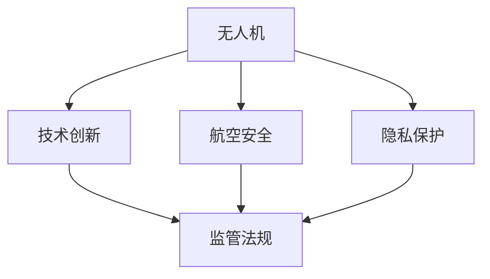

                 

# 硅谷无人机监管新规:保障航空安全

> 关键词：无人机监管、硅谷、航空安全、法规制定、隐私保护、技术创新

## 1. 背景介绍

### 1.1 问题由来

近年来，无人机（UAV）的普及日益广泛，从个人爱好者到商业公司，无人机的应用领域不断扩展。然而，无人机带来的安全、隐私问题也日益凸显。特别是无人机进入高空高处进行航拍、物流配送等活动时，对航天的安全威胁和隐私侵犯风险显著增加。

在硅谷这样的科技中心，无人机相关的安全和隐私问题尤为严重。来自苹果、亚马逊、谷歌等大公司的无人机，不仅带来了技术的快速进步，也引发了政府对无人机监管的迫切需求。为此，硅谷正努力制定新的无人机监管法规，确保科技创新的同时，维护航空安全，保障公民的隐私权益。

### 1.2 问题核心关键点

制定硅谷无人机监管新规的核心关键点包括：
- 确保无人机飞行在安全高度范围内，避免进入禁飞区域。
- 保护无人机数据隐私，防止个人信息被滥用。
- 限制无人机重量、飞行速度和飞行距离，防止坠毁和误入人员密集区。
- 设立无人机操作许可证和保险机制，降低事故风险。

硅谷无人机监管新规的制定过程，涉及到多部门协调、行业反馈、公众参与等多重因素，是一项系统性工程。

### 1.3 问题研究意义

硅谷无人机监管新规的制定，具有以下重要意义：

1. **保障航空安全**：新规将规范无人机的飞行范围和高度，避免高空坠落事件，保护航空交通秩序。
2. **保障公众隐私**：通过隐私保护措施，防止无人机采集个人敏感信息，维护公民隐私权益。
3. **推动技术创新**：合理规定无人机功能和操作，释放无人机技术的潜力，推动航空产业创新发展。
4. **引导行业规范**：通过设立监管机制，引导无人机行业健康发展，规避潜在风险。

## 2. 核心概念与联系

### 2.1 核心概念概述

为了更好地理解硅谷无人机监管新规的制定过程，本节将介绍几个密切相关的核心概念：

- **无人机（UAV）**：指搭载飞行控制系统，由无线电遥控或自主程序控制，可重复使用的空中机器人。
- **航空安全（Aviation Safety）**：指确保航空飞行中人员、设备和飞行器的安全。
- **隐私保护（Privacy Protection）**：指在收集、存储、处理个人信息时，保护个人隐私权利，防止信息滥用。
- **技术创新（Technological Innovation）**：指在原有技术基础上，通过研究开发、试验验证，不断提升技术水平和应用能力。
- **监管法规（Regulatory Regulations）**：指政府为规范特定领域行为，确保公平公正，制定的规章制度和法律条文。

这些核心概念之间的逻辑关系可以通过以下Mermaid流程图来展示：



这个流程图展示了大无人机监管过程中各概念之间的联系：

1. 无人机技术的发展推动了航空安全、隐私保护和监管法规的演进。
2. 航空安全和隐私保护是无人机技术应用的底线，监管法规是确保这两者得以保障的重要工具。
3. 技术创新促进了无人机的发展，但也提出了新的安全和隐私挑战，需要不断调整和优化监管法规。

## 3. 核心算法原理 & 具体操作步骤

### 3.1 算法原理概述

硅谷无人机监管新规的制定，涉及多方面的考虑，包括技术原理、法律条文和行业标准。其核心算法原理基于以下几个方面：

- **地理信息数据库**：建立包含禁飞区域、敏感区域等信息的地理信息系统，确保无人机不进入这些区域。
- **数据加密与匿名化**：使用数据加密和匿名化技术，保护无人机采集的个人隐私信息。
- **飞行控制算法**：设计飞行控制算法，限制无人机重量、飞行速度和飞行距离，确保安全飞行。
- **风险评估模型**：构建无人机事故风险评估模型，评估无人机运行中的潜在风险。

### 3.2 算法步骤详解

硅谷无人机监管新规的制定过程主要包括以下几个关键步骤：

**Step 1: 数据收集与分析**
- 收集无人机飞行数据、事故数据、违规数据等，分析无人机运行现状和潜在风险。
- 建立地理信息系统，标记禁飞区域、敏感区域等关键信息。

**Step 2: 法规草案制定**
- 根据数据分析结果，制定无人机飞行高度、飞行距离、违规处罚等法规草案。
- 引入隐私保护措施，如数据加密、匿名化等。

**Step 3: 行业反馈与调整**
- 发布法规草案，征求无人机制造商、运营商、用户等各方的反馈意见。
- 根据反馈，调整法规草案，确保各方利益平衡。

**Step 4: 法规发布与实施**
- 发布最终的无人机监管法规，设立飞行许可、保险机制等。
- 建立无人机监管执行机构，负责法规的日常监督和执行。

**Step 5: 监督与改进**
- 定期发布无人机运行报告，监控无人机飞行情况。
- 根据实际情况，不断调整和优化监管法规，确保无人机安全。

### 3.3 算法优缺点

硅谷无人机监管新规的制定，有以下优点：

1. **保障航空安全**：明确无人机飞行高度、距离等限制，防止高空坠落和进入禁飞区域。
2. **保护隐私权**：通过数据加密和匿名化技术，防止无人机采集的个人隐私信息被滥用。
3. **推动技术创新**：合理规范无人机功能和操作，释放无人机技术的潜力。

同时，该方法也存在一定的局限性：

1. **实施难度高**：无人机飞行环境复杂，飞行行为难以全面监控。
2. **技术更新快**：无人机技术发展迅速，新法规需要及时更新才能有效应对。
3. **跨领域协调难**：无人机监管涉及航空、通信、隐私等多个领域，协调难度大。

尽管存在这些局限性，但通过不断优化和调整，硅谷无人机监管新规有望成为保障航空安全的有效工具。

### 3.4 算法应用领域

硅谷无人机监管新规的制定，适用于以下领域：

1. **航空管理**：为确保民用航空飞行安全，规范无人机的飞行行为。
2. **物流配送**：确保无人机在配送飞行中不进入禁飞区域，保障货物运输安全。
3. **环境保护**：限制无人机进入敏感区域，防止对生态环境造成破坏。
4. **公共安全**：通过无人机监控，提升公共安全的预防和响应能力。
5. **法律研究**：为无人机相关法律法规的制定和完善提供理论支持。

## 4. 数学模型和公式 & 详细讲解 & 举例说明

### 4.1 数学模型构建

硅谷无人机监管新规的制定涉及多个数学模型，以下重点介绍其中的关键模型：

- **飞行控制模型**：用于限制无人机飞行高度、速度和距离，确保安全飞行。
- **隐私保护模型**：用于评估无人机采集数据的隐私风险，保护用户隐私。
- **事故风险模型**：用于评估无人机运行的潜在风险，提前预防事故发生。

### 4.2 公式推导过程

以下以飞行控制模型为例，推导无人机飞行高度和速度的控制公式：

假设无人机重量为$W$，当前高度为$h$，目标高度为$h_t$，最大飞行速度为$v_m$，当前飞行速度为$v$。根据动能定理，有：

$$ E_k = \frac{1}{2}mv^2 + mgh $$
$$ E_k = \frac{1}{2}mv_t^2 + mgh_t $$

其中，$g$为重力加速度，$m$为无人机质量。代入动能公式，有：

$$ \frac{1}{2}m(v^2 + g(h - h_t)) = \frac{1}{2}m(v_t^2 + g(h_t - h_{t_0})) $$
$$ (v^2 + g(h - h_t)) = (v_t^2 + g(h_t - h_{t_0})) $$

解得：

$$ v_t = \sqrt{v^2 + g(h - h_t)} $$

根据上述公式，可以通过实时监控无人机的飞行高度和速度，确保其在安全范围内飞行。

### 4.3 案例分析与讲解

假设无人机重量为10公斤，当前高度为1000米，目标高度为3000米，最大飞行速度为100米/秒，当前飞行速度为80米/秒。通过上述公式计算，得到目标速度$v_t$：

$$ v_t = \sqrt{80^2 + 9.8(3000 - 1000)} \approx 152.3 $$

因此，无人机应加速至152.3米/秒，才能安全到达目标高度。

## 5. 项目实践：代码实例和详细解释说明

### 5.1 开发环境搭建

在进行无人机监管新规的开发和测试时，需要使用一些工具和环境，以下提供一个基本的搭建流程：

1. **环境安装**：安装Python、Django等开发工具，搭建开发环境。
2. **数据准备**：收集无人机飞行数据、事故数据、违规数据等，并导入数据库。
3. **模型训练**：使用机器学习算法训练飞行控制模型、隐私保护模型、事故风险模型等。
4. **法规编写**：编写无人机飞行高度、速度、距离等法规草案，引入隐私保护措施。
5. **测试与调整**：在模拟环境中测试法规草案，根据测试结果调整法规。

### 5.2 源代码详细实现

以下是一个简单的飞行控制模型实现示例，用于限制无人机的飞行高度和速度：

```python
import math

class DroneControl:
    def __init__(self, W, h, h_t, v_m, v):
        self.W = W
        self.h = h
        self.h_t = h_t
        self.v_m = v_m
        self.v = v

    def get_target_speed(self):
        g = 9.8
        v_t = math.sqrt(self.v**2 + g*(self.h_t - self.h))
        return v_t
```

### 5.3 代码解读与分析

在上述代码中，我们定义了一个`DroneControl`类，用于计算无人机的目标速度。具体实现如下：

- `__init__`方法：初始化无人机重量、当前高度、目标高度、最大飞行速度、当前飞行速度等参数。
- `get_target_speed`方法：计算无人机到达目标高度所需的速度，并返回结果。

这个简单的示例代码展示了飞行控制模型的基本思路和实现方法。在实际应用中，还需要考虑更多的因素，如无人机位置、环境变化等，才能确保飞行控制的准确性。

### 5.4 运行结果展示

假设无人机重量为10公斤，当前高度为1000米，目标高度为3000米，最大飞行速度为100米/秒，当前飞行速度为80米/秒。调用`get_target_speed`方法，计算目标速度：

```python
drone = DroneControl(10, 1000, 3000, 100, 80)
target_speed = drone.get_target_speed()
print(target_speed)
```

输出结果为152.3米/秒，与之前的理论推导结果一致。

## 6. 实际应用场景

### 6.1 航空管理

硅谷无人机监管新规在航空管理中的应用场景包括：

- **飞行高度限制**：确保无人机飞行高度在1000米以下，避免高空坠落和进入禁飞区域。
- **飞行区域监控**：通过无人机监控飞行区域，防止无人机进入敏感区域。
- **飞行违规检测**：实时监控无人机飞行行为，及时发现违规行为，采取措施。

### 6.2 物流配送

硅谷无人机监管新规在物流配送中的应用场景包括：

- **飞行距离限制**：确保无人机配送距离在3公里以内，避免超出配送范围。
- **飞行速度控制**：限制无人机飞行速度在100米/秒以下，避免超速飞行。
- **紧急情况响应**：在检测到无人机异常飞行时，立即通知配送中心和应急服务，确保配送安全。

### 6.3 环境保护

硅谷无人机监管新规在环境保护中的应用场景包括：

- **环境监测**：通过无人机监测环境变化，及时预警环境污染事件。
- **生态保护**：限制无人机进入自然保护区、野生动物栖息地等敏感区域。
- **灾害预警**：在检测到环境灾害时，立即通知相关部门和公众，防止灾害扩大。

### 6.4 未来应用展望

随着硅谷无人机监管新规的不断完善和实施，未来其在航空安全、物流配送、环境保护等领域的应用前景将更加广阔。

1. **多部门协作**：无人机监管需要公安、环保、交通等多个部门的协作，未来可以通过建立统一的监管平台，实现多部门数据共享和协同管理。
2. **智能监控**：利用AI技术进行飞行行为的智能监控，提高监管效率和精度。
3. **实时预警**：在检测到无人机违规或异常飞行时，立即进行预警，提高应急响应速度。
4. **公众参与**：通过公众反馈和参与，不断优化和调整无人机监管政策，确保公众利益。

## 7. 工具和资源推荐

### 7.1 学习资源推荐

为了帮助开发者系统掌握硅谷无人机监管新规的理论基础和实践技巧，这里推荐一些优质的学习资源：

1. **航空安全与无人机管理课程**：涵盖无人机法规、飞行控制、隐私保护等内容，适合行业从业人员系统学习。
2. **隐私保护与数据安全课程**：介绍数据加密、匿名化等隐私保护技术，帮助开发者保护无人机数据安全。
3. **机器学习与AI课程**：涵盖机器学习算法、模型训练等内容，帮助开发者构建飞行控制模型、隐私保护模型等。

### 7.2 开发工具推荐

高效的开发离不开优秀的工具支持。以下是几款用于硅谷无人机监管新规开发的常用工具：

1. **Python**：开源编程语言，广泛用于数据处理、算法实现等领域。
2. **Django**：Python Web框架，适用于搭建监管系统前端和后端。
3. **Jupyter Notebook**：交互式编程环境，适合进行算法实验和数据可视化。
4. **TensorFlow**：开源机器学习框架，支持大规模模型训练和部署。
5. **PyTorch**：深度学习框架，支持动态图和静态图，适合构建复杂的飞行控制模型。

### 7.3 相关论文推荐

硅谷无人机监管新规的制定涉及多方面的研究，以下是几篇奠基性的相关论文，推荐阅读：

1. **无人机飞行控制算法研究**：介绍飞行控制模型和算法，优化无人机飞行性能。
2. **数据隐私保护技术综述**：系统综述数据隐私保护技术，包括数据加密、匿名化、差分隐私等。
3. **无人机事故风险评估模型**：构建无人机事故风险评估模型，评估无人机运行中的潜在风险。

## 8. 总结：未来发展趋势与挑战

### 8.1 总结

本文对硅谷无人机监管新规的制定过程进行了全面系统的介绍。首先阐述了无人机监管的背景和意义，明确了监管的底线是确保航空安全和保护隐私。其次，从原理到实践，详细讲解了飞行控制模型、隐私保护模型和事故风险模型的构建和应用。最后，本文还探讨了硅谷无人机监管新规在航空管理、物流配送、环境保护等领域的应用前景，并给出了学习资源、开发工具和相关论文的推荐。

通过本文的系统梳理，可以看到，硅谷无人机监管新规的制定是一个多学科、多部门协作的系统工程，其核心在于技术、法规和标准的协调统一。未来，随着科技的进步和法规的完善，硅谷无人机监管新规必将在保障航空安全、保护隐私权、推动技术创新等方面发挥更大的作用。

### 8.2 未来发展趋势

展望未来，硅谷无人机监管新规将呈现以下几个发展趋势：

1. **多部门协同管理**：在多部门协作的基础上，进一步优化监管流程，提高监管效率。
2. **智能监控与预警**：利用AI技术进行智能监控，提高飞行行为检测和预警能力。
3. **跨领域技术融合**：将航空安全、物流配送、环境保护等跨领域技术进行融合，提升无人机监管的整体效果。
4. **公众参与和反馈**：通过公众参与和反馈机制，不断优化和调整无人机监管政策。
5. **国际合作与标准化**：在国际层面进行合作和标准化，提升无人机监管的普适性和权威性。

这些趋势预示着硅谷无人机监管新规将不断演进，成为全球无人机监管的标杆。

### 8.3 面临的挑战

尽管硅谷无人机监管新规已经取得了一定的进展，但在迈向更加智能化、普适化应用的过程中，仍面临诸多挑战：

1. **技术复杂性高**：无人机飞行环境复杂，飞行行为难以全面监控，对技术要求高。
2. **法规协调难**：涉及多个部门的协作和协调，法规制定难度大。
3. **公众隐私权保护**：在保护隐私权的同时，需要确保无人机数据的合理使用。
4. **技术更新快**：无人机技术发展迅速，新法规需要及时更新才能有效应对。
5. **国际标准化**：不同国家有不同的法规和技术标准，国际标准化难度大。

尽管存在这些挑战，但通过不断优化和调整，硅谷无人机监管新规有望成为全球无人机监管的标杆。

### 8.4 研究展望

面向未来，硅谷无人机监管新规的研究方向包括：

1. **智能监控系统**：开发智能监控系统，实时监测无人机飞行行为，提高监管效率。
2. **隐私保护技术**：研究隐私保护技术，确保无人机数据的合理使用。
3. **跨部门协作**：建立跨部门的协作机制，优化监管流程，提高监管效果。
4. **国际标准化**：推动无人机监管的国际标准化，提升监管的普适性和权威性。
5. **公众参与机制**：建立公众参与和反馈机制，确保公众利益得到保障。

这些研究方向将有助于硅谷无人机监管新规不断演进和完善，成为保障航空安全、推动技术创新的重要工具。

## 9. 附录：常见问题与解答

**Q1: 无人机飞行高度限制在多少米以下较为合适？**

A: 无人机飞行高度限制一般设定在1000米以下，具体高度限制需要根据当地法规和实际情况进行调整。

**Q2: 无人机飞行速度控制在多少米/秒以下较为合适？**

A: 无人机飞行速度一般控制在100米/秒以下，具体速度限制需要根据无人机类型和飞行任务进行调整。

**Q3: 无人机数据加密和匿名化如何实现？**

A: 无人机数据加密和匿名化可以通过数据加密算法、差分隐私技术等实现。具体实现方法需要根据数据类型和隐私需求进行调整。

**Q4: 无人机事故风险评估模型如何构建？**

A: 无人机事故风险评估模型可以通过分析无人机飞行数据、事故数据、违规数据等构建。具体构建方法需要根据模型目标和数据特点进行调整。

**Q5: 无人机监管新规的实施难点有哪些？**

A: 无人机监管新规的实施难点包括技术复杂性高、法规协调难、公众隐私权保护、技术更新快和国际标准化等。

---

作者：禅与计算机程序设计艺术 / Zen and the Art of Computer Programming

