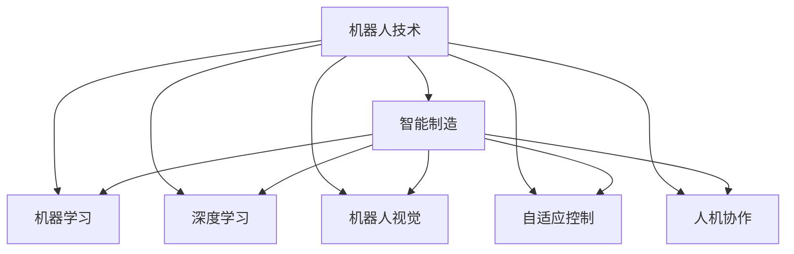

                 

# 硅谷机器人技术:智能制造与服务

> 关键词：机器人技术, 智能制造, 机器学习, 深度学习, 工业自动化, 机器人视觉, 自适应控制, 人机协作

## 1. 背景介绍

### 1.1 问题由来
随着全球化和工业化的深入，制造业对生产效率和产品质量的要求日益提升，传统的以人工为主的生产方式已难以满足需求。硅谷作为全球科技创新的中心，机器人技术的进步为制造业带来了革命性的变革。在智能制造领域，机器人技术不再仅限于机械臂的操作，而是借助先进的机器学习和深度学习技术，实现更为复杂的生产任务，显著提升生产效率和智能化水平。

### 1.2 问题核心关键点
硅谷的机器人技术在智能制造领域的应用，关键在于以下几个方面：

1. **自适应学习与优化**：通过机器学习算法，机器人能够实时感知环境变化，自动调整操作策略，优化生产流程。
2. **视觉识别与定位**：机器人通过深度学习技术，实现高精度的物品识别与定位，确保生产过程的准确性。
3. **人机协作与决策支持**：机器人与人类工人协作，共享任务决策信息，提高生产灵活性和安全性。
4. **大数据分析与预测**：通过收集生产数据，运用大数据分析技术，对生产过程进行预测与优化，提升生产效率。

### 1.3 问题研究意义
硅谷机器人技术在智能制造中的应用，具有以下重要意义：

1. **提高生产效率**：自动化和智能化操作大大减少了人工干预，提升了生产效率，降低了生产成本。
2. **提高产品质量**：机器人能够实现高精度的操作，减少了人为误差，提升了产品的一致性和质量。
3. **促进制造业转型**：机器人技术的应用推动了制造业向智能化、柔性化转型，增强了制造业的竞争力。
4. **创造就业机会**：新型机器人技术的引入需要跨学科人才，促进了相关领域的就业与人才培养。

## 2. 核心概念与联系

### 2.1 核心概念概述

为更好地理解硅谷机器人技术在智能制造中的应用，本节将介绍几个密切相关的核心概念：

- **机器人技术(Robotics)**：通过传感器、执行器和控制器等组件，实现自主或半自主的机械操作。
- **智能制造(Smart Manufacturing)**：利用信息技术、机器学习等技术，实现生产过程的智能化管理。
- **机器学习(Machine Learning)**：通过数据驱动的方法，使计算机系统自动改进其性能。
- **深度学习(Deep Learning)**：利用多层神经网络结构，从数据中自动学习和提取特征。
- **机器人视觉(Robot Vision)**：通过图像处理和计算机视觉技术，使机器人能够感知和识别环境中的物体。
- **自适应控制(Adaptive Control)**：根据环境反馈实时调整控制系统参数，提高系统的稳定性和适应性。
- **人机协作(Human-Robot Collaboration)**：机器人与人类工人的协作，共享任务执行信息，实现高效生产。

这些核心概念之间的逻辑关系可以通过以下Mermaid流程图来展示：



这个流程图展示了几大核心概念之间的关系：

1. 机器人技术是智能制造的基础，能够实现机械操作。
2. 机器学习与深度学习是实现智能制造的核心，能够提供决策支持与优化。
3. 机器人视觉与自适应控制是实现高效操作的关键，能够提高机器人的感知与执行能力。
4. 人机协作是智能制造的高级形态，能够实现智能化的生产协同。

这些概念共同构成了硅谷机器人技术的智能化应用框架，为其在智能制造中的应用提供了理论基础。

## 3. 核心算法原理 & 具体操作步骤
### 3.1 算法原理概述

硅谷机器人技术在智能制造中的应用，主要基于以下算法原理：

1. **机器学习算法**：通过监督学习、无监督学习、强化学习等方法，训练机器人学习生产任务的具体操作，优化决策策略。
2. **深度学习算法**：利用卷积神经网络(CNN)、循环神经网络(RNN)、变换器(Transformer)等深度学习架构，实现高精度的视觉识别与定位。
3. **自适应控制算法**：采用模型预测控制(MPC)、模糊控制、自适应PID控制等方法，使机器人根据环境反馈自动调整操作策略。
4. **人机协作算法**：利用分布式协同、实时通信、共享任务模型等技术，实现机器人与人类工人的无缝协作。

### 3.2 算法步骤详解

硅谷机器人技术在智能制造中的应用，一般包括以下几个关键步骤：

**Step 1: 数据采集与预处理**

- 收集生产过程中的传感器数据，包括机器人位置、速度、力矩等。
- 对传感器数据进行清洗、去噪、归一化等预处理操作。

**Step 2: 模型训练与优化**

- 选择合适的机器学习模型，如决策树、支持向量机、随机森林等。
- 在训练集上对模型进行训练，调整模型参数以最小化损失函数。
- 使用验证集评估模型性能，避免过拟合。

**Step 3: 视觉识别与定位**

- 收集并标注训练数据，如图像、物品标签等。
- 设计深度学习模型，如CNN、RNN、Transformer等，进行图像处理和物体识别。
- 在训练数据上训练模型，调整模型参数以提高识别精度。

**Step 4: 自适应控制**

- 设计自适应控制算法，如PID控制器、模型预测控制(MPC)等。
- 在控制系统中集成自适应算法，实时调整控制参数以应对环境变化。
- 在实际生产环境中测试自适应算法，调整参数以优化控制效果。

**Step 5: 人机协作**

- 设计分布式协同算法，如CPS(Complex Production System)模型。
- 在生产系统中集成人机协作算法，实现任务分配与信息共享。
- 在生产过程中测试协作算法，评估协作效果，进行参数优化。

**Step 6: 模型部署与监控**

- 将训练好的模型和算法部署到生产系统中，进行生产验证。
- 实时监控生产过程中的传感器数据、图像数据等，及时发现异常情况。
- 定期收集生产数据，对模型进行再训练与优化。

### 3.3 算法优缺点

硅谷机器人技术在智能制造中的应用，具有以下优点：

1. **高效性与自动化**：机器学习与深度学习算法能够自动化完成复杂任务，提升生产效率。
2. **精准性与可靠性**：机器人视觉与自适应控制算法实现高精度操作，减少人为误差。
3. **协同性与灵活性**：人机协作算法实现高效协同，提升生产灵活性和安全性。
4. **实时性与可扩展性**：大数据分析与预测算法能够实时分析生产数据，实现生产过程的持续优化。

同时，该方法也存在一定的局限性：

1. **初始投资高**：机器人技术及智能制造系统需要较高的初始投资，对于中小企业可能存在经济压力。
2. **技术复杂性高**：涉及多个学科领域，技术实现复杂，需要多学科人才协同工作。
3. **数据依赖性强**：生产数据质量与数量直接影响算法效果，需要良好的数据治理机制。
4. **应用场景限制**：部分高级应用场景需要特定的技术支持，难以广泛推广。
5. **人机协作挑战**：机器人与人类的协作需要克服沟通与信任问题，需要较好的管理与培训。

尽管存在这些局限性，但硅谷机器人技术在智能制造中的应用前景广阔，仍具有重要的应用价值。

### 3.4 算法应用领域

硅谷机器人技术在智能制造中的应用，涵盖了以下几个主要领域：

- **汽车制造**：在汽车生产线上，机器人负责焊接、组装、涂装等操作，提高了生产效率与产品质量。
- **电子制造**：在电子组件的生产中，机器人能够进行高精度的装配与检测，确保组件的一致性。
- **食品与饮料制造**：在食品加工过程中，机器人能够自动化完成切割、包装等操作，提升了生产灵活性与卫生标准。
- **医疗设备制造**：在医疗设备生产中，机器人负责高精度装配与组装，提高了设备的一致性与可靠性。
- **航空航天制造**：在航空航天部件的生产中，机器人能够进行精细化操作，提升产品精度与质量。
- **快速消费品制造**：在消费品的包装与物流中，机器人能够自动化完成分拣、搬运等操作，提升了物流效率。

除了上述这些典型领域，硅谷机器人技术在智能制造中的应用还在不断拓展，未来将覆盖更多行业，带来更大的经济效益。

## 4. 数学模型和公式 & 详细讲解  
### 4.1 数学模型构建

本节将使用数学语言对硅谷机器人技术在智能制造中的应用进行更加严格的刻画。

设机器人系统为 $M = (C, S, A)$，其中 $C$ 为控制单元，$S$ 为传感器，$A$ 为执行器。在智能制造系统中，机器人的操作目标为最大化生产效率与质量，定义优化目标函数为：

$$
\min_{\theta} f(M_{\theta}, \mathcal{D}) = \min_{\theta} \left( \sum_{i=1}^n g(x_i, y_i) + \lambda R(x_i, y_i) \right)
$$

其中 $M_{\theta}$ 为机器人系统的参数，$\mathcal{D}$ 为训练数据集，$g(x_i, y_i)$ 为生产效率的损失函数，$R(x_i, y_i)$ 为生产质量的损失函数，$\lambda$ 为惩罚系数。

在视觉识别与定位任务中，深度学习模型 $f_{\text{vision}}(x, y) = \theta_{\text{vision}}(x)$，其中 $x$ 为输入图像，$y$ 为标注信息，$\theta_{\text{vision}}$ 为模型参数。定义分类损失函数为：

$$
\ell_{\text{vision}}(\theta_{\text{vision}}) = \frac{1}{N} \sum_{i=1}^N \ell(x_i, \theta_{\text{vision}}(x_i), y_i)
$$

其中 $\ell(x_i, y_i)$ 为图像分类任务的标准交叉熵损失函数。

在自适应控制任务中，控制策略由自适应算法 $u(t) = \theta_{\text{control}}(x(t), y(t), t)$ 给出，其中 $x(t)$ 为系统状态，$y(t)$ 为传感器测量数据，$t$ 为时间。定义控制损失函数为：

$$
\ell_{\text{control}}(\theta_{\text{control}}) = \frac{1}{T} \sum_{t=1}^T \ell(x(t), y(t), u(t))
$$

其中 $\ell(x(t), y(t), u(t))$ 为系统控制性能的损失函数，如均方误差损失。

### 4.2 公式推导过程

以下我们以视觉识别任务为例，推导深度学习模型 $f_{\text{vision}}$ 的训练过程。

设深度学习模型为 $f_{\text{vision}}(x) = W_1 \sigma(W_2 x)$，其中 $W_1, W_2$ 为模型参数，$\sigma$ 为激活函数。

在训练集 $\mathcal{D}$ 上，定义训练误差为：

$$
E(\mathcal{D}) = \frac{1}{N} \sum_{i=1}^N \left( f_{\text{vision}}(x_i) - y_i \right)^2
$$

根据梯度下降算法，模型参数的更新公式为：

$$
\theta_{\text{vision}} \leftarrow \theta_{\text{vision}} - \eta \nabla_{\theta_{\text{vision}}} E(\mathcal{D})
$$

其中 $\eta$ 为学习率，$\nabla_{\theta_{\text{vision}}} E(\mathcal{D})$ 为损失函数对参数的梯度，可通过反向传播算法计算。

在实际应用中，通常采用随机梯度下降(SGD)算法或其变种，如Adam、Adagrad等，以提高训练效率。训练过程中，还需要设置合适的学习率、批次大小、迭代轮数等参数，以优化训练效果。

## 5. 项目实践：代码实例和详细解释说明
### 5.1 开发环境搭建

在进行项目实践前，我们需要准备好开发环境。以下是使用Python进行深度学习开发的典型环境配置流程：

1. 安装Anaconda：从官网下载并安装Anaconda，用于创建独立的Python环境。

2. 创建并激活虚拟环境：
```bash
conda create -n myenv python=3.8
conda activate myenv
```

3. 安装深度学习库：
```bash
conda install numpy scipy matplotlib scikit-learn torch torchvision transformers
```

4. 安装深度学习框架：
```bash
pip install tensorflow
```

5. 安装其他库：
```bash
pip install opencv-python scikit-image
```

完成上述步骤后，即可在`myenv`环境中开始项目开发。

### 5.2 源代码详细实现

这里我们以汽车制造中的机器人视觉识别任务为例，给出使用TensorFlow实现深度学习模型的代码实现。

```python
import tensorflow as tf
from tensorflow.keras import layers
from tensorflow.keras.datasets import cifar10

# 加载数据集
(x_train, y_train), (x_test, y_test) = cifar10.load_data()

# 数据预处理
x_train = x_train / 255.0
x_test = x_test / 255.0

# 定义模型
model = tf.keras.Sequential([
    layers.Conv2D(32, (3, 3), activation='relu', input_shape=(32, 32, 3)),
    layers.MaxPooling2D((2, 2)),
    layers.Conv2D(64, (3, 3), activation='relu'),
    layers.MaxPooling2D((2, 2)),
    layers.Conv2D(64, (3, 3), activation='relu'),
    layers.Flatten(),
    layers.Dense(64, activation='relu'),
    layers.Dense(10)
])

# 编译模型
model.compile(optimizer='adam',
              loss=tf.keras.losses.SparseCategoricalCrossentropy(from_logits=True),
              metrics=['accuracy'])

# 训练模型
model.fit(x_train, y_train, epochs=10, validation_data=(x_test, y_test))
```

以上代码实现了使用CNN架构的深度学习模型，对CIFAR-10数据集进行图像分类任务训练。在实际应用中，可以根据具体任务需求，设计更为复杂的神经网络架构，并调整模型参数以优化性能。

### 5.3 代码解读与分析

让我们再详细解读一下关键代码的实现细节：

**数据加载与预处理**：
- 使用CIFAR-10数据集，将图像数据加载到`x_train, x_test`中，标签数据加载到`y_train, y_test`中。
- 对图像数据进行归一化处理，将像素值缩放到[0, 1]范围内。

**模型定义**：
- 使用`Sequential`模型，定义了包含多个卷积层、池化层和全连接层的CNN架构。
- 通过`Flatten`层将卷积层的输出展平，送入全连接层进行分类。

**模型编译**：
- 选择`Adam`优化器，使用交叉熵损失函数，并记录准确率作为评价指标。

**模型训练**：
- 在训练集上对模型进行10轮训练，并在验证集上进行性能评估。

可以看到，TensorFlow提供了便捷的深度学习模型开发环境，通过简单的代码实现即可构建并训练深度学习模型。

## 6. 实际应用场景
### 6.1 智能制造

硅谷机器人技术在智能制造中的应用，已经广泛渗透到各个行业。在汽车、电子、食品等领域，机器人通过深度学习和机器学习技术，实现了高效、精准的生产操作，极大地提升了生产效率与产品质量。

例如，在汽车制造业中，机器人负责焊接、组装、涂装等复杂操作，大大提高了生产线的自动化水平。通过深度学习算法，机器人能够识别并定位零件的位置，确保焊接和组装的准确性。同时，机器人在生产过程中还能实时监控生产状态，自动调整参数以应对环境变化，确保生产过程的稳定性。

### 6.2 电子制造

在电子制造业中，硅谷机器人技术同样发挥着重要作用。通过机器视觉与自适应控制，机器人能够自动化完成精细化的装配任务，确保电子组件的一致性与可靠性。例如，在PCB组装过程中，机器人通过视觉识别技术，识别并定位电子元器件的位置，然后自动化完成焊接和装配操作。同时，机器人还能够实时监控生产过程，自动调整焊接参数，确保焊接质量的一致性。

### 6.3 食品与饮料制造

在食品与饮料制造业中，硅谷机器人技术同样大放异彩。例如，在啤酒生产线上，机器人能够自动化完成瓶盖封口、贴标、装箱等操作，提升了生产效率与卫生标准。通过深度学习算法，机器人能够识别并定位包装瓶的位置，然后自动化完成封口和贴标操作。同时，机器人还能够实时监控生产过程，自动调整封口参数，确保封口质量的稳定性。

### 6.4 医疗设备制造

在医疗设备制造中，硅谷机器人技术同样具有重要应用价值。例如，在手术机器人中，机器人能够精确操作手术器械，辅助医生完成复杂的手术操作。通过深度学习算法，机器人能够识别并定位手术区域，然后自动化完成手术操作。同时，机器人还能够实时监控手术过程，自动调整手术参数，确保手术的安全性与准确性。

## 7. 工具和资源推荐
### 7.1 学习资源推荐

为了帮助开发者系统掌握硅谷机器人技术在智能制造中的应用，这里推荐一些优质的学习资源：

1. **《机器学习》(Machine Learning) by Andrew Ng**：斯坦福大学开设的在线课程，深入浅出地介绍了机器学习的基本概念和常用算法，适合初学者入门。

2. **《深度学习》(Deep Learning) by Ian Goodfellow**：深度学习领域的经典教材，详细介绍了深度学习的基本原理和应用实例，适合深度学习进阶学习。

3. **《机器人学》(Robotics) by John Leonard**：麻省理工学院开设的机器人学课程，涵盖了机器人学的基础理论和实践应用，适合从事机器人技术研究与开发的专业人员。

4. **《智能制造》(Smart Manufacturing) by Ovonius**：介绍智能制造的基本概念和前沿技术，适合制造业从业人员学习。

5. **《计算机视觉》(Computer Vision) by Szeliski**：计算机视觉领域的经典教材，详细介绍了图像处理和计算机视觉的基本原理和应用实例，适合从事计算机视觉研究与开发的专业人员。

通过对这些资源的学习实践，相信你一定能够快速掌握硅谷机器人技术在智能制造中的应用，并用于解决实际的智能制造问题。

### 7.2 开发工具推荐

高效的开发离不开优秀的工具支持。以下是几款用于硅谷机器人技术开发常用的工具：

1. **TensorFlow**：由Google主导开发的深度学习框架，功能强大，易于使用，适合各类深度学习任务的开发。

2. **PyTorch**：由Facebook开发的深度学习框架，灵活性高，支持动态计算图，适合快速迭代研究。

3. **OpenCV**：开源的计算机视觉库，提供了丰富的图像处理和计算机视觉算法，适合机器人视觉任务的开发。

4. **ROS (Robot Operating System)**：机器人操作系统的开源项目，提供了标准化的通信协议和工具库，适合机器人系统的集成与部署。

5. **Simulink**：MATLAB的仿真工具，支持多种系统建模与仿真，适合机器人控制系统的设计和测试。

合理利用这些工具，可以显著提升硅谷机器人技术的开发效率，加快创新迭代的步伐。

### 7.3 相关论文推荐

硅谷机器人技术在智能制造中的应用，得益于学界的持续研究。以下是几篇奠基性的相关论文，推荐阅读：

1. **Deep Reinforcement Learning for Human-Robot Collaboration**：探讨了基于深度强化学习的机器人与人协作方法，适用于复杂任务场景。

2. **Machine Learning for Predictive Maintenance in Manufacturing**：介绍机器学习在预测性维护中的应用，通过分析生产数据，优化生产过程。

3. **Robust Adaptive Control of Manufacturing Systems**：探讨了机器人自适应控制算法在制造系统中的应用，通过实时调整控制参数，提升生产系统的鲁棒性。

4. **Computer Vision for Robotics**：介绍了计算机视觉技术在机器人视觉识别中的应用，适用于高精度操作的任务。

5. **Integrating AI and Robotics in Manufacturing**：探讨了人工智能与机器人技术的融合，通过集成AI与机器人系统，提升生产系统的智能化水平。

这些论文代表了大模型微调技术的发展脉络。通过学习这些前沿成果，可以帮助研究者把握学科前进方向，激发更多的创新灵感。

## 8. 总结：未来发展趋势与挑战

### 8.1 总结

本文对硅谷机器人技术在智能制造中的应用进行了全面系统的介绍。首先阐述了智能制造的背景和意义，明确了硅谷机器人技术在智能制造中的核心作用。其次，从原理到实践，详细讲解了深度学习算法、自适应控制算法等关键技术的应用，给出了完整的项目实践代码示例。同时，本文还广泛探讨了硅谷机器人技术在汽车、电子、食品、医疗等多个领域的应用前景，展示了其在智能制造中的巨大潜力。此外，本文精选了机器人技术的学习资源，力求为读者提供全方位的技术指引。

通过本文的系统梳理，可以看到，硅谷机器人技术在智能制造中的应用前景广阔，在提高生产效率、产品质量等方面具有重要意义。随着技术的发展，硅谷机器人技术必将在更多领域得到应用，为制造业带来变革性影响。

### 8.2 未来发展趋势

展望未来，硅谷机器人技术在智能制造中的应用将呈现以下几个发展趋势：

1. **智能化与自动化水平提升**：通过机器学习和深度学习技术，硅谷机器人技术将实现更高水平的智能化与自动化，提高生产效率与产品质量。

2. **多模态融合与协同**：未来机器人系统将融合视觉、听觉、触觉等多种感官信息，实现多模态协同，提升系统的感知与决策能力。

3. **自适应与弹性**：未来机器人系统将具备更高的自适应能力，能够根据环境变化实时调整参数，保持系统的稳定性与可靠性。

4. **人机协作与智能决策**：未来机器人系统将实现更高水平的人机协作，通过智能决策支持系统，实现生产任务的自动化分配与执行。

5. **数据驱动与优化**：未来机器人系统将更加依赖于数据驱动的优化方法，通过大数据分析与预测，优化生产过程，提升资源利用率。

6. **全球化与标准化**：未来机器人技术将在全球范围内推广与应用，推动机器人系统标准化与互操作性，实现全球协同生产。

以上趋势凸显了硅谷机器人技术在智能制造中的广阔前景，这些方向的探索发展，必将进一步提升生产系统的智能化水平，推动制造业向更高层次发展。

### 8.3 面临的挑战

尽管硅谷机器人技术在智能制造中的应用取得了显著进展，但在迈向更加智能化、普适化应用的过程中，仍面临诸多挑战：

1. **技术复杂性高**：机器人技术涉及多学科知识，技术实现复杂，需要跨学科人才协同工作。

2. **数据依赖性强**：生产数据质量与数量直接影响算法效果，需要良好的数据治理机制。

3. **成本与投资高**：机器人系统及智能制造系统的初始投资高，对于中小企业可能存在经济压力。

4. **标准化与互操作性**：不同厂商生产的机器人系统存在标准化问题，需要推动行业标准的制定。

5. **安全与隐私**：机器人系统涉及敏感数据与隐私保护，需要加强安全防护措施。

6. **人机协作与信任**：机器人与人类的协作需要克服沟通与信任问题，需要较好的管理与培训。

正视硅谷机器人技术在智能制造中面临的这些挑战，积极应对并寻求突破，将是大规模应用机器人技术的必由之路。相信随着学界和产业界的共同努力，这些挑战终将一一被克服，硅谷机器人技术必将在智能制造中扮演越来越重要的角色。

### 8.4 研究展望

面对硅谷机器人技术在智能制造中面临的挑战，未来的研究需要在以下几个方面寻求新的突破：

1. **多模态融合技术**：研究多感官信息的融合技术，提升机器人的感知与决策能力。

2. **自适应控制算法**：开发更高效的自适应控制算法，提高机器人的灵活性与稳定性。

3. **人机协作算法**：研究分布式协同算法，实现机器人与人类的无缝协作。

4. **数据治理与优化**：研究数据治理与优化方法，提升数据质量与利用效率。

5. **标准化与互操作性**：推动机器人系统标准化与互操作性，促进大规模应用。

6. **安全与隐私保护**：研究安全与隐私保护技术，确保机器人系统的安全性与隐私保护。

这些研究方向将引领硅谷机器人技术在智能制造中的进一步发展，为构建更加智能化、高效化的生产系统铺平道路。面向未来，硅谷机器人技术还需要与其他人工智能技术进行更深入的融合，如知识表示、因果推理、强化学习等，多路径协同发力，共同推动制造业向智能化、柔性化转型。只有勇于创新、敢于突破，才能不断拓展机器人技术的边界，让智能技术更好地造福人类社会。

## 9. 附录：常见问题与解答

**Q1：硅谷机器人技术在智能制造中是否只适用于大企业？**

A: 硅谷机器人技术在智能制造中的应用并不局限于大企业。中小型企业同样可以通过引入机器人技术，提升生产效率与产品质量。例如，采用经济实惠的自动化生产线，实现关键工序的自动化，提升生产线的灵活性与自动化水平。

**Q2：机器学习与深度学习算法的实现是否需要高超的编程能力？**

A: 实现机器学习与深度学习算法，确实需要一定的编程能力。但随着深度学习框架（如TensorFlow、PyTorch）的发展，开发者可以通过便捷的API快速实现算法模型，降低了入门的门槛。同时，现有的开源项目和工具（如Keras、Scikit-learn）也为开发者提供了丰富的模型库和示例代码，大大降低了算法实现的难度。

**Q3：机器人系统是否容易受到环境干扰？**

A: 机器人系统在实际应用中，确实存在受环境干扰的问题。例如，机器视觉系统在光线不足、背景复杂的环境中，可能无法准确识别物体。自适应控制算法可以通过实时监控系统状态，自动调整控制参数以应对环境变化。同时，通过强化学习技术，机器人可以逐步学习适应各种环境条件，提升系统的鲁棒性。

**Q4：机器人系统是否需要大量标注数据进行训练？**

A: 机器人系统在训练过程中，确实需要大量标注数据以优化模型。但随着深度学习模型的发展，一些自监督学习算法（如自编码器、变分自编码器等）可以在无标注数据上实现训练，大大减少了对标注数据的依赖。同时，利用强化学习技术，机器人系统可以在实际应用中逐步学习适应环境，无需大量标注数据。

**Q5：如何保证机器人系统的安全性？**

A: 机器人系统的安全性需要通过多方面的措施来保障。首先，需要对机器人系统进行严格的安全评估与测试，确保系统符合安全标准。其次，需要在系统中集成安全监控与防护措施，如系统故障检测、紧急停机等，确保系统的可靠性与安全性。最后，需要进行定期的系统维护与升级，及时修复系统漏洞与问题，提升系统的安全性。

这些常见问题的解答，将有助于开发者更好地理解硅谷机器人技术在智能制造中的应用，解决实际开发中的问题。

---

作者：禅与计算机程序设计艺术 / Zen and the Art of Computer Programming

