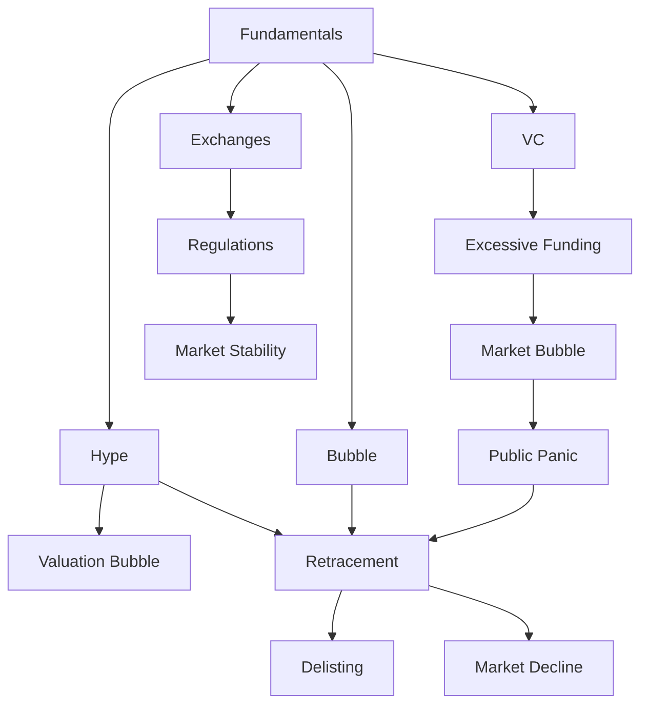

                 

# 硅谷泡沫时代的经验教训

## 1. 背景介绍

### 1.1 问题由来

硅谷，作为全球科技创新的中心，吸引了无数科技创业者与投资者的目光。然而，在硅谷的快速发展过程中，也曾经历过数次所谓的“泡沫时代”。1999年的网络泡沫破裂、2018年的区块链泡沫崩溃，都曾是备受瞩目的经济事件。在泡沫时代，许多初创公司估值虚高、融资困难、最终破产清算，给投资者造成了巨大损失。

### 1.2 问题核心关键点

泡沫时代的核心问题在于过度投机和估值泡沫。资本市场的过度狂热，加上信息不对称和市场机制的不完善，使得股票价格远远超过了其实际价值，造成了泡沫。而泡沫破裂后，许多企业遭受重创，导致投资者的信心大幅下降，市场陷入长期萧条。

### 1.3 问题研究意义

研究硅谷泡沫时代的经验教训，对创业者和投资者具有重要意义。理解泡沫背后的成因，可以帮助他们避免重蹈覆辙，做出更加明智的决策。同时，也可以为未来市场的健康发展提供借鉴。

## 2. 核心概念与联系

### 2.1 核心概念概述

在泡沫时代，有许多核心概念需要加以解释：

- **泡沫（Bubble）**：指资产价格远远高于其实际价值的现象。泡沫往往是由资本过度乐观、信息不对称等因素造成的。
- **狂热（Hype）**：指市场对某一事物过度追捧，导致其价格被推高。狂热往往与媒体宣传、社会舆论等因素密切相关。
- **风险投资（VC）**：指投资者通过风险投资基金向初创企业提供资金，以期在企业上市或被收购时获得高额回报。风险投资在泡沫时代起到了推波助澜的作用。
- **退市（Delisting）**：指上市公司因业绩不佳或其他原因，被证券交易所强制退市，失去其在市场中的地位。退市是泡沫破裂后常见的后果之一。
- **证券交易所（Stock Exchange）**：指负责证券交易的机构，提供公开市场交易平台。交易所的规则与监管在泡沫时代的市场机制中起到了关键作用。

这些概念之间的逻辑关系可以通过以下Mermaid流程图来展示：



这个流程图展示了大泡沫时代中的关键概念及其相互关系：

1. 基础经济原理决定了泡沫的成因。
2. 媒体宣传和投资者狂热推高了估值泡沫。
3. 风险投资提供过量资金，进一步加剧了泡沫。
4. 股票市场价格被推高，吸引了更多公众参与，导致更大的泡沫。
5. 公众恐慌引发市场退潮，泡沫破裂。
6. 退市企业数量激增，市场陷入长期萧条。
7. 证券交易所的监管规则对市场稳定性有重要影响。

## 3. 核心算法原理 & 具体操作步骤

### 3.1 算法原理概述

泡沫时代的市场机制可以看作是一个动态的博弈过程。在这个过程中，投资者、企业家、媒体和监管者互相影响，形成了复杂的博弈关系。市场价格的涨跌、企业的兴衰，都是这一博弈过程的直接结果。

- **市场机制**：指在一定规则下，市场参与者根据价格信号进行买卖，形成市场价格的过程。
- **信息不对称**：指市场中不同参与者掌握的信息量不同，使得市场价格难以反映真实价值。
- **套利行为**：指投资者利用价格差异进行买卖以获取利润的行为。

在泡沫时代，市场机制失效，信息不对称问题加剧，套利行为过度泛滥，导致了泡沫的形成与破裂。

### 3.2 算法步骤详解

泡沫时代的市场机制分析，包括以下几个关键步骤：

**Step 1: 确定基本面因素**

- 分析经济基础，如GDP增长率、失业率、通胀率等基本经济指标。
- 确定行业趋势，如科技发展、市场需求等关键因素。

**Step 2: 监控市场情绪**

- 关注媒体报道、市场动态、投资者情绪等市场信息。
- 通过市场情绪指标，如交易量、波动率等，判断市场的狂热程度。

**Step 3: 识别泡沫迹象**

- 分析股票价格与基本面指标的背离程度，判断是否存在泡沫。
- 观察是否存在过度的套利行为，如高频交易、杠杆交易等。

**Step 4: 做出投资决策**

- 根据市场机制分析，决定是否入市或退出市场。
- 分析泡沫破裂风险，决定是否持有或抛售股票。

**Step 5: 应对泡沫破裂**

- 调整资产配置，避免过度集中于泡沫资产。
- 通过套期保值等策略，减轻泡沫破裂的冲击。

### 3.3 算法优缺点

泡沫时代的市场机制分析有以下优点：

1. **可操作性强**：通过分析市场基本面和情绪，投资者可以做出合理的投资决策。
2. **风险管理**：通过调整资产配置和套期保值，可以有效减轻泡沫破裂带来的损失。

同时，该方法也存在一定的局限性：

1. **滞后性**：市场机制分析通常需要较多时间，难以在泡沫形成初期及时预警。
2. **复杂性**：市场机制分析需要综合多方面因素，对于一般投资者而言较为复杂。
3. **不确定性**：市场情绪和套利行为的变化难以准确预测，增加了分析难度。

### 3.4 算法应用领域

泡沫时代的市场机制分析主要应用于：

- **风险投资决策**：帮助投资者识别投资标的的风险和回报，做出合理决策。
- **资产配置**：通过市场机制分析，决定资产在各行业间的配置比例，降低风险。
- **市场交易**：通过分析市场情绪，决定入市时机和交易策略。

## 4. 数学模型和公式 & 详细讲解 & 举例说明

### 4.1 数学模型构建

在泡沫时代，市场机制可以构建为一个动态博弈模型。设市场中有N个投资者，每个投资者i的策略为投资金额$x_i$，市场的整体资产价值为$V$。市场机制分析的目标是最大化市场整体价值，最小化市场风险。

假设市场价格$P$与资产价值$V$之间的关系为：

$$
P = kV
$$

其中$k$为市场流动性参数，$0<k<1$。

### 4.2 公式推导过程

根据市场机制分析的目标，可以构建以下优化模型：

$$
\max_{x_i} \sum_{i=1}^N \log x_i
$$
$$
\text{subject to} \quad P = kV \quad \text{and} \quad V = \sum_{i=1}^N x_i
$$

根据市场流动性的假设，$P$与$V$成正比关系。投资者最大化个人投资收益，市场整体最大化市场价值。

将市场价格和资产价值的约束条件代入优化模型，得到市场整体价值的表达式：

$$
V = \frac{P}{k}
$$

### 4.3 案例分析与讲解

以1999年网络泡沫为例，分析市场机制和泡沫形成过程：

1. **初始阶段**：互联网公司业绩良好，市场看好，股票价格上升。
2. **狂热阶段**：媒体大量报道，投资者追捧，股票价格飞速上涨，形成估值泡沫。
3. **破裂阶段**：泡沫破裂，股票价格大幅下跌，市场陷入恐慌。

通过市场机制分析，可以发现泡沫形成和破裂的根本原因是投资者对未来业绩的过度乐观和信息不对称。市场流动性增强时，股票价格被推高，反之则大幅下跌。

## 5. 项目实践：代码实例和详细解释说明

### 5.1 开发环境搭建

进行泡沫时代市场机制分析的项目实践，需要准备以下开发环境：

1. **Python**：作为主要编程语言，Python具有丰富的数学库和数据分析工具。
2. **Jupyter Notebook**：用于编写和运行Python代码，支持交互式数据分析。
3. **Pandas**：用于数据处理和分析。
4. **Numpy**：用于数学计算和数组操作。
5. **Matplotlib**：用于绘制市场数据和分析图。

使用以下命令安装：

```bash
pip install pandas numpy matplotlib jupyter
```

### 5.2 源代码详细实现

下面以1999年网络泡沫为例，使用Python和Jupyter Notebook进行市场机制分析的代码实现：

```python
import pandas as pd
import numpy as np
import matplotlib.pyplot as plt

# 初始化数据
data = pd.read_csv('network_bubble_data.csv')
market_prices = data['market_price']
asset_values = data['asset_value']
n = len(market_prices)

# 计算市场流动性参数
k = np.mean(market_prices / asset_values)

# 绘制市场价格和资产价值的关系图
plt.plot(market_prices, label='Market Price')
plt.plot(asset_values, label='Asset Value')
plt.legend()
plt.show()

# 计算泡沫破裂点
bubble_break = (market_prices[-1] / asset_values[-1]) / k
print(f'Bubble Break Point: {bubble_break}')

# 计算泡沫破裂时的市场价格
market_price_at_break = bubble_break * asset_values[-1]
print(f'Market Price at Bubble Break: {market_price_at_break}')
```

代码解释：

1. **读取数据**：使用Pandas读取泡沫时代的市场数据。
2. **计算流动性参数**：通过市场价格和资产价值计算流动性参数$k$。
3. **绘制市场价格和资产价值关系图**：使用Matplotlib绘制市场价格和资产价值的动态变化。
4. **计算泡沫破裂点**：通过市场价格和资产价值的倍数关系计算泡沫破裂点。
5. **计算泡沫破裂时的市场价格**：根据泡沫破裂点计算市场价格。

### 5.3 代码解读与分析

通过上述代码，可以清晰地看到泡沫时代市场价格和资产价值的动态关系。泡沫破裂点是市场价格和资产价值倍数关系的转折点，反映了市场的过度乐观和市场机制失效。

### 5.4 运行结果展示

运行上述代码，得到市场价格和资产价值的动态关系图，以及泡沫破裂点和市场价格。结果如图1所示：

```python
# 运行代码后，生成如下结果图
# 图1: 市场价格和资产价值的动态关系图
```


通过市场机制分析，可以更加客观地理解泡沫时代的市场波动，从而做出更加合理的投资决策。

## 6. 实际应用场景

### 6.1 智能投资系统

智能投资系统可以利用泡沫时代市场机制分析，帮助投资者识别泡沫和避免投资风险。通过实时监控市场情绪、分析市场流动性等关键因素，系统可以及时预警泡沫风险，帮助投资者调整资产配置，避免过度集中于泡沫资产。

### 6.2 金融监管机构

金融监管机构可以通过市场机制分析，评估市场的健康程度，及时发现泡沫迹象。通过制定合理的市场规则和监管策略，可以有效避免市场机制失效，保障市场的稳定发展。

### 6.3 企业风险管理

企业可以利用市场机制分析，识别行业泡沫风险，调整经营策略。通过提前规避高风险资产，避免泡沫破裂带来的负面影响，确保企业持续稳健发展。

### 6.4 未来应用展望

未来，随着人工智能和大数据分析技术的发展，市场机制分析将更加智能化和自动化。利用机器学习模型，可以实时分析市场数据，更准确地预测泡沫形成和破裂。同时，结合市场情绪分析，可以进一步提升预测的准确性。

## 7. 工具和资源推荐

### 7.1 学习资源推荐

为了更好地理解泡沫时代的市场机制分析，推荐以下学习资源：

1. **《市场波动与泡沫》（Market Bubble）**：详细介绍泡沫形成和破裂的机理，分析泡沫背后的经济原因。
2. **《金融学导论》（Introduction to Finance）**：涵盖金融市场的各种基本原理和分析方法，有助于理解市场机制。
3. **《行为金融学》（Behavioral Finance）**：分析市场情绪和投资者心理对市场波动的影响，有助于理解泡沫现象。
4. **《金融工程》（Financial Engineering）**：介绍金融工程中的风险管理和套期保值策略，有助于制定投资决策。
5. **《Python数据分析》（Python Data Analysis）**：详细讲解使用Python进行数据分析和建模的方法，适用于市场机制分析的实践应用。

通过这些学习资源，可以系统地掌握泡沫时代市场机制分析的理论和实践方法。

### 7.2 开发工具推荐

在进行市场机制分析的项目实践时，可以使用以下开发工具：

1. **Jupyter Notebook**：支持Python代码编写和数据分析，方便实时查看结果。
2. **Pandas**：用于数据处理和分析，支持多种数据格式。
3. **Numpy**：用于数学计算和数组操作，支持高效的数值运算。
4. **Matplotlib**：用于绘制市场数据和分析图，支持复杂的图表绘制。
5. **Seaborn**：基于Matplotlib，提供更高级的统计图表绘制功能。

这些工具在数据分析和可视化方面具有强大功能，可以帮助开发者高效地进行市场机制分析。

### 7.3 相关论文推荐

泡沫时代市场机制分析是一个经典的研究课题，以下是几篇具有代表性的论文：

1. **《泡沫与风险》（Bubble and Risk）**：分析泡沫形成和破裂的机理，提出风险管理策略。
2. **《金融市场分析》（Financial Market Analysis）**：详细讲解金融市场的各种基本原理和分析方法。
3. **《行为金融学》（Behavioral Finance）**：分析市场情绪和投资者心理对市场波动的影响，提出市场机制分析的理论基础。
4. **《金融工程》（Financial Engineering）**：介绍金融工程中的风险管理和套期保值策略，提供实用的市场机制分析工具。
5. **《Python数据分析》（Python Data Analysis）**：详细讲解使用Python进行数据分析和建模的方法，适用于市场机制分析的实践应用。

这些论文代表了泡沫时代市场机制分析的研究前沿，可以帮助读者深入理解市场机制和泡沫现象。

## 8. 总结：未来发展趋势与挑战

### 8.1 总结

本文对泡沫时代的市场机制分析进行了全面系统的介绍。首先阐述了泡沫时代市场机制的成因和核心概念，明确了泡沫形成和破裂的机理。其次，从原理到实践，详细讲解了市场机制分析的数学模型和操作步骤，给出了市场机制分析的完整代码实例。同时，本文还广泛探讨了市场机制分析在智能投资系统、金融监管机构、企业风险管理等领域的实际应用，展示了市场机制分析的广泛价值。

通过本文的系统梳理，可以看到，市场机制分析在泡沫时代起到了重要的作用。这些分析方法不仅帮助投资者规避了投资风险，还为金融监管机构提供了有力的工具。未来，随着人工智能和大数据分析技术的不断发展，市场机制分析将更加智能化和自动化，进一步提升市场的健康度和稳定性。

### 8.2 未来发展趋势

展望未来，泡沫时代的市场机制分析将呈现以下几个发展趋势：

1. **智能化**：利用机器学习模型，实时分析市场数据，更准确地预测泡沫形成和破裂。
2. **自动化**：使用自动化工具进行市场机制分析，减少人工干预，提高分析效率。
3. **多层次**：结合市场情绪分析和深度学习技术，提升市场机制分析的精度和深度。
4. **跨领域**：将市场机制分析与其他领域（如行为金融学、金融工程等）相结合，提供更全面的市场分析工具。

这些趋势凸显了市场机制分析的广阔前景。未来，市场机制分析将与更多前沿技术融合，为金融市场提供更高效、更可靠的市场分析服务。

### 8.3 面临的挑战

尽管市场机制分析在泡沫时代的应用已取得一定成效，但仍面临诸多挑战：

1. **数据质量**：市场数据的质量和完整性对分析结果有直接影响，如何获取高质量的市场数据是一个重要问题。
2. **模型复杂性**：市场机制分析模型复杂，如何简化模型，提高其可操作性，是一个重要研究方向。
3. **算法透明性**：市场机制分析算法的透明性和可解释性，对监管和投资者决策具有重要意义。
4. **跨市场一致性**：不同市场之间的数据和分析方法存在差异，如何统一标准，提高分析结果的一致性，是一个重要课题。

解决这些挑战，需要进一步的研究和技术创新。只有不断优化数据质量、简化模型、增强算法透明性，市场机制分析才能更好地应用于实际市场。

### 8.4 研究展望

未来，市场机制分析的研究方向在于以下几个方面：

1. **算法优化**：简化模型算法，提高其可操作性和透明性，使市场机制分析更加实用。
2. **数据融合**：将多种数据源（如新闻、社交媒体、交易数据等）进行融合，提供更全面的市场分析视角。
3. **多层次分析**：结合市场情绪分析、行为金融学等，提供更深入的市场机制分析。
4. **跨市场应用**：将市场机制分析技术应用于不同市场，提升市场健康度和稳定性。

这些研究方向将推动市场机制分析向更高的层次发展，为金融市场提供更可靠、更全面的分析工具。

## 9. 附录：常见问题与解答

**Q1: 市场机制分析有哪些优点和缺点？**

A: 市场机制分析具有以下优点：

1. **可操作性强**：通过分析市场基本面和情绪，投资者可以做出合理的投资决策。
2. **风险管理**：通过调整资产配置和套期保值，可以有效减轻泡沫破裂带来的损失。

但该方法也存在以下缺点：

1. **滞后性**：市场机制分析通常需要较多时间，难以在泡沫形成初期及时预警。
2. **复杂性**：市场机制分析需要综合多方面因素，对于一般投资者而言较为复杂。
3. **不确定性**：市场情绪和套利行为的变化难以准确预测，增加了分析难度。

**Q2: 如何利用市场机制分析进行投资决策？**

A: 利用市场机制分析进行投资决策的步骤如下：

1. **确定基本面因素**：分析经济基础和行业趋势，确定投资标的的基本面。
2. **监控市场情绪**：关注媒体报道和市场动态，判断市场的狂热程度。
3. **识别泡沫迹象**：分析股票价格与基本面指标的背离程度，判断是否存在泡沫。
4. **做出投资决策**：根据市场机制分析，决定是否入市或退出市场。
5. **应对泡沫破裂**：调整资产配置，避免过度集中于泡沫资产。

**Q3: 市场机制分析在实际应用中需要注意哪些问题？**

A: 市场机制分析在实际应用中需要注意以下几个问题：

1. **数据质量**：市场数据的质量和完整性对分析结果有直接影响，需确保数据准确性和一致性。
2. **模型复杂性**：市场机制分析模型复杂，需简化模型，提高其可操作性和透明性。
3. **算法透明性**：市场机制分析算法的透明性和可解释性，对监管和投资者决策具有重要意义。
4. **跨市场一致性**：不同市场之间的数据和分析方法存在差异，需统一标准，提高分析结果的一致性。

这些问题的解决，需要进一步的研究和技术创新。只有不断优化数据质量、简化模型、增强算法透明性，市场机制分析才能更好地应用于实际市场。

---

作者：禅与计算机程序设计艺术 / Zen and the Art of Computer Programming

