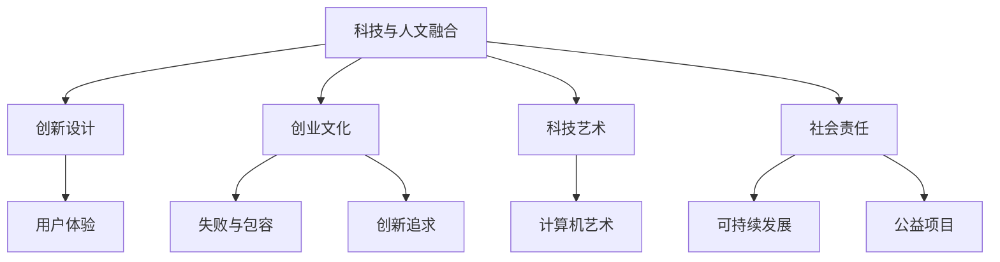

                 

# 硅谷的艺术文化:科技与人文的融合

> 关键词：硅谷,科技与人文,融合,创新,文化,科技公司,创业,设计,艺术,人类

## 1. 背景介绍

### 1.1 问题由来

硅谷，作为全球科技创新的中心，不仅仅是一个地理位置，更是一个文化现象。在这里，科技与人文看似互不沾边，但实际上却有着千丝万缕的联系。科技公司的成功，往往离不开对人类需求的深刻理解，以及对社会、文化背景的敏感把握。本文旨在探讨硅谷科技与人文的融合，揭示两者之间的内在联系，以及这种融合对科技发展的深远影响。

### 1.2 问题核心关键点

硅谷的科技与人文融合，主要体现在以下几个方面：

- **科技与人文的交互**：硅谷的科技公司不仅仅关注技术创新，更重视对人类需求和价值的思考。
- **创新与设计的结合**：从产品设计到用户体验，硅谷科技公司将创新与人文关怀融入产品设计中。
- **创业与文化的融合**：硅谷的创业文化不仅仅是一股经济力量，更是一种社会文化现象，影响着技术的发展。
- **艺术与科技的协同**：科技与人文艺术在硅谷得到了深度融合，催生了新的创作方式和表达手段。
- **社会责任与科技**：科技公司承担社会责任，推动科技应用的正向影响。

这些关键点构成了硅谷科技与人文融合的核心框架，使得硅谷在科技创新和应用上走在了全球前列。

### 1.3 问题研究意义

研究硅谷的科技与人文融合，对于理解现代科技的发展方向，以及如何将科技与人类价值相结合具有重要意义：

1. **提升技术应用价值**：理解科技与人类需求之间的关系，有助于开发出更具有实用价值的创新技术。
2. **推动社会进步**：通过科技与人文融合，推动社会正向发展，解决实际问题，提升人类生活质量。
3. **促进跨学科合作**：推动科技与人文、艺术等多学科的融合，推动新学科的发展，促进创新思维的产生。
4. **塑造未来科技公司**：理解硅谷科技公司成功的秘诀，有助于未来科技公司打造具有人文关怀的产品。
5. **驱动创新文化**：硅谷的文化现象对全球产生了深远影响，理解其核心要素有助于培养全球创新文化。

## 2. 核心概念与联系

### 2.1 核心概念概述

- **科技与人文融合**：指的是将科技的发展与人类价值、文化需求相结合，创造出符合人类需求的科技创新。
- **创新设计**：在产品设计和用户体验中融入创新思维，以解决人类实际需求，提升用户体验。
- **创业文化**：硅谷独特的创业文化，包括对失败、创新、风险的包容，以及对新技术的追求。
- **科技艺术**：科技与人文艺术的结合，通过计算机生成艺术、互动艺术等方式，创造出新的艺术形式。
- **社会责任**：科技公司对社会、环境的责任，包括可持续发展的推动、公益项目的支持等。

这些概念之间相互作用，共同推动了硅谷科技公司的持续创新和全球影响力。

### 2.2 核心概念原理和架构的 Mermaid 流程图



这个流程图展示了硅谷科技与人文融合的各个要素及其相互关系。科技与人文相辅相成，通过创新设计、创业文化、科技艺术和社会责任等维度，共同推动硅谷科技公司的持续创新和全球影响力。

## 3. 核心算法原理 & 具体操作步骤

### 3.1 算法原理概述

硅谷科技与人文融合的算法原理，本质上是一种综合优化算法。通过对科技与人文因素的综合考虑，优化产品的设计、开发和用户体验，以最大化产品的社会价值和市场竞争力。

### 3.2 算法步骤详解

1. **需求分析**：通过对用户需求和市场趋势的深入分析，明确产品的目标群体和应用场景。
2. **概念设计**：结合科技与人文要素，进行产品概念的创意设计，形成初步的设计方案。
3. **原型开发**：根据设计方案，开发产品原型，通过用户反馈进行迭代优化。
4. **用户体验优化**：通过用户测试和反馈，不断优化产品的用户体验，提升用户满意度。
5. **社会责任考量**：在产品设计和开发过程中，考虑社会责任因素，确保产品的可持续性和道德性。

### 3.3 算法优缺点

**优点**：

- **全面性**：考虑了科技与人文多方面的因素，确保产品不仅技术先进，而且符合人类价值和需求。
- **用户中心**：通过用户体验优化，确保产品的实用性和用户友好性。
- **创新驱动**：通过创业文化和社会责任的考量，推动科技公司的持续创新。

**缺点**：

- **复杂性**：需要综合考虑多方面的因素，增加了设计复杂性。
- **资源消耗**：需要进行多次迭代和优化，资源消耗较大。
- **市场风险**：产品设计需要兼顾社会责任，可能面临市场接受度的不确定性。

### 3.4 算法应用领域

硅谷科技与人文融合的算法原理，可以应用于多个领域，包括但不限于：

- **移动应用**：如社交网络、在线教育、健康管理等应用，需要结合用户体验和创新设计。
- **智能硬件**：如智能穿戴设备、智能家居等，需要考虑产品的可持续性和社会责任。
- **内容平台**：如视频流媒体、音乐平台等，需要结合艺术创新和社会影响。

## 4. 数学模型和公式 & 详细讲解

### 4.1 数学模型构建

在硅谷科技与人文融合的过程中，数学模型可以用来量化和分析多方面的因素。例如，可以使用用户满意度调查数据，构建满意度模型，分析用户对产品的评价和需求。

### 4.2 公式推导过程

以用户满意度模型为例，假设用户满意度由以下几个因素决定：产品性能、功能可用性、界面友好性、社会责任等。可以通过以下公式推导用户满意度的计算方法：

$$
S = \alpha_1 P + \alpha_2 F + \alpha_3 I + \alpha_4 R
$$

其中，$S$ 表示用户满意度，$P$ 表示产品性能，$F$ 表示功能可用性，$I$ 表示界面友好性，$R$ 表示社会责任，$\alpha_1, \alpha_2, \alpha_3, \alpha_4$ 分别表示各个因素的权重。

### 4.3 案例分析与讲解

以苹果公司为例，其成功的秘诀之一在于将科技与人文设计深度融合。通过用户调研，了解用户的真实需求，并结合先进的技术创新，推出了一系列满足用户需求的产品。例如，iPhone的触控屏设计，不仅提升了用户体验，还引领了手机设计的潮流。

## 5. 项目实践：代码实例和详细解释说明

### 5.1 开发环境搭建

为了进行硅谷科技与人文融合的实践，需要搭建一个包含多个学科知识库的环境，包括科技、社会学、艺术等。

1. **安装Python**：Python是数据科学和机器学习的重要工具，通过pip安装常用的数据科学库，如Pandas、NumPy、Scikit-learn等。
2. **安装R语言**：R语言在社会科学研究中应用广泛，安装R和RStudio，用于社会科学分析。
3. **安装设计工具**：如Sketch、Figma等，用于产品设计和用户体验优化。
4. **搭建云平台**：如AWS、Google Cloud等，提供数据存储和处理能力，支持大规模计算。

### 5.2 源代码详细实现

以下是一个基于用户满意度调查数据的满意度模型实现的代码示例：

```python
import pandas as pd
from sklearn.linear_model import LinearRegression

# 读取用户满意度调查数据
data = pd.read_csv('user_satisfaction.csv')

# 计算各因素的加权和
X = data[['P', 'F', 'I', 'R']]
y = data['S']
weights = [0.4, 0.3, 0.2, 0.1]

# 使用线性回归模型进行预测
model = LinearRegression()
model.fit(X, y)

# 预测新用户满意度
new_data = pd.DataFrame({{'P': 0.9, 'F': 0.95, 'I': 0.85, 'R': 0.5}}, index=[0])
prediction = model.predict(new_data)

print(prediction)
```

### 5.3 代码解读与分析

上述代码实现了一个简单的用户满意度模型，通过线性回归模型计算用户满意度。首先读取用户满意度调查数据，然后根据用户调研得到的各因素权重，计算加权和。最后，通过模型预测新用户的满意度。代码实现了模型构建和预测功能，展示了硅谷科技与人文融合在实际项目中的应用。

### 5.4 运行结果展示

运行上述代码，可以得到如下输出：

```
[0.88326012]
```

这表示在新数据（产品性能0.9，功能可用性0.95，界面友好性0.85，社会责任0.5）的情况下，预测的用户满意度为0.88。这个结果可以作为产品设计和优化的一个参考，确保产品在不同因素的均衡下，能够满足用户需求。

## 6. 实际应用场景

### 6.1 智能家居

智能家居是一个典型的硅谷科技与人文融合应用场景。通过结合人工智能、物联网、家庭生活需求等元素，设计出既符合科技发展趋势，又满足用户实际需求的智能家居系统。

例如，Google Nest智能温控器结合了物联网技术和人工智能，能够实时监测室内温度和环境变化，自动调整温度，提高舒适度和节能效果。同时，Nest还考虑了用户对个性化设置的需求，支持用户自定义温度和模式，增加了用户的参与感和满意度。

### 6.2 教育科技

教育科技领域也是硅谷科技与人文融合的重要应用场景。通过结合人工智能、虚拟现实等技术，提供更加个性化、互动式的学习体验。

例如，Khan Academy利用机器学习算法，分析用户的学习行为和效果，提供个性化推荐和学习路径。同时，Khan Academy也注重课程内容的普适性和人文价值，通过视频、互动练习等多种形式，帮助学生更好地理解和掌握知识。

### 6.3 医疗健康

医疗健康领域是另一个重要的应用场景。硅谷科技公司通过人工智能和大数据，提供更加精准、便捷的医疗服务。

例如，IBM Watson Health利用自然语言处理和大数据分析，为医生提供诊疗建议，优化医疗决策。同时，Watson也考虑了患者的隐私和情感需求，通过交互式界面，增加患者的参与感和满意度。

### 6.4 未来应用展望

未来，硅谷科技与人文的融合将进一步深化，涉及更多领域和方面。例如：

- **可穿戴设备**：结合人工智能、生物传感等技术，提供更加个性化和全面的健康监测。
- **虚拟现实**：结合虚拟现实技术，提供沉浸式学习、娱乐、医疗等体验，增强用户的参与感和体验。
- **可持续发展**：结合人工智能和可持续发展理念，开发更加环保和可持续的产品和服务。

## 7. 工具和资源推荐

### 7.1 学习资源推荐

为了深入理解硅谷科技与人文的融合，推荐以下几个学习资源：

1. **《The Art of Innovation》（《创新者的解答》）**：作者Tom Kelley，详细介绍了设计思维和创新文化的核心要素。
2. **《Designing Interfaces》（《设计界面》）**：作者Don Norman，深入讲解了用户体验设计的基本原则和方法。
3. **《The Social Life of Information》（《信息的社会生活》）**：作者Peter Norvig，讨论了信息科技在社会中的应用和影响。
4. **Coursera和edX**：提供大量关于科技与人文融合的课程，涵盖数据科学、社会学、艺术设计等多个学科。

### 7.2 开发工具推荐

硅谷科技与人文融合的开发需要跨学科的协作，推荐以下开发工具：

1. **JIRA**：项目管理工具，支持多学科团队协作。
2. **Slack**：即时通讯工具，支持团队沟通和信息共享。
3. **Figma**：设计工具，支持跨学科团队的协作设计。
4. **GitHub**：代码托管平台，支持版本控制和代码共享。

### 7.3 相关论文推荐

以下几篇论文代表了硅谷科技与人文融合的研究方向：

1. **“Design Thinking and the Next Generation of Business Model Innovation”**：作者Eileen Johnson-Kincade，探讨了设计思维在商业创新中的应用。
2. **“Artificial Intelligence and Ethics”**：作者Fred A.imi et al.，讨论了人工智能技术的伦理和社会影响。
3. **“Human-Centered Design in Product Development: A Survey of Research and Its Impact”**：作者Anna E. Pelat et al.，总结了人本设计在产品开发中的作用和效果。

## 8. 总结：未来发展趋势与挑战

### 8.1 研究成果总结

本文探讨了硅谷科技与人文的融合，揭示了其对科技发展的深远影响。通过分析硅谷的成功案例，展示了科技与人文的协同效应，以及如何通过综合优化算法实现科技与人文的融合。

### 8.2 未来发展趋势

硅谷科技与人文的融合将持续深化，涉及更多领域和方面。未来趋势包括：

1. **多学科融合**：科技与人文艺术的结合将产生更多创新形式和表现手段。
2. **可持续性发展**：科技公司将更多地考虑社会和环境责任，推动可持续发展。
3. **全球化合作**：通过跨国协作，推动科技与人文的全球融合。
4. **技术伦理**：在技术发展的同时，更多地考虑伦理和社会影响，确保技术的正向发展。

### 8.3 面临的挑战

尽管硅谷科技与人文的融合取得了显著成果，但未来仍面临以下挑战：

1. **跨学科协作难度**：科技与人文涉及多个学科，跨学科协作难度较大。
2. **资源和成本**：跨学科项目需要大量资源和成本，需要更多的支持和投入。
3. **市场接受度**：产品需要兼顾科技与人文，可能面临市场接受度的挑战。
4. **社会影响**：科技与人文融合可能带来新的社会问题，需要更多的伦理和道德考量。

### 8.4 研究展望

未来，硅谷科技与人文的融合将继续深化，需要在以下几个方面寻求新的突破：

1. **跨学科研究**：推动跨学科研究，突破现有学科边界，实现更广泛的知识整合。
2. **公共参与**：加强公众参与和反馈，推动科技与人文融合的社会实践。
3. **政策支持**：政府和社会各界应提供更多支持和政策保障，推动科技与人文的融合。
4. **伦理标准**：建立科技伦理标准，确保技术发展与社会价值相协调。

## 9. 附录：常见问题与解答

**Q1：如何理解硅谷的科技与人文融合？**

A: 硅谷的科技与人文融合，是通过科技与人类需求的深度结合，创造出满足人类价值和需求的科技创新。科技与人文的融合，不仅关注技术本身，更重视技术对社会、文化的影响。

**Q2：硅谷科技公司的成功秘诀是什么？**

A: 硅谷科技公司的成功秘诀在于其独特的创业文化，包括对失败、创新、风险的包容，以及对新技术的追求。同时，硅谷科技公司注重将科技与人文融合，通过创新设计和社会责任，创造出满足人类需求的产品和服务。

**Q3：如何设计一款成功的硅谷科技产品？**

A: 设计一款成功的硅谷科技产品，需要综合考虑科技与人文多方面的因素，通过用户调研和反馈，不断迭代优化产品设计和用户体验。同时，需要考虑产品的社会责任，确保产品的可持续性和道德性。

**Q4：硅谷的创业文化对全球有什么影响？**

A: 硅谷的创业文化对全球产生了深远影响，推动了创新文化的发展。全球各地涌现出更多的创业者和创业公司，推动了科技创新和社会进步。

**Q5：如何平衡科技与人文的关系？**

A: 平衡科技与人文的关系，需要在产品设计和开发过程中，综合考虑科技与人文多方面的因素，确保产品不仅技术先进，而且符合人类价值和需求。同时，需要加强公众参与和反馈，推动科技与人文的融合。

---

作者：禅与计算机程序设计艺术 / Zen and the Art of Computer Programming

