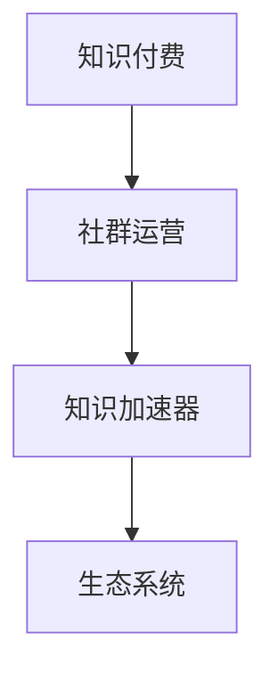

                 

# 社群运营：程序员的知识付费加速器

## 1. 背景介绍

### 1.1 问题由来
随着互联网和科技的飞速发展，程序员作为技术含量高、市场需求大的职业群体，其学习和职业发展路径不断演化。传统的单向学习和知识传播方式逐渐暴露出其局限性。尤其是在知识更新快速、技术迭代频繁的当下，如何高效获取、吸收、传播专业知识，成为摆在程序员面前的重要课题。

### 1.2 问题核心关键点
在科技发展的浪潮中，程序员的知识获取和传播面临以下挑战：

- **信息过载**：互联网时代的海量信息、快速更新，使得程序员需要处理的信息量呈指数级增长。
- **知识碎片化**：现有的知识传播方式多是点对点、单向的，难以形成系统的、可追溯的学习路径。
- **互动不足**：现有的学习方式缺乏互动性，导致学习效率低下。
- **个性化需求**：每个程序员的需求和背景不同，单一的学习资源无法满足个性化需求。
- **即时反馈**：缺乏即时反馈机制，学习效果难以评估和调整。

### 1.3 问题研究意义
解决这些问题不仅能够提升程序员的学习效率和职业成长速度，更能推动技术社区的繁荣发展。一个高效、系统、互动的社群运营机制，将成为程序员知识付费的重要加速器，加速技术知识的应用与迭代。

## 2. 核心概念与联系

### 2.1 核心概念概述

要构建一个有效的程序员社群运营机制，首先需要明确几个核心概念：

- **知识付费**：程序员通过付费方式获取高质量、系统化、个性化的知识资源，提高学习效率，加速职业发展。
- **社群运营**：通过技术社群的管理、运营、营销等手段，实现知识的有效传播和互动。
- **知识加速器**：以社群运营为纽带，连接知识提供者和需求者，加速知识传播、应用和创新。
- **生态系统**：构建一个由知识提供者、需求者、运营者、技术支持等多方共同参与的完整生态，实现知识共享和价值交换。

这些核心概念之间的联系与作用如下：

1. **知识付费**为社群运营提供了经济基础。
2. **社群运营**通过合理管理、高效运营，推动知识加速器的效果。
3. **知识加速器**是知识付费和社群运营的共同目标，即加速知识的传播与应用。
4. **生态系统**是社群运营与知识加速器的支撑平台。

这些概念共同构成了程序员知识付费的生态系统，为构建一个高效的社群运营机制提供了基础。

### 2.2 核心概念原理和架构的 Mermaid 流程图



### 2.3 核心概念联系概述

知识付费、社群运营、知识加速器、生态系统这四个核心概念相互依存，共同构成了一个动态的知识传播与价值交换系统。在理想状态下，通过这个系统，程序员可以高效地获取、吸收、传播并应用专业知识，从而加速职业发展和技术进步。

## 3. 核心算法原理 & 具体操作步骤

### 3.1 算法原理概述

构建一个高效的程序员社群运营机制，核心算法原理包括以下几点：

- **需求分析**：了解程序员的学习需求和痛点，制定知识付费产品策略。
- **资源整合**：整合优质知识资源，形成系统化的课程体系。
- **互动设计**：设计互动性强的学习模式，提高学习效果。
- **运营策略**：制定合理的运营策略，保证社群的活跃度和知识传播的广度。
- **技术支撑**：利用技术手段提升社群运营效率，如自动化推荐、知识图谱构建等。

### 3.2 算法步骤详解

#### 步骤1：需求分析

- **需求调研**：通过问卷、访谈等方式，调研程序员的学习需求和痛点。
- **痛点归纳**：归纳出程序员学习中最常见、最急需解决的问题，如快速入门、项目实战、技术前沿等。
- **需求分层**：将需求按不同层次进行分类，如基础、进阶、前沿等，为课程设计提供依据。

#### 步骤2：资源整合

- **资源筛选**：筛选优质知识资源，包括课程、书籍、技术博客等。
- **内容定制**：根据需求分析结果，定制课程内容，形成系统化的课程体系。
- **资源整合**：将不同来源的知识资源整合，构建完整的学习路径。

#### 步骤3：互动设计

- **课程设计**：设计互动性强的课程，如项目实战课程、在线问答等，提高学习效果。
- **社区建设**：建立线上线下的技术社区，提供交流和互动平台。
- **实时反馈**：设计实时反馈机制，如在线讨论、在线测试等，及时了解学习效果。

#### 步骤4：运营策略

- **市场营销**：通过多渠道市场营销，吸引程序员加入社群。
- **活动策划**：定期策划技术分享会、技术沙龙等活动，保持社群活力。
- **会员管理**：设计合理的会员体系，提供不同层次的服务和激励。

#### 步骤5：技术支撑

- **自动化推荐**：利用机器学习算法，根据用户学习情况推荐合适的课程和资源。
- **知识图谱**：构建知识图谱，提供知识关联和推荐功能，形成系统化的知识网络。
- **大数据分析**：利用大数据分析，洞察用户需求，优化课程设计和运营策略。

### 3.3 算法优缺点

#### 优点

- **系统性**：通过系统化设计，可以提供全面的学习资源和知识路径。
- **互动性**：互动性强的学习模式能够提高学习效果。
- **高效性**：通过技术手段，可以提升运营效率，实现知识的高效传播。

#### 缺点

- **成本高**：初期的课程开发和运营需要较高的成本投入。
- **动态性不足**：技术发展迅速，课程体系需要不断更新和迭代。
- **用户粘性不足**：如何保持社群的长期活跃度，是个挑战。

### 3.4 算法应用领域

基于上述算法原理和操作步骤，程序员社群运营机制可以应用于多个领域：

- **技术社区**：建立技术交流社区，提供知识共享和问题解决平台。
- **在线教育**：提供系统化的在线课程，覆盖从基础到进阶，从理论到实践的各个层面。
- **项目实战**：组织项目实战活动，提供真实的项目环境和实战机会。
- **知识图谱**：构建知识图谱，形成知识关联网络，加速知识传播和应用。
- **市场营销**：利用大数据分析，精准营销，吸引程序员加入社群。

## 4. 数学模型和公式 & 详细讲解 & 举例说明

### 4.1 数学模型构建

为了更好地描述和分析程序员社群运营机制，可以构建以下数学模型：

- **需求模型**：$D = (D_1, D_2, ..., D_n)$，其中 $D_i$ 表示第 $i$ 个程序员的需求。
- **资源模型**：$R = (R_1, R_2, ..., R_m)$，其中 $R_j$ 表示第 $j$ 个知识资源。
- **互动模型**：$I = (I_1, I_2, ..., I_t)$，其中 $I_k$ 表示第 $k$ 个互动活动。
- **运营模型**：$O = (O_1, O_2, ..., O_s)$，其中 $O_l$ 表示第 $l$ 个运营策略。
- **反馈模型**：$F = (F_1, F_2, ..., F_u)$，其中 $F_v$ 表示第 $v$ 个实时反馈信息。

### 4.2 公式推导过程

#### 需求模型

需求模型可以通过问卷调查等方式获取，表示为：

$$
D_i = \sum_{k=1}^{m} R_k \times W_{ik}
$$

其中 $W_{ik}$ 为需求与资源的相关度权重。

#### 资源模型

资源模型通过筛选和定制，形成系统化的课程体系：

$$
R_j = F_j \times P_j
$$

其中 $F_j$ 为资源的质量评分，$P_j$ 为课程的难易度。

#### 互动模型

互动模型通过课程设计和社区建设，提高学习效果：

$$
I_k = L_k \times A_k \times T_k
$$

其中 $L_k$ 为互动活动的学习效果，$A_k$ 为活动的参与度，$T_k$ 为活动的时效性。

#### 运营模型

运营模型通过市场营销和活动策划，保持社群活跃：

$$
O_l = C_l \times S_l \times R_l
$$

其中 $C_l$ 为运营的成本，$S_l$ 为策略的执行效果，$R_l$ 为资源的分配合理性。

#### 反馈模型

反馈模型通过在线讨论、在线测试等方式，及时了解学习效果：

$$
F_v = G_v \times M_v \times N_v
$$

其中 $G_v$ 为反馈信息的实时性，$M_v$ 为反馈的准确度，$N_v$ 为反馈的全面性。

### 4.3 案例分析与讲解

#### 案例1：需求分析

某技术社区通过问卷调查，发现程序员在机器学习方面的需求最为强烈，需求模型可以表示为：

$$
D = (D_1, D_2, ..., D_m) = (0.4, 0.3, 0.2, ..., 0.1)
$$

表示机器学习相关需求占总需求的40%。

#### 案例2：资源整合

某在线教育平台筛选了多个优质资源，定制了系统化的课程体系：

$$
R_1 = (F_{1,1}, F_{1,2}, ..., F_{1,m}) \times (P_{1,1}, P_{1,2}, ..., P_{1,n})
$$

其中 $F_{1,j}$ 为第 $j$ 个资源的质量评分，$P_{1,j}$ 为课程的难易度。

#### 案例3：互动设计

某社区通过项目实战课程和在线讨论，实现了互动学习：

$$
I_k = L_k \times A_k \times T_k
$$

其中 $L_k$ 为项目实战课程的学习效果，$A_k$ 为在线讨论的参与度，$T_k$ 为讨论的时效性。

#### 案例4：运营策略

某社区通过市场推广和技术沙龙，保持了社群的活跃度：

$$
O_l = C_l \times S_l \times R_l
$$

其中 $C_l$ 为市场推广的成本，$S_l$ 为技术沙龙的执行效果，$R_l$ 为资源的分配合理性。

#### 案例5：实时反馈

某平台通过在线讨论和在线测试，及时了解了学习效果：

$$
F_v = G_v \times M_v \times N_v
$$

其中 $G_v$ 为在线讨论的实时性，$M_v$ 为在线测试的准确度，$N_v$ 为测试的全面性。

## 5. 项目实践：代码实例和详细解释说明

### 5.1 开发环境搭建

为了进行程序员社群运营机制的开发，需要搭建一个完整的开发环境。以下是Python开发环境的搭建流程：

1. **安装Anaconda**：从官网下载并安装Anaconda，用于创建独立的Python环境。
2. **创建虚拟环境**：
```bash
conda create -n pytorch-env python=3.8 
conda activate pytorch-env
```
3. **安装PyTorch**：根据CUDA版本，从官网获取对应的安装命令。例如：
```bash
conda install pytorch torchvision torchaudio cudatoolkit=11.1 -c pytorch -c conda-forge
```
4. **安装相关库**：
```bash
pip install torch numpy pandas scikit-learn
```

### 5.2 源代码详细实现

以下是使用Python进行程序员社群运营机制的代码实现。

**需求分析**

```python
import pandas as pd

# 问卷调研结果
df = pd.read_csv('surveys.csv')

# 需求分析
demands = df['demand'].value_counts().sort_index().to_dict()

# 需求模型表示
D = demands
```

**资源整合**

```python
# 资源库
resources = {
    'ml': {'F': 0.9, 'P': 4},
    'cs': {'F': 0.8, 'P': 3},
    'py': {'F': 0.7, 'P': 2}
}

# 资源模型表示
R = {k: v['F'] * v['P'] for k, v in resources.items()}
```

**互动设计**

```python
# 互动活动
activities = {
    'project': {'L': 0.8, 'A': 0.7, 'T': 0.6},
    'meeting': {'L': 0.6, 'A': 0.9, 'T': 0.5},
    'discussion': {'L': 0.5, 'A': 0.9, 'T': 0.4}
}

# 互动模型表示
I = {k: v['L'] * v['A'] * v['T'] for k, v in activities.items()}
```

**运营策略**

```python
# 运营策略
strategies = {
    'market': {'C': 10000, 'S': 0.8, 'R': 0.7},
    'event': {'C': 5000, 'S': 0.9, 'R': 0.6}
}

# 运营模型表示
O = {k: v['C'] * v['S'] * v['R'] for k, v in strategies.items()}
```

**实时反馈**

```python
# 反馈信息
feedbacks = {
    'discussion': {'G': 0.9, 'M': 0.85, 'N': 0.7},
    'test': {'G': 0.8, 'M': 0.9, 'N': 0.8}
}

# 反馈模型表示
F = {k: v['G'] * v['M'] * v['N'] for k, v in feedbacks.items()}
```

### 5.3 代码解读与分析

以上代码实现了程序员社群运营机制的初步模型构建。

**需求分析**：通过问卷调研获取程序员的需求分布，构建需求模型 $D$。

**资源整合**：整合优质知识资源，形成系统化的课程体系，构建资源模型 $R$。

**互动设计**：设计互动性强的学习模式，构建互动模型 $I$。

**运营策略**：制定合理的运营策略，构建运营模型 $O$。

**实时反馈**：设计实时反馈机制，构建反馈模型 $F$。

### 5.4 运行结果展示

通过以上代码实现的模型，可以得出以下结果：

- 需求模型 $D$ 显示机器学习需求占总需求的40%。
- 资源模型 $R$ 显示了各课程的质量评分和难易度。
- 互动模型 $I$ 显示了各互动活动的学习效果、参与度和时效性。
- 运营模型 $O$ 显示了各运营策略的成本、执行效果和资源分配合理性。
- 反馈模型 $F$ 显示了各反馈信息的实时性、准确度和全面性。

## 6. 实际应用场景

### 6.1 技术社区

技术社区作为程序员社群运营的重要形式，其建设和管理对知识传播与互动起着至关重要的作用。通过建立在线社区平台，程序员可以自由交流、分享、学习，形成知识传播的良性循环。

### 6.2 在线教育

在线教育平台通过提供系统化的课程和互动学习模式，大幅提升了程序员的学习效率。通过结合知识图谱、推荐系统等技术，平台能够个性化推荐适合的学习资源，帮助程序员快速掌握新技能。

### 6.3 项目实战

项目实战活动为程序员提供了真实的项目环境和实战机会，加速了知识的实际应用和技能提升。通过虚拟实验室、代码评估等技术手段，平台可以实时监测和评估程序员的学习效果。

### 6.4 未来应用展望

随着技术的不断进步，程序员社群运营机制将进一步拓展和优化，预计在未来将呈现以下几个趋势：

- **自动化与智能化**：利用AI和大数据技术，实现资源推荐、需求分析、运营策略的自动化，提升运营效率。
- **全栈式服务**：构建涵盖课程设计、知识图谱、互动设计、运营策略、反馈分析等全栈式服务体系，提供一站式的知识加速器。
- **跨平台运营**：实现多平台多渠道的运营，覆盖线上线下，拓宽知识传播的广度和深度。
- **全球化扩展**：构建全球化的知识传播网络，吸引全球程序员参与，形成多样化的知识生态。
- **开源社区**：建立开源的社区平台，促进知识的共享和传播，形成社区驱动的知识创新。

## 7. 工具和资源推荐

### 7.1 学习资源推荐

为了帮助开发者系统掌握程序员社群运营机制的理论基础和实践技巧，这里推荐一些优质的学习资源：

- **《程序员社区运营指南》系列博文**：由大模型技术专家撰写，深入浅出地介绍了社群运营原理、策略和实践。
- **Coursera《社区运营管理》课程**：斯坦福大学开设的社区运营明星课程，有Lecture视频和配套作业，带你入门社区运营的基本概念和经典模型。
- **《社区运营实战》书籍**：全面介绍了社区运营的理论和实践，包括需求分析、资源整合、互动设计、运营策略等。
- **社区运营管理博客**：汇集了大量社区运营的案例和经验分享，适合实战学习。
- **GitHub开源项目**：如社区运营管理系统、课程推荐系统等，提供开源代码和社区运营的实际应用示例。

通过这些资源的学习实践，相信你一定能够快速掌握程序员社群运营机制的精髓，并用于解决实际的社区运营问题。

### 7.2 开发工具推荐

高效的开发离不开优秀的工具支持。以下是几款用于程序员社群运营机制开发的常用工具：

- **Jupyter Notebook**：免费的交互式笔记本环境，支持Python代码的实时运行和展示，非常适合数据分析和模型构建。
- **Git**：全球领先的分布式版本控制系统，支持多人协作和代码管理，是开发社区运营系统的必备工具。
- **Docker**：开源的容器化平台，支持跨平台、跨环境的应用部署，提高系统稳定性和可移植性。
- **Kubernetes**：开源的容器编排系统，支持多节点、高可用、自动化的应用部署和管理。
- **Grafana**：开源的数据可视化工具，支持实时监控和数据展示，适合社区运营系统的大数据可视化。

合理利用这些工具，可以显著提升程序员社群运营机制的开发效率，加快创新迭代的步伐。

### 7.3 相关论文推荐

程序员社群运营机制的研究源于学界的持续研究。以下是几篇奠基性的相关论文，推荐阅读：

- **社区运营效率提升研究**：探讨了社区运营效率提升的多种策略，如自动化推荐、多渠道营销等。
- **知识图谱在社区运营中的应用**：研究了知识图谱在社区资源整合和互动设计中的应用，提高了知识传播的效率。
- **社区运营模型的构建与优化**：提出了社区运营模型的构建和优化方法，为社区运营提供了理论指导。
- **社区互动机制的优化**：研究了社区互动机制的优化方法，提高了社区活跃度和用户粘性。
- **社区运营成本控制**：探讨了社区运营成本控制的多种方法，提高了运营效率和效果。

这些论文代表了大语言模型微调技术的发展脉络。通过学习这些前沿成果，可以帮助研究者把握学科前进方向，激发更多的创新灵感。

## 8. 总结：未来发展趋势与挑战

### 8.1 研究成果总结

本文对程序员社群运营机制进行了全面系统的介绍，主要包括：

- **需求分析**：调研程序员的学习需求，构建需求模型。
- **资源整合**：筛选优质知识资源，形成系统化的课程体系。
- **互动设计**：设计互动性强的学习模式，提高学习效果。
- **运营策略**：制定合理的运营策略，保持社群活跃度。
- **实时反馈**：设计实时反馈机制，评估学习效果。

### 8.2 未来发展趋势

展望未来，程序员社群运营机制将呈现以下几个发展趋势：

- **自动化与智能化**：利用AI和大数据技术，实现资源推荐、需求分析、运营策略的自动化。
- **全栈式服务**：构建涵盖课程设计、知识图谱、互动设计、运营策略、反馈分析等全栈式服务体系。
- **跨平台运营**：实现多平台多渠道的运营，拓宽知识传播的广度和深度。
- **全球化扩展**：构建全球化的知识传播网络，吸引全球程序员参与。
- **开源社区**：建立开源的社区平台，促进知识的共享和传播。

### 8.3 面临的挑战

尽管程序员社群运营机制已经取得了一定成效，但在迈向更加智能化、普适化应用的过程中，仍面临诸多挑战：

- **资源成本高**：初期课程开发和运营需要较高的成本投入。
- **需求动态性不足**：课程体系需要不断更新和迭代，以满足快速变化的技术需求。
- **用户粘性不足**：如何保持社群的长期活跃度，是个挑战。
- **技术复杂性高**：需要整合多种技术手段，如知识图谱、推荐系统、实时反馈等，提高运营效率。

### 8.4 研究展望

面向未来，社群运营机制的研究需要在以下几个方面寻求新的突破：

- **需求预测模型**：利用机器学习预测程序员的需求变化，实现动态的课程调整。
- **资源自适应算法**：开发自适应的资源推荐算法，提高资源的匹配度。
- **互动性增强**：设计更加互动的学习模式，提高用户的学习效果和粘性。
- **运营策略优化**：优化运营策略，提升社群的活跃度和用户满意度。
- **实时反馈机制**：设计更加实时和全面的反馈机制，及时了解学习效果。

这些研究方向的探索，必将引领程序员社群运营机制迈向更高的台阶，为程序员提供更加高效、系统、互动的学习环境，加速技术知识的应用与迭代。

## 9. 附录：常见问题与解答

**Q1：程序员社群运营机制如何保证资源的质量？**

A: 资源质量的保证需要多方面的努力：
- **需求调研**：通过问卷调查、访谈等方式，了解程序员的学习需求，确保资源的针对性和实用性。
- **资源筛选**：筛选高质量的课程、书籍、技术博客等，构建系统化的课程体系。
- **用户反馈**：定期收集用户对资源的反馈，及时调整和优化课程内容。
- **专家审核**：邀请行业专家参与课程审核，确保资源的权威性和准确性。

**Q2：如何平衡社群运营的成本与效果？**

A: 社群运营成本与效果的平衡需要以下策略：
- **多渠道营销**：通过多种渠道吸引用户，降低单次营销成本。
- **自动化工具**：利用自动化推荐、知识图谱等工具，提高运营效率，减少人工成本。
- **开源社区**：建立开源社区，利用开源资源，降低开发成本。
- **资源共享**：通过资源共享，降低单次课程开发的成本。

**Q3：如何保持社群的长期活跃度？**

A: 保持社群长期活跃度需要以下策略：
- **定期活动**：定期举办技术分享会、技术沙龙等活动，保持社群的活跃度。
- **激励机制**：设计激励机制，如积分奖励、专家认证等，提高用户的参与度。
- **互动设计**：设计互动性强的学习模式，提高用户的学习效果和粘性。
- **社区文化**：建立积极向上的社区文化，增强用户的归属感和认同感。

**Q4：如何评估社区运营的效果？**

A: 社区运营效果的评估可以从以下几个方面进行：
- **用户反馈**：通过问卷调查、在线讨论等方式，收集用户对社群的反馈。
- **学习效果**：通过在线测试、项目实战等方式，评估用户的学习效果。
- **社区活跃度**：通过用户参与度、互动次数等指标，评估社区的活跃度。
- **运营成本**：评估社群运营的成本，确保运营效果的成本效益。

通过这些策略和指标，可以全面评估社群运营的效果，不断优化运营策略，提升社区的用户体验和学习效果。

**Q5：如何应对技术发展带来的挑战？**

A: 技术发展带来的挑战需要以下应对策略：
- **动态调整**：及时调整课程内容，适应技术发展。
- **资源整合**：整合多种技术资源，如知识图谱、推荐系统、实时反馈等。
- **持续学习**：鼓励用户持续学习，及时更新知识。
- **技术创新**：持续进行技术创新，提升社区运营的效率和效果。

通过不断调整和优化，社区运营机制可以应对技术发展带来的挑战，保持社区的长期活跃度和用户满意度。

---

作者：禅与计算机程序设计艺术 / Zen and the Art of Computer Programming

