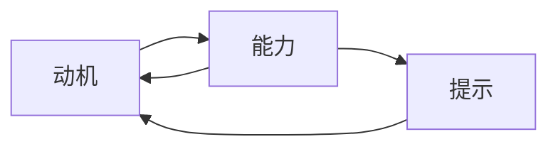

                 

# 福格行为模型在团队建设中的应用

## 1. 背景介绍

### 1.1 问题由来
在团队管理中，领导者经常面临激励团队成员、提升团队绩效的挑战。传统的激励手段往往依赖外部奖励（如奖金、晋升等），这种方法虽然有效，但成本高、周期长，且容易导致团队成员之间的竞争和矛盾。如何采用低成本、高效且持久的方法来提升团队成员的动力和绩效，成为现代团队管理的重要课题。

### 1.2 问题核心关键点
福格行为模型(Behavior Model of Change)作为一种行为科学的理论框架，提供了一套简单易行、科学有效的行为激励方法。该模型基于“动机”、“能力”和“提示”三个要素，帮助人们理解行为发生的机制，从而制定有效的行为干预策略。

### 1.3 问题研究意义
福格行为模型在团队建设中的应用，能够帮助团队领导者更科学地激励和管理团队成员，提升团队整体的工作效率和绩效。通过理解团队成员的行为机制，领导者可以设计更有针对性的激励措施，减少对外部奖励的依赖，增强团队的凝聚力和战斗力。

## 2. 核心概念与联系

### 2.1 核心概念概述
福格行为模型由行为科学家B.J.福格提出，是一种分析人类行为发生机制的模型。该模型认为，行为的发生需要三个要素：动机（ Motivation）、能力（Ability）和提示（Prompts）。只有当这三个要素同时满足时，行为才可能发生。

- **动机**：指驱动人们行动的内在愿望，如兴趣、信念、价值观等。
- **能力**：指完成某个行为所需的技能、资源、时间等。
- **提示**：指触发行为的外部刺激，如环境线索、视觉和听觉信息等。

### 2.2 核心概念原理和架构的 Mermaid 流程图


## 3. 核心算法原理 & 具体操作步骤
### 3.1 算法原理概述

福格行为模型在团队建设中的应用，主要体现在如何设计有效的“提示”和“能力提升策略”来激励团队成员。该模型认为，只有当团队成员感到有动力（动机），且有足够的资源（能力）和明确的行动指示（提示）时，他们才更有可能采取积极的行为。

### 3.2 算法步骤详解
1. **识别团队成员的动机**：了解团队成员的核心价值观、兴趣和目标，明确他们为什么会选择加入这个团队。
2. **评估团队成员的能力**：评估团队成员在特定任务上所需的技能、知识和资源。
3. **设计“提示”**：设计具体、明确的操作指南，使团队成员能够轻易采取所需的行为。
4. **提升团队成员的能力**：提供培训、资源和支持，帮助团队成员提升完成任务所需的能力。
5. **监控和反馈**：实时监控团队成员的行为表现，及时给予正向反馈和调整。

### 3.3 算法优缺点
#### 优点
- **成本低**：不需要额外的物质奖励，降低了激励成本。
- **效果持久**：通过激发内在的动机和提升能力，提高了团队成员的自我驱动力和责任感。
- **可操作性强**：模型简单易懂，领导者容易掌握并实施。

#### 缺点
- **实施难度高**：需要领导者深入了解团队成员的需求和动机，设计有效的“提示”。
- **效果因人而异**：不同团队成员的动机和能力差异较大，同一激励措施的效果可能不一致。
- **难以量化**：模型更多依赖定性分析，难以通过数据进行量化评估。

### 3.4 算法应用领域

福格行为模型在团队建设中的应用非常广泛，涵盖了多种情境：

- **项目管理**：帮助项目经理识别团队成员的动机，提升团队协作和任务完成效率。
- **人力资源管理**：指导HR部门设计更有效的招聘、培训和绩效评估策略。
- **团队文化建设**：通过设计团队行为规范和价值观，增强团队成员的归属感和荣誉感。
- **员工激励**：通过设定明确的目标和行为提示，激发员工的内在动力和创造力。

## 4. 数学模型和公式 & 详细讲解 & 举例说明
### 4.1 数学模型构建
福格行为模型虽然不涉及复杂的数学公式，但可以通过数学语言来进一步阐述其原理。模型的核心在于如何通过动机、能力和提示三个维度的组合，激励人们采取特定行为。

### 4.2 公式推导过程
假设某团队成员的动机为 $M$，能力为 $A$，提示为 $P$。则行为发生的概率 $P(B)$ 可以表示为：

$$
P(B) = \min(M \cdot A, M \cdot P)
$$

即行为发生的前提是，动机与能力、提示的乘积较小。当动机与能力或提示的乘积较大时，行为更可能发生。

### 4.3 案例分析与讲解
假设某软件开发团队需要提升代码审查的效率和质量，团队成员的动机是希望提升个人技术水平和职业发展机会。能力是指具备相关的编程经验和代码审查技能，提示是每次代码提交时需要填写详细的审查清单。

- **动机**：团队成员希望通过代码审查提升技术水平和职业发展，这是一个内在动机。
- **能力**：团队成员需要具备一定的编程经验和代码审查技能，这可以通过培训和经验积累逐步提升。
- **提示**：每次代码提交时，提示团队成员按照审查清单进行审查，避免遗漏关键问题。

通过上述分析，设计出以下具体措施：
- **动机激励**：开展定期的技术分享和职业发展培训，激发团队成员的热情。
- **能力提升**：组织代码审查技能培训和内部经验交流，提升团队成员的代码审查能力。
- **提示设计**：每次代码提交时，自动触发代码审查提示，团队成员按照审查清单进行操作。

实施上述措施后，团队成员的代码审查效率和质量得到了显著提升。

## 5. 项目实践：代码实例和详细解释说明
### 5.1 开发环境搭建
福格行为模型的应用主要依赖定性分析，因此不需要复杂的编程环境。开发者可以使用任何文本编辑器和简单的代码库进行实践。

### 5.2 源代码详细实现
以下是福格行为模型在代码审查流程中的应用示例，假设我们正在使用一个基于Git的代码管理系统：

```python
# 创建一个简单的代码审查提示系统
class CodeReviewPrompt:
    def __init__(self, team_members, project_name):
        self.team_members = team_members
        self.project_name = project_name
        self.review_checklist = self._build_checklist()
    
    def _build_checklist(self):
        checklist = []
        checklist.append("代码风格是否一致")
        checklist.append("是否有注释")
        checklist.append("代码是否可读性强")
        return checklist
    
    def trigger_review_prompt(self, commit_message):
        if "代码审查" in commit_message:
            print(f"代码提交时，提示 {self.team_members} 进行代码审查。")
            for member in self.team_members:
                print(f"{member} 请按照以下检查清单进行代码审查：")
                for item in self.review_checklist:
                    print(f"- {item}")
        else:
            print(f"未在提交信息中看到代码审查提示，本次提交不进行代码审查。")
            
# 使用示例
team_members = ["Alice", "Bob", "Charlie"]
project_name = "MyProject"
code_review_prompt = CodeReviewPrompt(team_members, project_name)
code_review_prompt.trigger_review_prompt("提交代码，进行代码审查")
```

### 5.3 代码解读与分析
上述代码实现了一个简单的代码审查提示系统，通过分析提交信息中的“代码审查”关键字，触发代码审查提示。系统提示团队成员按照设定的检查清单进行代码审查。

- **触发条件**：当提交信息中包含“代码审查”关键字时，系统自动触发审查提示。
- **提示内容**：提示团队成员按照预先设定的检查清单进行代码审查。
- **反馈机制**：如果未在提交信息中看到“代码审查”关键字，则本次提交不进行代码审查。

### 5.4 运行结果展示
运行上述代码，可以看到系统根据提交信息中的关键字触发代码审查提示。例如：

```
代码提交时，提示 Alice 进行代码审查。
Alice 请按照以下检查清单进行代码审查：
- 代码风格是否一致
- 是否有注释
- 代码是否可读性强
```

## 6. 实际应用场景
### 6.1 软件开发团队
在软件开发团队中，福格行为模型可以帮助提升代码审查的效率和质量。通过设定明确的代码审查提示和检查清单，团队成员可以更加系统地进行代码审查，减少遗漏和错误。

### 6.2 销售团队
销售团队的激励和管理可以采用福格行为模型。例如，设定明确的目标和绩效指标，提供销售技巧培训和客户反馈，帮助销售人员提升销售业绩。

### 6.3 客户支持团队
客户支持团队可以通过福格行为模型提升服务质量和客户满意度。例如，设定客户反馈处理的流程和标准，培训团队成员提升服务技能，及时回应客户问题，提高客户满意度。

### 6.4 未来应用展望
随着福格行为模型在团队管理中的深入应用，未来的发展趋势包括：
- **模型优化**：结合更多心理学和行为科学的研究成果，优化模型的应用场景和效果。
- **技术集成**：将模型与现有的团队管理工具和技术平台进行集成，提高操作的便捷性和实效性。
- **跨领域应用**：福格行为模型不仅限于团队管理，还可以应用于个人自我管理、企业战略制定等领域。

## 7. 工具和资源推荐
### 7.1 学习资源推荐
为了帮助团队管理者深入理解福格行为模型，以下是一些优质的学习资源：

1. 《行为改变微习惯》一书：详细介绍了福格行为模型的理论和应用方法，提供了大量实例和案例分析。
2. Coursera课程：提供福格行为模型的在线课程，系统讲解模型的原理和应用场景。
3. B.J.福格的个人网站：福格行为模型的创立者，提供丰富的理论资源和实践指导。

### 7.2 开发工具推荐
福格行为模型的应用主要依赖定性分析和实践操作，不需要复杂的编程工具。但为了提高效率，可以采用以下工具：

1. Google Sheets：用于管理团队成员的绩效和动机分析。
2. Jira/Asana：项目管理工具，用于设定任务和目标。
3. Slack：团队沟通工具，用于实时反馈和激励。

### 7.3 相关论文推荐
福格行为模型的理论基础和应用研究已有多篇经典论文，以下是一些推荐阅读：

1. "A Simple Rule for Predicting Success"：福格行为模型的经典论文，阐述了动机、能力和提示对行为的影响。
2. "The Science of Habit"：福格的行为科学研究，探讨了行为习惯的形成和改变机制。
3. "How to Change the World"：福格的畅销书，详细介绍了行为科学在社会和企业管理中的应用。

## 8. 总结：未来发展趋势与挑战
### 8.1 研究成果总结
福格行为模型在团队建设中的应用，帮助团队管理者更科学地激励和管理团队成员，提升团队整体的工作效率和绩效。通过理解团队成员的行为机制，领导者可以设计更有针对性的激励措施，减少对外部奖励的依赖，增强团队的凝聚力和战斗力。

### 8.2 未来发展趋势
随着福格行为模型在团队管理中的深入应用，未来的发展趋势包括：
- **模型优化**：结合更多心理学和行为科学的研究成果，优化模型的应用场景和效果。
- **技术集成**：将模型与现有的团队管理工具和技术平台进行集成，提高操作的便捷性和实效性。
- **跨领域应用**：福格行为模型不仅限于团队管理，还可以应用于个人自我管理、企业战略制定等领域。

### 8.3 面临的挑战
尽管福格行为模型在团队建设中具有显著优势，但也面临一些挑战：
- **模型适用性**：不同团队和个体对激励机制的响应不同，需要根据具体情况进行调整。
- **实施难度**：领导者需要深入了解团队成员的需求和动机，设计有效的“提示”。
- **效果量化**：模型更多依赖定性分析，难以通过数据进行量化评估。

### 8.4 研究展望
未来福格行为模型的研究将更多关注以下几个方向：
- **模型验证**：通过实证研究，验证福格行为模型在不同情境下的效果和适用性。
- **量化评估**：开发可量化的评估工具，帮助团队管理者更客观地评估激励措施的效果。
- **跨学科融合**：结合心理学、社会学等多学科知识，进一步优化行为激励策略。

## 9. 附录：常见问题与解答
**Q1：福格行为模型是否适用于所有类型的团队？**

A: 福格行为模型适用于大多数类型的团队，特别是那些需要提升自我驱动性和协作效率的团队。但不同团队的激励需求和行为机制可能存在差异，领导者需要根据具体情况进行调整。

**Q2：如何设计有效的“提示”？**

A: 设计有效的“提示”需要深入了解团队成员的需求和动机，设定明确、具体的行动指南。例如，在代码审查中，提示团队成员按照检查清单进行操作；在销售中，提示销售人员制定详细的客户跟进计划。

**Q3：如何提升团队成员的能力？**

A: 提升团队成员的能力可以通过培训、经验交流和项目实践等多种方式实现。例如，在代码审查中，提供代码审查技能培训和内部经验交流；在销售中，提供客户沟通技巧培训和实战演练。

**Q4：如何监控和反馈团队成员的行为？**

A: 监控和反馈可以通过项目管理工具（如Jira、Asana）和团队沟通工具（如Slack）进行。设定明确的目标和绩效指标，定期检查团队成员的进展，及时给予正向反馈和调整。

---

作者：禅与计算机程序设计艺术 / Zen and the Art of Computer Programming

