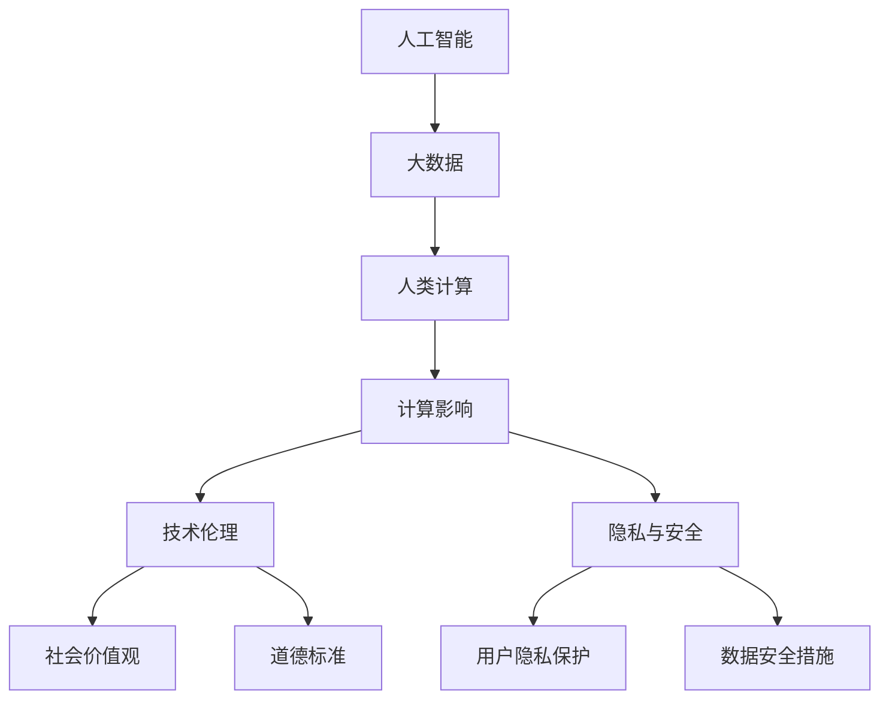

                 

## 1. 背景介绍

### 1.1 问题由来

人类计算的历史源远流长，从古老的石算盘到现代的电脑，计算技术的发展在很大程度上推动了社会的进步。计算技术的进步，不仅改变了人类的生产生活方式，也深刻影响了社会的结构、文化、经济以及伦理道德。然而，随着计算技术的迅猛发展，尤其是人工智能和大数据技术的应用，人类计算的影响已经从辅助人类计算扩展到代替人类计算，引发了一系列新的社会问题。

### 1.2 问题核心关键点

当前，人工智能和大数据技术的迅猛发展，使得计算技术对社会的双重影响愈加明显。一方面，计算技术通过提高生产效率，优化资源配置，推动社会经济的发展，改善人类的生活质量；另一方面，计算技术也带来了隐私、安全、就业、伦理等方面的挑战，引起了公众的广泛关注。

本文旨在探讨人工智能和大数据技术在推动社会进步的同时，如何平衡这些挑战，确保技术进步能够惠及全人类。文章将从计算技术的双重影响出发，分析其对社会各个层面的影响，并提出相应的解决方案。

## 2. 核心概念与联系

### 2.1 核心概念概述

为更好地理解计算技术对社会的影响，本节将介绍几个关键概念：

- **人工智能(AI)**：利用计算机模拟人类智能过程，通过机器学习、深度学习等技术，使计算机具备感知、推理、决策等能力，能够自主执行复杂任务。

- **大数据**：指规模大、速度快、种类多、价值高、真实性强的数据集。大数据技术通过高效存储和处理海量数据，从中挖掘出有价值的信息和知识，为决策提供支持。

- **人类计算**：指人类使用计算机进行计算，辅助或代替人类完成各类计算任务的过程。随着计算技术的进步，人类计算的范围和深度都在不断扩展。

- **计算影响**：计算技术对社会各个方面的影响，包括经济、文化、伦理、就业等领域。计算影响既有积极的一面，也有消极的一面，需要通过合理的政策和机制进行管理和引导。

- **技术伦理**：指在技术开发和应用过程中，如何平衡技术进步与社会伦理的关系，确保技术发展能够符合人类的价值观和道德标准。

- **隐私与安全**：计算技术在带来便利的同时，也带来了隐私泄露和数据安全问题，如何保护用户隐私，确保数据安全，是技术应用中的重要课题。

这些核心概念之间的逻辑关系可以通过以下Mermaid流程图来展示：



这个流程图展示了大数据与人工智能如何推动人类计算的发展，计算影响、技术伦理、隐私与安全等关键概念之间的联系：

1. 人工智能和大数据技术推动了人类计算的发展。
2. 人类计算在社会各个层面产生广泛影响。
3. 技术伦理和社会价值观是计算影响的重要指导原则。
4. 隐私和安全是技术伦理的重要组成部分。

这些概念共同构成了计算技术对社会影响的全貌，帮助我们更好地理解其双重效应。

## 3. 核心算法原理 & 具体操作步骤

### 3.1 算法原理概述

人工智能和大数据技术通过高效计算和分析，实现了对海量数据的处理和利用，从而推动了社会的各个方面。其核心原理可以概括为以下几个方面：

1. **数据驱动决策**：通过收集和分析大量数据，从中发现规律和趋势，辅助或代替人类进行决策。
2. **自动化执行**：利用算法和模型，自动化完成复杂的计算任务，提高生产效率和资源利用率。
3. **优化资源配置**：通过数据分析和优化算法，实现对资源的有效配置和利用，降低成本，提高效益。
4. **推动创新**：大数据和人工智能技术在各个领域的应用，促进了新的技术和产品的产生，推动了社会创新。

### 3.2 算法步骤详解

基于人工智能和大数据技术的计算过程，一般包括以下几个关键步骤：

**Step 1: 数据收集与预处理**
- 收集各类数据源，包括社交媒体、传感器、交易记录等。
- 对数据进行清洗和预处理，去除噪声和异常值，保证数据质量。

**Step 2: 数据存储与处理**
- 将数据存储在分布式数据仓库或数据库中。
- 使用大数据技术进行数据挖掘和分析，提取有价值的信息和知识。

**Step 3: 模型训练与优化**
- 选择合适的算法和模型，利用数据进行训练。
- 优化模型参数，提高模型性能。

**Step 4: 结果应用与反馈**
- 将训练好的模型应用于实际场景中，辅助或代替人类进行决策和执行。
- 根据应用效果，不断调整模型和算法，优化决策过程。

### 3.3 算法优缺点

基于人工智能和大数据技术的计算方法具有以下优点：

1. **高效性**：能够处理大规模数据集，快速得出分析和预测结果，提高生产效率和资源利用率。
2. **精度高**：利用先进的算法和模型，能够从数据中提取有价值的信息和知识，减少人为偏差。
3. **灵活性**：根据实际需求，灵活选择和调整算法和模型，适应各种复杂的计算任务。
4. **创新性**：推动了新的技术和产品的产生，促进了社会创新和进步。

同时，这些技术也存在一些缺点：

1. **隐私风险**：数据收集和分析过程中，存在隐私泄露的风险。
2. **安全风险**：数据存储和处理过程中，存在数据被恶意攻击的风险。
3. **依赖性**：计算过程高度依赖于数据的质量和算法的有效性，一旦数据或算法出现问题，可能导致严重后果。
4. **伦理问题**：计算过程中可能存在伦理道德问题，如算法偏见、决策透明性不足等。

### 3.4 算法应用领域

人工智能和大数据技术已经在各个领域得到了广泛应用，例如：

- **金融行业**：通过大数据分析，预测市场趋势，优化投资决策。
- **医疗行业**：利用人工智能辅助诊断，提高疾病预测和诊断的准确性。
- **零售行业**：通过分析消费者行为，实现个性化推荐，提高销售效率。
- **交通行业**：利用大数据和人工智能优化交通流量，减少拥堵和事故。
- **能源行业**：通过数据分析和优化，提高能源利用效率，降低能耗。
- **智慧城市**：通过大数据和人工智能技术，实现城市管理和服务的智能化。

除了上述这些经典应用外，人工智能和大数据技术还在更多场景中得到创新性应用，如自动驾驶、智能家居、智能制造等，为各个行业的数字化转型提供了新的解决方案。

## 4. 数学模型和公式 & 详细讲解 & 举例说明

### 4.1 数学模型构建

为更好地理解人工智能和大数据技术的应用，本节将构建一个简单的数学模型来解释其工作原理。

假设有一组数据集 $D=\{x_1, x_2, ..., x_n\}$，其中 $x_i$ 为第 $i$ 个样本，包含 $m$ 个特征。我们希望利用这组数据来训练一个线性回归模型 $y = \theta_0 + \theta_1x_1 + ... + \theta_mx_m$，其中 $\theta_0, \theta_1, ..., \theta_m$ 为模型参数，需要求解以最小化预测误差。

设损失函数为均方误差（Mean Squared Error, MSE）：

$$
L = \frac{1}{n} \sum_{i=1}^n (y_i - \hat{y}_i)^2
$$

其中 $y_i$ 为第 $i$ 个样本的真实标签，$\hat{y}_i$ 为模型预测的标签。最小化损失函数 $L$ 的过程即为模型训练的过程。

### 4.2 公式推导过程

利用梯度下降算法（Gradient Descent）来求解模型参数，最小化损失函数 $L$。

1. 初始化模型参数 $\theta_0, \theta_1, ..., \theta_m$。
2. 对于第 $i$ 个样本，计算梯度：

$$
\nabla_{\theta} L = -2\sum_{i=1}^n (y_i - \hat{y}_i)x_i
$$

3. 更新模型参数：

$$
\theta_k \leftarrow \theta_k - \eta \nabla_{\theta_k} L
$$

其中 $\eta$ 为学习率，控制模型参数更新的步长。

4. 重复步骤2和3，直到模型收敛。

### 4.3 案例分析与讲解

假设有一组房价数据，其中包含多个特征，如房屋面积、房间数量、地理位置等。我们的目标是训练一个线性回归模型，预测房价。

1. 数据收集：从房地产网站收集房屋面积、房间数量、地理位置等特征数据，以及对应的房价。
2. 数据预处理：清洗数据，去除缺失值和异常值，标准化数据。
3. 数据存储：将数据存储在分布式数据仓库中，利用Hadoop或Spark等大数据技术进行处理。
4. 模型训练：使用梯度下降算法，训练线性回归模型，最小化预测误差。
5. 模型应用：将训练好的模型应用于新的房屋数据，预测房价。

这个过程展示了人工智能和大数据技术如何应用于实际问题，通过高效的数据分析和模型训练，实现对复杂问题的解决。

## 5. 项目实践：代码实例和详细解释说明

### 5.1 开发环境搭建

在进行项目实践前，我们需要准备好开发环境。以下是使用Python进行Scikit-Learn开发的开发环境配置流程：

1. 安装Anaconda：从官网下载并安装Anaconda，用于创建独立的Python环境。

2. 创建并激活虚拟环境：
```bash
conda create -n sklearn-env python=3.8 
conda activate sklearn-env
```

3. 安装Scikit-Learn：
```bash
pip install scikit-learn
```

4. 安装numpy、pandas等辅助库：
```bash
pip install numpy pandas matplotlib jupyter notebook ipython
```

完成上述步骤后，即可在`sklearn-env`环境中开始项目实践。

### 5.2 源代码详细实现

下面我们以房价预测项目为例，给出使用Scikit-Learn库进行线性回归训练的Python代码实现。

```python
import pandas as pd
from sklearn.model_selection import train_test_split
from sklearn.linear_model import LinearRegression
from sklearn.metrics import mean_squared_error

# 数据加载
data = pd.read_csv('house_prices.csv')

# 特征选择
features = data[['area', 'rooms', 'location']]
target = data['price']

# 数据分割
features_train, features_test, target_train, target_test = train_test_split(features, target, test_size=0.2, random_state=42)

# 模型训练
model = LinearRegression()
model.fit(features_train, target_train)

# 模型评估
y_pred = model.predict(features_test)
mse = mean_squared_error(target_test, y_pred)
print('MSE:', mse)
```

这段代码展示了Scikit-Learn库在数据处理、模型训练和评估中的应用。可以看到，利用Scikit-Learn库，我们可以快速构建并训练线性回归模型，进行房价预测。

### 5.3 代码解读与分析

让我们再详细解读一下关键代码的实现细节：

1. **数据加载**：利用Pandas库读取CSV文件，将数据加载到DataFrame中。
2. **特征选择**：根据需求选择特征，如房屋面积、房间数量等。
3. **数据分割**：将数据分为训练集和测试集，用于模型训练和评估。
4. **模型训练**：使用Scikit-Learn的LinearRegression模型进行线性回归训练，最小化预测误差。
5. **模型评估**：在测试集上进行预测，计算均方误差（MSE）作为评估指标。

这个过程展示了利用Scikit-Learn库进行线性回归模型训练和评估的简洁高效方法。开发者可以将更多精力放在特征选择、模型调参等高层逻辑上，而不必过多关注底层的实现细节。

当然，工业级的系统实现还需考虑更多因素，如模型的保存和部署、超参数的自动搜索、更灵活的任务适配层等。但核心的模型训练和评估过程基本与此类似。

## 6. 实际应用场景

### 6.1 智能客服系统

基于人工智能和大数据技术的智能客服系统，可以广泛应用于各个行业。传统客服往往需要配备大量人力，高峰期响应缓慢，且一致性和专业性难以保证。而使用智能客服系统，可以7x24小时不间断服务，快速响应客户咨询，用自然流畅的语言解答各类常见问题。

在技术实现上，可以收集企业内部的历史客服对话记录，将问题和最佳答复构建成监督数据，在此基础上对预训练模型进行微调。微调后的模型能够自动理解用户意图，匹配最合适的答案模板进行回复。对于客户提出的新问题，还可以接入检索系统实时搜索相关内容，动态组织生成回答。如此构建的智能客服系统，能大幅提升客户咨询体验和问题解决效率。

### 6.2 金融舆情监测

金融机构需要实时监测市场舆论动向，以便及时应对负面信息传播，规避金融风险。传统的人工监测方式成本高、效率低，难以应对网络时代海量信息爆发的挑战。基于人工智能和大数据技术的文本分类和情感分析技术，为金融舆情监测提供了新的解决方案。

具体而言，可以收集金融领域相关的新闻、报道、评论等文本数据，并对其进行主题标注和情感标注。在此基础上对预训练语言模型进行微调，使其能够自动判断文本属于何种主题，情感倾向是正面、中性还是负面。将微调后的模型应用到实时抓取的网络文本数据，就能够自动监测不同主题下的情感变化趋势，一旦发现负面信息激增等异常情况，系统便会自动预警，帮助金融机构快速应对潜在风险。

### 6.3 个性化推荐系统

当前的推荐系统往往只依赖用户的历史行为数据进行物品推荐，无法深入理解用户的真实兴趣偏好。基于人工智能和大数据技术的个性化推荐系统，可以更好地挖掘用户行为背后的语义信息，从而提供更精准、多样的推荐内容。

在实践中，可以收集用户浏览、点击、评论、分享等行为数据，提取和用户交互的物品标题、描述、标签等文本内容。将文本内容作为模型输入，用户的后续行为（如是否点击、购买等）作为监督信号，在此基础上训练线性回归模型。训练好的模型能够从文本内容中准确把握用户的兴趣点。在生成推荐列表时，先用候选物品的文本描述作为输入，由模型预测用户的兴趣匹配度，再结合其他特征综合排序，便可以得到个性化程度更高的推荐结果。

### 6.4 未来应用展望

随着人工智能和大数据技术的不断发展，基于微调范式将在更多领域得到应用，为传统行业带来变革性影响。

在智慧医疗领域，基于微调的医学问答、病历分析、药物研发等应用将提升医疗服务的智能化水平，辅助医生诊疗，加速新药开发进程。

在智能教育领域，微调技术可应用于作业批改、学情分析、知识推荐等方面，因材施教，促进教育公平，提高教学质量。

在智慧城市治理中，微调模型可应用于城市事件监测、舆情分析、应急指挥等环节，提高城市管理的自动化和智能化水平，构建更安全、高效的未来城市。

此外，在企业生产、社会治理、文娱传媒等众多领域，基于大模型微调的人工智能应用也将不断涌现，为经济社会发展注入新的动力。相信随着技术的日益成熟，微调方法将成为人工智能落地应用的重要范式，推动人工智能技术向更广阔的领域加速渗透。

## 7. 工具和资源推荐

### 7.1 学习资源推荐

为了帮助开发者系统掌握人工智能和大数据技术，这里推荐一些优质的学习资源：

1. 《Python数据分析实战》系列博文：由数据科学专家撰写，深入浅出地介绍了Python在数据分析中的应用，适合初学者入门。

2. CS229《机器学习》课程：斯坦福大学开设的机器学习明星课程，有Lecture视频和配套作业，带你深入理解机器学习的原理和方法。

3. 《深度学习入门：基于Python的理论与实现》书籍：由深度学习专家撰写，全面介绍了深度学习的基本概念和实践技巧，适合想要深入学习深度学习的读者。

4. Kaggle平台：全球知名的数据科学竞赛平台，提供大量公开的数据集和比赛，适合进行实际项目的练习和展示。

5. GitHub开源项目：GitHub上有大量高质量的开源项目，涵盖机器学习、数据分析、深度学习等多个领域，适合进行学习和借鉴。

通过对这些资源的学习实践，相信你一定能够快速掌握人工智能和大数据技术，并用于解决实际的NLP问题。

### 7.2 开发工具推荐

高效的开发离不开优秀的工具支持。以下是几款用于人工智能和大数据技术开发的常用工具：

1. Python：全球流行的编程语言，生态丰富，支持各种数据科学和机器学习库，适合进行科学计算和数据处理。

2. R：统计分析领域的核心语言，拥有丰富的统计分析和可视化库，适合进行数据探索和建模。

3. TensorFlow：由Google主导开发的深度学习框架，支持分布式计算，适合进行大规模深度学习任务。

4. PyTorch：由Facebook开发的深度学习框架，灵活高效，支持动态图和静态图计算，适合进行研究和实验。

5. Hadoop/Spark：分布式计算平台，支持大规模数据处理和分析，适合进行大数据项目开发。

6. Jupyter Notebook：交互式编程环境，支持Python、R等多种语言，适合进行数据探索和模型验证。

合理利用这些工具，可以显著提升人工智能和大数据技术开发效率，加快创新迭代的步伐。

### 7.3 相关论文推荐

人工智能和大数据技术的发展源于学界的持续研究。以下是几篇奠基性的相关论文，推荐阅读：

1. 《深度学习》（Goodfellow et al., 2016）：深度学习领域的经典著作，系统介绍了深度学习的理论基础和实践方法。

2. 《大数据时代：让数据成为新的生产要素》（Kara Paxson, 2014）：探讨了大数据对社会经济的影响，提出了大数据时代的机遇和挑战。

3. 《人工智能伦理问题：现状、挑战与对策》（Mark Coeckelbergh, 2017）：讨论了人工智能伦理问题，提出了应对策略和建议。

4. 《隐私计算：保护数据隐私的新范式》（Xiao Cao et al., 2018）：探讨了隐私计算技术，提出了一种保护数据隐私的新方法。

5. 《公平算法：实现公平性、透明性和可解释性的AI》（Dmitrijs Milenka，2021）：讨论了公平算法的问题，提出了提升算法公平性和透明性的方法。

这些论文代表了大数据和人工智能技术的发展脉络。通过学习这些前沿成果，可以帮助研究者把握学科前进方向，激发更多的创新灵感。

## 8. 总结：未来发展趋势与挑战

### 8.1 总结

本文对人工智能和大数据技术在推动社会进步的同时，如何平衡隐私、安全、伦理等方面的挑战进行了系统探讨。首先阐述了计算技术对社会的双重影响，明确了其带来的积极和消极效应。其次，从原理到实践，详细讲解了人工智能和大数据技术的核心算法和具体操作步骤，提供了完整的数据处理和模型训练代码实例。同时，本文还广泛探讨了这些技术在智能客服、金融舆情、个性化推荐等多个行业领域的应用前景，展示了其巨大的潜力和影响力。此外，本文精选了相关学习资源、开发工具和研究论文，力求为读者提供全方位的技术指引。

通过本文的系统梳理，可以看到，人工智能和大数据技术在推动社会进步的同时，也带来了新的挑战和机遇。在未来发展中，需要在推动技术进步的同时，重视社会伦理和伦理道德的平衡，确保技术惠及全人类。

### 8.2 未来发展趋势

展望未来，人工智能和大数据技术的发展将呈现以下几个趋势：

1. **智能化的普及**：随着技术的不断进步，智能化的产品和服务将越来越普及，从生活消费到公共服务，都能看到智能技术的身影。

2. **人机协同增强**：智能技术与人类协作的深度融合，将极大提升生产效率和生活质量，实现人机协同增强。

3. **数据驱动决策**：数据驱动决策将成为企业和政府决策的重要依据，通过数据分析和建模，实现决策的科学化和智能化。

4. **数据安全与隐私保护**：随着数据量的增加，数据安全与隐私保护将成为重要的研究方向，如何保障数据安全，保护用户隐私，将成为技术应用中的重要课题。

5. **伦理道德建设**：人工智能和大数据技术的应用，必须遵循伦理道德原则，确保技术应用符合人类价值观和道德标准。

6. **跨领域融合**：人工智能和大数据技术将在更多领域得到应用，推动跨学科融合，催生新的学科和领域。

以上趋势凸显了人工智能和大数据技术的广阔前景。这些方向的探索发展，必将进一步推动社会进步，为人类带来更多的福祉。

### 8.3 面临的挑战

尽管人工智能和大数据技术已经取得了显著进展，但在迈向更加智能化、普适化应用的过程中，仍面临诸多挑战：

1. **隐私泄露风险**：数据收集和处理过程中，存在隐私泄露的风险。如何保障用户隐私，确保数据安全，将是技术应用中的重要课题。

2. **安全威胁**：数据存储和处理过程中，存在数据被恶意攻击的风险。如何增强数据安全，抵御各种威胁，将是技术应用中的重要课题。

3. **伦理道德问题**：人工智能和大数据技术的应用，可能存在伦理道德问题，如算法偏见、决策透明性不足等。如何制定合理的伦理规范，确保技术应用符合人类价值观和道德标准，将是技术应用中的重要课题。

4. **技术普及难度**：技术复杂度高，推广难度大，如何降低技术门槛，使更多人能够享受到技术带来的便利，将是技术应用中的重要课题。

5. **资源消耗问题**：大规模数据处理和深度学习计算，对硬件资源的需求高，如何优化资源配置，提高计算效率，将是技术应用中的重要课题。

6. **跨领域协同**：人工智能和大数据技术的应用，需要跨学科协同，如何实现跨领域的融合和协作，将是技术应用中的重要课题。

正视人工智能和大数据技术面临的这些挑战，积极应对并寻求突破，将是大数据和人工智能技术走向成熟的必由之路。相信随着学界和产业界的共同努力，这些挑战终将一一被克服，人工智能和大数据技术必将在构建安全、可靠、可解释、可控的智能系统中扮演越来越重要的角色。

### 8.4 研究展望

面对人工智能和大数据技术面临的挑战，未来的研究需要在以下几个方面寻求新的突破：

1. **数据隐私保护技术**：开发更加高效的数据隐私保护技术，如差分隐私、联邦学习等，保障用户隐私，确保数据安全。

2. **数据安全技术**：开发更加鲁棒的数据安全技术，如加密存储、区块链等，增强数据安全，抵御各种威胁。

3. **算法公平与透明技术**：开发更加公平和透明的算法，减少算法偏见，提高决策的透明度和可解释性。

4. **跨领域协同技术**：开发跨学科协同的技术，促进人工智能和大数据技术的融合，实现多领域的协同创新。

5. **人机协同技术**：开发人机协同的技术，实现人机协同增强，提高生产效率和生活质量。

6. **数据驱动决策技术**：开发高效的数据驱动决策技术，实现决策的科学化和智能化。

这些研究方向的探索，必将引领人工智能和大数据技术迈向更高的台阶，为构建安全、可靠、可解释、可控的智能系统铺平道路。面向未来，人工智能和大数据技术还需要与其他人工智能技术进行更深入的融合，如知识表示、因果推理、强化学习等，多路径协同发力，共同推动人工智能技术向更广阔的领域加速渗透。

## 9. 附录：常见问题与解答

**Q1：人工智能和大数据技术是否会对就业市场造成冲击？**

A: 人工智能和大数据技术的发展，确实会对某些低技能劳动力的就业造成冲击，但同时也会创造大量新的就业机会。例如，在数据分析、模型训练、系统维护等方面，需要大量高技能人才。因此，需要加强职业培训，帮助劳动者掌握新的技能，适应新的就业市场。

**Q2：人工智能和大数据技术的应用是否会导致隐私泄露？**

A: 在数据收集和处理过程中，确实存在隐私泄露的风险。需要采用先进的数据隐私保护技术，如差分隐私、联邦学习等，确保用户隐私。同时，应加强数据安全管理，建立完善的数据安全机制。

**Q3：人工智能和大数据技术的应用是否会导致数据被恶意攻击？**

A: 在数据存储和处理过程中，确实存在数据被恶意攻击的风险。需要采用先进的数据安全技术，如加密存储、区块链等，增强数据安全，抵御各种威胁。同时，应加强网络安全防护，建立完善的网络安全机制。

**Q4：人工智能和大数据技术的应用是否会导致伦理道德问题？**

A: 人工智能和大数据技术的应用，可能存在伦理道德问题，如算法偏见、决策透明性不足等。需要制定合理的伦理规范，确保技术应用符合人类价值观和道德标准。同时，应加强伦理监管，建立完善的伦理监管机制。

**Q5：人工智能和大数据技术的应用是否会导致资源消耗过大？**

A: 大规模数据处理和深度学习计算，确实需要大量的硬件资源。需要优化资源配置，提高计算效率，如采用分布式计算、混合精度计算等技术。同时，应加强硬件设备的发展，提升计算能力。

**Q6：人工智能和大数据技术的应用是否会导致跨领域协同难度大？**

A: 人工智能和大数据技术的应用，确实需要跨学科协同，如人机协同、数据驱动决策等。需要加强跨学科合作，促进技术融合，实现多领域的协同创新。同时，应加强政策支持，建立完善的技术合作机制。

通过回答这些常见问题，希望能帮助读者更好地理解和应用人工智能和大数据技术，充分发挥其积极作用，解决相关挑战，推动社会的持续进步。

---

作者：禅与计算机程序设计艺术 / Zen and the Art of Computer Programming

