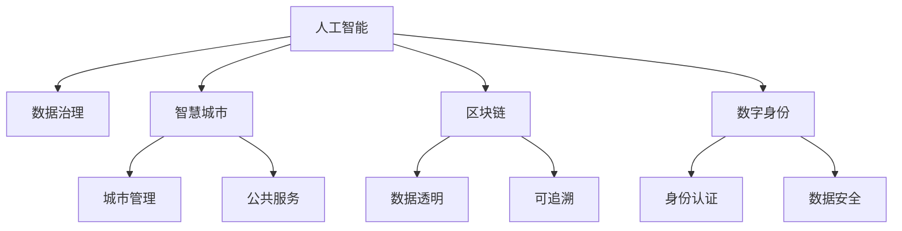

                 

# 科技创新：社会治理的新思路

> 关键词：人工智能,社会治理,数据治理,智慧城市,区块链,数字身份

## 1. 背景介绍

### 1.1 问题由来
当前，全球正面临一系列复杂的社会治理挑战，包括公共安全、环境污染、医疗健康、教育公平等问题。传统的社会治理方式往往依赖于人力、物力和经验的累积，难以应对日益复杂和快速变化的社会环境。迫切需要新的技术手段和治理模式来提升社会治理的效率和效果。

科技创新在社会治理中的应用已成为全球各国政府和企业的共识。随着人工智能(AI)、大数据、物联网、区块链等技术的迅猛发展，科技创新为社会治理带来了新的思路和方法，催生了智慧城市、数字身份、区块链等创新应用。这些技术不仅能够提升治理效率，还能实现更精细化、智能化的管理，为社会的可持续发展提供了新的动力。

### 1.2 问题核心关键点
科技创新在社会治理中的应用，主要集中在以下几个方面：

1. **数据治理**：通过大数据技术对海量社会数据进行收集、处理和分析，为社会治理提供数据支撑。
2. **智慧城市**：利用AI、物联网等技术实现城市智能化管理，提升城市运行效率和居民生活质量。
3. **区块链**：基于分布式账本技术，实现数据透明、安全、可追溯，增强社会治理的公平性和信任度。
4. **数字身份**：通过数字身份认证技术，实现身份信息的统一管理，提升社会治理的效率和安全性。

这些关键点构成了科技创新在社会治理中的应用框架，使其能够在各个领域发挥作用，推动社会治理的进步。

### 1.3 问题研究意义
研究科技创新在社会治理中的应用，对于提升社会治理的效率和效果，构建智能、透明、高效的社会治理体系具有重要意义：

1. **提升治理效率**：通过数据治理、智慧城市、区块链等技术，可以大幅提升社会治理的速度和精度。
2. **优化资源配置**：利用大数据分析，可以更科学地配置社会资源，满足社会需求。
3. **增强决策科学性**：基于AI算法的数据分析，可以提供科学决策依据，减少决策失误。
4. **提高治理公平性**：通过区块链技术实现数据透明和可追溯，增强社会治理的公平性和信任度。
5. **促进社会创新**：科技创新为社会治理提供了新的工具和方法，推动社会治理模式创新。
6. **推动社会进步**：通过智能化、精细化的治理，提升社会福祉，推动社会的可持续发展。

本文旨在深入探讨科技创新在社会治理中的应用，分析其原理、方法、优势和挑战，提出未来发展的趋势和方向，为社会治理的创新实践提供理论和技术的支撑。

## 2. 核心概念与联系

### 2.1 核心概念概述

为更好地理解科技创新在社会治理中的应用，本节将介绍几个密切相关的核心概念：

- **人工智能**：以机器学习和深度学习为代表的技术，能够通过算法和数据训练，实现类人智能的推理、判断和决策。
- **数据治理**：通过收集、存储、清洗、分析和利用数据，实现数据的高效管理和应用。
- **智慧城市**：利用AI、物联网等技术，实现城市智能化管理，提升城市运行效率和居民生活质量。
- **区块链**：基于分布式账本技术，实现数据透明、安全、可追溯，增强社会治理的公平性和信任度。
- **数字身份**：通过数字身份认证技术，实现身份信息的统一管理，提升社会治理的效率和安全性。

这些核心概念之间的逻辑关系可以通过以下Mermaid流程图来展示：



这个流程图展示了一些关键概念及其之间的关系：

1. 人工智能通过数据治理获得高质量的数据输入。
2. 数据治理是智慧城市和区块链的底层基础。
3. 智慧城市和区块链共同提升城市管理和公共服务水平。
4. 数字身份为智慧城市和区块链提供身份认证和数据安全保障。

这些概念共同构成了科技创新在社会治理中的应用框架，使其能够在各个领域发挥作用，推动社会治理的进步。

## 3. 核心算法原理 & 具体操作步骤
### 3.1 算法原理概述

科技创新在社会治理中的应用，本质上是一种基于数据的智能决策过程。其核心思想是：通过收集、处理和分析社会数据，利用人工智能算法进行建模和推理，从而实现科学决策和高效管理。

形式化地，假设社会治理的任务为 $T$，数据集为 $D=\{(x_i,y_i)\}_{i=1}^N$，其中 $x_i$ 为输入数据，$y_i$ 为标签。通过人工智能模型 $M_{\theta}$，将输入数据 $x_i$ 映射到输出标签 $y_i$，最小化损失函数 $\mathcal{L}(M_{\theta},D)$，使得模型输出逼近真实标签。具体的损失函数根据任务类型不同而有所差异，如分类任务使用交叉熵损失，回归任务使用均方误差损失等。

通过梯度下降等优化算法，模型不断更新参数 $\theta$，最小化损失函数 $\mathcal{L}(M_{\theta},D)$，从而提升模型的预测性能。由于社会数据通常包含多维度和多来源的信息，因此在建模时需要注意数据的融合、归一化和特征选择等问题。

### 3.2 算法步骤详解

科技创新在社会治理中的应用，一般包括以下几个关键步骤：

**Step 1: 数据收集与预处理**
- 收集社会治理任务相关的各类数据，包括文本、图像、语音、地理位置等。
- 对数据进行清洗、去重、标准化等预处理操作，确保数据的质量和一致性。

**Step 2: 数据存储与管理**
- 利用分布式存储技术，构建高效的数据仓库，支持大规模数据的存储和管理。
- 采用数据分区和索引等技术，提升数据检索和查询的效率。

**Step 3: 模型训练与优化**
- 选择合适的机器学习或深度学习算法，构建预测模型 $M_{\theta}$。
- 利用社会数据集 $D$，通过优化算法最小化损失函数 $\mathcal{L}(M_{\theta},D)$，训练模型参数 $\theta$。
- 利用交叉验证、网格搜索等技术，选择最优模型参数和算法超参数。

**Step 4: 模型评估与部署**
- 在测试集上评估训练好的模型 $M_{\theta}$，计算模型性能指标，如准确率、召回率、F1-score等。
- 将模型部署到实际应用环境中，进行在线预测和数据反馈，实现智能决策。

**Step 5: 持续监控与优化**
- 定期监测模型性能和数据质量，收集用户反馈和业务需求。
- 根据实际应用效果，更新模型参数和算法，持续优化模型性能。

### 3.3 算法优缺点

科技创新在社会治理中的应用，具有以下优点：

1. **高效性**：利用算法和数据，可以实现快速、准确的决策和分析。
2. **精度高**：通过高质量的数据和复杂的模型，提升决策的精度和可信度。
3. **自动化**：通过自动化算法，减少人工干预，提高治理效率。
4. **灵活性**：算法和模型可以根据需求快速调整和优化，适应多变的环境。

但同时也存在一些局限性：

1. **数据质量依赖**：算法模型的性能高度依赖于数据质量，低质量的数据可能导致误判和误决策。
2. **算法复杂性**：复杂的算法模型需要较高的计算资源和技术门槛，推广应用有一定难度。
3. **隐私和安全风险**：数据收集和存储可能带来隐私和安全问题，需要严格的数据保护措施。
4. **伦理和公平性问题**：算法决策的透明度和公平性问题需要解决，避免偏见和歧视。

尽管存在这些局限性，但科技创新在社会治理中的应用，已展现出显著的优势和潜力，成为社会治理的重要手段。

### 3.4 算法应用领域

科技创新在社会治理中的应用，已经涵盖了多个领域，包括但不限于：

- **公共安全**：利用AI进行视频监控、事件检测和预警，提升社会治安水平。
- **环境保护**：通过大数据分析环境数据，实现环境监测和污染治理。
- **医疗健康**：利用AI进行疾病预测、健康管理和远程诊疗，提升医疗服务质量。
- **教育公平**：通过数据分析，实现教育资源优化配置和个性化教育。
- **智慧交通**：利用AI和物联网技术，实现交通流量管理、事故预防和智能导航。
- **数字身份**：通过数字身份认证技术，实现身份信息的统一管理，提升社会治理的效率和安全性。
- **区块链**：基于分布式账本技术，实现数据透明、安全、可追溯，增强社会治理的公平性和信任度。

这些应用领域展示了科技创新在社会治理中的广泛应用，为社会治理带来了新的思路和方法。

## 4. 数学模型和公式 & 详细讲解  
### 4.1 数学模型构建

本节将使用数学语言对科技创新在社会治理中的应用进行更加严格的刻画。

假设社会治理任务为 $T$，数据集为 $D=\{(x_i,y_i)\}_{i=1}^N$，其中 $x_i$ 为输入数据，$y_i$ 为标签。定义模型 $M_{\theta}$ 在输入 $x$ 上的输出为 $y_{pred}=M_{\theta}(x)$，预测结果与真实标签 $y$ 之间的损失函数为 $\ell(M_{\theta}(x),y)$，则模型 $M_{\theta}$ 的经验风险为：

$$
\mathcal{L}(\theta) = \frac{1}{N}\sum_{i=1}^N \ell(M_{\theta}(x_i),y_i)
$$

通过梯度下降等优化算法，模型不断更新参数 $\theta$，最小化损失函数 $\mathcal{L}(\theta)$，得到最优模型参数 $\theta^*$。具体的优化过程如下：

$$
\theta \leftarrow \theta - \eta \nabla_{\theta}\mathcal{L}(\theta)
$$

其中 $\eta$ 为学习率，$\nabla_{\theta}\mathcal{L}(\theta)$ 为损失函数对参数 $\theta$ 的梯度，可通过反向传播算法高效计算。

### 4.2 公式推导过程

以下我们以智慧城市中的交通流量预测为例，推导线性回归模型的预测公式。

假设模型 $M_{\theta}$ 的输出为 $y_{pred}=M_{\theta}(x)$，其中 $x$ 为历史交通数据，包括时间、天气、节假日等信息。假设 $y$ 为目标变量，即未来小时的交通流量。则线性回归模型的预测公式为：

$$
y_{pred} = \theta_0 + \sum_{i=1}^p \theta_i x_i
$$

其中 $\theta_0$ 为截距，$\theta_i$ 为第 $i$ 个特征的系数。通过最小二乘法，求解最优参数 $\theta$，使得预测值与真实值之间的误差最小化：

$$
\min_{\theta} \sum_{i=1}^N (y_i - y_{pred})^2
$$

求解上述优化问题，得到线性回归模型的参数为：

$$
\theta = (X^TX)^{-1}X^Ty
$$

其中 $X=[1,x_1,\dots,x_p]$ 为特征矩阵，$y$ 为目标变量向量。

在得到最优模型参数 $\theta$ 后，即可将其部署到实际应用环境中，进行在线预测和数据反馈，实现智能决策。

## 5. 项目实践：代码实例和详细解释说明
### 5.1 开发环境搭建

在进行科技创新应用开发前，我们需要准备好开发环境。以下是使用Python进行TensorFlow开发的环境配置流程：

1. 安装Anaconda：从官网下载并安装Anaconda，用于创建独立的Python环境。

2. 创建并激活虚拟环境：
```bash
conda create -n tf-env python=3.8 
conda activate tf-env
```

3. 安装TensorFlow：根据CUDA版本，从官网获取对应的安装命令。例如：
```bash
conda install tensorflow -c pytorch -c conda-forge
```

4. 安装各类工具包：
```bash
pip install numpy pandas scikit-learn matplotlib tqdm jupyter notebook ipython
```

完成上述步骤后，即可在`tf-env`环境中开始科技创新应用开发。

### 5.2 源代码详细实现

这里我们以智慧城市中的交通流量预测为例，给出使用TensorFlow实现线性回归模型的代码实现。

首先，定义数据处理函数：

```python
import tensorflow as tf
import numpy as np

def preprocess_data(data):
    features = data[:, :-1]
    target = data[:, -1]
    features = (features - np.mean(features)) / np.std(features) # 标准化
    return features, target
```

然后，定义模型和优化器：

```python
model = tf.keras.Sequential([
    tf.keras.layers.Dense(units=1, input_shape=[p+1])
])

optimizer = tf.keras.optimizers.Adam(learning_rate=0.01)
```

接着，定义训练和评估函数：

```python
def train_epoch(model, features, target, batch_size):
    train_dataset = tf.data.Dataset.from_tensor_slices((features, target))
    train_dataset = train_dataset.shuffle(buffer_size=1000).batch(batch_size)

    model.compile(optimizer=optimizer, loss='mse')
    model.fit(train_dataset, epochs=100, verbose=0)

def evaluate(model, features, target):
    test_dataset = tf.data.Dataset.from_tensor_slices((features, target))
    test_dataset = test_dataset.shuffle(buffer_size=1000).batch(32)

    loss = model.evaluate(test_dataset, verbose=0)
    print(f"Test loss: {loss}")
```

最后，启动训练流程并在测试集上评估：

```python
p = 5 # 特征数量
features = np.loadtxt('data_features.csv', delimiter=',')
target = np.loadtxt('data_target.csv', delimiter=',')

train_features = features[:train_size, :]
train_target = target[:train_size]
test_features = features[train_size:, :]
test_target = target[train_size:]

# 标准化
mean, std = train_features.mean(), train_features.std()
train_features = (train_features - mean) / std
test_features = (test_features - mean) / std

train_epoch(model, train_features, train_target, batch_size=32)
evaluate(model, test_features, test_target)
```

以上就是使用TensorFlow实现智慧城市交通流量预测的完整代码实现。可以看到，利用TensorFlow的高效优化器和模型编译机制，可以很方便地构建和训练线性回归模型。

### 5.3 代码解读与分析

让我们再详细解读一下关键代码的实现细节：

**preprocess_data函数**：
- 定义数据预处理函数，将数据标准化，处理缺失值等。

**模型定义**：
- 使用TensorFlow的Sequential模型定义线性回归模型，包含一个全连接层。
- 使用Adam优化器进行模型优化。

**训练和评估函数**：
- 定义训练函数，使用TensorFlow的fit方法进行模型训练，设置epochs和batch_size。
- 定义评估函数，使用TensorFlow的evaluate方法评估模型性能，输出测试损失。

**训练流程**：
- 加载训练和测试数据，进行标准化处理。
- 调用训练函数进行模型训练。
- 调用评估函数进行模型评估，输出测试损失。

可以看到，TensorFlow提供了强大的工具和API，可以高效地实现各类机器学习模型的开发和训练。合理利用这些工具，可以显著提升科技创新应用的开发效率，加快创新迭代的步伐。

当然，工业级的系统实现还需考虑更多因素，如模型的保存和部署、超参数的自动搜索、更灵活的任务适配层等。但核心的科技创新应用开发流程基本与此类似。

## 6. 实际应用场景
### 6.1 智能交通管理

基于科技创新在智慧城市中的应用，智能交通管理系统的构建成为可能。传统交通管理往往依赖于人工监控和经验决策，难以应对高峰期的交通压力和突发事件。而利用人工智能和大数据技术，可以实现交通流量的实时监测和预测，优化交通信号灯控制，提升交通运行效率。

在技术实现上，可以收集城市道路的各类交通数据，如车流量、车速、交通状况等，结合天气、节假日等信息，构建预测模型。模型通过学习历史数据，预测未来小时的交通流量，并根据预测结果调整交通信号灯，优化交通流量，缓解拥堵，提升交通安全性。

### 6.2 环境污染监测

科技创新在环境保护中的应用，主要体现在环境污染监测和治理方面。通过传感器和大数据技术，可以实时监测空气质量、水质、噪音等环境指标，构建预测模型，实现污染源的定位和治理。

在技术实现上，可以收集各类环境监测数据，利用时间序列分析等方法，构建预测模型。模型通过学习历史数据，预测未来环境的污染状况，并根据预测结果进行环境治理。例如，通过预测城市中的污染物浓度，提前采取措施，减少污染物排放，改善空气质量。

### 6.3 医疗健康管理

科技创新在医疗健康中的应用，主要体现在疾病预测、健康管理和远程诊疗等方面。通过人工智能和大数据技术，可以实现医疗数据的全面分析和利用，提升医疗服务质量。

在技术实现上，可以收集患者的各类健康数据，如病历、体检报告、基因信息等，构建预测模型。模型通过学习历史数据，预测患者的健康状况和疾病风险，并根据预测结果进行个性化健康管理，提供定制化的治疗方案。例如，通过预测患者的心血管疾病风险，提前进行干预，降低发病率。

### 6.4 未来应用展望

随着科技创新在社会治理中的应用不断深入，未来还将涌现更多创新应用，为社会治理带来新的变革：

1. **智能公共安全**：通过人工智能和大数据技术，实现视频监控、事件检测和预警，提升社会治安水平。
2. **智慧医疗健康**：利用AI进行疾病预测、健康管理和远程诊疗，提升医疗服务质量。
3. **智慧教育公平**：通过数据分析，实现教育资源优化配置和个性化教育，促进教育公平。
4. **智慧城市管理**：利用AI和物联网技术，实现城市智能化管理，提升城市运行效率和居民生活质量。
5. **智慧交通系统**：利用AI和物联网技术，实现交通流量管理、事故预防和智能导航，提升交通安全性。

这些创新应用将极大地提升社会治理的效率和效果，推动社会治理模式的创新，为社会的可持续发展提供新的动力。

## 7. 工具和资源推荐
### 7.1 学习资源推荐

为了帮助开发者系统掌握科技创新在社会治理中的应用理论基础和实践技巧，这里推荐一些优质的学习资源：

1. 《TensorFlow官方文档》：TensorFlow的官方文档，提供了详尽的API接口和示例代码，是学习TensorFlow的必备资源。

2. 《机器学习实战》书籍：由机器学习专家撰写，介绍了机器学习的基本概念和算法，并提供了Python实现的代码。

3. 《智慧城市》课程：由多所大学联合开设的在线课程，介绍了智慧城市的定义、技术和应用，适合初学者和专业人士。

4. 《人工智能在社会治理中的应用》论文：介绍了AI在社会治理中的多个应用案例，涵盖了智慧交通、环境监测、医疗健康等多个领域。

5. 《大数据与社会治理》书籍：介绍了大数据技术在社会治理中的应用，包括数据治理、智慧城市、区块链等多个方向。

通过对这些资源的学习实践，相信你一定能够快速掌握科技创新在社会治理中的应用精髓，并用于解决实际的治理问题。

### 7.2 开发工具推荐

高效的开发离不开优秀的工具支持。以下是几款用于科技创新应用开发的常用工具：

1. TensorFlow：由Google主导开发的开源深度学习框架，生产部署方便，适合大规模工程应用。

2. PyTorch：基于Python的开源深度学习框架，灵活动态，适合快速迭代研究。

3. Jupyter Notebook：基于Web的交互式编程环境，支持多种语言和工具库，方便开发者快速开发和调试。

4. Kaggle：全球最大的数据科学竞赛平台，提供丰富的数据集和竞赛题目，适合数据挖掘和模型训练。

5. AWS SageMaker：亚马逊推出的云端机器学习平台，支持多种深度学习框架，提供自动化的模型训练和部署功能。

合理利用这些工具，可以显著提升科技创新应用开发的效率，加快创新迭代的步伐。

### 7.3 相关论文推荐

科技创新在社会治理中的应用源于学界的持续研究。以下是几篇奠基性的相关论文，推荐阅读：

1. 《智慧城市：定义与框架》论文：定义了智慧城市的概念，探讨了智慧城市的技术架构和应用场景。

2. 《大数据与智慧城市》论文：介绍了大数据技术在智慧城市中的应用，包括数据治理、智慧交通、智能公共安全等多个方向。

3. 《人工智能在医疗健康中的应用》论文：介绍了AI在医疗健康中的多个应用案例，涵盖了疾病预测、健康管理、远程诊疗等多个领域。

4. 《区块链技术在社会治理中的应用》论文：介绍了区块链技术在数据透明、可追溯、智能合约等方面的应用，增强社会治理的公平性和信任度。

5. 《数字身份认证技术综述》论文：综述了数字身份认证技术的发展现状，介绍了基于密码学、生物特征等多种身份认证方法的优缺点。

这些论文代表了大数据和AI在社会治理中的应用发展脉络。通过学习这些前沿成果，可以帮助研究者把握学科前进方向，激发更多的创新灵感。

## 8. 总结：未来发展趋势与挑战

### 8.1 总结

本文对科技创新在社会治理中的应用进行了全面系统的介绍。首先阐述了科技创新在社会治理中的研究背景和意义，明确了其提升社会治理效率、优化资源配置、增强决策科学性等方面的独特价值。其次，从原理到实践，详细讲解了科技创新在社会治理中的数学模型和关键步骤，给出了科技创新应用开发的完整代码实例。同时，本文还广泛探讨了科技创新在智慧城市、环境监测、医疗健康等多个领域的应用前景，展示了其广阔的应用空间。此外，本文精选了科技创新应用的各类学习资源，力求为读者提供全方位的技术指引。

通过本文的系统梳理，可以看到，科技创新在社会治理中的应用已经展现出显著的优势和潜力，成为社会治理的重要手段。未来，伴随预训练语言模型和微调方法的持续演进，相信科技创新必将在更广泛的领域得到应用，为社会治理带来新的变革。

### 8.2 未来发展趋势

展望未来，科技创新在社会治理中的应用将呈现以下几个发展趋势：

1. **数据驱动决策**：随着数据收集和处理技术的进步，数据驱动决策将成为社会治理的主流模式，提升决策的科学性和透明度。
2. **多模态融合**：未来科技创新应用将更多地融合多模态数据，如文本、图像、视频、语音等，提升治理的精细化和智能化水平。
3. **智能协同治理**：通过智能算法和系统，实现人机协同治理，提升治理效率和公平性。
4. **跨领域协同**：科技创新应用将更多地跨领域协同，实现社会治理的多层次、多维度、多目标优化。
5. **隐私和安全保护**：随着数据应用范围的扩大，数据隐私和安全问题将受到更多关注，需要采取技术和管理措施保障数据安全。

以上趋势凸显了科技创新在社会治理中的应用前景，为社会治理模式的创新提供了新的思路和方法。

### 8.3 面临的挑战

尽管科技创新在社会治理中的应用已经取得显著进展，但在迈向更加智能化、普适化应用的过程中，仍面临诸多挑战：

1. **数据质量和获取**：高质量的数据是科技创新应用的基础，数据收集和处理需要投入大量资源和时间。数据获取的难度和成本问题仍需解决。
2. **模型复杂性和解释性**：复杂的模型可能难以解释，治理决策的透明性和可解释性问题需要解决。
3. **跨领域协同**：不同领域的数据和算法难以无缝融合，跨领域协同治理需要新的技术和方法。
4. **隐私和安全风险**：数据收集和存储可能带来隐私和安全问题，需要严格的数据保护措施。
5. **伦理和公平性问题**：算法决策的透明度和公平性问题需要解决，避免偏见和歧视。

尽管存在这些挑战，但科技创新在社会治理中的应用，已展现出显著的优势和潜力，成为社会治理的重要手段。相信随着学界和产业界的共同努力，这些挑战终将一一被克服，科技创新必将在社会治理中发挥更大的作用。

### 8.4 研究展望

面向未来，科技创新在社会治理中的应用需要更多的研究探索：

1. **数据治理技术**：进一步研究和优化数据收集、存储、处理和分析技术，提升数据治理的效率和质量。
2. **智能协同算法**：研究人机协同治理的算法和方法，提升治理的智能化水平。
3. **跨领域融合**：研究跨领域数据和算法的融合技术，实现多层次、多维度、多目标优化。
4. **隐私和安全保护**：研究数据隐私和安全保护技术，保障数据应用的安全性。
5. **伦理和公平性研究**：研究算法决策的透明性和公平性问题，避免偏见和歧视。

这些研究方向将推动科技创新在社会治理中的应用不断深入，为构建智能、透明、高效的社会治理体系提供技术支撑。

## 9. 附录：常见问题与解答

**Q1：科技创新在社会治理中如何保证数据的隐私和安全？**

A: 数据的隐私和安全是科技创新应用中亟需解决的问题。以下是一些常见的技术和方法：

1. **数据匿名化**：通过数据去标识化，避免直接泄露个人隐私。
2. **数据加密**：对数据进行加密处理，确保数据传输和存储的安全。
3. **访问控制**：限制数据的访问权限，只有授权用户才能访问数据。
4. **区块链技术**：利用区块链的分布式账本技术，确保数据透明和可追溯，减少数据篡改的风险。
5. **差分隐私**：在数据统计和分析过程中，通过引入噪声，确保个体隐私不被泄露。

通过这些技术措施，可以最大限度地保障数据的隐私和安全，增强社会治理的信任度。

**Q2：科技创新在社会治理中如何保证算法的透明性和公平性？**

A: 算法的透明性和公平性是科技创新应用中需要重视的问题。以下是一些常见的技术和方法：

1. **模型可解释性**：通过模型解释技术，帮助用户理解模型的决策过程和结果。
2. **公平性检测**：通过公平性检测算法，识别模型的偏见和歧视，优化模型参数。
3. **多模型集成**：通过集成多个模型，减小单个模型的偏见和不确定性。
4. **多样性约束**：在模型训练过程中，加入多样性约束，确保模型对不同群体的公平性。
5. **人工监督**：在模型应用过程中，引入人工监督，及时发现和纠正模型的错误。

通过这些技术措施，可以最大限度地保障算法的透明性和公平性，避免偏见和歧视，增强社会治理的可信度和公正性。

**Q3：科技创新在社会治理中如何处理数据不平衡问题？**

A: 数据不平衡是科技创新应用中常见的问题，以下一些常见的方法：

1. **重采样技术**：通过欠采样或过采样，调整数据集的分布，确保不同类别的样本数量平衡。
2. **类别权重调整**：对少数类样本赋予更高的权重，增加其在模型中的重要性。
3. **集成学习方法**：通过集成多个模型，提高对少数类样本的识别能力。
4. **生成对抗网络**：利用生成对抗网络，生成更多少数类样本，丰富数据集。

通过这些技术手段，可以有效地处理数据不平衡问题，提升科技创新应用的泛化能力和效果。

---

作者：禅与计算机程序设计艺术 / Zen and the Art of Computer Programming

