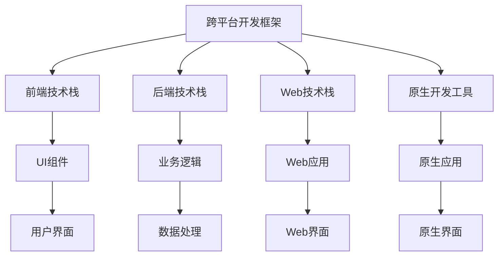

                 

# 移动端全栈开发：为智能手机创建应用程序

> 关键词：移动端开发,全栈技术栈,跨平台应用,原生开发,混合开发,渐进式Web应用(PWA),服务器端渲染(SSR),客户端渲染(CSR),React Native,Flutter

## 1. 背景介绍

### 1.1 问题由来

在当今的数字化时代，移动应用已经成为人们日常生活中不可或缺的一部分。无论是工作、学习还是娱乐，我们都越来越依赖于智能手机上的各种应用。然而，开发移动应用是一项复杂且耗时的任务。传统上，开发者需要分别学习原生开发、混合开发、Web开发等不同的技术栈，并在不同的开发平台（如iOS、Android等）上进行重复开发，这不仅增加了开发成本，也延长了开发周期。

为了应对这一挑战，全栈开发技术应运而生。全栈开发技术允许开发者使用一种技术栈（如React Native、Flutter等）来开发跨平台的移动应用，从而极大地提高了开发效率和应用性能。本文将深入探讨移动端全栈开发的核心概念、算法原理和具体操作步骤，并结合实际应用场景，展示全栈开发在智能手机应用开发中的优势和潜力。

### 1.2 问题核心关键点

移动端全栈开发的核心关键点在于：

1. **跨平台兼容性**：通过一种技术栈，能够在不同的移动平台（iOS、Android）上运行，无需重复开发。
2. **一致的用户体验**：在不同平台上的应用外观和操作方式保持一致，提升用户体验。
3. **高效的开发效率**：减少开发过程中的重复劳动，缩短开发周期。
4. **代码复用性**：通过组件化、模块化的设计，提高代码的复用性。
5. **快速的迭代速度**：开发过程中能够快速地进行功能更新和bug修复。
6. **开发资源共享**：开发者可以共享前端和后端的技术栈和工具，提高开发效率。

这些关键点构成了移动端全栈开发的基础，帮助开发者在有限的时间内，开发出高效、一致、灵活的移动应用。

## 2. 核心概念与联系

### 2.1 核心概念概述

移动端全栈开发通常涉及以下核心概念：

1. **跨平台开发框架**：如React Native、Flutter、Xamarin等，用于在多种移动平台上构建一致的用户体验。
2. **前端技术栈**：如React、Vue、Angular等，用于开发移动应用的用户界面。
3. **后端技术栈**：如Node.js、Django、Flask等，用于处理应用的数据和逻辑。
4. **Web技术栈**：如HTML、CSS、JavaScript等，用于构建渐进式Web应用(PWA)。
5. **原生开发工具**：如Xcode、Android Studio等，用于开发原生移动应用。

这些概念之间相互关联，共同构成了移动端全栈开发的技术生态。

### 2.2 核心概念原理和架构的 Mermaid 流程图



该流程图展示了移动端全栈开发技术栈的各个组件及其相互关系。开发者可以使用这些组件，在不同平台上构建一致的用户体验，实现高效的全栈开发。

## 3. 核心算法原理 & 具体操作步骤

### 3.1 算法原理概述

移动端全栈开发的核心算法原理主要包括以下几点：

1. **跨平台渲染技术**：通过一种渲染技术（如React Native的JSiBridge、Flutter的渲染引擎），在多种平台上实现一致的用户界面。
2. **组件化设计**：将应用分解为多个组件，通过组件化设计提高代码的复用性和可维护性。
3. **渐进式Web应用(PWA)**：通过Web技术栈，构建可离线访问、快速加载的Web应用，提升应用的性能和用户体验。
4. **热重载(Hot Reloading)**：通过热重载技术，在开发过程中快速地更新和测试代码，提升开发效率。

### 3.2 算法步骤详解

移动端全栈开发的具体操作步骤如下：

**Step 1: 选择技术栈**

开发者首先需要选择适合的技术栈，如React Native、Flutter、Xamarin等。不同的技术栈有不同的特点和优缺点，需要根据具体项目需求进行选择。

**Step 2: 设计组件化架构**

设计组件化架构，将应用分解为多个独立的组件，每个组件负责特定的功能模块。组件之间的解耦合能够提高代码的复用性和可维护性。

**Step 3: 开发前端界面**

使用前端技术栈（如React、Vue、Angular等），开发应用的UI界面。通过UI组件库和样式库，快速构建一致的用户界面。

**Step 4: 处理后端逻辑**

使用后端技术栈（如Node.js、Django、Flask等），处理应用的数据和逻辑。后端逻辑通常包括数据存储、业务处理、API接口等。

**Step 5: 构建渐进式Web应用**

使用Web技术栈（如HTML、CSS、JavaScript等），构建渐进式Web应用(PWA)。通过Web技术栈，可以实现离线访问、快速加载等功能，提升应用性能。

**Step 6: 实现跨平台渲染**

通过跨平台渲染技术（如React Native的JSiBridge、Flutter的渲染引擎），在多种移动平台上实现一致的用户界面。

**Step 7: 进行测试和调试**

使用测试框架和调试工具（如Jest、Detox、Chrome DevTools等），进行单元测试、集成测试和调试。确保应用在不同平台上的功能和性能都符合预期。

**Step 8: 部署和上线**

将应用部署到应用商店，供用户下载和使用。需要根据不同平台的要求，进行应用打包和签名等操作。

### 3.3 算法优缺点

移动端全栈开发具有以下优点：

1. **高效开发**：减少重复开发，提高开发效率。
2. **一致用户体验**：在不同平台上实现一致的用户界面，提升用户体验。
3. **代码复用性**：通过组件化设计，提高代码的复用性和可维护性。
4. **快速迭代**：通过热重载技术，快速更新和测试代码，提升开发效率。

同时，全栈开发也存在以下缺点：

1. **性能瓶颈**：由于需要在多种平台上渲染界面，性能可能不如原生应用。
2. **复杂性高**：需要同时掌握前端和后端技术栈，技术难度较高。
3. **依赖框架**：依赖于特定的跨平台框架，可能面临框架更新的问题。

尽管存在这些缺点，但全栈开发在移动应用开发中的优势依然不可忽视，特别是在跨平台应用和高效开发方面。

### 3.4 算法应用领域

移动端全栈开发在多个领域得到了广泛应用，如：

1. **社交媒体应用**：如微信、微博等，通过全栈开发技术，实现一致的用户界面和功能。
2. **电子商务应用**：如淘宝、京东等，通过全栈开发技术，提升购物体验和支付安全。
3. **健康医疗应用**：如健康管理、在线问诊等，通过全栈开发技术，提供便捷的医疗服务。
4. **教育培训应用**：如在线课程、在线辅导等，通过全栈开发技术，提升教育效果和用户体验。
5. **金融理财应用**：如投资理财、在线支付等，通过全栈开发技术，保障金融安全和个人隐私。

这些领域的应用，展示了全栈开发技术在移动应用开发中的广泛应用前景。

## 4. 数学模型和公式 & 详细讲解 & 举例说明

### 4.1 数学模型构建

在移动端全栈开发中，数学模型通常用于优化应用的性能和用户体验。以下是一个简单的性能优化数学模型：

设应用在移动设备上的渲染时间为 $T_{render}$，后端处理时间为 $T_{backend}$，网络连接时间为 $T_{network}$。则应用的总体处理时间为 $T_{total} = T_{render} + T_{backend} + T_{network}$。

通过优化渲染时间和后端处理时间，可以提升应用的性能。

### 4.2 公式推导过程

通过优化渲染时间和后端处理时间的公式推导，可以得出以下结论：

$$
T_{total} = T_{render} + T_{backend} + T_{network} = k_1 T_{render} + k_2 T_{backend} + k_3 T_{network}
$$

其中 $k_1, k_2, k_3$ 为常数，分别表示渲染时间、后端处理时间和网络连接时间对总体处理时间的贡献。

### 4.3 案例分析与讲解

以React Native为例，假设在一个iOS设备上渲染时间为 $T_{render} = 0.1s$，后端处理时间为 $T_{backend} = 0.2s$，网络连接时间为 $T_{network} = 0.3s$。则总体处理时间为：

$$
T_{total} = 0.1 + 0.2 + 0.3 = 0.6s
$$

通过优化渲染时间和后端处理时间，可以进一步提升应用性能。例如，使用自适应渲染技术，优化渲染时间，可以将 $T_{render}$ 减少为 $0.05s$，则总体处理时间为：

$$
T_{total} = 0.05 + 0.2 + 0.3 = 0.55s
$$

通过优化后，应用的性能得到了显著提升。

## 5. 项目实践：代码实例和详细解释说明

### 5.1 开发环境搭建

为了进行移动端全栈开发，需要搭建适合的技术栈。以下是一些常见的开发环境搭建步骤：

1. **安装Node.js和npm**：Node.js是JavaScript的运行环境，npm用于管理项目依赖。
2. **安装IDE或编辑器**：如Android Studio、Xcode、Visual Studio等。
3. **安装跨平台框架**：如React Native、Flutter等。
4. **安装后端开发环境**：如Django、Flask等。
5. **安装测试工具和调试工具**：如Detox、Chrome DevTools等。

### 5.2 源代码详细实现

以下是一个简单的React Native应用的代码实现：

```javascript
import React from 'react';
import { Text, View, StyleSheet } from 'react-native';

const App = () => {
  return (
    <View style={styles.container}>
      <Text style={styles.title}>Hello, World!</Text>
    </View>
  );
};

const styles = StyleSheet.create({
  container: {
    flex: 1,
    justifyContent: 'center',
    alignItems: 'center',
  },
  title: {
    fontSize: 24,
    fontWeight: 'bold',
  },
});

export default App;
```

该应用实现了简单的“Hello, World!”界面。

### 5.3 代码解读与分析

**App组件**：
- `import React from 'react';`：导入React库。
- `import { Text, View, StyleSheet } from 'react-native';`：导入React Native的组件和样式。
- `const App = () => {...}`：定义App组件，返回一个包含Text和View组件的布局。
- `return {...}`：返回渲染结果。
- `const styles = StyleSheet.create({...});`：定义样式。

**View组件**：
- `<View style={styles.container}>`：定义View组件，并将其样式设置为样式对象 `styles.container`。
- `justifyContent: 'center'`：垂直居中对齐。
- `alignItems: 'center'`：水平居中对齐。

**Text组件**：
- `<Text style={styles.title}>Hello, World!</Text>`：定义Text组件，并将其样式设置为样式对象 `styles.title`。

### 5.4 运行结果展示

运行该应用，可以在iOS设备上看到一个“Hello, World!”的界面。

## 6. 实际应用场景

### 6.1 智能客服系统

智能客服系统通常需要在多个平台（如iOS、Android、Web）上运行，全栈开发技术可以帮助开发者实现一致的用户体验和高效的开发效率。

具体实现步骤如下：

1. **选择技术栈**：选择React Native进行全栈开发。
2. **设计组件化架构**：将应用分解为多个独立的组件，如登录组件、消息组件、回复组件等。
3. **开发前端界面**：使用React Native开发UI界面，实现一致的用户界面。
4. **处理后端逻辑**：使用Node.js处理用户请求，调用后端API，进行数据处理和存储。
5. **构建Web应用**：使用React构建渐进式Web应用，提升用户体验。
6. **实现跨平台渲染**：通过React Native的JSiBridge技术，在iOS和Android平台上渲染一致的UI界面。
7. **进行测试和调试**：使用Jest和Detox进行测试，Chrome DevTools进行调试。
8. **部署和上线**：将应用打包并部署到App Store和Google Play。

通过全栈开发技术，智能客服系统能够在多个平台上提供一致的客户服务，提升用户体验和效率。

### 6.2 在线教育平台

在线教育平台通常需要在iOS、Android和Web上运行，全栈开发技术可以提升开发效率和应用性能。

具体实现步骤如下：

1. **选择技术栈**：选择React Native进行全栈开发。
2. **设计组件化架构**：将应用分解为多个独立的组件，如登录组件、课程组件、测评组件等。
3. **开发前端界面**：使用React Native开发UI界面，实现一致的用户界面。
4. **处理后端逻辑**：使用Node.js处理用户请求，调用后端API，进行数据处理和存储。
5. **构建Web应用**：使用React构建渐进式Web应用，提升用户体验。
6. **实现跨平台渲染**：通过React Native的JSiBridge技术，在iOS和Android平台上渲染一致的UI界面。
7. **进行测试和调试**：使用Jest和Detox进行测试，Chrome DevTools进行调试。
8. **部署和上线**：将应用打包并部署到App Store和Google Play。

通过全栈开发技术，在线教育平台能够在多个平台上提供一致的教育服务，提升学习效果和用户体验。

### 6.3 金融理财应用

金融理财应用通常需要在iOS、Android和Web上运行，全栈开发技术可以提升开发效率和应用性能。

具体实现步骤如下：

1. **选择技术栈**：选择React Native进行全栈开发。
2. **设计组件化架构**：将应用分解为多个独立的组件，如登录组件、投资组件、理财组件等。
3. **开发前端界面**：使用React Native开发UI界面，实现一致的用户界面。
4. **处理后端逻辑**：使用Node.js处理用户请求，调用后端API，进行数据处理和存储。
5. **构建Web应用**：使用React构建渐进式Web应用，提升用户体验。
6. **实现跨平台渲染**：通过React Native的JSiBridge技术，在iOS和Android平台上渲染一致的UI界面。
7. **进行测试和调试**：使用Jest和Detox进行测试，Chrome DevTools进行调试。
8. **部署和上线**：将应用打包并部署到App Store和Google Play。

通过全栈开发技术，金融理财应用能够在多个平台上提供一致的金融服务，提升用户信任和满意度。

### 6.4 未来应用展望

未来，移动端全栈开发技术将迎来更多的应用场景和发展机会：

1. **虚拟现实和增强现实**：全栈开发技术可以帮助开发者在多个平台（如iOS、Android、Web）上构建虚拟现实和增强现实应用，提升用户体验。
2. **车联网和智能家居**：全栈开发技术可以帮助开发者在多个平台（如iOS、Android、Web）上构建车联网和智能家居应用，提升交互体验和控制效率。
3. **物联网和工业互联网**：全栈开发技术可以帮助开发者在多个平台（如iOS、Android、Web）上构建物联网和工业互联网应用，提升数据采集和处理效率。

总之，全栈开发技术将在未来的各行各业中发挥越来越重要的作用，推动数字化转型和智能应用的发展。

## 7. 工具和资源推荐

### 7.1 学习资源推荐

为了帮助开发者系统掌握移动端全栈开发的技术基础，以下是一些优质的学习资源：

1. **《移动应用开发实战》系列书籍**：由知名开发者编写，涵盖iOS、Android和Web开发的全栈技术栈。
2. **React Native官方文档**：提供详细的API文档和示例代码，是React Native开发的必备资源。
3. **Flutter官方文档**：提供详细的API文档和示例代码，是Flutter开发的必备资源。
4. **Udacity移动应用开发课程**：提供系统的全栈开发课程，涵盖React Native和Flutter开发。
5. **Coursera移动应用开发课程**：提供系统的全栈开发课程，涵盖React Native和Flutter开发。
6. **Manning全栈开发书籍**：涵盖React Native和Flutter开发的全栈技术栈，是学习全栈开发的好书。

通过对这些资源的学习实践，相信你一定能够快速掌握移动端全栈开发的技术基础，并用于解决实际的开发问题。

### 7.2 开发工具推荐

高效的开发离不开优秀的工具支持。以下是几款用于移动端全栈开发开发的常用工具：

1. **Android Studio**：Google官方提供的Android开发环境，支持Android应用开发。
2. **Xcode**：Apple官方提供的iOS开发环境，支持iOS应用开发。
3. **Visual Studio Code**：微软提供的轻量级编辑器，支持多种编程语言和开发工具。
4. **Flutter**：Google提供的跨平台开发框架，支持iOS和Android应用开发。
5. **React Native**：Facebook提供的跨平台开发框架，支持iOS和Android应用开发。
6. **WebStorm**：JetBrains提供的Web开发环境，支持React、Vue等前端技术栈。

合理利用这些工具，可以显著提升移动端全栈开发任务的开发效率，加快创新迭代的步伐。

### 7.3 相关论文推荐

移动端全栈开发技术的发展源于学界的持续研究。以下是几篇奠基性的相关论文，推荐阅读：

1. **《React Native: A Framework for Building Native Mobile Apps with JavaScript and Reasonable Performance》**：文章介绍了React Native的核心原理和技术栈，是React Native开发的必备论文。
2. **《The Future of Mobile Development with Flutter》**：文章介绍了Flutter的核心原理和技术栈，是Flutter开发的必备论文。
3. **《Google's Mobile Application Development with Flutter》**：Google提供的Flutter开发指南，是Flutter开发的必备资源。
4. **《Mobile Development with Flutter and Dart》**：Udacity提供的Flutter开发课程，涵盖了Flutter开发的全栈技术栈。

这些论文代表了大语言模型微调技术的发展脉络。通过学习这些前沿成果，可以帮助研究者把握学科前进方向，激发更多的创新灵感。

## 8. 总结：未来发展趋势与挑战

### 8.1 总结

本文对移动端全栈开发的核心概念、算法原理和具体操作步骤进行了详细讲解，并结合实际应用场景，展示了全栈开发在智能手机应用开发中的优势和潜力。

通过本文的系统梳理，可以看到，移动端全栈开发技术已经成为移动应用开发的重要趋势，通过使用一种技术栈，可以高效、一致地构建跨平台的移动应用。全栈开发不仅提升了开发效率和用户体验，还降低了开发成本，推动了数字化转型和智能应用的发展。

### 8.2 未来发展趋势

展望未来，移动端全栈开发技术将呈现以下几个发展趋势：

1. **跨平台性能提升**：通过优化渲染时间和后端处理时间，提升应用的性能和用户体验。
2. **全栈开发工具的成熟**：随着跨平台开发框架的不断完善，开发者可以更高效地进行开发和调试。
3. **混合开发技术的融合**：全栈开发技术和原生开发技术的结合，实现更灵活、更高效的应用开发。
4. **渐进式Web应用(PWA)的普及**：通过Web技术栈，构建可离线访问、快速加载的Web应用，提升应用性能。
5. **热重载技术的应用**：通过热重载技术，快速更新和测试代码，提升开发效率。

以上趋势凸显了移动端全栈开发技术的广阔前景。这些方向的探索发展，必将进一步提升全栈开发技术的性能和应用范围，为移动应用开发带来新的突破。

### 8.3 面临的挑战

尽管全栈开发技术已经取得了显著进展，但在迈向更加智能化、普适化应用的过程中，它仍面临着诸多挑战：

1. **性能瓶颈**：由于需要在多种平台上渲染界面，性能可能不如原生应用。
2. **复杂性高**：需要同时掌握前端和后端技术栈，技术难度较高。
3. **依赖框架**：依赖于特定的跨平台框架，可能面临框架更新的问题。
4. **代码复用性**：由于组件化设计不完善，代码复用性可能不足。
5. **兼容性问题**：不同平台间的兼容性问题可能影响用户体验。
6. **开发成本高**：全栈开发需要较多的开发资源和时间，可能增加开发成本。

这些挑战需要在未来的技术演进中逐步解决，以更好地推动全栈开发技术的发展。

### 8.4 研究展望

面向未来，全栈开发技术需要从以下几个方面进行研究和探索：

1. **性能优化**：通过优化渲染时间和后端处理时间，提升应用的性能和用户体验。
2. **组件化设计**：通过完善组件化设计，提高代码的复用性和可维护性。
3. **混合开发技术**：探索混合开发技术的融合，实现更灵活、更高效的应用开发。
4. **渐进式Web应用(PWA)**：研究如何通过Web技术栈，构建可离线访问、快速加载的Web应用。
5. **热重载技术**：研究如何通过热重载技术，快速更新和测试代码，提升开发效率。

这些研究方向的探索，必将引领全栈开发技术的不断进步，为移动应用开发带来新的突破。总之，全栈开发技术需要在性能、用户体验、开发效率等方面不断优化和提升，才能真正实现数字化转型和智能应用的发展。

## 9. 附录：常见问题与解答

**Q1：移动端全栈开发是否适用于所有应用场景？**

A: 移动端全栈开发适用于大部分应用场景，特别是跨平台应用和高效开发场景。但对于一些对性能要求极高的应用，如游戏、虚拟现实等，可能需要采用原生开发技术。

**Q2：全栈开发是否需要同时掌握前端和后端技术栈？**

A: 是的，全栈开发需要同时掌握前端和后端技术栈，但可以通过模块化设计和组件化架构，降低技术难度和开发复杂性。

**Q3：全栈开发是否适合小团队开发？**

A: 全栈开发适合小团队开发，因为它可以大幅减少重复劳动，提高开发效率。但对于大规模项目，可能需要更多的人员和资源进行维护。

**Q4：如何评估全栈开发的应用性能？**

A: 可以通过应用性能监控工具（如Flutter Performance、React Native Debugger等），评估应用的渲染时间、响应时间、内存占用等指标，优化应用的性能和用户体验。

**Q5：全栈开发是否需要持续学习和更新技术栈？**

A: 是的，技术栈和开发工具不断更新，需要持续学习和更新技术栈，才能跟上技术发展的步伐。

通过本文的系统梳理，相信你一定能够快速掌握移动端全栈开发的核心概念和操作方法，并用于解决实际的开发问题。

---

作者：禅与计算机程序设计艺术 / Zen and the Art of Computer Programming

