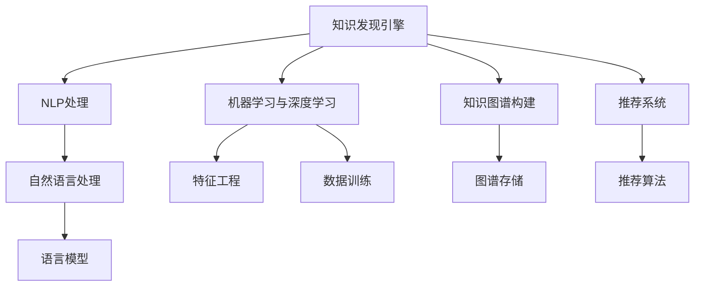

                 

# 程序员利用知识发现引擎提高学习效果

> 关键词：知识发现引擎, 学习效果提升, 数据分析, 机器学习, 知识图谱, 自然语言处理, 算法优化

## 1. 背景介绍

### 1.1 问题由来
在当今信息爆炸的时代，程序员需要面对海量不断更新的知识，如何高效地获取、整理、使用这些知识，成为编程能力提升的关键。传统的知识获取方式往往依赖于文本书籍、博客、社区论坛等人工资源，不仅耗时耗力，还难以全面覆盖所有相关知识点。而现代的知识发现引擎通过大规模数据分析、自然语言处理和机器学习技术，能够自动抽取、分类、关联知识，帮助程序员快速掌握前沿技术，提升学习效果。

### 1.2 问题核心关键点
现代知识发现引擎的核心在于其利用大规模数据、先进算法和智能计算能力，实现知识的自动抽取和关联。以下是知识发现引擎的几个关键点：
1. **数据采集与清洗**：收集海量在线资源（如代码库、博客、论文等），并对数据进行预处理，确保数据的准确性和完整性。
2. **知识抽取与分类**：使用自然语言处理技术，从文本中抽取实体、关系、事件等知识，并根据特定领域或主题进行分类。
3. **知识关联与构建**：通过机器学习算法，构建知识图谱，将不同来源的知识进行关联，形成系统的知识体系。
4. **知识推荐与检索**：根据用户需求和兴趣，从知识图谱中推荐最相关的知识，并提供高效检索手段。
5. **个性化学习路径**：利用用户行为数据，推荐个性化的学习路径和课程，满足不同水平和需求的用户。

## 2. 核心概念与联系

### 2.1 核心概念概述

为更好地理解知识发现引擎的工作原理，本节将介绍几个密切相关的核心概念：

- **知识发现引擎**：利用人工智能技术，从大规模数据中自动抽取、关联知识，为用户提供智能化的知识服务和推荐。
- **自然语言处理(NLP)**：使计算机能够理解和处理人类语言的技术，包括分词、词性标注、命名实体识别、依存句法分析等。
- **机器学习与深度学习**：使计算机能够通过数据训练，自主学习和优化算法，提升模型的预测和决策能力。
- **知识图谱**：通过实体、关系、事件等信息构建的图形结构，用于表示和推理知识。
- **推荐系统**：基于用户行为和偏好，推荐最相关内容或服务的系统。

这些核心概念之间的逻辑关系可以通过以下Mermaid流程图来展示：



这个流程图展示知识发现引擎的核心概念及其之间的关系：

1. 知识发现引擎从不同来源收集数据。
2. 利用NLP技术对数据进行处理和分析，构建语言模型。
3. 通过机器学习和深度学习算法，训练模型以识别知识模式。
4. 构建知识图谱，将知识进行系统化表示。
5. 利用推荐算法，向用户提供个性化的知识服务。

这些概念共同构成了知识发现引擎的基础，使得计算机能够自动发现和推荐高质量的知识，辅助程序员的学习和开发。

## 3. 核心算法原理 & 具体操作步骤
### 3.1 算法原理概述

知识发现引擎利用NLP和机器学习技术，自动抽取和关联知识，为用户提供智能化的学习支持。其核心算法原理主要包括：

- **自然语言处理(NLP)**：使用分词、命名实体识别、关系抽取等技术，从文本中提取关键信息。
- **语言模型(LM)**：基于大规模语料库训练的语言模型，用于评估单词或短语出现的概率。
- **实体识别与关系抽取**：通过分析句子结构，识别出文本中的实体和它们之间的关系。
- **知识图谱(KG)**：使用图数据库构建的知识图谱，表示实体与实体之间的关系，形成系统的知识体系。
- **推荐算法(Recommendation)**：根据用户兴趣和行为，从知识图谱中推荐最相关的知识内容。

### 3.2 算法步骤详解

知识发现引擎的实现通常包括以下几个关键步骤：

**Step 1: 数据收集与预处理**
- 使用Web爬虫或API接口，从在线资源（如Github、博客、论文库等）收集数据。
- 对收集到的数据进行预处理，包括去重、清洗、分词、词性标注等，确保数据的准确性和一致性。

**Step 2: 自然语言处理(NLP)**
- 使用分词工具进行文本分词，如Jieba、NLTK等。
- 应用命名实体识别(NER)技术，识别出文本中的实体（如人名、地名、机构名等）。
- 利用关系抽取技术，识别实体之间的关系，如父子关系、同义关系等。

**Step 3: 语言模型(LM)训练**
- 使用大规模语料库，如维基百科、新闻、论文等，训练语言模型。
- 选择适当的语言模型架构，如循环神经网络(RNN)、长短期记忆网络(LSTM)、Transformer等。
- 使用交叉熵等损失函数，优化模型参数。

**Step 4: 知识图谱构建**
- 将抽取的实体和关系，按照领域或主题进行分类。
- 构建知识图谱，使用图数据库如Neo4j、TigerGraph等存储和管理知识。
- 应用图算法，如PageRank、GCN等，计算实体和关系的重要性，构建知识网络。

**Step 5: 推荐算法应用**
- 根据用户历史行为数据，如浏览记录、代码提交记录等，提取用户兴趣。
- 从知识图谱中推荐与用户兴趣最相关的知识内容。
- 使用协同过滤、内容推荐等算法，提供个性化的学习路径和课程推荐。

### 3.3 算法优缺点

知识发现引擎的优点包括：
1. **高效性**：自动抽取和关联知识，省去了人工整理的时间。
2. **个性化**：根据用户行为和兴趣，提供个性化的知识服务。
3. **广泛性**：覆盖各种领域的知识，满足不同学科的需求。
4. **实时性**：不断更新知识库，保持知识的最新状态。

但同时，也存在一些局限性：
1. **数据质量依赖**：知识发现的质量很大程度上取决于数据的质量，如噪音数据、信息不完整等。
2. **领域适应性不足**：特定领域或领域交叉的知识抽取和关联，可能面临较大的挑战。
3. **模型复杂性**：大规模知识图谱和复杂算法，对计算资源的要求较高。
4. **解释性不足**：推荐算法的黑盒性质，难以解释推荐依据。
5. **隐私和安全问题**：用户行为数据的隐私保护，确保数据安全。

尽管存在这些局限性，但知识发现引擎在提升程序员学习效果方面具有显著优势，值得进一步探索和优化。

### 3.4 算法应用领域

知识发现引擎在多个领域中都有广泛应用，特别是在以下方面：

- **软件开发**：帮助程序员快速掌握新技术，提高代码质量。
- **数据科学**：提供数据处理、分析和可视化的知识服务，辅助数据科学家工作。
- **人工智能**：提供深度学习、机器学习等领域的知识推荐，加速AI技术发展。
- **教育培训**：根据学生学习行为，推荐个性化的学习材料和课程，提升学习效果。
- **学术研究**：抽取和关联学术资源，提供研究方向的建议和文献推荐。

## 4. 数学模型和公式 & 详细讲解 & 举例说明
### 4.1 数学模型构建

知识发现引擎涉及多个数学模型，如自然语言处理中的词嵌入模型、语言模型、知识图谱中的图嵌入模型等。这里以知识图谱中的节点嵌入模型为例，详细讲解其构建过程。

### 4.2 公式推导过程

知识图谱中的节点嵌入模型通过将实体和关系映射到低维空间中，实现知识的表示和推理。常用的节点嵌入模型有TransE、TransH、DistMult等。这里以TransE为例，其基本公式为：

$$
h \approx r * t
$$

其中，$h$、$r$、$t$分别为头实体、关系、尾实体的节点嵌入向量，$*$表示向量乘积，$\approx$表示近似等式。

### 4.3 案例分析与讲解

以GitHub上的代码数据为例，使用KgEVA算法进行知识图谱构建。首先，将代码文件中的函数、类、变量等实体进行抽取，构建代码知识图谱。然后，应用节点嵌入算法，将实体嵌入低维向量空间中。最后，利用嵌入向量进行知识推理，如代码相似度计算、函数调用链分析等。

## 5. 项目实践：代码实例和详细解释说明
### 5.1 开发环境搭建

知识发现引擎的开发环境包括Python、Jupyter Notebook、PyTorch、NLTK等工具。以下是搭建环境的详细步骤：

1. 安装Python和Jupyter Notebook：
```bash
sudo apt-get install python3
sudo apt-get install jupyter notebook
```

2. 安装PyTorch：
```bash
pip install torch torchvision torchaudio
```

3. 安装NLTK：
```bash
pip install nltk
```

4. 安装自然语言处理工具：
```bash
pip install spaCy
```

完成上述步骤后，即可在本地环境中进行知识发现引擎的开发和实验。

### 5.2 源代码详细实现

以下是一个简单的知识图谱构建的Python代码实现，用于抽取GitHub代码数据中的函数和类，构建代码知识图谱。

```python
import networkx as nx
import py2neo
from nltk.tokenize import sent_tokenize

# 连接到Neo4j数据库
graph = py2neo.Graph('bolt://localhost:7687', user='neo4j', password='password')

# 创建知识图谱
g = nx.Graph()

# 遍历代码文件，提取函数和类
with open('code_file.py', 'r') as f:
    code = f.read()
    sentences = sent_tokenize(code)
    for sentence in sentences:
        words = sentence.split()
        for i in range(len(words)):
            if words[i] in ['def', 'class']:
                start = i
                end = start + 1
                while end < len(words) and not words[end].startswith('('):
                    end += 1
                function_name = words[start+1:end]
                function_class = words[start-1:end]
                g.add_node(function_name)
                g.add_node(function_class)
                g.add_edge(function_name, function_class)

# 将知识图谱保存到Neo4j数据库
graph.create(g)
```

### 5.3 代码解读与分析

上述代码实现了一个简单的知识图谱构建过程，包括以下关键步骤：

- 连接Neo4j数据库，准备知识图谱的存储环境。
- 遍历代码文件，提取函数和类，构建知识图谱的节点和边。
- 将知识图谱保存到Neo4j数据库，方便后续的查询和推理。

需要注意的是，上述代码仅是一个简单的示例，实际应用中还需要考虑更多的细节和优化，如处理代码注释、多语言支持、知识图谱的质量评估等。

### 5.4 运行结果展示

运行上述代码后，可以通过Neo4j浏览器或Py2neo等工具查看和操作构建的知识图谱。例如，可以使用以下Python代码查询所有函数和类的关系：

```python
import py2neo

# 查询所有函数和类的关系
q = "MATCH (f:Function)-[:TYPE]->(c:Class) RETURN f, c"
result = graph.run(q)
for record in result:
    print(record)
```

运行结果会展示所有函数和类之间的关系，例如：

```
Function("my_function"), Class("MyClass")
Function("my_function"), Class("AnotherClass")
Function("my_other_function"), Class("MyClass")
```

这表明代码中的函数与类之间存在类型关系，可以用来分析代码结构和逻辑。

## 6. 实际应用场景
### 6.1 智能代码补全

知识发现引擎可以帮助程序员智能地补全代码，提高编程效率。通过分析历史代码和代码库中的函数、类、变量等信息，推荐最相关的代码片段，帮助程序员快速完成编程任务。

### 6.2 代码质量检测

知识发现引擎可以自动分析代码中的潜在问题，如代码风格、代码重复、命名规范等，提供改进建议。通过构建知识图谱，识别代码中的关键函数和变量，结合代码质量评估工具，提升代码质量。

### 6.3 自动文档生成

知识发现引擎可以自动生成代码文档，帮助程序员快速理解代码逻辑和功能。通过抽取代码中的函数、变量、注释等信息，生成详细的功能描述和参数说明，提高代码的可读性和可维护性。

### 6.4 未来应用展望

未来，知识发现引擎将在更多的领域得到应用，为程序员提供更全面、高效的知识服务。例如，可以应用于：

- **协作开发**：通过知识图谱和推荐系统，实现团队协作，提升开发效率。
- **代码重构**：根据代码质量评估结果，自动生成代码重构建议，提升代码可维护性。
- **机器学习模型开发**：自动推荐机器学习框架和算法，加速模型开发和迭代。
- **安全测试**：分析代码中的潜在安全漏洞，提供改进建议，提高系统安全性。
- **数据分析**：结合大数据分析技术，提供数据处理、分析和可视化的知识服务，辅助数据科学家工作。

## 7. 工具和资源推荐
### 7.1 学习资源推荐

为了帮助开发者系统掌握知识发现引擎的理论基础和实践技巧，这里推荐一些优质的学习资源：

1. **《自然语言处理入门》**：介绍自然语言处理的基本概念和技术，适合初学者学习。
2. **《Python深度学习》**：讲解深度学习的基本原理和实践技巧，适合有一定基础的开发者学习。
3. **Kaggle竞赛平台**：提供大量数据集和挑战任务，通过实战提高数据分析和机器学习能力。
4. **Coursera《机器学习》课程**：斯坦福大学开设的机器学习经典课程，涵盖算法和应用。
5. **GitHub代码库**：包含大量开源项目和代码库，通过分析源代码，学习优秀编程实践。

通过这些资源的学习实践，相信你一定能够快速掌握知识发现引擎的精髓，并用于解决实际的NLP问题。

### 7.2 开发工具推荐

高效的开发离不开优秀的工具支持。以下是几款用于知识发现引擎开发的常用工具：

1. **PyTorch**：基于Python的开源深度学习框架，灵活动态的计算图，适合快速迭代研究。
2. **Jupyter Notebook**：交互式的笔记本环境，方便编写和调试Python代码。
3. **NLTK**：Python的自然语言处理库，提供丰富的NLP工具和数据集。
4. **SpaCy**：高性能的自然语言处理库，支持分词、命名实体识别等任务。
5. **Py2neo**：Python的Neo4j数据库驱动程序，方便在Jupyter Notebook中进行数据库操作。
6. **TensorBoard**：TensorFlow配套的可视化工具，可实时监测模型训练状态。

合理利用这些工具，可以显著提升知识发现引擎的开发效率，加快创新迭代的步伐。

### 7.3 相关论文推荐

知识发现引擎和推荐系统的研究源于学界的持续研究。以下是几篇奠基性的相关论文，推荐阅读：

1. **《Relational Embeddings for Multi-Aspect Product Recommendations》**：提出关系嵌入模型，用于多方面产品推荐。
2. **《Knowledge Graph Embeddings》**：综述知识图谱的嵌入技术，包括TransE、TransH等方法。
3. **《A Survey on Knowledge Graph Embeddings and Their Applications》**：系统总结知识图谱的嵌入技术及其应用。
4. **《Graph Neural Networks》**：介绍图神经网络的基本原理和应用，包括图嵌入和图卷积网络(GCN)。
5. **《NetworkX: Networks, Graphs, and Hypergraphs in Python》**：介绍网络分析工具NetworkX，支持构建和分析知识图谱。

通过对这些资源的学习实践，相信你一定能够快速掌握知识发现引擎的精髓，并用于解决实际的NLP问题。

## 8. 总结：未来发展趋势与挑战
### 8.1 总结

本文对知识发现引擎进行了全面系统的介绍。首先阐述了知识发现引擎的研究背景和意义，明确了其在提升程序员学习效果方面的独特价值。其次，从原理到实践，详细讲解了知识发现引擎的数学模型和操作步骤，给出了知识图谱构建的代码实例。同时，本文还探讨了知识发现引擎在软件开发、数据科学、人工智能等领域的应用前景，展示了其广阔的发展空间。最后，本文精选了知识发现引擎的学习资源、开发工具和相关论文，力求为读者提供全方位的技术指引。

通过本文的系统梳理，可以看到，知识发现引擎通过自然语言处理和机器学习技术，自动抽取和关联知识，为程序员提供了智能化的学习支持。未来，随着知识的不断积累和算法的不断进步，知识发现引擎必将在更多领域得到应用，为人类知识的传播和创新提供更强大的动力。

### 8.2 未来发展趋势

展望未来，知识发现引擎将在以下几个方面取得新的突破：

1. **多模态知识融合**：将文本、图像、视频等多种模态的知识进行融合，构建更全面的知识图谱，提升知识发现的能力。
2. **跨领域知识迁移**：利用知识图谱的跨领域关联，实现不同领域知识之间的迁移和应用，提高知识发现的泛化能力。
3. **动态知识更新**：实时更新知识图谱，保持知识的最新状态，提升知识发现的实时性。
4. **个性化知识推荐**：根据用户行为和兴趣，提供更加个性化和精准的知识推荐，提高学习效果。
5. **智能化知识图谱构建**：利用人工智能技术，自动化构建和维护知识图谱，减少人工干预。
6. **知识图谱可视化**：开发可视化工具，帮助用户更直观地理解和操作知识图谱，提升知识发现的用户体验。

这些趋势将推动知识发现引擎向更高的智能化和自动化方向发展，为知识传播和创新提供更强大的技术支持。

### 8.3 面临的挑战

尽管知识发现引擎已经取得了一定的进展，但在迈向更加智能化和自动化的应用过程中，仍面临诸多挑战：

1. **数据质量问题**：知识发现的质量很大程度上取决于数据的质量，如噪音数据、信息不完整等。
2. **领域适应性不足**：特定领域或领域交叉的知识抽取和关联，可能面临较大的挑战。
3. **算法复杂性**：大规模知识图谱和复杂算法，对计算资源的要求较高。
4. **隐私和安全问题**：用户行为数据的隐私保护，确保数据安全。
5. **模型解释性不足**：推荐算法的黑盒性质，难以解释推荐依据。

解决这些挑战，需要从数据处理、算法设计、系统架构等多个维度进行综合优化，才能确保知识发现引擎的实用性和可靠性。

### 8.4 研究展望

未来，知识发现引擎的研究方向将更加多样化，以下是几个可能的研究方向：

1. **知识图谱的跨领域关联**：利用知识图谱的跨领域关联，实现不同领域知识之间的迁移和应用，提升知识发现的泛化能力。
2. **多模态知识融合**：将文本、图像、视频等多种模态的知识进行融合，构建更全面的知识图谱，提升知识发现的能力。
3. **动态知识更新**：实时更新知识图谱，保持知识的最新状态，提升知识发现的实时性。
4. **个性化知识推荐**：根据用户行为和兴趣，提供更加个性化和精准的知识推荐，提高学习效果。
5. **知识图谱可视化**：开发可视化工具，帮助用户更直观地理解和操作知识图谱，提升知识发现的用户体验。
6. **知识图谱的安全性和隐私保护**：研究如何保护知识图谱中的数据隐私和安全，确保用户数据的保密性和完整性。

这些研究方向将推动知识发现引擎向更高的智能化和自动化方向发展，为知识传播和创新提供更强大的技术支持。

## 9. 附录：常见问题与解答

**Q1：知识发现引擎是否适用于所有领域？**

A: 知识发现引擎适用于数据丰富、领域知识多样化的领域，如软件开发、数据科学、人工智能等。但对于某些领域，如医疗、法律等，可能需要结合领域专家的知识，进行手工标注和数据清洗，以确保知识抽取的准确性。

**Q2：知识图谱的构建需要多长时间？**

A: 知识图谱的构建时间取决于数据规模、领域复杂性和算法效率。对于中等规模的数据集，一般需要几天到几周的时间。对于大规模的数据集，可能需要几周到几个月的时间。但随着计算资源和算法优化的提升，构建时间将逐渐缩短。

**Q3：如何评估知识图谱的质量？**

A: 知识图谱的质量评估可以从多个方面进行，如准确率、召回率、F1值、嵌入向量的相似度等。可以使用自动评估工具，如LinkPrediction等，评估知识图谱中的实体和关系的准确性。还可以结合人工评估，验证知识图谱的合理性和实用性。

**Q4：知识图谱的应用场景有哪些？**

A: 知识图谱可以应用于多个领域，如推荐系统、信息检索、问答系统、知识管理等。例如，在推荐系统中，可以利用知识图谱中的实体关系，提供更加精准的产品推荐。在问答系统中，通过查询知识图谱，快速给出准确的回答。在知识管理中，可以构建领域内的知识体系，方便知识共享和传播。

**Q5：知识图谱的维护和更新需要注意什么？**

A: 知识图谱的维护和更新需要注意以下几点：
1. 定期更新知识图谱，保持知识的最新状态。
2. 及时修正错误和冗余信息，确保知识图谱的准确性和完整性。
3. 应用图算法，计算实体和关系的重要性，优化知识图谱的结构。
4. 结合领域专家的知识，进行手工标注和数据清洗，提升知识抽取的准确性。
5. 使用可视化工具，帮助用户更直观地理解和操作知识图谱。

这些注意事项将确保知识图谱的实用性和可靠性，为知识发现引擎提供强大的支持。

---

作者：禅与计算机程序设计艺术 / Zen and the Art of Computer Programming

