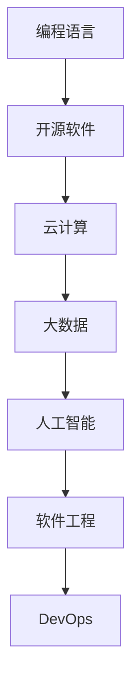

                 

# 程序员在知识经济时代的发展趋势

在知识经济时代，信息技术和互联网的迅猛发展为程序员带来了前所未有的机遇与挑战。随着人工智能、大数据、云计算等新兴技术的崛起，程序员的角色正在发生深刻变革。本文将系统性地探讨知识经济时代程序员的发展趋势，涵盖职业形态、技术栈、生态系统等多个方面，力求为程序员提供全方位的视野与洞察。

## 1. 背景介绍

### 1.1 信息技术的革命性发展

近年来，信息技术领域的飞速进步，尤其是在人工智能、大数据、云计算等领域的突破性进展，极大地改变了社会的生产方式和生活方式。这一过程中，程序员成为了推动这一变革的核心力量。他们不仅是技术的开发者和实现者，更是时代潮流的引领者和创新者。

### 1.2 知识经济的兴起

知识经济是指以知识和信息为核心的经济形态。与传统的物质经济不同，知识经济更加注重创意、设计和知识的应用与创新。在知识经济时代，程序员不仅仅是技术工匠，更像是知识工程师，通过编程与软件开发，将复杂的知识与信息转化为可操作的工具与系统。

## 2. 核心概念与联系

### 2.1 核心概念概述

在知识经济时代，程序员的核心概念主要包括以下几个方面：

- **编程语言**：编程语言是程序员进行软件开发的基本工具，如Java、Python、C++等。
- **开源软件**：开源软件强调开放与共享，如Linux、Apache Hadoop等。
- **云计算与大数据**：云计算与大数据技术提供了强大的计算与存储能力，为数据驱动的决策支持提供了可能。
- **人工智能与机器学习**：人工智能与机器学习技术使计算机具备了自我学习与优化能力，成为解决复杂问题的强大工具。
- **软件工程与DevOps**：软件工程与DevOps方法论促进了软件开发的规范化与自动化，提高了软件质量与开发效率。

### 2.2 核心概念原理和架构的 Mermaid 流程图



该流程图展示了知识经济时代程序员的核心技术栈和架构关系。编程语言是基础，开源软件强调协作与共享，云计算和大数据提供了底层支持，人工智能与机器学习赋予了系统智能，软件工程与DevOps则保证了开发过程的规范与高效。

## 3. 核心算法原理 & 具体操作步骤

### 3.1 算法原理概述

知识经济时代的程序员，不仅需要掌握编程技能，还需要深入理解各种算法和数据结构，尤其是那些在大数据、人工智能等领域中广泛应用的算法。本文将重点介绍几个核心算法的原理与应用。

- **排序算法**：如快速排序、归并排序等，用于数据的高效排序与检索。
- **图算法**：如Dijkstra算法、Kruskal算法等，用于网络数据结构的优化与分析。
- **机器学习算法**：如决策树、支持向量机、神经网络等，用于数据分类、聚类与预测。

### 3.2 算法步骤详解

以机器学习算法为例，其典型步骤包括数据预处理、模型训练、模型评估与优化。具体步骤如下：

1. **数据预处理**：包括数据清洗、特征提取与归一化等步骤，确保数据的准确性与可用性。
2. **模型训练**：选择合适的机器学习算法，使用训练集数据进行模型训练，调整参数以提高模型性能。
3. **模型评估与优化**：在测试集上评估模型性能，使用交叉验证等方法优化模型参数，提升模型泛化能力。

### 3.3 算法优缺点

- **优点**：
  - **高效性**：算法能够快速处理大量数据，提升处理效率。
  - **准确性**：通过模型训练与优化，算法能够提高预测与分类的准确性。
  - **灵活性**：算法可以根据不同应用场景进行调整与优化。

- **缺点**：
  - **复杂性**：算法设计与实现较为复杂，需要深入理解数学原理与编程技巧。
  - **过拟合风险**：算法容易在训练数据上过度拟合，导致泛化能力不足。
  - **计算资源需求**：算法往往需要较大的计算资源与存储空间。

### 3.4 算法应用领域

机器学习算法在知识经济时代的应用非常广泛，涵盖了金融、医疗、教育、交通等多个领域。如在金融领域，可以使用机器学习算法进行信用评估与风险控制；在医疗领域，可以使用算法进行疾病诊断与个性化治疗；在教育领域，可以使用算法进行学习行为分析与个性化推荐。

## 4. 数学模型和公式 & 详细讲解

### 4.1 数学模型构建

以线性回归模型为例，其数学模型构建如下：

$$
y = \beta_0 + \beta_1 x_1 + \beta_2 x_2 + ... + \beta_n x_n + \epsilon
$$

其中，$y$为输出变量，$x_i$为输入变量，$\beta_i$为回归系数，$\epsilon$为误差项。

### 4.2 公式推导过程

线性回归模型的推导过程如下：

1. **最小二乘法**：最小化残差平方和，求解回归系数$\beta_i$。
2. **正则化**：通过引入L1或L2正则项，防止过拟合，提高模型泛化能力。
3. **交叉验证**：使用交叉验证技术评估模型性能，选择最优模型参数。

### 4.3 案例分析与讲解

以房价预测为例，假设已知房价与房屋面积、楼层、位置等变量，可以使用线性回归模型进行预测。具体步骤如下：

1. **数据预处理**：收集房价与房屋特征数据，并进行数据清洗与归一化。
2. **模型训练**：使用训练数据集进行模型训练，求解回归系数。
3. **模型评估与优化**：使用测试数据集评估模型性能，调整参数以提高预测准确性。

## 5. 项目实践：代码实例和详细解释说明

### 5.1 开发环境搭建

1. **安装Python**：安装最新版本的Python，并确保pip环境正常工作。
2. **安装相关库**：安装NumPy、SciPy、Pandas、Scikit-learn等常用库。
3. **配置开发工具**：使用Visual Studio Code、PyCharm等IDE配置项目环境。

### 5.2 源代码详细实现

以线性回归模型为例，代码实现如下：

```python
import numpy as np
from sklearn.linear_model import LinearRegression
from sklearn.metrics import mean_squared_error

# 准备数据
X = np.array([[1, 2], [2, 3], [3, 4], [4, 5]])
y = np.array([1, 2, 3, 4])

# 训练模型
model = LinearRegression()
model.fit(X, y)

# 预测并评估
y_pred = model.predict(X)
mse = mean_squared_error(y, y_pred)
print(f"Mean Squared Error: {mse}")
```

### 5.3 代码解读与分析

上述代码实现了一个简单的线性回归模型。具体解读如下：

- `LinearRegression`类：Scikit-learn提供的线性回归模型。
- `fit`方法：使用训练数据进行模型拟合。
- `predict`方法：使用模型进行预测。
- `mean_squared_error`函数：计算预测值与真实值之间的均方误差。

## 6. 实际应用场景

### 6.1 金融领域

在金融领域，程序员可以通过机器学习算法进行信用评分与风险评估。具体步骤如下：

1. **数据收集**：收集用户的信用记录、资产状况等数据。
2. **特征提取**：提取有用的特征，如收入、资产、负债等。
3. **模型训练**：使用机器学习算法进行模型训练，生成信用评分模型。
4. **模型应用**：根据用户的最新数据，进行信用评分与风险评估。

### 6.2 医疗领域

在医疗领域，程序员可以使用机器学习算法进行疾病诊断与个性化治疗。具体步骤如下：

1. **数据收集**：收集患者的病历、症状、检验结果等数据。
2. **特征提取**：提取有用的特征，如病情、病程、检验指标等。
3. **模型训练**：使用机器学习算法进行模型训练，生成疾病诊断模型。
4. **模型应用**：根据患者的最新数据，进行疾病诊断与治疗方案推荐。

### 6.3 教育领域

在教育领域，程序员可以使用机器学习算法进行学习行为分析与个性化推荐。具体步骤如下：

1. **数据收集**：收集学生的学习行为数据，如学习时间、学习内容、学习效果等。
2. **特征提取**：提取有用的特征，如学习时长、学习方式、学习效果等。
3. **模型训练**：使用机器学习算法进行模型训练，生成学习行为分析模型。
4. **模型应用**：根据学生的最新数据，进行学习行为分析与个性化推荐。

## 7. 工具和资源推荐

### 7.1 学习资源推荐

1. **在线课程**：Coursera、Udacity等平台提供丰富的机器学习课程，适合初学者入门。
2. **书籍**：《机器学习实战》、《Python机器学习》等书籍详细讲解了机器学习算法与实践。
3. **博客与社区**：Kaggle、GitHub等平台汇聚了大量的机器学习项目与资源，适合深度学习与实践。

### 7.2 开发工具推荐

1. **IDE**：Visual Studio Code、PyCharm等IDE提供了丰富的功能与插件支持。
2. **版本控制**：Git、GitHub等版本控制工具提供了强大的代码管理与协作功能。
3. **云服务**：AWS、Google Cloud等云服务提供了强大的计算与存储资源，适合大数据与人工智能项目。

### 7.3 相关论文推荐

1. **《统计学习方法》**：李航著，详细讲解了机器学习算法的理论基础与应用。
2. **《深度学习》**：Ian Goodfellow、Yoshua Bengio等著，详细讲解了深度学习的基本原理与实践。
3. **《TensorFlow官方文档》**：TensorFlow官方文档详细介绍了TensorFlow的用法与示例。

## 8. 总结：未来发展趋势与挑战

### 8.1 研究成果总结

知识经济时代的程序员，需要具备跨学科的知识与技能，掌握多种编程语言与技术栈。同时，需要深入理解数据科学与机器学习等前沿技术，具备数据驱动的思维与实践能力。

### 8.2 未来发展趋势

1. **跨学科融合**：程序员需要具备跨学科的知识，如数据科学、计算机科学、统计学等，以应对复杂的应用场景。
2. **云计算与大数据**：云计算与大数据技术将成为未来技术发展的重要方向，程序员需要掌握相关技术。
3. **人工智能与机器学习**：人工智能与机器学习技术将广泛应用于各个领域，程序员需要深入理解相关算法与模型。
4. **DevOps与自动化**：DevOps方法论与自动化工具将提高软件开发的效率与质量，程序员需要掌握相关工具与技术。

### 8.3 面临的挑战

1. **知识更新**：知识经济时代技术更新迅速，程序员需要不断学习与更新知识，保持与时代同步。
2. **技能多样化**：程序员需要掌握多种编程语言与技术栈，提高自身竞争力。
3. **跨学科融合**：跨学科融合需要程序员具备多领域知识，面临挑战较大。

### 8.4 研究展望

未来的研究将在以下几个方向进行探索：

1. **人工智能与机器学习**：深入研究人工智能与机器学习算法，推动其在各领域的应用。
2. **跨学科融合**：探索数据科学与计算机科学的交叉应用，推动跨学科技术的发展。
3. **云计算与大数据**：探索云计算与大数据技术的优化与应用，提高数据驱动决策的能力。
4. **自动化与DevOps**：探索DevOps方法论与自动化工具的改进，提高软件开发效率。

总之，知识经济时代为程序员提供了广阔的发展空间，但也面临诸多挑战。只有不断学习、创新与实践，才能在知识经济时代中取得成功。

## 9. 附录：常见问题与解答

**Q1：知识经济时代程序员需要掌握哪些核心技术？**

A: 知识经济时代程序员需要掌握的核心技术包括编程语言、开源软件、云计算与大数据、人工智能与机器学习、软件工程与DevOps等。

**Q2：如何提高编程效率？**

A: 提高编程效率的关键在于不断学习与实践，掌握常用的编程技巧与工具。同时，使用自动化工具、版本控制等技术，可以提高代码的组织与管理效率。

**Q3：如何避免过拟合？**

A: 避免过拟合的关键在于数据预处理与模型优化。使用数据增强、正则化、交叉验证等技术，可以提高模型的泛化能力。

**Q4：如何提高代码质量？**

A: 提高代码质量的关键在于规范化与自动化。使用代码规范工具、静态分析工具、版本控制工具等，可以提高代码的可维护性与可读性。

**Q5：如何在团队中协作开发？**

A: 在团队中协作开发的关键在于使用版本控制、自动化工具、代码评审等技术。通过规范化开发流程与标准，可以提高团队协作效率与代码质量。

---

作者：禅与计算机程序设计艺术 / Zen and the Art of Computer Programming

