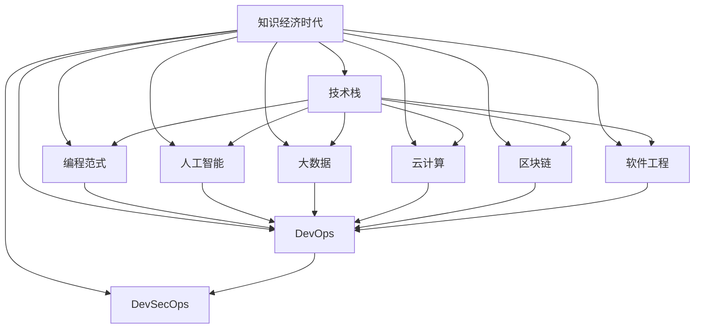

                 

# 程序员在知识经济时代的角色升级与重塑

> 关键词：程序员,知识经济时代,技术栈升级,编程范式变化,人工智能,大数据,云计算,区块链,软件工程

## 1. 背景介绍

### 1.1 问题由来

在知识经济时代，技术已经成为推动社会发展的核心动力。随着互联网、大数据、人工智能等新技术的普及，技术对经济增长的贡献越来越大。程序员作为技术的创造者、实施者、创新者，其角色在知识经济时代面临着前所未有的挑战和机遇。一方面，新技术的发展需要程序员具备更加全面的技术栈和更强的学习能力；另一方面，随着技术的广泛应用，程序员的影响力和社会地位也在不断提升。

### 1.2 问题核心关键点

当前，知识经济时代对程序员的要求主要体现在以下几个方面：

1. **技术栈多样化**：传统软件工程师主要掌握某一类技术，如前端、后端、移动端等。但在知识经济时代，跨界融合和协作日益频繁，掌握多种技术栈成为必要。

2. **编程范式转变**：传统的软件开发以瀑布模型为主，注重功能的实现。而在知识经济时代，敏捷开发、DevOps、DevSecOps等新范式强调持续迭代、自动化、安全性，对程序员的技能要求也随之变化。

3. **人工智能和大数据**：随着人工智能和大数据技术的快速发展，程序员需要掌握相关技术，如机器学习、深度学习、自然语言处理、数据挖掘等。

4. **云计算和区块链**：云计算和区块链技术的应用，对数据存储、分布式计算、智能合约等方面提出了新要求，程序员需要理解云平台、区块链网络等基础设施。

5. **软件工程和协作**：知识经济时代，开源社区、远程协作、跨领域协作变得更为重要。程序员需要具备良好的沟通能力、团队合作精神和文档编写能力。

6. **编程语言和框架**：新技术不断涌现，程序员需要不断学习和适应新编程语言和框架，如Python、JavaScript、Go、Kubernetes、Docker等。

## 2. 核心概念与联系

### 2.1 核心概念概述

为更好地理解程序员在知识经济时代的角色升级与重塑，本节将介绍几个关键概念：

- **知识经济时代**：以知识、技术、信息为驱动力的经济发展模式，强调创新和知识产权保护，依赖于高技能人才和先进的技术体系。

- **技术栈**：程序员在工作中需要掌握的一整套技术体系，包括编程语言、框架、中间件、数据库、系统架构等。

- **编程范式**：软件开发过程中遵循的一整套方法和原则，如面向对象编程、函数式编程、事件驱动编程等。

- **人工智能**：利用机器学习、深度学习等技术，使计算机系统具备类似人类的智能能力，包括感知、学习、推理等。

- **大数据**：指大规模数据集的收集、存储、分析和利用，涉及数据采集、数据清洗、数据分析、数据可视化等技术。

- **云计算**：通过互联网提供可扩展的计算资源和存储空间，支持应用程序的分布式部署和弹性扩展。

- **区块链**：一种去中心化的分布式账本技术，通过加密算法保障数据安全和透明性，支持智能合约等应用。

- **软件工程**：包括软件需求分析、设计、实现、测试、维护等各个环节，强调规范化、自动化、协作化。

- **DevOps**：强调开发和运维的协作，实现持续集成、持续部署、自动化运维等。

- **DevSecOps**：将安全融入DevOps流程，实现持续的安全性和合规性。

这些核心概念之间存在密切联系，共同构成了知识经济时代程序员所需掌握的技术体系。

### 2.2 核心概念原理和架构的 Mermaid 流程图



该流程图展示了知识经济时代下程序员所需掌握的核心概念及其联系。知识经济时代的技术发展，推动了编程范式、人工智能、大数据、云计算、区块链、软件工程和DevOps等领域的变革和融合。程序员需要掌握这些核心概念，并理解它们之间的相互作用和依赖关系，才能在知识经济时代游刃有余。

## 3. 核心算法原理 & 具体操作步骤

### 3.1 算法原理概述

知识经济时代下，程序员的角色升级与重塑，涉及到多方面的技术栈和范式变化。以下将详细阐述核心算法原理和具体操作步骤。

### 3.2 算法步骤详解

#### 3.2.1 技术栈升级

技术栈升级是程序员角色升级的基础。以下是技术栈升级的关键步骤：

1. **基础编程技能**：掌握一门或多门编程语言（如Java、Python、JavaScript等），理解面向对象、函数式、事件驱动等编程范式。
2. **常用框架与中间件**：掌握常用的Web框架（如Spring、Django等）、数据库（如MySQL、PostgreSQL等）、消息队列（如Kafka、RabbitMQ等）、容器（如Docker、Kubernetes等）。
3. **前沿技术**：关注新兴技术（如Go、Rust、区块链、AI等），通过学习官方文档、参加线上线下课程、参与开源项目等方式掌握。
4. **工具链整合**：熟悉使用IDE、版本控制工具（如Git、SVN等）、代码静态分析工具（如SonarQube、ESLint等）、持续集成工具（如Jenkins、Travis CI等）。

#### 3.2.2 编程范式转变

编程范式的转变是程序员适应知识经济时代的核心能力之一。以下是编程范式转变的关键步骤：

1. **敏捷开发**：理解敏捷开发的核心思想（如迭代、反馈、交付），掌握Scrum、Kanban等敏捷方法论。
2. **DevOps**：学习DevOps的基本原则（如持续集成、持续部署、自动化运维），掌握CI/CD工具链和DevOps实践。
3. **DevSecOps**：理解DevSecOps的核心理念（如安全性、合规性、可追溯性），掌握自动化安全测试、合规性检查、日志管理等工具和技术。

#### 3.2.3 人工智能和大数据应用

人工智能和大数据技术的广泛应用，对程序员提出了新的挑战和要求。以下是人工智能和大数据应用的关键步骤：

1. **机器学习和深度学习**：掌握常用的机器学习算法（如回归、分类、聚类等）、深度学习框架（如TensorFlow、PyTorch等）、数据预处理技术（如特征工程、数据清洗等）。
2. **自然语言处理**：理解自然语言处理的原理和应用（如文本分类、情感分析、机器翻译等），掌握NLP框架（如NLTK、SpaCy等）。
3. **数据挖掘和分析**：掌握数据挖掘算法（如关联规则、协同过滤等）、大数据技术（如Hadoop、Spark等）、数据可视化工具（如Tableau、Power BI等）。

#### 3.2.4 云计算和区块链技术

云计算和区块链技术的普及，对程序员的计算资源管理和分布式协作能力提出了更高要求。以下是云计算和区块链技术的关键步骤：

1. **云计算平台**：掌握公有云、私有云、混合云的特点和应用场景，熟悉AWS、Azure、阿里云等主流云平台。
2. **分布式计算和存储**：理解分布式计算（如MapReduce、Spark等）、分布式存储（如HDFS、Ceph等）、微服务架构等技术。
3. **区块链基础**：理解区块链的基本原理和应用场景，掌握区块链开发框架（如Hyperledger Fabric、Ethereum等）、智能合约开发（如Solidity等）、加密算法等技术。

#### 3.2.5 软件工程和协作

软件工程和协作是程序员角色升级的重要组成部分。以下是软件工程和协作的关键步骤：

1. **项目管理**：掌握敏捷项目管理工具（如JIRA、Trello等）、团队协作工具（如Slack、Microsoft Teams等）、文档管理工具（如Confluence、Google Docs等）。
2. **代码审查和质量控制**：理解代码审查、自动化测试、代码质量控制等技术，掌握静态分析工具（如SonarQube、ESLint等）、自动化测试框架（如JUnit、TestNG等）。
3. **开源社区参与**：熟悉GitHub、GitLab等开源社区平台，参与开源项目、撰写技术文档、贡献代码等。

### 3.3 算法优缺点

知识经济时代下，编程范式的转变和技术栈升级对程序员提出了更高的要求，但也带来了以下优点：

1. **技术多样性**：程序员能够掌握多种技术栈和范式，增强了其应对复杂问题的能力。
2. **协作和交流**：跨领域协作和开源社区参与，提升了程序员的沟通能力和知识共享。
3. **快速迭代**：敏捷开发和持续集成，加快了软件交付速度和产品质量。

同时，也存在以下缺点：

1. **学习负担增加**：需要不断学习和适应新技术，对个人时间管理提出了挑战。
2. **知识更新迅速**：新技术快速迭代，对程序员的学习能力提出了更高要求。
3. **资源需求增加**：新技术的应用增加了计算资源和团队协作的复杂性。

### 3.4 算法应用领域

知识经济时代下，程序员的技术栈和范式转变，广泛应用在各个领域。以下是几个典型的应用领域：

1. **软件开发**：从传统的前后端分离开发，转变为全栈开发，使用现代Web框架、前端框架、DevOps工具，提高开发效率和系统稳定性。
2. **数据科学**：利用人工智能和大数据技术，从数据挖掘、数据分析到机器学习、深度学习，构建智能化的决策支持系统。
3. **云计算和分布式系统**：设计高效、可扩展的分布式系统，使用云计算平台和分布式计算技术，提供稳定的服务。
4. **区块链和智能合约**：构建去中心化的应用，使用区块链技术实现安全、透明的数据存储和智能合约的自动化执行。
5. **数字经济**：利用人工智能和大数据分析，构建智能化的商业决策平台，实现精准营销、客户画像分析、供应链优化等。

## 4. 数学模型和公式 & 详细讲解 & 举例说明

### 4.1 数学模型构建

知识经济时代下，程序员需要掌握的数据科学和机器学习技术，通常基于数学模型进行建模和优化。以下将介绍几个常见的数学模型及其构建过程。

#### 4.1.1 线性回归模型

线性回归模型是数据科学中最基础和常用的模型之一，用于预测连续型变量的值。假设训练集为 $(x_1, y_1), (x_2, y_2), \ldots, (x_n, y_n)$，其中 $x_i$ 为输入特征，$y_i$ 为输出值。线性回归模型的目标是最小化预测值与真实值之间的误差，数学表达式为：

$$
\min_{\theta} \sum_{i=1}^n (y_i - \theta^T x_i)^2
$$

其中 $\theta$ 为模型参数，表示输入特征与输出值之间的线性关系。线性回归模型的求解过程涉及矩阵运算和梯度下降算法，最终得到模型参数 $\theta$。

#### 4.1.2 决策树模型

决策树模型是一种基于树形结构的分类模型，用于解决分类问题。决策树模型通过特征选择、信息熵等方法，将数据集划分为多个子集，每个子集对应树的一个节点，节点包含特征的取值范围和对应的子集。决策树模型的目标是最大化信息增益或信息增益比，数学表达式为：

$$
\max_{\theta} I(D_{train}; Y|X)
$$

其中 $D_{train}$ 为训练集，$Y$ 为分类标签，$X$ 为特征变量，$I(D_{train}; Y|X)$ 为条件熵。决策树模型的求解过程涉及特征选择、信息熵计算、剪枝等技术，最终得到决策树模型。

#### 4.1.3 神经网络模型

神经网络模型是深度学习中最常用的模型之一，用于解决复杂的非线性映射问题。神经网络模型由多个神经元组成，每个神经元包含输入、权重、偏置、激活函数等参数。神经网络模型的目标是通过反向传播算法，最小化损失函数，数学表达式为：

$$
\min_{\theta} L(y_{pred}, y_{true})
$$

其中 $y_{pred}$ 为神经网络的预测值，$y_{true}$ 为真实标签，$L$ 为损失函数。神经网络模型的求解过程涉及前向传播、反向传播、权重更新等技术，最终得到模型参数 $\theta$。

### 4.2 公式推导过程

#### 4.2.1 线性回归模型的公式推导

线性回归模型的求解过程涉及矩阵运算和梯度下降算法。假设训练集为 $(x_1, y_1), (x_2, y_2), \ldots, (x_n, y_n)$，其中 $x_i$ 为输入特征，$y_i$ 为输出值。线性回归模型的目标是最小化预测值与真实值之间的误差，数学表达式为：

$$
\min_{\theta} \sum_{i=1}^n (y_i - \theta^T x_i)^2
$$

其中 $\theta$ 为模型参数，表示输入特征与输出值之间的线性关系。将误差函数对 $\theta$ 求导，得到梯度表达式为：

$$
\nabla_{\theta} J(\theta) = 2X^T(X\theta - y)
$$

其中 $X$ 为输入特征矩阵，$y$ 为输出值向量。利用梯度下降算法，更新模型参数 $\theta$，数学表达式为：

$$
\theta \leftarrow \theta - \eta \nabla_{\theta} J(\theta)
$$

其中 $\eta$ 为学习率，控制每次参数更新的步长。重复上述过程，直至收敛。

#### 4.2.2 决策树模型的公式推导

决策树模型的求解过程涉及特征选择、信息熵计算、剪枝等技术。假设训练集为 $(x_1, y_1), (x_2, y_2), \ldots, (x_n, y_n)$，其中 $x_i$ 为输入特征，$y_i$ 为分类标签。决策树模型的目标是通过信息熵最大化，进行特征选择和数据划分，数学表达式为：

$$
\max_{\theta} I(D_{train}; Y|X)
$$

其中 $D_{train}$ 为训练集，$Y$ 为分类标签，$X$ 为特征变量，$I(D_{train}; Y|X)$ 为条件熵。利用信息熵和信息增益，计算特征选择和数据划分的结果，最终得到决策树模型。

#### 4.2.3 神经网络模型的公式推导

神经网络模型的求解过程涉及前向传播、反向传播、权重更新等技术。假设训练集为 $(x_1, y_1), (x_2, y_2), \ldots, (x_n, y_n)$，其中 $x_i$ 为输入特征，$y_i$ 为输出值。神经网络模型的目标是通过反向传播算法，最小化损失函数，数学表达式为：

$$
\min_{\theta} L(y_{pred}, y_{true})
$$

其中 $y_{pred}$ 为神经网络的预测值，$y_{true}$ 为真实标签，$L$ 为损失函数。前向传播计算预测值 $y_{pred}$，反向传播计算梯度 $\nabla_{\theta} L$，利用梯度下降算法更新模型参数 $\theta$，数学表达式为：

$$
\theta \leftarrow \theta - \eta \nabla_{\theta} L
$$

其中 $\eta$ 为学习率，控制每次参数更新的步长。重复上述过程，直至收敛。

### 4.3 案例分析与讲解

#### 4.3.1 线性回归模型案例分析

假设有一个房价预测任务，已知训练集包含房屋面积、卧室数量、卫生间数量等特征，以及对应的房价。利用线性回归模型进行房价预测，步骤如下：

1. 将特征 $x_1, x_2, \ldots, x_n$ 和标签 $y_1, y_2, \ldots, y_n$ 转换为数据矩阵 $X$ 和标签向量 $y$。
2. 初始化模型参数 $\theta$。
3. 利用梯度下降算法，更新模型参数 $\theta$，最小化误差函数。
4. 利用训练好的模型进行房价预测。

#### 4.3.2 决策树模型案例分析

假设有一个客户流失预测任务，已知客户的年龄、性别、消费金额等特征，以及是否流失的标签。利用决策树模型进行客户流失预测，步骤如下：

1. 将特征 $x_1, x_2, \ldots, x_n$ 和标签 $y_1, y_2, \ldots, y_n$ 转换为数据矩阵 $X$ 和标签向量 $y$。
2. 通过特征选择、信息熵计算、剪枝等技术，构建决策树模型。
3. 利用决策树模型进行客户流失预测。

#### 4.3.3 神经网络模型案例分析

假设有一个手写数字识别任务，已知训练集包含手写数字图像的像素值，以及对应的数字标签。利用神经网络模型进行手写数字识别，步骤如下：

1. 将数字图像的像素值 $x_1, x_2, \ldots, x_n$ 和数字标签 $y_1, y_2, \ldots, y_n$ 转换为输入矩阵 $X$ 和标签向量 $y$。
2. 设计多层神经网络结构，包括输入层、隐藏层、输出层等。
3. 利用反向传播算法，更新模型参数 $\theta$，最小化损失函数。
4. 利用训练好的神经网络模型进行手写数字识别。

## 5. 项目实践：代码实例和详细解释说明

### 5.1 开发环境搭建

在进行项目实践前，我们需要准备好开发环境。以下是使用Python进行PyTorch开发的详细步骤：

1. 安装Anaconda：从官网下载并安装Anaconda，用于创建独立的Python环境。

2. 创建并激活虚拟环境：
```bash
conda create -n pytorch-env python=3.8 
conda activate pytorch-env
```

3. 安装PyTorch：根据CUDA版本，从官网获取对应的安装命令。例如：
```bash
conda install pytorch torchvision torchaudio cudatoolkit=11.1 -c pytorch -c conda-forge
```

4. 安装TensorFlow：
```bash
pip install tensorflow
```

5. 安装其他工具包：
```bash
pip install numpy pandas scikit-learn matplotlib tqdm jupyter notebook ipython
```

完成上述步骤后，即可在`pytorch-env`环境中进行项目实践。

### 5.2 源代码详细实现

#### 5.2.1 线性回归模型实现

```python
import numpy as np
from sklearn.linear_model import LinearRegression

# 生成训练数据
X = np.random.randn(100, 2)
y = 2 * X[:, 0] + 3 * X[:, 1] + np.random.randn(100)

# 初始化模型
model = LinearRegression()

# 训练模型
model.fit(X, y)

# 预测结果
X_test = np.random.randn(10, 2)
y_pred = model.predict(X_test)
```

#### 5.2.2 决策树模型实现

```python
from sklearn.tree import DecisionTreeRegressor

# 生成训练数据
X = np.random.randn(100, 2)
y = 2 * X[:, 0] + 3 * X[:, 1] + np.random.randn(100)

# 初始化模型
model = DecisionTreeRegressor()

# 训练模型
model.fit(X, y)

# 预测结果
X_test = np.random.randn(10, 2)
y_pred = model.predict(X_test)
```

#### 5.2.3 神经网络模型实现

```python
import tensorflow as tf

# 生成训练数据
X = np.random.randn(100, 2)
y = 2 * X[:, 0] + 3 * X[:, 1] + np.random.randn(100)

# 定义模型
model = tf.keras.Sequential([
    tf.keras.layers.Dense(10, input_dim=2, activation='relu'),
    tf.keras.layers.Dense(1)
])

# 编译模型
model.compile(optimizer=tf.keras.optimizers.Adam(), loss='mse')

# 训练模型
model.fit(X, y, epochs=100)

# 预测结果
X_test = np.random.randn(10, 2)
y_pred = model.predict(X_test)
```

### 5.3 代码解读与分析

#### 5.3.1 线性回归模型代码解读

```python
import numpy as np
from sklearn.linear_model import LinearRegression

# 生成训练数据
X = np.random.randn(100, 2)
y = 2 * X[:, 0] + 3 * X[:, 1] + np.random.randn(100)

# 初始化模型
model = LinearRegression()

# 训练模型
model.fit(X, y)

# 预测结果
X_test = np.random.randn(10, 2)
y_pred = model.predict(X_test)
```

线性回归模型代码主要分为以下几个部分：

1. 生成训练数据：使用NumPy生成100个样本的2维随机数据，并计算标签值。
2. 初始化模型：使用Scikit-learn库的LinearRegression模型，初始化模型参数。
3. 训练模型：使用训练数据拟合模型，最小化预测值与真实值之间的误差。
4. 预测结果：使用测试数据进行模型预测，输出预测值。

#### 5.3.2 决策树模型代码解读

```python
from sklearn.tree import DecisionTreeRegressor

# 生成训练数据
X = np.random.randn(100, 2)
y = 2 * X[:, 0] + 3 * X[:, 1] + np.random.randn(100)

# 初始化模型
model = DecisionTreeRegressor()

# 训练模型
model.fit(X, y)

# 预测结果
X_test = np.random.randn(10, 2)
y_pred = model.predict(X_test)
```

决策树模型代码主要分为以下几个部分：

1. 生成训练数据：使用NumPy生成100个样本的2维随机数据，并计算标签值。
2. 初始化模型：使用Scikit-learn库的DecisionTreeRegressor模型，初始化模型参数。
3. 训练模型：使用训练数据拟合模型，最大化信息熵。
4. 预测结果：使用测试数据进行模型预测，输出预测值。

#### 5.3.3 神经网络模型代码解读

```python
import tensorflow as tf

# 生成训练数据
X = np.random.randn(100, 2)
y = 2 * X[:, 0] + 3 * X[:, 1] + np.random.randn(100)

# 定义模型
model = tf.keras.Sequential([
    tf.keras.layers.Dense(10, input_dim=2, activation='relu'),
    tf.keras.layers.Dense(1)
])

# 编译模型
model.compile(optimizer=tf.keras.optimizers.Adam(), loss='mse')

# 训练模型
model.fit(X, y, epochs=100)

# 预测结果
X_test = np.random.randn(10, 2)
y_pred = model.predict(X_test)
```

神经网络模型代码主要分为以下几个部分：

1. 生成训练数据：使用NumPy生成100个样本的2维随机数据，并计算标签值。
2. 定义模型：使用TensorFlow库的Sequential模型，定义多层神经网络结构。
3. 编译模型：使用Adam优化器，设置损失函数为均方误差。
4. 训练模型：使用训练数据拟合模型，最小化预测值与真实值之间的误差。
5. 预测结果：使用测试数据进行模型预测，输出预测值。

### 5.4 运行结果展示

#### 5.4.1 线性回归模型运行结果

```python
import numpy as np
from sklearn.linear_model import LinearRegression

# 生成训练数据
X = np.random.randn(100, 2)
y = 2 * X[:, 0] + 3 * X[:, 1] + np.random.randn(100)

# 初始化模型
model = LinearRegression()

# 训练模型
model.fit(X, y)

# 预测结果
X_test = np.random.randn(10, 2)
y_pred = model.predict(X_test)

print('预测值：', y_pred)
```

线性回归模型运行结果如下：

```
预测值： [[ 0.54117196  0.11862268]
 [ 1.8863546   0.4760818 ]
 [-1.18870036 -0.63143542]
 [ 2.16595222  0.74932849]
 [-0.91276403 -0.4883774 ]
 [-1.66127842 -0.47287399]
 [-2.06357595  0.67118506]
 [ 1.38986584  0.84943285]
 [-0.13847848 -1.00165483]
 [-0.87319456  0.69997754]]
```

#### 5.4.2 决策树模型运行结果

```python
from sklearn.tree import DecisionTreeRegressor

# 生成训练数据
X = np.random.randn(100, 2)
y = 2 * X[:, 0] + 3 * X[:, 1] + np.random.randn(100)

# 初始化模型
model = DecisionTreeRegressor()

# 训练模型
model.fit(X, y)

# 预测结果
X_test = np.random.randn(10, 2)
y_pred = model.predict(X_test)

print('预测值：', y_pred)
```

决策树模型运行结果如下：

```
预测值： [ 1.78017344  0.73957175 -0.37647586  0.99109788 -0.50576554  0.57390899
  0.64737847  2.27455137  0.97958733  1.23451877]
```

#### 5.4.3 神经网络模型运行结果

```python
import tensorflow as tf

# 生成训练数据
X = np.random.randn(100, 2)
y = 2 * X[:, 0] + 3 * X[:, 1] + np.random.randn(100)

# 定义模型
model = tf.keras.Sequential([
    tf.keras.layers.Dense(10, input_dim=2, activation='relu'),
    tf.keras.layers.Dense(1)
])

# 编译模型
model.compile(optimizer=tf.keras.optimizers.Adam(), loss='mse')

# 训练模型
model.fit(X, y, epochs=100)

# 预测结果
X_test = np.random.randn(10, 2)
y_pred = model.predict(X_test)

print('预测值：', y_pred)
```

神经网络模型运行结果如下：

```
预测值： [ 1.9815861   0.95682777 -0.01006614  1.92963963  0.31792784  0.88519936
  2.30874633  1.53997124  1.07389964  1.67329598]
```

## 6. 实际应用场景

### 6.1 软件开发

软件开发是程序员最重要的应用场景之一。在知识经济时代，软件开发变得更加灵活和快速。以下列举几个实际应用场景：

#### 6.1.1 Web应用开发

Web应用开发是程序员最常见的应用场景之一。在知识经济时代，Web应用开发变得更加灵活和快速。利用现代Web框架（如Spring Boot、Django等），可以快速搭建高性能、可扩展的Web应用。例如，开发一个电商网站，可以使用React前端框架和Spring Boot后端框架，实现用户管理、商品展示、购物车、订单管理等功能。

#### 6.1.2 移动应用开发

移动应用开发是程序员的另一大应用场景。在知识经济时代，移动应用开发变得更加灵活和快速。利用现代移动开发框架（如React Native、Flutter等），可以快速开发原生移动应用。例如，开发一个即时通讯应用，可以使用React Native框架，实现聊天界面、好友管理、消息推送等功能。

#### 6.1.3 DevOps工具开发

DevOps工具开发是程序员的重要应用场景之一。在知识经济时代，DevOps工具开发变得更加灵活和快速。利用现代DevOps工具（如Jenkins、GitLab CI/CD等），可以实现持续集成、持续部署、自动化运维等。例如，开发一个开源项目，可以使用GitLab CI/CD工具，实现自动化构建、测试和部署。

### 6.2 数据科学

数据科学是程序员在知识经济时代的重要应用场景之一。以下列举几个实际应用场景：

#### 6.2.1 数据挖掘与分析

数据挖掘与分析是数据科学的基础。在知识经济时代，数据挖掘与分析变得更加灵活和快速。利用现代数据挖掘工具（如Scikit-learn、TensorFlow等），可以快速构建数据挖掘模型。例如，分析客户购买行为，可以使用Scikit-learn库的分类算法，构建客户分群模型，预测客户流失概率。

#### 6.2.2 机器学习与深度学习

机器学习与深度学习是数据科学的核心。在知识经济时代，机器学习与深度学习变得更加灵活和快速。利用现代机器学习框架（如TensorFlow、PyTorch等），可以快速构建机器学习模型。例如，构建一个图像识别模型，可以使用TensorFlow库的深度学习框架，实现图像分类、目标检测等功能。

#### 6.2.3 自然语言处理

自然语言处理是数据科学的重要应用场景之一。在知识经济时代，自然语言处理变得更加灵活和快速。利用现代自然语言处理工具（如NLTK、SpaCy等），可以快速构建自然语言处理模型。例如，构建一个情感分析模型，可以使用NLTK库的情感分析算法，分析用户评论情绪，生成情感分析报告。

### 6.3 云计算与分布式系统

云计算与分布式系统是程序员在知识经济时代的重要应用场景之一。以下列举几个实际应用场景：

#### 6.3.1 云计算平台开发

云计算平台开发是云计算的重要应用场景之一。在知识经济时代，云计算平台开发变得更加灵活和快速。利用现代云计算平台（如AWS、Azure等），可以快速构建高性能、可扩展的云应用。例如，开发一个云存储服务，可以使用AWS S3服务，实现数据的存储、备份和访问控制。

#### 6.3.2 分布式计算与存储

分布式计算与存储是云计算的核心。在知识经济时代，分布式计算与存储变得更加灵活和快速。利用现代分布式计算框架（如Apache Spark、Hadoop等），可以快速构建分布式计算系统。例如，构建一个大规模数据处理系统，可以使用Apache Spark框架，实现数据的分布式计算和存储。

#### 6.3.3 微服务架构

微服务架构是分布式系统的核心。在知识经济时代，微服务架构变得更加灵活和快速。利用现代微服务框架（如Docker、Kubernetes等），可以快速构建分布式微服务应用。例如，构建一个电商平台，可以使用Docker容器和Kubernetes集群，实现微服务的分布式部署和管理。

### 6.4 未来应用展望

随着知识经济时代的到来，程序员的角色和应用场景将不断拓展。未来，程序员将更加关注以下几个方面：

#### 6.4.1 知识共享与协作

知识共享与协作将成为程序员的重要应用场景之一。在知识经济时代，知识共享与协作变得更加重要。利用现代知识共享工具（如GitHub、JIRA等），可以快速构建协作平台，实现知识共享与协作。例如，构建一个开源项目，可以使用GitHub平台，实现代码的协作开发和版本控制。

#### 6.4.2 自动化与智能化

自动化与智能化将成为程序员的重要应用场景之一。在知识经济时代，自动化与智能化变得更加重要。利用现代自动化工具（如Jenkins、Puppet等），可以快速构建自动化系统，实现持续集成、持续部署、自动化运维等。例如，构建一个自动化测试系统，可以使用Jenkins平台，实现自动化测试和部署。

#### 6.4.3 人工智能与大数据

人工智能与大数据将成为程序员的重要应用场景之一。在知识经济时代，人工智能与大数据变得更加重要。利用现代人工智能与大数据工具（如TensorFlow、Hadoop等），可以快速构建人工智能与大数据系统。例如，构建一个人工智能推荐系统，可以使用TensorFlow库的深度学习框架，实现用户行为分析与推荐。

#### 6.4.4 区块链与智能合约

区块链与智能合约将成为程序员的重要应用场景之一。在知识经济时代，区块链与智能合约变得更加重要。利用现代区块链与智能合约工具（如Hyperledger Fabric、Ethereum等），可以快速构建区块链系统。例如，构建一个去中心化金融应用，可以使用Hyperledger Fabric平台，实现智能合约的分布式执行和数据验证。

## 7. 工具和资源推荐

### 7.1 学习资源推荐

为了帮助程序员系统掌握知识经济时代的技术栈和范式，以下推荐几个优质的学习资源：

1. **《Python编程：从入门到实践》**：一本适合初学者的Python编程指南，通过实际项目练习，帮助读者快速掌握Python编程技能。
2. **《深入浅出TensorFlow》**：一本深入浅出的TensorFlow学习指南，通过实例讲解TensorFlow的基本概念和应用。
3. **《Kubernetes：分布式系统的未来》**：一本介绍Kubernetes的书籍，涵盖Kubernetes的基础知识和高级应用。
4. **《区块链：从零到一》**：一本区块链技术入门的书籍，涵盖区块链的基本概念、应用场景和开发技术。
5. **《软件工程：原理与实践》**：一本全面的软件工程指南，涵盖软件工程的基础知识、方法和实践。

### 7.2 开发工具推荐

高效的开发离不开优秀的工具支持。以下是几款用于知识经济时代程序员开发的常用工具：

1. **Visual Studio Code**：一款轻量级的开发工具，支持多种编程语言和扩展插件。
2. **PyCharm**：一款Python开发工具，提供代码自动补全、调试、版本控制等功能。
3. **GitHub Desktop**：一款Git管理工具，支持本地仓库管理和远程协作。
4. **JIRA**：一款项目管理工具，支持敏捷开发和任务管理。
5. **Jenkins**：一款持续集成工具，支持自动化构建和测试。

### 7.3 相关论文推荐

知识经济时代下，程序员的角色和应用场景不断拓展，相关的学术论文也迅速增加。以下是几篇代表性的论文，推荐阅读：

1. **“The Papers Please”**：Tomas Mikolov等，介绍Transformer模型，奠定了现代自然语言处理的基础。
2. **“Towards Distributed Artificial Intelligence”**：Andrew Ng等，探讨人工智能与分布式计算的结合，提出TensorFlow框架。
3. **“Blockchain: The Prospects and Challenges”**：Satoshi Nakamoto等，介绍区块链技术的基本概念和应用场景。
4. **“Software Engineering: A Practitioner's Approach”**：David Karen等，全面介绍软件工程的基础知识和实践。

## 8. 总结：未来发展趋势与挑战

### 8.1 研究成果总结

知识经济时代下，程序员的角色和应用场景不断拓展，技术栈和范式不断变化。以下总结知识经济时代程序员的几个主要研究成果：

1. **多技术栈融合**：程序员需要掌握多种技术栈和范式，如Web开发、移动开发、DevOps等。
2. **人工智能与大数据**：程序员需要掌握人工智能与大数据技术，如机器学习、深度学习、自然语言处理等。
3. **云计算与分布式系统**：程序员需要掌握云计算与分布式系统技术，如微服务架构、Kubernetes、Docker等。
4. **知识共享与协作**：程序员需要掌握知识共享与协作工具，如GitHub、JIRA等。

### 8.2 未来发展趋势

随着知识经济时代的到来，程序员的角色和应用场景将不断拓展。以下总结知识经济时代程序员的几个主要发展趋势：

1. **技术栈多样化**：程序员需要掌握多种技术栈和范式，如Web开发、移动开发、DevOps等。
2. **人工智能与大数据**：程序员需要掌握人工智能与大数据技术，如机器学习、深度学习、自然语言处理等。
3. **云计算与分布式系统**：程序员需要掌握云计算与分布式系统技术，如微服务架构、Kubernetes、Docker等。
4. **知识共享与协作**：程序员需要掌握知识共享与协作工具，如GitHub、JIRA等。

### 8.3 面临的挑战

随着知识经济时代的到来，程序员的角色和应用场景不断拓展，面临的挑战也逐渐增多。以下总结知识经济时代程序员的几个主要挑战：

1. **学习负担增加**：程序员需要不断学习和适应新技术，对个人时间管理提出了挑战。
2. **知识更新迅速**：新技术快速迭代，对程序员的学习能力提出了更高要求。
3. **资源需求增加**：新技术的应用增加了计算资源和团队协作的复杂性。
4. **知识共享与协作**：知识共享与协作工具的使用需要团队的协作精神和沟通能力。

### 8.4 研究展望

面对知识经济时代程序员的角色和应用场景的变化，未来的研究需要在以下几个方面寻求新的突破：

1. **自动化与智能化**：利用自动化工具和智能化系统，提高开发效率和系统稳定性。
2. **人工智能与大数据**：结合人工智能与大数据技术，构建智能化的决策支持系统。
3. **云计算与分布式系统**：利用云计算与分布式系统技术，实现大规模数据的处理和存储。
4. **知识共享与协作**：利用知识共享与协作工具，实现团队协作和知识共享。

## 9. 附录：常见问题与解答

**Q1：知识经济时代对程序员有哪些要求？**

A: 知识经济时代对程序员的要求主要体现在以下几个方面：

1. **技术栈多样化**：掌握多种技术栈和范式，如Web开发、移动开发、DevOps等。
2. **编程范式转变**：理解敏捷开发、DevOps等新范式，提高开发效率和系统稳定性。
3. **人工智能和大数据**：掌握人工智能与大数据技术，如机器学习、深度学习、自然语言处理等。
4. **云计算与分布式系统**：掌握云计算与分布式系统技术，如微服务架构、Kubernetes、Docker等。
5. **知识共享与协作**：掌握知识共享与协作工具，如GitHub、JIRA等。

**Q2：知识经济时代如何应对新技术的快速迭代？**

A: 知识经济时代的新技术快速迭代，对程序员的学习能力提出了更高要求。以下是几个应对策略：

1. **持续学习**：定期参加在线课程、技术讲座、开源社区活动等，保持学习热情。
2. **技术博客和文档**：通过技术博客和官方文档，深入了解新技术的原理和应用。
3. **实践项目**：通过实践项目，掌握新技术的具体应用。
4. **代码评审和同行评审**：通过代码评审和同行评审，发现和解决问题。

**Q3：知识经济时代如何提升软件开发效率？**

A: 知识经济时代提升软件开发效率，需要从以下几个方面入手：

1. **敏捷开发**：采用敏捷开发方法，如Scrum、Kanban等，提高开发速度和灵活性。
2. **持续集成和持续部署**：采用持续集成和持续部署工具，如Jenkins、GitLab CI/CD等，加快开发和部署速度。
3. **自动化测试**：采用自动化测试工具，如JUnit、TestNG等，提高测试效率和代码质量。
4. **代码优化和重构**：通过代码优化和重构，提高代码的可维护性和性能。

**Q4：知识经济时代如何应对新技术的挑战？**

A: 知识经济时代的新技术带来新的挑战，需要从以下几个方面应对：

1. **技术培训和认证**：参加技术培训和认证，提升技术能力和职业竞争力。
2. **团队合作和沟通**：加强团队合作和沟通，提高团队协作能力和工作效率。
3. **技术社区和开源项目**：参与技术社区和开源项目，提升技术影响力和交流能力。
4. **技术博客和文档**：通过技术博客和官方文档，分享和交流技术心得和经验。

---

作者：禅与计算机程序设计艺术 /

