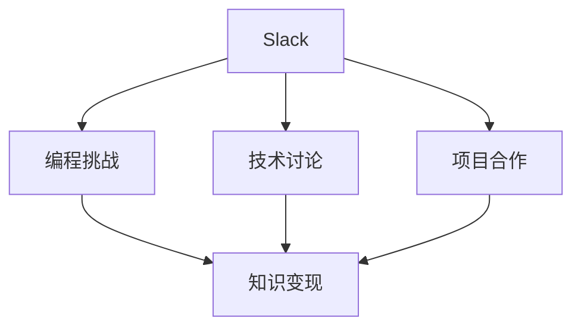

                 

# 程序员如何利用Slack社区进行知识变现

## 1. 背景介绍

### 1.1 问题由来

随着互联网的迅速发展和科技创新的不断推进，程序员作为信息时代的重要力量，在社会发展和经济建设中扮演着关键角色。然而，面对日益激烈的行业竞争和快速变化的技术环境，程序员的知识更新和技能提升显得尤为重要。如何高效获取和利用知识，成为每个程序员都需要面对的挑战。

近年来，Slack作为一款团队协作平台，逐渐成为程序员知识分享与学习的常用工具。其开放、便捷的特性，使许多程序员开始利用Slack社区进行知识变现，实现个人技能提升和职业发展的双赢。

### 1.2 问题核心关键点

利用Slack社区进行知识变现的核心在于：
1. 高效获取：通过订阅、参与Slack频道，程序员可以快速获取最新技术动态、行业资讯、开源项目等宝贵资源。
2. 实时互动：Slack的即时通讯功能，使得程序员能够实时与业内专家、同行交流，解答疑问，分享经验。
3. 技能提升：通过参与Slack的编程挑战、技术讨论、项目合作，程序员能够在实践中提高自身技能，积累实战经验。
4. 品牌建立：通过在Slack上分享成果、展示项目，程序员可以建立个人品牌，提升行业影响力。
5. 职业发展：利用Slack社区，程序员可以拓展职业人脉，获得更多的就业和发展机会。

### 1.3 问题研究意义

研究程序员如何利用Slack社区进行知识变现，对于推动程序员职业发展、提升行业整体技术水平、促进知识共享与传播具有重要意义：

1. 加速个人成长：通过Slack社区的学习和交流，程序员可以快速掌握新技术，提高工作效率，增强竞争力。
2. 优化技术生态：Slack社区的知识分享和交流，有助于技术社群的形成，优化技术生态，促进技术的迭代和进步。
3. 提升行业水平：通过Slack平台，程序员可以相互学习和交流，积累最佳实践，提升整个行业的技术水平。
4. 激发创新灵感：Slack社区的活跃讨论和合作项目，可以激发程序员的创新灵感，推动技术突破和应用创新。
5. 促进知识共享：Slack的开放特性，使得知识传播更加便捷高效，有助于构建良好的知识共享文化。

## 2. 核心概念与联系

### 2.1 核心概念概述

为更好地理解程序员如何利用Slack社区进行知识变现，本节将介绍几个密切相关的核心概念：

- **Slack**：一款团队协作平台，支持即时通讯、文件共享、应用集成等功能，广泛应用于企业内部和外部社区。
- **知识变现**：通过知识分享和交流，实现个人技能提升、职业发展、品牌建立等经济价值和社会价值。
- **编程挑战**：Slack社区中常见的互动形式，通过解决编程问题，促进知识交流和技术提升。
- **技术讨论**：程序员在Slack上进行的各类技术讨论，包括开源项目、新技术、工具使用等。
- **项目合作**：Slack社区中程序员之间的项目合作，通过合作完成项目，实现知识和技能的共同提升。

这些核心概念之间的逻辑关系可以通过以下Mermaid流程图来展示：



这个流程图展示了一部分Slack社区与知识变现之间的关系：

1. Slack平台提供了编程挑战、技术讨论、项目合作等互动方式。
2. 通过这些互动方式，程序员能够高效获取知识，提升技能，建立品牌。
3. 这些知识获取和技能提升，最终实现个人和职业的增值，即知识变现。

## 3. 核心算法原理 & 具体操作步骤

### 3.1 算法原理概述

程序员利用Slack社区进行知识变现的过程，本质上是一个多维度的知识获取与交流的过程。其核心算法原理包括：

1. **信息过滤与筛选**：通过订阅、星标频道、关键词搜索等手段，程序员可以快速获取有价值的信息，并筛选出对自己有用的内容。
2. **实时互动与响应**：利用Slack的即时通讯功能，程序员可以实时与社区成员交流，回答问题，分享经验。
3. **内容整合与学习**：通过阅读聊天记录、文档、代码片段等，程序员可以系统性地学习新技术、新方法，提升自身技能。
4. **项目合作与实践**：参与Slack中的项目合作，程序员可以在实际项目中应用所学知识，积累实战经验。
5. **品牌建立与推广**：通过在Slack上分享自己的项目成果、技术文章，程序员可以建立个人品牌，提升行业影响力。

### 3.2 算法步骤详解

基于以上算法原理，程序员利用Slack社区进行知识变现的具体操作步骤如下：

**Step 1: 创建并优化Slack账号**
- 注册Slack账号，添加必要的个人或企业信息。
- 创建和管理个人工作空间，订阅相关频道和组。
- 自定义频道和组，设置星标和关键词搜索，优化信息获取路径。

**Step 2: 参与编程挑战和比赛**
- 订阅Slack上的编程挑战频道，获取最新的挑战任务。
- 阅读任务描述和要求，理解挑战背景和技术需求。
- 利用社区资源（如代码库、文档、示例）进行代码编写和调试。
- 将完成的代码提交到挑战平台，参与评分和讨论。

**Step 3: 积极参与技术讨论**
- 订阅并参与Slack上的技术讨论组，如开源项目、新技术、工具使用等。
- 在讨论中积极发言，提出问题，分享见解，了解行业动态。
- 整理并总结讨论内容，系统化学习相关知识。

**Step 4: 开展项目合作**
- 在Slack上发布自己的项目需求，寻找合适的合作伙伴。
- 与社区成员交流合作意向，明确项目分工和目标。
- 在Slack上协作开发，实时沟通进展，解决问题。
- 完成项目后，在Slack上分享项目成果，展示技术能力。

**Step 5: 构建个人品牌**
- 在Slack上发布技术文章、项目成果、开源代码等，展示个人技术水平。
- 参与Slack上的编程竞赛、技术分享等活动，提升个人影响力。
- 在Slack上建立个人或团队品牌，积累行业认可度和声誉。

### 3.3 算法优缺点

利用Slack社区进行知识变现的方法具有以下优点：
1. 高效获取：Slack的订阅、星标、搜索功能，使得程序员能够快速获取有价值的信息。
2. 实时互动：即时通讯和讨论功能，能够促进程序员之间的交流和协作。
3. 项目合作：Slack上的项目合作平台，为程序员提供了丰富的实践机会。
4. 品牌建立：通过分享项目成果和文章，程序员可以建立个人品牌，提升行业影响力。

同时，该方法也存在一定的局限性：
1. 依赖社区活跃度：Slack社区的活跃度和质量对知识获取和变现效果有直接影响。
2. 噪音干扰：社区中的冗余信息和干扰内容可能影响知识获取效率。
3. 学习系统性不足：Slack上的信息多为碎片化，缺乏系统性的学习路径。
4. 知识传播速度慢：Slack上的信息传播依赖于社区成员的分享和讨论，传播速度较慢。

尽管存在这些局限性，但就目前而言，利用Slack社区进行知识变现仍是一种高效便捷的方法。未来相关研究的重点在于如何进一步优化社区内容、提高知识传播效率、减少噪音干扰等，以进一步提升知识变现的效果。

### 3.4 算法应用领域

利用Slack社区进行知识变现的方法，已经在软件开发、技术支持、教育培训等多个领域得到广泛应用，具体如下：

- **软件开发**：程序员通过Slack社区获取最新的技术动态、开源项目、编程挑战，提升自己的编程能力和技术水平。
- **技术支持**：IT支持人员通过参与Slack上的技术讨论、问题解答，积累经验，提升服务质量。
- **教育培训**：教师和学生通过Slack社区进行课程分享、问题交流、项目合作，提升教学和学习的效率。
- **项目管理**：项目经理通过Slack社区发布任务、跟踪进度、协调合作，提升项目管理的效率和效果。
- **产品开发**：产品经理通过Slack社区了解用户需求、市场趋势、技术动态，指导产品开发和迭代。

除了上述这些经典应用外，Slack社区还被创新性地应用到更多场景中，如项目演示、产品营销、品牌推广等，为程序员提供了更多的职业发展机会。

## 4. 数学模型和公式 & 详细讲解 & 举例说明

### 4.1 数学模型构建

为了更好地理解利用Slack社区进行知识变现的数学模型，本节将建立一种简化模型，定义程序员的知识获取与变现过程。

设程序员每天在Slack上花费的时间为 $T$，其中 $t_1$ 用于信息获取，$t_2$ 用于实时互动和讨论，$t_3$ 用于项目合作和实践，$t_4$ 用于品牌建立和推广。则知识变现的效率 $E$ 可以表示为：

$$
E = \frac{t_1 \cdot I + t_2 \cdot C + t_3 \cdot P + t_4 \cdot B}{T}
$$

其中，$I$ 为信息获取效率，$C$ 为实时互动效果，$P$ 为项目合作成果，$B$ 为品牌建立收益。

### 4.2 公式推导过程

进一步定义各个变量的具体含义：
- $I$：程序员每天从Slack获取信息的数量，包括阅读聊天记录、文档、代码片段等。
- $C$：程序员每天在Slack上参与的讨论次数和质量，包括提出问题、回答问题、分享见解等。
- $P$：程序员每天在Slack上参与的项目数量和成果，包括合作完成的项目、贡献的开源代码等。
- $B$：程序员每天在Slack上发布的技术文章、项目成果等，获得的认可和影响。

将这些变量带入知识变现效率的公式，得到：

$$
E = \frac{t_1 \cdot I + t_2 \cdot C + t_3 \cdot P + t_4 \cdot B}{T}
$$

可以看出，知识变现效率受到多个因素的影响，包括信息获取效率、互动效果、项目成果和品牌收益。

### 4.3 案例分析与讲解

假设一个程序员每天在Slack上花费5小时，其中1小时用于信息获取，1小时用于实时互动和讨论，1小时用于项目合作和实践，1小时用于品牌建立和推广。

- **信息获取效率 $I$**：
  - 订阅了5个与编程相关的频道，每天阅读聊天记录1小时。
  - 通过关键词搜索，每天获取50个相关信息链接，阅读时间20分钟。
  - 每天从代码库中下载和阅读3个开源项目，每项目花费30分钟。

- **实时互动效果 $C$**：
  - 每天参与3个技术讨论组，每个组花费20分钟发言和回复。
  - 每周回答5个社区成员的问题，每个问题花费10分钟。

- **项目合作成果 $P$**：
  - 每月参与3个开源项目，每个项目花费10小时编程和调试。
  - 每月为项目贡献20行代码，每个代码贡献花费5分钟。

- **品牌建立收益 $B$**：
  - 每周发布2篇技术文章，每篇文章花费30分钟撰写和编辑。
  - 每月参与2次编程竞赛，每次竞赛花费1小时准备和编写代码。

将这些数据带入知识变现效率的公式，计算得到：

$$
E = \frac{1 \cdot 60 + 1 \cdot 20 + 1 \cdot 60 + 1 \cdot 60}{5 \times 60} = \frac{150}{300} = 0.5
$$

即程序员每天在Slack上花费5小时，可以获取50%的知识变现效率。

通过上述案例分析，可以看到利用Slack社区进行知识变现需要多方面的投入，包括时间、精力和资源。只有系统地进行规划和优化，才能最大化知识变现的效果。

## 5. 项目实践：代码实例和详细解释说明

### 5.1 开发环境搭建

在进行Slack知识变现实践前，我们需要准备好开发环境。以下是使用Python进行Slack API开发的环境配置流程：

1. 注册Slack账号，创建一个新的应用程序，获取API密钥。
2. 安装Python开发环境，如Anaconda、Miniconda等。
3. 安装Slack Python SDK：
```bash
pip install slack-sdk
```

4. 安装HTTP请求库：
```bash
pip install requests
```

完成上述步骤后，即可在Python环境中开始Slack知识变现实践。

### 5.2 源代码详细实现

我们以订阅Slack频道和参与编程挑战为例，给出使用Python的Slack API代码实现。

首先，定义订阅频道的函数：

```python
import slack

def subscribe_to_channel(token, channel_id):
    client = slack.WebClient(token=token)
    client.conversations_subscribe(channel=channel_id)
    print(f"Subscribed to channel {channel_id}")
```

然后，定义参与编程挑战的函数：

```python
import requests

def participate_in_challenge(token, challenge_id):
    client = slack.WebClient(token=token)
    challenge_url = f"https://api.slack.com/messages/{challenge_id}"
    response = requests.get(challenge_url, headers={'Authorization': token})
    challenge_response = response.json()
    
    if response.status_code == 200:
        challenge_title = challenge_response['message']['text']
        print(f"Participated in challenge: {challenge_title}")
    else:
        print("Failed to participate in challenge")
```

接下来，定义获取频道信息的函数：

```python
def get_channel_info(token, channel_id):
    client = slack.WebClient(token=token)
    channel_response = client.conversations_info(channel=channel_id)
    channel_info = channel_response['channel']
    
    if channel_response.status_code == 200:
        channel_name = channel_info['name']
        print(f"Channel name: {channel_name}")
    else:
        print("Failed to get channel info")
```

最后，启动程序并订阅频道，参与编程挑战：

```python
token = "YOUR_SLACK_API_TOKEN"
channel_id = "YOUR_CHANNEL_ID"

subscribe_to_channel(token, channel_id)
participate_in_challenge(token, "YOUR_CHALLENGE_ID")
get_channel_info(token, channel_id)
```

以上就是使用Python进行Slack频道订阅和编程挑战参与的完整代码实现。可以看到，通过Slack API，程序员可以轻松地与Slack社区进行交互，获取和分享信息，参与各类互动。

### 5.3 代码解读与分析

让我们再详细解读一下关键代码的实现细节：

**subscribe_to_channel函数**：
- 使用Slack WebClient连接并订阅指定频道。
- 输出订阅成功的提示信息。

**participate_in_challenge函数**：
- 获取挑战任务的API URL，通过HTTP请求获取挑战详细信息。
- 根据响应结果输出参与成功的提示信息，或失败信息。

**get_channel_info函数**：
- 使用Slack WebClient连接并获取指定频道的信息。
- 根据响应结果输出频道名称，或失败信息。

可以看到，通过Python和Slack API，程序员可以方便地实现Slack社区的交互和知识变现。

## 6. 实际应用场景

### 6.1 软件开发

利用Slack社区进行知识变现，对于软件开发具有重要意义：

- **知识共享**：通过订阅编程挑战频道，程序员可以获取最新的编程任务和挑战，积累实战经验，提升编程技能。
- **技术交流**：参与技术讨论组，程序员可以与同行交流技术问题和解决方案，获得灵感和指导。
- **项目合作**：通过Slack上的项目合作平台，程序员可以与社区成员合作完成开源项目，积累合作经验，提升团队协作能力。
- **品牌建立**：通过分享技术文章和项目成果，程序员可以建立个人品牌，提升在行业内的影响力和知名度。

### 6.2 技术支持

Slack社区的知识变现方法，对于技术支持人员同样适用：

- **问题解决**：通过参与技术讨论组和提问平台，技术支持人员可以快速获取技术解决方案，提升服务质量。
- **经验积累**：参与编程挑战和项目合作，积累技术问题分析和解决的经验。
- **知识传播**：通过分享技术文章和经验总结，提升行业影响力和个人声誉。

### 6.3 教育培训

利用Slack社区进行知识变现，对于教育培训同样具有积极意义：

- **课程分享**：教师可以在Slack上发布课程讲义和视频，与学生进行互动和讨论。
- **问题解答**：通过技术讨论组，教师可以快速解决学生在学习中的问题，提升教学效果。
- **项目合作**：教师可以与学生合作完成项目，提升学生的实际动手能力。
- **品牌推广**：教师通过分享教学成果和研究成果，提升在教育领域的影响力。

### 6.4 未来应用展望

随着Slack社区的不断发展和壮大，利用其进行知识变现的潜力将进一步释放：

- **多平台支持**：未来Slack可能支持更多平台和应用，使得知识变现更加便捷高效。
- **智能推荐**：通过智能算法推荐，Slack可以更好地匹配用户兴趣和需求，提升知识获取效率。
- **实时反馈**：通过实时反馈机制，Slack可以帮助用户及时调整知识变现策略，优化学习路径。
- **数据分析**：通过数据分析，Slack可以提供详尽的用户行为数据，帮助用户发现知识变现瓶颈和提升空间。
- **社区生态**：Slack社区的生态建设将更加完善，形成一个更加开放、活跃的知识共享和交流平台。

未来，Slack社区将不仅是一个团队协作工具，更将成为程序员获取知识、提升技能、建立品牌的重要平台。

## 7. 工具和资源推荐

### 7.1 学习资源推荐

为了帮助程序员系统掌握利用Slack社区进行知识变现的理论基础和实践技巧，这里推荐一些优质的学习资源：

1. **Slack官方文档**：Slack的官方文档提供了详细的API接口和使用指南，是掌握Slack社区的必备资料。
2. **Slack开发者社区**：Slack开发者社区汇聚了大量的开发者和技术专家，是获取Slack开发技巧和最佳实践的好去处。
3. **Slack社区指南**：Slack社区指南提供了丰富的知识变现案例和技巧，帮助程序员更好地利用Slack社区。
4. **Slack社区资源库**：Slack社区资源库收集了大量的开源项目、技术文章、编程挑战等资源，是程序员获取知识的宝库。

通过对这些资源的学习实践，相信你一定能够系统掌握利用Slack社区进行知识变现的技巧，提升自身技能，拓展职业发展。

### 7.2 开发工具推荐

高效利用Slack社区进行知识变现，还需要一些常用的开发工具：

1. **Python**：Python语言以其简洁高效的特性，成为Slack社区开发的首选语言。
2. **Slack Python SDK**：Slack官方提供的Python SDK，可以方便地进行Slack API开发。
3. **requests库**：HTTP请求库，用于与Slack API进行数据交互。
4. **Jupyter Notebook**：用于编写和运行Python代码的交互式环境。
5. **GitHub**：Git版本控制系统，用于管理代码和项目。

合理利用这些工具，可以显著提升Slack社区知识变现的开发效率，加快创新迭代的步伐。

### 7.3 相关论文推荐

Slack社区的知识变现方法涉及多个学科领域，以下是几篇代表性的相关论文，推荐阅读：

1. **《利用Slack进行团队协作与知识管理》**：研究Slack在团队协作中的作用和应用，探讨如何通过Slack实现知识管理。
2. **《基于Slack的知识传播与技术创新》**：分析Slack社区的知识传播机制和技术创新路径，提出基于Slack的知识变现模型。
3. **《Slack在软件开发中的应用与挑战》**：探讨Slack在软件开发中的应用场景和挑战，提出改进建议。
4. **《利用Slack进行编程挑战与技能提升》**：分析编程挑战在Slack社区中的作用和效果，提出优化策略。
5. **《Slack社区的知识变现与品牌建设》**：研究Slack社区知识变现的具体案例和成功经验，提出品牌建设策略。

这些论文代表了大语言模型微调技术的发展脉络。通过学习这些前沿成果，可以帮助研究者把握学科前进方向，激发更多的创新灵感。

## 8. 总结：未来发展趋势与挑战

### 8.1 总结

本文对程序员利用Slack社区进行知识变现的方法进行了全面系统的介绍。首先阐述了Slack社区在程序员知识变现中的重要性，明确了知识变现在提升个人技能、拓展职业发展、建立品牌等方面的价值。其次，从原理到实践，详细讲解了知识变现的数学模型和操作步骤，给出了Slack社区知识变现的完整代码实例。同时，本文还广泛探讨了知识变现在软件开发、技术支持、教育培训等领域的实际应用，展示了Slack社区的广泛应用前景。此外，本文精选了知识变现的各类学习资源，力求为程序员提供全方位的技术指引。

通过本文的系统梳理，可以看到，利用Slack社区进行知识变现的方法已经成为程序员提升技能、拓展职业发展的重要手段。Slack社区提供了高效便捷的知识获取和交流平台，为程序员提供了广阔的职业发展空间。未来，Slack社区的知识变现方法将更加多样化和智能化，为程序员提供更多的学习和创新机会。

### 8.2 未来发展趋势

展望未来，Slack社区知识变现将呈现以下几个发展趋势：

1. **智能化**：未来的Slack社区将更加智能化，通过机器学习算法推荐匹配的知识内容，提升知识获取效率。
2. **平台化**：Slack社区将成为一个更全面的知识共享平台，支持更多的应用和服务集成。
3. **全球化**：Slack社区将打破地域限制，吸引全球用户，形成更广泛的社区生态。
4. **定制化**：未来的Slack社区将提供更多的定制化服务，满足不同用户的需求。
5. **多模态**：Slack社区的知识变现将涵盖更多的内容形式，如视频、音频、图像等，提供更丰富的知识获取方式。

这些趋势凸显了Slack社区知识变现技术的广阔前景。这些方向的探索发展，将进一步提升Slack社区知识变现的效果，推动程序员职业发展和社会知识传播的进步。

### 8.3 面临的挑战

尽管Slack社区的知识变现方法已经取得了显著成效，但在迈向更加智能化、个性化应用的过程中，它仍面临诸多挑战：

1. **社区活跃度**：Slack社区的活跃度和质量对知识变现效果有直接影响。如何保持社区的持续活跃和高质量内容，是未来的重要挑战。
2. **噪音干扰**：社区中的冗余信息和干扰内容可能影响知识获取效率。如何减少噪音干扰，提升知识获取的纯净度，是未来需要解决的问题。
3. **学习系统性不足**：Slack上的信息多为碎片化，缺乏系统性的学习路径。如何构建系统化的学习路径，提升学习效率，是未来的重要课题。
4. **技术匹配度**：Slack社区的知识内容与用户技术水平不匹配时，知识获取效果会大打折扣。如何提高知识内容的匹配度，是未来需要研究的问题。
5. **品牌建立难度**：尽管Slack社区提供了丰富的展示平台，但如何建立和维护个人品牌，需要更多的策略和实践。

正视Slack社区知识变现面临的这些挑战，积极应对并寻求突破，将是Slack社区知识变现技术走向成熟的必由之路。相信随着Slack社区的不断发展和完善，知识变现的效果将进一步提升，为程序员提供更多的学习和发展机会。

### 8.4 研究展望

面向未来，Slack社区知识变现技术的研究需要从以下几个方面进行深入探讨：

1. **智能推荐算法**：开发更高效的智能推荐算法，提升知识内容的匹配度和获取效率。
2. **内容审核机制**：建立严格的知识内容审核机制，确保知识内容的准确性和可靠性。
3. **社区互动优化**：优化社区互动方式，提高知识交流的效果和深度。
4. **学习路径设计**：设计系统化的学习路径，帮助用户系统性地获取和掌握知识。
5. **品牌建设策略**：提出有效的品牌建设策略，帮助用户建立和维护个人品牌。

这些研究方向将引领Slack社区知识变现技术迈向更高的台阶，为程序员提供更全面、高效、智能的知识变现平台。

## 9. 附录：常见问题与解答

**Q1：如何选择合适的Slack频道？**

A: 选择Slack频道时，可以考虑以下几个因素：
1. 频道的活跃度和内容质量。选择活跃度高、内容质量好的频道，可以更快获取有用的知识。
2. 频道的主题和应用场景。选择与自己技术领域和兴趣相关的频道，可以更高效地学习相关知识。
3. 频道的资源和支持。选择有丰富资源和活跃社区的频道，可以获得更多的学习资源和帮助。

**Q2：如何高效利用Slack社区进行知识变现？**

A: 高效利用Slack社区进行知识变现，需要系统规划和持续投入：
1. 订阅相关频道，参与技术讨论，获取最新信息。
2. 积极参与编程挑战和项目合作，积累实战经验。
3. 定期发布技术文章和项目成果，建立个人品牌。
4. 利用智能推荐和搜索功能，优化知识获取路径。
5. 持续优化学习路径和策略，提升知识变现效果。

**Q3：Slack社区中的噪音干扰如何处理？**

A: 处理Slack社区中的噪音干扰，可以从以下几个方面入手：
1. 使用频道筛选和星标功能，过滤冗余信息。
2. 参与有质量的讨论和项目，避免低效交流。
3. 设置适当的静音模式，避免不必要的干扰。
4. 建立小组成员间的基本规则，确保讨论高效有序。

**Q4：如何在Slack社区中建立个人品牌？**

A: 在Slack社区中建立个人品牌，需要持续的努力和策略：
1. 定期发布技术文章和项目成果，展示技术能力和成就。
2. 参与编程挑战和开源项目，积累实战经验和成果。
3. 积极参与技术讨论和问题解答，树立技术权威。
4. 建立个人或团队的品牌形象，形成稳定的受众群体。
5. 维护良好的互动关系，增强社区成员的信任和认可。

通过以上方法的持续努力，可以在Slack社区中建立并维护个人品牌，提升在行业内的影响力和知名度。

---

作者：禅与计算机程序设计艺术 / Zen and the Art of Computer Programming

