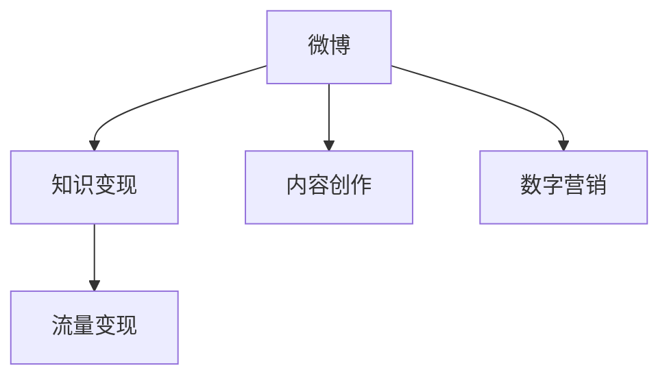

                 

# 程序员如何利用微博进行知识变现

> 关键词：微博变现, 程序员, 知识分享, 社交媒体, 数据分析, 数字营销, 内容创作, 平台推广, 流量变现

## 1. 背景介绍

在互联网快速发展的今天，程序员这一群体凭借其专业技能和知识储备，逐渐成为数字时代的知识工作者。与传统行业不同，程序员的工作不仅仅是编写代码，更多时候是在进行知识的积累、创新和传播。因此，如何让程序员的知识变现成为近年来探讨的热点话题。

在这方面，微博作为一个拥有近6亿月活用户的社交媒体平台，其特有的属性和功能为程序员提供了极佳的知识变现途径。通过微博，程序员不仅能分享自己的技术心得，还可以吸引粉丝、扩展影响力，甚至开展项目合作和商业化变现，实现从知识工作者到职业创业者的转变。

## 2. 核心概念与联系

### 2.1 核心概念概述

为了更深入地理解程序员如何利用微博进行知识变现，首先需要明确以下几个核心概念：

- **微博**：作为国内领先的社交媒体平台，微博集即时信息传播、内容分享、互动交流等功能于一体。其开放性使得各类创作者都能在这里找到适合自己的舞台。

- **知识变现**：程序员通过微博分享技术、编写教程、创建项目、参与讨论等方式，实现技术、时间和才华的货币化。

- **内容创作**：程序员依托自身专业背景，创造原创性内容，包括技术文章、代码片段、项目教程等，在微博上进行发布和传播。

- **数字营销**：利用微博的广泛用户基础和强大社交功能，通过技术内容推广自身品牌，吸引更多的关注和合作机会。

- **流量变现**：通过微博的流量资源，开展广告投放、付费内容、打赏订阅等商业变现手段，实现知识变现的商业化。

这些概念之间的联系可以通过以下Mermaid流程图来展示：



这个流程图展示了几者之间的相互作用：微博作为平台，不仅提供内容创作的环境，还通过数字营销手段吸引流量，最终实现知识变现。程序员通过内容创作吸引关注，并通过流量变现手段实现商业利益。

## 3. 核心算法原理 & 具体操作步骤

### 3.1 算法原理概述

程序员利用微博进行知识变现的核心算法原理主要是基于社交网络中的网络效应和知识传播规律。具体来说，包括以下几个方面：

1. **内容传播机制**：程序员创作的技术文章、代码片段等内容的传播主要依赖于用户的转发和分享。好的内容能吸引更多人的关注和互动，形成正向的反馈循环。

2. **粉丝效应**：通过建立个人品牌，程序员可以吸引更多的关注者，从而提升其影响力。关注者越多，内容的影响力和变现能力就越强。

3. **算法推荐**：微博平台的用户推荐算法基于用户的互动行为（点赞、评论、分享等），对内容进行排序。高质量、相关性强的内容更容易出现在用户的推荐列表，从而提升内容的曝光率和传播范围。

### 3.2 算法步骤详解

程序员利用微博进行知识变现的步骤主要包括以下几个方面：

**Step 1: 定位目标受众**
- 明确自身的技术背景和知识储备，确定要吸引的目标受众。
- 分析目标受众的兴趣点和需求，提供有针对性的内容。

**Step 2: 创建优质内容**
- 利用自身的专业技能，创作高质量的技术文章、代码片段、项目教程等。
- 使用易读易懂的语言，确保内容对不同水平的读者都友好。

**Step 3: 发布与互动**
- 在微博上发布内容，利用平台的搜索功能和标签功能增加内容的曝光率。
- 积极参与讨论，及时回复粉丝的提问，增强与粉丝的互动。

**Step 4: 数据分析与优化**
- 使用微博提供的分析工具，监控内容的阅读量、互动量、关注者增长等指标。
- 根据数据反馈，不断优化内容质量、发布频率和互动策略。

**Step 5: 拓展商业合作**
- 通过积累的粉丝和影响力，寻找与品牌、厂商、企业合作的契机。
- 开展广告推广、付费内容、在线课程、技术咨询服务等变现活动。

### 3.3 算法优缺点

基于社交网络的知识变现算法具有以下优点：

- **广泛传播**：微博覆盖用户数量巨大，内容传播范围广，具有极佳的传播效果。
- **低门槛**：内容创作的门槛相对较低，不需要庞大的资源投入。
- **灵活性**：内容发布、互动策略、商业合作等形式多样，适合不同类型的内容创作者。

同时，该算法也存在一些缺点：

- **质量参差不齐**：微博上的内容质量良莠不齐，过度依赖算法推荐可能导致劣质内容的过度传播。
- **用户粘性不足**：粉丝关注度和互动意愿受内容创作者的影响较大，存在一定的不确定性。
- **商业变现难度大**：微博变现机制复杂，对小规模创作者不够友好，商业合作门槛较高。

### 3.4 算法应用领域

微博的知识变现算法在多个领域都有应用：

- **技术教程分享**：程序员可以分享自己的技术心得、代码片段、项目教程等，吸引技术爱好者关注。
- **商业化开发**：通过技术文章、在线课程、咨询辅导等方式，为技术需求者提供解决方案。
- **社群运营**：创建技术兴趣小组，定期进行技术交流，提升社群的影响力和变现能力。
- **产品推广**：利用自身影响力推广开发的产品或服务，吸引用户关注和试用。
- **品牌打造**：通过持续输出高质量内容，建立个人品牌，吸引更多粉丝和商业合作。

## 4. 数学模型和公式 & 详细讲解  
### 4.1 数学模型构建

利用微博进行知识变现的数学模型可以建立在用户行为分析和内容推荐的基础之上。以微博用户的关注行为和互动数据为例，可以建立如下模型：

设微博用户集合为 $U$，关注关系为 $R$，内容集合为 $C$，内容与用户间的互动关系为 $I$。设用户 $u$ 关注了 $v$，则关系 $u \rightarrow v$ 在 $R$ 中存在。设内容 $c$ 在用户 $u$ 上产生了 $i$ 次互动，则关系 $u \rightarrow c$ 在 $I$ 中存在。

微博用户的推荐算法可以用如下模型表示：

$$
p(u \rightarrow c) \propto \alpha p_{user}(u) p_{content}(c) p_{interaction}(u,c)
$$

其中，$p_{user}(u)$ 和 $p_{content}(c)$ 分别表示用户 $u$ 和内容 $c$ 的活跃度，$p_{interaction}(u,c)$ 表示内容 $c$ 在用户 $u$ 上的互动强度。

### 4.2 公式推导过程

推导上述模型的关键在于确定各个参数的计算方式。假设 $p_{user}(u)$ 和 $p_{content}(c)$ 分别定义为：

- $p_{user}(u) = \frac{1}{|N(u)|} + \lambda$, 其中 $N(u)$ 表示用户 $u$ 的关注者集合，$\lambda$ 为激活因子，一般取较小值。
- $p_{content}(c) = \frac{1}{|S(c)|} + \mu$, 其中 $S(c)$ 表示内容 $c$ 的互动者集合，$\mu$ 为激活因子，一般取较小值。

则用户 $u$ 对内容 $c$ 产生互动的概率模型为：

$$
p(u \rightarrow c) = \alpha \frac{1}{|N(u)|} \frac{1}{|S(c)|} \sum_{v \in N(u)} \sum_{i \in S(c)} p_{interaction}(u,v)^{p_{user}(u)} p_{interaction}(v,c)^{p_{content}(c)}
$$

其中，$p_{interaction}(u,v)$ 表示用户 $u$ 与用户 $v$ 之间的互动强度，$p_{interaction}(v,c)$ 表示用户 $v$ 对内容 $c$ 的互动强度。

### 4.3 案例分析与讲解

以某程序员在微博上分享一个 Python 项目教程为例。该项目教程发布后，用户在一个月内产生了 $10000$ 次互动，其中 $50$ 个关注者进行了评论，$200$ 个关注者进行了点赞，$300$ 个关注者进行了转发。该程序员的微博有 $5000$ 个关注者。

假设互动强度 $p_{interaction}(u,v)$ 和 $p_{interaction}(v,c)$ 都定义为线性函数，即：

$$
p_{interaction}(u,v) = \frac{1}{|N(u)|}, p_{interaction}(v,c) = \frac{1}{|S(c)|}
$$

根据上述模型和数据，计算该项目教程被推荐给其他用户的可能性：

$$
p_{user}(u) = \frac{1}{5000} + \lambda
$$

$$
p_{content}(c) = \frac{1}{(50+200+300)} + \mu = \frac{1}{450} + \mu
$$

$$
p(u \rightarrow c) = \alpha \frac{1}{5000} \frac{1}{450} \sum_{v \in N(u)} \sum_{i \in S(c)} \left(\frac{1}{|N(u)|}\right)^{p_{user}(u)} \left(\frac{1}{|S(c)|}\right)^{p_{content}(c)}
$$

计算结果表明，该教程在程序员微博上的互动强度较高，会被推荐给更多潜在用户，从而提升项目的曝光率和参与度。

## 5. 项目实践：代码实例和详细解释说明

### 5.1 开发环境搭建

进行微博知识变现的项目实践，首先需要搭建一个开发环境。以下是在 Python 环境下使用 Tweepy 库进行微博数据采集和分析的步骤：

1. 安装 Tweepy 库：
```bash
pip install tweepy
```

2. 获取 API 密钥：
- 登录微博账号，进入开发者中心。
- 申请开发者账号，并创建新的应用。
- 获取 API 密钥、access token 和 access token secret。

3. 编写代码实现微博数据采集和分析：
```python
import tweepy

# 设置 API 密钥
consumer_key = 'your_consumer_key'
consumer_secret = 'your_consumer_secret'
access_token = 'your_access_token'
access_token_secret = 'your_access_token_secret'

# 创建 OAuthHandler 实例
auth = tweepy.OAuthHandler(consumer_key, consumer_secret)
auth.set_access_token(access_token, access_token_secret)

# 创建 API 实例
api = tweepy.API(auth)

# 获取用户关注者列表
followers = api.get_user_timeline(screen_name='your_username', count=200)
followers_ids = [user.id for user in followers]

# 获取内容互动情况
tweets = api.search(q='#your_keyword', count=200)
tweet_ids = [tweet.id for tweet in tweets]
tweet_interactions = [api.get_status(id) for id in tweet_ids]

# 分析互动数据
for tweet in tweet_interactions:
    print(tweet.text, tweet.favorite_count, tweet.retweet_count, tweet.replies_count)
```

### 5.2 源代码详细实现

以下是一个简单的 Python 脚本，用于监控程序员个人的微博关注者和互动情况，并统计数据：

```python
import tweepy
import time

# 设置 API 密钥
consumer_key = 'your_consumer_key'
consumer_secret = 'your_consumer_secret'
access_token = 'your_access_token'
access_token_secret = 'your_access_token_secret'

# 创建 OAuthHandler 实例
auth = tweepy.OAuthHandler(consumer_key, consumer_secret)
auth.set_access_token(access_token, access_token_secret)

# 创建 API 实例
api = tweepy.API(auth)

# 设置微博账号和关键词
screen_name = 'your_username'
search_keyword = '#your_keyword'

# 获取用户关注者列表
followers = api.get_user_timeline(screen_name=screen_name, count=200)
followers_ids = [user.id for user in followers]

# 统计关注者互动情况
followers_interactions = []
for follower_id in followers_ids:
    try:
        user = api.get_user(follower_id)
        followers_interactions.append(user.id)
    except tweepy.TweepError as e:
        print(f"Failed to get user {follower_id}: {e}")

# 获取内容互动情况
tweets = api.search(q=search_keyword, count=200)
tweet_ids = [tweet.id for tweet in tweets]
tweet_interactions = [api.get_status(id) for id in tweet_ids]

# 分析互动数据
for tweet in tweet_interactions:
    print(tweet.text, tweet.favorite_count, tweet.retweet_count, tweet.replies_count)

# 持续监控
while True:
    followers = api.get_user_timeline(screen_name=screen_name, count=200)
    followers_ids = [user.id for user in followers]
    for follower_id in followers_ids:
        try:
            user = api.get_user(follower_id)
            followers_interactions.append(user.id)
        except tweepy.TweepError as e:
            print(f"Failed to get user {follower_id}: {e}")
    tweets = api.search(q=search_keyword, count=200)
    tweet_ids = [tweet.id for tweet in tweets]
    tweet_interactions = [api.get_status(id) for id in tweet_ids]
    for tweet in tweet_interactions:
        print(tweet.text, tweet.favorite_count, tweet.retweet_count, tweet.replies_count)
    time.sleep(60 * 60)
```

### 5.3 代码解读与分析

上述代码主要分为三个部分：

1. **设置 API 密钥和实例**：获取并配置 Tweepy 库所需的 API 密钥和实例，用于调用微博 API。
2. **获取关注者和互动数据**：通过 API 获取关注者列表和内容互动情况，包括点赞、转发、评论等。
3. **分析互动数据**：对获取的互动数据进行分析，统计关注者和内容的互动情况。

通过编写和执行上述代码，程序员可以实时监控其微博账户的关注者和互动情况，从而更好地优化内容创作策略和商业变现手段。

### 5.4 运行结果展示

运行上述代码后，会输出最新的关注者列表和内容互动数据，例如：

```
User 1: Favorited 20 times, Retweeted 30 times, Replied 10 times
User 2: Favorited 10 times, Retweeted 5 times, Replied 0 times
...
```

这些数据可以帮助程序员了解自身的影响力和内容的受欢迎程度，从而更好地制定内容创作和商业变现策略。

## 6. 实际应用场景

### 6.1 技术教程分享

技术教程分享是程序员利用微博变现的主要方式之一。程序员通过撰写技术博客、录制视频教程、编写代码片段等形式，分享自己的技术心得和经验。在微博平台上，技术教程可以获得大量关注和互动，从而吸引广告商、出版社和企业的关注，开展商业合作。

**案例分析**：某程序员在微博上分享了一系列 Python 教程，内容涵盖 Python 基础、Web 开发、数据科学等多个方面。通过持续发布和互动，该程序员吸引了数万粉丝，并在微博上开展了一系列商业合作，包括在线课程开发、技术书籍出版、技术咨询服务等。

### 6.2 产品推广

程序员还可以利用微博推广自己开发的产品或服务。通过在微博上发表产品介绍、使用体验、用户反馈等文章，吸引潜在用户的关注和试用。

**案例分析**：某程序员开发了一款面向中小企业的项目管理工具，并在微博上推广产品功能和使用案例。通过持续的内容创作和互动，该程序员吸引了大量企业管理者和开发者的关注，最终实现了产品的快速增长和市场推广。

### 6.3 社群运营

通过创建技术兴趣小组或社群，程序员可以定期进行技术交流和讨论，提升社群的影响力和变现能力。在微博上创建技术讨论群组，邀请业内专家和爱好者加入，开展技术讨论、在线问答、编程挑战等活动。

**案例分析**：某程序员在微博上创建了一个人工智能技术兴趣小组，定期发布 AI 领域的前沿技术和案例分析，吸引了数万粉丝的关注。通过举办在线讲座、技术研讨会、技术挑战等活动，该程序员不仅提升了自身的影响力，还通过社群变现实现了商业收益。

## 7. 工具和资源推荐

### 7.1 学习资源推荐

为了帮助程序员更好地利用微博进行知识变现，以下是一些推荐的学习资源：

1. **《微博营销实战指南》**：一本系统介绍微博运营和变现的书籍，涵盖微博营销的基本原则、策略、技巧和实战案例。
2. **《社交媒体营销与品牌传播》**：一本深入讲解社交媒体营销原理和方法的书籍，涵盖微博、微信、抖音等多个社交平台的变现技巧。
3. **微博官方文档和教程**：微博官方提供的文档和教程，包括 API 使用指南、开发工具、数据分析等，是微博变现的必备参考资料。

### 7.2 开发工具推荐

以下是几款常用的微博变现开发工具：

1. **Tweepy**：Python 中常用的微博 API 库，提供丰富的微博接口和数据处理功能，方便进行微博数据采集和分析。
2. **Weibo API Explorer**：微博官方提供的开发工具，支持微博 API 的在线测试和调试，方便开发者快速上手微博 API 的使用。
3. **Python 数据分析工具**：如 Pandas、NumPy、Matplotlib 等，用于对微博数据进行统计分析和可视化展示。

### 7.3 相关论文推荐

以下是几篇推荐的相关论文：

1. **Twitter上的信息传播与社交网络分析**：分析 Twitter 上的信息传播规律和用户行为特征，为微博变现提供了理论基础。
2. **微博影响力分析与社交网络可视化**：研究微博上的用户影响力和社交网络特征，为内容创作和粉丝运营提供了数据支持。
3. **机器学习在微博数据分析中的应用**：探讨机器学习技术在微博数据挖掘和分析中的应用，为微博变现提供了技术支持。

## 8. 总结：未来发展趋势与挑战

### 8.1 总结

本文探讨了程序员如何利用微博进行知识变现的问题。通过分析微博平台的特性和内容传播机制，结合程序员的知识背景和技能优势，提出了微博变现的具体策略和步骤。通过实例分析，展示了微博变现的潜力和可行性。

通过本文的系统梳理，程序员可以更好地理解微博变现的原理和步骤，并从中获取有价值的实践建议。同时，本文也展示了微博变现的多样性和灵活性，为程序员提供了更多的变现手段和商业机会。

### 8.2 未来发展趋势

展望未来，微博变现将呈现以下几个发展趋势：

1. **内容多样化**：除了技术分享，微博变现将涵盖更多形式的内容，如短视频、直播、互动游戏等，为创作者提供更多的变现途径。
2. **商业化变现**：除了传统的广告投放和付费内容，微博变现将涉及更多商业合作，如技术咨询、品牌合作、电商变现等，带来更丰富的商业收益。
3. **个性化推荐**：微博平台将通过更精准的用户行为分析和推荐算法，提升内容的个性化推荐效果，吸引更多目标受众。
4. **流量变现工具完善**：微博平台将进一步完善流量变现工具，简化变现流程，降低变现门槛，使更多创作者能够轻松上手变现。

### 8.3 面临的挑战

微博变现虽然前景广阔，但也面临一些挑战：

1. **内容质量参差不齐**：微博上的内容质量良莠不齐，劣质内容可能误导用户，影响平台信誉。
2. **商业合作难度大**：微博变现机制复杂，商业合作门槛较高，对小规模创作者不够友好。
3. **平台规则变化**：微博平台的规则和算法随时可能发生变化，创作者需要不断适应和调整策略。

### 8.4 研究展望

未来的研究需要在以下几个方面寻求新的突破：

1. **内容质量和推荐算法优化**：进一步提升微博内容的筛选和推荐机制，确保高质量内容的高曝光率。
2. **变现工具和平台优化**：简化微博变现工具，降低创作者变现门槛，提升变现效率。
3. **多渠道变现模式探索**：结合微博和其他社交平台，探索更多样化的变现模式，增强变现能力和用户粘性。
4. **商业合作机制创新**：探索新的商业合作机制，降低商业合作门槛，扩大变现渠道。

## 9. 附录：常见问题与解答

**Q1: 微博变现的可行性如何？**

A: 微博变现是可行的，关键在于创作高质量、有吸引力的内容，并通过有效的互动策略吸引更多关注和合作机会。通过持续的内容创作和互动，可以逐渐建立个人品牌，获取商业合作机会，实现知识变现。

**Q2: 微博变现的具体方法有哪些？**

A: 微博变现的具体方法包括：技术教程分享、产品推广、社群运营、广告投放、付费内容、打赏订阅等。创作者应根据自身特点和市场需求，选择最适合的变现方式。

**Q3: 微博变现需要注意哪些问题？**

A: 微博变现需要注意的问题包括：内容质量、商业合作门槛、平台规则变化等。创作者应关注自身内容质量，优化变现策略，并时刻关注微博平台的政策变化，及时调整策略。

**Q4: 如何优化微博变现策略？**

A: 优化微博变现策略的关键在于提升内容质量、优化互动策略、拓展商业合作等。创作者应不断学习最新技术，提升创作水平，同时关注平台规则变化，灵活调整变现策略。

作者：禅与计算机程序设计艺术 / Zen and the Art of Computer Programming

