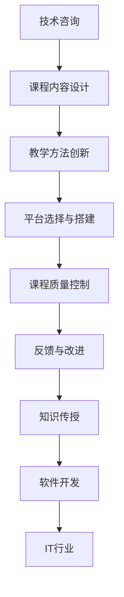

                 

# 程序员如何将技术咨询转化为在线课程

> 关键词：在线课程,技术咨询,知识传授,软件开发,课程设计,教学方法,技术博客,IT行业

## 1. 背景介绍

### 1.1 问题由来
在快速发展的IT行业中，技术咨询和技术培训需求日益增多。无论是企业的技术开发，还是个人的职业发展，技术的持续学习和进阶都变得越来越重要。因此，如何高效地将技术知识传递给学习者，成为广大程序员和IT从业者面临的共同问题。

在线课程作为新兴的教学形式，凭借其灵活性、互动性和覆盖面广等优点，迅速成为技术传授的重要手段。通过线上平台，技术人员可以将自己的实践经验和知识体系系统化、结构化地展示出来，让更多人有机会接触到前沿的技术和应用。

### 1.2 问题核心关键点
技术咨询转化为在线课程的核心关键点主要包括以下几个方面：
1. 课程内容设计：课程应围绕具体技术点展开，既有深度也有广度。
2. 教学方法创新：结合互动讨论、实战练习等多种教学手段，提升课程参与度。
3. 平台选择与搭建：选择适合的在线平台，搭建和运营课程。
4. 课程质量控制：确保课程内容准确无误，贴近实际应用。
5. 反馈与改进：收集学生反馈，持续改进课程内容和教学方法。

### 1.3 问题研究意义
将技术咨询转化为在线课程，不仅能够提升个人的影响力，还能促进技术的传播和应用，推动IT行业的整体进步。具体而言：

1. **知识分享**：将技术知识分享给更广泛的受众，帮助他们解决实际问题，提升自身能力。
2. **职业发展**：通过在线课程，培养更多的技术人才，为自己和他人提供职业发展的机会。
3. **行业促进**：推动技术在各个行业的广泛应用，促进行业创新和竞争力提升。
4. **市场竞争**：在线课程使技术人才更具市场竞争力，带来新的就业和发展机会。

## 2. 核心概念与联系

### 2.1 核心概念概述

为了更好地理解如何将技术咨询转化为在线课程，我们首先需要介绍几个核心概念：

- **技术咨询**：指技术人员向客户或学生提供的专门技术指导，包括问题诊断、方案设计、技术培训等。
- **在线课程**：通过网络平台提供的一种教学形式，包括视频讲解、互动练习、课程论坛等。
- **知识传授**：将专业知识系统化、结构化地传达给学习者，帮助他们掌握技术原理和应用方法。
- **软件开发**：一种系统化、模块化的技术工作，旨在开发满足用户需求的软件产品。
- **课程设计**：基于特定教学目标，系统规划课程内容和教学方法的过程。
- **教学方法**：教师在授课过程中采用的方法和技巧，如讲解、演示、实验等。
- **技术博客**：技术人员分享技术见解和实践经验的平台，常以文章形式发布。
- **IT行业**：涉及计算机硬件、软件、网络、通信等多个领域的综合行业，覆盖广泛的应用场景。

这些核心概念构成了将技术咨询转化为在线课程的基础框架，帮助我们从多个维度深入理解这一过程。

### 2.2 核心概念原理和架构的 Mermaid 流程图



该流程图展示了技术咨询转化为在线课程的主要流程，包括内容设计、方法创新、平台选择、质量控制、反馈改进等多个环节。每一个环节都密切相关，缺一不可。

## 3. 核心算法原理 & 具体操作步骤

### 3.1 算法原理概述

将技术咨询转化为在线课程，本质上是一个知识传播和内容设计的过程。其核心思想是通过在线平台，将技术咨询过程中积累的深度见解、实战经验、问题解决方案等，系统化地整理和呈现给学习者。

形式化地，假设技术咨询内容为 $C$，在线课程为 $O$，目标是将 $C$ 转化为 $O$，其基本流程如下：

1. **内容整理**：将技术咨询中的关键知识点、实战案例、常见问题等整理成系统的课程结构。
2. **内容组织**：根据课程目标和受众需求，选择合适的章节、小节和知识点，编排课程内容。
3. **平台搭建**：选择合适的在线平台，并搭建课程框架。
4. **内容呈现**：使用视频、文字、代码示例等形式，生动地展示课程内容。
5. **互动设计**：设计课程互动环节，如提问、讨论、实战练习等，提升课程参与度。
6. **质量控制**：通过多次审查和迭代，确保课程内容的准确性和实用性。
7. **反馈收集**：收集学生的学习反馈，持续改进课程内容和教学方法。

### 3.2 算法步骤详解

以下是将技术咨询转化为在线课程的具体步骤：

**Step 1: 确定课程目标和受众**
- 明确课程的核心目标，如掌握某种技术、解决特定问题、提升技能等。
- 了解目标受众的背景、水平和需求，制定相应的教学内容和方法。

**Step 2: 设计课程结构**
- 设计课程的整体结构，包括章节、小节、知识点等。
- 确定每个章节和知识点的主题，确保内容之间的逻辑性和连贯性。

**Step 3: 准备教学材料**
- 收集和整理课程所需的所有材料，如视频、代码、PPT、文档等。
- 确保所有材料准确无误，符合实际应用需求。

**Step 4: 平台选择与搭建**
- 选择适合的在线平台，如Coursera、Udemy、Bilibili等。
- 搭建课程框架，上传教学材料。

**Step 5: 内容呈现**
- 使用视频讲解、代码示例、图文并茂的方式，生动地呈现课程内容。
- 设计互动环节，如实时问答、讨论、实战练习等，提升课程参与度。

**Step 6: 质量控制**
- 多次审查课程内容，确保其准确性和实用性。
- 邀请同行评审课程，提供改进建议。

**Step 7: 反馈与改进**
- 收集学生的学习反馈，分析存在的问题。
- 根据反馈持续改进课程内容和教学方法。

### 3.3 算法优缺点

将技术咨询转化为在线课程有以下几个优点：
1. **广泛传播**：通过在线平台，课程内容能够覆盖更广泛的受众，打破地域限制。
2. **灵活性高**：学习者可以自主安排学习时间和节奏，随时观看课程内容。
3. **互动性强**：通过互动环节，增强学习者的参与感和兴趣。
4. **可扩展性强**：课程内容可以根据受众反馈进行调整和更新，保持其时效性和实用性。

同时，该方法也存在一些局限性：
1. **制作成本高**：课程制作需要大量时间和精力，尤其是视频和互动环节。
2. **质量控制难**：课程内容需要多次审查和迭代，确保其准确性和实用性。
3. **效果依赖平台**：在线平台的用户体验和功能会影响课程的传播效果。
4. **反馈收集难**：学习者的反馈需要系统化收集和分析，才能有效改进课程内容。

### 3.4 算法应用领域

将技术咨询转化为在线课程的方法，已经在软件开发、数据分析、人工智能等多个领域得到了广泛应用。具体应用场景包括：

- **软件开发培训**：通过在线课程，传授编程语言、框架、工具等技术知识，提升开发能力。
- **数据科学教学**：讲解数据清洗、分析、可视化等技术，帮助学习者掌握数据处理和分析技能。
- **人工智能教育**：介绍机器学习、深度学习、自然语言处理等技术，培养AI领域的专业人才。
- **技术博客和教程**：通过技术博客和教程，分享技术见解和实践经验，提升个人影响力和技术水平。

除了上述这些经典应用外，将技术咨询转化为在线课程的方法还在教育、培训、咨询等多个领域被广泛应用，推动了技术知识的传播和应用。

## 4. 数学模型和公式 & 详细讲解 & 举例说明

### 4.1 数学模型构建

假设技术咨询内容为 $C$，在线课程为 $O$。我们将通过数学模型来描述将 $C$ 转化为 $O$ 的过程。

1. **内容整理**：将技术咨询中的关键知识点、实战案例、常见问题等整理成系统的课程结构。
2. **内容组织**：根据课程目标和受众需求，选择合适的章节、小节和知识点，编排课程内容。
3. **平台搭建**：选择合适的在线平台，并搭建课程框架。
4. **内容呈现**：使用视频、文字、代码示例等形式，生动地展示课程内容。
5. **互动设计**：设计课程互动环节，如提问、讨论、实战练习等，提升课程参与度。
6. **质量控制**：通过多次审查和迭代，确保课程内容的准确性和实用性。
7. **反馈收集**：收集学生的学习反馈，持续改进课程内容和教学方法。

### 4.2 公式推导过程

以下我们以软件开发培训为例，推导视频讲解的数学模型：

假设视频讲解内容为 $V$，视频时长为 $t$。视频讲解的数学模型可以表示为：

$$
V = \frac{C}{t}
$$

其中 $C$ 为技术咨询内容，$t$ 为视频时长。公式含义为，视频讲解的丰富度和深度与技术咨询内容成正比，与视频时长成反比。

### 4.3 案例分析与讲解

以《Python基础与进阶》课程为例，讲解如何将技术咨询转化为在线课程：

1. **确定课程目标和受众**：目标受众为有一定编程基础的初学者和进阶者。课程目标为掌握Python基础语法、常用库、高级特性等。

2. **设计课程结构**：课程分为基础篇和进阶篇，每篇包含多个章节，每章包含多个小节和知识点。

3. **准备教学材料**：收集Python官方文档、第三方库文档、实战项目代码等，制作课程视频和PPT。

4. **平台选择与搭建**：选择Udemy平台，搭建课程框架，上传教学材料。

5. **内容呈现**：通过视频讲解Python基础语法、常用库、高级特性等，演示实战项目，互动问答，提升学习者兴趣和参与度。

6. **质量控制**：多次审查视频内容，邀请同行评审，确保课程内容的准确性和实用性。

7. **反馈与改进**：收集学生的学习反馈，根据反馈持续改进课程内容和教学方法。

## 5. 项目实践：代码实例和详细解释说明

### 5.1 开发环境搭建

在进行在线课程开发前，我们需要准备好开发环境。以下是使用Python进行在线课程开发的环境配置流程：

1. 安装Python：从官网下载并安装Python，选择适合的版本。
2. 安装Python的第三方库：如Flask、Jinja2、TensorFlow等，用于开发在线课程。
3. 安装代码编辑器：如PyCharm、VSCode、Sublime Text等，用于编写代码。
4. 安装服务器：如Nginx、Apache等，用于部署在线课程。

完成上述步骤后，即可在本地搭建开发环境，开始在线课程的开发和测试。

### 5.2 源代码详细实现

这里我们以《Python基础与进阶》课程为例，给出使用Python Flask框架开发在线课程的代码实现。

首先，安装Flask框架：

```bash
pip install flask
```

然后，编写Flask应用：

```python
from flask import Flask, render_template, request

app = Flask(__name__)

@app.route('/')
def index():
    return render_template('index.html')

@app.route('/video/<video_id>')
def video(video_id):
    # 根据视频ID从数据库中加载视频内容
    video_content = load_video(video_id)
    return render_template('video.html', video_content=video_content)

@app.route('/question/<question_id>')
def question(question_id):
    # 根据问题ID从数据库中加载问题内容
    question_content = load_question(question_id)
    return render_template('question.html', question_content=question_content)

if __name__ == '__main__':
    app.run(debug=True)
```

接着，创建课程页面模板：

```html
<!-- index.html -->
<html>
<head>
    <title>Python基础与进阶</title>
</head>
<body>
    <h1>欢迎来到Python基础与进阶课程</h1>
    <ul>
        
            <li><a href="{{ chapter.url }}">[{{ chapter.title }}]</a></li>
        
    </ul>
</body>
</html>
```

创建视频页面模板：

```html
<!-- video.html -->
<html>
<head>
    <title>Python基础与进阶</title>
</head>
<body>
    <h1>Python基础与进阶</h1>
    <h2>视频内容</h2>
    <p>{{ video_content }}</p>
    <h2>相关问题</h2>
    <ul>
        
            <li><a href="{{ question.url }}">[{{ question.title }}]</a></li>
        
    </ul>
</body>
</html>
```

创建问题页面模板：

```html
<!-- question.html -->
<html>
<head>
    <title>Python基础与进阶</title>
</head>
<body>
    <h1>Python基础与进阶</h1>
    <h2>问题内容</h2>
    <p>{{ question_content }}</p>
    <h2>相关视频</h2>
    <ul>
        
            <li><a href="{{ video.url }}">[{{ video.title }}]</a></li>
        
    </ul>
</body>
</html>
```

最后，启动Flask应用：

```bash
python app.py
```

在浏览器中访问`http://localhost:5000`，即可看到课程页面。点击课程章节链接，即可跳转到对应视频页面或问题页面。

### 5.3 代码解读与分析

这里我们以Flask应用为例，解读代码的实现细节：

**index.html**：
- 通过Flask的模板引擎Jinja2，渲染课程页面，展示课程章节链接。

**video.html**：
- 从数据库中加载视频内容，渲染视频页面，展示视频内容，并提供相关问题链接。

**question.html**：
- 从数据库中加载问题内容，渲染问题页面，展示问题内容，并提供相关视频链接。

**app.py**：
- 定义Flask应用，处理路由请求，渲染相应页面。

这些代码实现展示了如何使用Flask框架搭建在线课程平台，通过视频和问题交互，提升学习者的参与度。开发者可以根据具体需求，进一步定制和优化课程页面，增加更多互动功能和展示效果。

## 6. 实际应用场景

### 6.1 软件开发培训

在线课程在软件开发培训中的应用，可以帮助学习者系统掌握编程语言、框架、工具等技术知识，提升编程能力。例如，通过《Python基础与进阶》课程，学习者可以逐步掌握Python的基本语法、常用库、高级特性等，并通过实战项目进行巩固和应用。

### 6.2 数据科学教学

数据科学涉及大量数据分析和处理任务，在线课程可以帮助学习者掌握数据清洗、分析、可视化等技术。例如，通过《数据分析与机器学习》课程，学习者可以学习Python、R等数据科学工具，掌握数据预处理、建模、评估等技能。

### 6.3 人工智能教育

人工智能技术复杂度高，涉及机器学习、深度学习、自然语言处理等多个领域。在线课程可以提供系统的AI教育，培养AI领域的专业人才。例如，通过《深度学习与TensorFlow》课程，学习者可以掌握深度学习的基本原理和TensorFlow框架的使用，进行图像识别、自然语言处理等任务。

### 6.4 未来应用展望

随着在线课程的不断发展和完善，其应用场景将进一步扩大，涵盖更多行业和领域。例如，在医疗健康、金融科技、智慧城市等垂直领域，在线课程将提供定制化的技术教育和培训，推动相关行业的技术进步和创新。

## 7. 工具和资源推荐

### 7.1 学习资源推荐

为了帮助开发者系统掌握在线课程的开发和运营，这里推荐一些优质的学习资源：

1. **Udemy**：在线课程平台，提供丰富多样的技术课程，涵盖软件开发、数据分析、人工智能等多个领域。
2. **Coursera**：由斯坦福大学、MIT等知名大学开设的在线课程平台，提供系统化的技术教育和培训。
3. **edX**：与全球顶尖大学合作，提供高质量的在线课程，涵盖多种技术领域。
4. **Flask官方文档**：Flask框架的官方文档，提供了详细的开发指南和代码示例。
5. **GitHub**：全球最大的代码托管平台，提供了大量的开源课程和项目，可以参考和学习。

通过对这些资源的学习实践，相信你一定能够快速掌握在线课程的开发技巧，为技术咨询向在线课程转化提供坚实的技术基础。

### 7.2 开发工具推荐

高效的开发离不开优秀的工具支持。以下是几款用于在线课程开发的常用工具：

1. **Python Flask**：轻量级的Web框架，适合快速搭建在线课程平台。
2. **TensorFlow**：强大的深度学习框架，可以用于视频讲解和互动设计。
3. **Jinja2**：Python的模板引擎，用于渲染HTML页面。
4. **Git**：版本控制系统，用于代码管理和团队协作。
5. **Google Colab**：谷歌提供的在线Jupyter Notebook环境，免费提供GPU/TPU算力，适合实验和学习。

合理利用这些工具，可以显著提升在线课程的开发效率，加速技术知识的传播和应用。

### 7.3 相关论文推荐

在线课程的开发和运营涉及多个学科的交叉，以下是几篇奠基性的相关论文，推荐阅读：

1. **"Online Learning and the Education Technology Industry"**：探讨在线学习的发展趋势和应用场景，提供丰富的案例分析。
2. **"Flask Web Development"**：Flask框架的官方文档，详细介绍了Web应用开发的技术细节和最佳实践。
3. **"Coursera: A Massive Open Online Course (MOOC) Platform"**：Coursera平台的介绍和研究，提供了在线课程运营的丰富经验。
4. **"Learning Analytics for MOOCs: Data Mining, Visualization, and Interpretation"**：探讨在线课程数据分析和可视化技术，提供丰富的技术支持。

这些论文代表了大规模在线课程开发和运营的研究脉络，通过学习这些前沿成果，可以帮助研究者把握学科前进方向，激发更多的创新灵感。

## 8. 总结：未来发展趋势与挑战

### 8.1 总结

本文对将技术咨询转化为在线课程的方法进行了全面系统的介绍。首先阐述了在线课程的重要性和应用场景，明确了将技术咨询转化为在线课程的目标和方法。其次，从原理到实践，详细讲解了在线课程开发和运营的数学模型和具体操作步骤，给出了在线课程开发和实践的完整代码实例。同时，本文还广泛探讨了在线课程在多个行业领域的应用前景，展示了在线课程的巨大潜力。此外，本文精选了在线课程开发的各类学习资源，力求为读者提供全方位的技术指引。

通过本文的系统梳理，可以看到，将技术咨询转化为在线课程，不仅能够提升个人的影响力，还能促进技术的传播和应用，推动IT行业的整体进步。未来，伴随在线课程的不断发展和完善，其应用场景将进一步扩大，涵盖更多行业和领域。

### 8.2 未来发展趋势

展望未来，在线课程将呈现以下几个发展趋势：

1. **内容多样化**：在线课程将涵盖更多领域和主题，提供丰富的技术知识和实战经验。
2. **交互性增强**：通过增加互动环节，提升学习者的参与度和兴趣。
3. **数据驱动**：利用数据分析技术，优化课程内容和教学方法，提升学习效果。
4. **个性化推荐**：通过推荐算法，推荐最适合学习者的课程内容，提高学习效率。
5. **虚拟现实(VR)和增强现实(AR)**：结合VR和AR技术，提供沉浸式学习体验，提升学习效果。
6. **社区化学习**：通过社区化平台，促进学习者之间的交流和协作，提升学习效果。

这些趋势将进一步提升在线课程的教育质量和用户体验，推动在线课程的发展和普及。

### 8.3 面临的挑战

尽管在线课程在技术咨询转化中展现了巨大的潜力，但在实际应用过程中，仍面临诸多挑战：

1. **制作成本高**：课程制作需要大量时间和精力，尤其是在视频和互动环节。
2. **质量控制难**：课程内容需要多次审查和迭代，确保其准确性和实用性。
3. **平台依赖强**：在线课程的传播效果依赖于平台的稳定性和用户体验。
4. **反馈收集难**：学习者的反馈需要系统化收集和分析，才能有效改进课程内容。
5. **用户粘性低**：学习者容易流失，如何保持其持续学习兴趣是关键。

### 8.4 研究展望

面对在线课程面临的挑战，未来的研究需要在以下几个方面寻求新的突破：

1. **课程内容优化**：开发更多高质量、实用性强、内容多样的在线课程。
2. **互动设计改进**：设计更灵活、互动性更强的教学环节，提升学习效果。
3. **平台技术升级**：提升在线平台的技术性能和用户体验，确保课程的传播效果。
4. **反馈机制完善**：建立系统化的反馈机制，持续改进课程内容和教学方法。
5. **社区化建设**：构建社区化学习平台，促进学习者之间的交流和协作。

这些研究方向将引领在线课程的发展方向，推动技术知识的传播和应用，为IT行业带来更广泛的影响。

## 9. 附录：常见问题与解答

**Q1：如何将技术咨询转化为在线课程？**

A: 技术咨询转化为在线课程需要以下步骤：
1. 确定课程目标和受众。
2. 设计课程结构。
3. 准备教学材料。
4. 平台选择与搭建。
5. 内容呈现。
6. 质量控制。
7. 反馈与改进。

**Q2：如何提高在线课程的互动性？**

A: 提高在线课程的互动性可以通过以下方法：
1. 设计实时问答环节。
2. 提供视频和文章的互动评论。
3. 组织线上讨论和小组作业。
4. 引入虚拟现实和增强现实技术。
5. 通过游戏化设计提升学习兴趣。

**Q3：如何优化在线课程的内容结构？**

A: 优化在线课程的内容结构需要以下步骤：
1. 确定课程核心知识点。
2. 设计合理的章节和小节。
3. 组织知识点之间的逻辑关系。
4. 增加实战案例和实战练习。
5. 提供扩展阅读和资料链接。

**Q4：如何确保在线课程的质量？**

A: 确保在线课程的质量需要以下步骤：
1. 多次审查课程内容，邀请同行评审。
2. 收集学习者的反馈，进行持续改进。
3. 利用数据分析技术，优化课程内容和教学方法。
4. 建立社区化平台，促进学习者之间的交流和协作。

**Q5：如何选择适合的在线平台？**

A: 选择适合的在线平台需要考虑以下因素：
1. 平台的用户体验和功能。
2. 平台的稳定性和技术性能。
3. 平台的使用成本和收费模式。
4. 平台的受众群体和推广渠道。
5. 平台的社区化和学习氛围。

这些问题的解答将帮助开发者更好地理解和应用技术咨询转化为在线课程的方法，为技术传播和知识共享提供坚实的基础。

---

作者：禅与计算机程序设计艺术 / Zen and the Art of Computer Programming

