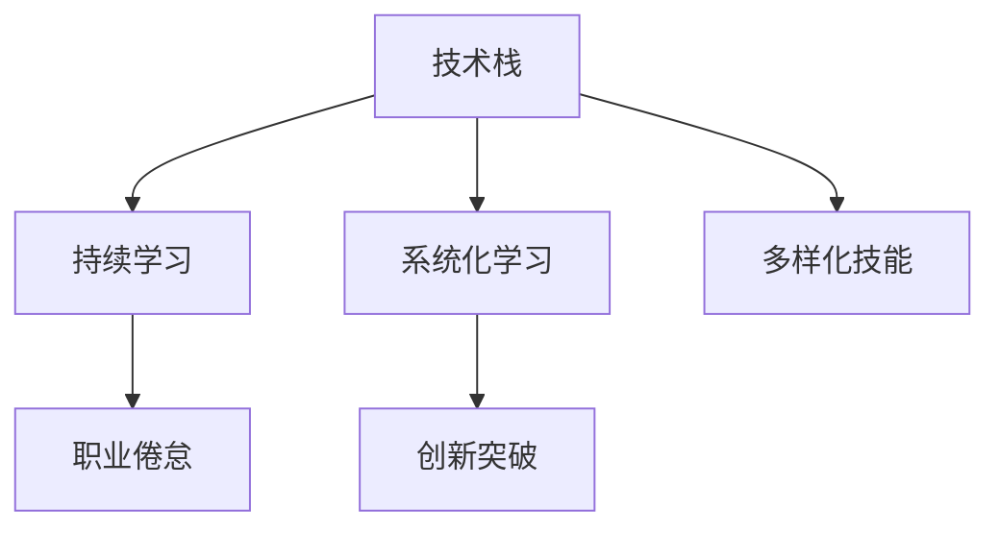

                 

# 程序员如何应对职业瓶颈

## 1. 背景介绍

在快速发展的技术环境中，程序员职业的发展面临着诸多挑战和瓶颈。无论是技术栈的更新换代，还是行业需求的不断变化，都在考验着每一位程序员的职业适应能力和持续学习精神。本文旨在探讨程序员如何通过系统化的学习和实践，突破职业瓶颈，实现技术突破和个人成长。

### 1.1 问题由来
在当今技术日新月异的时代，程序员需要不断地更新知识体系，掌握新的技术栈和编程范式。然而，知识更新的速度和频率常常超出了许多程序员的适应能力，导致他们在职业生涯中遇到了以下常见问题：

- **技术栈陈旧**：随着新技术和新工具的不断涌现，许多老旧技术栈逐渐被淘汰，但掌握新技术的门槛又较高。
- **技能单一**：许多程序员仅限于一种编程语言或技术栈，难以跨领域应用，限制了职业发展。
- **知识碎片化**：互联网上的知识资源繁多，但缺乏系统性和连贯性，导致知识积累难以形成体系。
- **职业倦怠**：长期从事单一任务或单调乏味的工作，容易产生职业倦怠，影响工作效率和创新动力。

### 1.2 问题核心关键点
要应对这些职业瓶颈，程序员需要从多个方面进行自我提升和突破，包括但不限于：

- **持续学习**：保持学习的热情和习惯，掌握新技术、新框架和新工具。
- **多样化技能**：学习和掌握多种编程语言和技术栈，拓展职业发展空间。
- **系统化学习**：构建系统化的知识体系，避免知识的碎片化和零散化。
- **保持创新**：积极探索新的技术领域，解决实际问题，实现技术突破。

本文将通过介绍核心概念与联系、核心算法原理、项目实践、实际应用场景、工具和资源推荐、总结与展望等几个方面，全面探讨程序员如何应对职业瓶颈，实现技术突破。

## 2. 核心概念与联系

### 2.1 核心概念概述

为更好地理解程序员如何应对职业瓶颈，本节将介绍几个密切相关的核心概念：

- **技术栈**：编程语言、框架、工具等组成的编程环境，是程序员进行软件开发的基础。
- **持续学习**：程序员需要不断学习新知识、新技术，保持技术水平与时俱进。
- **系统化学习**：通过构建系统化的知识体系，避免知识碎片化，提升学习效率。
- **多样化技能**：掌握多种编程语言和技术栈，拓展职业发展空间。
- **职业倦怠**：长时间从事单一任务或单调工作，导致的工作疲劳和职业倦怠。
- **创新突破**：通过探索新的技术领域，解决实际问题，实现技术突破。

这些核心概念之间的逻辑关系可以通过以下Mermaid流程图来展示：



这个流程图展示了一名程序员职业成长的全过程：从掌握技术栈到持续学习，再到系统化学习和多样化技能，最终实现职业倦怠的克服和创新突破。

## 3. 核心算法原理 & 具体操作步骤

### 3.1 算法原理概述

本节将从算法原理的角度，探讨程序员如何通过系统化学习和多样化技能提升应对职业瓶颈的能力。

**算法原理**：
- **技术栈的升级与更新**：选择合适的技术栈，保持对其的学习和更新，确保其符合行业需求和趋势。
- **持续学习的机制**：建立持续学习的机制，包括定期阅读技术博客、参加技术研讨会、参与开源项目等。
- **系统化学习的结构**：构建系统化的学习结构，如通过设计学习路径、划分学习阶段、设置学习目标等，确保学习的系统性和连贯性。
- **多样化技能的布局**：掌握多种编程语言和技术栈，拓展职业发展的宽度和深度。
- **创新突破的驱动**：通过探索新领域、解决实际问题，实现技术突破，驱动职业成长。

### 3.2 算法步骤详解

基于上述算法原理，程序员应对职业瓶颈的具体操作步骤包括以下几个步骤：

**Step 1: 评估当前技术栈和职业状态**
- 分析当前技术栈的陈旧程度和适用性。
- 评估自身的技术水平和职业倦怠程度。
- 确定学习目标和职业发展方向。

**Step 2: 制定持续学习计划**
- 制定持续学习的计划，包括学习时间、学习资源、学习方式等。
- 选择合适的学习资源，如技术博客、在线课程、书籍、开源项目等。
- 定期检查学习进度，调整学习计划。

**Step 3: 系统化学习与多样化技能培养**
- 根据职业目标，构建系统化的学习路径，确保学习内容的连贯性和系统性。
- 掌握多种编程语言和技术栈，拓展职业发展的宽度和深度。
- 参与开源项目和社区活动，实践和应用所学知识。

**Step 4: 创新突破与实际应用**
- 探索新的技术领域，参与前沿技术的研究和实践。
- 解决实际问题，实现技术突破，提升技术水平。
- 将创新成果转化为实际应用，驱动职业成长。

### 3.3 算法优缺点

系统化学习与多样化技能提升方法具有以下优点：
- **提升技术水平**：系统化学习确保了知识体系的连贯性和系统性，多样化技能拓展了职业发展的宽度和深度。
- **应对行业变化**：通过持续学习和多样化技能，程序员可以更好地适应行业需求和趋势的变化。
- **驱动职业成长**：创新突破和技术实践，推动了职业发展的动力和方向。

然而，该方法也存在以下缺点：
- **学习成本高**：系统化学习需要投入大量时间和精力，学习成本较高。
- **技能转换难**：掌握多种技术栈需要时间和经验积累，技能转换难度较大。
- **职业倦怠加剧**：长期学习可能导致职业倦怠，影响工作效率和创新动力。

尽管如此，系统化学习和多样化技能提升方法仍然是程序员应对职业瓶颈的根本途径，需要在实践中不断优化和调整。

### 3.4 算法应用领域

基于系统化学习与多样化技能提升的方法，程序员在各个行业和技术领域都有广泛的应用：

- **软件开发**：掌握多种编程语言和技术栈，适应不同项目需求。
- **数据科学与人工智能**：学习多种数据处理工具和机器学习框架，实现数据驱动的决策支持。
- **云计算与 DevOps**：掌握云平台和 DevOps 工具，提升软件开发和运维效率。
- **移动开发**：熟悉iOS和Android平台的技术栈，开发高质量的移动应用。
- **区块链与加密货币**：掌握区块链开发和加密货币技术，实现区块链应用的创新。

## 4. 数学模型和公式 & 详细讲解 & 举例说明

### 4.1 数学模型构建

本节将使用数学语言对程序员应对职业瓶颈的系统化学习和多样化技能提升方法进行更加严格的刻画。

记程序员的初始技能集为 $S_0$，需要掌握的技能集为 $S$。则系统化学习和多样化技能提升的数学模型可以表示为：

$$
S = S_0 + \Delta S
$$

其中 $\Delta S$ 表示通过学习获得的新技能。

### 4.2 公式推导过程

以下我们以一名掌握Python语言的程序员为例，推导如何通过系统化学习和多样化技能提升其掌握Java语言的过程。

设程序员的初始技能集 $S_0 = \{\text{Python}\}$，需要掌握的技能集 $S = \{\text{Python}, \text{Java}\}$。

**Step 1: 制定学习计划**
- 设每周学习时间为 $t$ 小时，学习周期为 $n$ 周。
- 学习资源的种类为 $L$，每天的学习内容为 $c$。

**Step 2: 选择学习资源**
- 设每周学习资源的种类为 $l$，每天的学习资源为 $r$。
- 每天的学习资源能够有效学习的时间为 $h$。

**Step 3: 计算学习效果**
- 每周的学习效果为 $\delta S = \alpha \cdot l \cdot h \cdot t$，其中 $\alpha$ 为学习效率系数。
- 在 $n$ 周后，学习效果为 $\Delta S = n \cdot \delta S$。

**Step 4: 技能提升**
- 通过 $n$ 周的学习，程序员掌握了Java语言，新增技能集为 $S' = \{\text{Java}\}$。
- 总技能集为 $S = S_0 + S'$。

### 4.3 案例分析与讲解

**案例：一名JavaScript开发者的系统化学习之路**

**背景**：
李同学是一名JavaScript开发者，掌握多种前端框架和工具，但缺乏后端技术栈的经验。

**目标**：
李同学希望在两年内掌握后端技术栈，包括Node.js、Express、MongoDB等，以拓展职业发展的深度。

**步骤**：

1. **评估当前技术栈和职业状态**
   - 李同学当前技术栈：JavaScript, React, Vue。
   - 职业倦怠程度：较高。

2. **制定持续学习计划**
   - 每周学习时间：10小时。
   - 学习资源：在线课程、书籍、开源项目。
   - 学习周期：2年。

3. **系统化学习与多样化技能培养**
   - 构建系统化学习路径：
     - 第一年：学习后端基础（Node.js、Express、MongoDB）。
     - 第二年：学习高级后端技术（Docker、Kubernetes）。
   - 参与开源项目和社区活动：
     - 每周贡献开源项目2小时。
     - 参与技术交流和讨论。

4. **创新突破与实际应用**
   - 探索新领域：
     - 研究Serverless架构和微服务。
     - 参与行业内技术研讨和沙龙。
   - 解决实际问题：
     - 开发一套基于Node.js和Express的后端服务。
     - 实现服务器性能优化，提高系统稳定性。

**结果**：
两年后，李同学掌握了全面的后端技术栈，具备了跨领域应用的能力，成功晋升为后端技术负责人。

## 5. 项目实践：代码实例和详细解释说明

### 5.1 开发环境搭建

在进行系统化学习和多样化技能提升的实践前，我们需要准备好开发环境。以下是使用Python进行Python和Java开发的开发环境配置流程：

1. 安装Anaconda：从官网下载并安装Anaconda，用于创建独立的Python环境。

2. 创建并激活虚拟环境：
```bash
conda create -n python-env python=3.8 
conda activate python-env
```

3. 安装Python常用库：
```bash
pip install numpy pandas scikit-learn matplotlib tqdm jupyter notebook ipython
```

4. 安装Java开发工具：
- 安装JDK：下载并安装JDK 16。
- 配置环境变量：将JAVA_HOME指向JDK安装目录。
- 安装Maven：下载并安装Maven 3.8。
- 配置环境变量：将M2_HOME指向Maven安装目录。

完成上述步骤后，即可在`python-env`环境中进行Python开发，在Java环境中进行Java开发。

### 5.2 源代码详细实现

**Python开发：构建爬虫抓取数据**

```python
import requests
import bs4
import pandas as pd

def scrape_data(url):
    response = requests.get(url)
    soup = bs4.BeautifulSoup(response.text, 'html.parser')
    table = soup.find('table')
    data = []
    for row in table.find_all('tr'):
        cols = row.find_all('td')
        cols = [col.text.strip() for col in cols]
        data.append(cols)
    return pd.DataFrame(data)

url = 'https://example.com/table'
data = scrape_data(url)
print(data)
```

**Java开发：实现RESTful API**

```java
import javax.ws.rs.*;
import javax.ws.rs.core.MediaType;
import java.util.HashMap;
import java.util.Map;

@Path("/api")
public class ApiController {
    @GET
    @Path("/hello")
    @Produces(MediaType.APPLICATION_JSON)
    public Map<String, String> helloWorld() {
        Map<String, String> response = new HashMap<>();
        response.put("message", "Hello, World!");
        return response;
    }
}
```

**代码解读与分析**

**Python开发：**

- **库介绍**：
  - `requests`：发送HTTP请求的库。
  - `bs4`：解析HTML标签的库。
  - `pandas`：数据处理的库。

- **功能实现**：
  - `scrape_data`函数：使用`requests`库发送HTTP请求，获取网页内容，然后使用`bs4`库解析HTML标签，提取表格数据。
  - `url`：定义要爬取的网页地址。
  - `data`：调用`scrape_data`函数抓取数据，并将其保存为DataFrame对象。
  - `print(data)`：输出抓取的数据。

**Java开发：**

- **库介绍**：
  - `javax.ws.rs`：定义RESTful API的库。
  - `javax.ws.rs.core.MediaType`：定义响应类型的库。

- **功能实现**：
  - `ApiController`类：定义一个名为`ApiController`的类，并在其上标注`@Path("/api")`注解，表示API的路径。
  - `helloWorld`方法：定义一个名为`helloWorld`的方法，并标注`@GET`注解，表示这是一个GET请求。
  - `Map<String, String>`：返回一个包含键值对的Map对象。
  - `response`：定义一个Map对象，包含`"message"`键和`"Hello, World!"`值。
  - `return response`：返回Map对象。

## 6. 实际应用场景

### 6.1 软件开发

**场景：Web应用后端开发**

一名前端开发人员掌握多种前端框架和工具后，可以拓展到后端技术栈，开发Web应用的后端服务。

**需求**：
- 开发一个在线商城的后台管理系统，包括用户管理、商品管理、订单管理等。
- 系统需要高可用性、高扩展性和高安全性。

**技术栈**：
- 前端：React, Vue。
- 后端：Node.js, Express, MongoDB。

**步骤**：
- 评估当前技术栈和职业状态。
- 制定持续学习计划。
- 系统化学习与多样化技能培养。
- 创新突破与实际应用：开发并部署后台管理系统。

**结果**：
- 掌握全面的后端技术栈。
- 实现高效、安全的Web应用后端服务。

### 6.2 数据科学与人工智能

**场景：机器学习模型开发**

一名数据科学家掌握多种数据处理工具和机器学习框架后，可以拓展到深度学习领域，开发机器学习模型。

**需求**：
- 开发一个用于预测股票价格的深度学习模型。
- 模型需要具备高精度和实时性。

**技术栈**：
- 数据处理：Pandas, NumPy。
- 机器学习：Scikit-learn, TensorFlow。
- 深度学习：Keras, PyTorch。

**步骤**：
- 评估当前技术栈和职业状态。
- 制定持续学习计划。
- 系统化学习与多样化技能培养。
- 创新突破与实际应用：开发并部署深度学习模型。

**结果**：
- 掌握全面的机器学习和深度学习技术栈。
- 实现高效、精确的股票价格预测模型。

### 6.3 云计算与DevOps

**场景：云平台架构设计**

一名软件开发人员掌握多种云平台和DevOps工具后，可以拓展到云计算领域，设计和管理云平台架构。

**需求**：
- 设计一个分布式Web应用的云平台架构。
- 平台需要具备高可扩展性、高可用性和高安全性。

**技术栈**：
- 云平台：AWS, Google Cloud, Azure。
- DevOps：Docker, Kubernetes, Jenkins。

**步骤**：
- 评估当前技术栈和职业状态。
- 制定持续学习计划。
- 系统化学习与多样化技能培养。
- 创新突破与实际应用：设计并部署云平台架构。

**结果**：
- 掌握全面的云计算和DevOps技术栈。
- 实现高效、安全的云平台架构。

### 6.4 未来应用展望

随着技术的发展，程序员系统化学习和多样化技能提升的方法将得到更广泛的应用，带来更多职业突破的可能性：

- **跨领域应用**：掌握多种技术栈，拓展职业发展的深度和宽度。
- **技术领导**：通过持续学习和多样化技能提升，成为技术团队的领导者。
- **创业创新**：利用所学知识和技能，实现技术突破，创立创新型企业。
- **行业影响**：通过技术输出和创新成果，影响和推动行业发展。

## 7. 工具和资源推荐

### 7.1 学习资源推荐

为了帮助程序员系统掌握技术栈和多样化技能提升的理论基础和实践技巧，这里推荐一些优质的学习资源：

1. **《程序员修炼之道》系列博文**：由资深软件工程师撰写，涵盖编程哲学、代码重构、系统设计等多个方面，提供系统化学习路径。

2. **Udacity《软件工程师纳米学位》课程**：提供系统化学习路径和实际项目实践，涵盖多个编程语言和技术栈。

3. **《深入理解计算机系统》书籍**：详细讲解计算机系统和编程语言的内在原理，构建系统化的知识体系。

4. **LeetCode和HackerRank平台**：提供丰富的算法和数据结构题目，通过刷题提升编程能力和问题解决能力。

5. **Coursera和edX平台**：提供多种编程语言和技术栈的在线课程，涵盖从基础到高级的各种内容。

通过对这些资源的学习实践，相信程序员可以系统地掌握技术栈和多样化技能提升的方法，为职业发展提供坚实的基础。

### 7.2 开发工具推荐

高效的开发离不开优秀的工具支持。以下是几款用于系统化学习和多样化技能提升开发的常用工具：

1. **Visual Studio Code**：轻量级、功能强大的代码编辑器，支持多种编程语言和技术栈。

2. **Git和GitHub**：版本控制工具，支持多人协作开发和代码托管。

3. **Docker和Kubernetes**：容器化技术，支持分布式系统的高可扩展性和高可用性。

4. **JIRA和Trello**：项目管理工具，支持任务分配和进度跟踪。

5. **Slack和Zoom**：团队协作工具，支持实时沟通和视频会议。

合理利用这些工具，可以显著提升程序员系统化学习和多样化技能提升的效率，加快创新迭代的步伐。

### 7.3 相关论文推荐

程序员系统化学习和多样化技能提升的研究源于学界的持续研究。以下是几篇奠基性的相关论文，推荐阅读：

1. **"Continuous Learning in AI"**：探讨持续学习的算法和策略，推动AI技术的发展。

2. **"Cross-Training Techniques for Software Engineers"**：研究跨领域的技能培训方法，提高程序员的职业能力。

3. **"Skills Development and Success Factors for Software Developers"**：探讨软件开发人员的技能发展路径和成功因素，为职业规划提供参考。

4. **"The Role of Technical Debt in Software Development"**：研究技术债务对软件开发的影响，提出减少技术债务的方法。

5. **"Beyond Code: The Power of Soft Skills for Software Engineers"**：探讨除了编程技能之外，软技能对软件开发的重要性。

这些论文代表了大语言模型微调技术的发展脉络。通过学习这些前沿成果，可以帮助研究者把握学科前进方向，激发更多的创新灵感。

## 8. 总结：未来发展趋势与挑战

### 8.1 总结

本文对程序员如何通过系统化学习和多样化技能提升应对职业瓶颈进行了全面系统的介绍。首先阐述了技术栈陈旧、技能单一、知识碎片化、职业倦怠等问题，明确了系统化学习和多样化技能提升的必要性和重要性。其次，从算法原理、具体操作步骤、算法优缺点、算法应用领域等多个角度，详细讲解了如何通过系统化学习和多样化技能提升，突破职业瓶颈，实现技术突破。

通过本文的系统梳理，可以看到，系统化学习和多样化技能提升方法正在成为程序员应对职业瓶颈的根本途径，能够有效提升技术水平和职业能力，驱动职业成长。未来，伴随技术的发展和社会的进步，程序员的系统化学习和多样化技能提升将更加系统化和科学化，为人工智能技术的落地应用提供坚实的基础。

### 8.2 未来发展趋势

展望未来，程序员系统化学习和多样化技能提升技术将呈现以下几个发展趋势：

1. **技术栈的更新换代**：新技术和新工具的不断涌现，导致许多老旧技术栈逐渐被淘汰，但掌握新技术的门槛又较高。程序员需要通过系统化学习和多样化技能提升，不断更新技术栈。

2. **持续学习的常态化**：随着技术的变化和行业的进步，持续学习将成为程序员的常态。学习资源、学习平台和社区支持将不断丰富和完善。

3. **多样化技能的拓展**：掌握多种编程语言和技术栈，拓展职业发展的宽度和深度。未来将涌现更多跨领域的技能培训方法和工具。

4. **创新突破的加速**：通过探索新领域、解决实际问题，实现技术突破，驱动职业成长。跨领域的创新合作将成为常态。

5. **技术领导的涌现**：掌握全面的技术栈和多样化技能，程序员将成为技术团队的领导者。未来将涌现更多技术领导者和技术团队。

### 8.3 面临的挑战

尽管系统化学习和多样化技能提升技术已经取得了瞩目成就，但在迈向更加智能化、普适化应用的过程中，它仍面临着诸多挑战：

1. **学习成本高**：系统化学习需要投入大量时间和精力，学习成本较高。
2. **技能转换难**：掌握多种技术栈需要时间和经验积累，技能转换难度较大。
3. **职业倦怠加剧**：长期学习可能导致职业倦怠，影响工作效率和创新动力。

尽管如此，系统化学习和多样化技能提升方法仍然是程序员应对职业瓶颈的根本途径，需要在实践中不断优化和调整。

### 8.4 研究展望

面对系统化学习和多样化技能提升所面临的挑战，未来的研究需要在以下几个方面寻求新的突破：

1. **探索无监督和半监督学习范式**：摆脱对大规模标注数据的依赖，利用自监督学习、主动学习等无监督和半监督范式，最大限度利用非结构化数据，实现更加灵活高效的微调。

2. **研究参数高效和计算高效的微调范式**：开发更加参数高效的微调方法，在固定大部分预训练参数的同时，只更新极少量的任务相关参数。同时优化微调模型的计算图，减少前向传播和反向传播的资源消耗，实现更加轻量级、实时性的部署。

3. **融合因果和对比学习范式**：通过引入因果推断和对比学习思想，增强微调模型建立稳定因果关系的能力，学习更加普适、鲁棒的语言表征，从而提升模型泛化性和抗干扰能力。

4. **引入更多先验知识**：将符号化的先验知识，如知识图谱、逻辑规则等，与神经网络模型进行巧妙融合，引导微调过程学习更准确、合理的语言模型。同时加强不同模态数据的整合，实现视觉、语音等多模态信息与文本信息的协同建模。

5. **结合因果分析和博弈论工具**：将因果分析方法引入微调模型，识别出模型决策的关键特征，增强输出解释的因果性和逻辑性。借助博弈论工具刻画人机交互过程，主动探索并规避模型的脆弱点，提高系统稳定性。

6. **纳入伦理道德约束**：在模型训练目标中引入伦理导向的评估指标，过滤和惩罚有偏见、有害的输出倾向。同时加强人工干预和审核，建立模型行为的监管机制，确保输出符合人类价值观和伦理道德。

这些研究方向的探索，必将引领系统化学习和多样化技能提升技术迈向更高的台阶，为构建安全、可靠、可解释、可控的智能系统铺平道路。面向未来，系统化学习和多样化技能提升技术还需要与其他人工智能技术进行更深入的融合，如知识表示、因果推理、强化学习等，多路径协同发力，共同推动自然语言理解和智能交互系统的进步。只有勇于创新、敢于突破，才能不断拓展语言模型的边界，让智能技术更好地造福人类社会。

## 9. 附录：常见问题与解答

**Q1：系统化学习和多样化技能提升是否需要投入大量时间和精力？**

A: 是的，系统化学习和多样化技能提升需要投入大量时间和精力，但可以通过合理的时间管理和学习资源优化，提高学习效率。建议设置固定的学习时间和学习目标，利用碎片化时间进行学习和实践。

**Q2：掌握多种技术栈是否会增加技能转换难度？**

A: 是的，掌握多种技术栈需要时间和经验积累，技能转换难度较大。但通过系统化学习和多样化技能提升，逐步拓展技术栈，可以降低转换难度。建议从熟悉的技术栈入手，逐步拓展到新的技术栈。

**Q3：系统化学习和多样化技能提升是否会导致职业倦怠？**

A: 是的，长期学习和技能提升可能导致职业倦怠，影响工作效率和创新动力。但通过合理安排学习节奏、交替学习不同技术栈，可以缓解职业倦怠，提高学习效果。建议设置适度的休息时间，保持身心健康。

**Q4：如何提高系统化学习和多样化技能提升的效果？**

A: 提高学习效果需要综合考虑以下几个方面：
1. 选择合适的学习资源和工具。
2. 制定合理的学习计划和目标。
3. 注重实践和项目驱动的学习。
4. 加入社区和开源项目，提升实战能力。
5. 与同行交流和讨论，分享学习心得。

**Q5：如何应对系统化学习和多样化技能提升中的挑战？**

A: 应对挑战需要从多个方面入手：
1. 合理分配学习时间和精力，避免过载。
2. 利用碎片化时间进行学习，提高时间利用率。
3. 注重实践和项目驱动的学习，提升实战能力。
4. 与同行交流和讨论，分享学习心得，共同进步。

总之，系统化学习和多样化技能提升需要坚持和努力，但通过科学的学习方法和合理的时间管理，可以有效应对职业瓶颈，实现技术突破和职业成长。

---

作者：禅与计算机程序设计艺术 / Zen and the Art of Computer Programming

