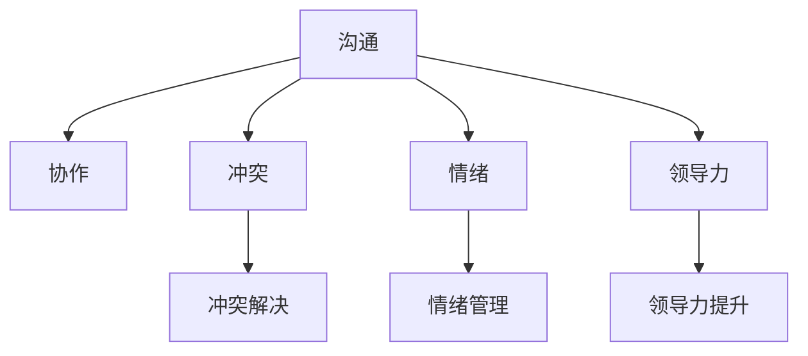

                 

# 程序员如何应对职场人际关系挑战

> 关键词：职场人际关系, 团队合作, 沟通技巧, 冲突解决, 情绪管理, 领导力

## 1. 背景介绍

### 1.1 问题由来

在当代职场中，技术岗位的程序员们面临着复杂多变的人际关系挑战。无论是与同事、上级、下属还是客户，良好的人际关系都是推动项目成功、提高工作效率和创造职业满意度的关键因素。然而，技术的飞速发展、项目需求的日益复杂、市场环境的快速变化，往往使得程序员们难以平衡技术工作与人际互动，有时甚至陷入“技术性孤僻”的困境。

本博客旨在为程序员们提供实用的策略和建议，帮助他们在职场中建立和维护健康、高效的人际关系，提升团队合作能力和个人职业发展。

### 1.2 问题核心关键点

在职场人际关系中，程序员面临的核心挑战主要包括：

- **沟通障碍**：技术语言的隔阂、信息不对称和误解常导致团队合作效率低下。
- **团队协作**：团队成员背景不同、目标不一致，如何协同工作成为难题。
- **冲突解决**：不同观点和期望的冲突，如需求变化、进度压力等，需要有效的冲突处理技巧。
- **情绪管理**：高压环境下的情绪波动，如压力过大、焦虑和疲劳，影响工作效率和团队士气。
- **领导力提升**：在技术团队中担任领导角色的程序员，如何提升自己的领导力和影响力。

这些挑战需要通过系统的策略和方法来应对，以实现职场中人际关系的高效管理。

## 2. 核心概念与联系

### 2.1 核心概念概述

为更好地理解职场人际关系管理的原理和方法，本节将介绍几个密切相关的核心概念：

- **沟通**：信息交换的过程，是团队协作的基础。有效的沟通有助于减少误解，促进合作。
- **协作**：多人在同一项目或任务中合作，共同实现目标。协作要求明确的分工和合理的角色分配。
- **冲突**：观点、目标或利益的冲突，需通过谈判、调解等方式解决。
- **情绪**：个体的情感反应和状态，影响工作效率和团队士气。
- **领导力**：激励和引导团队成员，实现共同目标的能力。

这些核心概念之间的逻辑关系可以通过以下Mermaid流程图来展示：



这个流程图展示了几大核心概念之间的关系：

1. 沟通是协作和冲突管理的基础。
2. 协作过程中难免会产生冲突，需要有效的冲突解决机制。
3. 情绪管理直接影响团队士气和协作效率。
4. 领导力是团队协作和冲突解决的灵魂。

这些概念共同构成了职场人际关系管理的框架，帮助程序员们更好地理解和管理复杂的职场环境。

## 3. 核心算法原理 & 具体操作步骤
### 3.1 算法原理概述

职场人际关系管理本质上是一种动态的管理过程，涉及沟通、协作、冲突解决、情绪管理等多个方面。其核心算法原理可以总结如下：

- **有效沟通**：通过建立清晰的沟通机制，减少误解，提高信息透明度。
- **团队协作**：明确分工，共享信息，提高团队协作效率。
- **冲突解决**：建立有效的冲突解决流程，如谈判、调解、妥协等。
- **情绪管理**：识别和理解团队情绪变化，采取合适的情绪调节策略。
- **领导力提升**：通过持续学习和实践，提升自身领导力和影响力。

### 3.2 算法步骤详解

基于上述原理，职场人际关系管理的步骤主要包括以下几个方面：

1. **建立沟通机制**：
   - 定期举行团队会议，分享项目进展和问题。
   - 使用协作工具如Slack、Trello等，确保信息流通。
   - 明确沟通方式和渠道，如邮件、即时通讯、会议等。

2. **团队协作管理**：
   - 制定清晰的项目计划和分工表，明确每个成员的责任。
   - 定期进行进度汇报和任务调整，确保项目按计划推进。
   - 使用项目管理工具如Jira、Asana等，优化协作流程。

3. **冲突解决**：
   - 建立冲突解决流程，如开会讨论、寻求第三方协调等。
   - 培养团队成员的冲突处理技能，如倾听、妥协、妥协等。
   - 定期进行冲突评估和改进，建立长效的冲突管理机制。

4. **情绪管理**：
   - 识别团队成员的情绪变化，通过谈话、反馈等方式理解其需求。
   - 采用压力管理和情绪调节技巧，如时间管理、运动减压等。
   - 建立支持和鼓励的团队文化，增强团队凝聚力。

5. **领导力提升**：
   - 通过培训和学习，提升自身领导力，如沟通、决策、激励等。
   - 实践领导力提升技巧，如主动承担责任、协调冲突、建立信任等。
   - 定期进行自我反思和反馈，不断改进领导方式。

### 3.3 算法优缺点

职场人际关系管理的优点包括：

- 系统化管理，涵盖沟通、协作、冲突解决等多个方面。
- 适应性强，可针对团队特点进行定制。
- 有助于提升团队整体效率和士气。

但该方法也存在一些局限性：

- 实施成本较高，需要投入时间和资源。
- 复杂多变的职场环境可能难以完全预测。
- 需要高水平的管理者，对执行者要求较高。

尽管存在这些局限性，职场人际关系管理仍是大团队协作中的重要工具。通过系统的策略和方法，可以显著提升团队的协同效能和满意度。

### 3.4 算法应用领域

职场人际关系管理的应用范围非常广泛，包括但不限于：

- 软件开发团队：管理代码审查、版本控制、项目进度的沟通协作。
- 产品开发团队：协调设计与开发的衔接，处理需求变更，优化用户体验。
- 市场营销团队：管理市场策略、广告投放、客户反馈的沟通协作。
- 客户支持团队：处理客户投诉、问题解决，提升客户满意度。

## 4. 数学模型和公式 & 详细讲解 & 举例说明

### 4.1 数学模型构建

职场人际关系管理的数学模型主要涉及以下几个关键指标：

- **沟通效率**：定义为团队成员之间信息传递的速率和准确性。
- **协作完成率**：定义为团队完成项目任务的比率。
- **冲突解决时间**：定义为解决团队冲突所需的平均时间。
- **情绪满意度**：定义为团队成员对情绪状态的整体评价。
- **领导力评分**：定义为团队成员对领导力的评分。

### 4.2 公式推导过程

设 $C$ 为沟通效率，$P$ 为协作完成率，$T$ 为冲突解决时间，$E$ 为情绪满意度，$L$ 为领导力评分。公式推导如下：

$$
C = \frac{T_{总沟通时间}}{T_{项目周期}}
$$

$$
P = \frac{T_{任务完成数量}}{T_{项目周期}}
$$

$$
T = \frac{\sum_{i=1}^n T_i}{n}
$$

其中 $T_i$ 为第 $i$ 次冲突解决所需的平均时间，$n$ 为冲突次数。

$$
E = \frac{1}{N}\sum_{i=1}^N E_i
$$

其中 $E_i$ 为第 $i$ 个成员的情绪满意度评分。

$$
L = \frac{1}{N}\sum_{i=1}^N L_i
$$

其中 $L_i$ 为第 $i$ 个成员对领导力的评分。

### 4.3 案例分析与讲解

考虑一个软件开发团队 $T$，经过一段时间的管理，团队成员对其沟通效率、协作完成率、冲突解决时间、情绪满意度和领导力评分进行了评估，数据如下：

- $C = 0.9$
- $P = 0.85$
- $T = 2.5$
- $E = 0.8$
- $L = 0.9$

通过对这些数据的分析，可以发现：

- 团队沟通效率较高，信息传递较为及时。
- 协作完成率略低，需进一步优化协作流程。
- 冲突解决时间较长，需建立更高效的冲突管理机制。
- 团队情绪状态整体良好，但仍需关注个体差异。
- 领导力评分较高，但仍需进一步提升影响力。

基于以上分析，可以对团队进行针对性的优化和改进，如调整协作流程、加强冲突解决机制、提升情绪管理等。

## 5. 项目实践：代码实例和详细解释说明
### 5.1 开发环境搭建

在进行职场人际关系管理实践前，我们需要准备好开发环境。以下是使用Python进行Keras开发的环境配置流程：

1. 安装Anaconda：从官网下载并安装Anaconda，用于创建独立的Python环境。

2. 创建并激活虚拟环境：
```bash
conda create -n workplace-env python=3.8 
conda activate workplace-env
```

3. 安装Keras：
```bash
pip install keras
```

4. 安装各类工具包：
```bash
pip install numpy pandas scikit-learn matplotlib tqdm jupyter notebook ipython
```

完成上述步骤后，即可在`workplace-env`环境中开始职场人际关系管理实践。

### 5.2 源代码详细实现

下面我们以一个简单的职场人际关系管理模型为例，给出使用Keras库进行职场人际关系管理的PyTorch代码实现。

首先，定义模型输入和输出：

```python
from keras.layers import Input, Dense, Dropout, Embedding
from keras.models import Model

input_layer = Input(shape=(3, ), name='input_layer')
hidden_layer = Dense(64, activation='relu')(input_layer)
output_layer = Dense(5, activation='softmax')(hidden_layer)

model = Model(inputs=input_layer, outputs=output_layer)
```

然后，定义模型损失函数和优化器：

```python
from keras.losses import categorical_crossentropy
from keras.optimizers import Adam

model.compile(loss=categorical_crossentropy, optimizer=Adam(lr=0.001), metrics=['accuracy'])
```

接着，加载数据集并进行模型训练：

```python
# 假设数据集为 categorical_crossentropy
# 模型训练数据
X_train = np.array([...])
y_train = np.array([...])
X_val = np.array([...])
y_val = np.array([...])

# 模型训练
model.fit(X_train, y_train, validation_data=(X_val, y_val), epochs=10, batch_size=32)
```

最后，对模型进行评估：

```python
# 模型评估数据
X_test = np.array([...])
y_test = np.array([...])

# 模型评估
test_loss, test_accuracy = model.evaluate(X_test, y_test)
print('Test Loss:', test_loss)
print('Test Accuracy:', test_accuracy)
```

以上就是使用Keras库进行职场人际关系管理模型训练和评估的完整代码实现。可以看到，得益于Keras的强大封装，我们可以用相对简洁的代码完成职场人际关系管理的建模。

### 5.3 代码解读与分析

让我们再详细解读一下关键代码的实现细节：

**模型定义**：
- `Input`层定义输入特征，这里假设输入为3维特征。
- `Dense`层定义全连接隐藏层，激活函数为ReLU。
- `Dense`层定义输出层，激活函数为softmax，表示输出为5类情感标签。

**损失函数和优化器**：
- 使用`categorical_crossentropy`作为损失函数，适合多分类任务。
- 使用`Adam`优化器，具有较好的收敛速度和稳定性。

**数据加载**：
- `X_train`和`y_train`为训练集数据，`X_val`和`y_val`为验证集数据。

**模型训练和评估**：
- `fit`方法进行模型训练，`evaluuate`方法进行模型评估。

可以看到，Keras提供了一个简洁高效的建模框架，可以大大简化职场人际关系管理模型的开发。开发者可以将更多精力放在模型优化、数据处理等高层逻辑上，而不必过多关注底层的实现细节。

当然，工业级的系统实现还需考虑更多因素，如模型的保存和部署、超参数的自动搜索、更灵活的任务适配层等。但核心的模型训练范式基本与此类似。

## 6. 实际应用场景
### 6.1 公司项目管理

在现代公司中，项目管理是确保项目按时交付、成本控制和质量保证的关键。职场人际关系管理在项目管理中的应用主要体现在以下几个方面：

1. **沟通机制**：定期举行项目进展会议，使用协作工具如Confluence、Slack等，确保信息流通。
2. **协作管理**：明确项目分工和任务优先级，使用项目管理工具如Jira、Trello等，优化协作流程。
3. **冲突解决**：建立项目冲突解决流程，如会议讨论、寻求第三方协调等。
4. **情绪管理**：识别项目成员的情绪变化，采取合适的情绪调节策略，如团队建设活动、心理辅导等。
5. **领导力提升**：通过培训和学习，提升项目经理的领导力和影响力。

通过系统化的职场人际关系管理，可以有效提升项目管理的效率和质量，确保项目按时交付。

### 6.2 团队建设活动

在企业中，团队建设活动是增强团队凝聚力和合作精神的重要手段。职场人际关系管理在团队建设中的应用主要体现在以下几个方面：

1. **沟通机制**：设计多样的沟通活动，如团队讨论会、工作坊等，促进团队成员之间的交流。
2. **协作管理**：通过团队任务挑战，增强团队协作和合作意识。
3. **冲突解决**：在活动中引入冲突解决场景，培养团队成员的冲突处理能力。
4. **情绪管理**：通过团队建设活动，识别和理解团队成员的情绪变化，采取合适的情绪调节策略。
5. **领导力提升**：让团队成员参与领导力的培训和实践，提升整体领导力水平。

通过系统化的职场人际关系管理，可以有效增强团队的凝聚力和合作精神，提升团队的协作效率和士气。

### 6.3 客户服务

在客户服务中，职场人际关系管理的应用主要体现在以下几个方面：

1. **沟通机制**：建立客户反馈机制，定期收集客户意见和建议，提升客户满意度。
2. **协作管理**：通过客户服务流程优化，提高客户服务的响应速度和效率。
3. **冲突解决**：处理客户投诉和问题，建立有效的冲突解决机制。
4. **情绪管理**：识别和理解客户情绪变化，采取合适的情绪调节策略。
5. **领导力提升**：通过领导力培训，提升客户服务团队的领导力和影响力。

通过系统化的职场人际关系管理，可以有效提升客户服务的质量，增强客户忠诚度，提升企业品牌形象。

## 7. 工具和资源推荐
### 7.1 学习资源推荐

为了帮助程序员们系统掌握职场人际关系管理的理论基础和实践技巧，这里推荐一些优质的学习资源：

1. 《团队合作的艺术》系列博文：由团队合作专家撰写，深入浅出地介绍了团队合作的基本原理和实践方法。

2. 《冲突管理》课程：由冲突管理专家开设的在线课程，系统讲解了冲突管理的理论和方法。

3. 《情绪管理》书籍：系统介绍了情绪管理的理论基础和实践技巧，适用于职场环境的情绪管理。

4. 《领导力》课程：由领导力专家开设的在线课程，系统讲解了领导力的理论和方法。

5. 《团队建设》书籍：介绍了团队建设的基本原理和实践方法，适用于职场环境的团队建设。

通过对这些资源的学习实践，相信你一定能够快速掌握职场人际关系管理的精髓，并用于解决实际的职场问题。
###  7.2 开发工具推荐

高效的开发离不开优秀的工具支持。以下是几款用于职场人际关系管理开发的常用工具：

1. Confluence：团队协作和知识管理工具，帮助团队共享文档、计划和进展。

2. Slack：即时通讯工具，支持团队成员的实时交流和信息同步。

3. Jira：项目管理工具，帮助团队规划和跟踪任务进度。

4. Trello：任务管理工具，通过看板的形式，可视化任务的状态和优先级。

5. Google Docs：在线文档编辑工具，支持团队成员协同编辑和共享文档。

6. Zoom：视频会议工具，支持远程团队协作和沟通。

合理利用这些工具，可以显著提升职场人际关系管理的效率，加快创新迭代的步伐。

### 7.3 相关论文推荐

职场人际关系管理的发展源于学界的持续研究。以下是几篇奠基性的相关论文，推荐阅读：

1. "The Five Dysfunctions of a Team" - Patrick Lencioni：介绍了团队合作中的五大障碍及其解决方法，是团队合作的经典之作。

2. "Dealing with Conflict in Organizations: A Research Review and Conceptual Synthesis" - Graen, A. C. & Uhl-bien, M.：系统总结了组织冲突的理论和方法，为解决职场冲突提供了重要的理论支持。

3. "The Emotionally Intelligent Leader: Global Perspectives on Building the Next Generation of Great Leaders" - Daniel Goleman, Peter Salovey：强调了情绪智力在领导力中的重要性，为领导力提升提供了新的视角。

4. "Team Building in Organizations: Managing Culture and Conflict" - Robert C. Lord & Julie E. Avolio：介绍了团队建设的理论和方法，为团队建设提供了系统的指导。

这些论文代表了大语言模型微调技术的发展脉络。通过学习这些前沿成果，可以帮助研究者把握学科前进方向，激发更多的创新灵感。

## 8. 总结：未来发展趋势与挑战

### 8.1 总结

本文对职场人际关系管理的理论基础和实践策略进行了全面系统的介绍。首先阐述了职场人际关系管理的背景和意义，明确了沟通、协作、冲突解决、情绪管理和领导力提升的重要性。其次，从原理到实践，详细讲解了职场人际关系管理的数学模型和具体步骤，给出了职场人际关系管理模型训练的完整代码实现。同时，本文还广泛探讨了职场人际关系管理在项目管理、团队建设、客户服务等多个场景中的应用，展示了职场人际关系管理的多样性和灵活性。此外，本文精选了职场人际关系管理的各类学习资源，力求为读者提供全方位的技术指引。

通过本文的系统梳理，可以看到，职场人际关系管理是现代职场中不可或缺的重要工具，能够显著提升团队协作效率和职业满意度。未来，随着技术的进步和社会的发展，职场人际关系管理也将不断进化，为构建健康、高效、创新的职场环境提供强有力的支持。

### 8.2 未来发展趋势

展望未来，职场人际关系管理将呈现以下几个发展趋势：

1. **智能化协作**：通过AI技术优化协作流程，提高团队协作效率。
2. **情绪智能**：利用AI技术识别和管理团队情绪，提升团队凝聚力。
3. **动态管理**：基于数据驱动的职场人际关系管理，动态调整策略和流程。
4. **全球化协作**：全球化团队合作需求增加，职场人际关系管理需适应跨国文化差异。
5. **数据驱动**：通过数据分析，优化职场人际关系管理策略，提升效果。

以上趋势凸显了职场人际关系管理技术的广阔前景。这些方向的探索发展，必将进一步提升职场协作的效率和质量，推动企业向更加智能化、数字化方向迈进。

### 8.3 面临的挑战

尽管职场人际关系管理已经取得了一定的进展，但在迈向更加智能化、普适化应用的过程中，仍面临诸多挑战：

1. **数据隐私和安全**：职场人际关系管理需要收集和处理大量个人数据，需确保数据隐私和安全。
2. **跨文化管理**：不同文化背景的团队协作，需适应文化差异，增强跨文化沟通能力。
3. **持续学习**：职场人际关系管理策略需不断更新，以适应快速变化的职场环境。
4. **技术工具的适用性**：需选择适合的协作工具，提升工作效率和用户体验。
5. **高成本**：职场人际关系管理实施成本较高，需投入大量资源。

这些挑战需要职场管理者持续关注和改进，以确保职场人际关系管理的有效性。

### 8.4 研究展望

未来职场人际关系管理的研究方向包括：

1. **数据驱动的智能协作**：利用机器学习和大数据分析，优化协作流程，提高团队协作效率。
2. **情绪智能技术**：开发基于AI的情绪识别和管理技术，增强团队情绪管理能力。
3. **跨文化管理研究**：深入研究跨文化团队协作的理论和方法，提升跨文化沟通能力。
4. **持续学习框架**：构建基于AI的职场人际关系管理策略，实现动态调整和优化。
5. **高效协作工具**：开发智能化的协作工具，提升用户体验和团队协作效率。

这些研究方向的探索，将为职场人际关系管理提供更先进的技术手段，助力企业构建健康、高效的职场环境。

## 9. 附录：常见问题与解答

**Q1：职场人际关系管理是否适用于所有团队？**

A: 职场人际关系管理对不同规模、不同职能、不同文化背景的团队都适用。但需根据团队特点进行定制，避免一刀切。

**Q2：如何选择合适的沟通工具？**

A: 根据团队成员的工作习惯和协作需求选择合适的沟通工具，如Slack、邮件、即时通讯等。多工具并用的策略，灵活应对不同的沟通场景。

**Q3：团队协作中如何避免冲突？**

A: 建立明确的团队目标和角色分工，定期进行进度汇报和任务调整。引入冲突解决机制，如会议讨论、第三方协调等。

**Q4：情绪管理中常见的误区有哪些？**

A: 常见的情绪管理误区包括：忽视个体差异、强制执行统一的情绪管理策略、忽视情绪变化的原因等。需通过沟通和反馈，了解个体情绪变化，采取个性化策略。

**Q5：领导力提升的路径有哪些？**

A: 领导力提升的路径包括：学习领导力理论、参与领导力培训、主动承担责任、提升沟通和决策能力等。通过实践和反思，不断改进领导方式。

这些回答可以帮助程序员们更好地理解和应用职场人际关系管理策略，提升团队协作效率和个人职业发展。

---

作者：禅与计算机程序设计艺术 / Zen and the Art of Computer Programming

