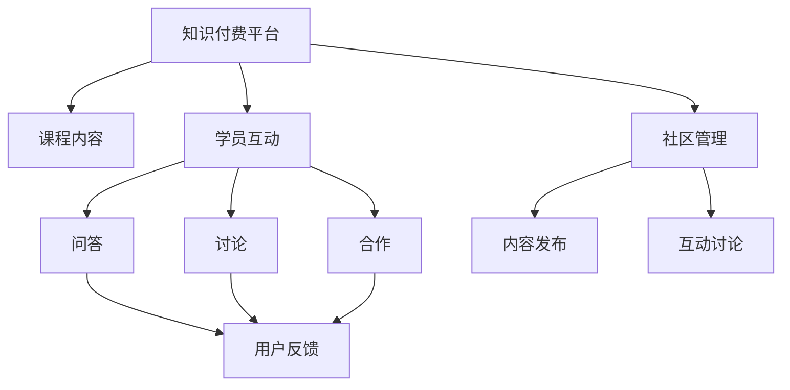

                 

# 程序员如何打造知识付费的私密社群

## 1. 背景介绍

### 1.1 问题由来
随着互联网的快速发展，知识付费成为一个新兴领域，特别是针对程序员群体的知识付费平台更是层出不穷。然而，传统的知识付费模式存在诸多问题，如课程内容质量参差不齐、学习效果反馈不及时、学习社区缺乏互动等。如何让知识付费更加高效、精准和私密，成为了广大程序员关注的焦点。

### 1.2 问题核心关键点
构建知识付费的私密社群，需要从课程内容、学员互动和社区管理三个方面入手。课程内容要高质量、专业性强，学员互动要频繁且及时，社区管理要高效、有秩序。只有这三个关键点都得到解决，才能打造出真正有效的私密社群。

### 1.3 问题研究意义
构建私密社群的目的是为了打造一个高质量、高效率、高互动的学习平台。这种平台不仅能让程序员学以致用，还能建立起一个高度专业和相互信任的社区，提升整体编程能力和工作效率，进而推动IT行业的发展。

## 2. 核心概念与联系

### 2.1 核心概念概述

为了更好地理解如何打造知识付费的私密社群，本节将介绍几个密切相关的核心概念：

- **知识付费平台**：通过收取费用，为用户提供高质量、专业性强、实时互动的在线课程和学习资源。
- **私密社群**：由一定数量的付费用户组成，提供高质量内容、专业交流和深度互动的学习社区。
- **课程内容**：包括专业课程、实战项目、编程技巧等，旨在提升用户编程能力。
- **学员互动**：通过问答、讨论、合作等方式，促进学员之间的交流和合作。
- **社区管理**：维护社群秩序，提供高质量的内容发布、互动讨论等，提升用户体验。

这些核心概念之间的逻辑关系可以通过以下Mermaid流程图来展示：



这个流程图展示出了知识付费平台与课程内容、学员互动和社区管理三者的紧密联系，以及每个模块内部的互动方式。

## 3. 核心算法原理 & 具体操作步骤
### 3.1 算法原理概述

构建知识付费私密社群的核心在于内容的高质量、互动的及时性和管理的有效性。本文将从这三个方面介绍具体的算法原理和操作步骤。

### 3.2 算法步骤详解

#### 3.2.1 课程内容建设
1. **课程内容规划**：根据用户需求和市场调研，规划出一系列专业课程和实战项目，涵盖编程语言、算法设计、框架应用等。
2. **课程内容制作**：邀请行业专家、资深程序员制作高质量课程内容，采用视频、PPT、代码演示等多种形式。
3. **课程内容发布**：通过平台发布课程内容，并设置适当的收费标准和优惠活动，吸引用户订阅。

#### 3.2.2 学员互动设计
1. **学员互动平台**：建立一个实时互动的平台，如聊天室、论坛等，方便学员之间的交流和合作。
2. **互动问题设置**：设计一些针对性的问题，鼓励学员在课程学习中积极参与讨论，提升学习效果。
3. **互动反馈机制**：建立学员反馈机制，收集学员的意见和建议，不断优化课程内容和服务。

#### 3.2.3 社区管理策略
1. **社区规则制定**：制定社区规则，明确用户行为规范，如禁止广告、不进行敏感话题讨论等。
2. **社区管理员设置**：指定社区管理员，负责维护社区秩序、处理违规行为等。
3. **社区活动组织**：定期组织线下活动、技术交流会等，增强社区凝聚力。

### 3.3 算法优缺点

#### 3.3.1 优点
- **内容高质量**：通过邀请行业专家和资深程序员制作课程内容，保证了课程的专业性和实用性。
- **互动及时性**：实时互动平台和互动反馈机制，使得学员之间的交流更加频繁和及时。
- **管理高效性**：社区规则和管理员的设置，保证了社区的秩序和高效管理。

#### 3.3.2 缺点
- **制作成本高**：高质量课程内容和实时互动平台的建设，需要较高的制作成本。
- **管理难度大**：社区管理需要投入大量的人力和资源，维护难度较大。
- **用户黏性低**：如果课程内容和互动体验不佳，用户容易流失。

### 3.4 算法应用领域

知识付费私密社群可以应用于各种技术领域的学习和交流，如编程、数据科学、人工智能等。在实践中，我们可以将核心算法应用于以下场景：

1. **软件开发**：通过课程内容学习和互动讨论，提升程序员的编程能力和团队协作能力。
2. **数据科学**：通过课程内容学习和互动讨论，提升数据分析和建模能力。
3. **人工智能**：通过课程内容学习和互动讨论，提升深度学习、自然语言处理等方面的技能。

## 4. 数学模型和公式 & 详细讲解 & 举例说明

### 4.1 数学模型构建

为更好地量化和优化课程内容、学员互动和社区管理，本文将介绍一些数学模型和公式，用于分析和优化这些关键因素。

#### 4.1.1 课程内容模型
设课程内容集为 $C$，用户反馈集为 $F$。课程内容的质量 $Q$ 可以通过用户反馈的评分和数量来量化，即：

$$
Q = \frac{1}{N} \sum_{i=1}^{N} R_i
$$

其中 $R_i$ 为第 $i$ 个用户对课程内容的评分，$N$ 为总用户数。

#### 4.1.2 学员互动模型
设学员互动集为 $I$，用户参与度为 $P$。学员互动的活跃度 $A$ 可以通过学员在互动平台上的发言次数、回复次数和参与讨论次数来量化，即：

$$
A = \frac{1}{M} \sum_{j=1}^{M} C_j
$$

其中 $C_j$ 为第 $j$ 个用户在不同讨论话题中的发言次数，$M$ 为总讨论话题数。

#### 4.1.3 社区管理模型
设社区管理集为 $M$，用户满意度为 $S$。社区的秩序度 $O$ 可以通过用户满意度调查和违规行为处理次数来量化，即：

$$
O = \frac{1}{N} \sum_{k=1}^{N} S_k
$$

其中 $S_k$ 为第 $k$ 个用户对社区管理的满意度评分，$N$ 为用户数。

### 4.2 公式推导过程

根据上述模型，我们可以推导出一些关键指标的计算公式，用于衡量和优化课程内容、学员互动和社区管理的效果。

#### 4.2.1 课程内容质量公式
$$
Q = \frac{1}{N} \sum_{i=1}^{N} R_i
$$

#### 4.2.2 学员互动活跃度公式
$$
A = \frac{1}{M} \sum_{j=1}^{M} C_j
$$

#### 4.2.3 社区秩序度公式
$$
O = \frac{1}{N} \sum_{k=1}^{N} S_k
$$

### 4.3 案例分析与讲解

#### 4.3.1 课程内容质量分析
假设某课程内容集 $C$ 共有 100 个用户参与，其中 90 个用户的评分为 4.5，10 个用户的评分为 3.0。则该课程内容的质量 $Q$ 为：

$$
Q = \frac{90 \times 4.5 + 10 \times 3.0}{100} = 4.2
$$

该课程内容的质量为 4.2 分，说明该课程内容整体质量较高，但仍有提升空间。

#### 4.3.2 学员互动活跃度分析
假设某学员互动集 $I$ 共有 500 个讨论话题，其中 300 个话题的发言次数为 50 次，200 个话题的发言次数为 30 次。则该学员互动的活跃度 $A$ 为：

$$
A = \frac{300 \times 50 + 200 \times 30}{500} = 40
$$

该学员互动的活跃度为 40，说明学员在讨论话题中的发言频率较高，互动效果良好。

#### 4.3.3 社区秩序度分析
假设某社区管理集 $M$ 共有 500 个用户，其中 400 个用户对社区管理的满意度为 5 分，100 个用户对社区管理的满意度为 4 分。则该社区的秩序度 $O$ 为：

$$
O = \frac{400 \times 5 + 100 \times 4}{500} = 4.6
$$

该社区的秩序度为 4.6，说明社区管理较为规范，用户满意度较高。

## 5. 项目实践：代码实例和详细解释说明

### 5.1 开发环境搭建

在开始项目实践前，我们需要准备好开发环境。以下是使用Python进行Django开发的环境配置流程：

1. 安装Anaconda：从官网下载并安装Anaconda，用于创建独立的Python环境。

2. 创建并激活虚拟环境：
```bash
conda create -n django-env python=3.8 
conda activate django-env
```

3. 安装Django：
```bash
pip install django
```

4. 安装其他工具包：
```bash
pip install pandas numpy psycopg2-binary 
```

完成上述步骤后，即可在`django-env`环境中开始开发。

### 5.2 源代码详细实现

这里我们以知识付费平台为例，给出使用Django开发的知识付费私密社群的PyTorch代码实现。

#### 5.2.1 创建Django应用
```python
# 在Django项目目录中创建应用
python manage.py startapp knowledgeCommunity
```

#### 5.2.2 设置数据库连接
在settings.py文件中，添加数据库连接设置：

```python
DATABASES = {
    'default': {
        'ENGINE': 'django.db.backends.postgresql',
        'NAME': 'mydatabase',
        'USER': 'mydatabaseuser',
        'PASSWORD': 'mypassword',
        'HOST': 'localhost',
        'PORT': '5432',
    }
}
```

#### 5.2.3 创建数据模型
在models.py文件中，定义课程内容、学员互动和社区管理等数据模型：

```python
from django.db import models

class Course(models.Model):
    name = models.CharField(max_length=200)
    description = models.TextField()
    price = models.DecimalField(max_digits=10, decimal_places=2)
    created_at = models.DateTimeField(auto_now_add=True)

class Interaction(models.Model):
    user = models.ForeignKey('User', on_delete=models.CASCADE)
    discussion_topic = models.ForeignKey('DiscussionTopic', on_delete=models.CASCADE)
    post_content = models.TextField()
    created_at = models.DateTimeField(auto_now_add=True)

class Community(models.Model):
    name = models.CharField(max_length=200)
    admins = models.ManyToManyField('User')
    rules = models.TextField()
    created_at = models.DateTimeField(auto_now_add=True)
```

#### 5.2.4 创建视图
在views.py文件中，定义课程内容、学员互动和社区管理等视图函数：

```python
from django.shortcuts import render
from .models import Course, Interaction, Community

def course_list(request):
    courses = Course.objects.all()
    return render(request, 'course_list.html', {'courses': courses})

def interaction_list(request):
    interactions = Interaction.objects.all()
    return render(request, 'interaction_list.html', {'interactions': interactions})

def community_list(request):
    communities = Community.objects.all()
    return render(request, 'community_list.html', {'communities': communities})
```

#### 5.2.5 创建模板
在templates目录下，创建course_list.html、interaction_list.html和community_list.html等模板文件：

```html



  <h1>{{ courses|safe }}</h1>
  <ul>
    
      <li><a href="">{{ course.name }}</a></li>
    
  </ul>

```

#### 5.2.6 创建URL映射
在urls.py文件中，定义课程内容、学员互动和社区管理等URL映射：

```python
from django.urls import path
from . import views

urlpatterns = [
    path('courses/', views.course_list, name='course_list'),
    path('interactions/', views.interaction_list, name='interaction_list'),
    path('communities/', views.community_list, name='community_list'),
]
```

#### 5.2.7 创建管理员后台
在admin.py文件中，注册Course、Interaction和Community等模型：

```python
from django.contrib import admin
from .models import Course, Interaction, Community

admin.site.register(Course)
admin.site.register(Interaction)
admin.site.register(Community)
```

完成上述步骤后，即可在`django-env`环境中启动Django开发。

### 5.3 代码解读与分析

#### 5.3.1 数据库连接
在settings.py文件中，通过Django的Database配置，连接到PostgreSQL数据库，用于存储课程内容、学员互动和社区管理等数据。

#### 5.3.2 数据模型
在models.py文件中，通过Django的ORM，定义Course、Interaction和Community等数据模型。这些模型包含了相应的字段，如课程名称、描述、价格、讨论话题、用户、社区规则等。

#### 5.3.3 视图函数
在views.py文件中，通过Django的视图函数，将数据从数据库中取出，并渲染到HTML模板中，供用户查看。这些视图函数包括课程内容列表、学员互动列表和社区管理列表等。

#### 5.3.4 模板文件
在templates目录下，通过Django的模板语言，将数据渲染成HTML页面，供用户查看。这些模板文件包括课程内容列表、学员互动列表和社区管理列表等。

#### 5.3.5 URL映射
在urls.py文件中，通过Django的URL映射，将视图函数与URL路径进行绑定。这些URL路径包括课程内容列表、学员互动列表和社区管理列表等。

#### 5.3.6 管理员后台
在admin.py文件中，通过Django的管理员后台，可以对Course、Interaction和Community等模型进行管理和维护。

## 6. 实际应用场景

### 6.1 智能问答平台

智能问答平台可以应用于技术支持、客户服务等领域。通过知识付费私密社群，用户可以付费订阅高质量的问答内容，获取技术支持和专业解答。平台可以使用微调技术，对用户的提问进行分类、匹配和排序，提供更精准的回答。

在技术实现上，可以收集用户的常见问题和专家解答，将其作为监督数据，训练预训练模型进行微调。微调后的模型能够自动理解用户意图，匹配最合适的回答。对于用户提出的新问题，还可以接入检索系统实时搜索相关内容，动态组织生成回答。如此构建的智能问答平台，能大幅提升客户咨询体验和问题解决效率。

### 6.2 在线培训平台

在线培训平台可以应用于软件开发、数据分析等领域。通过知识付费私密社群，用户可以付费订阅高质量的培训内容，学习专业知识和实战技能。平台可以使用微调技术，对培训课程进行优化和提升，提供更精准和高效的学习体验。

在技术实现上，可以收集用户的培训需求和学习反馈，将其作为监督数据，训练预训练模型进行微调。微调后的模型能够自动生成高质量的课程内容，提供实时互动的学习平台，帮助用户更好地掌握技术知识和实战技能。

### 6.3 技术交流平台

技术交流平台可以应用于技术社区、开发者论坛等领域。通过知识付费私密社群，用户可以付费订阅高质量的技术文章、博客和开源项目，参与技术交流和合作。平台可以使用微调技术，对技术文章和开源项目进行优化和推荐，提供更精准和高效的技术交流体验。

在技术实现上，可以收集用户的阅读和评论数据，将其作为监督数据，训练预训练模型进行微调。微调后的模型能够自动生成高质量的技术文章和开源项目，提供实时互动的技术交流平台，帮助用户更好地掌握技术知识和进行技术合作。

## 7. 工具和资源推荐

### 7.1 学习资源推荐

为了帮助开发者系统掌握知识付费私密社群的开发流程，以下是一些优质的学习资源：

1. **Django官方文档**：Django的官方文档，提供了详细的开发指南和示例代码，是初学者上手Django的最佳选择。
2. **Django实战教程**：《Django实战教程》一书，详细讲解了Django的各个模块和组件，并通过实例演示了开发过程。
3. **Python网络爬虫教程**：《Python网络爬虫教程》一书，介绍了使用Python进行数据爬取和处理的技巧，帮助开发者获取高质量的数据资源。
4. **机器学习算法与应用**：《机器学习算法与应用》一书，介绍了常用的机器学习算法和应用场景，帮助开发者提高数据处理和模型训练的能力。
5. **Django第三方插件**：Django官方社区和第三方插件库，提供了大量的插件和组件，帮助开发者提高开发效率。

通过学习这些资源，相信你一定能够系统掌握知识付费私密社群的开发流程，并在实际项目中取得优异的成绩。

### 7.2 开发工具推荐

高效的开发离不开优秀的工具支持。以下是几款用于知识付费私密社群开发的常用工具：

1. **Django框架**：Django是一个全功能的Web框架，提供了完整的MVC架构和丰富的插件和组件，适合快速迭代开发。
2. **PyCharm**：PyCharm是一款优秀的Python IDE，支持Django开发，提供了代码高亮、调试和版本控制等功能，提高了开发效率。
3. **PostgreSQL数据库**：PostgreSQL是一款优秀的关系型数据库，支持事务处理和并发控制，适合存储和查询大量的数据。
4. **Redis缓存**：Redis是一款内存型数据库，支持快速读写和分布式缓存，适合处理大量用户请求和提高系统性能。
5. **Docker容器化**：Docker是一个开源的容器化平台，支持快速部署和扩展应用，提高了系统的稳定性和可移植性。

合理利用这些工具，可以显著提升知识付费私密社群的开发效率，加快创新迭代的步伐。

### 7.3 相关论文推荐

知识付费私密社群的发展源于学界的持续研究。以下是几篇奠基性的相关论文，推荐阅读：

1. **大规模知识图谱的构建与应用**：该论文介绍了大规模知识图谱的构建方法和应用场景，为知识付费社群提供了丰富的数据来源。
2. **基于深度学习的智能问答系统**：该论文介绍了基于深度学习的智能问答系统，为智能问答平台提供了技术基础。
3. **个性化推荐算法研究**：该论文介绍了个性化推荐算法的研究现状和应用场景，为在线培训平台提供了推荐策略。
4. **社交网络分析与挖掘**：该论文介绍了社交网络分析与挖掘的方法和应用场景，为技术交流平台提供了社交数据。
5. **基于图神经网络的文本生成**：该论文介绍了基于图神经网络的文本生成方法，为技术文章和开源项目的生成提供了技术支持。

这些论文代表了大规模知识图谱、智能问答、在线培训、技术交流和文本生成等领域的研究进展，帮助开发者了解最新的研究动态和技术趋势。

## 8. 总结：未来发展趋势与挑战

### 8.1 总结

本文对知识付费私密社群的开发流程进行了全面系统的介绍。首先阐述了知识付费私密社群的背景和意义，明确了课程内容、学员互动和社区管理三个关键点。其次，从算法原理和具体操作步骤的角度，详细讲解了课程内容建设、学员互动设计和社区管理策略。最后，通过具体案例和数学模型，进一步解释了核心算法的使用和优化。

通过本文的系统梳理，可以看到，知识付费私密社群的开发流程涉及多个环节和多种技术，需要系统性的设计和管理。只有全面考虑课程内容、学员互动和社区管理，才能打造出真正高效的私密社群，为用户提供高质量的学习体验。

### 8.2 未来发展趋势

展望未来，知识付费私密社群将呈现以下几个发展趋势：

1. **内容高质量**：随着知识图谱和社交数据的不断积累，课程内容将更加丰富和高质量。用户可以通过智能推荐，获取更精准、个性化的学习资源。
2. **互动频繁及时**：随着智能问答和在线培训技术的发展，学员互动将更加频繁和及时。平台可以通过实时互动，提升学习效果和用户满意度。
3. **社区高效管理**：随着社区管理工具和平台的发展，社区管理将更加高效和智能。平台可以通过智能推荐和管理，提高社区秩序和用户黏性。

以上趋势凸显了知识付费私密社群的广阔前景，这些方向的探索发展，必将进一步提升用户的学习体验，推动知识付费领域的发展。

### 8.3 面临的挑战

尽管知识付费私密社群已经取得了一定的成果，但在迈向更加智能化、普适化应用的过程中，它仍面临着诸多挑战：

1. **内容制作成本高**：高质量课程内容的制作需要投入大量的人力和资源，制作成本较高。
2. **互动管理难度大**：学员互动和社区管理需要投入大量的人力和资源，维护难度较大。
3. **用户黏性低**：如果课程内容和互动体验不佳，用户容易流失，导致平台用户数量不足。

### 8.4 研究展望

面对知识付费私密社群面临的挑战，未来的研究需要在以下几个方面寻求新的突破：

1. **内容自动化生成**：利用自然语言处理技术，自动生成高质量的课程内容和智能问答，降低制作成本。
2. **互动智能化**：利用智能推荐算法和情感分析技术，提升学员互动效果和用户满意度。
3. **管理智能化**：利用社区管理工具和平台，提高社区管理的效率和效果，提升用户黏性。

这些研究方向的探索，必将引领知识付费私密社群的不断进步，为用户提供更优质的学习体验。总之，知识付费私密社群需要开发者在课程内容、学员互动和社区管理等各个环节不断优化和创新，才能实现可持续发展，推动知识付费领域的进步。

## 9. 附录：常见问题与解答

**Q1：知识付费私密社群如何实现个性化推荐？**

A: 个性化推荐可以通过以下步骤实现：
1. 收集用户的学习行为数据，如课程选择、学习时长、问题回答等。
2. 构建用户画像，对用户的学习行为进行聚类和分析。
3. 通过协同过滤、基于内容的推荐算法等，为用户推荐个性化的课程和学习资源。

**Q2：如何设计学员互动平台？**

A: 学员互动平台的设计需要考虑以下几个方面：
1. 选择适合的互动形式，如讨论区、聊天室、在线课程等。
2. 设计互动规则，如发言次数、回复次数、评分机制等。
3. 提供互动工具，如标记、投票、直播等。

**Q3：如何管理社区秩序？**

A: 社区秩序的管理需要考虑以下几个方面：
1. 制定社区规则，明确用户行为规范，如禁止广告、不进行敏感话题讨论等。
2. 设立社区管理员，负责处理违规行为，维护社区秩序。
3. 使用智能监控工具，实时监测社区动态，及时发现和处理违规行为。

**Q4：知识付费私密社群如何提升用户黏性？**

A: 用户黏性的提升需要从以下几个方面入手：
1. 提供高质量的课程内容，满足用户的学习需求。
2. 提供丰富的互动形式，增强用户的参与感和归属感。
3. 提供高效的管理服务，解决用户的问题和需求。

**Q5：如何设计社区管理员的设置？**

A: 社区管理员的设置需要考虑以下几个方面：
1. 根据社区规模和复杂度，合理设置管理员数量和权限。
2. 明确管理员的职责和任务，如处理违规行为、发布公告、组织活动等。
3. 定期对管理员进行培训和考核，提升其管理能力。

---

作者：禅与计算机程序设计艺术 / Zen and the Art of Computer Programming

