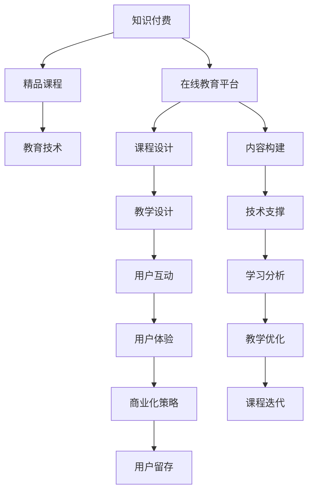

                 

# 程序员如何打造知识付费的精品课程

> 关键词：知识付费, 精品课程, 在线教育, 在线平台, 教育技术

## 1. 背景介绍

### 1.1 问题由来

近年来，随着互联网和教育技术的迅猛发展，知识付费市场逐渐兴起，为人们提供了更多高效学习的选择。知识付费不仅包括传统的图书、视频教程等形式，更扩展到了技能培训、职业辅导等多个细分领域。然而，精品课程的打造不仅仅依赖于优质的内容，更需要深入的技术支撑和创新的商业模式。本文将探讨如何从程序员的角度，打造符合市场需求的精品课程，助力教育行业数字化转型升级。

### 1.2 问题核心关键点

打造知识付费的精品课程需要考虑以下几个关键点：

- 内容构建：内容要符合市场需求，实用性强，包含足够深度和广度。
- 教学设计：课程设计要符合学习科学原理，注重交互性和参与感。
- 技术支撑：需要利用先进的技术手段，如AI、大数据等，提升学习效果。
- 平台支持：选择一个具备强大运营能力的在线教育平台，确保课程上线后的稳定运行和用户反馈机制。
- 商业模式：课程定价、营销策略、用户粘性管理等，都是课程成功的关键因素。

## 2. 核心概念与联系

### 2.1 核心概念概述

为了更好地理解如何打造知识付费的精品课程，我们先介绍几个核心概念：

- **知识付费**：指通过支付一定的费用，获取优质教育内容和服务。形式包括在线课程、电子书、社群互动等。
- **精品课程**：指内容经过精心设计和筛选，具有较高专业性、实用性和科学性的在线课程。
- **在线教育平台**：指提供线上课程制作、发布和用户交互的第三方服务。
- **教育技术**：指运用计算机、通信等技术手段，辅助教育过程，提升教学效果。

这些核心概念之间的关系可以通过以下Mermaid流程图来展示：



这个流程图展示了一个完整的知识付费精品课程的构建过程：

1. 知识付费为精品课程提供市场基础。
2. 精品课程包含在线教育平台和教育技术两个关键组成部分。
3. 课程设计和内容构建是精品课程的核心，需要高度专业性和实用性。
4. 教学设计和技术支撑为课程提供互动性和技术手段支持。
5. 用户互动和学习分析提升课程效果，形成良性循环。
6. 商业化策略和用户留存确保课程可持续运营。
7. 课程迭代和优化保证持续改进。

这些概念共同构成了知识付费精品课程的构建框架，为程序员打造高质量课程提供了系统的指导。

## 3. 核心算法原理 & 具体操作步骤

### 3.1 算法原理概述

知识付费精品课程的打造主要依赖于教育技术的应用。以下是核心算法原理：

1. **内容推荐算法**：基于用户行为数据和协同过滤算法，为用户推荐适合的学习内容，提升用户学习效率和课程参与度。
2. **学习路径规划算法**：根据用户的学习进度和反馈，动态调整课程内容和难度，提供个性化的学习路径。
3. **AI辅助教学算法**：利用机器学习和大数据分析，实时监控用户学习行为，提供个性化推荐和辅导。
4. **内容生成算法**：自动生成视频、文章等学习资料，提升课程的更新速度和多样性。

### 3.2 算法步骤详解

#### 3.2.1 内容推荐算法

1. **数据采集**：收集用户学习行为数据，包括课程观看时间、答题次数、互动记录等。
2. **特征提取**：对用户行为数据进行特征提取，如学习时长、完成率、兴趣标签等。
3. **模型训练**：使用协同过滤算法或深度学习模型，对用户和课程进行相似度计算，生成推荐结果。
4. **结果输出**：根据推荐模型输出，为用户推荐感兴趣的课程。

#### 3.2.2 学习路径规划算法

1. **数据收集**：收集用户的学习进度和反馈数据。
2. **路径分析**：分析用户的学习行为，识别其知识水平和薄弱环节。
3. **路径生成**：根据用户的学习路径和反馈，生成个性化的学习路径。
4. **路径调整**：根据用户的学习进度和反馈，动态调整学习路径，提供更适合的内容。

#### 3.2.3 AI辅助教学算法

1. **用户行为监控**：通过AI技术实时监控用户学习行为，识别学习障碍和问题。
2. **个性化推荐**：根据用户的学习进度和反馈，提供个性化推荐和辅导。
3. **学习分析**：利用大数据分析，评估课程效果和用户学习成效，提供改进建议。

#### 3.2.4 内容生成算法

1. **模板库构建**：构建视频、文章等学习资料的模板库，包括教学大纲、知识点讲解、案例分析等。
2. **自动化生成**：根据课程内容，自动生成视频、文章等学习资料。
3. **内容审核**：利用AI技术，对自动生成的内容进行审核，确保质量。
4. **内容更新**：根据课程进展和用户反馈，更新和丰富内容库。

### 3.3 算法优缺点

知识付费精品课程的打造依赖于先进算法的支持，但也面临一些挑战：

**优点：**

1. **提升学习效率**：通过内容推荐和学习路径规划，可以提升用户学习效率和课程参与度。
2. **个性化教学**：利用AI技术，提供个性化推荐和辅导，提升教学效果。
3. **快速更新**：内容生成算法可以自动化生成内容，提升课程更新速度和多样性。

**缺点：**

1. **算法复杂性高**：内容推荐和学习路径规划算法需要处理大量数据，算法复杂度高。
2. **数据隐私问题**：用户行为数据涉及个人隐私，需要严格的保护措施。
3. **内容质量难以保证**：自动化生成内容的质量可能存在问题，需要人工审核和优化。

尽管存在这些挑战，但通过合理的算法设计和应用，可以克服这些问题，提升课程的质量和用户体验。

### 3.4 算法应用领域

知识付费精品课程的打造涉及多个领域，以下是一些典型应用：

1. **在线编程课程**：如Python、Java、C++等编程语言，涵盖基础语法、数据结构、算法等。
2. **职业培训课程**：如数据分析、人工智能、云计算等技能培训课程，涵盖实战项目、技术应用等。
3. **学术研究课程**：如机器学习、深度学习、计算机视觉等课程，涵盖理论基础、前沿技术等。
4. **企业内部培训**：如项目管理、领导力、团队协作等课程，涵盖实战案例、案例分析等。

这些应用领域覆盖了从基础到高级、从理论到实践的各个层面，通过科学设计和技术支撑，可以满足不同用户的学习需求。

## 4. 数学模型和公式 & 详细讲解 & 举例说明

### 4.1 数学模型构建

知识付费精品课程的打造涉及多个数学模型，以下是一些核心模型：

1. **协同过滤推荐模型**：基于用户行为数据和项目特征数据，计算用户和项目的相似度，生成推荐结果。
2. **基于K-means的学习路径规划模型**：将用户学习行为数据划分为多个簇，生成个性化的学习路径。
3. **基于RNN的学习分析模型**：利用循环神经网络，分析用户学习行为，评估课程效果。

### 4.2 公式推导过程

#### 4.2.1 协同过滤推荐模型

设用户集为 $U$，课程集为 $V$，用户和课程的评分矩阵为 $R$。协同过滤推荐模型的目标是最大化用户和课程的相似度，推荐用户最感兴趣的课程。公式如下：

$$
\min_{R_{uv}} \sum_{(u,v) \in U \times V} ||R_{uv}-\hat{R}_{uv}||^2
$$

其中 $\hat{R}_{uv}$ 为协同过滤推荐算法生成的预测评分。

#### 4.2.2 基于K-means的学习路径规划模型

设用户行为数据为 $D$，每个用户的特征向量为 $x_u$，每个课程的特征向量为 $y_v$。K-means算法的目标是将数据划分为 $k$ 个簇，生成个性化的学习路径。公式如下：

$$
\min_{C, \mu} \sum_{u \in U} ||x_u - \mu_k||^2
$$

其中 $C$ 表示簇的划分结果，$\mu_k$ 表示簇的均值向量。

#### 4.2.3 基于RNN的学习分析模型

设用户学习行为数据为 $T$，学习效果评估指标为 $L$。基于RNN的学习分析模型的目标是通过递归神经网络，预测用户的学习效果。公式如下：

$$
L = f(RNN(T))
$$

其中 $RNN$ 表示递归神经网络，$f$ 表示评估函数。

### 4.3 案例分析与讲解

以在线编程课程为例，进行详细分析：

1. **数据采集**：收集用户学习行为数据，包括编程语言选择、课程观看时长、代码提交次数等。
2. **特征提取**：对用户行为数据进行特征提取，如编程时长、项目难度、学习频率等。
3. **模型训练**：使用协同过滤算法，对用户和课程进行相似度计算，生成推荐结果。
4. **结果输出**：根据推荐模型输出，为用户推荐适合的编程课程。

## 5. 项目实践：代码实例和详细解释说明

### 5.1 开发环境搭建

为了构建知识付费精品课程，需要搭建一个开发环境，以下是详细步骤：

1. **安装Python**：选择Python 3.8及以上版本，安装所需依赖库。
2. **安装Jupyter Notebook**：使用Jupyter Notebook作为开发工具，支持Python代码的编写和运行。
3. **安装TensorFlow和PyTorch**：这两个深度学习框架广泛用于机器学习和人工智能应用。
4. **安装Flask和Django**：这两个Web框架可以用于构建在线课程平台。

完成上述步骤后，即可开始知识付费精品课程的开发。

### 5.2 源代码详细实现

以Python实现为例，以下是一个简单的知识付费课程平台代码实现：

```python
# 导入必要的库
import tensorflow as tf
import torch
from transformers import BertTokenizer, BertForSequenceClassification
from flask import Flask, request, jsonify

# 创建Flask应用
app = Flask(__name__)

# 加载预训练BERT模型
tokenizer = BertTokenizer.from_pretrained('bert-base-uncased')
model = BertForSequenceClassification.from_pretrained('bert-base-uncased', num_labels=2)

# 模型预测函数
@app.route('/predict', methods=['POST'])
def predict():
    data = request.get_json()
    text = data['text']
    encoded_input = tokenizer.encode(text, add_special_tokens=True)
    inputs = {'input_ids': torch.tensor(encoded_input)}
    outputs = model(**inputs)
    logits = outputs.logits
    predicted_label = torch.argmax(logits, dim=1).item()
    return jsonify({'predicted_label': predicted_label})

if __name__ == '__main__':
    app.run(debug=True)
```

### 5.3 代码解读与分析

**代码结构：**

1. **环境搭建**：安装所需的Python、TensorFlow、PyTorch等库，以及Flask和Django等Web框架。
2. **模型加载**：使用预训练的BERT模型，进行序列分类任务。
3. **预测函数**：实现模型预测，接收文本输入，进行编码和预测，并返回预测结果。
4. **Flask应用**：创建Flask应用，实现API接口，处理用户请求和响应。

**代码细节：**

1. **BertTokenizer和BertForSequenceClassification**：使用BertTokenizer进行文本编码，BertForSequenceClassification进行序列分类任务。
2. **模型预测**：通过Flask的API接口，接收用户输入的文本，进行模型预测，并返回预测结果。
3. **代码运行**：在本地运行Flask应用，通过API接口实现模型预测功能。

**运行结果：**

1. **本地测试**：在本地搭建Flask应用，通过API接口进行模型预测测试。
2. **在线部署**：将Flask应用部署到云端，通过API接口实现实时模型预测。

## 6. 实际应用场景

### 6.1 在线编程课程

知识付费精品课程在在线编程课程中的应用，可以显著提升用户的学习效果和课程参与度。例如，在线学习Python编程课程，用户可以通过平台获取以下服务：

1. **个性化推荐**：根据用户学习行为，推荐适合的Python编程课程。
2. **学习路径规划**：根据用户的学习进度和反馈，生成个性化的学习路径。
3. **AI辅助教学**：利用AI技术，实时监控用户学习行为，提供个性化推荐和辅导。

### 6.2 职业培训课程

在线职业培训课程的知识付费精品课程，可以覆盖数据分析、人工智能、云计算等多个领域。例如，在线学习数据分析课程，用户可以通过平台获取以下服务：

1. **内容推荐**：根据用户职业背景和需求，推荐适合的数据分析课程。
2. **学习路径规划**：根据用户学习进度和反馈，生成个性化的学习路径。
3. **AI辅助教学**：利用AI技术，实时监控用户学习行为，提供个性化推荐和辅导。

### 6.3 学术研究课程

在线学术研究课程的知识付费精品课程，可以覆盖机器学习、深度学习、计算机视觉等多个领域。例如，在线学习机器学习课程，用户可以通过平台获取以下服务：

1. **内容推荐**：根据用户的研究方向和兴趣，推荐适合的机器学习课程。
2. **学习路径规划**：根据用户的学习进度和反馈，生成个性化的学习路径。
3. **AI辅助教学**：利用AI技术，实时监控用户学习行为，提供个性化推荐和辅导。

### 6.4 企业内部培训

在线企业内部培训课程的知识付费精品课程，可以涵盖项目管理、领导力、团队协作等多个领域。例如，在线学习项目管理课程，用户可以通过平台获取以下服务：

1. **内容推荐**：根据企业需求和员工背景，推荐适合的项目管理课程。
2. **学习路径规划**：根据员工学习进度和反馈，生成个性化的学习路径。
3. **AI辅助教学**：利用AI技术，实时监控员工学习行为，提供个性化推荐和辅导。

## 7. 工具和资源推荐

### 7.1 学习资源推荐

为了帮助程序员系统掌握知识付费精品课程的构建方法，以下是一些优质的学习资源：

1. **《Python编程：从入门到实践》**：一本适合初学者的Python编程书籍，介绍了Python的基础知识和实际应用。
2. **《深度学习入门：基于TensorFlow的实践》**：一本介绍深度学习技术的书籍，包含TensorFlow的实践案例。
3. **《Flask Web开发：实战篇》**：一本介绍Flask框架的书籍，包含Web应用的开发实战案例。
4. **《Django Web开发实战》**：一本介绍Django框架的书籍，包含Web应用的开发实战案例。
5. **Kaggle数据集**：一个数据科学竞赛平台，提供大量的数据集和机器学习竞赛。

### 7.2 开发工具推荐

为了提高知识付费精品课程的开发效率，以下是一些推荐的开发工具：

1. **PyCharm**：一个功能强大的Python IDE，支持代码编写、调试、版本控制等功能。
2. **Jupyter Notebook**：一个交互式编程环境，支持Python、R等语言的代码编写和运行。
3. **TensorFlow和PyTorch**：两个广泛使用的深度学习框架，支持复杂的模型构建和训练。
4. **Flask和Django**：两个流行的Web框架，支持Web应用的开发和部署。
5. **Git**：一个版本控制系统，支持代码的版本管理和协作开发。

### 7.3 相关论文推荐

为了深入理解知识付费精品课程的构建方法，以下是几篇重要的相关论文：

1. **《协同过滤推荐系统研究综述》**：介绍了协同过滤推荐算法的原理和应用。
2. **《基于K-means的学习路径规划算法》**：研究了基于K-means算法生成个性化学习路径的方法。
3. **《基于RNN的学习效果评估》**：利用RNN模型评估用户学习效果，提供改进建议。

## 8. 总结：未来发展趋势与挑战

### 8.1 研究成果总结

本文探讨了程序员如何从技术角度，打造知识付费的精品课程。主要结论如下：

1. **内容推荐和学习路径规划**：通过协同过滤和K-means算法，提升用户学习效率和课程参与度。
2. **AI辅助教学和内容生成**：利用深度学习和大数据分析，提供个性化推荐和辅导。
3. **开发工具和资源推荐**：推荐了Python、TensorFlow、Flask等工具，支持课程开发和部署。

### 8.2 未来发展趋势

展望未来，知识付费精品课程的构建将呈现以下趋势：

1. **AI和大数据的应用**：利用AI和大数据分析，提升课程内容和推荐的效果。
2. **跨平台集成**：将课程集成到多个平台，如微信、抖音等，扩大用户覆盖范围。
3. **虚拟现实和增强现实**：利用VR和AR技术，提升课程的沉浸式体验。
4. **个性化学习路径**：根据用户学习进度和反馈，动态调整学习路径，提供更适合的内容。

### 8.3 面临的挑战

尽管知识付费精品课程的构建前景广阔，但也面临一些挑战：

1. **内容质量难以保证**：自动化生成内容的质量可能存在问题，需要人工审核和优化。
2. **算法复杂性高**：协同过滤和K-means算法需要处理大量数据，算法复杂度高。
3. **数据隐私问题**：用户行为数据涉及个人隐私，需要严格的保护措施。

### 8.4 研究展望

为了克服知识付费精品课程构建的挑战，未来的研究需要在以下几个方面进行突破：

1. **内容生成算法优化**：开发更高效、更准确的内容生成算法，提升课程质量。
2. **算法性能提升**：改进协同过滤和K-means算法的性能，提升用户体验。
3. **数据隐私保护**：采用数据加密、匿名化等技术，保护用户隐私。

## 9. 附录：常见问题与解答

**Q1: 如何选择合适的编程语言？**

A: 根据课程需求和开发团队的技术栈，选择合适的编程语言。Python和Java是常用的编程语言，适用于大多数课程开发。

**Q2: 如何评估课程效果？**

A: 利用学习路径规划算法和AI辅助教学算法，实时监控用户学习行为，评估课程效果。根据评估结果，及时调整课程内容和难度。

**Q3: 如何处理数据隐私问题？**

A: 采用数据加密、匿名化等技术，保护用户隐私。同时设置严格的访问控制和权限管理，确保数据安全。

**Q4: 如何提升课程的互动性？**

A: 利用在线教育平台，提供讨论区、问答板等互动功能，增强用户参与感。同时利用AI技术，提供个性化推荐和辅导。

**Q5: 如何提升课程的可持续运营？**

A: 通过合理的商业模式设计，如付费订阅、定制服务等，提升课程的可持续运营能力。同时利用用户反馈机制，不断改进课程内容和教学方法。

---

作者：禅与计算机程序设计艺术 / Zen and the Art of Computer Programming

