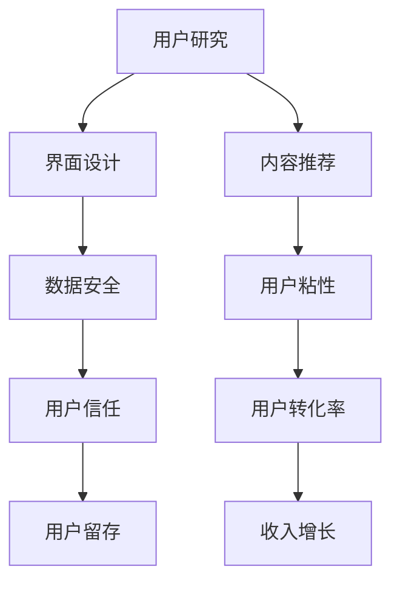

                 

## 1. 背景介绍

在数字经济时代，知识付费成为一种趋势，吸引了大量用户和从业者。然而，知识付费产品的用户粘性低、转化率低，用户体验问题不容忽视。作为一名程序员，如何通过技术手段提升知识付费产品的用户体验，是一个亟待解决的问题。本文将从用户研究、界面设计、内容推荐、数据安全等方面进行探讨，提供一套全面提升知识付费产品用户体验的解决方案。

## 2. 核心概念与联系

### 2.1 核心概念概述

在探讨如何提升知识付费产品的用户体验之前，我们首先需要明确几个核心概念：

- **用户研究(User Research)**：通过调查问卷、用户访谈、可用性测试等方式，了解用户需求和行为，从而指导产品设计。
- **界面设计(UI/UX Design)**：界面设计是指使用视觉和交互元素优化用户界面，以提高用户体验。
- **内容推荐(Content Recommendation)**：通过算法推荐，向用户展示最相关、最感兴趣的内容，提升用户粘性和满意度。
- **数据安全(Data Security)**：确保用户数据的安全性和隐私保护，避免数据泄露和滥用。

这些核心概念之间存在紧密联系。用户研究帮助我们了解用户需求，指导界面设计和内容推荐；界面设计提升用户体验，吸引用户停留；内容推荐提高用户粘性，提升用户转化率；数据安全保障用户信任，减少用户流失。

### 2.2 核心概念原理和架构的 Mermaid 流程图



## 3. 核心算法原理 & 具体操作步骤

### 3.1 算法原理概述

提升知识付费产品用户体验的算法和技术手段可以分为以下几个方面：

- **个性化推荐算法**：根据用户行为和兴趣，推荐最相关的内容。
- **界面优化算法**：通过A/B测试和用户反馈，优化界面布局和交互流程。
- **用户行为分析算法**：通过数据挖掘和机器学习，理解用户行为模式，预测用户需求。
- **数据安全算法**：采用加密、访问控制等手段，保障用户数据的安全。

### 3.2 算法步骤详解

#### 3.2.1 个性化推荐算法

1. **数据收集**：收集用户的历史行为数据，如浏览记录、购买记录、评分记录等。
2. **特征提取**：提取用户行为数据中的关键特征，如用户兴趣标签、内容属性标签等。
3. **模型训练**：使用协同过滤、基于内容的推荐、深度学习等算法，训练推荐模型。
4. **推荐生成**：根据新用户的特征和历史行为数据，生成个性化推荐内容。

#### 3.2.2 界面优化算法

1. **用户调研**：通过问卷调查和访谈等方式，收集用户对界面设计的意见和建议。
2. **A/B测试**：设计不同版本的界面，通过随机分配用户测试效果，选择最优方案。
3. **迭代优化**：根据用户反馈和测试结果，不断优化界面设计和交互流程。

#### 3.2.3 用户行为分析算法

1. **数据采集**：采集用户在使用产品过程中的行为数据，如点击次数、停留时间、购买行为等。
2. **数据清洗**：对采集到的数据进行清洗和预处理，去除噪音数据。
3. **特征提取**：使用TF-IDF、PCA等技术，提取关键特征。
4. **模型训练**：使用决策树、随机森林、神经网络等算法，训练行为分析模型。
5. **行为预测**：根据历史行为数据，预测用户未来行为，如购买意愿、流失风险等。

#### 3.2.4 数据安全算法

1. **数据加密**：对用户敏感数据进行加密处理，如使用AES、RSA等加密算法。
2. **访问控制**：设置用户权限，限制对敏感数据的访问权限，防止数据泄露。
3. **安全审计**：定期进行安全审计，发现并修复潜在的安全漏洞。

### 3.3 算法优缺点

#### 3.3.1 个性化推荐算法的优缺点

- **优点**：
  - 提升用户粘性和满意度。
  - 提高用户转化率和收入增长。
- **缺点**：
  - 数据质量问题可能导致推荐效果不佳。
  - 推荐算法复杂度高，计算成本较高。

#### 3.3.2 界面优化算法的优缺点

- **优点**：
  - 提升用户体验和满意度。
  - 降低用户流失率，提高用户留存。
- **缺点**：
  - 需要大量时间和资源进行测试和优化。
  - 用户意见多样性，可能存在争议。

#### 3.3.3 用户行为分析算法的优缺点

- **优点**：
  - 深入理解用户行为，预测用户需求。
  - 优化产品设计，提高用户转化率。
- **缺点**：
  - 数据隐私问题可能引发法律风险。
  - 算法复杂度较高，对数据质量要求高。

#### 3.3.4 数据安全算法的优缺点

- **优点**：
  - 保障用户数据安全，增强用户信任。
  - 防范数据泄露和滥用。
- **缺点**：
  - 安全措施成本高。
  - 安全漏洞可能导致严重的后果。

### 3.4 算法应用领域

个性化推荐、界面优化、用户行为分析、数据安全等算法和技术，已经广泛应用于多个领域，包括电商、社交媒体、知识付费等。这些技术手段不仅可以提升用户体验，还可以带来更高的商业价值。

## 4. 数学模型和公式 & 详细讲解

### 4.1 数学模型构建

个性化推荐算法通常采用协同过滤、基于内容的推荐、深度学习等方法。这里以协同过滤算法为例，构建推荐模型。

协同过滤算法的数学模型为：

$$
R_{ij} = \alpha \times \sum_{k=1}^K u_{ik} \times v_{kj} + \beta
$$

其中，$R_{ij}$表示用户$i$对商品$j$的评分，$u_{ik}$和$v_{kj}$分别为用户$i$和商品$j$在特征$k$上的嵌入表示，$\alpha$和$\beta$为模型参数。

### 4.2 公式推导过程

协同过滤算法的基本思想是利用用户行为数据计算用户和商品的相似度，从而预测用户对新商品的评分。具体推导如下：

1. **用户特征表示**：将用户行为数据转换为向量表示。
2. **商品特征表示**：将商品特征转换为向量表示。
3. **相似度计算**：计算用户$i$和商品$j$的相似度。
4. **评分预测**：根据相似度和特征表示，预测用户$i$对商品$j$的评分。

### 4.3 案例分析与讲解

以一个简单的电影推荐系统为例，分析协同过滤算法的应用。

1. **数据收集**：收集用户的历史评分数据，如用户对电影的评分记录。
2. **特征提取**：提取用户和电影的特征，如用户的兴趣标签、电影的导演、演员等。
3. **模型训练**：使用协同过滤算法，训练推荐模型。
4. **推荐生成**：根据新用户的行为数据和特征，生成个性化推荐电影。

## 5. 项目实践：代码实例和详细解释说明

### 5.1 开发环境搭建

以下是使用Python进行开发的环境配置流程：

1. **安装Python**：从官网下载并安装Python。
2. **安装相关库**：安装numpy、pandas、scikit-learn等常用库。
3. **安装机器学习库**：安装scikit-learn、tensorflow等机器学习库。
4. **配置开发环境**：创建虚拟环境，安装依赖库。

### 5.2 源代码详细实现

以下是使用scikit-learn实现协同过滤算法的代码示例：

```python
from sklearn.neighbors import NearestNeighbors
import numpy as np

# 数据预处理
def preprocess_data(data):
    # 将数据转换为特征矩阵
    X = np.array(data)
    # 使用均值归一化
    X = (X - np.mean(X, axis=0)) / np.std(X, axis=0)
    return X

# 推荐生成
def generate_recommendation(user_index, user_features, X, alpha=0.5, beta=3):
    # 获取用户特征向量
    user_vector = user_features[user_index]
    # 计算相似度
    distances = NearestNeighbors(n_neighbors=10).fit(X).kneighbors([[user_vector]])[0]
    # 计算评分
    scores = np.dot(user_vector, X[distances])
    scores = scores + beta
    return scores

# 测试代码
if __name__ == '__main__':
    # 创建数据集
    X = np.random.rand(100, 10)
    user_features = X[:20, :]
    X = X[20:, :]
    # 用户测试
    user_index = 0
    scores = generate_recommendation(user_index, user_features, X)
    print(scores)
```

### 5.3 代码解读与分析

以上代码示例展示了协同过滤算法的实现过程。

- `preprocess_data`函数：对数据进行预处理，包括特征提取和归一化。
- `generate_recommendation`函数：计算用户与所有商品的相似度，生成推荐评分。
- 测试代码：创建数据集，测试推荐函数。

## 6. 实际应用场景

### 6.1 电商平台

电商平台利用个性化推荐算法，根据用户历史行为和兴趣，推荐相关商品。通过界面优化和用户行为分析，提升用户体验和转化率。

### 6.2 社交媒体

社交媒体利用界面优化算法，提升用户互动体验。通过个性化推荐和用户行为分析，提高用户粘性和满意度。

### 6.3 知识付费

知识付费利用个性化推荐算法，向用户推荐相关课程和资料。通过界面优化和数据安全措施，增强用户信任和留存。

### 6.4 未来应用展望

未来，随着技术的不断进步，个性化推荐算法将更加智能和精准。界面优化算法将更加注重用户体验和互动性。数据安全算法将更加自动化和智能化。这些技术手段将进一步提升知识付费产品的用户体验。

## 7. 工具和资源推荐

### 7.1 学习资源推荐

1. **《推荐系统实践》书籍**：详细介绍了推荐系统的发展历史、算法原理和实际应用。
2. **Coursera《机器学习》课程**：由斯坦福大学开设的机器学习课程，涵盖常用机器学习算法和技术。
3. **Kaggle竞赛平台**：提供大量数据集和机器学习竞赛，可以锻炼算法设计和实现能力。

### 7.2 开发工具推荐

1. **Jupyter Notebook**：交互式编程环境，支持Python、R等多种语言，方便代码调试和展示。
2. **TensorBoard**：可视化工具，用于监控模型训练过程，方便调试和优化。
3. **PyTorch**：深度学习框架，支持动态计算图和GPU加速，适合快速迭代研究。

### 7.3 相关论文推荐

1. **《协同过滤算法研究综述》**：总结了协同过滤算法的优缺点和应用场景。
2. **《深度学习在推荐系统中的应用》**：介绍了深度学习算法在推荐系统中的应用。
3. **《界面设计的人机交互基础》**：介绍了界面设计的理论基础和实践方法。

## 8. 总结：未来发展趋势与挑战

### 8.1 研究成果总结

本文详细探讨了提升知识付费产品用户体验的技术手段，包括个性化推荐算法、界面优化算法、用户行为分析算法和数据安全算法。这些技术手段已经广泛应用于电商、社交媒体、知识付费等众多领域，并取得了显著效果。

### 8.2 未来发展趋势

未来，个性化推荐算法将更加智能化和精准化，界面优化算法将更加注重用户体验和互动性，用户行为分析算法将更加自动化和智能化，数据安全算法将更加自动化和智能化。这些技术手段将进一步提升知识付费产品的用户体验。

### 8.3 面临的挑战

提升知识付费产品用户体验面临的主要挑战包括数据质量问题、推荐算法复杂度高、界面优化成本高、数据隐私问题等。

### 8.4 研究展望

未来的研究应关注以下方向：

- **深度学习与推荐系统结合**：结合深度学习算法，提升推荐算法的精度和泛化能力。
- **界面优化自动化**：开发自动生成用户界面的工具，减少人工成本。
- **用户行为自动化分析**：使用自动化工具，进行用户行为分析和预测。
- **数据安全自动化**：开发自动化的数据安全系统，保障用户数据安全。

## 9. 附录：常见问题与解答

**Q1：如何确保个性化推荐算法的准确性和可靠性？**

A: 个性化推荐算法的准确性和可靠性主要取决于以下几个方面：

- **数据质量**：确保数据的完整性和准确性，避免噪音数据影响推荐效果。
- **特征提取**：合理选择和提取特征，提升推荐模型的精度。
- **模型选择**：选择合适的推荐算法和模型，如协同过滤、基于内容的推荐、深度学习等。

**Q2：如何优化界面设计？**

A: 界面优化需要从用户体验和互动性入手，具体措施包括：

- **用户调研**：通过问卷调查和访谈等方式，收集用户对界面设计的意见和建议。
- **A/B测试**：设计不同版本的界面，通过随机分配用户测试效果，选择最优方案。
- **迭代优化**：根据用户反馈和测试结果，不断优化界面设计和交互流程。

**Q3：如何保障数据安全？**

A: 数据安全主要依赖于加密和访问控制等手段，具体措施包括：

- **数据加密**：对用户敏感数据进行加密处理，如使用AES、RSA等加密算法。
- **访问控制**：设置用户权限，限制对敏感数据的访问权限，防止数据泄露。
- **安全审计**：定期进行安全审计，发现并修复潜在的安全漏洞。

---

作者：禅与计算机程序设计艺术 / Zen and the Art of Computer Programming

