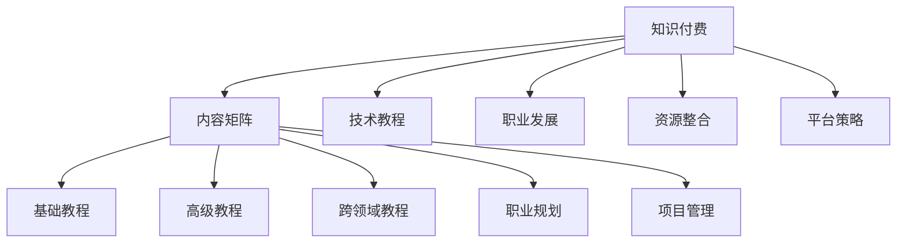

                 

# 程序员如何进行知识付费的内容矩阵

> 关键词：知识付费、内容矩阵、编程、技术教程、职业发展、资源整合、平台策略

## 1. 背景介绍

### 1.1 问题由来

在数字化和互联网高度发达的今天，知识的获取变得前所未有的便捷。然而，与此同时，付费获取高质量知识内容的途径也在不断增多。知识付费成为一种重要的知识获取方式，特别是在程序员群体中，这种趋势尤为明显。为了获得前沿技术、编程技巧、职业规划等知识和信息，许多程序员愿意为优质的内容付费。这种需求催生了一批针对程序员的知识付费平台和内容创作者，同时也促使程序员自己思考如何利用知识付费的东风，通过内容矩阵构建自己的知识付费体系。

### 1.2 问题核心关键点

在知识付费领域，如何构建一个有效的内容矩阵，成为程序员面临的核心挑战。内容矩阵需要涵盖从初级到高级，从技术教程到职业发展，从单一领域到多领域的内容布局。内容不仅需要丰富多样，还需要系统化、结构化，能够满足不同层次、不同需求的程序员。本文将探讨程序员如何进行知识付费的内容矩阵建设，从概念理解、技术实现到平台策略，提供一套全面的解决方案。

## 2. 核心概念与联系

### 2.1 核心概念概述

为更好地理解程序员如何进行知识付费的内容矩阵构建，我们首先需要了解几个核心概念：

- **知识付费**：指用户为获取专业知识、技能或信息而支付的费用。程序员作为高价值知识群体，对高质量技术内容的需求尤为强烈。
- **内容矩阵**：指一系列相关联的知识内容，通过系统化的组织和布局，形成从基础到高级、从单一到多领域的内容体系。
- **技术教程**：指教授编程语言、框架、工具等内容的学习材料。
- **职业发展**：包括职业规划、面试技巧、项目管理、领导力提升等内容，帮助程序员在职业生涯中不断进步。
- **资源整合**：将各类知识内容、工具、平台整合在一起，构建一体化的知识生态系统。
- **平台策略**：如何选择合适的知识付费平台，并制定有效的运营策略，提升内容的覆盖面和影响力。

这些核心概念之间的逻辑关系可以通过以下Mermaid流程图来展示：



这个流程图展示了知识付费领域的核心概念及其相互关系：

1. 知识付费是内容矩阵构建的初衷。
2. 技术教程、职业发展、资源整合和平台策略是构建内容矩阵的关键组成部分。
3. 内容矩阵通过基础教程、高级教程、跨领域教程、职业规划和项目管理等构成，形成从初级到高级的系统化知识体系。

## 3. 核心算法原理 & 具体操作步骤

### 3.1 算法原理概述

构建程序员知识付费的内容矩阵，本质上是进行内容组合、组织和推广的过程。其核心算法原理包括以下几个方面：

- **内容推荐算法**：根据用户的浏览和购买历史，推荐与其兴趣和需求相匹配的内容。
- **内容多样化**：通过技术教程、职业发展、资源整合等多元内容，满足不同层次、不同背景的程序员需求。
- **内容结构化**：将内容按照基础、高级、跨领域等维度进行划分，形成系统化的知识体系。
- **内容持续更新**：定期更新内容，引入新的技术、工具和最佳实践，保持内容的先进性和实用性。

### 3.2 算法步骤详解

构建程序员知识付费的内容矩阵，主要分为以下几个步骤：

**Step 1: 用户需求分析**
- 调研目标用户群体，了解其技术水平、职业阶段、学习习惯等。
- 设计用户问卷或进行访谈，获取用户对知识付费内容的真实需求。

**Step 2: 内容采集与筛选**
- 搜集各类技术教程、职业发展、资源整合等相关内容。
- 筛选高质量、实用性强、更新及时的内容，确保内容矩阵的健康和有效性。

**Step 3: 内容分类与组织**
- 将内容按照技术难度、领域、职业阶段等维度进行分类。
- 确定内容之间的逻辑关系和优先级，形成层次分明的知识体系。

**Step 4: 内容呈现与推广**
- 设计内容呈现界面和交互方式，提升用户体验。
- 通过SEO优化、社交媒体推广、用户口碑等手段，提升内容的曝光率和影响力。

**Step 5: 用户反馈与迭代**
- 收集用户反馈，持续优化内容。
- 根据用户需求和市场变化，迭代调整内容矩阵。

### 3.3 算法优缺点

构建程序员知识付费的内容矩阵，具有以下优点：
1. 满足程序员多样化的知识需求，提升学习效率和工作能力。
2. 系统化的内容布局，有助于程序员系统化学习和职业规划。
3. 定期更新的内容体系，保持技术的先进性和实用性。
4. 平台策略可以提升内容的覆盖面和影响力。

同时，该方法也存在以下局限性：
1. 内容采集和筛选难度大，需要投入大量资源和精力。
2. 用户需求变化快，需要持续更新和迭代。
3. 用户付费意愿和支付能力不一，推广难度较大。
4. 内容质量和多样性直接影响用户满意度，需要严格把控。

尽管存在这些局限性，但就目前而言，构建内容矩阵是提升程序员知识付费效果的重要手段。未来相关研究的方向在于如何进一步降低内容采集和筛选的难度，提升内容的覆盖面和用户满意度，同时兼顾平台的运营策略和盈利模式。

### 3.4 算法应用领域

程序员知识付费的内容矩阵构建，广泛应用于以下领域：

- **在线教育平台**：如Udemy、Coursera等，提供从初级到高级的编程课程和职业发展指导。
- **技术社区和博客**：如Medium、CSDN等，通过技术文章、代码片段、项目教程等形式分享知识和经验。
- **知识付费App**：如知乎、得到等，聚焦于程序员职业发展和技术前沿。
- **企业内部培训**：企业内部通过构建知识库和课程体系，提升员工的技能和职业素养。
- **在线编程挑战平台**：如LeetCode、HackerRank等，提供技术面试模拟和算法训练。

这些应用领域展示了内容矩阵的广泛适用性，为程序员提供了丰富的学习和提升渠道。

## 4. 数学模型和公式 & 详细讲解 & 举例说明

### 4.1 数学模型构建

构建程序员知识付费的内容矩阵，需要建立相应的数学模型来描述内容之间的关系和用户需求。假设用户群体为 $U$，内容为 $C$，用户与内容的交互为 $I$。数学模型可以表示为：

$$
\text{Model} = (U, C, I)
$$

其中，$U$ 为用户集合，$C$ 为内容集合，$I$ 为用户与内容的交互集合。

### 4.2 公式推导过程

为了描述用户与内容之间的交互关系，我们可以使用协同过滤算法和推荐系统中的矩阵分解技术。假设用户与内容之间的交互矩阵为 $R$，内容之间的相关性矩阵为 $S$。协同过滤算法可以表示为：

$$
\hat{R} = R \times S
$$

其中，$\hat{R}$ 为推荐结果，$R$ 为用户与内容的交互矩阵，$S$ 为内容之间的相关性矩阵。

对于内容矩阵的组织，我们可以使用层次聚类算法或图论中的有向图模型来描述内容之间的层级关系。以树形结构为例，内容之间的层级关系可以表示为：

$$
T = (N, E)
$$

其中，$N$ 为节点集合，$E$ 为边集合。每条边表示内容之间的关系，可以通过权重 $w$ 来表示内容的依赖程度。

### 4.3 案例分析与讲解

假设我们正在为一家技术社区构建内容矩阵。社区的目标用户是软件开发工程师，内容涵盖前端、后端、移动开发、数据科学等多个领域。我们可以使用协同过滤算法来推荐内容，用户的历史交互记录 $R$ 如下：

$$
R = \begin{bmatrix}
    1 & 0 & 1 & 0 & 0 \\
    0 & 1 & 0 & 0 & 1 \\
    0 & 0 & 0 & 1 & 0 \\
    0 & 0 & 0 & 0 & 1 \\
    1 & 1 & 0 & 1 & 1
\end{bmatrix}
$$

内容之间的相关性矩阵 $S$ 可以基于内容标签、发布时间等特征计算得出。假设 $S$ 为单位矩阵，则推荐结果 $\hat{R}$ 如下：

$$
\hat{R} = R \times S = \begin{bmatrix}
    1 & 0 & 1 & 0 & 0 \\
    0 & 1 & 0 & 0 & 1 \\
    0 & 0 & 0 & 1 & 0 \\
    0 & 0 & 0 & 0 & 1 \\
    1 & 1 & 0 & 1 & 1
\end{bmatrix}
$$

这表示用户 A 可能对内容 1 和内容 3 感兴趣，用户 B 可能对内容 2 和内容 5 感兴趣。通过调整 $S$ 的值，可以进一步优化推荐效果。

## 5. 项目实践：代码实例和详细解释说明

### 5.1 开发环境搭建

在进行内容矩阵构建的项目实践前，我们需要准备好开发环境。以下是使用Python进行知识付费平台开发的环境配置流程：

1. 安装Anaconda：从官网下载并安装Anaconda，用于创建独立的Python环境。

2. 创建并激活虚拟环境：
```bash
conda create -n knowledge-payment-env python=3.8 
conda activate knowledge-payment-env
```

3. 安装PyTorch、TensorFlow等常用深度学习库：
```bash
conda install pytorch torchvision torchaudio cudatoolkit=11.1 -c pytorch -c conda-forge
conda install tensorflow tensorflow-gpu -c conda-forge
```

4. 安装Flask、Django等Web框架：
```bash
pip install Flask
pip install Django
```

5. 安装数据库连接库：
```bash
pip install sqlalchemy
```

完成上述步骤后，即可在`knowledge-payment-env`环境中开始项目实践。

### 5.2 源代码详细实现

以下是使用Flask框架构建一个简单的知识付费平台的示例代码：

```python
from flask import Flask, request, jsonify

app = Flask(__name__)

# 定义用户和内容的数据结构
users = [
    {"id": 1, "name": "Alice", "email": "alice@example.com"},
    {"id": 2, "name": "Bob", "email": "bob@example.com"},
    {"id": 3, "name": "Charlie", "email": "charlie@example.com"}
]

content = [
    {"id": 1, "title": "Python入门教程", "price": 19.99, "tags": ["Python", "入门"]},
    {"id": 2, "title": "Java高级编程", "price": 29.99, "tags": ["Java", "高级"]},
    {"id": 3, "title": "数据科学实战", "price": 49.99, "tags": ["数据科学", "实战"]}
]

# 定义用户与内容的交互记录
interactions = [
    {"user_id": 1, "content_id": 1},
    {"user_id": 2, "content_id": 2},
    {"user_id": 3, "content_id": 3},
    {"user_id": 1, "content_id": 3},
    {"user_id": 2, "content_id": 1}
]

@app.route('/user', methods=['GET'])
def get_user():
    user_id = request.args.get('id')
    for user in users:
        if user['id'] == int(user_id):
            return jsonify(user)
    return jsonify({"error": "User not found"}), 404

@app.route('/content', methods=['GET'])
def get_content():
    content_id = request.args.get('id')
    for content in content:
        if content['id'] == int(content_id):
            return jsonify(content)
    return jsonify({"error": "Content not found"}), 404

@app.route('/interaction', methods=['GET'])
def get_interaction():
    user_id = request.args.get('user_id')
    content_id = request.args.get('content_id')
    for interaction in interactions:
        if interaction['user_id'] == int(user_id) and interaction['content_id'] == int(content_id):
            return jsonify(interaction)
    return jsonify({"error": "Interaction not found"}), 404

if __name__ == '__main__':
    app.run(debug=True)
```

### 5.3 代码解读与分析

让我们再详细解读一下关键代码的实现细节：

**Flask框架**：
- `Flask`：轻量级的Web框架，适合快速构建简单的Web应用。
- `request`：用于处理HTTP请求。
- `jsonify`：将Python对象转换为JSON格式响应。

**用户和内容的数据结构**：
- `users`：用户列表，包括ID、姓名和邮箱。
- `content`：内容列表，包括ID、标题、价格和标签。
- `interactions`：用户与内容的交互记录，包括用户ID和内容ID。

**路由处理**：
- `/get_user`：根据用户ID获取用户信息。
- `/get_content`：根据内容ID获取内容信息。
- `/get_interaction`：根据用户ID和内容ID获取交互记录。

**服务器运行**：
- `app.run(debug=True)`：启动Flask应用，并开启调试模式。

### 5.4 运行结果展示

运行上述代码后，可以在浏览器中访问以下URL：
- `http://localhost:5000/user?id=1`：获取用户信息
- `http://localhost:5000/content?id=1`：获取内容信息
- `http://localhost:5000/interaction?user_id=1&content_id=1`：获取交互记录

这些URL将返回相应的JSON格式响应，展示用户、内容和交互的数据。

## 6. 实际应用场景

### 6.1 智能教育平台

智能教育平台可以为学生提供系统化的编程课程和职业指导，帮助他们提升编程技能和职业素养。平台可以收集学生的学习进度和反馈，通过数据分析优化课程内容和推荐算法，提升教学效果。

### 6.2 在线编程学习社区

在线编程学习社区，如LeetCode、HackerRank等，通过提供编程挑战和算法训练，帮助程序员提升编码能力和解决实际问题的能力。平台可以通过推荐系统，根据用户的编程历史和进度，推荐适合其技能水平的挑战题目。

### 6.3 企业内部培训系统

企业内部培训系统，通过构建知识库和课程体系，提升员工的技能和职业素养。平台可以根据员工的学习进度和反馈，动态调整课程内容和推荐算法，确保培训效果的最大化。

### 6.4 未来应用展望

随着知识付费领域的发展，未来内容矩阵的构建将更加复杂和多样化。以下是几个可能的未来发展趋势：

- **多模态内容**：除了文本内容，还可能引入视频、音频等多模态内容，提升学习体验。
- **个性化推荐**：通过深度学习和机器学习算法，实现更精准的用户需求匹配和内容推荐。
- **实时更新**：内容矩阵需要实时更新，引入最新的技术、工具和最佳实践，保持内容的先进性和实用性。
- **社区互动**：通过社区讨论、技术交流等互动方式，增强内容矩阵的互动性和共享性。

## 7. 工具和资源推荐

### 7.1 学习资源推荐

为了帮助开发者系统掌握知识付费平台的理论基础和实践技巧，这里推荐一些优质的学习资源：

1. **《知识付费平台开发实战》系列博文**：由知识付费平台专家撰写，深入浅出地介绍了知识付费平台的原理、技术实现和运营策略。
2. **《知识付费市场分析》课程**：通过学习课程，了解知识付费市场的现状、用户需求和运营模式。
3. **《知识付费平台运营策略》书籍**：详细介绍了知识付费平台的运营策略、用户管理、内容审核等方面的内容。
4. **《知识付费平台优化手册》**：提供了知识付费平台的优化方法和实践案例，帮助开发者提升平台性能和用户体验。
5. **《知识付费平台技术架构》视频**：通过学习视频，了解知识付费平台的技术架构和关键技术点。

通过对这些资源的学习实践，相信你一定能够快速掌握知识付费平台的精髓，并用于解决实际的开发和运营问题。

### 7.2 开发工具推荐

高效的开发离不开优秀的工具支持。以下是几款用于知识付费平台开发的常用工具：

1. **Flask**：轻量级的Web框架，适合快速构建简单的Web应用。
2. **Django**：功能强大的Web框架，适合开发复杂的Web应用。
3. **PyTorch**：基于Python的开源深度学习框架，适合构建推荐系统等复杂算法。
4. **TensorFlow**：由Google主导开发的开源深度学习框架，适合大规模工程应用。
5. **SQLAlchemy**：Python ORM库，用于数据库连接和操作。
6. **Redis**：高性能的内存数据库，适合缓存和实时数据处理。

合理利用这些工具，可以显著提升知识付费平台的开发效率，加快创新迭代的步伐。

### 7.3 相关论文推荐

知识付费领域的发展源于学界的持续研究。以下是几篇奠基性的相关论文，推荐阅读：

1. **《知识付费平台的推荐系统研究》**：介绍了知识付费平台的推荐系统设计和优化方法。
2. **《知识付费市场分析与用户行为研究》**：通过数据分析和用户行为研究，提供了知识付费市场的发展趋势和用户需求。
3. **《知识付费平台的运营策略优化》**：通过运营策略和数据分析，提升了知识付费平台的运营效果和用户满意度。
4. **《知识付费平台的课程体系设计》**：介绍了知识付费平台的课程体系设计和内容组织方法。
5. **《知识付费平台的技术架构设计》**：详细介绍了知识付费平台的技术架构和关键技术点。

这些论文代表了大语言模型微调技术的发展脉络。通过学习这些前沿成果，可以帮助研究者把握学科前进方向，激发更多的创新灵感。

## 8. 总结：未来发展趋势与挑战

### 8.1 总结

本文对程序员如何进行知识付费的内容矩阵建设进行了全面系统的介绍。首先阐述了知识付费领域的背景和意义，明确了内容矩阵在知识付费中的重要性。其次，从原理到实践，详细讲解了内容矩阵的构建过程，提供了系统的解决方案。同时，本文还广泛探讨了内容矩阵在智能教育、在线编程学习、企业内部培训等各个领域的应用前景，展示了知识付费平台的巨大潜力。最后，本文精选了知识付费平台的各类学习资源，力求为读者提供全方位的技术指引。

通过本文的系统梳理，可以看到，构建内容矩阵是提升知识付费平台效果的重要手段。内容矩阵通过系统化的内容布局，满足了程序员多样化的知识需求，提升了学习效率和工作能力，为知识付费平台提供了丰富的学习和提升渠道。未来，伴随内容矩阵的持续优化和拓展，知识付费平台必将在NLP技术落地应用中发挥重要作用。

### 8.2 未来发展趋势

展望未来，知识付费平台的内容矩阵建设将呈现以下几个发展趋势：

1. **内容多样化**：内容矩阵将更加多样化，涵盖视频、音频、动画等多种形式，提升学习体验。
2. **内容结构化**：内容之间的层次关系将更加明确，形成系统化的知识体系，方便用户学习和检索。
3. **内容实时更新**：内容矩阵需要实时更新，引入最新的技术、工具和最佳实践，保持内容的先进性和实用性。
4. **社区互动**：通过社区讨论、技术交流等互动方式，增强内容矩阵的互动性和共享性。
5. **个性化推荐**：通过深度学习和机器学习算法，实现更精准的用户需求匹配和内容推荐。
6. **多模态内容**：除了文本内容，还可能引入视频、音频等多模态内容，提升学习体验。

以上趋势凸显了知识付费平台的内容矩阵建设的广阔前景。这些方向的探索发展，必将进一步提升知识付费平台的性能和应用范围，为知识传播和共享带来新的机遇。

### 8.3 面临的挑战

尽管知识付费平台的内容矩阵建设已经取得了显著成效，但在迈向更加智能化、普适化应用的过程中，仍面临诸多挑战：

1. **内容采集和筛选难度大**：需要投入大量资源和精力，采集和筛选高质量内容。
2. **用户需求变化快**：内容矩阵需要持续更新和迭代，以适应用户需求的变化。
3. **平台推广难度大**：内容矩阵的推广需要有效的方法和策略，吸引更多的用户付费。
4. **内容质量有待提高**：内容质量直接影响用户满意度，需要严格把控内容质量和多样性。
5. **平台盈利模式待优化**：需要找到合适的盈利模式，提升平台的可持续性。

尽管存在这些挑战，但通过不断的技术创新和市场探索，知识付费平台的内容矩阵建设将不断优化和完善，为用户提供更加丰富、高效、可靠的知识服务。

### 8.4 研究展望

面对知识付费平台内容矩阵建设所面临的挑战，未来的研究需要在以下几个方面寻求新的突破：

1. **内容采集自动化**：利用自然语言处理和机器学习技术，实现内容的自动采集和筛选，降低人工成本。
2. **个性化推荐算法**：开发更加精准和高效的推荐算法，提升推荐效果。
3. **社区互动机制**：设计良好的社区互动机制，增强内容的互动性和共享性。
4. **盈利模式创新**：探索新的盈利模式，如会员制、课程订阅、知识服务等，提升平台的盈利能力。
5. **内容版权保护**：引入版权保护机制，保障内容创作者的权益。

这些研究方向将推动知识付费平台的内容矩阵建设，提升平台的竞争力，为用户提供更加丰富、高效、可靠的知识服务。

## 9. 附录：常见问题与解答

**Q1：如何评估知识付费平台的内容质量？**

A: 评估知识付费平台的内容质量，可以从以下几个方面进行：

1. 用户反馈：收集用户的评价和反馈，了解内容的实用性和受欢迎程度。
2. 专家评测：邀请相关领域的专家对内容进行评估，提供权威的参考意见。
3. 数据分析：通过用户行为数据，分析内容的访问量、互动率等指标，了解内容的表现。
4. 用户留存率：计算平台的用户留存率，评估内容对用户粘性的影响。

通过综合考虑这些因素，可以全面评估知识付费平台的内容质量，及时优化内容矩阵。

**Q2：如何优化推荐算法？**

A: 优化推荐算法可以从以下几个方面进行：

1. 数据采集：采集更多、更丰富的用户数据，提升推荐算法的训练效果。
2. 模型选择：选择合适的推荐算法模型，如协同过滤、深度学习等，提升推荐效果。
3. 特征工程：设计有效的特征工程，提取有用的特征，提升推荐算法的准确性。
4. 实时更新：定期更新推荐算法模型，引入新的数据和算法，提升推荐效果。

通过不断优化推荐算法，可以提升内容推荐的精准度和用户满意度，增强平台的竞争力。

**Q3：如何提升平台的用户体验？**

A: 提升平台的用户体验可以从以下几个方面进行：

1. 界面设计：设计简洁、美观的界面，提升用户的使用体验。
2. 交互设计：设计流畅、便捷的交互方式，提升用户的操作体验。
3. 内容优化：优化内容的呈现方式，提升用户的阅读体验。
4. 社区互动：设计良好的社区互动机制，增强用户之间的交流和合作。

通过不断提升平台的用户体验，可以增强用户粘性，提升平台的用户留存率和活跃度。

**Q4：如何保护内容创作者的权益？**

A: 保护内容创作者的权益，可以从以下几个方面进行：

1. 版权登记：对内容进行版权登记，确保内容的合法性。
2. 版权保护：采用数字水印、加密等技术，保护内容的版权。
3. 版权监控：建立版权监控机制，及时发现和处理侵权行为。
4. 作者收益：建立作者收益分配机制，保障内容创作者的利益。

通过保护内容创作者的权益，可以增强内容矩阵的健康性和可持续性，吸引更多的优质内容创作者。

**Q5：如何构建多样化的内容矩阵？**

A: 构建多样化的内容矩阵，可以从以下几个方面进行：

1. 内容类型：引入多种形式的内容，如视频、音频、文章等，满足用户的多样化需求。
2. 内容层次：设计系统化的内容层次，从基础到高级，从单一到多领域，形成完整的内容体系。
3. 内容来源：引入多种来源的内容，如专家讲座、学术文章、开发者博客等，增强内容的多样性。
4. 内容更新：定期更新内容，引入最新的技术、工具和最佳实践，保持内容的先进性和实用性。

通过构建多样化的内容矩阵，可以满足用户的多样化需求，提升学习体验和内容质量。

---

作者：禅与计算机程序设计艺术 / Zen and the Art of Computer Programming

