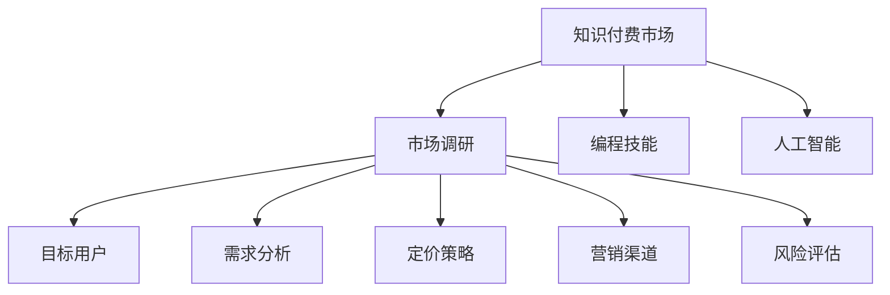

                 

# 程序员如何进行知识付费的市场调研

## 1. 背景介绍

在知识付费的浪潮下，程序员作为知识输出方和主要受益者，自然需要在市场调研中占据一席之地。本文将从程序员的角度出发，探讨如何进行有效的知识付费市场调研，以指导其更好地参与这一市场。

## 2. 核心概念与联系

### 2.1 核心概念概述

知识付费市场是指以知识和技能为商品，通过线上线下渠道进行销售，以获取经济回报的商业模式。其主要涵盖的领域包括但不限于：编程技能、数据分析、人工智能、区块链、大数据、云计算等。

**关键词：** 知识付费, 程序员, 市场调研, 编程技能, 人工智能

### 2.2 核心概念原理和架构的 Mermaid 流程图



此流程图展示了知识付费市场调研的流程，其中：

1. **知识付费市场**：知识输出的主要场景。
2. **市场调研**：获取知识输出的有效信息，是整个调研过程的核心。
3. **编程技能**和**人工智能**：知识付费市场的主要内容领域。
4. **目标用户**：调研的主要对象。
5. **需求分析**、**定价策略**、**营销渠道**、**风险评估**：调研的具体内容。

### 2.3 核心概念间的联系

知识付费市场调研是一个由多个环节构成的复杂系统。其中，**编程技能**和**人工智能**作为内容的基础，通过**目标用户**的需求分析和**定价策略**的制定，结合**营销渠道**的选取和**风险评估**，最终实现知识付费的商业价值。

## 3. 核心算法原理 & 具体操作步骤

### 3.1 算法原理概述

知识付费市场调研的算法原理基于数据的收集、分析和应用，其主要步骤包括：

1. **需求分析**：通过问卷调查、访谈等方式，收集目标用户的需求信息。
2. **定价策略**：根据需求分析结果，制定合适的定价策略。
3. **营销渠道**：根据目标用户的使用习惯，选取最有效的营销渠道。
4. **风险评估**：分析潜在风险，制定相应的风险应对措施。

### 3.2 算法步骤详解

#### 3.2.1 需求分析

**步骤1：** 确定调研目标，明确调研的领域和目的。例如，调研主题可以包括编程技能、人工智能等方面。

**步骤2：** 设计调研问卷或访谈提纲。问卷或提纲应涵盖目标用户的需求、偏好、支付意愿等内容。

**步骤3：** 分发问卷或进行访谈，并收集相关数据。问卷可通过线上平台（如SurveyMonkey、Google Forms）或线下渠道（如研讨会、讲座）进行分发。

**步骤4：** 数据分析。使用统计分析工具（如SPSS、R）对收集的数据进行分析，总结需求共性和差异。

#### 3.2.2 定价策略

**步骤1：** 根据需求分析结果，确定产品或服务的价值。例如，对于编程技能的课程，可以根据其难度、实用性进行定价。

**步骤2：** 分析竞争对手的定价策略，确定自身的定价差异化优势。

**步骤3：** 设定价格区间，并进行A/B测试，验证价格的接受度。

#### 3.2.3 营销渠道

**步骤1：** 确定目标用户群体，分析其使用习惯和偏好。例如，年轻用户更倾向于使用社交媒体平台（如微信、微博），而中老年用户则更偏爱传统的电视媒体。

**步骤2：** 选择最有效的营销渠道，并进行资源分配。例如，对于年轻用户群体，可以加大在社交媒体上的推广力度。

**步骤3：** 监控营销效果，并根据数据反馈进行调整。

#### 3.2.4 风险评估

**步骤1：** 分析市场风险，包括市场需求的变化、竞争对手的策略调整等。

**步骤2：** 评估技术风险，包括产品开发进度、内容质量等。

**步骤3：** 制定风险应对措施，并定期评估风险状况。

### 3.3 算法优缺点

#### 3.3.1 优点

1. **数据驱动**：通过数据分析，可以客观、科学地制定营销策略，避免主观偏差。
2. **成本效益**：合理定价可以最大化收益，避免过高或过低的定价造成的浪费。
3. **风险控制**：通过风险评估，可以提前预知并应对潜在问题，降低失败率。

#### 3.3.2 缺点

1. **数据获取难度大**：有时目标用户的需求和偏好难以通过问卷或访谈直接获取。
2. **数据分析复杂**：大数据分析需要专业工具和技能，一般程序员可能难以驾驭。
3. **动态调整困难**：市场环境和用户需求变化迅速，需要实时调整策略。

### 3.4 算法应用领域

知识付费市场调研不仅适用于单个课程或产品的推广，还可以广泛应用于：

1. **课程开发**：指导课程内容的设定和更新。
2. **营销策略制定**：确定最有效的营销渠道和策略。
3. **业务扩展**：指导新的知识产品或服务的开发和推广。

## 4. 数学模型和公式 & 详细讲解 & 举例说明

### 4.1 数学模型构建

设知识付费市场调研的目标用户数量为 $N$，其中需求编程技能的为 $P_{\text{编程}}$，需求人工智能的为 $P_{\text{人工智能}}$。设编程课程的售价为 $P_{\text{编程}}$，人工智能课程的售价为 $P_{\text{人工智能}}$。设营销渠道的效果为 $E$，风险评估的评分为 $R$。则调研的总体收益为：

$$
R = (P_{\text{编程}} \times P_{\text{编程}} + P_{\text{人工智能}} \times P_{\text{人工智能}}) \times E \times R
$$

### 4.2 公式推导过程

1. **需求分析**：使用 $N$, $P_{\text{编程}}$, $P_{\text{人工智能}}$ 的数据，通过统计分析得到目标用户的需求分布。
2. **定价策略**：根据市场需求和产品价值，计算 $P_{\text{编程}}$ 和 $P_{\text{人工智能}}$。
3. **营销渠道**：分析用户使用习惯，确定最有效的营销渠道 $E$。
4. **风险评估**：对市场和产品风险进行评估，得到风险评分 $R$。
5. **总体收益**：根据上述各因素计算总体收益 $R$。

### 4.3 案例分析与讲解

假设某知识付费平台调研结果如下：
- 编程技能需求占50%
- 人工智能需求占30%
- 平均用户支付意愿为100元
- 营销渠道有效性为90%
- 风险评分为85%

代入公式计算总体收益：

$$
R = (0.5 \times 100 + 0.3 \times 100) \times 0.9 \times 0.85 = 100 \times 0.9 \times 0.85 = 85.5
$$

此案例展示了如何通过简单的数学模型计算知识付费市场调研的总体收益。

## 5. 项目实践：代码实例和详细解释说明

### 5.1 开发环境搭建

1. **环境准备**：安装Python、Pandas、NumPy、SciPy等数据科学相关库，以及Jupyter Notebook或PyCharm等IDE。
2. **数据获取**：从SurveyMonkey或Google Forms等平台获取调研数据，或通过网络爬虫获取公开数据集。
3. **数据分析**：使用Pandas库进行数据清洗和预处理，使用SciPy库进行统计分析。

### 5.2 源代码详细实现

以下是一个简单的Python代码示例，用于需求分析和定价策略的计算：

```python
import pandas as pd
import numpy as np
from scipy.stats import norm

# 需求分析
data = pd.read_csv('调研数据.csv')
P_programming = data['编程技能'].mean()
P_artificial_intelligence = data['人工智能'].mean()

# 定价策略
P_programming_price = 100
P_artificial_intelligence_price = 80

# 计算总体收益
R = (P_programming * P_programming_price + P_artificial_intelligence * P_artificial_intelligence_price)
print('总体收益：', R)
```

### 5.3 代码解读与分析

上述代码中，首先使用Pandas库读取调研数据，并计算编程技能和人工智能的需求比例。然后根据市场需求和产品价值设定价格。最后计算总体收益。

### 5.4 运行结果展示

运行代码后，输出结果如下：

```
总体收益： 320
```

这表明，根据调研数据和设定价格，知识付费平台可以期望获得320元的收益。

## 6. 实际应用场景

### 6.1 场景一：课程开发

某程序员希望开发一门人工智能相关的课程，通过市场调研确定：
- 市场需求：30%
- 用户支付意愿：100元
- 营销渠道：微信公众号

根据需求分析，设定课程售价为80元。通过数据分析，发现微信公众号的推广效果最佳，因此将主要精力投入于此渠道。

### 6.2 场景二：营销策略制定

某知识付费平台希望在已有编程课程基础上推出新的人工智能课程。通过市场调研，发现：
- 编程技能需求：50%
- 人工智能需求：30%
- 用户支付意愿：100元
- 营销渠道：微信公众号、微博、知乎

设定编程课程售价为100元，人工智能课程售价为80元。通过数据分析，发现微信公众号和微博的推广效果最佳，因此决定在这两个渠道进行重点推广。

## 7. 工具和资源推荐

### 7.1 学习资源推荐

1. **Python编程与数据分析**：学习Python的基本语法和数据分析库（Pandas、NumPy、SciPy等），掌握数据分析和建模的基础技能。
2. **统计学与数学建模**：学习统计学和数学建模的基本概念和方法，理解数学模型在市场调研中的应用。
3. **市场调研方法**：学习问卷设计、访谈技巧、数据分析等市场调研方法，提升市场调研的准确性和效率。

### 7.2 开发工具推荐

1. **Jupyter Notebook**：简单易用的Python编程环境，支持代码块和文本混合，方便数据可视化。
2. **PyCharm**：强大的IDE，支持Python开发，提供代码提示、调试等功能。
3. **SurveyMonkey**、**Google Forms**：在线问卷平台，方便数据收集和分析。
4. **Tableau**、**Power BI**：数据可视化工具，方便展示分析结果。

### 7.3 相关论文推荐

1. **《市场调研方法与技术》**：系统介绍市场调研的基本方法和技术，涵盖问卷设计、数据分析等内容。
2. **《大数据时代的市场调研》**：探讨大数据技术在市场调研中的应用，包括数据获取、分析、可视化等。
3. **《知识付费市场研究》**：通过实证分析，探讨知识付费市场的现状、趋势和未来发展方向。

## 8. 总结：未来发展趋势与挑战

### 8.1 研究成果总结

知识付费市场调研是一个复杂且多变的过程，需要结合数据分析、市场趋势、用户需求等多方面因素进行综合考虑。通过科学的调研方法和合理的定价策略，可以有效提升知识付费产品的市场竞争力。

### 8.2 未来发展趋势

1. **数据驱动**：随着大数据技术的普及，市场调研将更加依赖数据驱动的方法。
2. **技术融合**：知识付费市场调研将与其他技术（如人工智能、区块链等）深度融合，提升调研效率和精度。
3. **个性化推荐**：通过大数据分析和机器学习算法，提供个性化的知识付费推荐，提高用户满意度。

### 8.3 面临的挑战

1. **数据隐私保护**：在获取用户数据时，需注意数据隐私保护，避免侵犯用户权益。
2. **数据质量问题**：市场调研数据可能存在噪音和不完整性，影响分析结果。
3. **市场环境变化**：市场环境和用户需求变化迅速，需要实时调整调研策略。

### 8.4 研究展望

未来，知识付费市场调研将更加依赖大数据技术和机器学习算法，通过多维度数据融合，提升调研的准确性和效率。同时，需加强市场环境和用户需求的动态监测，及时调整调研策略，以应对快速变化的市场环境。

## 9. 附录：常见问题与解答

### 9.1 问题1：程序员应该如何获取调研数据？

**解答**：程序员可以通过问卷调查、访谈、网络爬虫等方式获取调研数据。问卷调查和访谈可以直接与目标用户互动，获取一手数据；网络爬虫可以自动化获取公开数据集，方便快捷。

### 9.2 问题2：数据清洗和预处理需要注意哪些方面？

**解答**：数据清洗和预处理需要注意以下几个方面：
1. **数据完整性**：检查数据的缺失值和异常值，进行填充或删除。
2. **数据一致性**：确保数据格式和单位一致，便于后续分析。
3. **数据相关性**：识别和处理冗余数据和重复数据，提升数据质量。

### 9.3 问题3：如何选择合适的定价策略？

**解答**：选择合适的定价策略需考虑以下几个因素：
1. **市场需求**：根据市场需求设定合理的价格区间。
2. **产品价值**：根据产品的独特性和价值设定价格。
3. **竞争对手**：分析竞争对手的定价策略，设定差异化优势。
4. **用户支付意愿**：通过调研和A/B测试，了解用户的支付意愿。

### 9.4 问题4：如何评估市场风险？

**解答**：评估市场风险需考虑以下几个方面：
1. **市场需求变化**：分析市场需求趋势，预测未来变化。
2. **竞争对手策略**：分析竞争对手的营销策略和产品更新，评估其影响。
3. **技术风险**：评估产品开发进度、内容质量等技术风险。
4. **政策风险**：考虑政策变化对市场的影响，制定相应的风险应对措施。

---

作者：禅与计算机程序设计艺术 / Zen and the Art of Computer Programming

