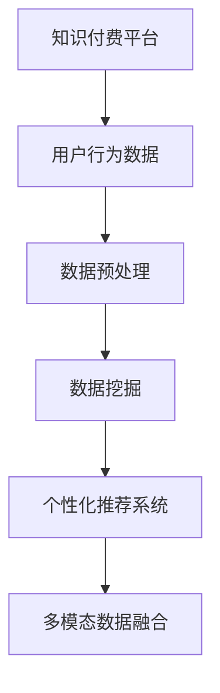

                 

# 程序员如何进行知识付费的数据分析

## 1. 背景介绍

在当前知识付费日益盛行的时代，程序员的知识付费行为已经成为推动技术创新和行业发展的重要力量。知识付费平台利用大数据分析技术，能够深入挖掘程序员的需求和偏好，优化课程设置，提升用户满意度。然而，如何高效进行数据分析，以精准挖掘程序员的需求和偏好，仍然是一个值得探讨的问题。本文将从核心概念、算法原理、操作步骤等多个维度，对程序员进行知识付费的数据分析方法进行系统阐述。

## 2. 核心概念与联系

### 2.1 核心概念概述

为了更好地理解如何进行知识付费的数据分析，本节将介绍几个关键概念：

- **知识付费平台**：指的是以收费形式提供知识或技能服务的技术平台，如Coursera、Udemy、掘金等。这些平台通过数据分析挖掘用户需求，推送个性化课程，实现知识变现。
- **用户行为数据**：包括访问行为、购买行为、评分反馈等，是知识付费平台进行数据分析的主要数据来源。
- **数据预处理**：对原始数据进行清洗、整理和特征提取，提高数据的质量和可用性。
- **数据挖掘**：通过机器学习和统计分析方法，从大规模数据中挖掘出有用的信息和模式。
- **个性化推荐系统**：利用数据挖掘技术，为每个用户推荐最适合的课程内容，提升用户体验。
- **多模态数据融合**：结合不同类型的数据，如文本、图片、视频等，进行综合分析和挖掘，提高分析的全面性和准确性。

### 2.2 核心概念原理和架构的 Mermaid 流程图



## 3. 核心算法原理 & 具体操作步骤

### 3.1 算法原理概述

程序员进行知识付费的数据分析主要基于机器学习和数据挖掘技术，具体包括以下步骤：

1. **数据采集**：从知识付费平台收集用户行为数据，包括访问记录、购买记录、评分记录等。
2. **数据预处理**：清洗和整理数据，处理缺失值、异常值，进行特征提取和归一化。
3. **特征工程**：选择合适的特征进行特征选择和特征工程，提高特征的解释性和可用性。
4. **模型训练**：选择合适的算法进行模型训练，如分类、聚类、回归等。
5. **模型评估与优化**：通过交叉验证、性能指标等方法，评估模型的效果并进行优化。
6. **结果应用**：将分析结果应用于个性化推荐、用户画像构建、课程优化等方面。

### 3.2 算法步骤详解

**Step 1: 数据采集**

首先，通过API接口或其他方式，从知识付费平台收集用户行为数据。常用的数据包括：

- 用户访问记录：记录用户浏览课程页面、查看课程内容等信息。
- 用户购买记录：记录用户购买的课程信息，包括课程名称、价格、购买时间等。
- 用户评分反馈：记录用户对课程的评分、评论等信息。

**Step 2: 数据预处理**

1. **数据清洗**：去除重复、缺失、异常等数据，提高数据质量。
2. **特征提取**：将原始数据转化为特征向量，常用的特征包括课程ID、价格、评分、访问时长等。
3. **归一化**：对特征进行归一化处理，如Min-Max归一化、Z-score归一化等。

**Step 3: 特征工程**

特征工程是数据分析的核心环节，常用的特征工程方法包括：

- **特征选择**：选择最相关的特征，如基于卡方检验、互信息等方法。
- **特征转换**：通过多项式展开、对数变换等方式，生成新的特征。
- **特征降维**：通过PCA、LDA等方法，将高维特征降维，提高计算效率。

**Step 4: 模型训练**

选择适合的算法进行模型训练。常用的算法包括：

- **分类算法**：如决策树、随机森林、SVM等，用于用户分类和课程分类。
- **聚类算法**：如K-means、层次聚类等，用于用户聚类和课程聚类。
- **回归算法**：如线性回归、岭回归等，用于预测用户购买行为。

**Step 5: 模型评估与优化**

通过交叉验证、ROC曲线、AUC等方法评估模型效果，并进行参数调优和模型选择。常用的评估指标包括准确率、召回率、F1-score等。

**Step 6: 结果应用**

将分析结果应用于个性化推荐、用户画像构建、课程优化等方面。常用的推荐算法包括协同过滤、基于内容的推荐、混合推荐等。

### 3.3 算法优缺点

**优点**：

- **高效性**：通过数据挖掘和机器学习，能够快速分析和挖掘用户需求和偏好。
- **个性化推荐**：能够为每个用户推荐最合适的课程内容，提升用户体验。
- **可解释性**：通过特征工程和模型解释，能够理解用户行为背后的逻辑和原因。

**缺点**：

- **数据隐私**：用户行为数据可能包含个人隐私信息，需要严格保护。
- **数据噪音**：原始数据可能存在噪声，影响分析结果。
- **模型复杂度**：复杂模型可能需要大量的计算资源和时间。

### 3.4 算法应用领域

知识付费的数据分析主要应用于以下几个领域：

- **个性化推荐**：根据用户行为数据，推荐最合适的课程，提升用户黏性。
- **课程优化**：分析课程评分和用户反馈，优化课程内容和结构。
- **用户画像**：构建用户画像，了解用户需求和行为特征。
- **市场分析**：分析市场趋势和用户需求，制定营销策略。
- **业务决策**：支持业务决策，如课程定价、市场推广等。

## 4. 数学模型和公式 & 详细讲解 & 举例说明

### 4.1 数学模型构建

知识付费数据分析的核心数学模型包括回归模型、分类模型、聚类模型等。这里以线性回归模型为例，介绍其数学模型构建过程。

假设用户行为数据为$X$，包括特征$x_1, x_2, ..., x_n$，预测目标为$y$。线性回归模型的数学模型为：

$$ y = \beta_0 + \beta_1 x_1 + \beta_2 x_2 + ... + \beta_n x_n + \epsilon $$

其中，$\beta_0$为截距，$\beta_1, \beta_2, ..., \beta_n$为回归系数，$\epsilon$为误差项。

### 4.2 公式推导过程

线性回归模型的参数估计方法为最小二乘法，目标是最小化残差平方和：

$$ SSE = \sum_{i=1}^n (y_i - \hat{y}_i)^2 $$

其中，$y_i$为实际值，$\hat{y}_i$为预测值。

最小二乘法的解为：

$$ \hat{\beta} = (X^TX)^{-1}X^Ty $$

### 4.3 案例分析与讲解

以某个知识付费平台的课程购买数据为例，分析用户购买课程的预测因素。数据包含以下特征：课程ID、课程价格、课程评分、用户年龄、用户地域等。

**Step 1: 数据预处理**

1. 清洗数据，去除重复和异常值。
2. 特征提取，选择课程ID、课程价格、课程评分、用户年龄等特征。
3. 归一化处理，将特征值缩放到0-1之间。

**Step 2: 特征工程**

1. 特征选择，选择课程价格、课程评分、用户年龄等关键特征。
2. 特征转换，生成课程价格的平方、用户年龄的平方等新特征。
3. 特征降维，使用PCA方法将高维特征降维到低维空间。

**Step 3: 模型训练**

选择线性回归模型进行训练，使用交叉验证评估模型效果。选择训练集和测试集，进行模型训练和测试。

**Step 4: 模型评估与优化**

通过误差平方和、平均误差等指标评估模型效果，调整回归系数，优化模型参数。

**Step 5: 结果应用**

根据模型预测结果，为每位用户推荐最适合的课程。通过个性化推荐系统，提升用户满意度和课程销量。

## 5. 项目实践：代码实例和详细解释说明

### 5.1 开发环境搭建

在进行知识付费数据分析项目时，需要安装Python、Pandas、Scikit-learn等常用库。以下是具体的安装步骤：

1. 安装Python：可以从官网下载安装Python，推荐安装最新版本。
2. 安装Pandas：使用pip安装Pandas库，执行命令`pip install pandas`。
3. 安装Scikit-learn：使用pip安装Scikit-learn库，执行命令`pip install scikit-learn`。

### 5.2 源代码详细实现

以下是使用Python进行知识付费数据分析的完整代码实现：

```python
import pandas as pd
from sklearn.linear_model import LinearRegression
from sklearn.model_selection import train_test_split
from sklearn.metrics import mean_squared_error

# 读取数据
data = pd.read_csv('course_data.csv')

# 数据预处理
data = data.drop_duplicates()
data = data.dropna()
data['price'] = data['price'] / 100
data['age'] = data['age'] / 100

# 特征选择
features = ['price', 'rating', 'age']
X = data[features]
y = data['purchase']

# 数据分割
X_train, X_test, y_train, y_test = train_test_split(X, y, test_size=0.2, random_state=42)

# 模型训练
model = LinearRegression()
model.fit(X_train, y_train)

# 模型评估
y_pred = model.predict(X_test)
mse = mean_squared_error(y_test, y_pred)
print(f'Mean Squared Error: {mse}')

# 结果应用
# 使用模型预测用户购买行为，进行个性化推荐
```

### 5.3 代码解读与分析

**数据读取和预处理**：

- 使用Pandas库读取数据，并进行去重和缺失值处理。
- 对课程价格和用户年龄进行归一化处理，缩小特征值范围。

**特征选择和特征工程**：

- 选择课程价格、课程评分和用户年龄等关键特征。
- 生成课程价格的平方、用户年龄的平方等新特征。
- 使用PCA方法将特征降维。

**模型训练和评估**：

- 使用线性回归模型进行训练，交叉验证评估模型效果。
- 计算模型预测值与真实值之间的均方误差，评估模型性能。

**结果应用**：

- 根据模型预测结果，为每位用户推荐最适合的课程。

## 6. 实际应用场景

### 6.1 用户行为分析

知识付费平台可以通过数据分析，了解用户的行为模式和偏好，优化用户体验。例如，分析用户对课程的访问频率、购买行为和评分反馈，可以发现用户对哪些课程感兴趣，哪些课程存在问题，从而优化课程内容，提升用户满意度。

### 6.2 课程推荐系统

基于用户行为数据和课程特征，构建推荐系统，为每个用户推荐最适合的课程。推荐系统可以通过协同过滤、基于内容的推荐等方法，提高课程的曝光率和销量。

### 6.3 用户画像构建

通过数据分析，构建用户画像，了解用户的特征和需求。例如，分析用户的年龄、地域、职业等信息，可以构建不同类型用户的画像，为不同用户群体设计针对性的课程和服务。

### 6.4 市场趋势分析

分析用户数据和市场数据，了解市场趋势和用户需求。例如，分析热门课程、热门用户群体等信息，可以制定营销策略，提高平台的市场竞争力。

### 6.5 业务决策支持

通过数据分析，支持业务决策，如课程定价、市场推广等。例如，分析用户对课程价格的敏感度，可以制定合理的课程定价策略。

## 7. 工具和资源推荐

### 7.1 学习资源推荐

为了帮助开发者系统掌握知识付费数据分析的理论基础和实践技巧，这里推荐一些优质的学习资源：

1. 《Python数据科学手册》：介绍了Python在数据分析和机器学习中的应用，适合初学者和进阶者。
2. 《统计学习方法》：介绍了机器学习的基本原理和方法，适合学习机器学习基础。
3. 《深入理解机器学习》：深入讲解了机器学习的原理和算法，适合深入学习。
4. 《Python深度学习》：介绍了深度学习的基本原理和实践方法，适合进阶学习。
5. 《TensorFlow实战》：介绍了TensorFlow框架的使用方法和应用场景，适合实践学习。

### 7.2 开发工具推荐

以下是几款用于知识付费数据分析开发的常用工具：

1. Python：流行的编程语言，适合数据处理和机器学习任务。
2. Pandas：用于数据处理和分析的Python库，支持大规模数据处理。
3. Scikit-learn：用于机器学习任务的Python库，包含多种常用的机器学习算法。
4. TensorFlow：Google开源的深度学习框架，支持分布式计算和大规模训练。
5. Keras：基于TensorFlow的高层API，适合快速原型开发。

### 7.3 相关论文推荐

知识付费数据分析是一个新兴的研究领域，以下是几篇奠基性的相关论文，推荐阅读：

1. 《用户行为分析与个性化推荐》：介绍了用户行为分析和个性化推荐的基本原理和方法。
2. 《知识付费平台的课程推荐系统》：介绍了知识付费平台的课程推荐系统的设计和实现。
3. 《知识付费平台的用户画像构建》：介绍了知识付费平台的用户画像构建方法和应用。
4. 《市场趋势分析与业务决策》：介绍了市场趋势分析和业务决策的基本原理和方法。

## 8. 总结：未来发展趋势与挑战

### 8.1 总结

本文对知识付费数据分析方法进行了全面系统的介绍。首先，阐述了知识付费数据分析的研究背景和意义，明确了数据分析在知识付费平台中的重要性和应用价值。其次，从原理到实践，详细讲解了知识付费数据分析的数学模型和操作步骤，给出了数据分析任务开发的完整代码实例。同时，本文还广泛探讨了数据分析方法在知识付费平台上的实际应用，展示了数据分析范式的广泛前景。

通过本文的系统梳理，可以看到，知识付费数据分析是推动知识付费平台发展的重要手段，能够深入挖掘用户需求和偏好，优化课程设置，提升用户满意度。未来，伴随数据分析技术和知识付费平台的不断发展，相信知识付费数据分析必将在更多领域得到应用，为知识付费产业带来新的机遇和挑战。

### 8.2 未来发展趋势

展望未来，知识付费数据分析将呈现以下几个发展趋势：

1. **数据自动化采集**：利用API接口和爬虫技术，自动化采集数据，降低数据采集成本。
2. **多模态数据融合**：结合文本、图片、视频等不同类型的数据，进行综合分析和挖掘，提高分析的全面性和准确性。
3. **实时数据分析**：利用流式计算和大数据技术，实现实时数据分析，快速响应用户需求。
4. **深度学习应用**：利用深度学习算法，提高数据分析的准确性和鲁棒性。
5. **增强现实分析**：结合增强现实技术，可视化数据分析结果，提升用户体验。

### 8.3 面临的挑战

尽管知识付费数据分析已经取得了一定的成果，但在实现全面自动化和精准分析的过程中，仍面临诸多挑战：

1. **数据质量**：数据采集和处理过程中可能存在数据噪音和缺失值，影响数据分析结果。
2. **数据隐私**：用户行为数据可能包含个人隐私信息，需要严格保护。
3. **模型复杂度**：复杂模型可能需要大量的计算资源和时间，难以实时应用。
4. **跨平台兼容性**：不同平台和系统的数据格式和接口不同，难以进行跨平台数据融合。

### 8.4 研究展望

面对知识付费数据分析所面临的挑战，未来的研究需要在以下几个方面寻求新的突破：

1. **自动化数据采集**：开发自动化的数据采集和处理工具，降低数据采集成本，提高数据质量。
2. **多模态数据融合**：利用多模态数据融合技术，提升数据分析的全面性和准确性。
3. **实时数据分析**：开发实时数据分析工具，实现数据流处理，快速响应用户需求。
4. **深度学习应用**：利用深度学习算法，提高数据分析的准确性和鲁棒性。
5. **增强现实分析**：结合增强现实技术，可视化数据分析结果，提升用户体验。

这些研究方向的探索，必将引领知识付费数据分析技术迈向更高的台阶，为知识付费产业带来新的机遇和挑战。

## 9. 附录：常见问题与解答

**Q1：知识付费数据分析有哪些主要步骤？**

A: 知识付费数据分析主要包括以下步骤：

1. 数据采集：从知识付费平台收集用户行为数据。
2. 数据预处理：清洗和整理数据，处理缺失值和异常值，进行特征提取和归一化。
3. 特征工程：选择合适的特征进行特征选择和特征工程，提高特征的解释性和可用性。
4. 模型训练：选择合适的算法进行模型训练，如分类、聚类、回归等。
5. 模型评估与优化：通过交叉验证、性能指标等方法，评估模型的效果并进行优化。
6. 结果应用：将分析结果应用于个性化推荐、用户画像构建、课程优化等方面。

**Q2：如何处理数据中的缺失值和异常值？**

A: 数据预处理中，缺失值和异常值的处理是关键步骤。常用的方法包括：

1. 缺失值处理：使用均值、中位数、众数等方法填补缺失值，或者使用插值法等方法预测缺失值。
2. 异常值处理：使用箱线图等方法检测异常值，使用删除、替换等方法处理异常值。

**Q3：如何进行特征选择和特征工程？**

A: 特征选择和特征工程是数据分析的核心环节，常用的方法包括：

1. 特征选择：选择最相关的特征，如基于卡方检验、互信息等方法。
2. 特征转换：通过多项式展开、对数变换等方式，生成新的特征。
3. 特征降维：通过PCA、LDA等方法，将高维特征降维，提高计算效率。

**Q4：如何选择适合的机器学习算法？**

A: 选择合适的机器学习算法需要考虑任务类型、数据特征、算法复杂度等因素。常用的算法包括：

1. 分类算法：如决策树、随机森林、SVM等，用于用户分类和课程分类。
2. 聚类算法：如K-means、层次聚类等，用于用户聚类和课程聚类。
3. 回归算法：如线性回归、岭回归等，用于预测用户购买行为。

**Q5：如何进行模型评估与优化？**

A: 模型评估与优化是数据分析的重要环节，常用的方法包括：

1. 交叉验证：使用交叉验证方法评估模型效果，避免过拟合。
2. 性能指标：选择适当的性能指标，如准确率、召回率、F1-score等，评估模型效果。
3. 参数调优：通过网格搜索、随机搜索等方法，调整模型参数，优化模型效果。

这些方法需要根据具体任务和数据特点进行灵活组合，以获得最优的分析结果。

