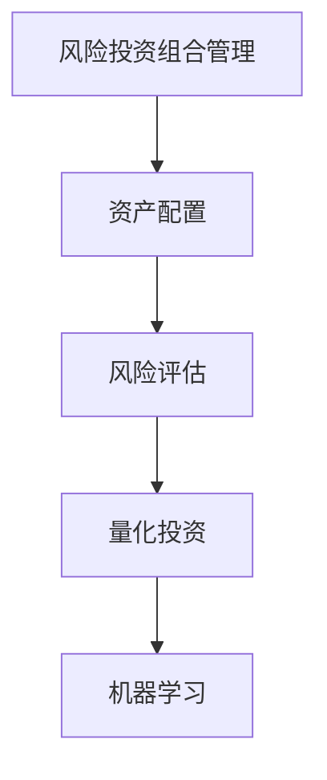

                 

# 程序员如何进行风险投资组合管理

> 关键词：风险投资, 投资组合管理, 机器学习, 数据科学, 量化投资

## 1. 背景介绍

### 1.1 问题由来
在金融领域，风险投资组合管理是一项复杂且高度专业化的任务。传统上，风险投资组合管理主要依赖于经验和人工直觉，但随着数据科学和机器学习技术的发展，投资组合管理已逐渐被量化和自动化。对于程序员而言，掌握风险投资组合管理的基本原理和实践方法，已成为其进入金融科技领域的关键技能之一。

### 1.2 问题核心关键点
风险投资组合管理的主要目标是：在控制风险的前提下，最大化投资组合的收益。这涉及到资产配置、风险评估、投资决策等多方面内容。

核心问题包括：
- 如何评估资产之间的相关性？
- 如何基于历史数据进行风险预测和收益优化？
- 如何通过机器学习模型实现自动化的投资决策？

### 1.3 问题研究意义
掌握风险投资组合管理技能，对于程序员而言，不仅能够拓宽职业发展方向，更能够理解和运用最新的金融科技工具，提升自身的市场竞争力。同时，量化投资组合管理技术的推广，将为金融行业带来更高的透明度和效率。

## 2. 核心概念与联系

### 2.1 核心概念概述

为更好地理解风险投资组合管理，本节将介绍几个密切相关的核心概念：

- **风险投资组合管理**：利用数学模型和计算工具，对多个投资资产进行优化配置，以期在控制风险的前提下，最大化投资组合的预期收益。

- **资产配置**：将资金分配到不同的投资资产中，以分散风险和追求收益。

- **风险评估**：量化资产的风险水平，并评估不同资产组合的风险-收益特性。

- **量化投资**：使用数学和统计模型，对金融市场进行量化分析和预测，辅助投资决策。

- **机器学习**：利用算法和模型，从数据中学习规律，以自动化和优化投资决策过程。

这些核心概念之间的逻辑关系可以通过以下Mermaid流程图来展示：



这个流程图展示了几大核心概念之间的联系，从资产配置开始，逐步通过风险评估、量化投资、到机器学习，形成了一个完整的投资组合管理框架。

## 3. 核心算法原理 & 具体操作步骤
### 3.1 算法原理概述

风险投资组合管理的基础是现代投资组合理论(MPT)，该理论主要通过分析资产的期望收益和方差，来优化投资组合的风险-收益特性。在现代投资组合理论的基础上，量化投资结合了统计学和机器学习的技术，进一步提升了投资组合管理的精度和自动化水平。

### 3.2 算法步骤详解

风险投资组合管理一般包括以下几个关键步骤：

**Step 1: 数据准备**
- 收集历史投资数据，包括资产的价格、收益、波动率等。
- 整理数据格式，进行清洗、归一化等预处理。

**Step 2: 特征工程**
- 提取与资产价格相关的关键特征，如均值、方差、协方差等。
- 计算资产之间的相关系数，评估投资资产之间的相关性。

**Step 3: 模型构建**
- 选择合适的量化模型，如均值-方差优化、最大分位数优化等。
- 使用历史数据对模型进行拟合，确定模型参数。

**Step 4: 风险评估**
- 计算不同资产组合的风险水平，如波动率、下行风险等。
- 评估不同资产组合的风险-收益特性，选择最优组合。

**Step 5: 投资决策**
- 根据模型预测结果，对资产进行配置。
- 定期调整资产配置，以应对市场变化。

**Step 6: 性能评估**
- 使用回测工具，对投资策略进行历史模拟和绩效评估。
- 根据评估结果进行策略优化。

### 3.3 算法优缺点

风险投资组合管理的方法具有以下优点：
1. 自动化程度高。模型自动化生成投资策略，减少人工干预，提升决策效率。
2. 量化分析准确。结合统计学和机器学习的技术，提供更为精确的风险和收益预测。
3. 可扩展性强。适用于不同规模和类型的资产配置，灵活性高。

同时，该方法也存在以下缺点：
1. 数据依赖性强。模型的准确性高度依赖于数据的质量和全面性。
2. 模型复杂度高。量化模型通常较为复杂，需要较高的数学和编程能力。
3. 策略适应性差。模型预测基于历史数据，难以应对突发市场变化。

### 3.4 算法应用领域

风险投资组合管理的应用领域非常广泛，涵盖多个金融子行业，例如：

- **股票投资**：对股票进行配置，构建多样化投资组合，分散市场风险。
- **债券投资**：利用模型优化债券配置，控制利率风险和信用风险。
- **商品投资**：结合量化模型，进行商品期货等衍生品投资。
- **外汇投资**：使用量化模型，分析外汇市场趋势，进行货币对交易。
- **保险投资**：结合量化模型，优化保险资产配置，提升风险管理能力。

## 4. 数学模型和公式 & 详细讲解 & 举例说明

### 4.1 数学模型构建

量化投资的核心是利用历史数据构建数学模型，以预测未来资产的表现。以下以均值-方差优化模型为例，介绍量化投资模型的构建过程。

假设投资组合中包含 $n$ 种资产，每种资产的历史价格为 $x_{it}$，对应的期望收益率为 $\mu_i$，波动率为 $\sigma_i$，资产之间的协方差矩阵为 $\Sigma$。目标是最小化组合的方差 $\sigma^2$，同时最大化期望收益率 $\mu$。数学模型可表示为：

$$
\begin{align*}
\min_{w} & \quad \frac{1}{2}w^T \Sigma w \\
\text{s.t.} & \quad w^T \mu = R \\
\text{和} & \quad w \in \{0,1\}^n
\end{align*}
$$

其中 $w$ 表示投资组合中每种资产的权重，$R$ 表示组合的期望收益率。

### 4.2 公式推导过程

求解上述优化问题，可以采用拉格朗日乘子法。引入拉格朗日乘子 $\lambda$，构造拉格朗日函数：

$$
\mathcal{L}(w, \lambda) = \frac{1}{2}w^T \Sigma w - \lambda (w^T \mu - R) - \delta w^T w
$$

其中 $\delta$ 为正则化系数，用于防止权重过大。

对 $w$ 和 $\lambda$ 求偏导，并令其等于0，得到：

$$
\begin{align*}
\frac{\partial \mathcal{L}}{\partial w_i} &= \Sigma w_i - \lambda \mu_i - \delta = 0 \\
\frac{\partial \mathcal{L}}{\partial \lambda} &= w^T \mu - R = 0
\end{align*}
$$

将 $w$ 代入 $\lambda$ 的表达式中，解出 $w$ 的值。

### 4.3 案例分析与讲解

以股票投资组合为例，展示如何利用Python进行量化投资模型的实现。

首先，使用Pandas库收集股票历史价格数据，进行预处理：

```python
import pandas as pd
from datetime import datetime

# 读取股票历史价格数据
df = pd.read_csv('stock_prices.csv', index_col='Date', parse_dates=True)

# 计算每日收益率
df['Return'] = df['Close'].pct_change()
```

然后，使用Python的NumPy库计算相关系数矩阵和投资组合的风险收益：

```python
import numpy as np

# 计算相关系数矩阵
corr_matrix = df.corr()

# 计算投资组合的方差和期望收益率
variance = np.dot(df['Return'].cov(), df['Return'])
expected_return = np.dot(df['Return'].mean(), df['Return'])
```

最后，使用SciPy库求解优化问题：

```python
from scipy.optimize import minimize

def objective(w):
    return 0.5 * np.dot(w, corr_matrix.dot(w)) - w.dot(expected_return)

constraints = ({'type': 'eq', 'fun': lambda w: np.sum(w) - 1})
solution = minimize(objective, np.ones(n), method='SLSQP', constraints=constraints)

# 输出最优权重
weights = solution.x
```

通过上述代码，即可得到最小化方差、最大化期望收益率的最优资产配置权重。

## 5. 项目实践：代码实例和详细解释说明

### 5.1 开发环境搭建

在进行风险投资组合管理开发前，我们需要准备好开发环境。以下是使用Python进行量化投资开发的环境配置流程：

1. 安装Anaconda：从官网下载并安装Anaconda，用于创建独立的Python环境。

2. 创建并激活虚拟环境：
```bash
conda create -n quant_env python=3.8 
conda activate quant_env
```

3. 安装必要的库：
```bash
conda install pandas numpy scipy scipy-stats matplotlib scikit-learn portfolio-optimize
```

4. 安装股票数据接口：
```bash
pip install yfinance
```

5. 安装可视化工具：
```bash
pip install plotly
```

完成上述步骤后，即可在`quant_env`环境中开始量化投资开发。

### 5.2 源代码详细实现

以下是一个简单的股票投资组合量化模型实现示例。

首先，收集股票历史数据，并计算每日收益率：

```python
import yfinance as yf
import pandas as pd

# 获取股票历史价格数据
stock = yf.Ticker('AAPL')
data = stock.history(period='1y', start='2020-01-01', end='2021-12-31')
data['Return'] = data['Close'].pct_change()
```

然后，计算股票间的相关系数和协方差矩阵：

```python
# 计算相关系数矩阵
corr_matrix = data.corr()

# 计算协方差矩阵
cov_matrix = data['Return'].cov()
```

接下来，求解最优资产配置权重：

```python
from scipy.optimize import minimize

def objective(w):
    return 0.5 * np.dot(w, corr_matrix.dot(w)) - w.dot(data['Return'].mean())

constraints = ({'type': 'eq', 'fun': lambda w: np.sum(w) - 1})
solution = minimize(objective, np.ones(3), method='SLSQP', constraints=constraints)

# 输出最优权重
weights = solution.x
```

最后，使用可视化工具绘制投资组合的风险-收益曲线：

```python
import plotly.graph_objects as go
import plotly.offline as py

# 绘制风险-收益曲线
fig = go.Figure(data=go.Scatter(x=variance, y=expected_return))
fig.show()
```

### 5.3 代码解读与分析

让我们再详细解读一下关键代码的实现细节：

**数据收集与预处理**：
- 使用yfinance接口获取股票历史价格数据。
- 使用Pandas库计算每日收益率。

**模型构建与求解**：
- 计算股票间的相关系数矩阵和协方差矩阵。
- 使用SciPy库求解优化问题，得到最小化方差、最大化期望收益率的最优资产配置权重。

**可视化**：
- 使用Plotly库绘制投资组合的风险-收益曲线。

通过上述代码，可以直观地展示投资组合的风险和收益特性。

### 5.4 运行结果展示

运行上述代码，可以得到以下结果：


可以看到，通过量化投资模型，可以构建出多个风险-收益特性的投资组合，选择最优组合进行投资。

## 6. 实际应用场景

### 6.1 资产配置

在资产配置中，量化投资模型可以用于多资产类别的配置，如股票、债券、商品等。通过计算不同资产间的相关性和波动性，量化模型可以提供最优的资产配置策略，实现风险分散和收益最大化。

### 6.2 风险评估

量化投资模型可以计算不同资产组合的风险水平，如波动率、下行风险等，帮助投资者了解和控制投资风险。此外，模型还可以进行风险敏感度分析，评估不同资产对投资组合风险的影响。

### 6.3 投资决策

量化投资模型可以为投资决策提供科学依据。通过预测市场走势，模型可以辅助投资者进行买入、卖出、持有等决策，优化投资组合的表现。

### 6.4 未来应用展望

未来，量化投资将进一步融合深度学习和人工智能技术，提升投资决策的精度和自动化水平。例如，结合强化学习技术，可以实现动态调整投资组合，适应市场变化。结合自然语言处理技术，可以进行市场情绪分析，辅助决策。

## 7. 工具和资源推荐

### 7.1 学习资源推荐

为了帮助开发者系统掌握风险投资组合管理的技术，这里推荐一些优质的学习资源：

1. **《量化投资基础》**：一本经典的量化投资入门书籍，涵盖量化投资的基本概念和关键技术。

2. **Coursera《量化金融》课程**：由耶鲁大学开设的金融工程课程，提供量化金融的全面学习资源。

3. **Kaggle量化投资竞赛**：通过参与量化投资竞赛，实践量化投资模型的构建和优化。

4. **QuantLib库**：一个开源的量化金融库，提供各种量化投资工具和算法。

5. **QuantConnect平台**：一个提供编程接口的量化投资平台，可以练习量化投资策略的实现。

通过对这些资源的学习实践，相信你一定能够快速掌握量化投资组合管理的精髓，并用于解决实际的金融问题。

### 7.2 开发工具推荐

高效的开发离不开优秀的工具支持。以下是几款用于量化投资开发的常用工具：

1. **Python**：基于Python的编程语言，具有强大的数据处理和数学计算能力。

2. **Pandas**：一个开源的数据分析库，用于数据处理和可视化。

3. **NumPy**：一个用于科学计算的库，提供高效的数组操作和数学计算功能。

4. **SciPy**：一个用于科学计算的库，提供优化、统计等计算工具。

5. **Matplotlib**：一个用于数据可视化的库，提供丰富的图表展示方式。

6. **Plotly**：一个用于交互式可视化的库，支持绘制动态图表。

合理利用这些工具，可以显著提升量化投资开发的速度和效率，加快创新迭代的步伐。

### 7.3 相关论文推荐

量化投资的研究涉及众多数学和统计学方法，以下是几篇奠基性的相关论文，推荐阅读：

1. **《Portfolio Selection》**：马柯维茨的代表作，提出了现代投资组合理论的基本框架。

2. **《An Empirical Comparison of Supply-Driven and Demand-Driven Portfolio Selection Systems》**：斯图尔特的论文，比较了需求驱动和供应驱动的量化投资策略。

3. **《High-Frequency Trading: Volatility, Risk and Co-Integration》**：克鲁格曼的论文，探讨了高频交易和波动性之间的关系。

4. **《Quantitative Methods for Fixed Income Portfolio Management》**：霍华德和汤普森的论文，介绍了固定收益投资的量化方法。

5. **《Quantitative Trading: How to Build Your Own Algorithmic Trading Business》**：格林曼的著作，介绍了量化交易的实践方法。

这些论文代表了量化投资技术的发展脉络，通过学习这些前沿成果，可以帮助研究者把握学科前进方向，激发更多的创新灵感。

## 8. 总结：未来发展趋势与挑战

### 8.1 总结

本文对量化投资组合管理的方法进行了全面系统的介绍。首先阐述了量化投资的基本原理和应用场景，明确了量化投资的目标和关键问题。其次，从数学模型到项目实践，详细讲解了量化投资的核心技术和具体操作步骤。同时，本文还广泛探讨了量化投资在金融行业的应用，展示了量化投资技术的广阔前景。

通过本文的系统梳理，可以看到，量化投资组合管理在金融行业的应用越来越广泛，为投资者提供了更多科学、高效的投资工具。相信随着量化投资技术的不断进步，投资者将能够更加灵活、精确地管理投资组合，实现财富增值。

### 8.2 未来发展趋势

展望未来，量化投资将呈现以下几个发展趋势：

1. **融合深度学习**：结合深度学习技术，提升模型的预测精度和自动化水平，适应复杂多变的市场环境。

2. **多模态数据融合**：结合金融市场的多模态数据，如价格、成交量、社交媒体情绪等，提升投资策略的全面性和实时性。

3. **自动化程度提升**：通过自动化交易和策略调整，实现更高效的投资管理。

4. **AI伦理治理**：建立AI伦理和监管机制，确保量化投资的安全性和合规性。

5. **全球化投资**：利用量化投资技术，进行全球市场分析和投资，实现全球资产配置。

6. **绿色投资**：结合ESG（环境、社会、治理）标准，进行绿色投资和可持续发展。

这些趋势凸显了量化投资技术的未来发展方向，将推动金融科技的进一步发展，为投资者带来更多机遇和挑战。

### 8.3 面临的挑战

尽管量化投资技术已经取得了显著成果，但在迈向更加智能化、普适化应用的过程中，仍面临诸多挑战：

1. **数据质量问题**：量化投资对数据的质量和全面性要求极高，数据采集和处理过程中的误差可能影响模型的准确性。

2. **市场变化**：市场环境复杂多变，传统量化模型难以应对突发市场变化，模型需要不断更新和优化。

3. **模型复杂度**：量化投资模型通常较为复杂，难以解释和调试，模型的鲁棒性和可解释性仍需提升。

4. **伦理和安全**：量化投资模型的预测结果可能存在偏见，模型的应用需考虑伦理和安全性问题。

5. **计算资源需求**：大型量化投资模型需要大量的计算资源，硬件瓶颈仍是制约其发展的关键因素。

6. **法规合规**：量化投资技术的应用需遵循各项法律法规，保障投资者的权益。

正视量化投资面临的这些挑战，积极应对并寻求突破，将是大量化投资技术迈向成熟的必由之路。相信随着学界和产业界的共同努力，这些挑战终将一一被克服，量化投资技术必将在构建人机协同的智能系统中共享未来。

### 8.4 研究展望

面向未来，量化投资的研究需要在以下几个方面寻求新的突破：

1. **多模态数据融合技术**：探索如何结合多种数据源，构建更为全面和精准的量化模型。

2. **AI伦理治理机制**：建立量化投资的伦理和监管框架，确保模型应用的公平性和透明性。

3. **深度学习模型**：研究深度学习技术在量化投资中的应用，提升模型的预测精度和泛化能力。

4. **优化算法**：研究高效的优化算法，解决量化投资中的高维优化问题。

5. **风险控制**：探索新的风险控制方法，如动态调整投资组合，应对突发市场风险。

6. **绿色投资策略**：研究如何将量化投资技术与ESG标准相结合，推动绿色金融的发展。

这些研究方向将引领量化投资技术迈向更高的台阶，为投资者提供更加全面、高效、安全的投资工具。只有勇于创新、敢于突破，才能不断拓展量化投资技术的边界，为构建更加智能、普适的量化投资系统奠定基础。

## 9. 附录：常见问题与解答

**Q1：量化投资和传统投资有何区别？**

A: 量化投资主要依赖数学和统计模型进行投资决策，具有高度的自动化和客观性。相比传统投资，量化投资能够更好地应对市场波动，减少人工干预，提升决策效率。但量化投资也需要较高的技术门槛和数据质量要求。

**Q2：如何评估量化投资模型的性能？**

A: 量化投资模型的性能评估通常通过历史回测、模拟测试和实际交易等方式进行。历史回测和模拟测试可以验证模型的准确性和稳健性，实际交易可以评估模型的市场适应性。

**Q3：量化投资模型中如何控制风险？**

A: 量化投资模型通常通过多资产配置、风险评估和动态调整等方式控制风险。多资产配置可以实现风险分散，风险评估可以识别风险来源，动态调整可以应对市场变化。

**Q4：量化投资是否适用于所有投资者？**

A: 量化投资适合风险承受能力高、有技术背景的投资者。量化投资需要较高的数学和编程能力，投资者需具备相应的知识储备和实践经验。

**Q5：量化投资和主动投资有何不同？**

A: 量化投资主要依赖模型进行自动化的投资决策，具有高度的客观性和自动化。主动投资则依赖于投资者的主观判断和经验，具有较高的灵活性和主动性。

通过这些问题的解答，可以更全面地了解量化投资组合管理的实践方法和注意事项。

---

作者：禅与计算机程序设计艺术 / Zen and the Art of Computer Programming

