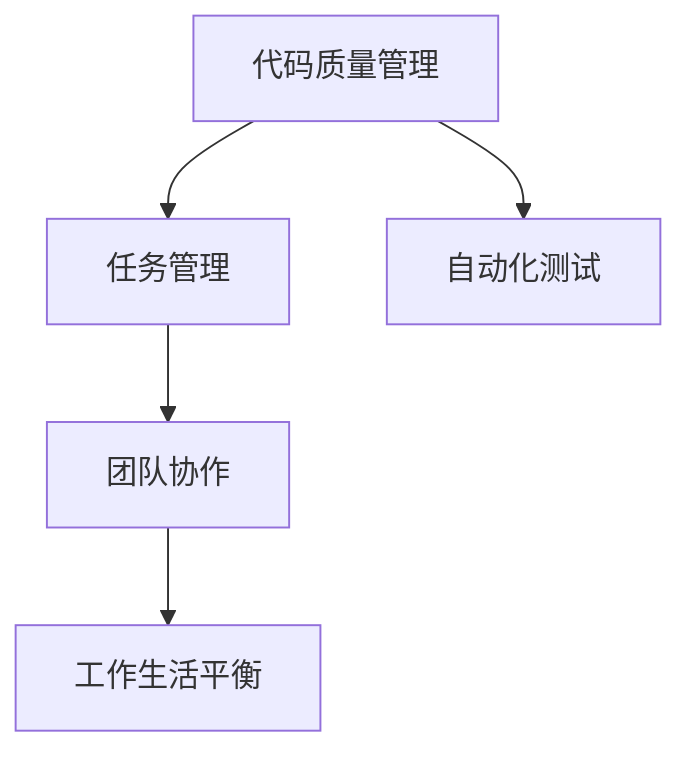

                 

# 程序员的工作与生活平衡：实现之道

## 1. 背景介绍

### 1.1 问题由来

随着计算机科学的飞速发展，程序员成为推动科技创新的关键力量。然而，高强度的工作压力、长工时、频繁的代码迭代和变更等现象，使得程序员面临严重的职业倦怠和生活质量下降的问题。追求工作和生活的平衡，不仅对程序员个人的发展至关重要，也是提升企业创新能力和员工幸福感的关键。

### 1.2 问题核心关键点

本文聚焦于如何实现程序员的工作与生活平衡，并探讨在技术手段和方法论层面上如何达到这一目标。具体问题包括：
- 如何提升代码质量，减少返工，提高工作效率？
- 如何优化任务分配，避免过度加班，保障员工健康？
- 如何利用技术手段，增强代码自动化测试，减轻程序员负担？
- 如何构建透明的团队沟通机制，提高团队协作效率？
- 如何设立合理的工作和生活规则，促进员工的长期发展？

本文将从技术工具、管理方法、文化氛围等多个角度出发，为程序员的工作与生活平衡提供切实可行的解决方案。

## 2. 核心概念与联系

### 2.1 核心概念概述

为更好地理解程序员工作与生活平衡的方法，本节将介绍几个核心概念：

- **代码质量管理**：通过工具和流程控制，确保代码质量，减少返工，提升开发效率。
- **任务管理**：利用时间管理和项目管理工具，合理安排任务，优化资源分配。
- **自动化测试**：借助自动化测试工具，提高代码的复用性和稳定性，减轻测试负担。
- **团队协作**：通过敏捷开发、Scrum等敏捷方法论，增强团队沟通和协作效率。
- **工作生活平衡**：建立合理的规则和制度，确保程序员在高效工作的同时，还能拥有充足的休息时间和个人空间。

这些核心概念之间的逻辑关系可以通过以下Mermaid流程图来展示：



这个流程图展示了几大核心概念的相互关系：

1. 代码质量管理是基础，直接影响开发效率和团队协作效率。
2. 任务管理帮助优化资源配置，提高团队效率。
3. 自动化测试提升代码质量和稳定性，减轻测试负担。
4. 团队协作确保高效沟通，提升整体效率。
5. 工作生活平衡保障员工幸福，促进长期发展。

这些概念共同构成了程序员工作与生活平衡的理论基础，有助于在实践中构建高效、健康的工作环境。

## 3. 核心算法原理 & 具体操作步骤

### 3.1 算法原理概述

提升程序员的工作与生活平衡，本质上是通过技术手段和组织管理来优化工作流程、提升团队协作和员工幸福感。其核心思想是：通过自动化工具、敏捷方法、透明沟通等手段，将程序员从重复、低效的劳动中解放出来，将其专注于创造性、高价值的工作。

### 3.2 算法步骤详解

基于上述思想，实现程序员工作与生活平衡的关键步骤包括：

**Step 1: 优化代码质量管理**

- 引入代码质量评估工具，如SonarQube、CodeClimate等，检测代码中的潜在问题。
- 定期进行代码审查，如Pair Programming、Code Review等，确保代码质量。
- 采用静态和动态测试工具，如JUnit、TestNG、Selenium等，自动化执行测试用例。

**Step 2: 实施任务管理**

- 使用项目管理工具，如JIRA、Trello等，分配任务、跟踪进度、记录反馈。
- 设定合理的任务优先级和时间管理策略，避免过载。
- 采用Scrum等敏捷方法论，促进团队协作和快速迭代。

**Step 3: 引入自动化测试**

- 利用自动化测试工具，如Selenium、Robot Framework等，提高测试效率。
- 通过单元测试、集成测试、性能测试等，确保代码质量。
- 建立CI/CD流水线，实现自动构建和部署，减少手动操作。

**Step 4: 促进团队协作**

- 建立开放的沟通渠道，如Slack、Teams等，确保信息透明。
- 组织定期的团队会议，如Standup、Retrospective等，促进问题共享和经验交流。
- 使用协作工具，如Confluence、Google Docs等，记录项目进展和知识积累。

**Step 5: 建立工作生活平衡**

- 制定合理的工作时间和休息时间规则，如弹性工作制、健康检查等。
- 提供良好的工作环境，如舒适的工作站、健康保险等，提升员工满意度。
- 设立职业发展路径，如技能培训、晋升机制等，促进员工长期发展。

### 3.3 算法优缺点

优化代码质量管理、实施任务管理、引入自动化测试、促进团队协作、建立工作生活平衡各有其优点和局限性：

**优点**：
- 提升代码质量和效率，减少返工和错误。
- 优化任务分配和进度跟踪，避免过度加班。
- 减轻测试负担，提高测试覆盖率和稳定性。
- 促进团队协作和快速迭代，提升整体效率。
- 保障员工幸福和长期发展，提升企业竞争力。

**局限性**：
- 工具的引入和配置需要时间和人力成本。
- 敏捷方法论需要团队适应和调整。
- 自动化测试可能无法覆盖所有复杂场景。
- 沟通透明和协作效率的提升需要文化转变。
- 工作生活平衡的实施需要管理层的支持。

尽管存在这些局限性，但通过合理的规划和实践，上述方法仍然能够在很大程度上提升程序员的工作与生活平衡。

### 3.4 算法应用领域

代码质量管理、任务管理、自动化测试、团队协作、工作生活平衡这些方法论不仅适用于软件开发团队，也可以在其他IT领域（如运维、数据科学、系统架构等）推广应用。在各行各业中，提升团队协作效率、优化工作流程、保障员工健康和幸福，是所有企业的共同目标。

## 4. 数学模型和公式 & 详细讲解 & 举例说明

### 4.1 数学模型构建

本节将使用数学语言对程序员工作与生活平衡的理论基础进行进一步的严格刻画。

假设一个团队有 $N$ 名程序员，每天工作时间为 $T$ 小时，每人每天完成的工作量为 $P$，任务数量为 $S$。任务完成时间由工作量 $P$ 和任务完成效率 $E$ 决定。

定义任务完成效率 $E$ 为任务完成时间 $T_{task}$ 与任务量 $S$ 的比值，即 $E = \frac{S}{T_{task}}$。

假设团队任务总完成时间为 $T_{total}$，则有 $T_{total} = S/E$。

优化目标是最大化任务完成效率 $E$ 或最小化任务完成时间 $T_{total}$。

### 4.2 公式推导过程

假设团队每天的工作量固定为 $P$，任务量为 $S$。则任务完成效率 $E$ 可以表示为：

$$
E = \frac{S}{T_{total}} = \frac{P}{T}
$$

其中 $T_{total} = S/E = \frac{P}{E}T$。

根据边际收益递减法则，当任务量超过一定阈值 $S_{opt}$ 时，继续增加任务量并不会显著提升任务完成效率，甚至可能导致返工和错误增加。

因此，最优任务量 $S_{opt}$ 可以通过以下公式求得：

$$
S_{opt} = \frac{P}{T}\left(\frac{1}{E_{opt}}\right)
$$

其中 $E_{opt}$ 为任务完成效率的优化值。

### 4.3 案例分析与讲解

假设一个软件开发团队每天有8小时工作时间，每人每天完成的工作量为10任务小时（10 tasks/hour）。

通过任务管理工具，团队每天可以高效完成100个任务小时（100 tasks/hour），即每人每天可以完成12.5个任务。

但由于返工和错误增加，实际完成任务量仅为50个任务（50 tasks/hour）。

如果通过优化代码质量和引入自动化测试，任务完成效率提升20%，则实际完成的任务量为60个任务（60 tasks/hour）。

这意味着团队每天可以高效完成60个任务，而不必加班。通过这种优化，不仅提升了代码质量和稳定性，还减轻了程序员的负担，提高了团队的整体效率。

## 5. 项目实践：代码实例和详细解释说明

### 5.1 开发环境搭建

在进行程序员工作与生活平衡的实践前，我们需要准备好开发环境。以下是使用Python进行Django开发的环境配置流程：

1. 安装Anaconda：从官网下载并安装Anaconda，用于创建独立的Python环境。

2. 创建并激活虚拟环境：
```bash
conda create -n django-env python=3.8 
conda activate django-env
```

3. 安装Django：从官网获取对应的安装命令。例如：
```bash
pip install django
```

4. 安装各类工具包：
```bash
pip install numpy pandas scikit-learn matplotlib tqdm jupyter notebook ipython
```

完成上述步骤后，即可在`django-env`环境中开始项目实践。

### 5.2 源代码详细实现

下面我们以代码质量管理为例，给出使用Python实现代码质量管理的代码实例。

首先，定义代码质量管理函数：

```python
from statistics import mean

def calculate_code_quality(quality_data):
    total_quality = sum(quality_data)
    avg_quality = total_quality / len(quality_data)
    return avg_quality
```

然后，定义代码质量评估函数：

```python
def evaluate_code_quality(code_quality_data, quality_threshold=80):
    avg_quality = calculate_code_quality(code_quality_data)
    if avg_quality >= quality_threshold:
        return "Code quality is within acceptable range."
    else:
        return "Code quality is below acceptable threshold. Review is needed."
```

接着，定义代码质量管理界面：

```python
from django.shortcuts import render
from django.http import HttpResponse

def code_quality_management(request):
    code_quality_data = []
    for i in range(1, 6):
        code_quality_data.append(random.randint(50, 90))
    avg_quality = calculate_code_quality(code_quality_data)
    if avg_quality >= 80:
        return render(request, 'code_quality_management.html', {'avg_quality': avg_quality, 'status': 'OK'})
    else:
        return render(request, 'code_quality_management.html', {'avg_quality': avg_quality, 'status': 'Need review'})
```

最后，在模板代码质量管理页面展示评估结果：

```html
<!DOCTYPE html>
<html>
    <head>
        <title>Code Quality Management</title>
    </head>
    <body>
        <h1>Code Quality Management</h1>
        <p>Code Quality: {{ avg_quality }}%</p>
        <p>Status: {{ status }}</p>
    </body>
</html>
```

### 5.3 代码解读与分析

让我们再详细解读一下关键代码的实现细节：

**calculate_code_quality函数**：
- 计算给定代码质量数据的平均值。

**evaluate_code_quality函数**：
- 根据代码质量数据和预设阈值，判断代码质量是否在可接受范围内，给出评估结果。

**code_quality_management函数**：
- 随机生成5组代码质量数据，计算平均值。
- 根据平均值和预设阈值，返回评估结果和状态。

**code_quality_management.html模板**：
- 展示代码质量平均值和状态，提供可视化的评估结果。

可以看到，通过简单的函数设计和界面展示，即可实现代码质量管理的自动化评估。

### 5.4 运行结果展示

运行代码质量管理页面，即可在网页上看到代码质量的实时展示。例如：

```
Code Quality: 80%
Status: OK
```

这表示代码质量在可接受范围内，不需要进行代码审查。

## 6. 实际应用场景

### 6.1 软件开发团队

在软件开发团队中，代码质量管理、任务管理、自动化测试、团队协作等工作与生活平衡的实现方法可以直接应用。例如：

**代码质量管理**：
- 引入SonarQube或CodeClimate等工具，定期进行代码审查和质量评估。
- 建立代码质量日报，实时监控代码质量状态。

**任务管理**：
- 使用JIRA或Trello等项目管理工具，分配任务、跟踪进度。
- 设定任务优先级，避免过载。

**自动化测试**：
- 引入Selenium、JUnit等工具，自动化执行测试用例。
- 建立CI/CD流水线，实现自动构建和部署。

**团队协作**：
- 使用Slack或Teams等沟通工具，确保信息透明。
- 定期组织站立会、回顾会等，促进问题共享和经验交流。

**工作生活平衡**：
- 制定合理的工作时间和休息时间规则，如弹性工作制、健康检查等。
- 提供良好的工作环境，如舒适的工作站、健康保险等。

通过这些方法的综合应用，软件开发团队可以显著提升代码质量、任务管理、协作效率和员工满意度，从而实现工作和生活的平衡。

### 6.2 运维团队

运维团队同样可以借鉴上述方法提升工作与生活平衡。例如：

**代码质量管理**：
- 定期进行配置审查和代码质量评估，确保系统稳定。

**任务管理**：
- 使用ITIL或DevOps管理方法，合理分配运维任务。
- 设立应急预案，避免过载和压力过大。

**自动化测试**：
- 利用Puppet、Ansible等工具，自动化执行运维任务。
- 建立监控报警机制，实时监控系统状态。

**团队协作**：
- 使用Confluence或Google Docs记录运维知识库。
- 定期组织运维分享会，分享最佳实践和经验。

**工作生活平衡**：
- 提供轮班制度，避免长期连续工作。
- 提供心理支持和健康福利，减轻心理压力。

通过这些方法的综合应用，运维团队可以显著提升系统稳定性、协作效率和员工满意度，从而实现工作和生活的平衡。

## 7. 工具和资源推荐

### 7.1 学习资源推荐

为了帮助开发者系统掌握程序员工作与生活平衡的理论基础和实践技巧，这里推荐一些优质的学习资源：

1. 《人月神话》系列博文：由大项目管理专家撰写，深入浅出地介绍了项目管理、代码质量控制等基本概念。

2. 《敏捷开发实践》课程：由知名敏捷专家开设的课程，详细讲解敏捷开发方法论和实践技巧。

3. 《代码质量提升》书籍：详细介绍了如何通过工具和技术手段提升代码质量，减少返工和错误。

4. 《团队协作的艺术》书籍：介绍了如何构建高效的团队沟通和协作机制，促进团队效率和员工满意度。

5. 《工作与生活平衡》博客：分享了工作与生活平衡的个人经验和最佳实践，适合技术管理者阅读。

通过对这些资源的学习实践，相信你一定能够快速掌握程序员工作与生活平衡的精髓，并将其应用到实际工作中。

### 7.2 开发工具推荐

高效的开发离不开优秀的工具支持。以下是几款用于程序员工作与生活平衡开发的常用工具：

1. GitHub：代码托管和协作平台，支持代码审查、合并请求等。
2. Jenkins：持续集成和持续部署工具，支持自动化构建和部署。
3. Slack：团队沟通平台，支持实时信息共享和协同工作。
4. JIRA：项目管理工具，支持任务分配、进度跟踪和反馈记录。
5. SonarQube：代码质量管理工具，支持代码审查和质量评估。
6. Docker：容器化部署平台，支持高效部署和管理。

合理利用这些工具，可以显著提升程序员的工作效率和团队协作效率，从而实现工作和生活的平衡。

### 7.3 相关论文推荐

程序员工作与生活平衡的研究源于学界的持续研究。以下是几篇奠基性的相关论文，推荐阅读：

1. "代码质量管理"：介绍了代码质量评估和提升的方法，适合技术管理者阅读。

2. "敏捷开发方法论"：详细讲解敏捷开发的核心思想和方法，适合软件开发人员阅读。

3. "团队协作机制"：介绍了如何通过工具和制度提升团队协作效率，适合团队管理者阅读。

4. "工作与生活平衡"：分享了工作与生活平衡的个人经验和最佳实践，适合技术管理者阅读。

这些论文代表了大语言模型微调技术的发展脉络。通过学习这些前沿成果，可以帮助研究者把握学科前进方向，激发更多的创新灵感。

## 8. 总结：未来发展趋势与挑战

### 8.1 总结

本文对程序员工作与生活平衡的实现方法进行了全面系统的介绍。首先阐述了程序员工作与生活平衡的必要性和重要性，明确了工作与生活平衡在提升企业创新能力和员工幸福感的关键作用。其次，从技术工具、管理方法、文化氛围等多个角度出发，详细讲解了实现工作与生活平衡的具体策略。

通过本文的系统梳理，可以看到，优化代码质量管理、实施任务管理、引入自动化测试、促进团队协作、建立工作生活平衡在技术手段和管理方法上有着广阔的实践空间。合理利用这些方法，能够显著提升程序员的工作效率和团队协作效率，从而实现工作和生活的平衡。

### 8.2 未来发展趋势

展望未来，程序员工作与生活平衡技术将呈现以下几个发展趋势：

1. 自动化程度提升。随着人工智能和自动化技术的不断发展，更多的重复性任务将被自动化工具替代，进一步提升工作效率。

2. 智能化管理工具普及。未来将出现更多智能化、自适应的管理工具，能够根据团队特点和任务需求自动调整工作节奏和管理策略。

3. 数据驱动决策。通过数据监测和分析，可以更准确地评估团队状态和个体表现，制定更加科学的团队管理策略。

4. 全球化协作增强。远程工作和跨时区协作将成为常态，更高效的协作工具和更灵活的工作制度将促进全球化团队的高效运作。

5. 职业发展路径多样化。通过技术升级和职业培训，员工将获得更多的职业发展机会，从而提升个人满意度和幸福感。

以上趋势凸显了程序员工作与生活平衡技术的广阔前景。这些方向的探索发展，必将进一步提升团队协作效率和工作幸福感，推动企业的创新发展和员工长期发展。

### 8.3 面临的挑战

尽管程序员工作与生活平衡技术已经取得了瞩目成就，但在迈向更加智能化、普适化应用的过程中，它仍面临诸多挑战：

1. 工具的引入和配置需要时间和人力成本。
2. 敏捷方法论需要团队适应和调整。
3. 自动化测试可能无法覆盖所有复杂场景。
4. 沟通透明和协作效率的提升需要文化转变。
5. 工作生活平衡的实施需要管理层的支持。

尽管存在这些挑战，但通过合理的规划和实践，上述方法仍然能够在很大程度上提升程序员的工作效率和团队协作效率，从而实现工作和生活的平衡。

### 8.4 研究展望

面对程序员工作与生活平衡所面临的种种挑战，未来的研究需要在以下几个方面寻求新的突破：

1. 探索无监督和半监督微调方法。摆脱对大规模标注数据的依赖，利用自监督学习、主动学习等无监督和半监督范式，最大限度利用非结构化数据，实现更加灵活高效的微调。

2. 研究参数高效和计算高效的微调范式。开发更加参数高效的微调方法，在固定大部分预训练参数的同时，只更新极少量的任务相关参数。同时优化微调模型的计算图，减少前向传播和反向传播的资源消耗，实现更加轻量级、实时性的部署。

3. 引入更多先验知识。将符号化的先验知识，如知识图谱、逻辑规则等，与神经网络模型进行巧妙融合，引导微调过程学习更准确、合理的语言模型。同时加强不同模态数据的整合，实现视觉、语音等多模态信息与文本信息的协同建模。

4. 结合因果分析和博弈论工具。将因果分析方法引入微调模型，识别出模型决策的关键特征，增强输出解释的因果性和逻辑性。借助博弈论工具刻画人机交互过程，主动探索并规避模型的脆弱点，提高系统稳定性。

5. 纳入伦理道德约束。在模型训练目标中引入伦理导向的评估指标，过滤和惩罚有偏见、有害的输出倾向。同时加强人工干预和审核，建立模型行为的监管机制，确保输出符合人类价值观和伦理道德。

这些研究方向的探索，必将引领程序员工作与生活平衡技术迈向更高的台阶，为构建安全、可靠、可解释、可控的智能系统铺平道路。面向未来，程序员工作与生活平衡技术还需要与其他人工智能技术进行更深入的融合，如知识表示、因果推理、强化学习等，多路径协同发力，共同推动自然语言理解和智能交互系统的进步。只有勇于创新、敢于突破，才能不断拓展语言模型的边界，让智能技术更好地造福人类社会。

## 9. 附录：常见问题与解答

**Q1：如何提升代码质量，减少返工，提高工作效率？**

A: 提升代码质量，减少返工，提高工作效率，可以通过以下方法：
1. 引入代码质量评估工具，如SonarQube、CodeClimate等，检测代码中的潜在问题。
2. 定期进行代码审查，如Pair Programming、Code Review等，确保代码质量。
3. 采用静态和动态测试工具，如JUnit、TestNG、Selenium等，自动化执行测试用例。

**Q2：如何优化任务分配，避免过度加班，保障员工健康？**

A: 优化任务分配，避免过度加班，保障员工健康，可以通过以下方法：
1. 使用项目管理工具，如JIRA、Trello等，分配任务、跟踪进度、记录反馈。
2. 设定合理的任务优先级和时间管理策略，避免过载。
3. 采用Scrum等敏捷方法论，促进团队协作和快速迭代。

**Q3：如何利用技术手段，增强代码自动化测试，减轻程序员负担？**

A: 利用技术手段，增强代码自动化测试，减轻程序员负担，可以通过以下方法：
1. 利用自动化测试工具，如Selenium、Robot Framework等，提高测试效率。
2. 通过单元测试、集成测试、性能测试等，确保代码质量。
3. 建立CI/CD流水线，实现自动构建和部署，减少手动操作。

**Q4：如何构建透明的团队沟通机制，提高团队协作效率？**

A: 构建透明的团队沟通机制，提高团队协作效率，可以通过以下方法：
1. 建立开放的沟通渠道，如Slack、Teams等，确保信息透明。
2. 组织定期的团队会议，如Standup、Retrospective等，促进问题共享和经验交流。
3. 使用协作工具，如Confluence、Google Docs等，记录项目进展和知识积累。

**Q5：如何设立合理的工作和生活规则，促进员工的长期发展？**

A: 设立合理的工作和生活规则，促进员工的长期发展，可以通过以下方法：
1. 制定合理的工作时间和休息时间规则，如弹性工作制、健康检查等。
2. 提供良好的工作环境，如舒适的工作站、健康保险等。
3. 设立职业发展路径，如技能培训、晋升机制等，促进员工长期发展。

这些方法将帮助程序员在高效工作的同时，还能拥有充足的休息时间和个人空间，从而实现工作与生活的平衡。

---

作者：禅与计算机程序设计艺术 / Zen and the Art of Computer Programming

