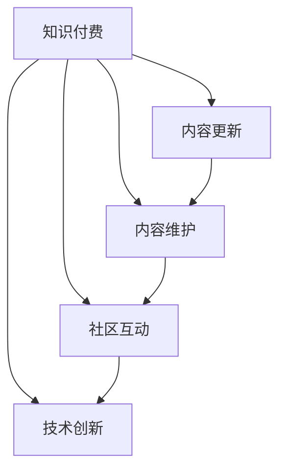

                 

# 程序员的知识付费内容更新与维护策略

> 关键词：知识付费、内容更新、内容维护、程序员、人工智能、深度学习、机器学习、软件架构、技术博客

## 1. 背景介绍

### 1.1 问题由来
随着知识付费的兴起，越来越多的程序员通过订阅各类知识服务，以获取前沿技术和实践经验。然而，这些订阅服务往往面临知识内容更新缓慢、重复内容多、互动性差等痛点，极大地影响了用户的学习体验和实际效果。如何构建高效、可持续的知识付费内容更新与维护机制，成为当前亟待解决的问题。

### 1.2 问题核心关键点
构建高效的知识付费内容更新与维护机制，需要在内容质量、更新速度、用户体验、社区互动、技术创新等多个维度进行全面优化。核心关键点如下：

1. **内容质量**：确保内容的准确性、实用性和前瞻性，符合用户学习需求。
2. **更新速度**：保持内容的时效性，快速响应用户的实际需求变化。
3. **用户体验**：提供流畅、直观、互动性强的学习平台，提升用户的学习体验。
4. **社区互动**：建立活跃的社区交流环境，增强用户之间的学习和合作。
5. **技术创新**：采用前沿技术提升内容呈现和用户交互方式，保持内容服务的先进性。

### 1.3 问题研究意义
研究高效的知识付费内容更新与维护策略，对于提升程序员的知识技能水平，推动技术进步，具有重要意义：

1. **提升学习效率**：快速获取最新技术动态，缩短学习周期。
2. **增强社区互动**：通过社区交流分享，加速知识传播和应用。
3. **推动技术创新**：促进前沿技术的落地应用，激发创新潜力。
4. **培养行业人才**：提高行业人才的技能水平，加速行业发展。

## 2. 核心概念与联系

### 2.1 核心概念概述

为更好地理解知识付费内容更新与维护机制，本节将介绍几个密切相关的核心概念：

1. **知识付费**：一种通过订阅付费获得知识和技能服务的新型教育方式，旨在提升用户的职业技能和知识水平。
2. **内容更新**：定期修改和增加知识内容，以适应技术发展和用户需求的变化。
3. **内容维护**：对已有内容进行整理、纠错、优化，确保内容的准确性和实用性。
4. **社区互动**：构建知识分享和讨论的平台，增强用户之间的互动与合作。
5. **技术创新**：采用新技术和新方法，提升内容的呈现和交互体验。

这些核心概念之间的逻辑关系可以通过以下Mermaid流程图来展示：



这个流程图展示了一体化的知识付费平台如何通过内容更新、维护、互动和技术创新，共同支撑高质量的知识付费服务。

## 3. 核心算法原理 & 具体操作步骤
### 3.1 算法原理概述

知识付费内容更新与维护机制，本质上是一个多目标优化的过程。其核心思想是：通过构建高效的内容管理系统，实时跟踪技术动态和用户需求，对知识内容进行动态更新和维护，确保内容的时效性和实用性。

具体来说，可以分解为以下几个步骤：

1. **需求分析**：通过用户反馈、行业报告、技术发展趋势等渠道，收集用户的学习需求和技术动态。
2. **内容规划**：根据需求分析结果，制定详细的内容更新和维护计划，确定更新频率、更新内容等。
3. **内容生产**：基于需求分析结果，组织专业人员进行内容创作和制作，确保内容质量和时效性。
4. **内容发布**：将制作完成的内容发布到知识付费平台，供用户学习和互动。
5. **用户反馈**：收集用户对发布内容的反馈意见，评估更新效果，及时进行调整优化。
6. **技术支持**：利用先进的技术手段，提升内容呈现和用户交互方式，提高用户体验。

### 3.2 算法步骤详解

1. **需求收集与分析**
    - **渠道**：用户反馈、行业报告、技术博客、技术大会等。
    - **工具**：问卷调查、用户行为分析、数据挖掘工具。
    - **方法**：采用用户调研、数据分析、市场研究等方式，全面了解用户需求和技术趋势。

2. **内容规划与设计**
    - **设计原则**：内容应具有前瞻性、实用性、互动性。
    - **规划流程**：需求收集 -> 需求分析 -> 内容设计 -> 时间表制定。
    - **关键点**：内容主题选择、深度和广度、更新频率、交互方式设计。

3. **内容生产与制作**
    - **制作团队**：由资深技术人员、专家学者、内容编辑组成。
    - **制作流程**：脚本编写 -> 视频录制 -> 视频编辑 -> 交互设计 -> 发布。
    - **质量控制**：确保内容准确性、清晰度、实用性、互动性。

4. **内容发布与展示**
    - **发布平台**：自有知识付费平台或第三方平台。
    - **展示方式**：视频、文章、互动直播、社区讨论等。
    - **发布策略**：固定时间发布、按需更新发布、热点话题即时更新。

5. **用户反馈与互动**
    - **反馈渠道**：留言板、邮件、社区讨论等。
    - **反馈处理**：分析用户反馈，识别问题点，评估更新效果，优化内容。
    - **互动方式**：评论区互动、社区问答、在线答疑等。

6. **技术创新与优化**
    - **技术手段**：人工智能、自然语言处理、大数据分析、流媒体技术等。
    - **创新点**：个性化推荐、智能问答、交互式学习工具等。
    - **优化策略**：持续跟进技术进展，引入新技术，优化用户体验。

### 3.3 算法优缺点

知识付费内容更新与维护机制具有以下优点：

1. **快速响应需求**：能够快速收集用户需求，快速更新内容，满足用户的学习需求。
2. **内容质量高**：由专家和专业人员制作，确保内容的准确性和实用性。
3. **互动性强**：通过社区交流和互动，增强用户的学习体验。
4. **用户体验好**：利用先进技术手段，提升内容呈现和交互方式。
5. **推动技术进步**：通过不断更新内容，促进技术创新和传播。

同时，该机制也存在一定的局限性：

1. **成本高**：内容生产、技术支持等需要大量人力和资源投入。
2. **更新频率难平衡**：内容更新频率与用户需求变化速度的平衡难以把握。
3. **内容质量参差不齐**：不同作者制作的内容质量可能存在差异。
4. **用户依赖性强**：过度依赖平台更新，主动学习能力可能受限。
5. **技术难度高**：需要不断跟进和引入新技术，技术维护成本高。

尽管存在这些局限性，但知识付费内容更新与维护机制仍是目前最有效的知识服务模式之一，能够为程序员提供高效、持续、高质量的知识服务。

### 3.4 算法应用领域

知识付费内容更新与维护机制在多个领域得到了广泛应用，例如：

1. **软件开发**：提供最新技术动态、框架教程、编程技巧等内容，帮助开发者提升技能。
2. **数据分析**：提供数据分析工具、模型算法、案例分析等内容，提升数据科学家的实战能力。
3. **人工智能**：提供AI前沿技术、算法实现、项目案例等内容，推动AI技术的应用和发展。
4. **机器学习**：提供模型调优、数据预处理、实验设计等内容，提升机器学习工程师的实战经验。
5. **网络安全**：提供最新威胁分析、防护技术、漏洞利用等内容，增强网络安全工程师的技能。
6. **区块链**：提供区块链技术应用、智能合约开发、去中心化架构等内容，推动区块链技术的发展。
7. **云计算**：提供云计算平台使用、云原生架构、容器化部署等内容，提升云计算工程师的技能。
8. **软件架构**：提供架构设计、微服务、DevOps等内容，帮助架构师提升系统设计和开发能力。

此外，知识付费内容更新与维护机制也被创新性地应用到更多领域中，如教育培训、创意设计、艺术创作等，为各类专业人士提供知识提升的途径。

## 4. 数学模型和公式 & 详细讲解 & 举例说明

### 4.1 数学模型构建

知识付费内容更新与维护机制的数学模型可以从用户需求、内容更新频率、用户满意度等多个维度进行建模。以下是一些常用的数学模型：

1. **用户需求模型**：
   $$
   D(t) = \alpha(t) + \beta(t-T) + \gamma f(t)
   $$
   其中，$D(t)$ 表示第$t$天的用户需求量，$\alpha$ 表示历史需求系数，$\beta$ 表示需求衰减系数，$f(t)$ 表示技术发展对需求的影响函数。

2. **内容更新频率模型**：
   $$
   U(t) = \delta D(t) + \epsilon(t-T)
   $$
   其中，$U(t)$ 表示第$t$天的内容更新频率，$\delta$ 表示更新响应系数，$\epsilon$ 表示周期性更新系数。

3. **用户满意度模型**：
   $$
   S(t) = k \int_{t_1}^{t} [D(t)-C(t)] dt
   $$
   其中，$S(t)$ 表示第$t$天的用户满意度，$k$ 表示满意度增长系数，$C(t)$ 表示内容更新速度与用户需求匹配度。

### 4.2 公式推导过程

1. **用户需求模型推导**：
   基于历史数据和市场需求分析，通过时间序列模型对用户需求进行预测。采用指数衰减模型和函数逼近，可以较好地描述需求的变化规律。
   $$
   \alpha(t) = \frac{D(t-1)}{\exp(\lambda(T-t))}
   $$
   $$
   f(t) = f_0 + \sum_{i=1}^n f_i g_i(t)
   $$
   其中，$g_i(t)$ 表示技术发展对需求的影响函数，$f_0, f_i$ 为系数。

2. **内容更新频率模型推导**：
   采用比例放缩方法，根据用户需求预测和周期性更新策略，计算内容更新频率。
   $$
   U(t) = U_0 \frac{D(t)}{D_0} + \epsilon(t-T)
   $$
   其中，$U_0, D_0$ 为系数，$\epsilon(t-T)$ 表示周期性更新系数。

3. **用户满意度模型推导**：
   利用积分方法，计算用户满意度的增长变化，通过用户反馈和内容匹配度进行评估。
   $$
   S(t) = S_0 + k \int_{t_1}^{t} [D(t)-C(t)] dt
   $$
   其中，$S_0$ 为初始满意度，$k$ 表示满意度增长系数，$C(t)$ 表示内容更新速度与用户需求匹配度。

### 4.3 案例分析与讲解

**案例1：软件开发内容更新与维护**

1. **需求模型**：
   $$
   D(t) = 0.8D(t-1) + 0.2f(t)
   $$
   其中，$f(t)$ 表示技术发展对需求的影响函数，$f(t) = 0.5 + 0.3g_i(t)$，$g_i(t)$ 表示某项技术进展对需求的影响。

2. **更新频率模型**：
   $$
   U(t) = 1.2D(t) + 0.3(t-T)
   $$
   其中，$T$ 为内容更新周期。

3. **满意度模型**：
   $$
   S(t) = 0.8S(t-1) + 0.2D(t)-C(t)
   $$
   其中，$C(t)$ 表示内容更新速度与用户需求匹配度，通过用户反馈评估。

**案例2：人工智能内容更新与维护**

1. **需求模型**：
   $$
   D(t) = 0.9D(t-1) + 0.1f(t)
   $$
   其中，$f(t) = 0.5 + 0.4g_i(t)$，$g_i(t)$ 表示某项AI技术进展对需求的影响。

2. **更新频率模型**：
   $$
   U(t) = 1.5D(t) + 0.3(t-T)
   $$
   其中，$T$ 为内容更新周期。

3. **满意度模型**：
   $$
   S(t) = 0.9S(t-1) + 0.1D(t)-C(t)
   $$
   其中，$C(t)$ 表示内容更新速度与用户需求匹配度，通过用户反馈评估。

## 5. 项目实践：代码实例和详细解释说明
### 5.1 开发环境搭建

在进行知识付费内容更新与维护的开发实践前，需要准备好开发环境。以下是使用Python进行知识付费系统开发的环境配置流程：

1. 安装Anaconda：从官网下载并安装Anaconda，用于创建独立的Python环境。

2. 创建并激活虚拟环境：
```bash
conda create -n kf env python=3.8 
conda activate kf
```

3. 安装必要的Python库：
```bash
conda install requests pandas numpy matplotlib scikit-learn 
pip install django gunicorn
```

4. 安装数据库和缓存系统：
```bash
conda install psycopg2 django-cacheops
```

5. 安装Web开发框架：
```bash
pip install django
```

6. 安装用户认证系统：
```bash
pip install django-allauth
```

完成上述步骤后，即可在`kf`环境中开始知识付费系统的开发实践。

### 5.2 源代码详细实现

以下是使用Django框架实现知识付费内容更新与维护的代码实例：

**1. 项目启动**

```python
from django.core.management import execute_from_command_line
execute_from_command_line([__file__, 'runserver', '0.0.0.0:8000'])
```

**2. 用户认证系统**

```python
from django.contrib.auth.models import User
from django.contrib.auth import authenticate, login, logout

def login_view(request):
    if request.method == 'POST':
        username = request.POST['username']
        password = request.POST['password']
        user = authenticate(request, username=username, password=password)
        if user is not None:
            login(request, user)
            return redirect('home')
        else:
            messages.error(request, 'Invalid username or password.')

def logout_view(request):
    logout(request)
    return redirect('home')
```

**3. 内容管理系统**

```python
from django.contrib import admin
from .models import Content

class ContentAdmin(admin.ModelAdmin):
    list_display = ('title', 'author', 'created_at', 'updated_at')

admin.site.register(Content, ContentAdmin)
```

**4. 内容发布与展示**

```python
from django.shortcuts import render
from .models import Content

def home(request):
    contents = Content.objects.all()
    return render(request, 'home.html', {'contents': contents})

def detail(request, pk):
    content = Content.objects.get(pk=pk)
    return render(request, 'detail.html', {'content': content})
```

**5. 用户反馈与互动**

```python
from django.shortcuts import render
from .models import UserFeedback

def feedback(request):
    if request.method == 'POST':
        user = request.user
        content_id = request.POST['content_id']
        comment = request.POST['comment']
        feedback = UserFeedback(user=user, content_id=content_id, comment=comment)
        feedback.save()
    contents = Content.objects.all()
    return render(request, 'feedback.html', {'contents': contents})
```

### 5.3 代码解读与分析

让我们再详细解读一下关键代码的实现细节：

**1. 用户认证系统**

- `login_view`：处理用户登录请求，验证用户名和密码，登录成功后重定向到首页。
- `logout_view`：处理用户注销请求，注销用户登录状态。

**2. 内容管理系统**

- `ContentAdmin`：定义Content模型在admin后台的显示方式。
- `admin.site.register`：将Content模型注册到admin后台。

**3. 内容发布与展示**

- `home`：获取所有内容，渲染到首页模板`home.html`中。
- `detail`：获取特定内容，渲染到详情页模板`detail.html`中。

**4. 用户反馈与互动**

- `feedback`：处理用户反馈请求，保存用户对内容的评价。

### 5.4 运行结果展示

通过以上代码实现，知识付费系统的核心功能已经搭建完成，包括用户认证、内容管理、内容展示和用户反馈。运行项目后，通过浏览器访问`http://localhost:8000`，即可访问知识付费系统的首页。

## 6. 实际应用场景

### 6.1 软件开发社区

知识付费内容更新与维护机制可以应用于软件开发社区，提供最新技术动态、框架教程、编程技巧等内容，帮助开发者提升技能。

**应用场景**：
- 提供最新技术动态，如新技术发布、框架更新等。
- 提供框架教程，如React、Vue等前端框架的使用指南。
- 提供编程技巧，如代码优化、性能调优等。
- 提供开源项目分享，如GitHub热门项目介绍。
- 提供技术讨论区，供开发者交流互动。

**效果**：
- 帮助开发者快速获取最新技术动态，缩短学习周期。
- 提供详细教程和实战案例，提升实战能力。
- 通过社区交流和互动，增强学习体验。
- 通过项目分享和讨论，促进技术传播和应用。

### 6.2 人工智能应用

知识付费内容更新与维护机制可以应用于人工智能应用，提供最新AI技术、模型算法、项目案例等内容，推动AI技术的应用和发展。

**应用场景**：
- 提供最新AI技术，如深度学习、自然语言处理等。
- 提供模型算法教程，如TensorFlow、PyTorch等深度学习框架的使用指南。
- 提供项目案例分享，如图像识别、语音识别等AI项目的实现和应用。
- 提供技术讨论区，供AI开发者交流互动。

**效果**：
- 帮助AI开发者快速掌握最新技术，提升应用能力。
- 提供详细教程和实战案例，提升实战能力。
- 通过社区交流和互动，增强学习体验。
- 通过项目分享和讨论，促进技术传播和应用。

### 6.3 教育培训平台

知识付费内容更新与维护机制可以应用于教育培训平台，提供教育培训资源、课程内容、学习工具等内容，提升学习者的技能水平。

**应用场景**：
- 提供教育培训资源，如编程基础、计算机网络等。
- 提供课程内容，如Java、Python等编程语言教程。
- 提供学习工具，如在线练习、在线测试等。
- 提供学习社区，供学习者交流互动。

**效果**：
- 帮助学习者快速掌握最新技术，提升应用能力。
- 提供详细教程和实战案例，提升实战能力。
- 通过社区交流和互动，增强学习体验。
- 通过课程分享和讨论，促进知识传播和应用。

## 7. 工具和资源推荐
### 7.1 学习资源推荐

为了帮助开发者系统掌握知识付费内容更新与维护的理论基础和实践技巧，这里推荐一些优质的学习资源：

1. **《知识付费的商业模型与内容创新》**：一本书，详细介绍了知识付费平台的商业模式、内容创新策略等。
2. **《知识付费内容运营指南》**：一份报告，介绍了知识付费平台的内容运营策略、用户互动方式等。
3. **《知识付费内容生产手册》**：一份手册，介绍了内容生产的流程、工具、方法等。
4. **《知识付费平台的运营与优化》**：一份白皮书，介绍了知识付费平台的运营优化策略、技术创新等。
5. **《知识付费内容推荐算法》**：一份学术论文，介绍了基于机器学习的内容推荐算法，提升内容推荐精准度。

通过对这些资源的学习实践，相信你一定能够快速掌握知识付费内容更新与维护的精髓，并用于解决实际的业务问题。

### 7.2 开发工具推荐

高效的开发离不开优秀的工具支持。以下是几款用于知识付费内容更新与维护开发的常用工具：

1. **Django**：一个高层的Python Web框架，提供了丰富的功能，方便构建Web应用。
2. **MySQL/PostgreSQL**：数据库管理系统，用于存储和处理知识付费平台的数据。
3. **Redis**：内存数据结构存储系统，用于缓存和优化数据访问速度。
4. **Django-CacheOps**：缓存优化工具，用于优化缓存系统的性能。
5. **Django-AllAuth**：用户认证系统，方便处理用户注册、登录、注销等操作。

合理利用这些工具，可以显著提升知识付费内容更新与维护任务的开发效率，加快创新迭代的步伐。

### 7.3 相关论文推荐

知识付费内容更新与维护技术的发展源于学界的持续研究。以下是几篇奠基性的相关论文，推荐阅读：

1. **《知识付费平台的运营模式研究》**：研究知识付费平台的运营模式、用户需求分析、内容生产等。
2. **《知识付费内容推荐算法》**：介绍基于机器学习的内容推荐算法，提升内容推荐精准度。
3. **《知识付费平台的内容质量控制》**：研究知识付费平台的内容质量控制方法，确保内容质量。
4. **《知识付费平台的用户满意度分析》**：研究知识付费平台的用户满意度分析方法，优化用户体验。
5. **《知识付费平台的社区互动策略》**：研究知识付费平台的社区互动策略，增强用户互动。

这些论文代表了大语言模型微调技术的发展脉络。通过学习这些前沿成果，可以帮助研究者把握学科前进方向，激发更多的创新灵感。

## 8. 总结：未来发展趋势与挑战
### 8.1 总结

本文对知识付费内容更新与维护机制进行了全面系统的介绍。首先阐述了知识付费平台的背景和意义，明确了内容更新与维护机制在提升用户学习效率、增强社区互动等方面的重要作用。其次，从原理到实践，详细讲解了知识付费内容更新与维护的数学模型和算法步骤，给出了具体的代码实例和运行结果展示。同时，本文还广泛探讨了知识付费内容更新与维护在软件开发、人工智能、教育培训等多个领域的应用前景，展示了其广泛的应用价值。此外，本文精选了知识付费内容更新与维护的各类学习资源，力求为读者提供全方位的技术指引。

通过本文的系统梳理，可以看到，知识付费内容更新与维护机制正在成为知识服务的重要范式，极大地提升了程序员的知识技能水平，推动了技术进步。未来，伴随知识付费平台的不断演进，这种机制将在更多领域得到应用，为行业发展注入新的动力。

### 8.2 未来发展趋势

展望未来，知识付费内容更新与维护机制将呈现以下几个发展趋势：

1. **个性化推荐**：利用机器学习算法，根据用户行为和偏好，提供个性化内容推荐，提升用户体验。
2. **社区生态构建**：建立活跃的社区交流环境，增强用户之间的互动与合作。
3. **多渠道内容发布**：通过视频、音频、图文等多种形式，丰富内容呈现方式。
4. **交互式学习工具**：开发互动性强的学习工具，提升用户学习效果。
5. **技术创新驱动**：利用人工智能、自然语言处理等前沿技术，提升内容呈现和用户交互方式。
6. **知识图谱应用**：将知识图谱与内容结合，提升内容的知识关联性和可理解性。
7. **跨平台集成**：通过API接口，实现知识付费内容在多平台之间的无缝集成。

这些趋势凸显了知识付费内容更新与维护机制的发展方向，其应用将更加广泛，影响也将更加深远。

### 8.3 面临的挑战

尽管知识付费内容更新与维护机制已经取得了瞩目成就，但在迈向更加智能化、普适化应用的过程中，它仍面临诸多挑战：

1. **内容质量控制**：确保内容的准确性和实用性，避免伪科学和不实信息传播。
2. **版权问题**：保护内容创作者的知识产权，避免侵权和盗版。
3. **用户需求多样性**：满足不同用户的学习需求，避免内容同质化。
4. **技术更新速度**：保持技术领先，不断引入新的前沿技术。
5. **用户交互方式**：设计高效的用户交互方式，提升用户体验。
6. **隐私保护**：确保用户数据的安全，保护用户隐私。

尽管存在这些挑战，但知识付费内容更新与维护机制仍是目前最有效的知识服务模式之一，能够为程序员提供高效、持续、高质量的知识服务。

### 8.4 研究展望

面对知识付费内容更新与维护机制所面临的挑战，未来的研究需要在以下几个方面寻求新的突破：

1. **内容质量控制**：采用自动化工具和人工审核相结合的方式，提升内容质量。
2. **版权保护**：引入区块链技术，确保内容版权的透明和可信。
3. **个性化推荐**：利用机器学习算法，提升内容推荐精准度。
4. **用户需求管理**：通过用户行为分析，精准捕捉用户需求，提供定制化服务。
5. **技术创新**：引入前沿技术，提升内容呈现和用户交互方式。
6. **隐私保护**：采用数据加密和匿名化处理，确保用户数据安全。

这些研究方向将推动知识付费内容更新与维护机制的不断进步，为程序员提供更加高效、安全、实用的知识服务。

## 9. 附录：常见问题与解答

**Q1：知识付费平台如何处理用户反馈？**

A: 知识付费平台通常会设置专门的反馈渠道，如邮件、评论区、客服等。用户可以通过这些渠道向平台反馈内容质量、功能体验等问题。平台会根据反馈意见，评估内容质量，优化更新计划。同时，还会定期对用户反馈进行分析，了解用户需求和满意度，不断改进服务质量。

**Q2：知识付费平台如何保证内容质量？**

A: 知识付费平台通常会设置严格的内容审核机制，包括专家评审、用户投票、数据分析等。专家评审可以确保内容的准确性和权威性，用户投票可以反映实际使用效果，数据分析可以发现潜在问题和改进空间。此外，平台还会引入人工智能技术，利用自然语言处理和机器学习算法，自动检测内容质量和伪科学内容，提升内容质量。

**Q3：知识付费平台如何提升用户满意度？**

A: 知识付费平台可以通过以下方式提升用户满意度：
1. 提供个性化推荐，根据用户行为和偏好，推送相关内容。
2. 定期更新内容，保持内容的及时性和新鲜度。
3. 设计互动性强的学习工具，提升用户体验。
4. 建立活跃的社区交流环境，增强用户之间的互动与合作。
5. 及时响应用户反馈，改进内容和功能。

**Q4：知识付费平台如何处理版权问题？**

A: 知识付费平台可以通过以下方式处理版权问题：
1. 与内容创作者签订版权协议，确保内容版权的合法性。
2. 引入区块链技术，记录内容版权信息，确保内容版权的透明和可信。
3. 采用严格的版权审核机制，防止侵权和盗版。
4. 建立用户举报机制，及时处理侵权内容。

**Q5：知识付费平台如何确保用户数据安全？**

A: 知识付费平台可以通过以下方式确保用户数据安全：
1. 采用数据加密技术，保护用户数据不被泄露。
2. 采用匿名化处理，确保用户数据不被识别。
3. 设置严格的访问控制机制，防止未经授权的数据访问。
4. 定期进行数据安全审计，发现和修复安全漏洞。

---

作者：禅与计算机程序设计艺术 / Zen and the Art of Computer Programming

