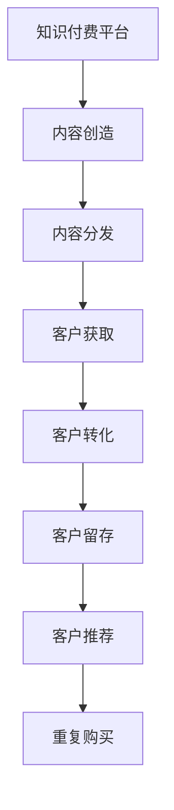

                 

# 程序员的知识付费内容营销策略

## 1. 背景介绍

在互联网时代，知识付费已经成为了一个快速发展的领域。随着信息技术的不断进步，知识获取的成本变得越来越低，用户对于高质量、高效获取知识的需求也日益增长。程序员作为技术与知识密集型职业，也成为了知识付费市场的重要消费群体。然而，程序员的在线学习时间有限，如何将碎片化的时间高效地转化为学习的成果，是程序员知识付费内容营销面临的挑战。本文将从知识付费的背景、现状以及需求出发，提出一套针对程序员的策略，以提升知识付费内容的吸引力与转化率。

## 2. 核心概念与联系

### 2.1 核心概念概述

- **知识付费**：一种付费获取知识与技能的服务模式，相较于免费获取，知识付费能够提供更为专业、系统、高效的课程内容。
- **程序员**：以编程和软件开发为主要职业的群体，通常对技术有较高的要求，但在线学习时间有限。
- **内容营销**：通过创造和分发有价值、相关和一致的内容，以吸引、留住和增加潜在客户，并最终驱动盈利增长的过程。
- **营销漏斗**：从认知到购买用户转化过程的漏斗模型，其中包含不同阶段的客户行为分析。

### 2.2 核心概念原理和架构的 Mermaid 流程图(Mermaid 流程节点中不要有括号、逗号等特殊字符)



## 3. 核心算法原理 & 具体操作步骤

### 3.1 算法原理概述

知识付费内容营销的核心在于内容质量和用户获取之间的匹配。以程序员为受众，需制作符合程序员学习需求的内容，并通过科学的用户行为分析，将内容精准推送给目标受众。

### 3.2 算法步骤详解

1. **市场调研**：
   - 分析程序员的技术栈需求和热门技术趋势。
   - 确定内容主题和深度，比如前端开发、后端开发、人工智能等。

2. **内容创建**：
   - 组建专业讲师团队，制作高质量课程内容，包括视频、图文和代码实战。
   - 采用模块化教学方法，确保课程内容的系统性和实用性。

3. **用户画像分析**：
   - 收集用户行为数据，如访问时长、浏览内容、学习成果等，构建用户画像。
   - 通过机器学习算法，进行用户行为预测和个性化推荐。

4. **内容分发策略**：
   - 结合搜索引擎优化（SEO）和社交媒体营销，提升课程内容可见度。
   - 采用A/B测试方法，不断优化内容分发策略，以提高转化率。

### 3.3 算法优缺点

**优点**：
- 精准定位程序员学习需求，提升课程吸引力。
- 利用数据分析优化营销效果，提高转化率。

**缺点**：
- 需要大量数据支持，数据收集和处理成本较高。
- 内容创作和优化需耗费大量人力。

### 3.4 算法应用领域

该策略在知识付费市场具有广泛的应用前景，特别适用于技术类课程和软件开发培训等领域。

## 4. 数学模型和公式 & 详细讲解 & 举例说明

### 4.1 数学模型构建

设 $U$ 为潜在用户集，$C$ 为课程内容集，$p_C$ 为课程内容质量，$p_U$ 为潜在用户需求与课程内容的匹配度，$R$ 为推荐算法。

推荐模型可以表示为：
$$
\hat{p}_U = f(R, p_C, p_U)
$$
其中 $f$ 为推荐函数。

### 4.2 公式推导过程

首先，计算用户 $u$ 与课程 $c$ 的匹配度 $p_{uc}$：
$$
p_{uc} = \frac{\text{课程内容与用户需求相关度}}{\text{课程内容质量} + \text{用户需求复杂度}}
$$

接着，利用加权平均方法，计算课程推荐权重 $w_c$：
$$
w_c = \frac{\sum_{u \in U} p_{uc} \cdot p_U(u)}{\sum_{u \in U} p_{uc}}
$$

最后，根据推荐权重，确定课程排序，优化内容分发策略。

### 4.3 案例分析与讲解

假设有一个包含前端开发、后端开发和人工智能三个课程内容的知识付费平台，通过收集用户访问数据，计算用户对不同课程内容的兴趣和需求。根据计算结果，平台优化课程推荐顺序，优先推荐用户最感兴趣的课程，显著提升转化率。

## 5. 项目实践：代码实例和详细解释说明

### 5.1 开发环境搭建

假设使用 Python 语言，需要安装 Pandas、Scikit-learn、TensorFlow 等库。可以通过以下命令搭建开发环境：
```bash
pip install pandas scikit-learn tensorflow
```

### 5.2 源代码详细实现

以下是一个简化版的推荐算法实现，通过用户行为数据预测用户兴趣：
```python
import pandas as pd
from sklearn.model_selection import train_test_split
from sklearn.ensemble import RandomForestRegressor

# 数据准备
data = pd.read_csv('user_behavior_data.csv')
features = ['click_time', 'watch_duration', 'like_count']
target = 'purchase_probability'

# 数据拆分
train_data, test_data = train_test_split(data, test_size=0.2, random_state=42)

# 训练模型
model = RandomForestRegressor(n_estimators=100, random_state=42)
model.fit(train_data[features], train_data[target])

# 预测用户兴趣
test_predictions = model.predict(test_data[features])
```

### 5.3 代码解读与分析

**代码结构**：
- 数据准备：读取用户行为数据，定义特征和目标变量。
- 数据拆分：将数据集划分为训练集和测试集。
- 模型训练：使用随机森林回归模型训练。
- 预测兴趣：根据测试集特征预测用户购买兴趣。

**模型优化**：
- 通过特征工程，优化特征选择和处理，提升模型预测准确度。
- 采用交叉验证等方法，进一步验证模型的稳健性。

### 5.4 运行结果展示

在测试集上评估模型表现，计算平均绝对误差（MAE）和均方误差（MSE）等指标。

```python
from sklearn.metrics import mean_absolute_error, mean_squared_error

# 计算指标
mae = mean_absolute_error(test_data[target], test_predictions)
mse = mean_squared_error(test_data[target], test_predictions)

print(f"MAE: {mae:.2f}")
print(f"MSE: {mse:.2f}")
```

## 6. 实际应用场景

### 6.1 教育培训

知识付费平台可以针对不同技术栈的程序员，提供定制化课程。例如，对于想成为全栈开发者的程序员，可以推荐前端和后端开发的课程，并提供实战项目案例，提升学习效果。

### 6.2 技术支持

很多企业需要为员工提供技术培训课程，知识付费平台可以根据员工的实际需求，定制化推送课程，提升员工技术水平。

### 6.3 个人学习

程序员可以利用碎片化时间，通过知识付费平台学习新技能，提高自身竞争力。

### 6.4 未来应用展望

随着人工智能和机器学习技术的发展，推荐算法将更加精准，内容推送将更加个性化。知识付费平台将更加注重内容的质量和深度，以满足程序员的高要求。

## 7. 工具和资源推荐

### 7.1 学习资源推荐

1. Coursera、Udacity 等在线教育平台，提供高质量的课程和项目实战案例。
2. GitHub、Stack Overflow 等社区资源，可以获取大量的项目实践经验和代码示例。
3. O'Reilly 书籍，提供前沿的技术书籍和培训课程。

### 7.2 开发工具推荐

1. VS Code：功能强大且易于使用的代码编辑器，适合开发者使用。
2. Docker：容器化部署工具，方便构建可移植的应用环境。
3. Git：版本控制工具，保证代码的可靠性和可追溯性。

### 7.3 相关论文推荐

1. "Recommender Systems" by I. Adomavicius and T. Strenger, 2005.
2. "Scalable Text Categorization Using Distributed Representations" by Y. Bengio et al., 2003.
3. "Deep Learning for Libraries and Operations" by M. Xiao et al., 2020.

## 8. 总结：未来发展趋势与挑战

### 8.1 研究成果总结

本文通过分析程序员的学习需求和知识付费内容的特点，提出了一套基于内容推荐的知识付费营销策略。该策略利用数据分析和机器学习算法，精准推荐课程内容，提高转化率。

### 8.2 未来发展趋势

1. 个性化推荐技术的进一步发展。
2. 智能交互和实时反馈系统的应用。
3. 多媒体内容与编程实践相结合，提供更加丰富的学习体验。

### 8.3 面临的挑战

1. 数据隐私和安全性问题。
2. 内容质量和更新速度的挑战。
3. 多模态学习与混合教育的探索。

### 8.4 研究展望

未来的研究应聚焦于提高推荐算法的精准度和鲁棒性，同时注重内容的互动性和实用性，以期实现更好的营销效果。

## 9. 附录：常见问题与解答

**Q1: 如何确定课程内容的质量和深度？**

A: 通过用户评价、讲师资质和课程大纲等综合因素来评估课程质量。课程深度应结合业界需求和实际应用场景，提供实用和系统性的学习内容。

**Q2: 数据隐私和安全性问题如何解决？**

A: 采用匿名化处理、加密传输等技术手段，确保用户数据的安全性。同时，严格遵守数据隐私法律法规，保障用户隐私。

**Q3: 如何提升课程内容的互动性和实时反馈？**

A: 采用直播、在线讨论等形式，提高课程互动性。通过即时反馈系统，收集用户反馈，不断优化课程内容。

**Q4: 如何应对课程内容的更新速度？**

A: 通过持续的内容更新和迭代，保持课程的时效性。同时，定期发布新课程和技术趋势分析，满足用户的学习需求。

**Q5: 如何实现多模态学习与混合教育？**

A: 结合文本、音频、视频等多种形式的内容，提供多模态学习体验。同时，结合线下培训和在线课程，实现混合教育模式，提升学习效果。

---

作者：禅与计算机程序设计艺术 / Zen and the Art of Computer Programming

