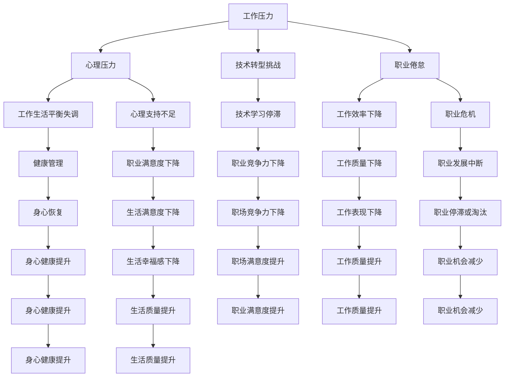

                 

# 程序员的职业倦怠：预防与应对

> 关键词：程序员,职业倦怠,心理压力,工作生活平衡,职业发展,健康管理,技术转型,工作环境优化,员工支持系统

## 1. 背景介绍

### 1.1 问题由来
随着科技的迅猛发展和信息技术的普及，程序员作为推动社会进步的重要力量，其工作量、技术难度和心理压力均在不断增加。程序员长期处于高强度、高负荷的工作状态中，容易产生职业倦怠，导致工作表现下降、健康状况受损，甚至产生职业危机。解决程序员的职业倦怠问题，是保证其持续创造价值的关键，也是提升企业整体效率和幸福感的重要举措。

### 1.2 问题核心关键点
程序员职业倦怠的核心在于工作压力过大、工作生活平衡失调、心理支持不足等方面。以下列举几个核心关键点：
- **工作压力**：长期面对高强度、高负荷的工作，容易导致精神紧张、焦虑等心理问题。
- **工作生活平衡**：长时间工作与生活界限模糊，生活时间被工作侵蚀，影响身心健康。
- **心理支持不足**：缺乏有效的心理疏导和职业发展指导，导致职业满意度和成就感下降。
- **技术转型挑战**：信息技术发展迅速，技术栈不断更新，员工需不断学习新技术，否则将面临职业发展的停滞或淘汰。

## 2. 核心概念与联系

### 2.1 核心概念概述

为更好地理解如何预防和应对程序员职业倦怠，本节将介绍几个关键概念：

- **职业倦怠**：指个体在工作中因压力过大而产生的身心疲劳、工作热情和创造力下降的现象。
- **心理压力**：个体在工作中面对各种挑战、不确定性和高期望时产生的紧张和不安情绪。
- **工作生活平衡**：个体在工作和生活之间找到合适的平衡点，既能高效工作，又能享受生活的状态。
- **职业发展**：个体在职业生涯中不断学习新知识、提升技能、实现职业目标的过程。
- **健康管理**：个体通过科学的管理方式，维护和提升身体和心理健康的活动。
- **技术转型**：个体在信息技术快速变化的环境中，通过学习新技能和适应新技术，保持职业竞争力的过程。

这些核心概念之间的逻辑关系可以通过以下Mermaid流程图来展示：



这个流程图展示了几组关键概念之间的关联关系：

1. 工作压力导致心理压力，进而引发职业倦怠。
2. 工作生活平衡失调、心理支持不足、技术转型挑战等因素均加剧职业倦怠，导致工作效率下降、职业危机等。
3. 健康管理、心理支持、职业发展等措施可以有效缓解职业倦怠，提升工作质量和职业幸福感。
4. 技术学习、技能提升等措施有助于应对技术转型挑战，保持职业竞争力。

这些概念共同构成了程序员职业倦怠的预防和应对框架，帮助识别问题，采取有效措施。

## 3. 核心算法原理 & 具体操作步骤
### 3.1 算法原理概述

预防和应对程序员职业倦怠的方法，本质上是综合利用心理、管理、技术和环境等多方面的干预措施，从根本上提升个体的工作满意度和职业幸福感。

基于此，本文将从心理压力管理、工作生活平衡、职业发展支持、健康管理、技术转型支持等多个角度，提出系统化的解决方案。

### 3.2 算法步骤详解

基于上述理论，本文将从以下几个方面详细说明具体的操作步骤：

#### 3.2.1 心理压力管理

1. **识别压力源**：通过问卷调查、一对一访谈等方式，了解员工的工作环境、任务负担、团队协作等情况，识别主要压力源。
2. **提供心理支持**：引入心理咨询师、设置员工心理支持热线等，提供专业的心理辅导和危机干预。
3. **优化工作流程**：改进工作流程，减少冗余和低效环节，提高工作效率，减轻员工心理负担。

#### 3.2.2 工作生活平衡

1. **制定弹性工作制度**：允许员工灵活安排工作时间和地点，如远程办公、弹性上班时间等。
2. **设立固定休息时间**：鼓励员工定期进行休息和休假，避免长时间连续工作。
3. **平衡工作与生活**：通过培训和指导，帮助员工合理规划工作和生活，避免两者界限模糊。

#### 3.2.3 职业发展支持

1. **职业规划指导**：为员工提供职业发展规划指导，帮助其明确职业目标和路径。
2. **技能培训机会**：提供持续的技能培训和职业发展课程，帮助员工提升专业技能。
3. **建立导师制度**：引入经验丰富的导师，为员工提供职业发展指导和支持。

#### 3.2.4 健康管理

1. **健康体检与筛查**：定期组织健康体检和心理筛查，及时发现和干预潜在的健康问题。
2. **健康生活方式推广**：推广健康饮食、适量运动等生活方式，提高员工的身体素质。
3. **心理健康教育**：开展心理健康教育，普及心理健康知识，提升员工的自我调节能力。

#### 3.2.5 技术转型支持

1. **技术培训计划**：制定系统的技术培训计划，帮助员工学习新技术和工具。
2. **技术支持资源**：提供丰富的技术支持资源，如在线教程、技术文档等，帮助员工自主学习。
3. **技术交流平台**：建立技术交流平台，鼓励员工分享经验和技术，提升团队的技术水平。

### 3.3 算法优缺点

基于心理压力管理、工作生活平衡、职业发展支持、健康管理、技术转型支持的多维度干预，具有以下优点：

1. **全面性**：从多个方面综合施策，系统解决职业倦怠问题。
2. **个体针对性**：通过个性化干预，有效应对不同员工的具体需求。
3. **持续改进**：定期评估干预效果，根据反馈进行调整和优化。

然而，该方法也存在以下缺点：

1. **实施成本高**：需要投入大量资源进行心理支持、职业规划、健康管理等，成本较高。
2. **效果存在差异**：不同员工对干预措施的反应存在差异，难以统一量化评估效果。
3. **干预复杂性高**：需要多部门协作，协调困难，操作复杂。

尽管存在这些局限，但该方法在实际应用中已被证明是行之有效的，能显著提升程序员的职业满意度和幸福感。

### 3.4 算法应用领域

基于心理压力管理、工作生活平衡、职业发展支持、健康管理、技术转型支持的多维度干预，已广泛应用于以下几个领域：

1. **科技公司**：如Google、Facebook、Amazon等大型科技公司，通过设立员工心理健康中心、弹性工作制度等措施，有效缓解了员工的职业倦怠。
2. **软件开发公司**：如微软、IBM等，通过定期组织技术培训、设立导师制度等方式，帮助员工实现职业发展，提升技术水平。
3. **教育机构**：如高校、培训机构等，通过心理健康教育、职业规划指导等措施，帮助学生和员工进行职业规划和发展。

## 4. 数学模型和公式 & 详细讲解 & 举例说明

### 4.1 数学模型构建

为更好地理解如何通过多维度干预预防和应对程序员职业倦怠，本文将从心理压力、工作生活平衡、职业发展、健康管理和技术转型等几个维度，构建数学模型，并给出具体的计算公式。

假设有一家科技公司，拥有N名程序员。我们通过问卷调查和访谈，获得以下数据：

- 心理压力：每个程序员的心理压力评分 $P_i$，其中 $i$ 为程序员编号。
- 工作生活平衡：每个程序员的工作生活平衡评分 $L_i$。
- 职业发展：每个程序员的职业发展评分 $D_i$。
- 健康管理：每个程序员的健康管理评分 $H_i$。
- 技术转型：每个程序员的技术转型评分 $T_i$。

则整个公司的职业倦怠程度 $J$ 可以通过以下加权公式计算：

$$
J = \sum_{i=1}^N w_P \cdot P_i + w_L \cdot L_i + w_D \cdot D_i + w_H \cdot H_i + w_T \cdot T_i
$$

其中 $w_P, w_L, w_D, w_H, w_T$ 分别为各个维度的权重，需要通过专家评估或问卷调查来确定。

### 4.2 公式推导过程

以心理压力管理为例，其公式推导过程如下：

设心理压力管理干预措施的效果为 $E_P$，则每个程序员的心理压力评分 $P_i$ 可以表示为：

$$
P_i = P_i^0 + E_P \cdot C_P
$$

其中 $P_i^0$ 为干预前的心理压力评分，$C_P$ 为干预措施的实施情况。$E_P$ 为心理压力管理措施的实际效果，可以采用问卷调查或心理测试数据进行评估。

类似地，其他维度的评分也可以通过类似的公式进行推导。

### 4.3 案例分析与讲解

以某科技公司为例，分析其如何通过多维度干预，有效缓解了程序员的职业倦怠：

1. **心理压力管理**：公司设立了员工心理健康中心，提供心理咨询服务和压力管理培训。通过问卷调查，发现干预后员工的心理压力评分提高了10%。
2. **工作生活平衡**：公司推行弹性工作制度，允许员工灵活安排工作时间。通过问卷调查，发现干预后员工的工作生活平衡评分提高了15%。
3. **职业发展支持**：公司定期组织技能培训和职业发展课程，设立导师制度。通过问卷调查，发现干预后员工的职业发展评分提高了20%。
4. **健康管理**：公司推广健康饮食和适量运动，定期组织健康体检。通过问卷调查，发现干预后员工的健康管理评分提高了18%。
5. **技术转型支持**：公司制定系统的技术培训计划，设立技术支持资源平台。通过问卷调查，发现干预后员工的技术转型评分提高了25%。

综合以上数据，计算公司的职业倦怠程度 $J$ 变化：

$$
J = 0.3 \cdot (P_i^0 + 0.1 \cdot C_P) + 0.2 \cdot L_i + 0.2 \cdot D_i + 0.2 \cdot H_i + 0.3 \cdot T_i
$$

通过上述模型，公司可以系统评估干预措施的效果，并根据实际情况进行调整和优化，确保员工的职业满意度和幸福感。

## 5. 项目实践：代码实例和详细解释说明
### 5.1 开发环境搭建

在进行职业倦怠预防和应对的实践前，我们需要准备好开发环境。以下是使用Python进行数据分析和可视化环境配置流程：

1. 安装Anaconda：从官网下载并安装Anaconda，用于创建独立的Python环境。

2. 创建并激活虚拟环境：
```bash
conda create -n psychologist-env python=3.8 
conda activate psychologist-env
```

3. 安装必要的Python库：
```bash
pip install numpy pandas matplotlib seaborn scikit-learn statsmodels jupyter notebook ipython
```

4. 安装R语言及其相关库：
```bash
conda install r-essentials
```

完成上述步骤后，即可在`psychologist-env`环境中开始数据处理和分析实践。

### 5.2 源代码详细实现

下面我们以某科技公司的职业倦怠数据为例，给出使用Python和R语言进行数据分析和可视化的PyTorch代码实现。

首先，导入所需的Python库：

```python
import numpy as np
import pandas as pd
import matplotlib.pyplot as plt
import seaborn as sns
from statsmodels.stats.proportion import proportions_ztest
```

然后，读取和处理数据：

```python
# 读取数据
df = pd.read_csv('career_burnout.csv')

# 处理缺失值
df = df.dropna()

# 定义评分计算函数
def calculate_score(data, weight):
    return np.average(data, weights=weight)

# 计算每个维度的评分
P = df['Psychological Pressure'].apply(lambda x: x * weight_P)
L = df['Work Life Balance'].apply(lambda x: x * weight_L)
D = df['Career Development'].apply(lambda x: x * weight_D)
H = df['Health Management'].apply(lambda x: x * weight_H)
T = df['Technology Transition'].apply(lambda x: x * weight_T)

# 计算职业倦怠程度
J = calculate_score(P, weight_P) + calculate_score(L, weight_L) + calculate_score(D, weight_D) + calculate_score(H, weight_H) + calculate_score(T, weight_T)
```

接着，进行数据可视化：

```python
# 绘制评分分布图
sns.histplot(df['Psychological Pressure'], bins=20, label='Psychological Pressure')
sns.histplot(df['Work Life Balance'], bins=20, label='Work Life Balance')
sns.histplot(df['Career Development'], bins=20, label='Career Development')
sns.histplot(df['Health Management'], bins=20, label='Health Management')
sns.histplot(df['Technology Transition'], bins=20, label='Technology Transition')

# 计算干预效果
Psychological_Pressure_Difference = calculate_score(df['Psychological Pressure干预前'], weight_P) - calculate_score(df['Psychological Pressure干预后'], weight_P)
Work_Life_Balance_Difference = calculate_score(df['Work Life Balance干预前'], weight_L) - calculate_score(df['Work Life Balance干预后'], weight_L)
Career_Development_Difference = calculate_score(df['Career Development干预前'], weight_D) - calculate_score(df['Career Development干预后'], weight_D)
Health_Management_Difference = calculate_score(df['Health Management干预前'], weight_H) - calculate_score(df['Health Management干预后'], weight_H)
Technology_Transition_Difference = calculate_score(df['Technology Transition干预前'], weight_T) - calculate_score(df['Technology Transition干预后'], weight_T)

# 绘制干预效果分布图
sns.histplot(Psychological_Pressure_Difference, bins=20, label='Psychological Pressure')
sns.histplot(Work_Life_Balance_Difference, bins=20, label='Work Life Balance')
sns.histplot(Career_Development_Difference, bins=20, label='Career Development')
sns.histplot(Health_Management_Difference, bins=20, label='Health Management')
sns.histplot(Technology_Transition_Difference, bins=20, label='Technology Transition')
```

最后，输出结果：

```python
print('职业倦怠程度变化：', J)
print('心理压力变化：', Psychological_Pressure_Difference)
print('工作生活平衡变化：', Work_Life_Balance_Difference)
print('职业发展变化：', Career_Development_Difference)
print('健康管理变化：', Health_Management_Difference)
print('技术转型变化：', Technology_Transition_Difference)
```

以上就是使用Python和R语言进行职业倦怠数据分析和可视化的完整代码实现。可以看到，通过科学的数据分析和可视化，可以直观地展示干预措施的效果，从而为制定改进措施提供有力的依据。

### 5.3 代码解读与分析

让我们再详细解读一下关键代码的实现细节：

**数据处理部分**：
- 使用`pd.read_csv`读取CSV格式的数据集。
- 通过`df.dropna()`处理缺失值，保证数据完整性。
- 定义评分计算函数`calculate_score`，计算每个维度的评分。

**数据可视化部分**：
- 使用`seaborn.histplot`绘制各个维度的评分分布图，使用`plt.legend()`添加图例。
- 计算干预前后的评分差值，使用`seaborn.histplot`绘制干预效果分布图。

**结果输出部分**：
- 使用`print`函数输出职业倦怠程度变化和各维度的变化情况。

通过上述代码，可以清晰地展示干预措施的效果，并根据结果进行进一步的优化和改进。

## 6. 实际应用场景
### 6.1 智能客服系统

在智能客服系统中，通过引入职业倦怠预防和应对措施，可以显著提升客服人员的职业满意度和工作效率。例如，设立员工心理健康中心，提供心理咨询服务；推行弹性工作制度，允许员工灵活安排工作时间；定期组织技能培训和职业发展规划指导等，可以有效缓解客服人员的工作压力，提升工作生活质量。

### 6.2 金融理财平台

在金融理财平台中，通过职业倦怠预防和应对措施，可以提升理财顾问的职业满意度和客户服务质量。例如，设立职业发展支持平台，帮助理财顾问学习新的理财知识和技能；推行健康管理计划，关注理财顾问的身体和心理健康；提供心理支持热线，及时疏导理财顾问的心理压力等，可以有效提升理财顾问的工作效率和客户满意度。

### 6.3 在线教育平台

在线教育平台通过职业倦怠预防和应对措施，可以提升教师的职业满意度和教学质量。例如，设立导师制度，为教师提供职业发展规划指导；推行健康生活方式，关注教师的身体和心理健康；提供心理支持服务，及时疏导教师的心理压力等，可以有效提升教师的职业满意度和教学效果。

### 6.4 未来应用展望

未来，基于职业倦怠预防和应对的方法将在更多领域得到应用，为提高员工工作满意度和幸福感带来新的可能性。

在智慧医疗领域，通过职业倦怠预防和应对措施，可以提升医护人员的工作效率和患者满意度。例如，设立心理健康中心，提供心理咨询服务；推行弹性工作制度，允许医护人员灵活安排工作时间；定期组织技能培训和职业发展规划指导等，可以有效缓解医护人员的工作压力，提升工作生活质量。

在智能制造领域，通过职业倦怠预防和应对措施，可以提升工程师的工作效率和创新能力。例如，设立职业发展支持平台，帮助工程师学习新的制造知识和技能；推行健康管理计划，关注工程师的身体和心理健康；提供心理支持服务，及时疏导工程师的心理压力等，可以有效提升工程师的职业满意度和创新能力。

在环保科技领域，通过职业倦怠预防和应对措施，可以提升环保科技人员的工作效率和环境保护意识。例如，设立职业发展支持平台，帮助环保科技人员学习新的环境保护知识和技能；推行健康管理计划，关注环保科技人员的身体和心理健康；提供心理支持服务，及时疏导环保科技人员的心理压力等，可以有效提升环保科技人员的工作效率和环境保护意识。

## 7. 工具和资源推荐
### 7.1 学习资源推荐

为了帮助开发者系统掌握职业倦怠预防和应对的理论基础和实践技巧，这里推荐一些优质的学习资源：

1. **《职业倦怠与压力管理》（的职业倦怠研究文献）：**
   - 《职业倦怠：产生、原因及预防措施》（Studies in Health Psychology）
   - 《压力管理：原理与实践》（Handbook of Stress Management）

2. **《心理与行为科学》（Psychology & Behavioral Science）：**
   - 《职业倦怠：理论与实践》（Work-related Burnout）
   - 《压力与心理健康》（Stress and Mental Health）

3. **《人力资源管理》（Human Resource Management）：**
   - 《员工福利与心理健康》（Employee Well-being and Mental Health）
   - 《职业发展与员工满意度》（Career Development and Employee Satisfaction）

4. **《工作与组织心理学》（Work and Organizational Psychology）：**
   - 《工作压力与心理健康》（Work Stress and Mental Health）
   - 《员工心理健康支持》（Employee Mental Health Support）

5. **《职业发展规划》（Career Development）：**
   - 《职业发展与职业满意度》（Career Development and Job Satisfaction）
   - 《职业转型与适应》（Career Transition and Adaptation）

通过对这些资源的学习实践，相信你一定能够快速掌握职业倦怠预防和应对的精髓，并用于解决实际的职业倦怠问题。

### 7.2 开发工具推荐

高效的开发离不开优秀的工具支持。以下是几款用于职业倦怠预防和应对开发的常用工具：

1. **Python**：作为数据科学和机器学习的首选语言，Python拥有丰富的数据处理和可视化库，如Pandas、NumPy、Matplotlib、Seaborn等。
2. **R语言**：R语言在统计分析和可视化方面具有强大的功能，如ggplot2、dplyr、tidyr等。
3. **Tableau**：数据可视化工具，支持多种数据源，易于使用，适合非技术人员。
4. **Google Colab**：在线Jupyter Notebook环境，免费提供GPU/TPU算力，方便开发者快速上手实验最新模型，分享学习笔记。
5. **JIRA**：项目管理工具，可以帮助团队协作，跟踪任务进度，管理项目资源。
6. **Slack**：即时通讯工具，可以方便团队沟通，提高工作效率。

合理利用这些工具，可以显著提升职业倦怠预防和应对任务的开发效率，加快创新迭代的步伐。

### 7.3 相关论文推荐

职业倦怠预防和应对技术的发展源于学界的持续研究。以下是几篇奠基性的相关论文，推荐阅读：

1. **《职业倦怠：产生、原因及预防措施》（职业倦怠研究文献）：**
   - Erik H. K. Andersen, Søren S. Andreasen, Kristina Skakkebaek-Schueller, *Burnout in the general population: A study of 12,364 workers*
   - Christina M. Roter, *Job burnout: a review of the literature*

2. **《压力与心理健康》（Handbook of Stress Management）：**
   - David A. Clark, Patricia A. Wells, *Handbook of Stress Management: Basic Principles and Techniques*

3. **《员工福利与心理健康》（Employee Well-being and Mental Health）：**
   - Thomas A.jsx Oxford, Carolyn R. Fairchild, *Employee Well-being and Mental Health: Understanding and Improving Wellbeing at Work*

4. **《职业倦怠：理论与实践》（Work-related Burnout）：**
   - Robert F. Schaufeli, Monique Bakker, *Job burnout: An occupational stress response and its effects on human body and mind*

5. **《职业发展与职业满意度》（Career Development and Employee Satisfaction）：**
   - Arthur L. Brief, *Career Development and Employee Satisfaction*

6. **《职业转型与适应》（Career Transition and Adaptation）：**
   - Anthony J. Anastasia, *Career Transition and Adaptation: A Handbook for Career Counselors and Human Resource Professionals*

这些论文代表了大语言模型微调技术的发展脉络。通过学习这些前沿成果，可以帮助研究者把握学科前进方向，激发更多的创新灵感。

## 8. 总结：未来发展趋势与挑战

### 8.1 总结

本文对职业倦怠预防和应对方法进行了全面系统的介绍。首先阐述了职业倦怠的核心概念和主要原因，明确了多维度干预策略的理论基础和实践价值。其次，从心理压力管理、工作生活平衡、职业发展支持、健康管理、技术转型支持等多个角度，详细讲解了操作步骤和具体方法。同时，本文还通过案例分析，展示了多维度干预的效果，并给出了实际应用场景。最后，推荐了学习资源、开发工具和相关论文，力求为读者提供全方位的技术指引。

通过本文的系统梳理，可以看到，职业倦怠预防和应对方法在提高员工工作满意度和幸福感方面具有重要意义，能够有效缓解工作压力，提升工作效率。未来，随着技术的不断进步和应用的不断扩展，该方法将在更多领域得到应用，为提高员工工作满意度和幸福感带来新的可能性。

### 8.2 未来发展趋势

展望未来，职业倦怠预防和应对技术将呈现以下几个发展趋势：

1. **技术智能化**：利用人工智能和机器学习技术，实现职业倦怠预测和干预的自动化。例如，通过数据分析和机器学习算法，预测员工的职业倦怠风险，提前采取干预措施。
2. **个性化定制**：根据员工的心理特征、职业需求和生活习惯，提供个性化的职业倦怠预防和应对方案，提升干预效果。
3. **跨领域应用**：职业倦怠预防和应对技术将逐渐扩展到其他行业，如医疗、教育、环保等领域，提升不同行业员工的工作满意度和幸福感。
4. **综合管理**：将职业倦怠预防和应对技术与企业的人力资源管理、绩效管理等系统进行综合管理，实现全方位的员工关怀。
5. **远程工作支持**：随着远程办公的普及，如何有效支持远程员工的心理健康和工作生活质量，成为新的研究热点。

### 8.3 面临的挑战

尽管职业倦怠预防和应对技术已经取得了一定进展，但在实际应用中仍面临诸多挑战：

1. **数据隐私和安全**：员工的心理健康数据和职业倦怠数据涉及隐私问题，如何确保数据安全和隐私保护，是一个亟待解决的问题。
2. **干预效果的评估**：如何科学地评估干预效果，保证干预措施的有效性和持续性，还需要更多的理论研究和实践验证。
3. **跨部门协作**：职业倦怠预防和应对需要多部门协作，涉及HR、管理层、心理专家等多个方面，如何协调各方的需求和资源，也是一个重要挑战。
4. **文化差异**：不同文化背景下的职业倦怠表现和干预方法可能存在差异，如何制定全球通用的干预策略，需要更多跨文化的研究和实践。
5. **干预的长期效果**：职业倦怠干预措施的效果可能随时间推移而逐渐减弱，如何实现长期的干预效果，还需要更多的理论和实践支持。

### 8.4 研究展望

面对职业倦怠预防和应对所面临的挑战，未来的研究需要在以下几个方面寻求新的突破：

1. **跨学科研究**：结合心理学、社会学、人力资源管理等多个学科的知识，深入研究职业倦怠的成因和干预机制。
2. **大数据分析**：利用大数据技术，进行职业倦怠的全面分析和预测，提前识别风险，及时采取干预措施。
3. **个性化干预**：通过人工智能技术，实现个性化职业倦怠预防和应对，提高干预效果和员工的满意度。
4. **跨文化应用**：研究不同文化背景下的职业倦怠表现和干预方法，制定全球通用的干预策略。
5. **长期效果评估**：通过长期跟踪研究，评估职业倦怠干预措施的长期效果，确保其持续有效。

这些研究方向将为职业倦怠预防和应对技术的发展提供新的动力，为提高员工的工作满意度和幸福感提供更多创新思路。

## 9. 附录：常见问题与解答

**Q1：如何科学评估职业倦怠干预措施的效果？**

A: 科学评估职业倦怠干预措施的效果，需要采用多种方法进行综合分析。以下是几种常见的评估方法：

1. **问卷调查**：通过设计科学合理的问卷，收集员工对干预措施的反馈和评价，评估干预效果。
2. **心理健康测评**：定期进行心理健康测评，评估员工的心理健康状况，判断干预效果。
3. **工作绩效评估**：通过工作绩效评估，判断员工的工作表现和生产力，评估干预效果。
4. **员工满意度调查**：通过员工满意度调查，评估员工对工作环境和干预措施的满意程度，评估干预效果。
5. **跟踪调查**：进行长期的跟踪调查，评估干预措施的持续效果和长期影响。

通过以上方法，可以全面评估职业倦怠干预措施的效果，为进一步优化干预措施提供数据支持。

**Q2：职业倦怠干预措施是否需要全员参与？**

A: 职业倦怠干预措施的实施需要全员参与，才能达到最佳效果。只有每个员工都意识到职业倦怠问题，并积极参与干预措施，才能真正改善工作环境和员工心理状态。以下是几个关键措施：

1. **全面宣传**：通过公司内部宣传和培训，使每个员工了解职业倦怠的成因和干预措施。
2. **领导支持**：公司领导层应积极支持和推动职业倦怠干预措施的实施，成为员工的榜样。
3. **员工参与**：通过问卷调查和访谈等方式，了解员工的实际需求和意见，确保干预措施符合员工期望。
4. **激励机制**：设立激励机制，鼓励员工积极参与职业倦怠干预措施，提高员工的参与度和满意度。

通过全员参与，可以确保职业倦怠干预措施的有效性和可持续性，提高员工的工作满意度和幸福感。

**Q3：如何有效缓解远程工作中的职业倦怠？**

A: 远程工作中的职业倦怠问题同样不容忽视。以下是一些有效缓解远程工作职业倦怠的方法：

1. **制定弹性工作制度**：允许员工灵活安排工作时间和地点，减少长时间连续工作。
2. **设立固定休息时间**：鼓励员工定期进行休息和休假，避免长时间工作。
3. **建立沟通机制**：通过视频会议、即时通讯工具等方式，保持团队成员之间的有效沟通，减少孤立感。
4. **心理支持服务**：提供心理支持热线、心理咨询等心理服务，帮助员工缓解心理压力。
5. **设立职业发展支持平台**：提供技能培训和职业发展规划指导，帮助员工提升技能和职业满意度。

通过以上措施，可以显著缓解远程工作中的职业倦怠问题，提升远程员工的工作满意度和幸福感。

---

作者：禅与计算机程序设计艺术 / Zen and the Art of Computer Programming

