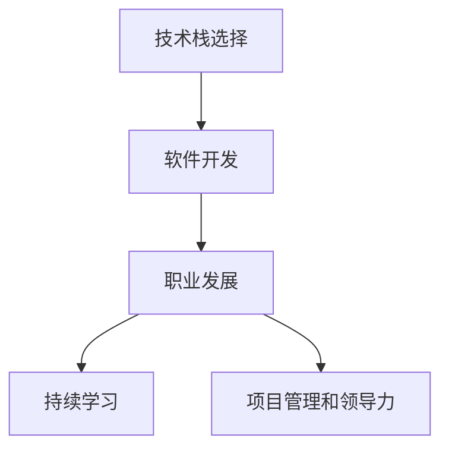

                 

# 程序员的职业生涯规划：从入门到IPO

> 关键词：技术栈,软件开发,职业发展,持续学习,项目管理和领导力

## 1. 背景介绍

### 1.1 问题由来

在当今快速变化的科技领域，程序员的职业发展不再是线性增长，而是一个不断迭代和升级的旅程。从入门到资深开发者，再到技术主管或CTO，每一步都需要精心的规划和持续的学习。本文将从技术栈的选择、持续学习、项目管理和领导力四个方面，为程序员提供一份详尽的职业规划指南，帮助你从零开始，迈向IPO。

## 2. 核心概念与联系

### 2.1 核心概念概述

- **技术栈(Stack)**：程序员用于构建和部署应用程序的所有工具、框架和语言的集合。
- **软件开发(Software Development)**：从需求分析到软件部署的全过程，包括设计、编码、测试和维护等环节。
- **职业发展(Career Development)**：程序员在职业生涯中所需掌握的技能、经验和职业阶段。
- **持续学习(Continuous Learning)**：程序员为适应技术变化，需不断更新知识库和技能集。
- **项目管理和领导力(Project Management & Leadership)**：组织和领导软件开发项目所需的关键技能。

### 2.2 核心概念原理和架构的 Mermaid 流程图



这个流程图展示了技术栈选择和软件开发是职业发展的起点，持续学习和项目管理与领导力是推动职业生涯不断进步的关键因素。

## 3. 核心算法原理 & 具体操作步骤

### 3.1 算法原理概述

程序员的职业生涯规划可看作一个迭代优化过程，通过选择和优化技术栈，不断学习和提升，逐步积累项目管理和领导经验，最终达到IPO（Initial Public Offering, 首次公开募股）的目标。

### 3.2 算法步骤详解

1. **技术栈选择**：根据个人兴趣和行业需求，选择合适的编程语言和框架。
   - 初始阶段：选择易于入门且应用广泛的栈，如Python+Flask或JavaScript+React。
   - 进阶阶段：扩展至后端技术栈（如Java、C#）、数据库（如MySQL、MongoDB）、云计算平台（如AWS、Azure）。
   - 高级阶段：引入全栈技术栈，如Node.js+MongoDB+React。

2. **软件开发**：
   - 入门阶段：模仿开源项目，学习编码规范和最佳实践。
   - 进阶阶段：独立开发小型项目，参与开源贡献，理解软件生命周期。
   - 高级阶段：主导复杂项目，运用敏捷、DevOps等方法提升开发效率。

3. **持续学习**：
   - 参加在线课程（如Coursera、Udemy），掌握新技能（如机器学习、数据分析）。
   - 阅读技术书籍和博客，了解前沿技术（如区块链、量子计算）。
   - 参加技术社区和Meetup，与同行交流。

4. **项目管理和领导力**：
   - 担任项目经理，负责项目进度、资源分配和风险管理。
   - 组建技术团队，培养跨部门协作和沟通能力。
   - 参加领导力培训，学习战略规划和团队建设。

### 3.3 算法优缺点

**优点**：
- **灵活性**：可以根据自身兴趣和市场需求灵活调整技术栈。
- **持续进步**：通过持续学习和项目经验不断提升技术水平。
- **职业发展路径清晰**：从入门到IPO每个阶段都有明确的目标和要求。

**缺点**：
- **学习曲线陡峭**：新技术和新框架需要大量时间和精力学习。
- **资源限制**：初期可能面临资源有限、项目机会少的挑战。
- **团队协作复杂**：高级阶段需要较强的沟通和领导能力。

### 3.4 算法应用领域

该算法适用于各种规模和类型的软件开发团队，从初创企业到大型科技公司，从独立开发者到技术主管或CTO。

## 4. 数学模型和公式 & 详细讲解 & 举例说明

### 4.1 数学模型构建

程序员职业生涯的发展可以用一个简单的数学模型来表示，其中x轴表示时间，y轴表示技术栈、项目管理和领导力三个维度的技能水平。

$$
S(t) = [T(t), P(t), L(t)]
$$

其中 $S(t)$ 为在第 $t$ 年的职业状态，$T(t)$ 为技术栈水平，$P(t)$ 为项目管理能力，$L(t)$ 为领导力水平。

### 4.2 公式推导过程

- **初始状态**：
  $$
  S(0) = [T_0, P_0, L_0]
  $$
  $T_0$ 表示入门阶段的技术栈水平，$P_0$ 和 $L_0$ 分别为项目管理和领导力的基础能力。

- **技能提升**：
  $$
  T(t+1) = T(t) + g_T(t)
  $$
  $$
  P(t+1) = P(t) + g_P(t)
  $$
  $$
  L(t+1) = L(t) + g_L(t)
  $$
  $g_T(t)$、$g_P(t)$、$g_L(t)$ 分别表示技术栈、项目管理、领导力每年提升的速率。

- **状态转移**：
  $$
  S(t+1) = [T(t+1), P(t+1), L(t+1)]
  $$
  每个维度的技能水平随时间增长而提高。

### 4.3 案例分析与讲解

假设一个程序员从零开始，在入门阶段投入200小时学习Python和Flask，提升技能至入门水平（$T_0 = 10$），参与一个中型项目，提升项目管理能力（$P_0 = 20$），并参加了一次领导力培训，提升领导力水平（$L_0 = 30$）。

- **第一年**：
  - **技术栈**：通过在线课程和实践项目，技能提升至中级水平（$T_1 = 30$）。
  - **项目管理**：在项目中担任协调角色，技能提升至初级（$P_1 = 25$）。
  - **领导力**：参与领导力培训，技能提升至中级（$L_1 = 40$）。

- **第二年**：
  - **技术栈**：通过解决复杂问题和学习新技术，技能提升至高级水平（$T_2 = 50$）。
  - **项目管理**：作为项目经理，技能提升至中级（$P_2 = 35$）。
  - **领导力**：通过团队管理，技能提升至高级（$L_2 = 50$）。

通过持续学习和项目经验，技术栈和项目管理能力不断提升，领导力逐步增强。

## 5. 项目实践：代码实例和详细解释说明

### 5.1 开发环境搭建

开发环境搭建包括安装IDE（如Visual Studio Code、PyCharm）、版本控制（如Git）、代码托管（如GitHub）、持续集成/持续部署（CI/CD）工具（如Jenkins）等。

### 5.2 源代码详细实现

下面是一个简单的Python Flask应用示例，展示了入门阶段的编码实践。

```python
from flask import Flask, request, jsonify

app = Flask(__name__)

@app.route('/hello', methods=['GET'])
def hello():
    name = request.args.get('name')
    return jsonify({'message': f'Hello, {name}!'})

if __name__ == '__main__':
    app.run(debug=True)
```

### 5.3 代码解读与分析

1. **Flask框架**：
   - Flask是一个轻量级Web框架，适合快速开发原型和小型应用。

2. **路由定义**：
   - 通过`@app.route`装饰器定义路由，指定请求路径和HTTP方法。

3. **请求处理**：
   - 使用`request.args.get`获取请求参数，生成个性化欢迎消息。

4. **JSON响应**：
   - 使用`jsonify`将Python字典转换为JSON格式，响应客户端请求。

5. **应用启动**：
   - `app.run(debug=True)`启动应用，`debug=True`开启调试模式，便于错误排查。

### 5.4 运行结果展示

启动应用后，在浏览器中输入`http://localhost:5000/hello?name=World`，可以看到欢迎消息`Hello, World!`。

## 6. 实际应用场景

### 6.1 电商网站开发

电子商务平台是技术栈选择和项目管理的典型场景。例如，一个电商网站需要使用多种技术栈，包括前端（JavaScript、React）、后端（Java、Spring Boot）、数据库（MySQL、Redis）、云服务（AWS、阿里云）等。

### 6.2 金融科技

金融科技公司需要处理大量数据和复杂的业务逻辑，涉及区块链、机器学习、云计算等多个领域。例如，使用Python和TensorFlow进行数据分析和模型训练，使用AWS进行云计算和大数据处理。

### 6.3 智能制造

智能制造企业需要集成自动化、工业互联网等多种技术，如Python和Flask进行设备监控和数据采集，使用Node.js和MongoDB进行数据存储和分析，使用IoT平台进行设备联网。

## 7. 工具和资源推荐

### 7.1 学习资源推荐

1. **Coursera**：提供广泛的编程、数据科学、机器学习课程。
2. **Udemy**：以项目为导向，提供实战技术栈课程。
3. **LeetCode**：通过算法和编程挑战提升编码能力。
4. **GitHub**：代码托管和开源社区，学习开源项目和协作经验。

### 7.2 开发工具推荐

1. **Visual Studio Code**：轻量级且功能强大的IDE，支持多种语言和插件。
2. **Git**：版本控制工具，管理代码版本和协作开发。
3. **GitHub**：代码托管平台，提供代码审查、分支管理和协作功能。
4. **Jenkins**：持续集成/持续部署工具，自动化构建和测试。

### 7.3 相关论文推荐

1. **《Clean Code: A Handbook of Agile Software Craftsmanship》**：Robert C. Martin著，讲解代码质量和软件设计原则。
2. **《Design Patterns: Elements of Reusable Object-Oriented Software》**：Erich Gamma等人著，介绍常用的设计模式和软件架构。
3. **《Agile Estimating and Planning》**：David A. Heartfield著，讲解敏捷项目管理方法。
4. **《Leadership and Self-Deception》**：The Arbinger Institute著，讨论个人和团队的领导力提升。

## 8. 总结：未来发展趋势与挑战

### 8.1 研究成果总结

1. **技术栈选择**：选择适合自己的技术栈，持续学习新技能。
2. **持续学习**：通过在线课程、书籍和社区交流不断更新知识。
3. **项目管理和领导力**：提升团队协作和项目管理能力。

### 8.2 未来发展趋势

1. **AI和自动化**：AI和大数据技术将改变软件开发模式，提高效率和精度。
2. **微服务和DevOps**：微服务架构和DevOps方法将提升系统可扩展性和稳定性。
3. **云计算和边缘计算**：云计算和边缘计算技术将促进分布式开发和边缘设备的应用。
4. **区块链和加密货币**：区块链技术将改变数据安全和信任机制，具有巨大的应用潜力。

### 8.3 面临的挑战

1. **技术更新快**：新工具和框架层出不穷，需要不断学习和适应。
2. **项目复杂度高**：大型和跨领域项目需要更高的团队协作和沟通能力。
3. **商业竞争激烈**：技术竞争激烈，需要不断创新和突破。

### 8.4 研究展望

1. **自动化测试和部署**：开发自动化测试和CI/CD工具，提升开发效率和质量。
2. **跨领域融合**：结合AI、物联网、区块链等技术，构建更加综合的应用场景。
3. **可扩展和弹性架构**：设计可扩展和弹性的系统架构，应对快速变化的需求。
4. **持续学习与适应**：建立持续学习和适应新技术的机制，保持竞争力。

## 9. 附录：常见问题与解答

**Q1：如何选择适合自己的技术栈？**

A: 根据个人兴趣和行业需求，选择易于入门且应用广泛的栈，如Python+Flask或JavaScript+React。

**Q2：如何持续学习新技能？**

A: 参加在线课程（如Coursera、Udemy），阅读技术书籍和博客，参加技术社区和Meetup，与同行交流。

**Q3：如何提升项目管理和领导力？**

A: 担任项目经理，负责项目进度、资源分配和风险管理。组建技术团队，培养跨部门协作和沟通能力。参加领导力培训，学习战略规划和团队建设。

**Q4：如何应对技术更新快的挑战？**

A: 保持学习好奇心，关注行业动态，定期参加培训和技术交流。

**Q5：如何提升团队协作和沟通能力？**

A: 定期进行团队建设活动，建立良好的沟通机制，使用协作工具如Slack、Trello等。

作者：禅与计算机程序设计艺术 / Zen and the Art of Computer Programming

