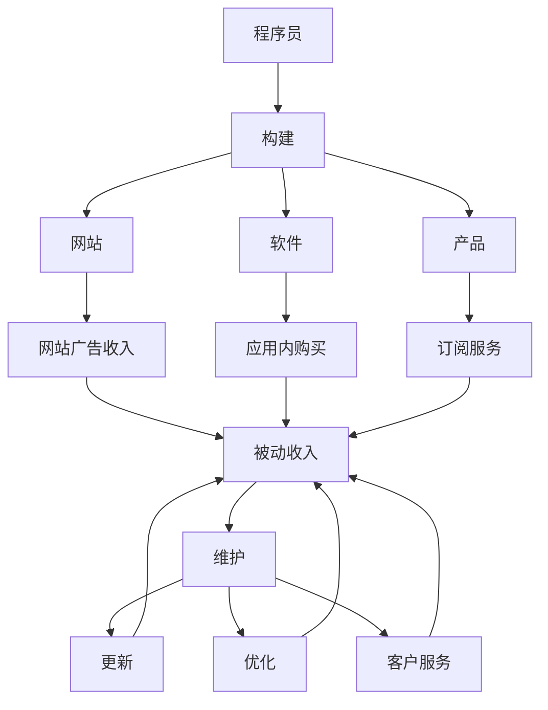

                 

# 程序员的被动收入：构建与维护

> 关键词：程序员,被动收入,构建,维护

## 1. 背景介绍

随着互联网技术的发展，越来越多的人开始关注如何通过编程实现财务自由。被动收入指的是通过前期投入，后期不需要主动干预即可持续产生收入的方式。对于程序员而言，被动收入可以从多个方向探索，包括开发产品、构建网站、发布图书、在线教育等。本文将详细探讨如何构建与维护程序员的被动收入，涵盖核心概念、算法原理、具体操作步骤等，助力程序员实现财务自由。

## 2. 核心概念与联系

### 2.1 核心概念概述

为了更好地理解程序员如何构建被动收入，本节将介绍几个关键概念及其联系：

- **程序员**：具备编程技能，能够在软件工程、数据科学、系统架构等领域从事开发工作的人员。
- **被动收入**：无需主动劳动，通过前期投入和优化管理，定期产生的收入，如投资收益、版权收益、网站广告收入等。
- **构建**：从零开始开发、设计和部署项目或产品，以满足市场需求。
- **维护**：对已有的产品或服务进行更新、优化和管理，以确保其长期稳定运行。

这些概念之间具有紧密的联系。程序员通过构建高质量的产品或服务，可以获得持续的被动收入，而维护工作则保证这些产品能够长期稳定运行，从而实现被动收入的可持续性。

### 2.2 核心概念原理和架构的 Mermaid 流程图



这个流程图展示了程序员如何通过构建不同的产品或服务，实现被动收入，并在此基础上进行维护工作，以确保收入的持续性和稳定性。

## 3. 核心算法原理 & 具体操作步骤

### 3.1 算法原理概述

程序员构建被动收入的过程，本质上是运用软件工程和项目管理的方法，设计和实现满足市场需求的产品或服务，并通过市场运营和用户反馈不断优化。这一过程可以概括为以下几个关键步骤：

1. **需求分析**：明确产品的市场需求和目标用户群体。
2. **设计和开发**：设计和实现产品的核心功能，确保满足用户需求。
3. **市场推广**：通过各种渠道将产品推广给目标用户。
4. **用户反馈和优化**：收集用户反馈，不断优化产品功能和用户体验。
5. **收入模型设计**：根据产品特性设计合理的收入模式，如广告、订阅、应用内购买等。
6. **持续维护**：定期更新和优化产品，确保其长期稳定运行。

### 3.2 算法步骤详解

以下是对构建被动收入的详细算法步骤：

**Step 1: 需求分析**

需求分析是构建产品的第一步。通过市场调研、用户访谈等方式，明确产品需要解决的问题、目标用户群体、功能需求和性能指标等。这一步骤可以通过以下方法进行：

1. **市场调研**：使用问卷调查、竞品分析等方式，了解市场现状和用户需求。
2. **用户访谈**：直接与潜在用户沟通，获取他们的真实需求和期望。
3. **竞品分析**：分析市场上的竞争对手，找到产品的差异化优势和改进空间。

**Step 2: 设计和开发**

设计和开发是构建产品的基础环节。这一阶段需要详细规划产品的功能架构、技术栈选择和开发流程，确保产品的稳定性和可扩展性。具体步骤如下：

1. **功能设计**：根据需求分析结果，设计产品的核心功能和附加功能。
2. **技术栈选择**：根据产品特性选择合适的编程语言、框架和工具。
3. **开发流程规划**：制定详细的开发计划和里程碑，确保项目按时交付。
4. **版本管理**：使用版本控制工具（如Git）管理代码变更，确保项目的可追溯性和可维护性。

**Step 3: 市场推广**

市场推广是产品上线后的关键步骤。通过有效的市场推广策略，能够迅速将产品推向市场，吸引用户关注和使用。具体步骤包括：

1. **渠道选择**：选择合适的推广渠道，如社交媒体、搜索引擎优化（SEO）、付费广告等。
2. **内容营销**：制作高质量的内容，吸引用户关注和分享。
3. **活动策划**：组织线上线下活动，提高品牌知名度和用户参与度。

**Step 4: 用户反馈和优化**

用户反馈和优化是产品持续改进的关键。通过收集用户反馈，不断优化产品功能和用户体验，确保产品长期满足用户需求。具体步骤包括：

1. **用户反馈收集**：通过在线问卷、社交媒体评论等方式收集用户反馈。
2. **数据分析**：使用数据分析工具（如Google Analytics）分析用户行为和反馈。
3. **功能优化**：根据用户反馈，优化产品功能和用户体验。

**Step 5: 收入模型设计**

收入模型设计是实现被动收入的关键步骤。合理的收入模型能够保证产品的商业可持续性。具体步骤包括：

1. **收入模式选择**：根据产品特性选择合适的收入模式，如广告、订阅、应用内购买等。
2. **定价策略**：根据市场需求和成本，制定合理的定价策略。
3. **付费机制设计**：设计用户付费的机制和流程，确保收入的稳定性和可控性。

**Step 6: 持续维护**

持续维护是保证产品长期稳定运行的重要环节。通过定期更新和优化产品，确保其满足用户需求和市场变化。具体步骤包括：

1. **更新计划制定**：制定详细的更新计划，明确每次更新的目标和内容。
2. **问题修复**：及时修复产品中的bug和性能问题，提升用户体验。
3. **功能增强**：根据用户反馈和市场需求，不断增强产品功能和性能。

### 3.3 算法优缺点

构建被动收入的算法具有以下优点：

1. **高效性**：通过系统化的方法和工具，能够高效构建和维护产品，缩短项目周期。
2. **可控性**：通过详细的计划和流程管理，能够有效控制项目进度和质量。
3. **灵活性**：根据市场需求和用户反馈，可以灵活调整产品功能和营销策略。

同时，该算法也存在一些局限性：

1. **高投入**：前期需求分析和设计需要大量的时间和资源投入。
2. **市场风险**：市场需求和竞争环境变化较快，存在市场风险。
3. **技术更新快**：技术发展迅速，需要不断学习和更新技术栈。

尽管存在这些局限性，但总体而言，构建被动收入的算法对于程序员实现财务自由具有重要意义。

### 3.4 算法应用领域

构建被动收入的算法在多个领域中得到了广泛应用，包括：

- **软件开发**：通过构建和维护软件产品，获取软件销售、订阅服务等被动收入。
- **网站运营**：通过网站广告、付费内容等方式，实现网站流量变现。
- **在线教育**：通过开发和推广在线课程，获取订阅费和广告收入。
- **金融科技**：通过开发金融产品和服务，获取投资收益和用户付费。
- **电子商务**：通过开发电商平台和应用，获取交易手续费、广告收入等。

这些应用领域充分展示了构建被动收入的算法在现实世界中的广泛应用。

## 4. 数学模型和公式 & 详细讲解 & 举例说明

### 4.1 数学模型构建

构建被动收入的过程可以通过数学模型进行定量分析和优化。假设产品的用户基数为 $U$，每个用户的平均收入为 $R$，则总收入 $I$ 可以表示为：

$$
I = U \times R
$$

为了最大化收入，需要对 $U$ 和 $R$ 进行优化。这可以通过以下方法实现：

1. **增加用户基数**：通过市场推广和用户反馈，不断吸引新用户加入。
2. **提升用户收入**：通过功能优化和定价策略，提高用户平均收入。

### 4.2 公式推导过程

假设用户基数 $U$ 和平均收入 $R$ 为随机变量，且满足正态分布，即 $U \sim N(\mu_U, \sigma_U^2)$ 和 $R \sim N(\mu_R, \sigma_R^2)$，则总收入 $I$ 的概率密度函数为：

$$
f_I(i) = f_U(u) \times f_R(r)
$$

其中 $u = \frac{i}{\mu_U}$ 和 $r = \frac{i}{\mu_R}$。通过计算 $f_I(i)$ 的最大值，可以确定总收入的最大值，从而实现被动收入的最大化。

### 4.3 案例分析与讲解

以下是一个具体的案例分析：

**案例背景**：某电商平台希望通过构建被动收入，提高整体收入。

**需求分析**：通过市场调研，了解用户对电商平台的实际需求，包括商品种类、价格、配送速度等。

**设计和开发**：根据需求分析结果，设计电商平台的商品目录、搜索算法和用户界面。

**市场推广**：通过搜索引擎优化、社交媒体广告等方式推广电商平台，吸引用户关注和使用。

**用户反馈和优化**：通过用户反馈，优化商品推荐算法和配送服务，提升用户体验。

**收入模型设计**：设计交易手续费、广告收入和订阅服务等多种收入模式，确保收入的稳定性和可控性。

**持续维护**：定期更新商品目录、优化搜索算法和提升配送速度，确保平台长期稳定运行。

通过以上步骤，该电商平台实现了被动收入的构建和维护，从而提高了整体收入。

## 5. 项目实践：代码实例和详细解释说明

### 5.1 开发环境搭建

在进行项目实践前，我们需要准备好开发环境。以下是使用Python进行Django开发的环境配置流程：

1. 安装Python：从官网下载并安装Python 3.x版本，确保支持所需的版本。

2. 安装Django：通过命令行安装Django框架，具体命令为 `pip install django`。

3. 创建项目和应用：使用命令行创建新的Django项目和应用，具体命令为 `django-admin startproject myproject` 和 `python manage.py startapp myapp`。

4. 设置数据库：在`settings.py`文件中配置数据库连接信息，如MySQL、PostgreSQL等。

5. 安装第三方库：使用`requirements.txt`文件列出所有需要的第三方库，并在项目根目录下运行 `pip install -r requirements.txt` 命令进行安装。

完成上述步骤后，即可在项目环境中开始实践。

### 5.2 源代码详细实现

以下是一个简单的Django项目示例，实现了一个电商平台的商品管理功能：

**views.py**：
```python
from django.shortcuts import render, redirect
from .models import Product

def product_list(request):
    products = Product.objects.all()
    return render(request, 'product_list.html', {'products': products})

def product_detail(request, id):
    product = Product.objects.get(id=id)
    return render(request, 'product_detail.html', {'product': product})
```

**urls.py**：
```python
from django.urls import path
from . import views

urlpatterns = [
    path('', views.product_list, name='product_list'),
    path('<int:id>/', views.product_detail, name='product_detail'),
]
```

**models.py**：
```python
from django.db import models

class Product(models.Model):
    name = models.CharField(max_length=100)
    price = models.DecimalField(max_digits=10, decimal_places=2)
    description = models.TextField()
    image = models.ImageField(upload_to='images/')

    def __str__(self):
        return self.name
```

**forms.py**：
```python
from django import forms

class ProductForm(forms.ModelForm):
    class Meta:
        model = Product
        fields = ['name', 'price', 'description', 'image']
```

**product_list.html**：
```html
<h1>商品列表</h1>
<ul>

    <li><a href="">{{ product.name }}</a></li>

</ul>
```

**product_detail.html**：
```html
<h1>{{ product.name }}</h1>
<p>价格：{{ product.price }}</p>
<p>描述：{{ product.description }}</p>

```

通过以上代码实现，可以构建一个基本的电商商品管理功能，满足用户的基本需求。

### 5.3 代码解读与分析

让我们再详细解读一下关键代码的实现细节：

**views.py**：
- `product_list` 函数：获取所有商品对象，渲染商品列表页面。
- `product_detail` 函数：根据商品ID获取指定商品对象，渲染商品详情页面。

**urls.py**：
- 定义了商品列表和商品详情的URL映射关系，使用 `path` 函数实现。

**models.py**：
- `Product` 模型：定义了商品的基本属性，包括名称、价格、描述和图片。

**forms.py**：
- `ProductForm` 表单：用于创建和编辑商品对象，包含所有必填字段。

**product_list.html**：
- 使用 Django 模板语言，循环渲染商品列表。

**product_detail.html**：
- 使用 Django 模板语言，渲染商品详情页面。

通过以上代码实现，可以构建一个基本的电商商品管理功能，满足用户的基本需求。

### 5.4 运行结果展示

运行项目后，可以通过浏览器访问商品列表页面和商品详情页面，查看商品信息和功能。通过持续优化和维护，可以实现更多的商业功能，如搜索、推荐、支付等，从而实现被动收入的构建。

## 6. 实际应用场景

### 6.1 在线教育

在线教育平台通过构建和维护在线课程，实现用户订阅收入。通过市场需求分析，设计符合用户需求的课程内容和教学方式，通过在线营销和社交媒体推广，吸引用户注册和付费。通过用户反馈和优化，不断提升课程质量和用户体验，确保平台的长期稳定运行。

### 6.2 电子商务

电商平台通过构建和维护电商平台和移动应用，实现用户付费和广告收入。通过市场调研和竞品分析，设计符合用户需求的电商功能，如商品搜索、推荐、支付等，通过搜索引擎优化和社交媒体推广，吸引用户访问和使用。通过用户反馈和优化，不断提升电商平台的性能和用户体验，确保平台的长期稳定运行。

### 6.3 金融科技

金融科技公司通过构建和维护金融产品和服务，实现投资收益和用户付费。通过市场需求分析和用户调研，设计符合用户需求的金融产品和服务，如理财、贷款、保险等，通过金融营销和用户推广，吸引用户注册和付费。通过用户反馈和优化，不断提升金融产品和服务的质量和用户体验，确保平台的长期稳定运行。

## 7. 工具和资源推荐

### 7.1 学习资源推荐

为了帮助开发者系统掌握构建被动收入的理论基础和实践技巧，这里推荐一些优质的学习资源：

1. **《Django实战》**：由Django官方推出的实战指南，详细介绍了如何使用Django构建Web应用，包括开发环境搭建、项目实践等。
2. **《Python Web开发实战》**：介绍Python Web开发的经典书籍，涵盖Django、Flask等多种Web框架的使用方法。
3. **《Python网络爬虫开发实战》**：介绍Python网络爬虫的实战书籍，帮助开发者获取和处理大规模数据，为被动收入提供数据支持。
4. **《Python机器学习实战》**：介绍Python机器学习的基础知识和实践技巧，帮助开发者实现数据驱动的商业应用。
5. **《Python数据分析实战》**：介绍Python数据分析的基础知识和实践技巧，帮助开发者进行数据挖掘和用户行为分析，为被动收入提供决策支持。

通过对这些资源的学习实践，相信你一定能够快速掌握构建被动收入的精髓，并用于解决实际的商业问题。

### 7.2 开发工具推荐

高效的开发离不开优秀的工具支持。以下是几款用于构建被动收入开发的常用工具：

1. **Django**：Django是一个流行的Python Web框架，提供了强大的ORM、模板系统、表单处理等功能，适合快速迭代开发。
2. **Flask**：Flask是一个轻量级的Python Web框架，灵活易用，适合小型项目和微服务架构。
3. **TensorFlow**：Google推出的深度学习框架，支持多种机器学习算法和模型，适合处理大规模数据和复杂任务。
4. **PyTorch**：Facebook推出的深度学习框架，支持动态计算图和GPU加速，适合科研和实验原型开发。
5. **PySpark**：Apache提供的分布式计算框架，支持大规模数据处理和机器学习算法，适合大数据和云计算环境。
6. **JIRA**：项目管理和任务追踪工具，支持敏捷开发和团队协作，适合项目管理和进度跟踪。
7. **Slack**：团队沟通工具，支持消息推送、频道创建等功能，适合团队协作和项目管理。

合理利用这些工具，可以显著提升被动收入构建的开发效率，加快创新迭代的步伐。

### 7.3 相关论文推荐

构建被动收入的方法和技术不断发展，以下是几篇奠基性的相关论文，推荐阅读：

1. **《Django基础教程》**：由Django官方推出的基础教程，详细介绍了如何使用Django构建Web应用。
2. **《Django高级教程》**：介绍Django高级功能的实战书籍，涵盖安全性、性能优化、缓存管理等。
3. **《Flask实战》**：由Flask官方推出的实战指南，详细介绍了如何使用Flask构建Web应用，包括开发环境搭建、项目实践等。
4. **《TensorFlow实战》**：介绍TensorFlow基础和高级功能的实战书籍，涵盖深度学习模型的构建和训练。
5. **《PyTorch实战》**：介绍PyTorch基础和高级功能的实战书籍，涵盖深度学习模型的构建和训练。
6. **《Python网络爬虫开发实战》**：介绍Python网络爬虫的实战书籍，帮助开发者获取和处理大规模数据。
7. **《Python数据分析实战》**：介绍Python数据分析的基础知识和实践技巧，帮助开发者进行数据挖掘和用户行为分析。

这些论文代表了大语言模型微调技术的发展脉络。通过学习这些前沿成果，可以帮助研究者把握学科前进方向，激发更多的创新灵感。

## 8. 总结：未来发展趋势与挑战

### 8.1 总结

本文对程序员如何构建被动收入进行了全面系统的介绍。首先阐述了被动收入的概念和构建过程，明确了需求分析、设计和开发、市场推广、用户反馈和优化、收入模型设计、持续维护等关键步骤。其次，从原理到实践，详细讲解了构建被动收入的算法原理和具体操作步骤，给出了Django项目实践的完整代码实例。同时，本文还探讨了被动收入在在线教育、电子商务、金融科技等领域的实际应用，展示了被动收入的广泛应用。

通过本文的系统梳理，可以看到，构建被动收入的算法对于程序员实现财务自由具有重要意义。开发者可以通过系统化的方法和工具，设计和实现满足市场需求的产品或服务，并通过市场运营和用户反馈不断优化，实现被动收入的构建和维护。

### 8.2 未来发展趋势

展望未来，构建被动收入的算法将呈现以下几个发展趋势：

1. **自动化和智能化**：随着AI技术的不断进步，自动化的运营管理和智能化的用户分析将越来越普遍。例如，自动化的市场推广和用户反馈收集，智能化的用户行为分析和推荐算法。
2. **多模态融合**：未来的被动收入构建将更多地结合多模态数据，如语音、图像、文本等。多模态融合将提升用户体验和产品功能，进一步增强产品的竞争力。
3. **去中心化与分布式**：未来的被动收入构建将更多地采用去中心化和分布式的架构，如区块链、云计算等。去中心化将提升系统的稳定性和安全性，分布式将提升系统的可扩展性和灵活性。
4. **个性化与定制化**：未来的被动收入构建将更多地采用个性化和定制化的设计，满足用户多样化的需求。例如，个性化的推荐算法、定制化的用户体验设计等。
5. **可扩展与自适应**：未来的被动收入构建将更多地采用可扩展和自适应的设计，确保产品能够快速响应市场变化和用户需求。例如，快速迭代的产品开发、自适应的用户反馈机制等。

以上趋势凸显了构建被动收入的算法在未来的发展前景。这些方向的探索发展，必将进一步提升被动收入构建的效率和效果，为程序员实现财务自由提供更广阔的空间。

### 8.3 面临的挑战

尽管构建被动收入的算法已经取得了显著的进展，但在迈向更加智能化、普适化应用的过程中，它仍面临着诸多挑战：

1. **市场竞争激烈**：随着市场需求的多样化和竞争的加剧，如何保持产品的差异化和竞争优势，成为一大难题。需要持续创新和优化，才能在激烈的市场竞争中保持优势。
2. **用户需求变化快**：用户需求和市场环境的变化较快，需要快速响应和调整，才能满足用户的持续需求。
3. **技术和工具更新快**：技术的发展迅速，需要持续学习和更新技术栈，才能保持技术的领先性。
4. **数据安全和隐私保护**：用户数据的安全和隐私保护，是被动收入构建中不可忽视的重要问题。需要制定严格的数据保护措施，确保用户数据的安全和隐私。
5. **团队协作和项目管理**：构建被动收入需要跨部门的协作和项目管理，需要有效的沟通和协调机制，确保项目的顺利进行。

这些挑战需要开发者在实际应用中不断应对和优化，才能实现被动收入的可持续发展和长期稳定运行。

### 8.4 研究展望

面对构建被动收入所面临的挑战，未来的研究需要在以下几个方面寻求新的突破：

1. **自动化和智能化**：开发更多自动化的运营管理和智能化的用户分析工具，提升运营效率和用户体验。
2. **多模态融合**：结合多模态数据进行分析和优化，提升产品的综合性能和用户体验。
3. **去中心化与分布式**：探索去中心化和分布式的架构，提升系统的稳定性和可扩展性。
4. **个性化与定制化**：采用个性化和定制化的设计，满足用户多样化的需求。
5. **可扩展与自适应**：开发可扩展和自适应的技术架构，确保产品能够快速响应市场变化和用户需求。

这些研究方向将为构建被动收入提供新的思路和解决方案，推动被动收入构建技术的发展和应用。

## 9. 附录：常见问题与解答

**Q1: 构建被动收入需要哪些资源投入？**

A: 构建被动收入需要投入大量的时间、精力和资金。前期需求分析和市场推广需要大量的时间投入，开发和测试需要较高的技术能力和资源支持，维护和优化需要持续的投入和关注。

**Q2: 如何平衡收益和成本？**

A: 平衡收益和成本需要综合考虑市场、用户和成本等多方面因素。通过市场调研和用户访谈，明确目标用户群体和市场需求，制定合理的定价策略和营销计划。同时，通过持续优化和维护，提升产品功能和用户体验，实现成本控制和收益最大化。

**Q3: 如何应对市场风险？**

A: 应对市场风险需要持续关注市场变化和用户反馈，及时调整产品功能和营销策略。通过数据驱动的用户分析，预测市场需求和趋势，提前布局和调整。同时，制定多渠道的推广策略，分散市场风险。

**Q4: 如何提升用户留存率？**

A: 提升用户留存率需要不断优化产品功能和用户体验。通过用户反馈和数据分析，持续改进产品功能和性能，提升用户满意度和忠诚度。同时，引入推荐系统和个性化功能，增强用户粘性和活跃度。

**Q5: 如何处理用户投诉和反馈？**

A: 处理用户投诉和反馈需要及时响应和解决。建立用户反馈机制，如在线客服、用户调查等，及时收集用户意见和建议。根据反馈内容，优化产品功能和用户体验，提升用户满意度。

这些常见问题的答案，为构建被动收入的开发者提供了参考和指导，帮助他们更好地应对实际问题，实现被动收入的构建和维护。

---

作者：禅与计算机程序设计艺术 / Zen and the Art of Computer Programming

