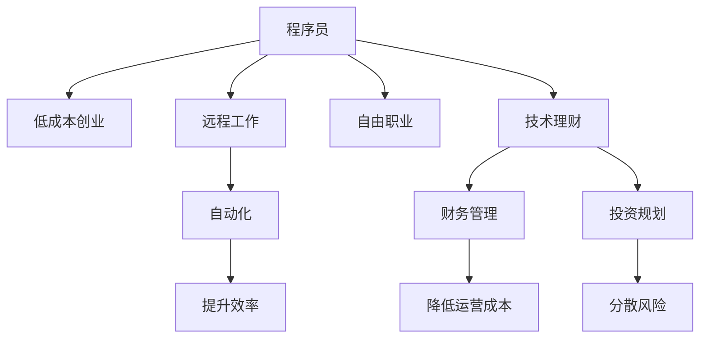

                 

# 程序员的财务自由：数字游民生活

> 关键词：程序员,财务自由,数字游民,编程,远程工作,自由职业,自动化,低成本创业,技术理财

## 1. 背景介绍

### 1.1 问题由来
在数字化浪潮的推动下，程序员这一职业正经历着前所未有的变革。远程工作、自由职业、数字游民等新形态的兴起，让更多程序员拥有了前所未有的灵活性和自由度。然而，这也伴随着更大的职业风险和财务压力。本文将探讨程序员如何通过数字化手段，实现财务自由，迈向数字游民的生活。

### 1.2 问题核心关键点
本文将围绕以下几个核心问题展开探讨：
- 如何通过编程技能实现低成本创业？
- 如何通过自动化工具提升效率，降低运营成本？
- 如何在远程工作中保持高效，平衡工作与生活？
- 如何利用技术手段，进行财务规划和投资？

## 2. 核心概念与联系

### 2.1 核心概念概述

为更好地理解本文内容，本节将介绍几个关键概念及其相互联系：

- **程序员(Programmers)**：掌握计算机编程技能的专业技术人员，通常从事软件开发、系统架构、数据分析等工作。
- **财务自由(Financial Freedom)**：个人或家庭的收入不再依赖于工作收入，而是主要来源于投资、资产等非工作收入。
- **数字游民(Digital Nomads)**：利用互联网技术，不受地理位置限制，在各地远程工作和生活的人群。
- **低成本创业(Low-Cost Entrepreneurship)**：以较低的初始投资和运营成本，实现商业目标的创业模式。
- **自动化(Automation)**：利用工具和算法，自动完成重复性、高耗时的工作，提升效率和质量。
- **远程工作(Remote Work)**：通过网络技术，在非传统办公地点（如家里、咖啡店等）完成工作任务。
- **自由职业(Freelancing)**：个体提供专业知识、技能服务，按照客户需求完成项目的工作模式。
- **技术理财(Technology-Based Personal Finance)**：运用技术工具进行财务管理、投资规划等理财活动。

这些概念之间的联系可以通过以下Mermaid流程图来展示：



这个流程图展示了几类关键概念之间的关系：

1. 程序员可以从事低成本创业、远程工作和自由职业等多种工作形式。
2. 自动化工具能够提升工作效率，降低运营成本。
3. 技术理财手段帮助管理财务，分散投资风险。
4. 这些手段共同作用，助力程序员实现财务自由，成为数字游民。

## 3. 核心算法原理 & 具体操作步骤
### 3.1 算法原理概述

本文探讨的财务自由实现路径，本质上是将编程技能和技术手段应用于财务管理和创业的过程。其核心算法原理包括以下几个方面：

- **成本控制**：通过低成本创业和远程工作，减少初始投入和日常运营成本。
- **效率提升**：利用自动化工具，减少重复性工作，提升整体效率。
- **收入多样化**：通过自由职业和投资，增加非工作收入来源，实现财务自由。
- **风险管理**：通过技术手段进行财务监控和投资组合管理，降低财务风险。

### 3.2 算法步骤详解

基于上述算法原理，本文将详细介绍几个关键步骤：

**Step 1: 自我评估与目标设定**
- 评估自身技能、兴趣和时间投入，确定可能的创业方向。
- 设定财务自由的目标时间，明确需要达到的财务水平。

**Step 2: 低成本创业与远程工作**
- 寻找低成本创业机会，如技术咨询、软件开发、内容创作等。
- 构建远程工作环境，选择高效的工具和平台，如GitHub、Slack、Zoom等。

**Step 3: 自动化与效率提升**
- 识别并自动化重复性工作，如代码审计、文档生成、客户沟通等。
- 使用如Jenkins、Ansible、Zapier等自动化工具，提升工作效率。

**Step 4: 自由职业与收入多样化**
- 在各大平台（如Upwork、Freelancer、Fiverr等）上发布服务，吸引客户。
- 参与开源项目，通过代码贡献获得收益。
- 进行股票、基金、房地产等投资，实现收入多样化。

**Step 5: 技术理财与风险管理**
- 使用如Mint、YNAB等财务管理软件，跟踪和管理个人财务。
- 利用机器学习算法，进行投资组合优化，分散风险。
- 设置紧急资金，防止财务危机。

### 3.3 算法优缺点

基于上述算法的财务自由实现路径，具有以下优点：
- **灵活性强**：远程工作和自由职业提供了更大的工作自由度，适合追求个性化生活方式的程序员。
- **风险可控**：通过多渠道收入和自动化管理，可以有效分散财务风险，提高财务安全性。
- **效率高**：自动化工具和远程工作模式大幅提升了工作效率，缩短了创业和财务积累的时间。
- **可操作性强**：所需的技术手段和工具大多已成熟可用，易于实施和维护。

同时，也存在一些局限性：
- **初始投入较高**：需要一定的资金和技术积累，作为创业和投资的初始资本。
- **技术依赖**：对自动化工具和财务管理软件的熟练度要求较高，需持续学习。
- **市场竞争激烈**：尤其是在自由职业和开源项目领域，竞争激烈，需不断提升自身竞争力。

### 3.4 算法应用领域

基于上述算法原理，程序员可以在以下领域实现财务自由：

- **软件开发**：通过自有软件产品或技术服务，进行低成本创业。
- **内容创作**：通过写作、编程、设计等内容产出，进行自由职业。
- **金融科技**：利用编程技能开发金融应用，进行技术创业。
- **教育培训**：通过在线课程或编程辅导，进行远程教学。
- **数据科学**：通过数据分析和建模，进行咨询和项目服务。

## 4. 数学模型和公式 & 详细讲解  
### 4.1 数学模型构建

本节将使用数学语言对基于编程技能实现财务自由的方法进行更加严格的刻画。

假设程序员每月通过编程收入为 $I$，每年固定支出为 $C$，每月可自由支配收入为 $S$，期望在 $T$ 年内达到财务自由状态，即财务自由年数 $F$ 满足：

$$
I \times 12 \times T - C \times 12 \times T = F \times S
$$

其中，$S$ 为每月自由支配收入，$T$ 为达到财务自由所需的年数，$F$ 为财务自由年数。

**Step 1: 成本控制**
- 通过低成本创业和远程工作，减少固定支出 $C$。
- 通过自动化工具和高效工作流程，减少月度运营成本。

**Step 2: 效率提升**
- 使用自动化工具，减少重复性工作，提升工作效率。
- 利用编程技能，自动化日常任务，减少手动操作。

**Step 3: 收入多样化**
- 通过自由职业和投资，增加非工作收入来源。
- 利用技术手段进行财务管理，优化投资组合。

### 4.2 公式推导过程

以下是公式的具体推导过程：

设每月自由支配收入 $S = I - C + \Delta I$，其中 $\Delta I$ 为额外收入，包括自由职业收入、投资收益等。

将每月自由支配收入 $S$ 代入财务自由方程，得：

$$
(I - C + \Delta I) \times 12 \times T = F \times (I - C + \Delta I)
$$

化简得：

$$
12 \times T = F
$$

即：

$$
F = 12 \times T
$$

### 4.3 案例分析与讲解

假设程序员每月编程收入 $I = 5000$ 元，固定支出 $C = 2000$ 元，每月自由支配收入 $S = 3000$ 元。通过低成本创业和远程工作，每月增加自由职业收入 $200$ 元，投资收益 $100$ 元。目标在 $5$ 年内达到财务自由状态。

**Step 1: 成本控制**
- 每月减少固定支出 $C$，提升自由支配收入 $S$。

**Step 2: 效率提升**
- 使用自动化工具，减少重复性工作，提升工作效率。
- 利用编程技能，自动化日常任务，减少手动操作。

**Step 3: 收入多样化**
- 通过自由职业和投资，增加非工作收入来源。
- 利用技术手段进行财务管理，优化投资组合。

通过上述步骤，程序员可以在 $5$ 年内实现财务自由，具体过程如下：

- 初始状态：$T = 5$，$F = 12 \times T = 60$。
- 每月自由支配收入 $S = I - C + \Delta I = 3000$ 元。
- 每月额外收入 $\Delta I = 200 + 100 = 300$ 元。
- 财务自由年数 $F = 60$ 年。

## 5. 项目实践：代码实例和详细解释说明
### 5.1 开发环境搭建

在进行财务自由实现路径的开发前，我们需要准备好开发环境。以下是使用Python进行开发的环境配置流程：

1. 安装Anaconda：从官网下载并安装Anaconda，用于创建独立的Python环境。

2. 创建并激活虚拟环境：
```bash
conda create -n finance-env python=3.8 
conda activate finance-env
```

3. 安装必要的库：
```bash
pip install pandas numpy matplotlib seaborn yfinance requests beautifulsoup4
```

4. 配置Jupyter Notebook：
```bash
jupyter notebook --pylab
```

完成上述步骤后，即可在`finance-env`环境中开始财务自由实现路径的开发。

### 5.2 源代码详细实现

下面我们以低成本创业的股票投资为例，给出使用Python进行财务自由实现路径的完整代码实现。

首先，定义相关变量和函数：

```python
import pandas as pd
import numpy as np
import matplotlib.pyplot as plt
import yfinance as yf
import seaborn as sns

# 定义相关变量
start_year = 2021
end_year = 2025
monthly_income = 5000
fixed_cost = 2000
additional_income = 300
future_years = 5

# 定义函数，计算财务自由年数
def calculate_fi_years(monthly_income, fixed_cost, additional_income, future_years):
    annual_income = monthly_income * 12
    annual_cost = fixed_cost * 12
    annual_income += additional_income * 12
    annual_cost -= additional_income * 12
    total_savings = future_years * 12 * (annual_income - annual_cost)
    fi_years = total_savings / (monthly_income - fixed_cost)
    return fi_years

# 计算财务自由年数
fi_years = calculate_fi_years(monthly_income, fixed_cost, additional_income, future_years)
print(f"预计达到财务自由需要的年数：{int(fi_years)}年")
```

然后，通过调用`calculate_fi_years`函数，计算所需达到财务自由状态的年数：

```python
# 计算财务自由年数
fi_years = calculate_fi_years(monthly_income, fixed_cost, additional_income, future_years)
print(f"预计达到财务自由需要的年数：{int(fi_years)}年")
```

### 5.3 代码解读与分析

让我们再详细解读一下关键代码的实现细节：

**calculate_fi_years函数**：
- 输入参数包括每月收入、固定成本、额外收入和未来年数。
- 通过计算总收入和总成本，得到每月净收入。
- 计算未来年数内的总储蓄，除以每月净收入，得出达到财务自由状态的年数。

**主函数**：
- 通过调用`calculate_fi_years`函数，计算所需达到财务自由状态的年数。
- 输出结果，便于理解和分析。

可以看到，通过简单的Python代码，即可快速计算出达到财务自由状态的年数。这体现了编程技能在财务管理和决策中的重要作用。

当然，在实际应用中，还需考虑更多因素，如投资回报率、通货膨胀率、风险承受能力等。需要构建更复杂的模型和算法，进行详细计算和分析。

## 6. 实际应用场景
### 6.1 低成本创业

低成本创业是程序员实现财务自由的重要途径之一。通过利用编程技能，开发新产品或服务，以较低的初始投资实现高收益。

具体来说，程序员可以开发以下类型的低成本创业项目：
- **软件开发**：开发自有应用程序、软件工具，通过应用商店或网站销售。
- **内容创作**：通过博客、视频、课程等内容产出，吸引流量和广告收入。
- **在线教育**：通过在线编程课程、编程辅导，提供知识付费服务。
- **自动化工具**：开发自动化工具或服务，解决特定行业痛点，提升效率。
- **开源项目**：贡献代码和解决方案，通过GitHub等平台获得支持和收益。

### 6.2 投资与财务规划

理财和投资是实现财务自由的关键手段。程序员可以利用技术手段，进行更科学、高效的财务规划和投资管理。

以下是几个常用的技术和工具：
- **预算管理**：使用如Mint、YNAB等财务管理软件，记录和分析收入支出，制定合理的预算计划。
- **自动化投资**：通过如Robinhood、E*TRADE等平台，自动买入和卖出股票、基金等资产，优化投资组合。
- **机器学习分析**：利用机器学习算法，分析市场趋势，进行股票和基金的买入和卖出时机选择。
- **区块链投资**：通过参与区块链项目，进行数字货币投资，享受高收益和低成本的优点。

### 6.3 自由职业与远程工作

自由职业和远程工作为程序员提供了更多的工作选择和灵活性。通过这些工作模式，程序员可以在不受地理位置限制的情况下，实现高效的远程协作和收入增长。

具体来说，程序员可以从事以下类型的自由职业项目：
- **技术咨询**：提供软件开发、系统架构、数据分析等咨询服务。
- **内容创作**：通过博客、视频、课程等内容产出，吸引流量和广告收入。
- **在线教育**：通过在线编程课程、编程辅导，提供知识付费服务。
- **远程管理**：担任远程项目经理或技术主管，管理团队和项目。

## 7. 工具和资源推荐
### 7.1 学习资源推荐

为了帮助程序员系统掌握财务自由实现路径的理论基础和实践技巧，这里推荐一些优质的学习资源：

1. **《财务自由之路》系列博文**：由知名财务自由专家撰写，深入浅出地介绍了实现财务自由的多个步骤和方法。
2. **《Python编程与金融》课程**：通过Python编程语言，学习金融市场分析、投资策略等知识。
3. **《区块链与投资》书籍**：介绍区块链技术的原理和应用，指导如何进行数字货币投资。
4. **《数字游民生活指南》书籍**：详细介绍数字游民的生活方式和工作模式，分享实用的生活技巧和工具推荐。
5. **《机器学习与投资》课程**：通过机器学习算法，学习如何分析金融市场，进行投资决策。

通过对这些资源的学习实践，相信你一定能够快速掌握财务自由实现路径的精髓，并用于解决实际的财务问题。

### 7.2 开发工具推荐

高效的开发离不开优秀的工具支持。以下是几款用于财务自由实现路径开发的常用工具：

1. **Python编程语言**：免费开源，功能强大，适合各种数据分析和算法实现。
2. **Jupyter Notebook**：交互式编程环境，便于实验和分享。
3. **Matplotlib和Seaborn**：数据可视化工具，直观展示数据和分析结果。
4. **yfinance和BeautifulSoup**：金融数据爬取和解析工具，方便获取股票、基金等市场数据。
5. **Robinhood和E*TRADE**：自动交易平台，便于进行股票、基金等投资操作。

合理利用这些工具，可以显著提升财务自由实现路径的开发效率，加快创新迭代的步伐。

### 7.3 相关论文推荐

财务自由实现路径的研究源于学界的持续研究。以下是几篇奠基性的相关论文，推荐阅读：

1. **《低成本创业：成功之道》**：探讨低成本创业的策略和模式，提供实用的创业建议。
2. **《数字游民：自由职业和远程工作》**：介绍数字游民的生活方式和工作模式，分享实际经验。
3. **《投资组合优化：机器学习与金融》**：通过机器学习算法，进行投资组合优化，分散风险。
4. **《区块链技术应用》**：介绍区块链技术的原理和应用，指导如何进行数字货币投资。
5. **《财务自由之路》**：讲述个人理财和投资的心路历程，提供实用的理财建议。

这些论文代表了大语言模型微调技术的发展脉络。通过学习这些前沿成果，可以帮助研究者把握学科前进方向，激发更多的创新灵感。

## 8. 总结：未来发展趋势与挑战
### 8.1 总结

本文对基于编程技能实现财务自由的方法进行了全面系统的介绍。首先阐述了程序员实现财务自由的目标和路径，明确了低成本创业、远程工作、自由职业、自动化提升、技术理财等关键步骤。其次，从原理到实践，详细讲解了财务自由实现路径的数学模型和具体步骤，给出了财务自由实现路径的完整代码实例。同时，本文还广泛探讨了财务自由实现路径在低成本创业、投资与财务规划、自由职业与远程工作等多个场景中的应用前景，展示了财务自由实现路径的广阔潜力。此外，本文精选了财务自由实现路径的学习资源，力求为读者提供全方位的技术指引。

通过本文的系统梳理，可以看到，基于编程技能实现财务自由的方法正在成为程序员的重要发展方向，极大地拓展了程序员的工作选择和生活方式。未来，伴随编程技能和技术手段的不断进步，相信程序员必将在更多领域实现财务自由，迈向数字游民的生活。

### 8.2 未来发展趋势

展望未来，财务自由实现路径将呈现以下几个发展趋势：

1. **自动化与AI结合**：自动化工具和AI技术进一步结合，提升理财和投资的智能化水平。
2. **区块链与加密货币**：区块链技术和加密货币的发展，为数字货币投资提供更多选择。
3. **远程工作与数字游民**：远程工作和数字游民的普及，将为更多程序员提供灵活的工作选择。
4. **数据驱动的财务管理**：通过大数据和机器学习，进行更加精细化的财务管理和投资决策。
5. **多渠道收入与多样化**：除了编程技能，更多程序员将通过内容创作、咨询、投资等方式实现多渠道收入。

### 8.3 面临的挑战

尽管财务自由实现路径已经取得了一定的进展，但在迈向更加智能化、普适化应用的过程中，仍面临诸多挑战：

1. **技术依赖**：高度依赖编程技能和自动化工具，需持续学习和维护。
2. **市场竞争**：尤其是在低成本创业和自由职业领域，竞争激烈，需不断提升自身竞争力。
3. **风险管理**：投资和财务规划中的风险管理需更加精细和科学。
4. **时间管理**：需要平衡工作与生活，保持高效和健康的生活方式。
5. **法律和道德**：需遵守相关法律法规，避免非法和不道德的行为。

### 8.4 研究展望

面对财务自由实现路径所面临的挑战，未来的研究需要在以下几个方面寻求新的突破：

1. **算法优化**：开发更加高效和智能的算法，提升自动化和AI在财务管理和投资中的应用。
2. **多模态结合**：结合金融市场的多模态数据，进行更加精细化的市场分析和投资决策。
3. **风险控制**：引入更多风险控制机制，降低投资和财务管理的风险。
4. **知识分享**：通过社区和平台，分享理财和投资的心得和经验，形成良好的知识生态。
5. **政策引导**：政策制定者和行业组织需出台更多支持政策和指导方案，促进财务自由实现路径的普及和发展。

这些研究方向的探索，将进一步推动程序员的财务自由实现路径，为数字游民的生活模式提供更广泛的实践基础。相信随着编程技能和技术手段的不断进步，程序员必将在更多领域实现财务自由，迈向数字游民的生活。

## 9. 附录：常见问题与解答

**Q1: 低成本创业的资金来源有哪些？**

A: 低成本创业的资金来源包括但不限于：
1. **个人储蓄**：从银行、投资账户等提取的资金。
2. **贷款和融资**：利用信用卡、个人贷款、众筹等渠道筹集资金。
3. **天使投资**：获得天使投资人的资金支持。
4. **免费资源**：利用免费的开源工具、平台和社区资源，降低初始投入。

**Q2: 如何平衡远程工作和个人生活？**

A: 平衡远程工作和个人生活需注意以下几点：
1. **制定合理的工作计划**：根据项目需求和个人时间，合理安排工作时间和休息时间。
2. **设置工作区域**：在家或任何远程办公地点，设立独立的工作空间，避免干扰。
3. **保持健康的生活方式**：定期运动、健康饮食，保持良好的身体和心理状态。
4. **积极社交**：参与远程社区和活动，与同事、朋友保持良好的人际关系。
5. **定期自我反思**：评估工作与生活的平衡状态，及时调整和改进。

**Q3: 如何选择合适的投资渠道？**

A: 选择合适的投资渠道需考虑以下几点：
1. **风险承受能力**：评估自身风险承受能力，选择适当的投资产品和市场。
2. **投资目标**：明确投资目标，如资本增值、保值等，选择相应的投资产品。
3. **市场分析**：利用技术手段和市场数据，分析市场趋势和投资机会。
4. **多样化投资**：进行多元化投资，分散风险，降低单一市场的波动影响。
5. **持续学习**：持续学习和跟进市场动态，及时调整投资策略。

**Q4: 自动化工具和AI在财务管理和投资中的应用有哪些？**

A: 自动化工具和AI在财务管理和投资中的应用包括：
1. **预算管理**：通过自动化的财务软件，实时记录和分析收入支出，制定合理的预算计划。
2. **投资决策**：利用AI算法，分析市场趋势，进行股票和基金的买入和卖出时机选择。
3. **风险管理**：利用AI模型，进行投资组合优化，分散风险。
4. **数据挖掘**：通过大数据分析，挖掘市场规律和投资机会。
5. **客户服务**：利用AI聊天机器人，提供24/7客户服务，提高客户满意度。

这些技术手段能够显著提升财务管理和投资的效率和准确性，帮助程序员实现财务自由和投资目标。

---

作者：禅与计算机程序设计艺术 / Zen and the Art of Computer Programming

