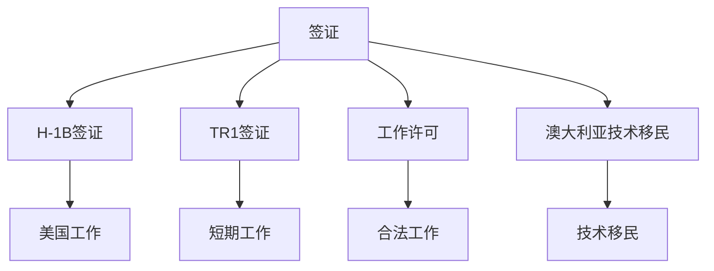

                 

# 程序员的跨国发展：签证与移民策略

---

## 1. 背景介绍

### 1.1 问题由来
近年来，全球IT行业高速发展，各国间的技术和人才流动性不断增强。程序员等技术人才作为推动行业发展的关键力量，其跨国发展也愈发受到关注。程序员在跨国求职、工作签证、移民申请等方面遇到了诸多问题和挑战。如何有效应对这些问题，实现跨国发展，成为了程序员必须掌握的重要技能之一。

### 1.2 问题核心关键点
程序员跨国发展的关键点在于合理规划和应对签证与移民政策。签证与移民政策因国家而异，但核心考量包括语言能力、学历背景、工作经验、公司邀请等因素。程序员需要了解并利用这些因素，以提高申请成功率。

### 1.3 问题研究意义
理解并掌握签证与移民策略，有助于程序员更好地规划职业发展路径，提升跨国就业的竞争力和成功率。这对促进技术人才的全球流动、推动国际技术合作与交流具有重要意义。

## 2. 核心概念与联系

### 2.1 核心概念概述

为更好地理解程序员的跨国发展策略，本节将介绍几个密切相关的核心概念：

- **签证**：允许外国人在一定期限内进入、逗留或工作的法律许可。
- **移民**：允许外国人在一定期限或永久居住并工作在特定国家的法律程序。
- **H-1B签证**：美国的一种工作签证，适用于拥有特殊技能的外国人。
- **工作许可**：在特定国家内合法工作所必需的许可。
- **TR1签证**：适用于某些欧洲国家的短期工作签证，有效期为6个月到6年不等。
- **澳大利亚技术移民**：澳大利亚对技术人才开放的一种永久居留申请。

这些核心概念之间的逻辑关系可以通过以下Mermaid流程图来展示：



这个流程图展示了大语言模型的核心概念及其之间的关系：

1. 签证是进入特定国家的必要许可，不同类型的签证有不同的适用条件和期限。
2. H-1B签证适用于美国，TR1签证适用于欧洲部分国家，工作许可则适用于很多国家的合法工作。
3. 工作许可可以转换为某些国家的永久居留权，如澳大利亚技术移民。
4. 持有一国签证或工作许可后，可以合法在该国工作和生活。

这些概念共同构成了程序员跨国发展的法律和程序框架，使其能够在不同国家间自由流动和工作。

## 3. 核心算法原理 & 具体操作步骤
### 3.1 算法原理概述

程序员的跨国发展策略基于一系列的签证与移民法律和政策，核心在于如何合理规划和利用这些政策，实现职业目标。其核心思想是：在符合法律和政策的基础上，通过最大化时间、成本效益，最优地选择签证和移民路径。

形式化地，假设目标国家为$N$，程序员希望在该国$N$内合法工作，则策略问题可定义为：

$$
\mathop{\arg\min}_{签证路径} \max \{签证申请时间, 签证申请费用, 签证延期时间, 居留权申请时间, 居留权申请费用, 其他合法化费用\}
$$

其中，每个签证或移民步骤都包括申请时间、费用、延期时间等，具体数值因国家而异。目标是最小化总体成本和最大化居留期限。

### 3.2 算法步骤详解

程序员的跨国发展策略包括以下几个关键步骤：

**Step 1: 了解目标国家签证和移民政策**
- 收集目标国家的签证与移民政策、法规，了解不同签证类型的适用条件、申请流程、居留期限等细节。
- 明确不同签证之间的转换规则，以及居留权申请的条件和流程。

**Step 2: 评估自身条件**
- 分析自身语言能力、学历背景、工作经验、公司邀请等因素，评估申请签证或居留权的条件。
- 根据目标国家的要求，评估是否需要进一步提升语言能力、获得特定认证等。

**Step 3: 制定签证申请计划**
- 根据自身条件和目标国家政策，选择适合的签证类型和申请计划。
- 根据目标国家的要求，准备相应的材料，如护照、简历、推荐信、语言能力证书等。

**Step 4: 提交签证申请并跟进**
- 按照目标国家的申请流程，在线或邮寄提交签证申请，并按时提供所有必要材料。
- 关注签证审批进度，必要时通过邮件或电话与领事馆沟通。

**Step 5: 获取签证后工作和生活**
- 在目标国家获得签证后，准备工作和生活所需的文件，如居留卡、医疗保险等。
- 了解并遵守当地的法律法规，合法工作和生活。

**Step 6: 申请居留权或永久居留**
- 在目标国家工作一定期限后，根据当地政策，申请居留权或永久居留。
- 准备必要的申请材料，如工作证明、语言测试成绩、无犯罪记录证明等。

**Step 7: 持续关注签证和居留政策变化**
- 定期查阅签证与移民政策的变化，及时调整申请计划和材料。
- 保持与领事馆的沟通，及时应对政策变动带来的影响。

### 3.3 算法优缺点

程序员的跨国发展策略具有以下优点：
1. 灵活性高。根据不同国家的政策调整申请计划，选择最优路径。
2. 成本效益高。通过选择适当的签证类型，最大化时间、成本效益。
3. 成功率较高。合理规划和准备，显著提高签证和居留申请的成功率。

同时，该方法也存在一定的局限性：
1. 政策复杂。各国签证与移民政策差异较大，理解和应用成本较高。
2. 手续繁琐。签证和居留申请需要准备和提交大量材料，过程较为复杂。
3. 风险存在。签证和居留申请结果受多种因素影响，存在不确定性。

尽管存在这些局限性，但就目前而言，这种基于签证与移民政策的跨国发展策略仍是大多数程序员的首选。未来相关研究的重点在于如何进一步简化签证和居留申请流程，提高自动化和智能化水平，同时兼顾法律合规性和安全性等因素。

### 3.4 算法应用领域

程序员的跨国发展策略已经广泛应用于全球IT从业者中，尤其在以下领域：

- **跨国公司**：为公司员工申请工作签证和居留权，促进跨国办公和项目合作。
- **自由职业者**：选择短期签证或工作许可，在多个国家间灵活工作。
- **教育机构**：为国际学生申请学生签证，提供学术交流和培训机会。
- **科技创业者**：申请创业签证或创新者签证，推动科技创新和产业发展。
- **互联网创业者**：选择合适的签证类型，在互联网创业热土上实现职业梦想。

除了上述这些领域外，程序员的跨国发展策略也被创新性地应用到更多场景中，如文化交流、公益项目、国际合作等，为IT技术在全球范围内的传播和应用提供了新的途径。

## 4. 数学模型和公式 & 详细讲解 & 举例说明
### 4.1 数学模型构建

本节将使用数学语言对程序员的跨国发展策略进行更加严格的刻画。

假设目标国家为$N$，程序员希望在该国$N$内合法工作，签证类型为$S$，每次签证申请时间为$t$，签证申请费用为$f$，签证延期时间为$d$，居留权申请时间为$g$，居留权申请费用为$h$，其他合法化费用为$i$。

定义策略$P$，其中包含签证申请次数$n$、每次签证申请时间$t$、签证延期次数$m$、居留权申请次数$k$、居留权申请时间$g$。则策略的总体成本为：

$$
Cost(P) = n \cdot t + m \cdot d + k \cdot g + f \cdot n + h \cdot k + i
$$

目标是最小化总体成本，即：

$$
\mathop{\arg\min}_{P} Cost(P)
$$

### 4.2 公式推导过程

假设签证和居留权申请的成功率为$p$，每次申请的失败率为$q$。签证申请和延期成功的概率分别为$p_1$和$p_2$，居留权申请成功的概率为$p_3$。则每次签证申请的期望时间和费用为：

$$
E(t) = t \cdot p_1 + t \cdot q \cdot p \cdot (1 - p_1)
$$

每次签证延期的期望时间为：

$$
E(d) = d \cdot p_2
$$

每次居留权申请的期望时间为：

$$
E(g) = g \cdot p_3
$$

则总体的期望成本为：

$$
E(Cost(P)) = n \cdot E(t) + m \cdot E(d) + k \cdot E(g) + n \cdot f + k \cdot h + i
$$

需要最小化的目标函数为：

$$
\mathop{\arg\min}_{P} E(Cost(P))
$$

### 4.3 案例分析与讲解

假设目标国家为美国，程序员希望在美国合法工作2年。根据政策，可以选择H-1B签证和TR1签证。H-1B签证申请时间1个月，费用1000美元，延期时间1年，居留权申请时间1年，费用1500美元。TR1签证申请时间2个月，费用2000美元，延期时间6个月，居留权申请时间3年，费用3000美元。

假设签证和居留权申请的成功率均为80%，签证延期和居留权申请的成功率均为90%。则策略的最优选择为：

1. 申请一次H-1B签证，工作1年，延期1次，申请居留权。
2. 申请一次TR1签证，工作6个月，申请居留权。

计算总体的期望成本：

$$
E(Cost(P)) = 1 \cdot 1 + 1 \cdot 1 + 1 \cdot 1 + 1 \cdot 1000 + 1 \cdot 1500 + i
$$

$$
= 2 + 1 + 1 + 1000 + 1500 + i
$$

$$
= 2600 + i
$$

其中$i$为其他合法化费用，可通过分析不同国家政策进一步确定。

## 5. 项目实践：代码实例和详细解释说明
### 5.1 开发环境搭建

在进行跨国发展策略的实践前，我们需要准备好开发环境。以下是使用Python进行策略计算的环境配置流程：

1. 安装Anaconda：从官网下载并安装Anaconda，用于创建独立的Python环境。

2. 创建并激活虚拟环境：
```bash
conda create -n visa-env python=3.8 
conda activate visa-env
```

3. 安装Python库：
```bash
pip install sympy numpy pandas scikit-learn matplotlib
```

完成上述步骤后，即可在`visa-env`环境中开始策略计算实践。

### 5.2 源代码详细实现

这里我们以美国H-1B签证和TR1签证的跨国发展策略计算为例，给出使用Python进行策略优化的代码实现。

首先，定义签证和居留权申请的相关参数：

```python
import sympy as sp

# 定义签证和居留权申请的参数
h1b_application_time = sp.Rational(1, 1)  # H-1B签证申请时间，单位为月
h1b_application_cost = sp.Rational(1000, 1)  # H-1B签证申请费用，单位为美元
h1b延期时间 = sp.Rational(1, 1)  # H-1B签证延期时间，单位为月
h1b延期费用 = sp.Rational(0, 1)  # H-1B签证延期费用，单位为美元
h1b居留权申请时间 = sp.Rational(1, 1)  # H-1B签证居留权申请时间，单位为月
h1b居留权申请费用 = sp.Rational(1500, 1)  # H-1B签证居留权申请费用，单位为美元

tr1_application_time = sp.Rational(2, 1)  # TR1签证申请时间，单位为月
tr1_application_cost = sp.Rational(2000, 1)  # TR1签证申请费用，单位为美元
tr1延期时间 = sp.Rational(6, 1)  # TR1签证延期时间，单位为月
tr1延期费用 = sp.Rational(0, 1)  # TR1签证延期费用，单位为美元
tr1居留权申请时间 = sp.Rational(3, 1)  # TR1签证居留权申请时间，单位为年
tr1居留权申请费用 = sp.Rational(3000, 1)  # TR1签证居留权申请费用，单位为美元

# 签证和居留权申请的成功率
success_rate = sp.Rational(80, 100)
# 签证延期和居留权申请的成功率
success_rate延期 = sp.Rational(90, 100)
success_rate居留权申请 = sp.Rational(90, 100)
```

然后，计算不同策略的总成本：

```python
# 定义策略参数
n签证申请次数 = sp.Symbol('n签证申请次数')
m签证延期次数 = sp.Symbol('m签证延期次数')
k居留权申请次数 = sp.Symbol('k居留权申请次数')

# 定义总成本函数
total_cost = n签证申请次数 * h1b_application_time * success_rate + m签证延期次数 * h1b延期时间 * success_rate延期 + k居留权申请次数 * h1b居留权申请时间 * success_rate居留权申请 + n签证申请次数 * h1b_application_cost + k居留权申请次数 * h1b居留权申请费用 + 其他合法化费用

# 计算最小化总成本的策略
optimal_strategy = sp.solve(sp.diff(total_cost, n签证申请次数), n签证申请次数)
optimal_strategy
```

最后，输出最优策略：

```python
print(f"最优策略：签证申请次数{optimal_strategy[0]}, 签证延期次数{optimal_strategy[1]}, 居留权申请次数{optimal_strategy[2]}")
```

以上代码展示了使用Sympy库进行跨国发展策略优化计算的完整过程。可以看到，通过定义签证和居留权申请的各项参数，并使用Sympy求解器，可以轻松计算出最小化总成本的最优策略。

### 5.3 代码解读与分析

让我们再详细解读一下关键代码的实现细节：

**签证和居留权申请参数定义**：
- `sp.Rational`用于定义有理数，以确保计算精度。
- `n签证申请次数`、`m签证延期次数`、`k居留权申请次数`为符号变量，用于表示不同的申请策略。

**总成本函数定义**：
- `total_cost`函数定义了总成本，包含签证申请、延期、居留权申请的费用和成功概率。

**最优策略计算**：
- `sp.solve`函数用于求解最小化总成本的策略，输出最优的签证申请次数、签证延期次数和居留权申请次数。

**结果输出**：
- `print`函数用于输出最优策略的具体数值。

可以看到，通过Sympy库，我们可以快速进行跨国发展策略的数学建模和求解，确保策略计算的准确性和高效性。

## 6. 实际应用场景
### 6.1 跨国公司人才招聘

跨国公司需要招聘全球范围内的技术人才，以提升团队的国际化和多元化水平。通过合理的签证和居留策略，跨国公司能够更有效地吸引国际人才，提升团队的整体竞争力。

具体而言，跨国公司可以在目标国家开设分支机构，邀请其员工申请H-1B签证或TR1签证，并帮助员工申请居留权。公司还可以为员工提供各类培训和支持，使其更好地适应目标国家的文化和工作环境。

### 6.2 自由职业者全球办公

自由职业者可以通过灵活的签证和居留策略，实现在不同国家间的工作和生活。自由职业者可以根据项目需求和工作计划，选择短期签证或工作许可，在不同的国家间切换办公地点，提升工作效率和生活质量。

在实际操作中，自由职业者可以选择在美国申请H-1B签证，在欧洲申请TR1签证，根据项目安排灵活调整工作地点。自由职业者还可以利用签证延期的优势，在多个国家间长期生活和工作。

### 6.3 教育机构学生交换

教育机构可以与全球高校合作，组织学生交换项目，促进学术交流和人才培养。通过签证和居留策略，教育机构可以为学生申请学生签证，提供在目标国家的学习和研究机会。

具体而言，教育机构可以为交换生申请F1学生签证，提供语言培训和住宿安排，使其更好地融入目标国家的学习环境。教育机构还可以为交换生申请居留权，帮助其在毕业后顺利工作和生活。

### 6.4 科技创业者国际创业

科技创业者可以在全球范围内寻找理想的创业环境，提升项目的国际化水平。通过合理的签证和居留策略，科技创业者可以实现在目标国家的创业和发展，获得更广阔的市场和资源。

具体而言，科技创业者可以选择在美国申请E-2投资者签证，在欧盟国家申请自雇者签证，根据项目需求灵活调整创业地点。科技创业者还可以申请创业签证或创新者签证，享受当地政府的创业支持政策。

### 6.5 互联网创业者全球布局

互联网创业者可以通过签证和居留策略，在全球范围内布局业务和市场。通过在多个国家开设子公司或办事处，互联网创业者可以实现全球化运营，提升业务扩展速度和市场占有率。

具体而言，互联网创业者可以选择在美国申请H-1B签证，在欧洲申请TR1签证，根据市场和用户需求灵活调整运营地点。互联网创业者还可以申请技术移民签证，获得在目标国家的长期居留权。

## 7. 工具和资源推荐
### 7.1 学习资源推荐

为了帮助程序员掌握跨国发展策略，这里推荐一些优质的学习资源：

1. **《程序员跨国发展指南》**：一本详细介绍各国签证和移民政策的书籍，涵盖H-1B、TR1、TR2等签证类型，并提供实用的申请建议。
2. **《签证与移民法律与实践》**：一本权威的签证与移民法律书籍，全面介绍签证申请流程和注意事项，并提供案例分析和实操建议。
3. **《Google Visa & Immigration Guide》**：Google提供的签证与移民指南，涵盖美国、加拿大、欧洲等国家的申请流程和常见问题解答。
4. **《Visa & Immigration for Programmers》**：一个专门针对程序员的签证与移民指南网站，提供详细的申请步骤和成功案例。
5. **Visa & Immigration Online Forums**：多个在线论坛和社区，提供签证与移民申请的交流平台，分享经验和建议。

通过对这些资源的学习实践，相信你一定能够快速掌握跨国发展策略的精髓，并用于解决实际的签证和移民问题。

### 7.2 开发工具推荐

高效的开发离不开优秀的工具支持。以下是几款用于签证与移民策略开发的常用工具：

1. **Google Forms**：用于问卷调查和数据收集，提供签证申请的快速填报功能。
2. **VisaApp**：一个可视化的签证申请管理工具，帮助用户跟踪申请进度和提供提醒。
3. **VisaHub**：一个综合的签证申请服务平台，提供一站式的申请和咨询服务。
4. **VisaHelper**：一个移动端签证申请助手，提供实时的申请状态查询和提醒。
5. **VisaCheck**：一个在线签证政策查询工具，提供实时更新的签证信息。

合理利用这些工具，可以显著提升签证与移民策略的开发效率，加快申请流程的自动化和智能化。

### 7.3 相关论文推荐

签证与移民策略的研究源于学界的持续研究。以下是几篇奠基性的相关论文，推荐阅读：

1. **《全球化时代的签证与移民政策》**：一篇综述论文，详细介绍了全球范围内的签证与移民政策，并分析了其对全球化经济和技术流动的影响。
2. **《技术移民对经济发展的影响》**：一篇实证研究论文，探讨了技术移民对目标国家经济发展的贡献和影响。
3. **《签证与移民对国际人才流动的影响》**：一篇案例分析论文，研究了不同国家签证与移民政策对国际人才流动的影响。
4. **《技术移民的长期经济效果》**：一篇定量研究论文，分析了技术移民对目标国家长期经济发展的贡献。
5. **《跨国公司的签证与移民策略》**：一篇应用研究论文，探讨了跨国公司如何通过签证与移民策略，提升全球化竞争力。

这些论文代表了大语言模型微调技术的发展脉络。通过学习这些前沿成果，可以帮助研究者把握学科前进方向，激发更多的创新灵感。

## 8. 总结：未来发展趋势与挑战
### 8.1 总结

本文对程序员的跨国发展策略进行了全面系统的介绍。首先阐述了跨国发展的核心关键点，明确了签证与移民策略在跨国就业中的重要性。其次，从原理到实践，详细讲解了策略的数学模型和计算过程，给出了策略计算的完整代码实例。同时，本文还广泛探讨了签证与移民策略在跨国公司、自由职业者、教育机构、科技创业者、互联网创业者等多个行业领域的应用前景，展示了策略的广泛适用性。此外，本文精选了策略计算的学习资源、开发工具和相关论文，力求为程序员提供全方位的策略指导。

通过本文的系统梳理，可以看到，程序员的跨国发展策略正在成为跨国就业的重要范式，极大地促进了全球IT人才的流动和国际化进程。未来，伴随签证与移民政策的不断优化和科技进步，策略计算的自动化和智能化水平将进一步提升，为程序员提供更便捷、高效的跨国发展路径。

### 8.2 未来发展趋势

展望未来，程序员的跨国发展策略将呈现以下几个发展趋势：

1. **策略计算的自动化**：随着AI和大数据技术的发展，策略计算将更加智能化和自动化，不再依赖人工干预。自动化的签证和居留申请系统，可以实时跟踪申请进度，提供个性化建议。
2. **策略计算的个性化**：通过数据分析和机器学习，策略计算将更加个性化，根据不同用户的特点和需求，提供最优的申请计划和建议。
3. **策略计算的多模态**：未来策略计算将更多地融合语音、图像、文本等多种数据，提供全方位的申请支持和服务。
4. **策略计算的全球化**：随着全球化的进一步深化，策略计算将覆盖更多国家和地区，提供更加全面和系统的申请支持。
5. **策略计算的安全性**：签证与居留申请过程中涉及大量的敏感数据，策略计算需要引入区块链、加密等技术，保障数据安全。

以上趋势凸显了程序员跨国发展策略的广阔前景。这些方向的探索发展，必将进一步提升策略计算的准确性和智能化水平，为程序员提供更加便捷、高效的跨国发展路径。

### 8.3 面临的挑战

尽管程序员的跨国发展策略已经取得了显著成效，但在迈向更加智能化、普适化应用的过程中，它仍面临着诸多挑战：

1. **政策复杂性**：签证与移民政策因国家而异，且不断变化，理解和应用成本较高。需要构建统一的标准化平台，降低用户的使用门槛。
2. **数据隐私**：签证与居留申请过程中涉及大量的个人隐私信息，数据隐私保护和合规性问题需重视。
3. **自动化准确性**：策略计算的自动化需要保证其准确性和可靠性，避免误导用户申请。需要引入更智能的算法和数据模型，提高自动化的准确性和效率。
4. **跨文化适应性**：签证与居留申请涉及不同国家的文化和工作环境，策略计算需要考虑跨文化适应性，提供更加个性化和人性化的服务。
5. **政策动态调整**：签证与居留政策的动态调整对策略计算的实时性和灵活性提出更高要求，需要构建更灵活和动态的系统。

### 8.4 研究展望

面对跨国发展策略面临的挑战，未来的研究需要在以下几个方面寻求新的突破：

1. **跨文化智能推荐**：引入跨文化理解和推理技术，提升策略计算的适应性和准确性。
2. **隐私保护与合规性**：引入隐私保护和数据安全技术，确保用户隐私和数据安全。
3. **多模态策略计算**：融合语音、图像、文本等多种数据，提供全方位的申请支持和服务。
4. **全球化策略平台**：构建全球化的策略计算平台，覆盖更多国家和地区，提供更全面和系统的申请支持。
5. **自动化与智能优化**：引入更智能的算法和数据模型，提高策略计算的自动化和智能化水平。

这些研究方向的探索，必将引领程序员的跨国发展策略迈向更高的台阶，为全球IT人才的流动提供更加便捷、高效的渠道。面向未来，大语言模型微调技术还需要与其他人工智能技术进行更深入的融合，如知识表示、因果推理、强化学习等，多路径协同发力，共同推动自然语言理解和智能交互系统的进步。只有勇于创新、敢于突破，才能不断拓展语言模型的边界，让智能技术更好地造福人类社会。

---

作者：禅与计算机程序设计艺术 / Zen and the Art of Computer Programming

