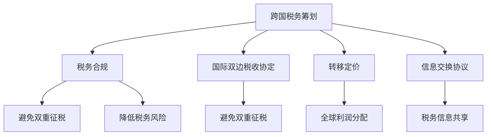

                 

## 1. 背景介绍

作为一名成功的跨国企业CTO，你不仅需要在技术上不断突破，同时也需要具备出色的财务头脑，特别是税务筹划。全球经济环境复杂多变，不同的国家有不同的税务政策和税法规定。本文将探讨程序员如何在跨国工作中进行有效的税务筹划，帮助企业合法合规地降低税负，同时确保自己的税务合规性。

## 2. 核心概念与联系

### 2.1 核心概念概述

- **跨国税务筹划**：通过合法的手段，运用税法，在税收负担方面进行规划和筹划，以实现节税或避税的目的。
- **税务合规**：确保企业及个人的税务行为符合所在国家的税法规定，避免因税务违规而产生的罚款和法律风险。
- **国际双边税收协定**：多个国家之间签订的协议，旨在避免双重征税，并规范跨国公司的税收行为。
- **转移定价**：跨国公司内部交易价格的制定，用于在全球范围内进行税务筹划，通常涉及关联公司之间的利润分配。
- **信息交换协议**：各国之间签订的协议，旨在共享金融账户和税务信息，以防止逃避税。

### 2.2 核心概念原理和架构的 Mermaid 流程图



此图表展示了跨国税务筹划、税务合规、国际税收协定、转移定价和信息交换协议之间的联系和影响。各概念相互交织，共同作用于税务筹划和合规的目标。

## 3. 核心算法原理 & 具体操作步骤

### 3.1 算法原理概述

跨国税务筹划的核心理念是利用税法的灵活性和不同国家税率的差异，通过合理分配收入、利用税收优惠和转移定价等手段，实现节税或避税。其基本原理可以概括为以下几点：

1. **收入分配策略**：通过在全球范围内分配收入，利用不同国家的税率差异，降低总税负。
2. **税收优惠利用**：寻找并利用各国提供的税收优惠政策，如税收减免、税收抵免和税收饶让等。
3. **转移定价策略**：在关联公司之间调整商品、服务或知识产权的交易价格，以优化税务结构。
4. **国际税收协定的利用**：利用国际双边税收协定，避免双重征税，同时确保税务合规。
5. **信息交换协议的遵循**：遵守信息交换协议，确保税务信息的透明度，避免因信息保密导致的税务风险。

### 3.2 算法步骤详解

1. **确定业务模式和结构**：了解企业的全球业务模式和结构，识别潜在的税务筹划机会。
2. **研究税法**：深入研究各国的税法，了解不同国家的税率、税收优惠和税法规定。
3. **制定税务筹划策略**：基于企业实际情况，制定合适的税务筹划策略，如收入分配、税收优惠利用和转移定价等。
4. **执行和监控**：在实际业务中执行税务筹划策略，同时定期监控和评估其效果，确保合规性。
5. **应对税务检查和调整**：如果税务筹划策略被税务机关质疑，需要准备应对税务检查，必要时进行调整。

### 3.3 算法优缺点

#### 优点：

- **合法合规**：通过合法手段进行税务筹划，避免非法避税的风险。
- **降低税负**：利用税率差异和税收优惠，合法降低企业的税负。
- **灵活性**：策略灵活，可以根据企业实际情况进行调整。

#### 缺点：

- **复杂性**：税务筹划涉及多个国家，税法复杂多变，需要专业知识和经验。
- **风险**：如果筹划不当，可能引发税务争议，甚至导致税务违规和罚款。
- **时间成本**：进行有效的税务筹划需要大量的时间和精力。

### 3.4 算法应用领域

跨国税务筹划适用于所有进行跨国业务的企业，特别是那些有多个实体、跨境交易频繁和业务复杂的企业。其在以下几个领域有特别应用：

- **跨国公司**：需要全球范围内进行税务筹划，以降低整体税负。
- **国际项目**：涉及多个国家的项目，需要进行税收协调和规划。
- **全球资本运作**：涉及跨国资产收购、投资和并购等资本运作，需要考虑税务影响。
- **国际贸易**：跨境商品和服务交易，需要进行贸易税筹划。

## 4. 数学模型和公式 & 详细讲解 & 举例说明

### 4.1 数学模型构建

假设某跨国公司有A、B两个子公司，分别位于税率不同的国家A和B，税率分别为$T_A$和$T_B$。公司总利润为$P$，设其在A国的收入为$I_A$，B国的收入为$I_B$。

公司可以采用以下策略进行税务筹划：

- **转移定价**：将部分收入从高税率国家A转移到低税率国家B，假设转移的收入为$I_A'$。

### 4.2 公式推导过程

- **总税负公式**：
  $$
  T = T_A \times I_A + T_B \times I_B
  $$

- **转移定价后的税负公式**：
  $$
  T' = T_A \times (I_A - I_A') + T_B \times (I_B + I_A')
  $$

- **节税公式**：
  $$
  \Delta T = T - T' = I_A' \times (T_B - T_A)
  $$

### 4.3 案例分析与讲解

假设A国税率为30%，B国税率为20%。公司决定将$I_A'$为$I_A$的40%，即$I_A' = 0.4I_A$，进行转移定价。计算节税效果：

- **原税负**：
  $$
  T = 30\% \times I_A + 20\% \times I_B
  $$

- **转移定价后税负**：
  $$
  T' = 30\% \times (I_A - 0.4I_A) + 20\% \times (I_B + 0.4I_A) = 30\% \times 0.6I_A + 20\% \times (I_B + 0.4I_A)
  $$

- **节税效果**：
  $$
  \Delta T = I_A' \times (T_B - T_A) = 0.4I_A \times (20\% - 30\%) = -0.1I_A
  $$

这意味着公司每年可以节省10%的税负。

## 5. 项目实践：代码实例和详细解释说明

### 5.1 开发环境搭建

要实现上述税务筹划策略，需要以下开发环境：

- **Python**：用于编写税务筹划模拟代码。
- **税务软件**：如TaxAct、TurboTax等，用于模拟税务计算。
- **数据库**：如MySQL，用于存储和查询企业财务数据。
- **代码编辑器**：如VSCode或PyCharm。

### 5.2 源代码详细实现

以下是一个简单的Python代码示例，用于计算跨国税务筹划后的节税效果：

```python
# 假设税率
tax_rate_A = 0.3
tax_rate_B = 0.2

# 假设收入
income_A = 100
income_B = 100

# 假设转移定价比例
transfer_ratio = 0.4

# 计算节税效果
tax_savings = income_A * transfer_ratio * (tax_rate_B - tax_rate_A)
print(f"节税效果: {tax_savings}")
```

### 5.3 代码解读与分析

此代码通过设定税率、收入和转移定价比例，计算出节税效果。假设税率分别为30%和20%，收入为100，转移定价比例为40%。通过计算得到节税效果为10，符合上文案例分析的结果。

### 5.4 运行结果展示

运行上述代码，输出如下：

```
节税效果: 10
```

这意味着通过转移定价策略，公司每年可以节省10的税负。

## 6. 实际应用场景

### 6.1 跨国公司

跨国公司通常在全球多个国家运营，需要进行复杂的税务筹划。例如，一家在美国、欧洲和亚洲运营的跨国公司，可以在低税率的国家和地区设立子公司，通过转移定价将收入转移到这些地区，以降低总税负。

### 6.2 国际项目

国际项目涉及多个国家，需要在项目进行初期就进行税务筹划。例如，一家美国公司参与中国和印度的联合项目，需要对在不同国家的收入和成本进行税务筹划，确保整体项目的税务合规。

### 6.3 全球资本运作

在全球资本运作中，涉及跨国资产收购、投资和并购等，需要进行税务筹划。例如，一家欧洲公司收购一家美国公司，需要对收购过程中的资本利得进行税务筹划，以降低税负。

### 6.4 国际贸易

国际贸易涉及跨境商品和服务交易，需要进行贸易税筹划。例如，一家美国公司向中国出口商品，需要对出口收入进行税务筹划，以降低增值税和其他税负。

## 7. 工具和资源推荐

### 7.1 学习资源推荐

- **《国际税务筹划手册》**：一本详细介绍跨国税务筹划的经典书籍。
- **《税务筹划实战案例分析》**：提供大量实际税务筹划案例，帮助理解不同情境下的税务筹划策略。
- **Coursera税务筹划课程**：提供关于跨国税务筹划的在线课程，由税务专家授课。

### 7.2 开发工具推荐

- **PyTorch**：用于编写税务筹划模拟代码，具有灵活的计算图和强大的机器学习支持。
- **税务软件**：如TaxAct、TurboTax等，提供税务计算和申报功能。
- **MySQL**：用于存储和查询企业财务数据，支持复杂的税务数据管理。

### 7.3 相关论文推荐

- **《跨国公司税务筹划策略研究》**：详细探讨跨国公司的税务筹划策略，提供大量的数据和案例支持。
- **《国际税收协定对跨国税务筹划的影响》**：分析国际税收协定对跨国税务筹划的正面和负面影响。

## 8. 总结：未来发展趋势与挑战

### 8.1 未来发展趋势

未来跨国税务筹划将呈现以下几个趋势：

1. **智能化**：利用大数据和人工智能技术，优化税务筹划策略，提高效率。
2. **全球化**：随着全球经济一体化进程加快，跨国税务筹划将更加复杂和多样化。
3. **合规性**：税法不断更新，税务筹划需要更加合规，避免法律风险。
4. **透明度**：信息交换协议将促进全球税务信息的透明度，增强税务筹划的合法性。

### 8.2 面临的挑战

尽管跨国税务筹划具有重要意义，但仍面临以下挑战：

1. **复杂性**：税法复杂多变，不同国家的税法差异较大，需要专业知识和经验。
2. **合规风险**：税务筹划不当可能导致税务违规和罚款。
3. **技术限制**：智能化税务筹划需要大量技术支持，可能面临技术实施的难题。

### 8.3 研究展望

未来的研究将集中在以下几个方向：

1. **智能化税务筹划**：利用人工智能技术优化税务筹划策略，提高效率和准确性。
2. **全球税务信息共享**：推动信息交换协议的实施，促进全球税务信息的透明度。
3. **合规性技术**：开发合规性检测工具，确保税务筹划的合法性。
4. **税务筹划伦理**：研究税务筹划的伦理问题，确保合规性和社会责任。

## 9. 附录：常见问题与解答

**Q1：如何评估税务筹划的效果？**

A: 评估税务筹划效果需要综合考虑多个因素，包括节税效果、合规性、市场反应等。一般通过税务软件模拟不同筹划策略，对比不同方案的优劣。

**Q2：税务筹划中转移定价策略有哪些风险？**

A: 转移定价策略的主要风险包括：
1. 双重征税风险：如果税务机关认定转移定价行为为避税，可能会对其进行双重征税。
2. 税务争议风险：税务筹划策略可能被税务机关质疑，引发税务争议。
3. 市场风险：转移定价可能影响市场竞争，引发市场反应。

**Q3：跨国税务筹划如何应对税务检查？**

A: 应对税务检查的关键是准备充分的税务文档，确保税务合规性。具体措施包括：
1. 保留详细的税务记录和合同。
2. 聘请税务顾问进行税务审查。
3. 与税务机关保持良好的沟通，及时回应查询。

**Q4：税务筹划策略需要定期调整吗？**

A: 是的，税法不断更新，不同国家的经济环境也在变化，税务筹划策略需要定期评估和调整，确保其有效性和合法性。

**Q5：如何选择合适的税务筹划策略？**

A: 选择合适的税务筹划策略需要综合考虑企业实际情况和税务法规。通常通过分析不同策略的优劣，结合企业目标和风险承受能力，选择最合适的策略。

---

作者：禅与计算机程序设计艺术 / Zen and the Art of Computer Programming

