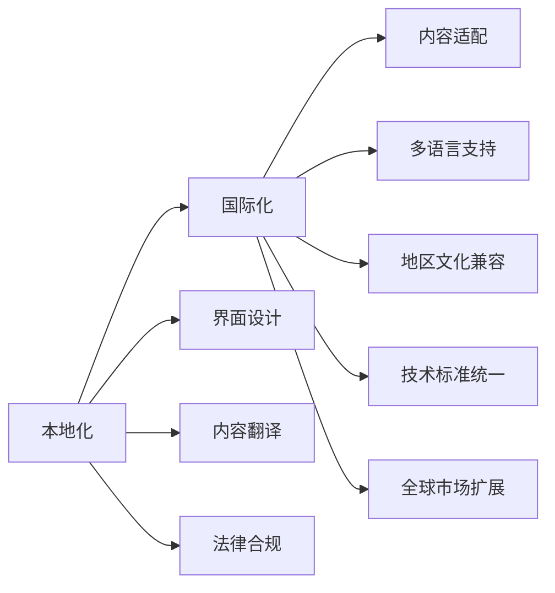

                 

## 1. 背景介绍

在全球化和技术快速发展的今天，知识付费市场呈现出爆炸式增长，尤其是技术领域，程序员成为知识付费的主要消费者。然而，如何高效地向全球不同地区和文化的用户传递知识，尤其是针对本地化需求的内容定制化，成为一个亟待解决的问题。本文将深入探讨程序员知识付费的内容本地化与国际化策略，为开发者、平台运营商和内容创作者提供实用的指导。

### 1.1 知识付费的兴起

随着互联网的普及和信息过载，越来越多的人开始寻求知识获取的便利性和效率。知识付费平台如得到、喜马拉雅、极客时间等应运而生，其模式主要是通过订阅或单次付费的方式，提供优质的在线课程、音频、电子书、视频教程等，满足用户在技术、文化、商业等领域的知识需求。

### 1.2 本地化的重要性

不同国家和地区的用户有各自独特的文化背景、语言习惯、技术偏好和需求，单纯通过全球通用的内容推广，难以实现最佳的用户体验和满意度。因此，内容本地化显得尤为重要，不仅能提升用户体验，还能提高转化率和粘性，进一步巩固平台的市场地位。

### 1.3 国际化的挑战

内容国际化涉及到语言翻译、文化差异、技术标准、法律法规等多方面的挑战。如何在保证内容质量的同时，实现高效、低成本的国际化，需要综合考虑技术、市场和运营等多方面的因素。

## 2. 核心概念与联系

### 2.1 核心概念概述

- **本地化（Localization）**：是指将产品、服务或内容适配到特定地区和语言的过程，包括界面设计、内容翻译、法律合规等，以适应目标用户的环境和文化。
- **国际化（Internationalization）**：是指产品或服务设计中考虑多语言、多地区支持，即在开发阶段就设计成可以适应不同语言和地区，后期通过本地化适配实现国际化。
- **知识付费平台**：通过提供付费的在线课程、资料和咨询服务，满足用户获取特定领域知识的需求。
- **内容创作者**：即知识付费平台的内容生产者，包括技术专家、行业从业者、教育机构等，为平台提供高质量、有价值的内容。
- **内容消费者**：即知识付费平台的订阅用户，主要是对某一领域知识有需求的人群，如程序员、创业者、学生等。

### 2.2 核心概念原理和架构的 Mermaid 流程图



此图展示了本地化和国际化之间的联系，以及各自涉及的关键环节。界面设计、内容翻译、法律合规属于本地化的具体操作，而内容适配、多语言支持、地区文化兼容、技术标准统一和全球市场扩展则属于国际化的实施步骤。两者共同构成了知识付费平台全球化策略的完整框架。

## 3. 核心算法原理 & 具体操作步骤

### 3.1 算法原理概述

本地化和国际化的算法原理主要基于自然语言处理（NLP）、机器翻译、数据分析等技术，通过自动化和人工辅助相结合的方式，实现内容的适配和优化。具体而言，主要包括：

- **自然语言处理（NLP）**：用于分析、理解和生成文本，实现内容翻译和适配。
- **机器翻译（MT）**：利用机器学习模型自动翻译文本，减少人工翻译成本和提升翻译效率。
- **数据分析（DA）**：通过分析用户行为、反馈和评价，调整内容策略，提升用户满意度和平台转化率。

### 3.2 算法步骤详解

#### 3.2.1 用户需求分析

- **数据收集**：通过问卷、访谈、数据分析等手段，收集用户需求和反馈，了解不同地区用户的偏好和技术水平。
- **数据处理**：对收集到的数据进行清洗、筛选和分析，识别关键需求和痛点。

#### 3.2.2 内容本地化策略

- **内容适配**：根据用户需求，调整内容结构和形式，如调整课程长度、格式、互动性等，以适配目标市场的接受度。
- **内容翻译**：利用机器翻译技术，自动翻译课程、文章、视频等内容的标题、简介和正文，确保翻译准确性和流畅性。
- **文化兼容**：结合目标地区文化特点，调整内容中的文化元素、案例和实例，使其更具吸引力和适用性。

#### 3.2.3 内容国际化实践

- **多语言支持**：在内容创建和发布阶段，设计多语言版本，提供不同语言选择，方便用户选择和切换。
- **地区文化兼容**：在内容创作和传播过程中，考虑不同地区的文化差异和习俗，避免文化冲突和误解。
- **技术标准统一**：采用国际通用的技术标准和协议，如ISO 26262、IEEE 7828等，确保内容的技术兼容性和可扩展性。
- **全球市场扩展**：利用数据分析和用户反馈，评估不同地区的内容效果和市场潜力，制定全球扩展策略。

### 3.3 算法优缺点

#### 3.3.1 优点

- **提高用户体验**：通过本地化和国际化策略，内容更加贴近用户需求和习惯，提高用户满意度和粘性。
- **降低成本**：自动化翻译和适配技术减少人工成本，提升效率。
- **提升市场竞争力**：通过个性化和地区适配的内容，增加市场份额和用户基数。

#### 3.3.2 缺点

- **翻译质量问题**：机器翻译技术尚未达到完全自动化的水平，有时会导致翻译不准确或不自然。
- **文化误解风险**：不同文化背景可能导致对内容的误解和误用。
- **技术标准差异**：不同地区的技术标准可能不同，需进行额外适配，增加复杂度。

### 3.4 算法应用领域

本地化和国际化策略广泛应用于以下领域：

- **教育培训**：针对不同地区学生的需求，提供本地化的课程内容和教学方法。
- **软件开发**：为全球开发者提供多语言支持的技术文档和教程。
- **商务咨询**：根据不同地区的市场环境和法规，调整商务咨询内容，提供地区化的解决方案。
- **文化交流**：通过本地化的内容，促进跨文化交流和理解，推动全球化发展。

## 4. 数学模型和公式 & 详细讲解 & 举例说明

### 4.1 数学模型构建

假设有一门在线编程课程，需要适配不同地区的用户需求。课程包含课程介绍、课程大纲、编程任务、课后练习等部分，每部分的内容需要根据本地化需求进行调整。

数学模型可以表示为：

$$
C_i = f(\text{local\_environment}_i, \text{global\_content}_i, \text{cultural\_compatibility}_i)
$$

其中，$C_i$表示第$i$部分的内容，$\text{local\_environment}_i$表示目标地区的环境和需求，$\text{global\_content}_i$表示课程的原始内容，$\text{cultural\_compatibility}_i$表示内容的文化适应性。

### 4.2 公式推导过程

#### 4.2.1 内容适配公式

内容适配公式可以表示为：

$$
C_i^* = C_i \cdot w_1 + C_i^t \cdot w_2
$$

其中，$C_i^*$表示适配后的内容，$C_i$表示原始内容，$C_i^t$表示自动翻译后的内容，$w_1$和$w_2$表示适配权重，控制原始内容和自动翻译内容的比例。

#### 4.2.2 内容翻译公式

内容翻译公式可以表示为：

$$
T_j = M(C_j)
$$

其中，$T_j$表示目标语言的内容，$C_j$表示原始内容，$M$表示机器翻译模型。

### 4.3 案例分析与讲解

#### 4.3.1 案例背景

某在线编程课程需要适配美国、中国和印度市场。课程原始内容为英文，分别需要翻译成中文和印地文，并根据不同地区的需求进行内容适配。

#### 4.3.2 适配步骤

1. **数据收集**：通过问卷和访谈收集美国、中国和印度用户对课程内容和形式的需求和反馈。
2. **数据处理**：对收集到的数据进行分析和筛选，识别关键需求和痛点。
3. **内容适配**：根据分析结果，调整课程内容和形式，如调整课程长度、格式、互动性等，以适配目标市场的接受度。
4. **内容翻译**：利用机器翻译技术，自动翻译课程、文章、视频等内容的标题、简介和正文，确保翻译准确性和流畅性。
5. **文化兼容**：结合目标地区文化特点，调整内容中的文化元素、案例和实例，使其更具吸引力和适用性。
6. **测试和优化**：通过用户测试和反馈，不断优化内容适配和翻译策略，提升用户满意度。

## 5. 项目实践：代码实例和详细解释说明

### 5.1 开发环境搭建

1. **编程语言和框架**：Python和Flask框架，用于搭建Web应用。
2. **数据库和存储**：使用MySQL数据库，存储用户数据和课程内容。
3. **云计算平台**：AWS或Google Cloud，提供计算资源和存储服务。
4. **自动化工具**：Jenkins，用于自动化测试和部署。

### 5.2 源代码详细实现

以下是一个基于Flask框架的示例代码，展示如何在Python中实现内容本地化和国际化：

```python
from flask import Flask, request, jsonify
import os
from googletrans import Translator

app = Flask(__name__)

# 设置翻译器
translator = Translator()

@app.route('/content', methods=['POST'])
def translate_content():
    data = request.get_json()
    content = data['content']
    language = data['language']
    
    # 自动翻译内容
    translated_content = translator.translate(content, dest=language).text
    
    return jsonify({'text': translated_content})

@app.route('/localize', methods=['POST'])
def localize_content():
    data = request.get_json()
    content = data['content']
    language = data['language']
    
    # 内容适配
    # 根据不同语言和文化，适配课程内容和形式
    
    return jsonify({'localized_content': localized_content})

if __name__ == '__main__':
    app.run(debug=True)
```

### 5.3 代码解读与分析

**代码说明**：
- `Flask`框架用于搭建Web应用，提供RESTful API接口。
- `googletrans`库用于机器翻译，支持多种语言翻译。
- 在`translate_content`函数中，接收前端传入的原始内容和目标语言，调用`googletrans`进行自动翻译，并返回翻译后的文本。
- 在`localize_content`函数中，接收前端传入的原始内容和目标语言，根据不同语言和文化，调整课程内容和形式，返回本地化后的内容。

**代码分析**：
- 代码简洁高效，利用了Flask和`googletrans`库的强大功能，实现内容翻译和适配。
- 通过RESTful API接口，方便与前端交互，实现动态内容翻译和适配。
- 可以根据实际需求，进一步优化和扩展API功能，如用户权限控制、内容审核等。

**运行结果展示**：
- 通过API接口调用`/translate_content`，可以自动翻译课程内容到指定语言。
- 通过API接口调用`/localize_content`，可以自动适配课程内容到指定语言和文化。

## 6. 实际应用场景

### 6.1 本地化应用

#### 6.1.1 教育培训

- **案例**：某在线编程课程平台，为全球不同地区的学生提供课程内容适配服务。
- **应用**：根据不同地区学生的需求，调整课程长度、格式、互动性等，以适配目标市场的接受度。

#### 6.1.2 软件开发

- **案例**：某开源软件项目，为全球开发者提供多语言支持的技术文档和教程。
- **应用**：自动翻译技术文档和教程，提供多语言版本，方便开发者阅读和使用。

#### 6.1.3 商务咨询

- **案例**：某咨询公司，根据不同地区的市场环境和法规，调整商务咨询内容。
- **应用**：结合目标地区文化特点，调整咨询内容中的文化元素、案例和实例，使其更具吸引力和适用性。

### 6.2 国际化应用

#### 6.2.1 教育培训

- **案例**：某在线教育平台，为全球学生提供多语言支持的在线课程。
- **应用**：在内容创建和发布阶段，设计多语言版本，提供不同语言选择，方便学生选择和切换。

#### 6.2.2 软件开发

- **案例**：某技术公司，为全球开发者提供多语言支持的技术文档和教程。
- **应用**：在内容创建和发布阶段，设计多语言版本，提供不同语言选择，方便开发者阅读和使用。

#### 6.2.3 商务咨询

- **案例**：某咨询公司，根据不同地区的市场环境和法规，调整商务咨询内容。
- **应用**：在内容创作和传播过程中，考虑不同地区的文化差异和习俗，避免文化冲突和误解。

## 7. 工具和资源推荐

### 7.1 学习资源推荐

- **自然语言处理（NLP）**：《自然语言处理综论》，详细讲解NLP的基础理论和应用。
- **机器翻译（MT）**：《机器翻译基础与实践》，介绍机器翻译的原理和实践方法。
- **数据分析（DA）**：《数据科学导论》，讲解数据分析的基本方法和工具。

### 7.2 开发工具推荐

- **编程语言和框架**：Python和Flask框架，用于搭建Web应用和API接口。
- **机器翻译**：`googletrans`库，支持多种语言翻译。
- **自动化测试**：Jenkins，用于自动化测试和部署。

### 7.3 相关论文推荐

- **本地化研究**：《The impact of localization on software quality and maintainability》，探讨本地化对软件质量和维护性的影响。
- **国际化研究**：《Internationalization and localization in web development》，介绍国际化在Web开发中的应用。
- **知识付费研究**：《Economic analysis of knowledge market in China》，分析中国知识付费市场的经济特征和发展趋势。

## 8. 总结：未来发展趋势与挑战

### 8.1 研究成果总结

本文系统介绍了程序员知识付费的内容本地化与国际化策略，探讨了本地化和国际化的核心概念、算法原理和操作步骤，通过案例分析和代码实践，展示了如何在实际应用中实现内容本地化和国际化。

### 8.2 未来发展趋势

未来，知识付费市场将进一步全球化和本地化，内容创作者和平台运营商需要更加注重用户体验和文化适应性，提升内容的全球影响力和市场竞争力。以下是一些未来趋势：

- **个性化推荐**：通过数据分析和机器学习，推荐最适合用户的内容，提升用户满意度和平台转化率。
- **多模态内容**：结合文本、视频、音频等多模态内容，提供更丰富、更具吸引力的学习体验。
- **自适应学习**：利用AI技术，根据用户的学习行为和反馈，自适应调整课程难度和内容，提升学习效果。

### 8.3 面临的挑战

尽管内容本地化和国际化策略带来了诸多机遇，但也面临着一些挑战：

- **内容质量**：如何保证自动翻译和本地化后的内容质量，避免误导用户。
- **文化差异**：不同文化背景可能导致对内容的误解和误用，如何妥善处理。
- **技术标准**：不同地区的技术标准可能不同，如何确保内容的兼容性和可扩展性。

### 8.4 研究展望

未来的研究将集中在以下几个方向：

- **自动化翻译**：进一步提升机器翻译的质量和效率，减少人工翻译成本。
- **文化适应性**：深入研究不同文化的适应性，避免文化冲突和误解。
- **跨文化交流**：促进跨文化交流和理解，推动全球化发展。

总之，程序员知识付费的内容本地化和国际化策略，将伴随技术进步和市场变化不断演进，为全球用户提供更加丰富、便捷、高质量的学习资源。

## 9. 附录：常见问题与解答

### 9.1 Q1：什么是本地化（Localization）和国际化（Internationalization）？

**A1**：本地化（Localization）是指将产品、服务或内容适配到特定地区和语言的过程，包括界面设计、内容翻译、法律合规等，以适应目标用户的环境和文化。国际化（Internationalization）是指产品或服务设计中考虑多语言、多地区支持，即在开发阶段就设计成可以适应不同语言和地区，后期通过本地化适配实现国际化。

### 9.2 Q2：本地化和国际化有哪些步骤？

**A2**：本地化和国际化的步骤主要包括以下几个方面：
- **需求分析**：收集用户需求和反馈，了解不同地区用户的偏好和技术水平。
- **内容适配**：根据用户需求，调整内容结构和形式，如调整课程长度、格式、互动性等，以适配目标市场的接受度。
- **内容翻译**：利用机器翻译技术，自动翻译课程、文章、视频等内容的标题、简介和正文，确保翻译准确性和流畅性。
- **文化兼容**：结合目标地区文化特点，调整内容中的文化元素、案例和实例，使其更具吸引力和适用性。

### 9.3 Q3：如何保证内容质量？

**A3**：保证内容质量需要综合考虑以下几个方面：
- **人工审核**：在自动翻译和本地化过程中，引入人工审核机制，确保翻译准确性和内容适宜性。
- **用户反馈**：通过用户反馈和评价，不断优化翻译和本地化策略，提升内容质量。
- **技术手段**：利用机器翻译和自动化工具，提高翻译效率和质量。

### 9.4 Q4：如何在全球市场扩展内容？

**A4**：在全球市场扩展内容需要考虑以下几个方面：
- **市场调研**：通过市场调研和用户需求分析，确定全球扩展目标和策略。
- **本地化适配**：根据不同地区的需求和文化特点，调整内容适配和翻译策略，确保内容质量和文化适宜性。
- **渠道拓展**：利用社交媒体、邮件营销等多种渠道，扩大内容的传播范围和用户基数。

通过本文的系统梳理，可以看到，程序员知识付费的内容本地化和国际化策略，不仅能提升用户体验和市场竞争力，还能促进全球技术交流和知识共享，为全球用户提供更加丰富、便捷、高质量的学习资源。

---

作者：禅与计算机程序设计艺术 / Zen and the Art of Computer Programming

