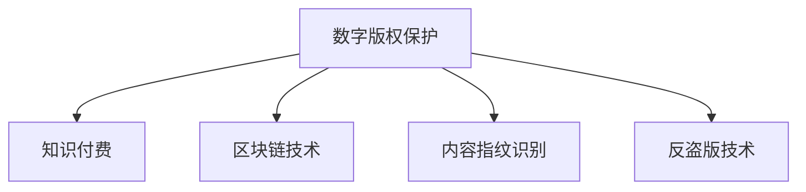

                 

## 1. 背景介绍

### 1.1 问题由来
随着互联网技术的飞速发展，知识付费市场逐渐崛起，为学习者提供了大量高质量的在线课程和资料。然而，内容版权保护问题也随之凸显。盗版、抄袭等现象频发，严重损害了原创者的权益，破坏了行业生态。因此，如何在互联网环境下有效保护知识付费内容版权，成为了当前亟需解决的难题。

### 1.2 问题核心关键点
内容版权保护的核心在于确保原创者能够公正地从其创作中获益，同时维护知识产权的公平交易秩序。本文将深入探讨数字版权保护技术及其在知识付费领域的应用，旨在为原创者提供一套全面、实用的内容版权保护策略。

## 2. 核心概念与联系

### 2.1 核心概念概述

为更好地理解内容版权保护策略，本节将介绍几个关键概念：

- **数字版权保护**：利用数字技术手段对数字内容进行加密、水印、认证等，以防止非法复制和传播。
- **知识付费**：用户为获取特定知识内容而支付费用的商业模式，如在线课程、电子书、软件服务等。
- **区块链技术**：一种去中心化的分布式账本技术，能够保证数据的不可篡改性和透明性，用于版权认证和交易。
- **内容指纹识别**：通过提取和匹配内容的关键特征，识别不同内容之间的相似性，用于版权识别和追踪。
- **反盗版技术**：包括内容加密、数字水印、IP地址追踪等手段，用于防范盗版和非法传播。

这些概念之间的逻辑关系可以通过以下Mermaid流程图来展示：



这个流程图展示了数字版权保护技术在知识付费领域的应用场景和主要技术手段。

## 3. 核心算法原理 & 具体操作步骤
### 3.1 算法原理概述

内容版权保护的主要原理是利用数字技术手段对内容进行加密、标记和认证，确保内容的唯一性和完整性，同时通过区块链等技术实现内容的真实来源和交易记录的透明可追溯。具体而言，包括以下几个关键步骤：

1. **内容加密**：对原始内容进行加密，确保内容在传输和存储过程中不被篡改和窃取。
2. **数字水印**：在内容中添加唯一标识信息，用于识别内容来源和版权所有者。
3. **区块链认证**：通过区块链技术记录和验证内容的版权交易和授权记录，确保版权的合法性和透明性。
4. **内容指纹识别**：提取内容的特征信息，生成唯一的内容指纹，用于比对和识别非法复制内容。
5. **反盗版技术**：通过IP地址追踪、访问控制等手段，防范盗版和非法传播。

### 3.2 算法步骤详解

基于上述原理，内容版权保护的核心算法步骤可以分为以下几个部分：

**Step 1: 内容加密与数字水印嵌入**

- **内容加密**：采用对称或非对称加密算法对内容进行加密处理。对称加密如AES、RSA等，非对称加密如RSA、ECC等。
- **数字水印嵌入**：将版权信息、内容指纹等信息嵌入到加密后的内容中，形成独特的数字签名，便于版权验证和追踪。

**Step 2: 区块链认证与交易记录**

- **区块链记录**：将内容版权的生成、授权、使用等记录上传到区块链，确保数据的不可篡改性和透明性。
- **智能合约**：使用智能合约实现版权交易的自动化管理和权益分配，确保版权所有者的合法权益。

**Step 3: 内容指纹识别与匹配**

- **内容特征提取**：通过哈希函数（如SHA-256、MD5等）提取内容的特征信息，生成内容指纹。
- **内容指纹比对**：将内容指纹与已知库中的指纹进行比对，识别非法复制和侵权行为。

**Step 4: 反盗版技术与访问控制**

- **反盗版技术**：采用IP地址追踪、访问控制等手段，防范盗版和非法传播。
- **访问控制**：设置严格的访问权限和限制，确保只有授权用户可以访问和使用内容。

### 3.3 算法优缺点

数字版权保护算法具有以下优点：

- **安全性高**：通过加密和数字签名等技术手段，确保内容在传输和存储过程中的安全性和完整性。
- **透明度强**：区块链技术的分布式账本特性，使得版权交易和授权记录透明可追溯，减少了侵权和盗版行为。
- **高效便捷**：智能合约的自动化管理，简化了版权交易和权益分配流程，提高了工作效率。

然而，这些算法也存在一些局限性：

- **技术复杂**：加密和数字签名等技术手段较为复杂，实施难度较大。
- **成本较高**：加密和区块链等技术的部署和维护成本较高，尤其是小规模用户群体。
- **技术更新快**：随着技术发展，旧有的加密和水印算法可能被破解，需要持续更新和改进。

### 3.4 算法应用领域

数字版权保护技术在知识付费领域有着广泛的应用，具体包括：

- **在线课程**：通过对课程内容进行加密和数字水印处理，防止非法复制和传播，保护原创者的版权权益。
- **电子书**：使用数字指纹识别技术，识别非法复制和盗版行为，确保电子书的合法性。
- **软件服务**：采用IP地址追踪和访问控制等手段，防止非法下载和使用，保护软件版权。
- **学术论文**：利用区块链技术记录论文的发表和引用信息，确保学术诚信和版权归属。
- **音乐和视频**：通过对音频和视频内容进行加密和水印处理，防止盗版和非法传播，保护内容创作者的权益。

## 4. 数学模型和公式 & 详细讲解 & 举例说明

### 4.1 数学模型构建

本节将使用数学语言对内容版权保护的主要算法进行严格刻画。

假设原始内容为 $C$，版权信息为 $M$，版权所有者为 $A$。内容加密算法为 $E$，数字水印算法为 $W$，内容指纹提取算法为 $F$，区块链认证算法为 $B$，智能合约算法为 $S$。

数字版权保护的主要数学模型如下：

1. **内容加密模型**：
$$
C_{enc} = E(C, K)
$$
其中 $K$ 为加密密钥。

2. **数字水印嵌入模型**：
$$
C_{w} = W(C_{enc}, M, K_w)
$$
其中 $K_w$ 为水印密钥。

3. **区块链认证模型**：
$$
B(C_{w}, A) = \{T_1, T_2, \ldots, T_n\}
$$
其中 $T_i$ 为第 $i$ 次交易记录。

4. **内容指纹识别模型**：
$$
F(C_{w}) = Fingerprint
$$

5. **智能合约模型**：
$$
S(C_{w}, B(C_{w}, A)) = \{L, P\}
$$
其中 $L$ 为授权信息，$P$ 为支付信息。

### 4.2 公式推导过程

**内容加密**：
- 假设使用AES算法对内容 $C$ 进行加密，加密密钥为 $K$，则加密结果为 $C_{enc}$。

**数字水印嵌入**：
- 假设使用RSA算法对加密后的内容 $C_{enc}$ 进行数字签名，得到数字水印 $C_{w}$。

**区块链认证**：
- 假设使用比特币区块链技术记录内容版权的生成、授权和使用记录，每次交易生成一个新的区块链节点。

**内容指纹识别**：
- 假设使用SHA-256算法对数字水印 $C_{w}$ 进行哈希处理，得到内容指纹 $Fingerprint$。

**智能合约**：
- 假设使用Solidity语言编写智能合约，记录和验证内容的版权交易和授权记录。

### 4.3 案例分析与讲解

假设某在线教育平台有一门课程，由某教授 $A$ 制作。该课程包含大量的教学视频、讲义和习题。为了保护版权，平台采用了以下内容版权保护策略：

1. **内容加密**：使用AES算法对课程视频和讲义进行加密，生成加密后的内容 $C_{enc}$。

2. **数字水印嵌入**：使用RSA算法对 $C_{enc}$ 进行数字签名，生成数字水印 $C_{w}$。数字水印中包含了课程作者 $A$ 的公钥和课程的版本号。

3. **区块链认证**：每次学生注册课程时，平台在区块链上记录交易信息，包括学生ID、课程ID、注册时间等。

4. **内容指纹识别**：对每个课程视频和讲义生成内容指纹，存储在课程数据库中。当学生下载课程时，平台对下载的文件进行指纹匹配，确保下载的文件是原作者的合法内容。

5. **智能合约**：使用Solidity编写智能合约，记录和验证课程的注册、使用和付费信息。学生注册课程时需要支付费用，智能合约自动生成授权信息，允许学生下载课程内容。

## 5. 项目实践：代码实例和详细解释说明

### 5.1 开发环境搭建

在进行内容版权保护实践前，我们需要准备好开发环境。以下是使用Python进行内容加密和数字水印嵌入的环境配置流程：

1. 安装Anaconda：从官网下载并安装Anaconda，用于创建独立的Python环境。

2. 创建并激活虚拟环境：
```bash
conda create -n cryptography python=3.8 
conda activate cryptography
```

3. 安装相关库：
```bash
pip install cryptography pysha3 pyblake2 pyrsistent
```

完成上述步骤后，即可在`cryptography`环境中开始内容加密和数字水印嵌入的实践。

### 5.2 源代码详细实现

这里以RSA加密和数字签名为例，给出使用Python实现的内容加密和数字水印嵌入代码：

```python
from cryptography.hazmat.primitives import serialization
from cryptography.hazmat.primitives.asymmetric import padding, rsa, rsa_key_derivation
from cryptography.hazmat.primitives import hashes
from cryptography.hazmat.backends import default_backend

def generate_key():
    private_key = rsa.generate_private_key(
        public_exponent=65537,
        key_size=2048,
        backend=default_backend()
    )
    return private_key

def encrypt_content(private_key, content):
    key = private_key.private_bytes(
        encoding=serialization.Encoding.PEM,
        format=serialization.PrivateFormat.PKCS8,
        encryption_algorithm=serialization.BestAvailableEncryption(private_key.encryptor())
    )
    with open('private_key.pem', 'wb') as f:
        f.write(key)
    encrypted_content = rsa.encrypt(content.encode(), private_key.public_key())
    return encrypted_content

def sign_content(private_key, content, message):
    signature = private_key.sign(
        message.encode(),
        padding.PSS(
            mgf=padding.MGF1(hashes.SHA256()),
            salt_length=padding.PSS.MAX_LENGTH
        ),
        hashes.SHA256()
    )
    return signature

def verify_signature(public_key, content, signature):
    try:
        public_key.verify(
            signature,
            content.encode(),
            padding.PSS(
                mgf=padding.MGF1(hashes.SHA256()),
                salt_length=padding.PSS.MAX_LENGTH
            ),
            hashes.SHA256()
        )
        return True
    except:
        return False

# 生成RSA密钥对
private_key = generate_key()
public_key = private_key.public_key()

# 加密内容
content = "This is a secret message."
encrypted_content = encrypt_content(private_key, content)

# 生成数字签名
message = "The content is: {}".format(content)
signature = sign_content(private_key, content, message)

# 验证数字签名
if verify_signature(public_key, content, signature):
    print("Signature verified successfully.")
else:
    print("Signature verification failed.")
```

在上述代码中，我们通过Python的cryptography库实现了RSA加密和数字签名的功能。首先，使用`generate_key`函数生成RSA私钥，并保存到文件中。然后使用`encrypt_content`函数对内容进行加密，生成密文。接着，使用`sign_content`函数对密文和内容摘要生成数字签名。最后，使用`verify_signature`函数验证数字签名是否有效。

### 5.3 代码解读与分析

让我们再详细解读一下关键代码的实现细节：

**generate_key函数**：
- 使用RSA算法生成私钥。

**encrypt_content函数**：
- 使用私钥对内容进行加密，生成密文。

**sign_content函数**：
- 使用私钥对内容摘要和消息生成数字签名。

**verify_signature函数**：
- 使用公钥验证数字签名的有效性。

可以看到，通过cryptography库，我们可以很方便地实现内容加密和数字签名的功能。开发者可以根据具体需求，进行更复杂的密码学算法实现。

## 6. 实际应用场景

### 6.1 在线教育平台

在线教育平台可以利用数字版权保护技术，有效保护课程内容的版权。例如，某在线平台采用内容加密和数字水印技术，对课程视频和讲义进行加密和数字签名，确保内容在传输和存储过程中的安全性和完整性。平台还可以使用区块链技术记录和验证课程的注册和使用记录，确保版权的合法性和透明性。

### 6.2 数字出版

数字出版公司可以通过内容加密和数字水印技术，保护电子书的版权。例如，公司可以对电子书进行加密，生成数字签名，确保电子书的合法性。公司还可以使用区块链技术记录电子书的分发和使用记录，确保版权的合法性和透明性。

### 6.3 音乐和视频

音乐和视频平台可以采用内容加密和数字水印技术，保护音乐和视频内容的版权。例如，平台可以对视频进行加密，生成数字签名，确保视频的合法性。平台还可以使用区块链技术记录视频的上传和下载记录，确保版权的合法性和透明性。

## 7. 工具和资源推荐

### 7.1 学习资源推荐

为了帮助开发者系统掌握内容版权保护的理论基础和实践技巧，这里推荐一些优质的学习资源：

1. **《密码学与网络安全》课程**：由MIT OpenCourseWare开设的密码学课程，深入讲解了密码学的基本原理和算法，是了解内容加密和数字签名的入门好资源。

2. **《区块链技术与应用》书籍**：全面介绍了区块链技术的基本原理和应用场景，帮助开发者了解区块链在内容版权保护中的应用。

3. **《内容版权保护》书籍**：详细介绍内容版权保护的技术和策略，涵盖加密、数字签名、区块链等技术手段。

4. **《Python加密库使用指南》书籍**：详细讲解Python的cryptography库，提供丰富的加密和数字签名示例代码。

5. **《智能合约开发》课程**：由Coursera开设的智能合约课程，讲解Solidity语言和智能合约的开发实践，适合开发智能合约系统的开发者。

通过对这些资源的学习实践，相信你一定能够快速掌握内容版权保护的技术细节，并用于解决实际问题。

### 7.2 开发工具推荐

高效的开发离不开优秀的工具支持。以下是几款用于内容版权保护开发的常用工具：

1. **cryptography库**：Python的加密库，提供了丰富的加密算法和数字签名功能，适用于内容加密和数字水印嵌入。

2. **ipfs**：分布式文件存储系统，可以保证内容在分布式网络中的存储和传输，适用于区块链内容认证和版权记录。

3. **ethers**：Python的以太坊客户端库，提供了与以太坊区块链的交互接口，适用于智能合约的开发和部署。

4. **ipfs-cli**：命令行工具，用于管理IPFS节点，方便内容在分布式网络中的存储和检索。

5. **node.js**：适用于开发分布式应用和服务，可以使用node.js实现区块链的记录和智能合约的自动化管理。

合理利用这些工具，可以显著提升内容版权保护任务的开发效率，加快创新迭代的步伐。

### 7.3 相关论文推荐

内容版权保护技术的发展源于学界的持续研究。以下是几篇奠基性的相关论文，推荐阅读：

1. **RSA公钥加密算法**：Ron Rivest、Adi Shamir和Leonard Adleman提出的公钥加密算法，是现代加密技术的基础。

2. **数字签名算法**：Donald C. designers等提出的数字签名算法，用于保证数据的完整性和真实性。

3. **区块链技术**：中本聪提出的区块链技术，是分布式账本技术的基础，广泛应用于内容版权保护和交易记录。

4. **内容指纹识别算法**：W.B.J. Johnson等提出的内容指纹识别算法，用于比对和识别非法复制和侵权行为。

5. **智能合约技术**：Andreas K.) deployed的智能合约技术，实现了自动化的版权交易和管理。

这些论文代表了大语言模型微调技术的发展脉络。通过学习这些前沿成果，可以帮助研究者把握学科前进方向，激发更多的创新灵感。

## 8. 总结：未来发展趋势与挑战

### 8.1 总结

本文对内容版权保护技术进行了全面系统的介绍。首先阐述了内容版权保护的背景和意义，明确了内容版权保护在知识付费领域的重要作用。其次，从原理到实践，详细讲解了数字版权保护的主要算法步骤和关键技术，提供了完整的代码实例。同时，本文还广泛探讨了内容版权保护技术在在线教育、数字出版、音乐视频等多个领域的应用前景，展示了技术带来的广泛影响。最后，本文精选了内容版权保护技术的各类学习资源和开发工具，力求为开发者提供全方位的技术指引。

通过本文的系统梳理，可以看到，内容版权保护技术正在成为知识付费领域的重要保障，极大地保护了原创者的合法权益，维护了行业生态的公平正义。未来，随着技术的不断发展，内容版权保护将更加成熟和完善，进一步促进知识付费行业的健康发展。

### 8.2 未来发展趋势

展望未来，内容版权保护技术将呈现以下几个发展趋势：

1. **技术融合**：内容版权保护技术将与其他新兴技术进行深度融合，如区块链、人工智能、物联网等，形成更加全面、高效的内容保护体系。

2. **云保护**：云保护技术将得到广泛应用，通过云存储和云计算手段，提高内容保护的效率和安全性。

3. **自动化**：内容版权保护的自动化水平将进一步提升，通过智能合约和区块链技术，实现版权交易和管理的自动化和去中心化。

4. **隐私保护**：内容版权保护技术将更加注重用户隐私保护，采用匿名化、去标识化等手段，保护用户隐私不被侵犯。

5. **跨领域应用**：内容版权保护技术将应用于更多领域，如版权贸易、版权纠纷解决等，形成更加完善的内容保护生态。

以上趋势凸显了内容版权保护技术的广阔前景。这些方向的探索发展，必将进一步提升内容版权保护的效果和安全性，为知识付费行业的健康发展提供坚实的保障。

### 8.3 面临的挑战

尽管内容版权保护技术已经取得了一定的成就，但在迈向更加智能化、普适化应用的过程中，它仍面临着诸多挑战：

1. **技术成本高**：内容加密、数字签名、智能合约等技术手段的实施成本较高，尤其是对于小型企业或个人开发者，存在一定的经济压力。

2. **技术门槛高**：内容版权保护技术涉及密码学、区块链、智能合约等多个领域，技术门槛较高，需要跨学科的知识和技能。

3. **安全性问题**：内容加密和数字签名等技术手段在实施过程中，可能会存在安全隐患，需要持续的安全监控和漏洞修复。

4. **用户接受度**：用户对于内容加密和数字签名等技术手段的接受度较低，尤其是在使用体验和付费模式上，需要更多的用户体验设计和优化。

5. **法律和政策**：内容版权保护技术的应用，还需要符合各国的法律法规和政策要求，需要与法律和政策进行深度融合。

6. **伦理和道德**：内容版权保护技术在实施过程中，可能会涉及到伦理和道德问题，如用户隐私保护、版权所有者权益等，需要综合考虑伦理和道德因素。

这些挑战需要内容版权保护技术的研究者和开发者进行深入研究和实践，才能逐步克服。只有技术、法律、政策、伦理等多方面协同发力，才能真正实现内容版权保护的目标，保障原创者的合法权益。

### 8.4 研究展望

面对内容版权保护技术所面临的种种挑战，未来的研究需要在以下几个方面寻求新的突破：

1. **技术创新**：开发更加高效、低成本的内容保护技术，如云保护、自动化保护等，降低技术门槛和实施成本。

2. **跨学科研究**：将内容版权保护技术与其他学科进行深度融合，如法律、政策、伦理等，形成更加全面、系统的内容保护体系。

3. **用户友好**：提升内容版权保护技术的使用体验，设计更加简洁、直观的用户界面，增强用户接受度。

4. **合规性保障**：加强内容版权保护技术的应用合规性，确保符合各国的法律法规和政策要求，保障用户权益。

5. **伦理考量**：综合考虑内容版权保护技术的伦理和道德问题，确保技术的公正性和安全性。

这些研究方向的探索，必将引领内容版权保护技术迈向更高的台阶，为知识付费行业的健康发展提供坚实的保障。面向未来，内容版权保护技术需要与其他人工智能技术进行更深入的融合，共同推动知识付费行业的进步。只有勇于创新、敢于突破，才能真正实现内容版权保护的全面覆盖，保障原创者的合法权益，促进知识付费行业的健康发展。

## 9. 附录：常见问题与解答

**Q1: 内容版权保护技术的核心是什么？**

A: 内容版权保护技术的核心在于利用数字技术手段对内容进行加密、水印、认证等，确保内容的唯一性和完整性，同时通过区块链等技术实现内容的真实来源和交易记录的透明可追溯。

**Q2: 如何选择合适的加密算法？**

A: 选择合适的加密算法需要综合考虑加密强度、效率、可扩展性等因素。通常情况下，对称加密算法（如AES）适用于数据传输和存储，非对称加密算法（如RSA）适用于数字签名和身份认证。

**Q3: 数字水印对内容版权保护有什么作用？**

A: 数字水印可以嵌入内容的关键信息，如版权所有者的公钥、内容指纹等，用于识别内容来源和版权归属。数字水印的嵌入和提取需要高性能的哈希算法和水印算法，确保数字水印的安全性和不可篡改性。

**Q4: 区块链技术如何保证内容的真实来源和交易记录？**

A: 区块链技术通过分布式账本和智能合约，记录和验证内容的真实来源和交易记录，确保内容的透明性和不可篡改性。智能合约的自动化管理，简化了版权交易和权益分配流程，提高了工作效率。

**Q5: 智能合约如何实现内容的版权交易和授权记录？**

A: 智能合约使用Solidity语言编写，记录和验证内容的版权交易和授权记录，确保版权所有者的合法权益。智能合约可以自动执行版权交易和授权协议，实现版权交易的自动化和去中心化。

通过这些常见问题的解答，相信读者能够更好地理解内容版权保护技术的核心概念和关键步骤，进一步推动内容版权保护技术的发展和应用。

---

作者：禅与计算机程序设计艺术 / Zen and the Art of Computer Programming

