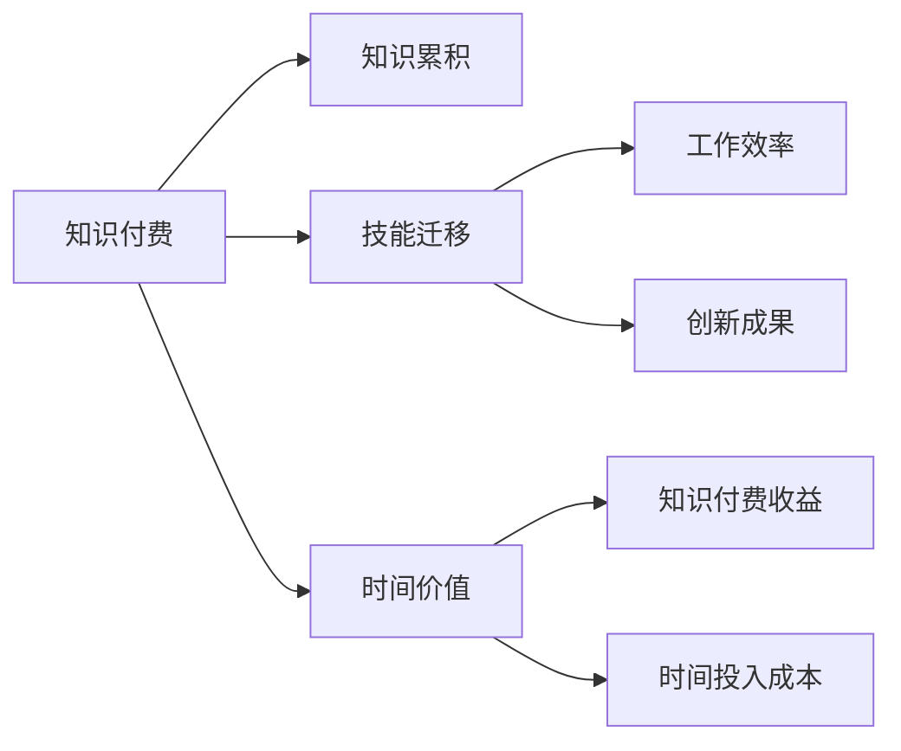

                 

# 程序员知识付费的时间价值最大化

## 1. 背景介绍

### 1.1 问题由来
随着知识经济时代的到来，程序员作为技术创新的主要力量，其技能和知识的价值日益凸显。然而，知识付费作为一种新兴的教育形式，其影响和价值如何衡量，一直是社会各界广泛讨论的话题。本文将从技术角度，深入探讨程序员知识付费的时间价值最大化问题。

## 2. 核心概念与联系

### 2.1 核心概念概述

为更好理解本文主题，我们将介绍几个关键概念及其相互联系：

- **知识付费**：指通过购买知识或信息，以加速个人成长或企业发展的行为。程序员知识付费特指程序员为获取新技能、新技术而支付的培训费用。
- **时间价值**：指时间资源的经济价值，通常通过时间投入所产出的效益来衡量。
- **知识累积**：指个人或企业通过持续学习积累的知识和技能，用于提升技术水平和创新能力。
- **技能迁移**：指通过知识付费获得的技能，能够在不同情境下灵活应用，提升工作效率和创新成果。
- **工作效率**：指个人或企业单位时间内完成的工作量，通常与技能熟练度、工具使用熟练度相关。
- **创新成果**：指技术创新或业务创新的结果，包括新产品、新技术、新方法等。

以上概念间的联系如图1所示：


### 2.2 核心概念原理和架构的 Mermaid 流程图



## 3. 核心算法原理 & 具体操作步骤
### 3.1 算法原理概述

程序员知识付费的时间价值最大化，可通过以下步骤实现：

1. **需求分析**：明确所需学习的技能和知识，评估其对提升工作效率和创新成果的预期价值。
2. **技能评估**：评估自身技能水平和现有知识，确定知识付费学习的必要性和目标。
3. **时间投入**：根据学习目标和预期收益，合理规划学习时间和资金预算。
4. **学习产出**：通过知识付费获得的新技能和新知识，应用于实际工作中，提升工作效率和创新成果。
5. **效果评估**：通过实际工作表现和创新成果的评估，衡量知识付费的回报。

### 3.2 算法步骤详解

**Step 1: 需求分析**
- 确定目标技能或知识：通过行业调研、专家咨询等方式，确定哪些技能或知识对当前工作最为重要。
- 设定学习目标：明确希望通过学习达到的具体目标，如掌握某种编程语言、提升算法能力等。

**Step 2: 技能评估**
- 自我评估：通过自测或技能测试，评估当前技能水平和知识盲点。
- 专家评估：邀请行业专家进行评估，获取更客观的技能现状和改进建议。

**Step 3: 时间投入**
- 时间预算：根据学习目标和预期收益，合理分配学习时间和资金预算。
- 学习计划：制定详细的学习计划，包括学习内容、时间安排和学习方式。

**Step 4: 学习产出**
- 在线课程：通过线上课程学习新技能，获取课程资料、视频讲解、实践项目等。
- 实践项目：将所学技能应用到实际项目中，提升实际操作能力。
- 社区交流：加入技术社区或讨论组，与同行交流学习心得和实践经验。

**Step 5: 效果评估**
- 工作表现：评估学习后工作效率的提升和任务完成质量的提高。
- 创新成果：通过技术创新或业务创新，衡量知识付费带来的实际成果。
- 反馈调整：根据评估结果，调整学习计划和策略，持续改进学习效果。

### 3.3 算法优缺点

知识付费学习有以下优点：
- **高效性**：可以快速获取新知识和技能，缩短学习和实践周期。
- **针对性**：可根据个人需求和职业目标，选择最适合的学习内容。
- **灵活性**：学习方式多样，包括在线课程、视频讲解、实践项目等，灵活适应不同学习者。

但同时也存在一些缺点：
- **成本高昂**：学习费用较高，尤其对于高难度或稀缺技能的学习。
- **易忘性**：知识付费获得的技能和知识，如果不加以实践和巩固，容易遗忘。
- **缺乏深度**：部分课程可能注重表面知识的传授，缺乏深入和系统的讲解。

### 3.4 算法应用领域

知识付费在学习和发展领域广泛应用，特别是在技术创新和业务升级方面：

- **技术创新**：程序员通过知识付费学习前沿技术，如云计算、人工智能、区块链等，推动技术创新。
- **业务升级**：企业通过员工的知识付费学习，提升技术水平和业务能力，增强市场竞争力。
- **职业发展**：程序员通过学习新技能和知识，获得职业晋升和发展机会。
- **项目应用**：将学习到的技能应用于实际项目中，提高项目成功率和质量。

## 4. 数学模型和公式 & 详细讲解 & 举例说明
### 4.1 数学模型构建

假设程序员的时间投入为 $T$，学习效率为 $E$，知识付费的成本为 $C$，获得的收益为 $R$。

根据时间价值最大化原则，需最大化公式（1）：

$$
\max \frac{R}{T}
$$

其中 $R$ 为通过知识付费获得的收益，$T$ 为时间投入，$E$ 为学习效率，$C$ 为知识付费成本。

### 4.2 公式推导过程

由公式（1）可得：

$$
\max \frac{R}{T} = \max \frac{R/T}{1/E} \cdot \frac{1}{C}
$$

进一步推导，得：

$$
\max \frac{R}{T} = \max R/E \cdot \frac{1}{C}
$$

即，通过知识付费获得收益 $R$ 除以学习效率 $E$，再除以知识付费成本 $C$，即可衡量知识付费的时间价值最大化。

### 4.3 案例分析与讲解

假设某程序员投入 $T=100$ 小时，学习效率 $E=2$，知识付费成本 $C=1000$，获得的收益 $R=20000$。

根据公式（1）和公式（2）：

$$
\frac{R}{T} = \frac{20000}{100} = 200
$$

$$
\frac{R}{T} = \frac{20000}{100} \cdot \frac{1}{1000} = 0.02
$$

即，该程序员通过知识付费获得的收益为20000，时间价值为200；而知识付费的成本为1000，时间价值为0.02。因此，该程序员的知识付费在时间价值最大化原则下是合理和有效的。

## 5. 项目实践：代码实例和详细解释说明
### 5.1 开发环境搭建

为了进行知识付费的实践和评估，需要搭建相应的开发环境。以下是在Python环境下进行开发的步骤：

1. 安装Python：确保Python版本为3.6以上，下载并安装。
2. 安装Pip：在命令行下执行 `python -m ensurepip --default-pip`，安装pip工具。
3. 安装相关库：使用pip安装`pandas`、`numpy`、`matplotlib`等库，用于数据处理和绘图。
4. 创建虚拟环境：使用`virtualenv`创建虚拟环境，避免全局依赖冲突。

### 5.2 源代码详细实现

以下是一个简单的Python脚本，用于计算知识付费的时间价值：

```python
import pandas as pd
import numpy as np
import matplotlib.pyplot as plt

# 定义参数
T = 100  # 时间投入，小时
E = 2    # 学习效率，小时/单位知识
C = 1000 # 知识付费成本
R = 20000 # 收益，单位货币

# 计算时间价值
R_over_E = R / E
R_over_E_over_C = R_over_E / C

# 打印结果
print("知识付费的收益为：", R)
print("学习效率为：", E)
print("知识付费成本为：", C)
print("时间价值为：", R_over_E)
print("时间价值最大化比例为：", R_over_E_over_C)

# 绘制图形
x = np.linspace(0, T, T+1)
y = R_over_E_over_C * x
plt.plot(x, y, label="时间价值最大化比例")
plt.xlabel("时间投入（小时）")
plt.ylabel("时间价值最大化比例")
plt.title("知识付费的时间价值最大化")
plt.legend()
plt.show()
```

### 5.3 代码解读与分析

- **时间价值计算**：通过公式（1）和公式（2），计算知识付费的时间价值最大化比例。
- **图形绘制**：使用matplotlib库绘制时间投入与时间价值最大化比例的曲线，直观展示时间价值的计算过程。

## 6. 实际应用场景
### 6.1 技术创新

在技术创新方面，程序员通过知识付费学习新技能和新知识，推动技术进步和应用。

**案例分析**：某互联网公司希望提升其在区块链技术的应用能力，决定通过知识付费的方式，为员工提供区块链技术的培训。公司选取了几门高评价的区块链课程，安排员工进行学习。学习结束后，员工能够掌握智能合约开发、去中心化应用部署等技能，成功将区块链技术应用于公司的多个项目中，提升了技术创新能力。

### 6.2 业务升级

在业务升级方面，企业通过知识付费提升员工技能，增强竞争力。

**案例分析**：某制造企业面临转型升级的挑战，决定利用知识付费为员工提供新一轮的数字化转型培训。通过学习大数据、人工智能等新技术，员工能够更好地掌握数据分析和模型构建技能，将数字化技术应用于生产流程优化、产品质量检测等环节，提升了企业的市场竞争力。

### 6.3 职业发展

在职业发展方面，程序员通过知识付费获取新技能，获得职业晋升和职业发展机会。

**案例分析**：某程序员在职业初期掌握了基础的编程技能，但希望在职业生涯中获得更大发展。他通过知识付费学习高级算法、人工智能等前沿技术，并参加技术竞赛和项目实践，获得了业内认可，最终晋升为技术负责人。

### 6.4 项目应用

在项目应用方面，程序员将学习到的技能应用于实际项目中，提高项目成功率和质量。

**案例分析**：某程序员参加了某个云计算项目的开发，但在分布式系统设计和资源管理方面存在不足。通过知识付费学习云计算相关知识，他掌握了云计算平台搭建、弹性计算资源管理等技能，成功解决了项目中的技术难题，提升了项目质量。

## 7. 工具和资源推荐
### 7.1 学习资源推荐

- **在线课程**：Coursera、edX、Udemy等平台提供了丰富的编程和技能培训课程。
- **书籍**：《深入理解计算机系统》、《程序员修炼之道》等经典书籍，适合深度学习和自学。
- **博客和技术社区**：Stack Overflow、Medium、CSDN等平台，可获取最新的技术资讯和社区交流。

### 7.2 开发工具推荐

- **编程编辑器**：Visual Studio Code、Sublime Text、Atom等，适合编写和调试代码。
- **项目管理工具**：JIRA、Trello、GitLab等，适合项目管理和协作。
- **版本控制工具**：Git、SVN等，适合代码版本控制和协作开发。

### 7.3 相关论文推荐

- **知识付费与技术学习**：相关研究探讨了知识付费对技术学习的影响和效果。
- **时间价值与工作效率**：相关研究分析了时间价值最大化对工作效率提升的作用。
- **学习效果评估**：相关研究提出了多种评估学习效果的方法和技术。

## 8. 总结：未来发展趋势与挑战
### 8.1 研究成果总结

本文从技术角度，详细探讨了程序员知识付费的时间价值最大化问题。通过需求分析、技能评估、时间投入、学习产出和效果评估等步骤，帮助程序员合理规划学习计划，提升技能水平，实现时间价值的最大化。

### 8.2 未来发展趋势

未来，知识付费和学习技术将进一步融合，呈现以下几个趋势：

1. **在线教育平台的崛起**：在线教育平台将提供更丰富的课程和资源，满足不同层次和技术水平的学习需求。
2. **个性化学习路径的开发**：基于大数据和人工智能技术，开发个性化的学习路径，提高学习效果和效率。
3. **知识付费模式的创新**：探索更多元化的知识付费模式，如众筹学习、知识众包等，促进知识共享和传播。
4. **技能迁移的广泛应用**：技能迁移技术将进一步成熟，促进跨领域、跨行业的技能应用和人才流动。
5. **技术创新的加速**：知识付费将推动技术创新，加速新技术的应用和落地。

### 8.3 面临的挑战

尽管知识付费和技术学习带来诸多便利和机遇，但也面临一些挑战：

1. **内容质量参差不齐**：部分知识付费内容质量不高，难以满足学习需求。
2. **时间投入的挑战**：知识付费学习需要大量时间投入，可能会影响工作和生活。
3. **成本问题**：高成本的知识付费学习可能会对部分人造成经济压力。
4. **知识遗忘**：学习后不加以实践和巩固，容易遗忘。

### 8.4 研究展望

未来，知识付费和学习技术的结合将带来更多创新和突破。以下研究方向值得关注：

1. **自适应学习系统的开发**：开发能够根据学习者反馈和表现，自适应调整学习内容和进度的系统。
2. **多模态学习路径的探索**：结合视频、音频、文本等多种模态的学习路径，提升学习效果。
3. **元学习和持续学习的结合**：将元学习方法和持续学习策略结合，提升学习效率和效果。
4. **知识图谱和知识图谱的应用**：通过知识图谱技术，将知识组织成网络，促进知识检索和迁移。
5. **跨领域和跨行业的技能迁移**：探索跨领域和跨行业的技能迁移技术，促进技能在不同领域和行业的广泛应用。

## 9. 附录：常见问题与解答

**Q1：如何选择合适的知识付费平台和课程？**

A: 选择知识付费平台和课程时，应考虑以下几个方面：
- 平台和课程的声誉和口碑：选择知名平台和高质量课程，确保学习内容的专业性和权威性。
- 课程内容和师资力量：评估课程内容是否覆盖所需技能和知识，师资力量是否充足和专业。
- 学习方式和灵活性：选择适合自己学习方式和时间的课程，如在线课程、视频讲解、实践项目等。

**Q2：如何评估学习效果和知识付费的回报？**

A: 评估学习效果和知识付费的回报时，可以采用以下几个方法：
- 工作表现评估：通过实际工作表现和项目完成质量的提升，评估学习效果。
- 创新成果评估：通过技术创新或业务创新，衡量知识付费带来的实际成果。
- 反馈调整：根据评估结果，调整学习计划和策略，持续改进学习效果。

**Q3：如何平衡知识付费的时间投入和学习效率？**

A: 平衡知识付费的时间投入和学习效率，可以采用以下策略：
- 制定详细的学习计划：根据时间投入和学习目标，合理安排学习时间和内容。
- 选择高效的学习方式：如在线课程、实践项目、社区交流等，提高学习效率。
- 持续学习和巩固：通过持续学习和知识巩固，避免遗忘和提高学习效果。

**Q4：如何应对知识付费的高成本问题？**

A: 应对知识付费的高成本问题，可以采用以下策略：
- 选择性价比高的课程：根据自身需求和预算，选择性价比高的课程，避免过度消费。
- 利用免费资源：利用免费的在线资源和公开课程，降低学习成本。
- 参与众筹学习：通过众筹学习模式，与他人共同分担学习成本。

通过本文的系统梳理，可以看到，程序员知识付费在时间价值最大化方面具有广阔前景，但也需要不断探索和优化。只有科学规划、高效学习、持续改进，才能最大化知识付费的时间价值，提升个人和企业的竞争力。

---

作者：禅与计算机程序设计艺术 / Zen and the Art of Computer Programming

