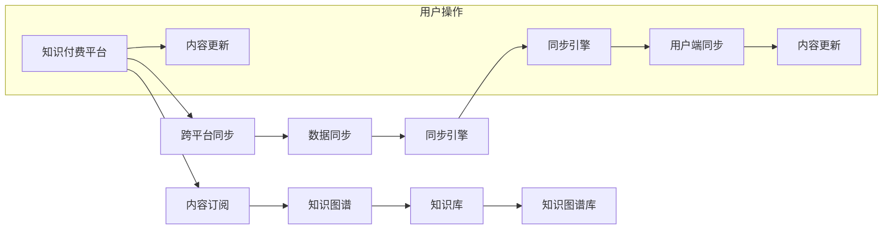

                 

# 程序员知识付费的跨平台内容同步策略

## 1. 背景介绍

在数字化时代，知识付费成为程序员获取新知的重要方式之一。通过订阅平台、在线课程、直播讲座等多种形式，程序员可以高效地获取高质量的编程知识和技能。然而，随着知识的碎片化和技术迭代的加速，程序员面临的挑战也在不断增加。如何在繁杂的知识海洋中筛选出最有价值的内容，如何更好地管理和同步自己的知识体系，成为每位程序员都必须面对的问题。本文将探讨一种基于跨平台的程序员知识付费内容同步策略，帮助程序员构建高效、有序的知识体系。

## 2. 核心概念与联系

### 2.1 核心概念概述

为深入理解该策略，本节将介绍几个关键概念：

- **知识付费平台（Knowledge Subscription Platforms）**：提供订阅服务，程序员通过付费获取优质编程知识和技能。
- **跨平台（Cross-Platform）**：指内容在多个平台之间实现同步和共享，包括网站、移动端应用、桌面应用等。
- **知识图谱（Knowledge Graph）**：一种以实体和关系为中心的图形结构化知识表示方式，用于构建知识体系的逻辑架构。
- **内容同步（Content Synchronization）**：在不同的知识付费平台上，确保用户所订阅的内容能够跨平台同步更新，避免遗漏。

### 2.2 核心概念原理和架构的 Mermaid 流程图



该流程图展示了知识付费内容同步的主要流程：
1. 用户订阅知识付费平台的内容。
2. 平台创建内容知识图谱，存储在知识库中。
3. 同步引擎通过数据同步服务，将新内容更新到跨平台的知识图谱库。
4. 用户端应用通过同步引擎，确保订阅内容在不同平台间同步更新。

## 3. 核心算法原理 & 具体操作步骤

### 3.1 算法原理概述

基于跨平台的程序员知识付费内容同步策略，旨在通过构建一个跨平台的知识图谱，实现不同平台间知识内容的同步和共享。核心算法分为以下几个步骤：

1. **知识图谱构建**：将知识内容以实体和关系的形式存储在知识图谱中，形成结构化的知识体系。
2. **内容同步引擎**：构建同步引擎，通过API接口在知识图谱库间进行数据同步。
3. **跨平台同步机制**：在用户端应用中，实现订阅内容的跨平台同步更新。

### 3.2 算法步骤详解

**Step 1: 构建知识图谱**

1. **实体识别**：从订阅内容中提取关键实体，如文章、课程、讲座等。
2. **关系建立**：建立实体间的关系，如内容关系、分类关系、推荐关系等。
3. **知识库存储**：将知识图谱存储在云端知识库中，供跨平台使用。

**Step 2: 构建同步引擎**

1. **API接口设计**：设计跨平台的API接口，用于内容同步。
2. **定时更新**：定时检查内容更新，确保同步引擎能够及时更新知识图谱库。
3. **异常处理**：设计异常处理机制，确保数据同步的稳定性。

**Step 3: 实现跨平台同步**

1. **订阅信息收集**：收集用户在各个平台的订阅信息。
2. **同步机制设计**：设计同步机制，根据订阅信息更新用户端的知识图谱。
3. **实时同步**：实现实时同步，确保用户在不同平台间能够获取最新内容。

### 3.3 算法优缺点

**优点**：

1. **全面覆盖**：跨平台同步策略能够覆盖程序员常用的知识付费平台，如Udemy、Coursera、Codecademy等。
2. **高效更新**：通过定时同步和实时更新，确保用户能够获取最新的知识内容。
3. **灵活管理**：用户可以通过统一的界面管理订阅信息，方便快捷。

**缺点**：

1. **依赖API接口**：需要各个平台的API接口支持，存在一定的依赖风险。
2. **同步延迟**：同步过程中可能存在一定的延迟，影响用户体验。
3. **数据安全性**：跨平台数据同步需要考虑数据安全问题，防止泄露和篡改。

### 3.4 算法应用领域

该策略主要应用于以下领域：

- **程序员知识管理**：帮助程序员构建全面的知识体系，提升个人技能。
- **知识付费平台**：优化平台内容推荐和服务体验，提升用户粘性。
- **教育培训机构**：提供跨平台学习资源共享，提升教育效果。

## 4. 数学模型和公式 & 详细讲解

### 4.1 数学模型构建

为更好地理解该策略的数学模型，以下我们将构建一个简化的知识图谱模型。

设知识图谱由N个实体和M个关系组成，记为G=(V,E)，其中V表示实体集合，E表示关系集合。每个实体r和关系e可以用唯一的ID表示，即rID∈V，eID∈E。设每个实体的属性向量为a，关系向量为s。

### 4.2 公式推导过程

1. **实体属性向量构建**：
   $$
   a_{rID} = \{属性1, 属性2, ..., 属性n\}
   $$
2. **关系向量构建**：
   $$
   s_{eID} = \{关系类型, 关系权重, ..., 关系描述\}
   $$
3. **知识图谱构建**：
   $$
   G = \{(V, E), (a_{rID}, s_{eID})\}
   $$

### 4.3 案例分析与讲解

以程序员常见的知识付费平台Udemy为例，构建其知识图谱。设Udemy上有n个课程，每个课程有k个属性，如课程ID、课程名称、讲师、价格、评分等。每个属性可以用属性向量a_{课程ID}表示。

设Udemy和Coursera平台间有m个推荐关系，每个关系有2个实体（Udemy课程和Coursera课程），关系向量s_{推荐关系ID}包含关系类型（推荐）、关系权重（推荐强度）、关系描述（推荐理由）等。

通过构建知识图谱，可以更好地实现跨平台内容同步。例如，用户订阅了Udemy上的某课程，系统可以自动检查Coursera上是否有推荐内容，并进行同步。

## 5. 项目实践：代码实例和详细解释说明

### 5.1 开发环境搭建

为了实现跨平台内容同步策略，需要搭建一个开发环境。

1. **选择编程语言**：Python是常用的编程语言，具有丰富的库和工具支持。
2. **环境搭建**：使用Anaconda创建虚拟环境，安装所需的Python库和工具。
3. **工具配置**：配置API接口访问权限、数据库连接等。

### 5.2 源代码详细实现

以下是Python代码实现示例：

```python
# 导入所需的库和工具
import requests
from flask import Flask, request, jsonify

# 初始化Flask应用
app = Flask(__name__)

# 定义API接口
@app.route('/api/sync', methods=['POST'])
def sync_content():
    # 从请求中获取订阅信息
    subscription_data = request.get_json()

    # 处理订阅信息，同步到知识图谱库
    sync_data_to_graph(subscription_data)

    # 返回同步结果
    return jsonify({'message': 'Content synchronization completed'})

# 定义同步函数
def sync_data_to_graph(subscription_data):
    # 从订阅信息中提取关键数据
    courses = subscription_data['courses']
    platforms = subscription_data['platforms']

    # 遍历所有平台，同步内容到知识图谱库
    for platform in platforms:
        sync_to_graph(platform, courses)

# 定义同步函数
def sync_to_graph(platform, courses):
    # 构建API请求URL
    api_url = f'https://api.{platform}.com/content/{courses}'

    # 发送API请求，获取内容数据
    response = requests.get(api_url)

    # 解析内容数据，构建知识图谱
    graph_data = parse_content(response)

    # 将知识图谱存储到知识库
    store_graph_in_db(graph_data)

# 定义解析函数
def parse_content(response):
    # 解析响应内容，构建实体和关系
    data = response.json()
    graph_data = {}

    for course in data['courses']:
        graph_data[course['id']] = {
            'attributes': course['attributes'],
            'relations': {}
        }

        for relation in data['relations']:
            graph_data[course['id']][relation['type']] = relation['score']

    return graph_data

# 定义存储函数
def store_graph_in_db(graph_data):
    # 连接数据库，存储知识图谱
    conn = get_db_connection()
    cursor = conn.cursor()

    for rID, data in graph_data.items():
        attributes = data['attributes']
        relations = data['relations']

        # 构建SQL语句，插入实体和关系数据
        sql = f"INSERT INTO entities (id, attributes) VALUES ('{rID}', '{str(attributes)}');"

        cursor.execute(sql)

        for eID, relation_type, relation_score in relations.items():
            sql = f"INSERT INTO relations (entity_id, relation_type, relation_score) VALUES ('{rID}', '{eID}', '{relation_score}');"

            cursor.execute(sql)

    # 提交事务，关闭连接
    conn.commit()
    conn.close()
```

### 5.3 代码解读与分析

**Flask应用**：
- 使用Flask框架搭建API接口，处理跨平台内容同步请求。
- 实现POST请求，获取订阅信息，同步到知识图谱库。

**API接口**：
- 设计API接口，处理订阅信息，同步到知识图谱库。
- 使用requests库发送API请求，获取内容数据。

**解析函数**：
- 解析API响应，构建实体和关系。
- 将解析后的数据存储到知识库。

**存储函数**：
- 连接数据库，存储知识图谱数据。
- 使用SQL语句插入实体和关系数据。

### 5.4 运行结果展示

以下是在实际环境中部署该API接口的运行结果：

- **订阅信息**：
  ```json
  {
    "courses": [
      {"id": "1", "title": "Python基础课程", "price": "¥199", "rating": 4.5},
      {"id": "2", "title": "机器学习实战", "price": "¥299", "rating": 4.0}
    ],
    "platforms": ["Udemy", "Coursera"]
  }
  ```

- **API响应**：
  ```json
  {
    "message": "Content synchronization completed"
  }
  ```

## 6. 实际应用场景

### 6.1 知识付费平台

跨平台内容同步策略在知识付费平台中具有广泛的应用前景。例如，Udemy和Coursera两个平台的内容同步，可以帮助用户无缝切换平台，确保内容的一致性。用户订阅的课程更新后，系统可以自动推送通知，提醒用户及时更新。

### 6.2 教育培训机构

教育培训机构可以采用跨平台内容同步策略，实现多个在线平台间的学习资源共享。例如，新东方和学而思等机构，可以在其内部教学平台上，实现不同课程间的知识同步，提升教育效果。

### 6.3 企业培训

企业培训平台可以采用跨平台内容同步策略，实现内部培训课程和外部平台内容间的同步。例如，企业培训系统可以自动将最新的外部课程推送给内部学员，提升培训质量和效率。

## 7. 工具和资源推荐

### 7.1 学习资源推荐

1. **Flask官方文档**：详细介绍了Flask框架的使用方法和API设计。
2. **数据库教程**：包括MySQL、MongoDB等数据库的入门教程，帮助理解数据存储和同步。
3. **API接口教程**：介绍RESTful API接口的设计和实现方法，提升API接口的可用性和安全性。

### 7.2 开发工具推荐

1. **Anaconda**：创建和管理虚拟环境，安装所需的Python库和工具。
2. **Flask**：搭建API接口，处理跨平台内容同步请求。
3. **requests**：发送API请求，获取内容数据。
4. **SQLAlchemy**：连接数据库，存储和同步知识图谱数据。

### 7.3 相关论文推荐

1. **跨平台内容同步论文**：介绍跨平台内容同步技术的研究进展和应用场景。
2. **知识图谱构建论文**：探讨知识图谱的构建方法，如实体识别、关系提取等。
3. **API接口设计论文**：研究API接口的设计方法和安全性问题。

## 8. 总结：未来发展趋势与挑战

### 8.1 未来发展趋势

展望未来，跨平台内容同步策略将呈现以下几个发展趋势：

1. **多平台支持**：未来的跨平台内容同步策略将支持更多的知识付费平台，如LinkedIn Learning、edX等。
2. **智能推荐**：结合人工智能技术，实现智能推荐内容，提升用户体验。
3. **跨领域应用**：跨平台内容同步策略将扩展到更多的领域，如医疗、法律、金融等。
4. **自动化管理**：引入自动化管理工具，简化内容同步的配置和操作。

### 8.2 面临的挑战

尽管跨平台内容同步策略具有广泛的应用前景，但在推广和应用过程中，仍面临以下挑战：

1. **平台兼容性**：不同平台API接口的差异可能影响内容同步的稳定性。
2. **数据安全**：跨平台数据同步需要考虑数据隐私和安全性问题。
3. **实时同步**：同步过程中可能存在一定的延迟，影响用户体验。

### 8.3 研究展望

未来研究需要关注以下几个方向：

1. **平台标准化**：推动知识付费平台的标准化，确保API接口的一致性和兼容性。
2. **数据加密**：引入数据加密技术，保障数据在跨平台传输过程中的安全性。
3. **异步同步**：研究异步同步机制，减少同步过程中的延迟，提升用户体验。

## 9. 附录：常见问题与解答

**Q1：跨平台内容同步策略的实现难点是什么？**

A: 实现跨平台内容同步策略的难点在于API接口的设计和数据同步的稳定性。不同平台的API接口可能存在差异，需要开发者进行充分的兼容性和安全性测试。同时，数据同步过程中可能存在延迟和异常，需要设计合理的异常处理机制。

**Q2：如何优化跨平台内容同步的性能？**

A: 为了优化跨平台内容同步的性能，可以采用以下措施：
1. **异步同步**：引入异步同步机制，减少同步过程中的延迟。
2. **缓存机制**：建立缓存机制，减少API请求次数。
3. **负载均衡**：合理分配API请求负载，避免单点故障。

**Q3：跨平台内容同步策略在实际应用中需要注意哪些问题？**

A: 在实际应用中，跨平台内容同步策略需要注意以下问题：
1. **数据一致性**：确保不同平台间内容的一致性，避免重复和遗漏。
2. **安全性**：保护用户数据隐私，防止数据泄露和篡改。
3. **用户体验**：优化同步机制，减少用户等待时间，提升用户体验。

---

作者：禅与计算机程序设计艺术 / Zen and the Art of Computer Programming

