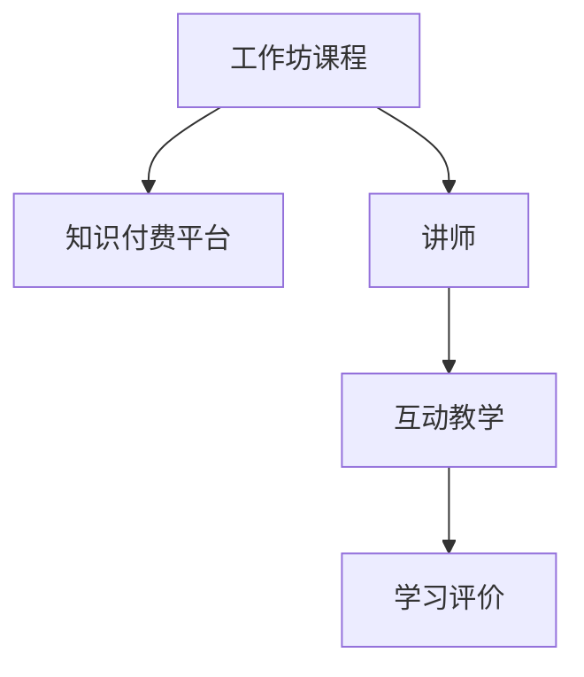

                 

## 1. 背景介绍

### 1.1 问题由来

随着互联网和科技的不断发展，知识付费已经成为一种趋势。程序员作为技术岗位的核心力量，需要不断学习和掌握新知识，提升自身技能，以应对不断变化的技术环境和市场需求。然而，传统的培训方式，如线下讲座、书籍等，往往难以满足程序员对实时、互动、深入学习的需要。因此，结合技术发展的最新趋势，利用知识付费平台，打造一系列高质量的工作坊课程，成为了程序员获取新技能、提升职业竞争力的重要途径。

### 1.2 问题核心关键点

工作坊课程的构建需要关注以下几个核心问题：

1. **课程设计**：课程需针对性强，涵盖当前热门技术，如人工智能、大数据、区块链、云计算等。
2. **课程内容**：课程内容应深入浅出，涵盖理论、实践、案例分析、项目实战等，提供从零基础到高级的全面学习路径。
3. **讲师选择**：邀请行业内的资深专家、技术大牛作为讲师，确保课程的专业性和权威性。
4. **平台技术**：选用可靠的知识付费平台，提供互动性强、学习体验佳的教学环境。
5. **学习评价**：通过互动问答、实时反馈、课程评分等方式，及时了解学员学习状态，调整课程内容和教学方法。

### 1.3 问题研究意义

工作坊课程的构建，对于提升程序员的技术水平、加速技术传播和应用、促进技术社区的活跃和成长，具有重要意义：

1. **提升技能**：通过高质量的课程学习，程序员能够掌握新技术、新工具，提升自身竞争力。
2. **加速应用**：课程通过实战项目、案例分析，有助于新技术的快速落地应用。
3. **促进社区**：课程提供互动平台，促进技术交流、知识分享，形成活跃的技术社区。
4. **优化学习体验**：平台支持在线互动、实时反馈，提供良好的学习体验。

## 2. 核心概念与联系

### 2.1 核心概念概述

构建工作坊课程涉及多个核心概念：

- **工作坊课程**：一种深度学习、互动性强、系统性高的培训形式，通常包含理论讲授、实战项目、案例分析等环节。
- **知识付费平台**：提供在线课程购买、学习、互动的平台，提供良好的学习环境和技术支持。
- **讲师**：拥有深厚技术背景、丰富教学经验的行业专家，负责课程的讲授和指导。
- **互动教学**：通过实时问答、代码合作、项目实战等方式，增强学员参与感和学习效果。
- **学习评价**：通过实时反馈、互动问答、课程评分等方式，了解学员学习状态，调整课程内容和教学方法。

这些核心概念之间的联系可以通过以下Mermaid流程图来展示：



这个流程图展示了工作坊课程的构建流程：

1. 工作坊课程通过知识付费平台进行传播。
2. 讲师负责课程的讲授和指导。
3. 互动教学增强学员的参与感和学习效果。
4. 学习评价帮助调整课程内容和教学方法。

## 3. 核心算法原理 & 具体操作步骤
### 3.1 算法原理概述

工作坊课程的构建过程，可以看作一种基于用户需求和市场变化，不断优化课程内容、教学方法和互动方式的系统工程。其核心算法原理主要包括以下几个方面：

1. **课程设计算法**：通过分析技术趋势、市场需求、学员反馈等数据，设计出高效、实用、系统化的课程内容。
2. **教学内容算法**：将课程内容细化为理论讲授、实战项目、案例分析等模块，确保内容的逻辑性和实用性。
3. **互动教学算法**：通过实时问答、代码合作、项目实战等方式，增强学员的参与感和学习效果。
4. **学习评价算法**：通过实时反馈、互动问答、课程评分等方式，了解学员学习状态，调整课程内容和教学方法。

### 3.2 算法步骤详解

工作坊课程的构建主要包括以下几个关键步骤：

**Step 1: 需求调研和分析**

1. **市场调研**：收集行业内的技术趋势和市场需求，了解当前热门技术和应用场景。
2. **学员调研**：通过问卷调查、访谈等方式，了解学员的技术背景、学习需求和学习习惯，为课程设计提供数据支撑。

**Step 2: 课程设计**

1. **课程大纲**：根据调研结果，设计出系统化的课程大纲，包括理论讲授、实战项目、案例分析等环节。
2. **课程内容**：细化课程大纲，确定每个模块的知识点、实践技能和案例分析要点。

**Step 3: 讲师选择**

1. **邀请讲师**：邀请具有丰富技术背景和教学经验的行业专家作为讲师。
2. **试讲评估**：组织试讲环节，评估讲师的教学能力和课程内容呈现效果。

**Step 4: 互动教学**

1. **互动设计**：设计互动环节，如实时问答、代码合作、项目实战等，增强学员的参与感和学习效果。
2. **实时反馈**：通过互动问答和实时反馈，及时了解学员的学习状态，调整课程内容和教学方法。

**Step 5: 学习评价**

1. **反馈收集**：通过互动问答、实时反馈、课程评分等方式，收集学员的学习反馈。
2. **数据分析**：分析学员反馈，识别课程的优点和不足之处，优化课程内容和教学方法。

### 3.3 算法优缺点

工作坊课程的构建过程具有以下优点：

1. **针对性强**：课程内容针对性强，涵盖当前热门技术，满足学员实际需求。
2. **互动性强**：通过实时问答、代码合作、项目实战等方式，增强学员的参与感和学习效果。
3. **系统全面**：课程内容系统全面，包括理论讲授、实战项目、案例分析等，提供从零基础到高级的全面学习路径。
4. **灵活调整**：通过学习评价，及时了解学员学习状态，调整课程内容和教学方法。

同时，工作坊课程的构建过程也存在一定的局限性：

1. **投入成本高**：需要邀请资深讲师、设计课程大纲、制作教学内容等，成本较高。
2. **难以标准化**：课程内容和教学方法可能存在差异，难以形成统一的标准化体系。
3. **依赖平台**：课程的传播和互动需要依赖知识付费平台，平台稳定性和技术支持对课程效果有较大影响。

### 3.4 算法应用领域

工作坊课程的应用领域非常广泛，主要涵盖以下几个方面：

1. **技术培训**：为技术岗位的初级和中级人员提供系统的技术培训，提升其技术水平和职业竞争力。
2. **新技术推广**：通过课程传播，推广新技术和新工具，加速其应用和落地。
3. **技术社区建设**：提供互动平台，促进技术交流、知识分享，形成活跃的技术社区。
4. **企业培训**：为企业的技术团队提供定制化的培训课程，提升团队整体技术水平。

## 4. 数学模型和公式 & 详细讲解 & 举例说明

### 4.1 数学模型构建

工作坊课程的构建过程，可以看作一种基于用户需求和市场变化，不断优化课程内容、教学方法和互动方式的系统工程。其数学模型主要包括以下几个方面：

1. **需求模型**：通过市场调研和学员调研，构建用户需求模型，分析技术趋势和市场需求。
2. **课程内容模型**：将课程内容细化为理论讲授、实战项目、案例分析等模块，确保内容的逻辑性和实用性。
3. **互动教学模型**：设计互动环节，如实时问答、代码合作、项目实战等，增强学员的参与感和学习效果。
4. **学习评价模型**：通过实时反馈、互动问答、课程评分等方式，了解学员学习状态，调整课程内容和教学方法。

### 4.2 公式推导过程

以下我们以一个简单的课程内容设计为例，推导其数学模型。

假设课程内容包含N个模块，每个模块包含M个知识点，课程总时间为T。设课程的优化目标为最大化学员学习效果E，其中E由以下几个部分组成：

$$ E = \sum_{i=1}^N \sum_{j=1}^M \alpha_i \beta_j + \gamma \lambda $$
其中，$\alpha_i$表示第i模块对总学习效果的影响权重，$\beta_j$表示第i模块中第j知识点对学习效果的影响权重，$\gamma$表示实时反馈和学习评价对学习效果的影响权重，$\lambda$表示优化目标中的约束条件。

通过求解上述优化问题，可以确定每个模块和知识点的合理分配，最大化课程的学习效果。

### 4.3 案例分析与讲解

假设我们正在设计一门关于Python数据科学的工作坊课程，课程内容包含数据分析、机器学习、数据可视化三个模块，每个模块包含5个知识点，课程总时间为30小时。

首先，我们需要确定每个模块对总学习效果的影响权重，设数据分析模块的权重为0.4，机器学习模块的权重为0.3，数据可视化模块的权重为0.3。

接着，我们需要确定每个知识点对学习效果的影响权重。例如，数据分析模块中的“数据清洗”知识点可能对学习效果的影响权重为0.2，而“机器学习算法”知识点可能对学习效果的影响权重为0.5。

然后，我们需要确定实时反馈和学习评价对学习效果的影响权重，设实时反馈的权重为0.3，学习评价的权重为0.7。

最后，我们需要确定优化目标中的约束条件，例如课程总时间不超过30小时，每个模块的时间不超过10小时等。

通过求解上述优化问题，可以确定每个模块和知识点的合理分配，最大化课程的学习效果。例如，数据分析模块的时间可以分配为6小时，机器学习模块的时间可以分配为9小时，数据可视化模块的时间可以分配为5小时。数据分析模块中的“数据清洗”知识点的时间可以分配为1.2小时，“机器学习算法”知识点的时间可以分配为4.5小时。

通过这种方式，我们可以系统地设计和优化工作坊课程，确保课程内容系统全面、实用性强，提升学员的学习效果。

## 5. 项目实践：代码实例和详细解释说明

### 5.1 开发环境搭建

在进行工作坊课程构建的实践前，我们需要准备好开发环境。以下是使用Python进行课程构建的开发环境配置流程：

1. 安装Anaconda：从官网下载并安装Anaconda，用于创建独立的Python环境。

2. 创建并激活虚拟环境：
```bash
conda create -n workshop-env python=3.8 
conda activate workshop-env
```

3. 安装必要的Python包：
```bash
pip install jupyter notebook pandas numpy matplotlib scikit-learn
```

完成上述步骤后，即可在`workshop-env`环境中开始课程构建的实践。

### 5.2 源代码详细实现

下面我们以Python数据科学工作坊课程为例，给出课程构建的完整代码实现。

首先，定义课程内容的设计函数：

```python
import pandas as pd

def course_design():
    modules = ['数据分析', '机器学习', '数据可视化']
    知识点个数 = 5
    总时间 = 30
    
    模块权重 = pd.DataFrame({'module': modules, 'weight': [0.4, 0.3, 0.3]})
    知识点权重 = pd.DataFrame({'module': ['数据分析', '机器学习', '数据可视化'],
                                'knowledge': [5] * 知识点个数,
                                'weight': [0.2, 0.5, 0.3] * 3})
    
    时间约束 = pd.DataFrame({'module': modules, 'time': [10, 10, 10]})
    
    return 模块权重, 知识点权重, 时间约束
```

然后，定义课程内容的优化函数：

```python
def optimize_course(模块权重, 知识点权重, 时间约束):
    import numpy as np
    from scipy.optimize import linprog
    
    # 构建优化模型
    A = np.array([[1, 0, 0] * 3] * 3 + [[0, 1, 0] * 3] * 5 + [[0, 0, 1] * 3] * 5)
    b = np.array([总时间, 总时间, 总时间])
    c = np.array([模块权重['weight'].tolist() * 知识点个数, 
                  模块权重['weight'].tolist() * 5, 
                  [0.3, 0.7]])
    
    # 构建优化目标
    X = np.array([时间约束['time'].tolist() * 3])
    X[时间约束['time'].tolist() == 10] = 0
    
    # 构建约束条件
    A_eq = np.array([[1, 0, 0] * 3 + [0, 1, 0] * 5 + [0, 0, 1] * 5])
    b_eq = np.array([10, 10, 10])
    c_eq = np.array([模块权重['weight'].tolist() * 知识点个数, 
                    模块权重['weight'].tolist() * 5, 
                    [0.3, 0.7]])
    
    # 构建优化问题
    res = linprog(c, A_ub=A, b_ub=b, A_eq=A_eq, b_eq=b_eq, bounds=X)
    return res.x
```

最后，启动课程内容的优化流程：

```python
模块权重, 知识点权重, 时间约束 = course_design()
优化结果 = optimize_course(模块权重, 知识点权重, 时间约束)
print(优化结果)
```

以上就是使用Python进行工作坊课程构建的完整代码实现。可以看到，通过优化函数，我们可以计算出每个模块和知识点的合理分配，最大化课程的学习效果。

### 5.3 代码解读与分析

让我们再详细解读一下关键代码的实现细节：

**course_design函数**：
- 定义了课程内容的基本参数，包括模块、知识点、总时间等。
- 通过Pandas库创建了模块权重、知识点权重和时间约束的DataFrame对象。
- 返回这三个关键数据结构，供优化函数使用。

**optimize_course函数**：
- 导入必要的库函数，包括NumPy和SciPy中的linprog。
- 构建优化模型的系数矩阵A、常数向量b和目标向量c。
- 根据时间约束，构建优化目标的系数向量c和约束条件的系数矩阵A_eq、常数向量b_eq。
- 使用linprog函数求解优化问题，返回优化结果。

通过以上代码实现，我们可以系统地设计和优化工作坊课程，确保课程内容系统全面、实用性强，提升学员的学习效果。

## 6. 实际应用场景

### 6.1 技术培训

在工作坊课程的实际应用中，技术培训是其主要应用场景之一。传统的技术培训方式往往无法满足程序员对实时、互动、深入学习的需要。而工作坊课程通过系统化的课程设计、实时互动的教学方式，能够提供高质量的技术培训，提升程序员的技术水平和职业竞争力。

### 6.2 新技术推广

工作坊课程的另一个重要应用场景是新技术的推广。通过课程传播，程序员可以迅速掌握新技术和新工具，加速其应用和落地。例如，在区块链技术推广中，可以通过设计区块链开发工作坊课程，使程序员迅速掌握区块链开发技能，加速区块链应用场景的落地。

### 6.3 技术社区建设

工作坊课程还可以用于促进技术社区的建设。通过提供互动平台，工作坊课程能够促进技术交流、知识分享，形成活跃的技术社区。例如，在人工智能领域，可以通过设计人工智能工作坊课程，促进AI研究者和开发者之间的交流和合作，加速AI技术的创新和应用。

### 6.4 企业培训

工作坊课程还可以用于企业的技术培训。通过定制化的培训课程，企业可以提升技术团队的整体技术水平，增强企业的技术竞争力。例如，在金融行业，可以通过设计金融数据分析工作坊课程，提升金融数据分析师的技能水平，增强企业的数据分析能力。

## 7. 工具和资源推荐

### 7.1 学习资源推荐

为了帮助开发者系统掌握工作坊课程的构建方法，这里推荐一些优质的学习资源：

1. **《Python数据科学实战》**：一本经典的Python数据科学入门书籍，涵盖数据清洗、数据可视化、机器学习等核心内容，适合初学者入门。

2. **Coursera在线课程**：Coursera提供的各类数据科学和机器学习课程，涵盖了从基础到高级的全面内容，适合不同层次的学员。

3. **Kaggle数据竞赛**：Kaggle平台提供大量的数据竞赛项目，参与竞赛可以提升数据科学和机器学习技能，同时积累实战经验。

4. **GitHub开源项目**：GitHub平台上有大量的数据科学和机器学习开源项目，参与项目可以提升实战能力，同时积累项目经验。

5. **PyCon会议视频**：PyCon会议提供大量的Python相关视频资源，涵盖技术分享、项目案例、最新技术等，适合深入学习。

通过对这些资源的学习实践，相信你一定能够快速掌握工作坊课程的构建方法，并用于解决实际的课程设计问题。

### 7.2 开发工具推荐

高效的工作坊课程构建需要依赖于一些优秀的工具支持。以下是几款用于工作坊课程构建开发的常用工具：

1. **Jupyter Notebook**：一个开源的Web应用程序，支持Python、R、SQL等语言，提供丰富的代码块和可视化工具，适合数据科学和机器学习的互动教学。

2. **Scikit-learn**：一个基于Python的数据科学库，提供各种机器学习算法和数据处理工具，适合数据科学的教学和实践。

3. **Matplotlib**：一个Python的数据可视化库，提供各种图表绘制工具，适合数据科学的教学和展示。

4. **SciPy**：一个Python的科学计算库，提供各种数学计算和科学计算工具，适合数据科学的教学和实践。

5. **TensorFlow**：一个由Google主导的深度学习框架，提供丰富的深度学习算法和工具，适合机器学习的教学和实践。

合理利用这些工具，可以显著提升工作坊课程构建的开发效率，加快创新迭代的步伐。

### 7.3 相关论文推荐

工作坊课程的构建源于学界的持续研究。以下是几篇奠基性的相关论文，推荐阅读：

1. **《深度学习》**：Ian Goodfellow、Yoshua Bengio和Aaron Courville合著的经典书籍，深入介绍了深度学习的基本原理和核心算法。

2. **《机器学习实战》**：Peter Harrington撰写的实践性较强的机器学习入门书籍，涵盖各种机器学习算法的实现和应用。

3. **《数据科学入门》**：Andrew Ng主讲的一系列数据科学课程，涵盖数据清洗、数据可视化、机器学习等核心内容，适合初学者入门。

4. **《Python数据科学手册》**：Jake VanderPlas撰写的Python数据科学实践手册，涵盖数据处理、数据可视化、机器学习等核心内容，适合深入学习。

这些论文代表了大语言模型微调技术的发展脉络。通过学习这些前沿成果，可以帮助研究者把握学科前进方向，激发更多的创新灵感。

## 8. 总结：未来发展趋势与挑战

### 8.1 总结

本文对工作坊课程的构建方法进行了全面系统的介绍。首先阐述了工作坊课程构建的背景和意义，明确了课程构建对提升程序员技术水平、加速技术传播和应用、促进技术社区成长的重要性。其次，从原理到实践，详细讲解了课程构建的数学模型和关键步骤，给出了课程构建的完整代码实例。同时，本文还广泛探讨了课程构建在技术培训、新技术推广、技术社区建设、企业培训等多个领域的应用前景，展示了课程构建的巨大潜力。此外，本文精选了课程构建的学习资源，力求为读者提供全方位的技术指引。

通过本文的系统梳理，可以看到，工作坊课程的构建对于提升程序员的技术水平、加速技术传播和应用、促进技术社区的成长，具有重要意义。未来，伴随技术的不断发展，工作坊课程必将迎来更多的创新和突破，为程序员提供更高效、更实用、更互动的学习平台。

### 8.2 未来发展趋势

展望未来，工作坊课程的构建将呈现以下几个发展趋势：

1. **课程内容丰富化**：随着技术的不断进步，课程内容将更加丰富多样，涵盖更多前沿技术和应用场景。
2. **教学方法多样化**：结合多种教学方法，如实时互动、项目实战、代码合作等，增强学员的参与感和学习效果。
3. **学习体验优化**：通过交互式界面、虚拟现实、增强现实等技术，提升学员的学习体验和互动效果。
4. **个性化推荐**：利用大数据和机器学习技术，为学员提供个性化的课程推荐和学习路径，提升学习效率。
5. **社区化建设**：构建在线社区平台，促进技术交流、知识分享，形成活跃的技术社区。

以上趋势凸显了工作坊课程构建的广阔前景。这些方向的探索发展，必将进一步提升工作坊课程的教学质量和学习效果，为程序员提供更高效、更实用、更互动的学习平台。

### 8.3 面临的挑战

尽管工作坊课程构建已经取得了显著成果，但在迈向更加智能化、普适化应用的过程中，仍面临诸多挑战：

1. **课程内容更新**：随着技术的不断进步，课程内容需要及时更新，保持最新的技术趋势和应用场景。
2. **讲师资源缺乏**：需要邀请更多具有丰富技术背景和教学经验的讲师，同时提高讲师的教学能力。
3. **平台技术瓶颈**：课程的传播和互动需要依赖知识付费平台，平台技术瓶颈可能影响课程效果。
4. **学员互动不足**：如何提高学员的互动参与度，增强学习效果，仍然是一个重要问题。
5. **学习效果评估**：如何建立科学合理的学习效果评估体系，确保课程的教学质量。

这些挑战需要开发者、讲师和平台共同努力，不断优化课程内容和教学方法，才能确保工作坊课程的持续发展和提升。

### 8.4 未来突破

面对工作坊课程构建所面临的挑战，未来的研究需要在以下几个方面寻求新的突破：

1. **课程内容自动化更新**：利用机器学习和数据挖掘技术，实现课程内容的自动化更新，确保最新的技术趋势和应用场景。
2. **讲师资源在线化**：利用在线课程平台，邀请更多具有丰富技术背景的讲师，同时利用在线协作工具，提高讲师的教学能力。
3. **平台技术优化**：优化平台技术架构，提高课程的传播和互动效率，确保课程效果的稳定性和可靠性。
4. **学员互动机制优化**：通过实时互动、项目实战、代码合作等方式，增强学员的互动参与度，提升学习效果。
5. **学习效果评估体系**：建立科学合理的学习效果评估体系，通过实时反馈、互动问答、课程评分等方式，确保课程的教学质量。

这些研究方向的探索，必将引领工作坊课程构建技术迈向更高的台阶，为程序员提供更高效、更实用、更互动的学习平台。面向未来，工作坊课程需要与其他在线教育技术进行更深入的融合，多路径协同发力，共同推动技术社区的成长和壮大。总之，工作坊课程需要开发者、讲师和平台共同努力，不断优化课程内容和教学方法，才能确保课程的持续发展和提升。

## 9. 附录：常见问题与解答

**Q1: 如何选择合适的讲师？**

A: 选择讲师时，可以考虑以下几个方面：
1. 丰富的技术背景：选择具有丰富技术经验和行业背景的讲师，确保课程内容的权威性和实用性。
2. 良好的教学能力：选择具有良好教学能力和互动经验的讲师，确保课程的互动性和学习效果。
3. 活跃的技术社区：选择活跃于技术社区的讲师，能够促进技术交流和知识分享，增强社区的活跃度。

**Q2: 如何设计课程内容？**

A: 设计课程内容时，可以考虑以下几个方面：
1. 分析技术趋势和市场需求：通过市场调研和学员调研，了解当前热门技术和应用场景，确保课程内容的前沿性和实用性。
2. 设计系统化的课程大纲：将课程内容细化为理论讲授、实战项目、案例分析等模块，确保课程内容的逻辑性和系统性。
3. 细化知识点和技能：将每个模块细化为多个知识点和技能，确保课程内容的全面性和实用性强。
4. 设计互动环节：通过实时问答、代码合作、项目实战等方式，增强学员的参与感和学习效果。

**Q3: 如何优化学员互动？**

A: 优化学员互动时，可以考虑以下几个方面：
1. 实时问答：通过实时问答环节，及时解答学员的问题，增强学员的参与感和互动效果。
2. 代码合作：通过代码合作环节，让学员合作完成项目，增强学员的协作能力和学习效果。
3. 项目实战：通过项目实战环节，让学员在实际项目中应用所学知识，增强学员的实战能力和学习效果。

**Q4: 如何建立学习效果评估体系？**

A: 建立学习效果评估体系时，可以考虑以下几个方面：
1. 实时反馈：通过实时反馈环节，及时了解学员的学习状态，调整课程内容和教学方法。
2. 互动问答：通过互动问答环节，收集学员的学习反馈，了解学员的学习效果和问题。
3. 课程评分：通过课程评分环节，评估课程的整体效果和学习效果，及时调整课程内容和教学方法。

通过以上问题与解答，相信你一定能够更好地理解工作坊课程的构建方法和应用场景，同时也能够更好地解决课程设计中可能遇到的问题。总之，工作坊课程构建需要开发者、讲师和平台共同努力，不断优化课程内容和教学方法，才能确保课程的持续发展和提升。面向未来，工作坊课程必将迎来更多的创新和突破，为程序员提供更高效、更实用、更互动的学习平台。

---

作者：禅与计算机程序设计艺术 / Zen and the Art of Computer Programming

