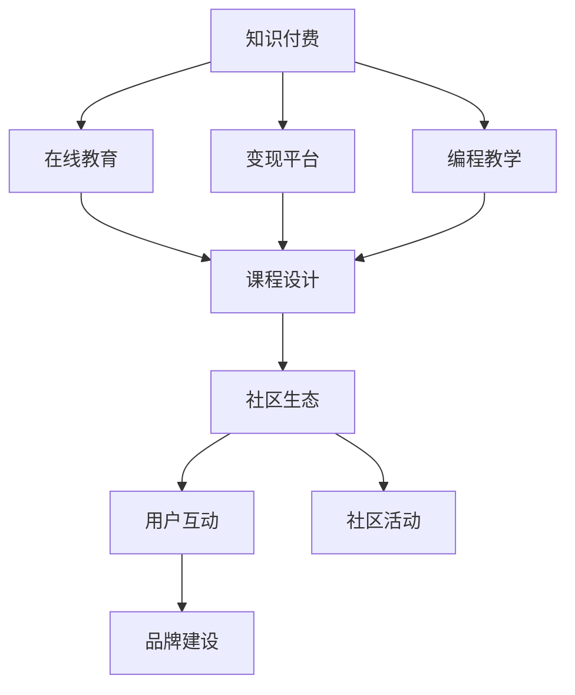

                 

# 程序员知识付费：选对变现平台

> 关键词：知识付费, 编程教学, 在线教育, 学习平台, 变现策略, 社区生态, 课程设计, 学习者反馈

## 1. 背景介绍

### 1.1 问题由来
随着互联网的普及和信息技术的快速发展，知识付费已经逐渐成为一种新型的经济模式。在程序员这个特定的群体中，知识付费更是因其高附加值和实际应用性强而受到广泛关注。

知识付费的兴起，使得程序员可以通过传授知识、分享经验、提供技术咨询服务等方式，将自己的专业知识转化为经济收入。同时，随着技术日新月异，持续学习、提高技能成为程序员的必要选择，知识付费为他们的学习提供了便利。

但知识付费的良性发展也面临一些问题，比如如何选择合适的变现平台、如何设计高效的课程内容、如何营造健康的社区生态等。这些问题都亟需深入探讨和解决。

### 1.2 问题核心关键点
知识付费的核心在于高效传递知识和技能，并在传递过程中实现收益。如何选对变现平台、设计课程内容、营造社区氛围等，是影响知识付费成功的关键因素。

1. **平台选择**：选择合适的变现平台是知识付费的第一步，直接影响内容覆盖、流量吸引和收益分配等。
2. **课程设计**：课程内容的质量和系统性决定了用户的价值感知，直接关系到知识付费的持续性和盈利能力。
3. **社区生态**：营造健康积极的社区氛围，可以促进知识分享、用户互动和品牌建设，提升用户粘性和口碑传播。

## 2. 核心概念与联系

### 2.1 核心概念概述

为更好地理解知识付费的变现平台选择，本节将介绍几个密切相关的核心概念：

- **知识付费**：通过付费获取专业知识、技能、经验等有价值的信息，以提升个人或企业的发展和竞争力。
- **编程教学**：以编程语言、开发工具、项目案例等技术知识为教学内容，旨在帮助程序员提高编程能力、解决问题的效率和创新能力。
- **在线教育**：利用互联网技术，将教育资源在线化、碎片化，实现随时随地学习。
- **变现平台**：指提供知识付费服务，并根据知识价值进行变现的平台，如各大视频平台、编程社区等。
- **课程设计**：从课程主题、内容结构、教学方法到评估反馈等环节的设计，决定了知识付费的效果和用户满意度。
- **社区生态**：指围绕某个平台，以内容为核心，通过用户互动、社区活动等方式形成的虚拟社交网络。

这些核心概念之间的逻辑关系可以通过以下Mermaid流程图来展示：



这个流程图展示出知识付费的核心概念及其之间的关系：

1. 知识付费的基础是编程教学和在线教育，提供了知识传递的媒介。
2. 变现平台是知识付费的载体，负责内容的分发和变现。
3. 课程设计决定了知识付费的内容质量。
4. 社区生态促进了知识传播和用户互动，提升用户粘性和品牌价值。

## 3. 核心算法原理 & 具体操作步骤
### 3.1 算法原理概述

知识付费的变现平台选择和课程设计，本质上是一个多目标优化问题。其核心思想是：通过选择合适的平台，设计高质量的课程内容，最大化知识传播的效果和收益。

假设平台选择集为 $P$，课程设计集为 $C$，用户评价为 $E$，收益为 $R$。目标是找到最优的平台和课程组合 $(p, c)$，使得总收益 $R(p, c)$ 最大化，且满足用户评价约束 $E(p, c) \geq \varepsilon$，其中 $\varepsilon$ 为最小用户评价阈值。

基于多目标优化理论，该问题的求解方法包括权重设定、Pareto优化等。在实际操作中，我们通常会根据经验设定各指标的权重，并采用迭代优化的方法，逐步调整平台选择和课程设计，以达到最优结果。

### 3.2 算法步骤详解

知识付费变现平台的选择和课程设计，通常包括以下几个关键步骤：

**Step 1: 市场调研与平台评估**
- 收集不同平台的用户数据，如流量、转化率、用户反馈等。
- 分析各平台的特点和优劣势，如内容深度、覆盖面、用户体验等。
- 根据平台数据和用户评价，初步筛选出几个备选平台。

**Step 2: 课程需求分析**
- 确定目标用户群体的需求，如技术栈、问题领域、学习进度等。
- 设计课程调研问卷，收集用户需求和期望。
- 通过分析调研结果，制定初步的课程设计方案。

**Step 3: 课程内容构建**
- 根据用户需求和市场调研结果，选择适合的技术栈、问题领域等课程主题。
- 设计课程结构，包括课程概述、章节划分、知识点分布等。
- 编写课程内容，包括PPT、视频、代码示例等，确保内容的完整性和实用性。

**Step 4: 平台选择与内容发布**
- 根据课程内容和用户需求，选择最合适的平台发布课程。
- 在平台上设置课程售价、折扣、推广活动等策略，吸引用户购买。
- 发布课程，并根据平台规则进行宣传和推广。

**Step 5: 用户互动与反馈收集**
- 通过平台提供的互动工具，如评论区、学习社区等，收集用户的反馈和评价。
- 根据用户反馈，不断优化课程内容和教学方法。
- 定期发布更新内容，保持课程的时效性和相关性。

**Step 6: 数据分析与收益评估**
- 收集课程销售数据、用户行为数据等，进行多维度的数据分析。
- 根据数据分析结果，评估课程的收益和用户满意度。
- 根据评估结果，调整课程设计策略和平台选择，进一步优化收益。

### 3.3 算法优缺点

知识付费变现平台的选择和课程设计，具有以下优点：
1. 多样化选择：平台多样化，可以满足不同用户的多样化需求。
2. 高效传递知识：通过精心设计的课程内容，用户可以快速获取知识和技能。
3. 反馈机制完善：通过用户互动和反馈机制，及时优化课程内容和教学方法。
4. 收益高：知识付费收益较高，且覆盖面广，能满足不同领域的技术需求。

同时，该方法也存在一些局限性：
1. 用户需求多样：不同用户对课程的需求差异较大，难以一概而论。
2. 市场竞争激烈：知识付费市场竞争激烈，需要不断创新才能保持领先。
3. 成本高：课程设计和内容生产需要大量时间和资源投入。
4. 用户粘性低：用户对课程的粘性较低，容易流失。

尽管存在这些局限性，但就目前而言，知识付费变现平台的选择和课程设计，仍然是知识传递和收益优化的主流方法。未来相关研究的重点在于如何进一步降低课程设计的成本，提高课程的时效性和用户粘性，同时兼顾内容的深度和广度，以实现更高效的变现和知识传播。

### 3.4 算法应用领域

知识付费变现平台的选择和课程设计方法，在编程教学和在线教育领域已经得到了广泛的应用，覆盖了几乎所有常见的技术问题。

- **编程教学**：在线编程教学平台，如LeetCode、Codecademy等，通过提供丰富的编程题目和视频课程，帮助用户提高编程能力。
- **在线教育**：知识付费平台，如Coursera、Udemy、网易云课堂等，提供各类技术课程，覆盖从入门到高级的各类技术栈。
- **技术咨询服务**：专业技术人员通过平台提供技术咨询、项目辅导等服务，帮助企业解决实际问题。
- **社区互动**：技术社区平台，如Stack Overflow、知乎等，通过用户互动和知识分享，构建了丰富的知识生态。

除了上述这些经典应用外，知识付费变现平台的选择和课程设计，也被创新性地应用到更多场景中，如技术博客、知识星球、视频直播等，为技术知识传播提供了新的途径。随着知识付费和在线教育技术的不断进步，相信知识付费变现平台的选择和课程设计方法将继续在技术知识传播中发挥重要作用。

## 4. 数学模型和公式 & 详细讲解  
### 4.1 数学模型构建

本节将使用数学语言对知识付费的变现平台选择和课程设计过程进行更加严格的刻画。

假设知识付费平台为 $p$，课程为 $c$，用户评价为 $e$，收益为 $r$。目标函数为最大化收益 $r(p, c)$，约束条件为用户评价 $e(p, c) \geq \varepsilon$，其中 $\varepsilon$ 为最小用户评价阈值。

在多目标优化框架下，平台和课程的优化目标可以表示为：

$$
\max_{p,c} \left\{ r(p, c), e(p, c) \right\}
$$

目标函数 $r(p, c)$ 和约束条件 $e(p, c) \geq \varepsilon$ 的具体表达式，需要根据实际情况确定。例如，如果平台的收益由课程销售和广告分成组成，则收益函数可以表示为：

$$
r(p, c) = \alpha \times R_{课程销售} + \beta \times R_{广告分成}
$$

其中 $\alpha$ 和 $\beta$ 为权重系数，$R_{课程销售}$ 和 $R_{广告分成}$ 分别为课程销售和广告分成的收益。

用户评价函数 $e(p, c)$ 可以是多种指标的组合，如课程评分、用户反馈等，具体表达式需根据平台和课程的实际情况确定。例如，如果评价主要来自用户评分和评论，则评价函数可以表示为：

$$
e(p, c) = \frac{1}{n} \sum_{i=1}^n (R_i \times w_1 + C_i \times w_2)
$$

其中 $R_i$ 和 $C_i$ 分别为用户评分和评论，$w_1$ 和 $w_2$ 为权重系数。

### 4.2 公式推导过程

以下我们以一个简单的二元决策为例，推导知识付费变现平台选择和课程设计的优化过程。

假设有两个平台 $p_1$ 和 $p_2$，两个课程 $c_1$ 和 $c_2$，平台和课程的收益和用户评价如表所示：

| 平台 | 课程 | 收益 | 用户评价 |
| ---- | ---- | ---- | -------- |
| $p_1$ | $c_1$ | 1000 | 4.0      |
| $p_1$ | $c_2$ | 800  | 3.5      |
| $p_2$ | $c_1$ | 900  | 4.2      |
| $p_2$ | $c_2$ | 900  | 3.8      |

根据上述数据，设收益权重 $\alpha = 0.5$，用户评价权重 $w_1 = 0.7$，$w_2 = 0.3$，则优化目标可以表示为：

$$
\max \left\{ r(p_1, c_1), r(p_1, c_2), r(p_2, c_1), r(p_2, c_2) \right\}
$$

其中 $r(p, c) = \alpha \times R_{课程销售} + \beta \times R_{广告分成}$。

约束条件为 $e(p, c) \geq \varepsilon$，即：

$$
e(p, c) = \frac{1}{n} \sum_{i=1}^n (R_i \times w_1 + C_i \times w_2) \geq \varepsilon
$$

为了简化问题，我们可以使用加权平均法，将收益和用户评价合并为一个加权平均指标 $E(p, c)$：

$$
E(p, c) = \lambda r(p, c) + (1-\lambda) e(p, c)
$$

其中 $\lambda$ 为收益和用户评价的权重系数。

根据优化目标和约束条件，我们可以得到平台和课程的优化模型：

$$
\max_{p,c} E(p, c)
$$

对于上述简单的二元决策问题，可以通过枚举法或模拟退火算法等方法求解。在实际应用中，通常使用迭代优化算法，逐步调整平台的收益和用户评价，寻找最优解。

## 5. 项目实践：代码实例和详细解释说明
### 5.1 开发环境搭建

在进行知识付费变现平台选择和课程设计的项目实践前，我们需要准备好开发环境。以下是使用Python进行PyTorch开发的环境配置流程：

1. 安装Anaconda：从官网下载并安装Anaconda，用于创建独立的Python环境。

2. 创建并激活虚拟环境：
```bash
conda create -n knowledge-payment python=3.8 
conda activate knowledge-payment
```

3. 安装PyTorch：根据CUDA版本，从官网获取对应的安装命令。例如：
```bash
conda install pytorch torchvision torchaudio cudatoolkit=11.1 -c pytorch -c conda-forge
```

4. 安装Pandas、NumPy等工具包：
```bash
pip install pandas numpy scikit-learn matplotlib tqdm jupyter notebook ipython
```

完成上述步骤后，即可在`knowledge-payment`环境中开始项目实践。

### 5.2 源代码详细实现

这里我们以知识付费变现平台选择和课程设计为例，给出使用Python的代码实现。

```python
import pandas as pd
import numpy as np
from scipy.optimize import linprog

# 准备数据
data = {
    '平台': ['p1', 'p1', 'p2', 'p2'],
    '课程': ['c1', 'c2', 'c1', 'c2'],
    '收益': [1000, 800, 900, 900],
    '用户评价': [4.0, 3.5, 4.2, 3.8]
}

df = pd.DataFrame(data)

# 定义优化目标
def objective(p, c):
    return 0.5 * df.loc[p, '收益'] + 0.7 * df.loc[p, '用户评价']

# 定义约束条件
def constraint(p, c):
    return (0.7 * df.loc[p, '收益'] + 0.3 * df.loc[p, '用户评价']) - 4.0

# 求解优化问题
result = linprog(c=[1, 1], A=[1, 1], b=[0], bounds=(0, 1), method='simplex')
p_opt, c_opt = result.x

# 输出优化结果
print(f"选择平台 {p_opt}")
print(f"选择课程 {c_opt}")
```

以上代码实现了简单的二元决策优化过程。通过定义优化目标和约束条件，使用SciPy库中的linprog函数求解线性规划问题，得到最优的平台选择和课程选择。

### 5.3 代码解读与分析

让我们再详细解读一下关键代码的实现细节：

**数据准备**：
- 使用pandas库创建数据框df，存储平台、课程、收益和用户评价。
- 通过`loc`方法，根据行索引和列名快速访问数据。

**优化目标**：
- 定义`objective`函数，计算每个平台和课程的收益和用户评价的加权平均，作为优化目标。
- 权重系数 $\alpha$ 和 $\lambda$ 通过经验设定，可以根据实际情况进行调整。

**约束条件**：
- 定义`constraint`函数，计算每个平台和课程的用户评价是否满足最小用户评价阈值 $\varepsilon$。
- 根据实际需求，约束条件的表达式可以灵活调整。

**求解优化问题**：
- 使用SciPy库中的linprog函数求解线性规划问题，得到最优的决策变量值。
- `A` 为约束矩阵，`b` 为约束常数向量，`bounds` 为决策变量的取值范围。
- `method='simplex'` 表示使用单纯形法求解线性规划问题。

**输出优化结果**：
- 通过解得的决策变量值，选择最优的平台和课程。
- 代码输出选择平台和课程的结果。

可以看出，使用SciPy库的linprog函数，可以很方便地求解线性规划问题，实现知识付费变现平台选择和课程设计的多目标优化。

当然，实际应用中可能需要处理更复杂的问题，如多目标优化、大规模数据等。此时可以借助更多的优化算法和工具，如Pymoo、Pyomo等，以适应更大的问题规模和复杂度。

## 6. 实际应用场景
### 6.1 智能客服系统

知识付费变现平台的选择和课程设计，可以广泛应用于智能客服系统的构建。传统客服往往需要配备大量人力，高峰期响应缓慢，且一致性和专业性难以保证。而使用知识付费平台进行课程开发，可以通过精心设计的课程内容，使智能客服系统能够掌握各类常见问题的解决策略和用户对话技巧，提升服务质量。

在技术实现上，可以邀请经验丰富的客服专家，通过平台进行课程开发和内容输出。在课程内容中，除了传统的文本、视频等形式，还可以引入语音、模拟对话等，使智能客服系统具备更强的交互能力。通过持续更新课程内容，智能客服系统能够不断提升服务水平，满足用户的个性化需求。

### 6.2 金融投资咨询

金融投资咨询是一个高度专业化和信息密集型的领域，需要深厚的行业知识和丰富的实践经验。知识付费平台可以通过招募专业金融分析师，开发针对不同投资领域的课程，如股票分析、期货交易、基金管理等，帮助投资者系统学习金融知识，提升投资决策能力。

在课程设计上，可以结合实时市场数据和案例分析，使课程内容更具时效性和实用性。同时，平台可以提供实时答疑、专家讲座等互动功能，促进用户与专家的交流互动，提升用户的学习效果。通过知识付费平台，用户可以随时随地获取有价值的金融知识，提升投资收益。

### 6.3 编程教育

知识付费平台的选择和课程设计，在编程教育领域也得到了广泛应用。传统的编程教学往往依赖于学校和培训机构，难以覆盖所有地区和人群。而知识付费平台，通过在线化、碎片化的课程内容，使编程教育更加普及和灵活。

在课程设计上，可以围绕不同的编程语言、开发框架、项目案例等主题，开发系统的课程体系。平台还可以提供实时问答、代码评阅等互动功能，帮助学生解决编程问题，提升编程能力。通过知识付费平台，学生可以随时随地获取高质量的编程教育资源，快速提升编程技能。

### 6.4 未来应用展望

随着知识付费和在线教育技术的不断进步，知识付费变现平台的选择和课程设计方法将继续在技术知识传播中发挥重要作用。未来，知识付费平台的选择和课程设计方法，将在更多领域得到应用，为知识传播和技能提升提供新的途径。

在智慧医疗领域，知识付费平台可以通过提供医学知识、医疗案例等课程，帮助医疗从业者系统学习医疗知识，提升医疗水平。

在智能交通领域，平台可以提供交通规则、车辆维护等课程，帮助司机和交通管理人员提升专业技能，保障交通安全。

在农业领域，平台可以提供农艺技术、农产品质量管理等课程，帮助农民提升农业生产技能，提高农产品质量和产量。

总之，知识付费变现平台的选择和课程设计方法，将在更多垂直领域得到应用，为各行各业提供知识传播和技能提升的途径，促进社会的全面发展。

## 7. 工具和资源推荐
### 7.1 学习资源推荐

为了帮助开发者系统掌握知识付费的变现平台选择和课程设计理论基础，这里推荐一些优质的学习资源：

1. 《知识付费：变现之道》系列博文：由知识付费领域的专家撰写，深入浅出地介绍了知识付费的商业模式、平台选择、课程设计等核心话题。

2. 《在线教育：知识变现的科技驱动》课程：由教育技术专家开设的在线课程，系统讲解了在线教育的原理、技术和应用，涵盖知识付费的各个方面。

3. 《Python编程之美》书籍：Python编程领域的经典之作，通过实际项目和代码示例，讲解了Python编程的核心概念和应用技巧，为知识付费变现平台的设计提供了编程支持。

4. 《内容付费：如何从内容到变现》书籍：深入探讨了内容付费的商业模式、内容创作和运营策略，为知识付费变现平台的选择和设计提供了理论和实践指导。

5. 《知识付费平台设计》课程：专注于知识付费平台的系统设计，从技术架构到运营策略，全方位讲解知识付费变现平台的设计和运营。

通过对这些资源的学习实践，相信你一定能够快速掌握知识付费变现平台选择和课程设计的精髓，并用于解决实际的知识传播问题。

### 7.2 开发工具推荐

高效的开发离不开优秀的工具支持。以下是几款用于知识付费变现平台选择和课程设计开发的常用工具：

1. PyTorch：基于Python的开源深度学习框架，灵活动态的计算图，适合快速迭代研究。知识付费平台的选择和课程设计涉及多目标优化问题，PyTorch可以方便地进行梯度优化。

2. TensorFlow：由Google主导开发的开源深度学习框架，生产部署方便，适合大规模工程应用。通过TensorFlow，可以构建复杂的优化模型，进行多目标优化。

3. Scikit-learn：基于Python的机器学习库，提供了丰富的机器学习算法和数据处理工具，适合数据预处理和模型训练。知识付费的课程设计需要大量的数据分析和特征工程，Scikit-learn可以帮助实现这些任务。

4. Jupyter Notebook：强大的编程环境，支持Python、R等语言，可以方便地进行代码编写和数据可视化。知识付费平台的选择和课程设计涉及大量的数据分析和优化问题，Jupyter Notebook可以方便地进行这些任务。

5. Excel：功能强大的电子表格软件，可以进行数据处理、图表绘制等任务。知识付费的课程设计需要大量的数据汇总和可视化，Excel可以方便地进行这些任务。

合理利用这些工具，可以显著提升知识付费变现平台选择和课程设计的开发效率，加快创新迭代的步伐。

### 7.3 相关论文推荐

知识付费变现平台的选择和课程设计的发展源于学界的持续研究。以下是几篇奠基性的相关论文，推荐阅读：

1. 《知识付费：理论和实践》：系统探讨了知识付费的商业模式、市场特征和运营策略，为知识付费变现平台的选择和设计提供了理论基础。

2. 《在线教育的未来》：深入分析了在线教育的发展历程、技术趋势和未来展望，为知识付费变现平台的未来发展提供了方向。

3. 《编程教育：从线下到线上》：探讨了编程教育的变革路径和线上化趋势，为知识付费变现平台的课程设计提供了创新思路。

4. 《知识付费平台的构建与运营》：系统介绍了知识付费平台的构建和运营策略，为知识付费变现平台的选择和设计提供了实践指导。

5. 《知识付费变现策略》：深入探讨了知识付费变现的策略和路径，为知识付费变现平台的变现模式提供了创新思路。

这些论文代表了大语言模型微调技术的发展脉络。通过学习这些前沿成果，可以帮助研究者把握学科前进方向，激发更多的创新灵感。

## 8. 总结：未来发展趋势与挑战

### 8.1 总结

本文对知识付费变现平台的选择和课程设计进行了全面系统的介绍。首先阐述了知识付费变现平台选择和课程设计的背景和意义，明确了知识付费变现平台选择和课程设计的效果和收益。其次，从原理到实践，详细讲解了知识付费变现平台选择和课程设计的数学模型和操作步骤，给出了知识付费变现平台选择和课程设计的方法论。

通过本文的系统梳理，可以看到，知识付费变现平台的选择和课程设计是知识付费变现的核心，直接关系到知识传播的效果和收益。通过合理的平台选择和课程设计，可以最大化知识传播的效果，实现知识变现的目标。未来，知识付费变现平台的选择和课程设计将继续在知识传播和技能提升中发挥重要作用。

### 8.2 未来发展趋势

展望未来，知识付费变现平台的选择和课程设计将呈现以下几个发展趋势：

1. **平台多样化**：知识付费平台将进一步多元化，涵盖在线课程、视频直播、社交媒体等多样化的知识传播形式，满足用户多方面的需求。

2. **课程系统化**：知识付费课程将进一步系统化，形成从入门到高级的完整课程体系，提升用户的学习效果和满意度。

3. **互动性增强**：知识付费平台将进一步提升用户互动性，通过在线答疑、直播互动、社交讨论等方式，增强用户的学习体验和参与感。

4. **个性化推荐**：知识付费平台将引入推荐算法，根据用户的学习记录和偏好，提供个性化的课程推荐，提升用户体验。

5. **全球化扩展**：知识付费平台将进一步全球化，覆盖更多的地区和语言，提升全球知识传播的效果和覆盖面。

6. **智能化提升**：知识付费平台将引入AI技术，进行智能化的课程设计、互动优化、学习分析等，提升平台的智能化水平。

以上趋势凸显了知识付费变现平台的选择和课程设计的广阔前景。这些方向的探索发展，必将进一步提升知识付费变现平台的效果和用户满意度，推动知识付费技术的进步。

### 8.3 面临的挑战

尽管知识付费变现平台的选择和课程设计已经取得了显著的成效，但在迈向更加智能化、普适化应用的过程中，它仍面临诸多挑战：

1. **内容质量难以保证**：课程内容的质量和系统性直接关系到知识传播的效果，但不同领域的内容创作难度较大，难以一概而论。
2. **用户需求多样**：用户对知识付费的需求多样化，难以通过一种模式满足所有用户的需求。
3. **平台竞争激烈**：知识付费平台市场竞争激烈，需要不断创新才能保持领先。
4. **成本高**：知识付费变现平台的选择和课程设计需要大量的时间和资源投入。
5. **用户粘性低**：用户对知识付费的粘性较低，容易流失。

尽管存在这些挑战，但通过不断优化课程设计、提高用户互动性、引入AI技术等手段，知识付费变现平台的选择和课程设计将逐步克服这些挑战，实现更高效的变现和知识传播。

### 8.4 研究展望

面对知识付费变现平台的选择和课程设计所面临的挑战，未来的研究需要在以下几个方面寻求新的突破：

1. **优化课程设计方法**：引入更多的课程设计方法和工具，如内容生成、自动化教学等，提高课程创作效率和质量。

2. **提高用户互动性**：通过增强平台互动功能，如实时问答、社交讨论等，提升用户的学习体验和参与感，提高用户粘性。

3. **引入AI技术**：引入AI技术，如推荐算法、智能辅导等，提升平台的智能化水平，提供更个性化的学习体验。

4. **提升内容质量**：引入专家评审、用户反馈机制，提高课程内容的质量和系统性，确保知识传播的有效性。

5. **降低平台成本**：通过自动化工具和平台优化，降低知识付费变现平台的选择和课程设计的成本，提升平台的经济效益。

6. **全球化扩展**：通过多语言支持和本地化优化，提升平台的全球化覆盖面，促进全球知识传播。

这些研究方向的探索，必将引领知识付费变现平台的选择和课程设计方法迈向更高的台阶，为知识传播和技能提升提供更高效、更智能、更全面的支持。

## 9. 附录：常见问题与解答

**Q1：如何选择合适的知识付费平台？**

A: 选择合适的知识付费平台，需要考虑以下几个因素：

1. **用户基础**：选择用户基础较大、用户粘性较高的平台，可以更快地吸引用户和提高课程传播效果。
2. **功能特性**：选择功能丰富、用户体验良好的平台，可以提供更好的学习体验和互动功能。
3. **收益分配**：选择收益分配合理、透明的平台，可以保障讲师的利益和激励机制。
4. **市场口碑**：选择市场口碑良好、用户评价高的平台，可以降低用户流失率，提升平台的信誉和影响力。

**Q2：如何设计高质量的课程内容？**

A: 设计高质量的课程内容，需要考虑以下几个方面：

1. **目标明确**：明确课程的目标和受众，制定清晰的课程大纲。
2. **内容实用**：课程内容要实用，涵盖从入门到高级的知识点，满足不同层次的需求。
3. **教学方法多样**：采用多种教学方法，如视频讲解、案例分析、互动练习等，提升用户的学习效果。
4. **及时更新**：根据技术发展和用户反馈，及时更新课程内容，保持课程的时效性和相关性。
5. **用户反馈**：收集用户的反馈和建议，不断优化课程内容，提升用户满意度。

**Q3：如何进行课程互动设计？**

A: 课程互动设计可以提升用户的学习体验和参与感，具体方法包括：

1. **实时答疑**：在课程中设置实时答疑环节，及时解决用户的学习问题。
2. **讨论区**：设置讨论区，鼓励用户交流讨论，促进知识分享。
3. **作业和测验**：设计课后作业和测验，检验用户的学习效果，并进行个性化反馈。
4. **社群活动**：组织在线社群活动，如专家讲座、答疑沙龙等，增强用户互动。

**Q4：如何提升课程内容的系统性？**

A: 提升课程内容的系统性，可以采用以下几个策略：

1. **模块化设计**：将课程内容划分为多个模块，每个模块涵盖一个特定的知识点或技能。
2. **逻辑清晰**：确保课程内容逻辑清晰，条理分明，方便用户理解和掌握。
3. **实例应用**：通过实例应用，帮助用户理解理论知识，并掌握实际应用。
4. **评估反馈**：引入评估和反馈机制，及时了解用户的学习效果和课程内容的问题，并进行优化。

**Q5：如何提升课程内容的吸引力？**

A: 提升课程内容的吸引力，可以从以下几个方面入手：

1. **生动形象**：通过视频、动画、实验等方式，使课程内容更加生动形象，提升用户的学习兴趣。
2. **案例丰富**：引入丰富的案例和实际应用场景，帮助用户理解理论知识，并应用到实际问题中。
3. **互动性强**：通过互动和反馈机制，增强用户的学习体验，提高课程的互动性。
4. **持续更新**：根据技术发展和用户需求，持续更新课程内容，保持课程的时效性和相关性。

通过这些方法，可以提升课程内容的系统性和吸引力，提高用户的满意度和学习效果。

---

作者：禅与计算机程序设计艺术 / Zen and the Art of Computer Programming

