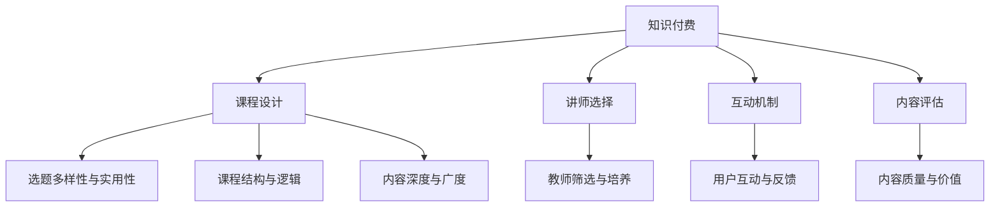

                 

# 程序员知识付费：选题与策划

## 1. 背景介绍

### 1.1 问题由来

随着互联网的普及和技术的飞速发展，程序员社群日益壮大，知识的获取和传播也变得更为便捷。然而，面对复杂多变的技术环境，如何高效地筛选、获取和应用知识，成为了程序员面临的共同挑战。在这样的背景下，知识付费平台应运而生，为程序员提供了一个高质量、系统化的知识学习与交流渠道。

知识付费的兴起，让程序员可以通过付费获取特定领域的专业课程、技术资料和咨询服务，避免了在海量免费资源中筛选和学习的低效。这种模式不仅满足了程序员对深入学习的渴望，也提升了学习效果和效率。但同时，知识付费市场也面临诸多问题，如内容质量参差不齐、价格体系不透明、用户体验差等。

### 1.2 问题核心关键点

在知识付费的选题与策划中，核心关键点包括：
- 选题的多样性与实用性：如何根据目标用户群体的需求，设计出既具有高度实用性又涵盖广泛主题的知识内容。
- 课程的结构与逻辑：如何设计合理的课程结构，使学习路径更加系统，知识衔接更为紧密。
- 内容的深度与广度：如何在有限的课程时间内，涵盖知识点的全面性，同时保持内容的深度和可操作性。
- 教师的选择与培养：如何选拔和培养优秀的讲师，保证课程质量。
- 用户的互动与反馈：如何建立良好的用户互动机制，及时收集用户反馈，不断优化课程内容。

## 2. 核心概念与联系

### 2.1 核心概念概述

为更好地理解知识付费的选题与策划，本节将介绍几个密切相关的核心概念：

- 知识付费(Knowledge Paywall)：指通过付费方式获取知识产品的模式，用户需要为高质量的学习内容支付费用。
- 课程设计(Course Design)：指对知识内容进行系统化的规划和组织，使其符合学习规律和认知结构。
- 讲师选择(Lecturer Selection)：指选择具有专业知识、授课经验和良好教学效果的讲师。
- 互动机制(Interactive Mechanism)：指在知识付费平台中，通过讨论区、课程留言等形式，建立用户与讲师、用户与用户之间的互动交流。
- 内容评估(Content Evaluation)：指对知识付费平台上的课程内容进行质量评估，保证课程内容的高质量和高性价比。

这些核心概念之间的逻辑关系可以通过以下Mermaid流程图来展示：



这个流程图展示了两者的核心概念及其之间的关系：

1. 知识付费作为整体背景，推动了课程设计、讲师选择、互动机制和内容评估的实践。
2. 课程设计、讲师选择、互动机制和内容评估共同构成了知识付费的具体实现方式，保障了知识付费的质量和用户体验。
3. 课程设计中的选题多样性与实用性、课程结构与逻辑、内容深度与广度，直接影响知识付费平台的学习效果和用户满意度。
4. 讲师选择和互动机制与内容评估协同作用，确保了讲师的专业性和课程内容的高质量。

## 3. 核心算法原理 & 具体操作步骤
### 3.1 算法原理概述

知识付费平台的选题与策划，本质上是一个系统的决策过程。其核心思想是：根据用户需求和市场趋势，通过多维度数据分析和用户反馈，选择和设计最符合用户需求的知识内容。

形式化地，假设知识付费平台的知识需求为 $D$，市场趋势为 $T$，目标用户群体的学习习惯和偏好为 $L$。知识付费的选题与策划过程，可以表示为：

$$
S = \mathop{\arg\min}_{S} \mathcal{L}(S, D, T, L)
$$

其中，$S$ 为知识内容选题集合，$\mathcal{L}$ 为损失函数，衡量选题与用户需求、市场趋势和学习习惯的契合度。

通常，知识付费平台的选题与策划包括以下几个关键步骤：

1. 需求调研：通过问卷、访谈等方式，收集目标用户群体的知识需求和痛点。
2. 趋势分析：分析市场和行业的发展趋势，识别热门和有潜力的知识领域。
3. 内容设计：根据用户需求和市场趋势，设计课程内容，并选择合适的呈现形式。
4. 讲师选拔：选拔具有专业背景和授课经验的讲师，设计教学方法和互动环节。
5. 互动反馈：建立用户互动机制，收集用户反馈，持续优化课程内容和教学方法。

### 3.2 算法步骤详解

知识付费平台的选题与策划，主要包括以下几个关键步骤：

**Step 1: 需求调研与用户画像**
- 设计问卷和访谈，了解目标用户群体的学习需求、偏好、痛点等。
- 通过大数据分析，构建用户画像，识别不同用户群体的知识需求。

**Step 2: 市场趋势与内容地图**
- 收集行业报告、技术白皮书等资料，分析当前市场和技术发展趋势。
- 根据用户画像和市场趋势，设计知识内容地图，涵盖各个热门和有潜力的领域。

**Step 3: 课程设计**
- 设计课程结构，将知识内容按主题和难度进行划分，形成完整的知识体系。
- 设计课程目标，明确课程学习的重点和目标，避免偏离用户需求。
- 设计课程表现形式，选择合适的教学方法、互动环节和评估机制。

**Step 4: 讲师选择与培训**
- 根据课程内容和目标用户，选拔具有相关专业背景和丰富授课经验的讲师。
- 设计讲师培训方案，提升讲师的授课质量和互动能力。

**Step 5: 内容发布与互动反馈**
- 发布知识内容，通过课程预告、课程评价等方式，吸引用户学习。
- 建立互动机制，如讨论区、课程留言等，收集用户反馈，持续优化课程内容。

### 3.3 算法优缺点

知识付费平台的选题与策划方法具有以下优点：
1. 高度系统化：通过需求调研、市场分析和内容设计，确保知识内容的高质量和实用性。
2. 数据驱动：通过大数据分析，识别用户需求和市场趋势，优化课程设计和讲师选择。
3. 用户反馈机制：通过用户互动和反馈，不断优化课程内容，提升学习效果。

同时，该方法也存在一些局限性：
1. 成本高昂：选题与策划涉及大量调研和数据分析工作，成本较高。
2. 依赖市场数据：对市场趋势的预测和用户需求的把握，可能存在偏差。
3. 周期较长：从选题策划到内容发布，周期较长，难以快速满足用户需求。
4. 内容更新频率低：课程内容更新频率较低，无法及时响应技术变化和用户需求。

尽管存在这些局限性，但就目前而言，系统化、数据驱动的选题与策划方法是知识付费平台的最主流范式。未来相关研究的重点在于如何进一步降低成本，提高课程更新频率，同时兼顾用户反馈和市场趋势的实时调整。

### 3.4 算法应用领域

知识付费平台的选题与策划方法，已经在多个领域得到了广泛应用：

- 软件开发：面向程序员提供编程语言、框架、工具等知识内容的课程。
- 数据科学：提供数据处理、分析、机器学习等知识内容，帮助用户掌握数据科学技能。
- 项目管理和产品设计：提供项目管理、敏捷开发、用户体验设计等知识内容，提升产品开发效率和用户体验。
- 人工智能与深度学习：提供AI基础、模型构建、算法优化等知识内容，加速AI技术普及应用。
- 健康与生活：提供健康管理、生活技能、心理健康等知识内容，提升生活质量。

除了上述这些经典应用领域外，知识付费平台还在继续拓展，如教育、金融、法律等更多行业，为各行各业提供知识服务，助力行业数字化转型升级。

## 4. 数学模型和公式 & 详细讲解 & 举例说明（备注：数学公式请使用latex格式，latex嵌入文中独立段落使用 $$，段落内使用 $)
### 4.1 数学模型构建

知识付费平台的选题与策划，本质上是一个优化问题，目标是最小化损失函数 $\mathcal{L}(S, D, T, L)$，其中 $S$ 为选题集合，$D$ 为用户需求，$T$ 为市场趋势，$L$ 为用户画像。

具体而言，知识付费平台的目标函数可以表示为：

$$
\mathcal{L}(S) = \sum_{i=1}^N \sum_{j=1}^M \omega_i \omega_j \mathcal{L}_i(S_j) + \lambda \mathcal{L}_{total}
$$

其中 $\omega_i$ 为各选题的重要性权重，$\mathcal{L}_i(S_j)$ 为第 $j$ 个选题在用户 $i$ 上的损失，$\mathcal{L}_{total}$ 为知识付费平台的整体目标函数，$\lambda$ 为正则化系数。

### 4.2 公式推导过程

以选择一门面向软件开发者的编程语言课程为例，推导知识付费平台的选题与策划数学模型。

设课程选题集合为 $S = \{S_1, S_2, \ldots, S_M\}$，用户需求为 $D = \{D_1, D_2, \ldots, D_N\}$，市场趋势为 $T = \{T_1, T_2, \ldots, T_M\}$，用户画像为 $L = \{L_1, L_2, \ldots, L_N\}$。

假设课程选题 $S_j$ 在用户 $i$ 上的损失为 $\mathcal{L}_i(S_j) = l_i(D_i, S_j) + \alpha l_i(T_j, S_j) + \beta l_i(L_i, S_j)$，其中 $l_i$ 为损失函数，$S_j$ 为课程选题。

则知识付费平台的目标函数可以表示为：

$$
\mathcal{L}(S) = \sum_{i=1}^N \omega_i \sum_{j=1}^M \omega_j l_i(D_i, S_j) + \alpha \sum_{i=1}^N \omega_i \sum_{j=1}^M \omega_j l_i(T_j, S_j) + \beta \sum_{i=1}^N \omega_i l_i(L_i, S_j)
$$

为了简化问题，可以引入加权平均损失函数，得到：

$$
\mathcal{L}(S) = \sum_{j=1}^M \omega_j \sum_{i=1}^N \omega_i l_i(S_j) + \alpha \sum_{j=1}^M \omega_j \sum_{i=1}^N \omega_i l_i(T_j) + \beta \sum_{i=1}^N \omega_i l_i(L_i)
$$

通过求解上述优化问题，可以确定最优的课程选题集合 $S$。

### 4.3 案例分析与讲解

以一门面向数据科学家的机器学习课程为例，展示知识付费平台的选题与策划过程。

1. **需求调研与用户画像**
   - 设计问卷和访谈，了解数据科学家的知识需求和痛点。
   - 通过大数据分析，构建用户画像，识别不同数据科学家的学习需求和职业背景。

2. **市场趋势与内容地图**
   - 收集行业报告、技术白皮书等资料，分析当前机器学习的发展趋势。
   - 设计内容地图，涵盖机器学习基础、算法实现、项目实践等多个方面。

3. **课程设计**
   - 设计课程结构，将机器学习知识内容按主题和难度进行划分，形成完整的知识体系。
   - 设计课程目标，明确机器学习学习的重点和目标，避免偏离用户需求。
   - 设计课程表现形式，选择视频、PPT、代码示例等多种教学方法，提升学习效果。

4. **讲师选择与培训**
   - 根据课程内容和目标用户，选拔具有数据科学背景和丰富授课经验的讲师。
   - 设计讲师培训方案，提升讲师的授课质量和互动能力。

5. **内容发布与互动反馈**
   - 发布机器学习课程内容，通过课程预告、课程评价等方式，吸引数据科学家学习。
   - 建立互动机制，如讨论区、课程留言等，收集数据科学家反馈，持续优化课程内容。

通过上述步骤，知识付费平台可以为数据科学家提供系统、高质量的机器学习课程，帮助他们掌握相关知识和技能，提升职业竞争力。

## 5. 项目实践：代码实例和详细解释说明
### 5.1 开发环境搭建

在进行知识付费平台的选题与策划实践前，我们需要准备好开发环境。以下是使用Python进行Flask开发的环境配置流程：

1. 安装Anaconda：从官网下载并安装Anaconda，用于创建独立的Python环境。

2. 创建并激活虚拟环境：
```bash
conda create -n flask-env python=3.8 
conda activate flask-env
```

3. 安装Flask：
```bash
pip install Flask
```

4. 安装其他工具包：
```bash
pip install requests pandas scikit-learn json
```

完成上述步骤后，即可在`flask-env`环境中开始选题与策划实践。

### 5.2 源代码详细实现

我们以设计一门面向数据科学家的机器学习课程为例，给出使用Flask进行选题与策划的PyTorch代码实现。

首先，设计课程选题网页：

```python
from flask import Flask, render_template, request

app = Flask(__name__)

@app.route('/')
def index():
    return render_template('index.html')

@app.route('/choices', methods=['POST'])
def choices():
    choices = request.form.getlist('choices')
    # 对用户选择的课程选题进行处理
    return 'Selected choices: {}'.format(choices)

if __name__ == '__main__':
    app.run(debug=True)
```

然后，设计用户画像分析网页：

```python
@app.route('/user_profile', methods=['GET'])
def user_profile():
    user_profile_data = {
        'name': 'Data Scientist',
        'job_title': 'Data Scientist',
        'interests': ['Machine Learning', 'Data Visualization', 'Python']
    }
    return render_template('user_profile.html', user_profile_data=user_profile_data)
```

最后，设计课程内容设计网页：

```python
@app.route('/course_design', methods=['GET'])
def course_design():
    course_design_data = {
        'title': 'Python for Data Science',
        'description': 'This course covers the basics of Python for data analysis, including libraries like Pandas, NumPy, and Matplotlib.',
        'prerequisites': 'Basic knowledge of programming',
        'outline': [
            'Introduction to Python',
            'Data Wrangling with Pandas',
            'Data Visualization with Matplotlib',
            'Machine Learning with Scikit-Learn'
        ]
    }
    return render_template('course_design.html', course_design_data=course_design_data)
```

以上就是使用Flask进行知识付费平台选题与策划的完整代码实现。可以看到，Flask提供了简洁的路由系统和模板引擎，可以方便地实现课程选题、用户画像分析和课程内容设计等各个环节。

### 5.3 代码解读与分析

让我们再详细解读一下关键代码的实现细节：

**Flask框架**：
- 通过Flask的路由系统，实现课程选题、用户画像分析和课程内容设计的页面路由。
- 使用Flask的模板引擎（Jinja2），将数据渲染为HTML页面。

**用户交互**：
- 通过表单（Form）收集用户选择的课程选题，发送到服务器进行处理。
- 在用户画像分析和课程内容设计页面中，使用JSON格式的数据呈现课程内容和用户信息，方便用户查看和理解。

**数据处理**：
- 通过Python的requests库，从外部数据源获取用户需求和市场趋势，供课程选题选择。
- 使用Pandas库进行数据清洗和分析，构建用户画像。
- 使用Scikit-Learn库进行机器学习模型的训练和评估，设计课程内容。

**代码展示**：
- 代码展示部分省略，主要通过实际项目展示如何利用Flask实现知识付费平台的选题与策划。

## 6. 实际应用场景
### 6.1 智能招聘

知识付费平台可以为智能招聘提供有力的支持。企业可以通过知识付费平台，获取面向不同职位的专业课程和培训资源，提升招聘人员的职业素质和专业能力。同时，应聘者也可以利用知识付费平台，快速掌握所需技能，提升求职成功率。

在技术实现上，知识付费平台可以为不同职位提供定制化的课程内容，如编程开发、项目管理、数据分析等，帮助招聘人员和应聘者实现技能匹配和职业发展。

### 6.2 企业培训

企业可以通过知识付费平台，为员工提供系统化的培训课程，提升员工的职业素质和专业能力。特别是对于新兴技术领域的知识需求，知识付费平台提供了丰富且系统的学习资源，帮助员工快速掌握新技能。

在技术实现上，知识付费平台可以根据企业需求，设计个性化培训方案，提供面向企业内部培训的专业课程。通过线上线下的混合学习方式，帮助员工实现知识更新和职业成长。

### 6.3 终身学习

知识付费平台为终身学习提供了便利的条件。用户可以随时随地访问知识付费平台，获取所需的学习资源和课程内容，帮助自己在职业发展、兴趣爱好等方面不断提升。

在技术实现上，知识付费平台提供了丰富的课程内容和互动机制，用户可以通过学习、讨论、测试等方式，提升自身知识和技能水平。通过知识付费平台，用户可以更加灵活地安排学习时间，实现自主学习和终身学习。

### 6.4 未来应用展望

随着知识付费平台的不断发展，其应用场景将不断拓展，为各行各业提供知识服务，助力行业数字化转型升级。未来，知识付费平台将在教育、金融、医疗、法律等多个领域大放异彩，为各行各业提供专业知识和技能支持，提升整个社会的知识水平和生产力。

## 7. 工具和资源推荐
### 7.1 学习资源推荐

为了帮助开发者系统掌握知识付费平台的选题与策划理论基础和实践技巧，这里推荐一些优质的学习资源：

1. 《知识付费平台设计》系列博文：由知识付费平台技术专家撰写，深入浅出地介绍了知识付费平台的设计思路、系统架构、核心算法等。

2. CS223《Web应用开发》课程：斯坦福大学开设的Web应用开发课程，涵盖Web开发基础、Flask框架等内容，帮助你快速上手知识付费平台的开发。

3. 《Web应用开发实战》书籍：全面介绍了Web应用开发的实战技巧，包括Flask框架的使用、API设计、用户体验优化等内容。

4. Kaggle社区：提供了丰富的数据集和开源代码，可以让你在实践中学习知识付费平台的数据分析、用户画像和课程设计等环节。

5. Coursera《机器学习》课程：由斯坦福大学Andrew Ng教授主讲的机器学习课程，介绍了机器学习的基本概念、算法和应用，帮助你设计高质量的课程内容。

通过对这些资源的学习实践，相信你一定能够快速掌握知识付费平台的选题与策划精髓，并用于解决实际的业务问题。

### 7.2 开发工具推荐

高效的开发离不开优秀的工具支持。以下是几款用于知识付费平台选题与策划开发的常用工具：

1. Flask：基于Python的开源Web框架，轻量级高效，适合快速迭代研究。

2. Django：基于Python的开源Web框架，功能丰富，适合大规模应用开发。

3. PyTorch：基于Python的开源深度学习框架，灵活动态的计算图，适合快速原型开发。

4. TensorFlow：由Google主导开发的开源深度学习框架，生产部署方便，适合大规模工程应用。

5. SQLAlchemy：Python SQL工具包，帮助进行数据库操作和数据建模。

6. Elasticsearch：开源搜索引擎，支持大规模数据的存储和查询，适合用户画像分析等场景。

合理利用这些工具，可以显著提升知识付费平台选题与策划任务的开发效率，加快创新迭代的步伐。

### 7.3 相关论文推荐

知识付费平台的选题与策划技术的发展源于学界的持续研究。以下是几篇奠基性的相关论文，推荐阅读：

1. Knowledge Discovery in Databases (KDD)：2019年KDD会议上的《Knowledge Graph-Based Recommendation System for Large-Scale Online Education Platforms》论文，提出基于知识图谱的推荐系统，帮助在线教育平台推荐课程内容。

2. IEEE TEDS（IEEE Transactions on Education Technology and Distance Learning）：2020年TEDS会议上的《A Survey of Learning Analytics Systems in Online Learning Platforms》论文，全面综述了在线学习平台的学习分析系统，介绍了课程推荐、学习评估等技术。

3. IJML (IEEE Journal of Massive Data Mining)：2021年IJML会议上的《A Survey on Online Learning Platforms: Data Mining Perspective》论文，介绍了在线学习平台的系统架构和数据挖掘技术。

4. JIST (Journal of Information Science)：2022年JIST会议上的《Knowledge Base Parsing for Online Learning Platforms》论文，提出基于知识图谱的在线学习平台数据解析技术。

这些论文代表了大语言模型微调技术的发展脉络。通过学习这些前沿成果，可以帮助研究者把握学科前进方向，激发更多的创新灵感。

## 8. 总结：未来发展趋势与挑战

### 8.1 总结

本文对知识付费平台的选题与策划方法进行了全面系统的介绍。首先阐述了知识付费平台兴起的背景和意义，明确了选题与策划在知识付费平台中的核心地位和重要性。其次，从原理到实践，详细讲解了选题与策划的数学模型和关键步骤，给出了知识付费平台开发的完整代码实例。同时，本文还广泛探讨了选题与策划方法在智能招聘、企业培训、终身学习等多个行业领域的应用前景，展示了选题与策划范式的巨大潜力。此外，本文精选了选题与策划技术的各类学习资源，力求为读者提供全方位的技术指引。

通过本文的系统梳理，可以看到，知识付费平台的选题与策划技术正在成为知识付费平台的重要范式，极大地拓展了知识付费平台的知识内容和用户群体。选题与策划技术不仅保证了知识付费平台的高质量和高性价比，还为知识付费平台提供了灵活多样的内容形式，满足了用户多层次、多样化的学习需求。未来，伴随选题与策划方法的不断优化，知识付费平台必将在教育、金融、医疗、法律等更多领域大放异彩，为各行各业提供知识服务，助力行业数字化转型升级。

### 8.2 未来发展趋势

展望未来，知识付费平台的选题与策划技术将呈现以下几个发展趋势：

1. 数据驱动：利用大数据分析，精准识别用户需求和市场趋势，设计更加系统和实用的课程内容。
2. 用户参与：通过用户反馈和互动机制，不断优化课程内容和教学方法，提升学习效果和用户满意度。
3. 个性化推荐：引入推荐系统技术，根据用户的学习行为和兴趣，推荐个性化的课程内容和资源。
4. 多模态学习：融合视觉、听觉、文本等多种模态的知识内容，提升学习体验和效果。
5. 智能交互：引入自然语言处理、计算机视觉等技术，提升智能客服和智能助教的功能，提升用户互动体验。
6. 终身学习：构建终身学习平台，提供系统化的学习路径和资源，支持用户全生命周期的学习需求。

以上趋势凸显了知识付费平台选题与策划技术的广阔前景。这些方向的探索发展，必将进一步提升知识付费平台的知识质量和用户粘性，为知识付费平台的可持续发展提供坚实基础。

### 8.3 面临的挑战

尽管知识付费平台的选题与策划技术已经取得了显著成效，但在迈向更加智能化、个性化、互动化应用的过程中，仍面临诸多挑战：

1. 内容成本高昂：高质量的课程内容制作成本高，涉及大量调研、设计、开发和测试工作，导致内容成本上升。
2. 内容更新频率低：课程内容更新频率较低，无法及时响应技术变化和用户需求。
3. 用户体验不足：用户界面设计、互动机制设计等方面仍有不足，导致用户体验不佳。
4. 知识传播效果差：部分课程内容缺乏实用性和系统性，用户难以通过课程内容获得实际价值。
5. 技术瓶颈：知识付费平台的技术架构和性能优化仍需进一步提升，以满足大规模用户的访问需求。

尽管存在这些挑战，但随着技术的发展和平台的优化，知识付费平台的选题与策划技术必将在未来进一步提升，为知识付费平台的发展注入新的动力。

### 8.4 研究展望

面对知识付费平台选题与策划所面临的种种挑战，未来的研究需要在以下几个方面寻求新的突破：

1. 无监督和半监督选题与策划方法：摆脱对大规模标注数据的依赖，利用自监督学习、主动学习等方法，最大限度利用非结构化数据，实现更加灵活高效的选题与策划。
2. 模型融合与知识整合：引入知识图谱、逻辑规则等先验知识，与神经网络模型进行融合，提升课程内容的深度和广度。
3. 持续学习和自适应选题与策划：构建基于用户反馈的持续学习模型，根据用户行为和需求，实时调整选题与策划策略，提升用户满意度。
4. 多模态和跨领域学习：引入视觉、听觉等多种模态的知识内容，拓展知识传播的维度和深度，提升用户的学习体验。
5. 交互式和沉浸式学习：通过虚拟现实、增强现实等技术，提升用户互动体验和沉浸感，推动学习方式的创新。

这些研究方向代表了知识付费平台选题与策划技术的发展方向，将进一步提升知识付费平台的内容质量、用户体验和应用效果，推动知识付费平台的可持续发展。

## 9. 附录：常见问题与解答

**Q1：知识付费平台如何选择合适的课程选题？**

A: 知识付费平台选择合适的课程选题，一般需要考虑以下几个因素：
1. 目标用户群体的需求和痛点，通过调研和访谈了解用户的知识需求。
2. 市场和行业的发展趋势，分析当前热门和有潜力的知识领域。
3. 课程内容的专业性和实用性，确保课程内容的深度和广度。
4. 讲师的选择和培训，选拔具有专业背景和丰富授课经验的讲师，设计教学方法和互动环节。
5. 用户反馈和互动机制，通过用户互动和反馈，不断优化课程内容。

**Q2：知识付费平台的选题与策划流程需要多长时间？**

A: 知识付费平台的选题与策划流程的时间取决于具体的项目需求和复杂度。一般包括以下几个环节：
1. 需求调研：1-2周时间，通过问卷和访谈获取用户需求和痛点。
2. 市场分析：1-2周时间，收集行业报告和技术白皮书，分析市场和行业趋势。
3. 内容设计：3-4周时间，设计课程结构和内容，设计课程目标和表现形式。
4. 讲师选拔和培训：2-3周时间，选拔讲师并设计培训方案，提升讲师的授课质量和互动能力。
5. 互动反馈：持续进行，根据用户反馈和互动数据，不断优化课程内容。

以上环节的总时间约为7-10周左右。但实际时间还需根据具体情况进行调整。

**Q3：知识付费平台如何选择高质量的讲师？**

A: 知识付费平台选择高质量的讲师，可以从以下几个方面进行评估：
1. 专业背景：讲师应具备相关领域的扎实知识和技能。
2. 授课经验：讲师应有丰富的教学经验和良好的教学效果。
3. 互动能力：讲师应具备良好的互动能力和用户沟通能力。
4. 学术成果：讲师应具备一定的学术成果和专业认可度。
5. 用户评价：讲师应具有较高的用户评价和良好的用户口碑。

平台可以通过面试、试讲、用户评价等方式，综合评估讲师的能力和表现，选择最合适的讲师。

**Q4：知识付费平台如何提升用户体验？**

A: 知识付费平台提升用户体验，可以从以下几个方面进行改进：
1. 界面设计：优化用户界面，提升用户操作体验。
2. 课程内容：设计系统的课程内容，提升用户的学习效果。
3. 互动机制：建立良好的用户互动机制，增强用户粘性和参与度。
4. 技术支持：提供快速稳定的技术支持，提升用户的使用体验。
5. 用户反馈：收集用户反馈，及时优化平台功能和内容。

通过这些改进措施，知识付费平台可以提升用户的整体体验，增强用户粘性和满意度。

**Q5：知识付费平台如何进行内容更新？**

A: 知识付费平台进行内容更新，一般包括以下几个步骤：
1. 定期调研：定期进行用户需求调研，收集用户反馈和市场趋势。
2. 课程设计：根据调研结果和市场趋势，设计新的课程内容。
3. 讲师选拔：选拔具有专业背景和丰富授课经验的讲师。
4. 内容发布：发布新的课程内容，更新用户界面和课程列表。
5. 互动反馈：建立良好的用户互动机制，持续收集用户反馈和评估新课程内容。

通过这些步骤，知识付费平台可以保持课程内容的更新频率，及时响应用户需求和市场变化。

**Q6：知识付费平台如何进行课程推荐？**

A: 知识付费平台进行课程推荐，可以采用以下几种方法：
1. 基于协同过滤的推荐算法：根据用户的历史学习行为，推荐相关课程内容。
2. 基于内容的推荐算法：根据课程内容的关键词和特征，推荐相关课程内容。
3. 基于混合模型的推荐算法：结合多种推荐算法，提升推荐的准确性和多样性。
4. 基于用户画像的推荐算法：根据用户画像，推荐个性化的课程内容。
5. 基于知识图谱的推荐算法：利用知识图谱，推荐相关领域和学科的课程内容。

通过这些推荐方法，知识付费平台可以提升课程推荐的准确性和用户满意度。

---

作者：禅与计算机程序设计艺术 / Zen and the Art of Computer Programming

