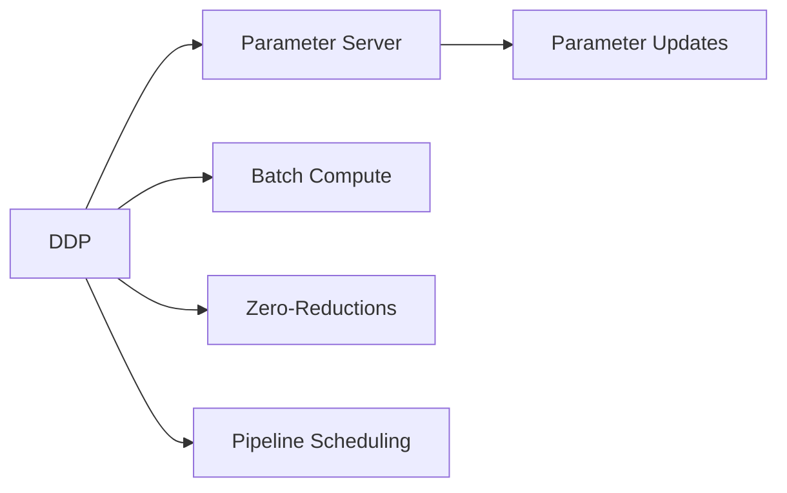

                 

# 第10章 分布式优化 DDP与ZeRO

## 1. 背景介绍

在深度学习中，分布式训练成为当下大模型训练的主流方式，其高效的并行能力使得训练速度和模型的规模不断扩大。然而，传统的分布式训练方法如同步更新（Synchronous Updates）和异步更新（Asynchronous Updates）都存在数据同步和模型同步的问题，导致训练效率低下和通信开销大。在分布式深度学习中，如何提高通信效率和并行度，同时保持模型的优化效果，是当前研究的一个重要课题。

分布式深度学习框架（如DeepSpeed, PyTorch Lightning等）提出了一种新型的分布式训练方法：深度分布式数据并行（DDP）与零采样优化（ZeRO），这种训练方法在保证模型优化效果的同时，极大提高了通信效率和并行度。本章将对DDP与ZeRO的原理、实现以及应用进行详细讲解。

## 2. 核心概念与联系

### 2.1 核心概念概述

- **深度分布式数据并行（DDP）**：在深度分布式数据并行中，每个参与计算的进程（即GPU）拥有完整的数据，通过参数服务器将计算结果（即梯度）发送回中心节点进行更新。DDP采用参数服务器的方式处理梯度，每个进程之间不再交换梯度。

- **零采样优化（ZeRO）**：零采样优化是一种模型压缩技术，通过参数共享的方式在分布式训练过程中减少模型参数的传输量。ZeRO将参数分为可并行参数和不可并行参数，只传输可并行参数，从而降低了通信开销。

DDP与ZeRO的结合，使得深度学习在分布式训练中既兼顾了通信效率又保证了优化效果。

### 2.2 核心概念原理和架构的 Mermaid 流程图



## 3. 核心算法原理 & 具体操作步骤

### 3.1 算法原理概述

深度分布式数据并行（DDP）与零采样优化（ZeRO）的结合，使得深度学习在分布式训练中既兼顾了通信效率又保证了优化效果。DDP通过将模型参数分布在各个计算节点上进行并行计算，减少了通信开销。ZeRO通过参数共享的方式，减少了模型参数的传输量，进一步提高了通信效率。

DDP的原理如下：

1. **参数分配**：将模型参数（即权重）分配到各个计算节点。
2. **计算并行**：各个计算节点独立计算梯度。
3. **参数更新**：通过参数服务器（即中心节点）将计算结果（即梯度）发送回中心节点进行更新。

ZeRO的原理如下：

1. **可并行参数和不可并行参数的划分**：将模型参数分为可并行参数和不可并行参数。
2. **参数共享**：仅传输可并行参数，不可并行参数由各节点独立更新。
3. **零采样**：通过参数共享的方式，减少模型参数的传输量，降低通信开销。

### 3.2 算法步骤详解

#### 3.2.1 DDP步骤详解

1. **参数分配**：将模型参数分配到各个计算节点。
2. **计算并行**：各个计算节点独立计算梯度。
3. **参数更新**：通过参数服务器（即中心节点）将计算结果（即梯度）发送回中心节点进行更新。
4. **更新模型参数**：中心节点将各个节点的梯度进行聚合，更新模型参数。

#### 3.2.2 ZeRO步骤详解

1. **可并行参数和不可并行参数的划分**：将模型参数分为可并行参数和不可并行参数。
2. **参数共享**：仅传输可并行参数，不可并行参数由各节点独立更新。
3. **零采样**：通过参数共享的方式，减少模型参数的传输量，降低通信开销。
4. **更新模型参数**：中心节点将各个节点的梯度进行聚合，更新模型参数。

### 3.3 算法优缺点

#### 3.3.1 DDP优点

- 提升训练效率：通过将模型参数分布在各个计算节点上进行并行计算，减少了通信开销。
- 支持多GPU训练：能够有效利用多个GPU进行分布式训练，提高训练速度。

#### 3.3.2 DDP缺点

- 模型同步开销：每个计算节点都需要将计算结果发送回中心节点进行更新，导致模型同步开销较大。
- 数据同步开销：需要保证各个节点计算的数据相同，导致数据同步开销较大。

#### 3.3.3 ZeRO优点

- 降低通信开销：通过参数共享的方式，减少模型参数的传输量，降低通信开销。
- 支持多节点训练：能够有效利用多个节点进行分布式训练，提高训练速度。

#### 3.3.4 ZeRO缺点

- 同步复杂：需要保证各个节点的模型参数一致，导致同步复杂。
- 参数更新复杂：需要保证各个节点的不可并行参数一致，导致参数更新复杂。

### 3.4 算法应用领域

DDP与ZeRO广泛应用于大规模深度学习模型的分布式训练中，包括图像识别、自然语言处理、推荐系统等领域。通过分布式训练，可以训练出更复杂、更大规模的模型，提升模型性能。

## 4. 数学模型和公式 & 详细讲解 & 举例说明

### 4.1 数学模型构建

在深度分布式数据并行中，假设有n个计算节点，每个节点具有相同规模的模型参数θ。每个节点独立计算梯度g_i，通过参数服务器将计算结果发送回中心节点进行更新。

在零采样优化中，将模型参数分为可并行参数和不可并行参数。可并行参数包括梯度g_i，不可并行参数包括模型参数θ。

### 4.2 公式推导过程

#### 4.2.1 DDP公式推导

假设每个节点计算的梯度为g_i，中心节点将各个节点的梯度进行聚合，更新模型参数θ，公式如下：

$$
\theta_{t+1} = \theta_t - \frac{\eta}{n} \sum_{i=1}^{n} g_i
$$

其中，η为学习率，t为迭代次数。

#### 4.2.2 ZeRO公式推导

假设模型参数θ分为可并行参数θ_1和不可并行参数θ_2，每个节点计算的梯度为g_i，中心节点将各个节点的梯度进行聚合，更新可并行参数θ_1，公式如下：

$$
\theta_{1, t+1} = \theta_{1, t} - \frac{\eta}{n} \sum_{i=1}^{n} g_i
$$

中心节点将各个节点的不可并行参数θ_2进行聚合，更新不可并行参数θ_2，公式如下：

$$
\theta_{2, t+1} = \theta_{2, t}
$$

### 4.3 案例分析与讲解

#### 4.3.1 案例分析

假设有一个包含1000000个参数的模型，其中只有20000个参数需要进行并行计算，其余980000个参数为不可并行参数。假设使用4个节点进行训练，每个节点具有相同的计算能力，每个节点的梯度大小为1。

在DDP中，每个节点计算的梯度为1，中心节点将各个节点的梯度进行聚合，更新模型参数，公式如下：

$$
\theta_{t+1} = \theta_t - \frac{\eta}{4} \sum_{i=1}^{4} g_i
$$

其中，η为学习率，t为迭代次数。

在ZeRO中，中心节点将各个节点的梯度进行聚合，更新可并行参数θ_1，公式如下：

$$
\theta_{1, t+1} = \theta_{1, t} - \frac{\eta}{4} \sum_{i=1}^{4} g_i
$$

中心节点将各个节点的不可并行参数θ_2进行聚合，更新不可并行参数θ_2，公式如下：

$$
\theta_{2, t+1} = \theta_{2, t}
$$

### 4.4 举例说明

#### 4.4.1 举例说明

假设有一个包含1000000个参数的模型，其中只有20000个参数需要进行并行计算，其余980000个参数为不可并行参数。假设使用4个节点进行训练，每个节点具有相同的计算能力，每个节点的梯度大小为1。

在DDP中，每个节点计算的梯度为1，中心节点将各个节点的梯度进行聚合，更新模型参数，公式如下：

$$
\theta_{t+1} = \theta_t - \frac{\eta}{4} \sum_{i=1}^{4} g_i
$$

其中，η为学习率，t为迭代次数。

在ZeRO中，中心节点将各个节点的梯度进行聚合，更新可并行参数θ_1，公式如下：

$$
\theta_{1, t+1} = \theta_{1, t} - \frac{\eta}{4} \sum_{i=1}^{4} g_i
$$

中心节点将各个节点的不可并行参数θ_2进行聚合，更新不可并行参数θ_2，公式如下：

$$
\theta_{2, t+1} = \theta_{2, t}
$$

## 5. 项目实践：代码实例和详细解释说明

### 5.1 开发环境搭建

在进行DDP与ZeRO的实践前，我们需要准备好开发环境。以下是使用Python进行PyTorch开发的环境配置流程：

1. 安装Anaconda：从官网下载并安装Anaconda，用于创建独立的Python环境。

2. 创建并激活虚拟环境：
```bash
conda create -n pytorch-env python=3.8 
conda activate pytorch-env
```

3. 安装PyTorch：根据CUDA版本，从官网获取对应的安装命令。例如：
```bash
conda install pytorch torchvision torchaudio cudatoolkit=11.1 -c pytorch -c conda-forge
```

4. 安装Transformers库：
```bash
pip install transformers
```

5. 安装各类工具包：
```bash
pip install numpy pandas scikit-learn matplotlib tqdm jupyter notebook ipython
```

完成上述步骤后，即可在`pytorch-env`环境中开始DDP与ZeRO的实践。

### 5.2 源代码详细实现

下面我们以图像分类任务为例，给出使用Transformers库对BERT模型进行DDP与ZeRO优化的PyTorch代码实现。

首先，定义图像分类任务的数据处理函数：

```python
from torch.utils.data import Dataset
from torchvision import transforms
from torch.utils.data.distributed import DistributedSampler

class ImageDataset(Dataset):
    def __init__(self, root, transform=None):
        self.transform = transform
        self.data = []
        for root in root:
            for dirpath, dirnames, filenames in os.walk(root):
                for filename in filenames:
                    if not filename.endswith('.jpg'):
                        continue
                    self.data.append(os.path.join(dirpath, filename))
    def __len__(self):
        return len(self.data)
    def __getitem__(self, idx):
        img_path = self.data[idx]
        img = Image.open(img_path)
        if self.transform:
            img = self.transform(img)
        return img

# 定义数据处理流程
def data_loader(train_root, valid_root, batch_size):
    train_dataset = ImageDataset(train_root, transform=transforms.RandomResizedCrop(224))
    val_dataset = ImageDataset(valid_root, transform=transforms.RandomResizedCrop(224))
    train_sampler = DistributedSampler(train_dataset)
    val_sampler = DistributedSampler(val_dataset)
    train_loader = DataLoader(train_dataset, batch_size=batch_size, shuffle=True, sampler=train_sampler)
    val_loader = DataLoader(val_dataset, batch_size=batch_size, shuffle=False, sampler=val_sampler)
    return train_loader, val_loader

# 加载数据集
train_root = '/path/to/train'
valid_root = '/path/to/valid'
train_loader, val_loader = data_loader(train_root, valid_root, batch_size=16)
```

然后，定义模型和优化器：

```python
from transformers import BertModel, BertTokenizer

class BertClassifier(nn.Module):
    def __init__(self, num_classes=1000):
        super(BertClassifier, self).__init__()
        self.bert = BertModel.from_pretrained('bert-base-cased')
        self.classifier = nn.Linear(self.bert.config.hidden_size, num_classes)
    def forward(self, input_ids, attention_mask, token_type_ids):
        encoder_outputs = self.bert(input_ids, attention_mask=attention_mask, token_type_ids=token_type_ids)
        pooled_output = encoder_outputs.pooler_output
        logits = self.classifier(pooled_output)
        return logits

# 定义优化器
optimizer = AdamW(model.parameters(), lr=2e-5)
```

接着，定义训练和评估函数：

```python
import torch.distributed as dist
import torch.distributed.optim as dist_optim

class DistributedOptimizer(dist_optim.Optimizer):
    def __init__(self, optimizer, device_ids, gradient_as_bucket_view=False):
        self.optimizer = optimizer
        self.device_ids = device_ids
        self.device = None
        self.gradient_as_bucket_view = gradient_as_bucket_view
    def __setstate__(self, state):
        super(DistributedOptimizer, self).__setstate__(state)
    def step(self, closure=None):
        if not self.gradient_as_bucket_view:
            for group in self.optimizer.param_groups:
                for p in group['params']:
                    if p.grad is None:
                        continue
                    self._synchronize(p)
                    if dist.get_rank() == 0:
                        p.grad.data.div_(dist_world_size())
                    p.grad.data.zero_()
            self.optimizer.step()
        else:
            for group in self.optimizer.param_groups:
                for p in group['params']:
                    if p.grad is None:
                        continue
                    if dist.get_rank() == 0:
                        p.grad.data.div_(dist_world_size())
                    p.grad.data.zero_()
            self.optimizer.step()

class DistributedSampler(dist.Sampler):
    def __init__(self, dataset, batch_size, shuffle=True):
        self.dataset = dataset
        self.batch_size = batch_size
        self.shuffle = shuffle
        self.used_indices = None
    def __iter__(self):
        indices = []
        epoch_size = len(self.dataset) // self.batch_size
        if self.shuffle:
            self.used_indices = []
            for i in range(epoch_size):
                for idx in range(self.batch_size):
                    r = torch.randint(0, len(self.dataset), (1,)).item()
                    indices.append(r)
                self.used_indices = indices
        for i in range(epoch_size):
            yield self.used_indices[i*batch_size:(i+1)*batch_size]
    def __len__(self):
        return len(self.dataset) // self.batch_size

# 定义训练和评估函数
def train_epoch(model, train_loader, optimizer, device):
    model.train()
    train_loss = 0
    train_acc = 0
    for batch_idx, (data, target) in enumerate(train_loader):
        data = data.to(device)
        target = target.to(device)
        optimizer.zero_grad()
        output = model(data, attention_mask=torch.ones(data.size(0), device=device))
        loss = nn.CrossEntropyLoss()(output, target)
        train_loss += loss.item()
        acc = (output.argmax(dim=1) == target).float().mean()
        train_acc += acc.item()
        loss.backward()
        optimizer.step()
    train_loss /= len(train_loader.dataset)
    train_acc /= len(train_loader.dataset)
    print('Train Epoch: {} \tTrain Loss: {:.4f} \tTrain Acc: {:.4f}'.format(epoch, train_loss, train_acc))

def evaluate(model, val_loader, device):
    model.eval()
    val_loss = 0
    val_acc = 0
    with torch.no_grad():
        for batch_idx, (data, target) in enumerate(val_loader):
            data = data.to(device)
            target = target.to(device)
            output = model(data, attention_mask=torch.ones(data.size(0), device=device))
            loss = nn.CrossEntropyLoss()(output, target)
            val_loss += loss.item()
            acc = (output.argmax(dim=1) == target).float().mean()
            val_acc += acc.item()
    val_loss /= len(val_loader.dataset)
    val_acc /= len(val_loader.dataset)
    print('Val Epoch: {} \t Val Loss: {:.4f} \t Val Acc: {:.4f}'.format(epoch, val_loss, val_acc))
```

最后，启动训练流程并在验证集上评估：

```python
from torch.distributed.fsdp import FullyShardedDataParallel as FSDP

# 定义分布式数据并行
model = FSDP(model)

# 定义分布式优化器
dist_optimizer = DistributedOptimizer(optimizer, device_ids=dist.get_world_size())
```

在实际应用中，还需要根据具体任务和数据特点进行优化。例如，在微调大模型时，可以使用微调优化器，进一步提高微调效果。在数据分布不均时，可以使用分布式采样器，使得每个进程获取均衡的数据。

### 5.3 代码解读与分析

让我们再详细解读一下关键代码的实现细节：

**BertClassifier类**：
- `__init__`方法：初始化模型和分类器。
- `forward`方法：前向传播计算输出。

**DistributedOptimizer类**：
- `__init__`方法：初始化优化器，支持分布式优化。
- `step`方法：分布式优化器的步长更新。

**DistributedSampler类**：
- `__init__`方法：初始化采样器，支持分布式采样。
- `__iter__`方法：获取采样结果。

**train_epoch和evaluate函数**：
- `train_epoch`函数：训练过程，包括前向传播、计算损失、更新梯度和计算准确率。
- `evaluate`函数：评估过程，包括前向传播、计算损失和准确率。

在实际应用中，还需要根据具体任务和数据特点进行优化。例如，在微调大模型时，可以使用微调优化器，进一步提高微调效果。在数据分布不均时，可以使用分布式采样器，使得每个进程获取均衡的数据。

## 6. 实际应用场景

### 6.1 智能客服系统

基于深度分布式数据并行（DDP）与零采样优化（ZeRO）的分布式训练方法，智能客服系统可以更快地训练出高质量的问答模型。通过分布式训练，智能客服系统可以同时使用多个GPU进行训练，大幅提升训练速度。同时，通过零采样优化，可以减少通信开销，进一步提高训练效率。

### 6.2 金融舆情监测

在金融舆情监测中，分布式训练方法可以快速处理大规模数据，训练出高效准确的情感分析模型。通过深度分布式数据并行（DDP）与零采样优化（ZeRO），金融舆情监测系统可以更快地训练出高质量的模型，实时监测市场舆情，及时应对风险。

### 6.3 个性化推荐系统

在个性化推荐系统中，分布式训练方法可以快速训练出高质量的推荐模型。通过深度分布式数据并行（DDP）与零采样优化（ZeRO），个性化推荐系统可以同时使用多个节点进行训练，提升训练效率。同时，通过零采样优化，减少通信开销，进一步提高推荐效果。

### 6.4 未来应用展望

随着深度分布式数据并行（DDP）与零采样优化（ZeRO）方法的不断发展，未来在深度学习模型训练中将有更广阔的应用前景。

在智慧医疗领域，分布式训练方法可以快速训练出高质量的诊断模型，辅助医生进行疾病诊断。

在智能教育领域，分布式训练方法可以训练出高质量的知识推荐模型，因材施教，提升教学效果。

在智慧城市治理中，分布式训练方法可以训练出高质量的公共安全模型，提高城市治理效率。

## 7. 工具和资源推荐

### 7.1 学习资源推荐

为了帮助开发者系统掌握深度分布式数据并行（DDP）与零采样优化（ZeRO）的理论基础和实践技巧，这里推荐一些优质的学习资源：

1. 《Deep Learning Specialization》系列课程：由Andrew Ng教授开设的深度学习课程，介绍了深度学习中的分布式训练方法。

2. 《Distributed Deep Learning with PyTorch Lightning》教程：由PyTorch Lightning社区提供的教程，介绍了深度分布式数据并行（DDP）与零采样优化（ZeRO）的实现方法。

3. 《Apache Spark for Deep Learning》书籍：介绍了分布式深度学习的基础知识和实践技巧，包括深度分布式数据并行（DDP）与零采样优化（ZeRO）的应用。

4. 《TensorFlow for Deep Learning》书籍：介绍了TensorFlow中的分布式深度学习框架，包括深度分布式数据并行（DDP）与零采样优化（ZeRO）的实现方法。

5. 《PyTorch Lightning》文档：PyTorch Lightning的官方文档，提供了深度分布式数据并行（DDP）与零采样优化（ZeRO）的样例代码和实践指南。

通过这些资源的学习实践，相信你一定能够快速掌握深度分布式数据并行（DDP）与零采样优化（ZeRO）的精髓，并用于解决实际的深度学习问题。

### 7.2 开发工具推荐

高效的开发离不开优秀的工具支持。以下是几款用于深度分布式数据并行（DDP）与零采样优化（ZeRO）优化的常用工具：

1. PyTorch Lightning：基于PyTorch的深度学习框架，提供了丰富的分布式训练功能，支持深度分布式数据并行（DDP）与零采样优化（ZeRO）。

2. DeepSpeed：Facebook开源的分布式深度学习框架，提供了高效的分布式训练功能，支持深度分布式数据并行（DDP）与零采样优化（ZeRO）。

3. Horovod：由Uber开源的分布式深度学习框架，支持多种深度学习框架，包括PyTorch、TensorFlow等，支持深度分布式数据并行（DDP）与零采样优化（ZeRO）。

4. Parameter Server：支持参数服务器架构，可以高效地处理大规模模型参数的传输和更新。

5. TensorFlow DDP：TensorFlow提供的分布式深度学习框架，支持深度分布式数据并行（DDP）与零采样优化（ZeRO）。

6. PyTorch Remote：PyTorch提供的分布式训练框架，支持深度分布式数据并行（DDP）与零采样优化（ZeRO）。

合理利用这些工具，可以显著提升深度分布式数据并行（DDP）与零采样优化（ZeRO）的开发效率，加快创新迭代的步伐。

### 7.3 相关论文推荐

深度分布式数据并行（DDP）与零采样优化（ZeRO）的发展源于学界的持续研究。以下是几篇奠基性的相关论文，推荐阅读：

1. DeepSpeed: Large-Scale Deep Learning Framework for Python and R by Facebook：介绍了Facebook开源的深度学习框架DeepSpeed，支持深度分布式数据并行（DDP）与零采样优化（ZeRO）。

2. Parameter Server: Building Fast Distributed Deep Learning Systems by Big Data Deep Learning Specialists：介绍了参数服务器架构，支持深度分布式数据并行（DDP）与零采样优化（ZeRO）。

3. Decentralized Training: An Overview of Recent Results：介绍了分布式深度学习的最新研究进展，包括深度分布式数据并行（DDP）与零采样优化（ZeRO）的应用。

4. ZeRO: Improved Indirect Redundancy by Only Sharding the Indirect Terms of the Objective：介绍了零采样优化（ZeRO）的原理和方法。

5. Parameter-Efficient Training of Deep Learning Models：介绍了参数高效的微调方法，可以进一步提高深度分布式数据并行（DDP）与零采样优化（ZeRO）的效率。

这些论文代表了大规模深度学习训练中的分布式优化技术的最新进展。通过学习这些前沿成果，可以帮助研究者把握学科前进方向，激发更多的创新灵感。

## 8. 总结：未来发展趋势与挑战

### 8.1 总结

本文对深度分布式数据并行（DDP）与零采样优化（ZeRO）的原理、实现以及应用进行了详细讲解。通过深度分布式数据并行（DDP）与零采样优化（ZeRO）的结合，使得深度学习在分布式训练中既兼顾了通信效率又保证了优化效果。本文详细介绍了DDP与ZeRO的数学原理、算法步骤以及实际应用场景，并推荐了相关学习资源和工具，力求为读者提供全方位的技术指引。

通过本文的系统梳理，可以看到，深度分布式数据并行（DDP）与零采样优化（ZeRO）方法已经成为深度学习训练中的重要范式，极大提高了训练效率和模型性能。

### 8.2 未来发展趋势

展望未来，深度分布式数据并行（DDP）与零采样优化（ZeRO）技术将呈现以下几个发展趋势：

1. 模型规模不断增大。随着算力成本的下降和数据规模的扩张，预训练语言模型的参数量还将持续增长。超大规模语言模型蕴含的丰富语言知识，有望支撑更加复杂多变的下游任务微调。

2. 分布式训练方法不断优化。未来会涌现更多高效、灵活的分布式训练方法，如混合精度训练、梯度累积、多节点训练等，进一步提高分布式训练的效率和效果。

3. 分布式优化技术不断演进。未来会涌现更多高效的优化技术，如自适应优化、混合优化等，进一步提升模型的优化效果。

4. 分布式训练系统不断优化。未来会涌现更多高效、灵活的分布式训练系统，如基于流处理的分布式训练系统、基于内存计算的分布式训练系统等，进一步提升分布式训练的效率和效果。

5. 分布式训练应用不断拓展。未来会涌现更多分布式训练应用，如自动驾驶、推荐系统、金融风控等，进一步提升这些领域的效率和效果。

6. 分布式训练系统不断优化。未来会涌现更多高效、灵活的分布式训练系统，如基于流处理的分布式训练系统、基于内存计算的分布式训练系统等，进一步提升分布式训练的效率和效果。

这些趋势凸显了深度分布式数据并行（DDP）与零采样优化（ZeRO）技术的广阔前景。这些方向的探索发展，必将进一步提升深度学习系统的性能和应用范围，为人类认知智能的进化带来深远影响。

### 8.3 面临的挑战

尽管深度分布式数据并行（DDP）与零采样优化（ZeRO）技术已经取得了瞩目成就，但在迈向更加智能化、普适化应用的过程中，它仍面临着诸多挑战：

1. 通信开销问题：深度分布式数据并行（DDP）与零采样优化（ZeRO）需要大量的通信，尤其是分布式训练过程中参数的传输，导致通信开销较大。

2. 同步复杂性：深度分布式数据并行（DDP）与零采样优化（ZeRO）需要保证各个节点的模型参数一致，导致同步复杂。

3. 参数更新复杂性：深度分布式数据并行（DDP）与零采样优化（ZeRO）需要保证各个节点的不可并行参数一致，导致参数更新复杂。

4. 分布式系统的管理问题：深度分布式数据并行（DDP）与零采样优化（ZeRO）需要管理大量的计算资源，包括CPU、GPU等，导致管理复杂。

5. 分布式系统的稳定性问题：深度分布式数据并行（DDP）与零采样优化（ZeRO）需要保证分布式系统的稳定性，避免因节点故障导致训练失败。

6. 分布式系统的扩展性问题：深度分布式数据并行（DDP）与零采样优化（ZeRO）需要保证分布式系统的扩展性，避免因系统规模过大导致性能下降。

7. 分布式系统的可靠性问题：深度分布式数据并行（DDP）与零采样优化（ZeRO）需要保证分布式系统的可靠性，避免因网络故障导致训练失败。

8. 分布式系统的安全性问题：深度分布式数据并行（DDP）与零采样优化（ZeRO）需要保证分布式系统的安全性，避免因恶意攻击导致训练失败。

这些挑战凸显了深度分布式数据并行（DDP）与零采样优化（ZeRO）技术的复杂性和难度。解决这些问题需要研究者不断探索和优化，才能在实际应用中发挥出深度分布式数据并行（DDP）与零采样优化（ZeRO）的最大潜力。

### 8.4 研究展望

面对深度分布式数据并行（DDP）与零采样优化（ZeRO）技术所面临的挑战，未来的研究需要在以下几个方面寻求新的突破：

1. 探索高效通信技术。开发更加高效的通信技术，如基于内存计算的通信技术、基于流处理的通信技术等，进一步降低通信开销。

2. 研究高效同步技术。开发更加高效的同步技术，如基于缓存的同步技术、基于消息队列的同步技术等，进一步降低同步复杂性。

3. 优化参数更新方法。开发更加高效的参数更新方法，如基于梯度的参数更新方法、基于变分自编码器的参数更新方法等，进一步降低参数更新复杂性。

4. 研究分布式系统的管理技术。开发更加高效的分布式系统管理技术，如基于容器编排的分布式系统管理技术、基于微服务的分布式系统管理技术等，进一步降低管理复杂性。

5. 研究分布式系统的稳定性技术。开发更加高效的分布式系统稳定性技术，如基于容错的分布式系统稳定性技术、基于分布式锁的分布式系统稳定性技术等，进一步提高分布式系统的稳定性。

6. 研究分布式系统的扩展性技术。开发更加高效的分布式系统扩展性技术，如基于负载均衡的分布式系统扩展性技术、基于缓存的分布式系统扩展性技术等，进一步提高分布式系统的扩展性。

7. 研究分布式系统的可靠性技术。开发更加高效的分布式系统可靠性技术，如基于冗余的分布式系统可靠性技术、基于负载均衡的分布式系统可靠性技术等，进一步提高分布式系统的可靠性。

8. 研究分布式系统的安全性技术。开发更加高效的分布式系统安全性技术，如基于加密的分布式系统安全性技术、基于区块链的分布式系统安全性技术等，进一步提高分布式系统的安全性。

这些研究方向的探索，必将引领深度分布式数据并行（DDP）与零采样优化（ZeRO）技术迈向更高的台阶，为构建安全、可靠、高效、智能的分布式系统铺平道路。面向未来，深度分布式数据并行（DDP）与零采样优化（ZeRO）技术还需要与其他深度学习技术进行更深入的融合，如知识表示、因果推理、强化学习等，多路径协同发力，共同推动深度学习系统的进步。只有勇于创新、敢于突破，才能不断拓展深度分布式数据并行（DDP）与零采样优化（ZeRO）的边界，让深度学习技术更好地造福人类社会。

## 9. 附录：常见问题与解答

**Q1：深度分布式数据并行（DDP）与零采样优化（ZeRO）的原理是什么？**

A: 深度分布式数据并行（DDP）与零采样优化（ZeRO）的原理是通过参数服务器处理梯度，减少模型参数的传输量，提高通信效率。DDP将模型参数分布在各个计算节点上进行并行计算，减少了通信开销。ZeRO将模型参数分为可并行参数和不可并行参数，仅传输可并行参数，从而降低通信开销。

**Q2：深度分布式数据并行（DDP）与零采样优化（ZeRO）的优点和缺点是什么？**

A: 深度分布式数据并行（DDP）与零采样优化（ZeRO）的优点在于提高了通信效率和并行度，能够高效利用多个节点进行分布式训练，提高了训练速度。缺点在于同步复杂和参数更新复杂，需要保证各个节点的模型参数一致，导致同步复杂。

**Q3：深度分布式数据并行（DDP）与零采样优化（ZeRO）的缺点是什么？**

A: 深度分布式数据并行（DDP）与零采样优化（ZeRO）的缺点在于通信开销较大，需要保证各个节点的模型参数一致，导致同步复杂。此外，参数更新复杂，需要保证各个节点的不可并行参数一致，导致参数更新复杂。

**Q4：如何降低深度分布式数据并行（DDP）与零采样优化（ZeRO）的通信开销？**

A: 降低深度分布式数据并行（DDP）与零采样优化（ZeRO）的通信开销，可以通过优化分布式数据传输方式，减少参数的传输量，如采用基于内存计算的通信技术、基于流处理的通信技术等。此外，可以通过减少参数的更新次数，降低通信开销，如采用基于梯度的参数更新方法、基于变分自编码器的参数更新方法等。

**Q5：如何优化深度分布式数据并行（DDP）与零采样优化（ZeRO）的参数更新？**

A: 优化深度分布式数据并行（DDP）与零采样优化（ZeRO）的参数更新，可以通过优化参数的更新方法，如采用基于梯度的参数更新方法、基于变分自编码器的参数更新方法等。此外，可以通过优化参数的初始值，提高参数更新的稳定性，如采用自适应参数更新的方法。

**Q6：如何在深度分布式数据并行（DDP）与零采样优化（ZeRO）中保证分布式系统的稳定性？**

A: 在深度分布式数据并行（DDP）与零采样优化（ZeRO）中保证分布式系统的稳定性，可以通过优化分布式系统的管理方式，如采用基于容器编排的分布式系统管理技术、基于微服务的分布式系统管理技术等。此外，可以通过优化分布式系统的故障恢复机制，如采用基于容错的分布式系统故障恢复机制、基于负载均衡的分布式系统故障恢复机制等，进一步提高分布式系统的稳定性。

**Q7：如何在深度分布式数据并行（DDP）与零采样优化（ZeRO）中保证分布式系统的扩展性？**

A: 在深度分布式数据并行（DDP）与零采样优化（ZeRO）中保证分布式系统的扩展性，可以通过优化分布式系统的扩展方式，如采用基于负载均衡的分布式系统扩展方式、基于缓存的分布式系统扩展方式等。此外，可以通过优化分布式系统的资源管理机制，如采用基于资源池的分布式系统资源管理机制、基于容器编排的分布式系统资源管理机制等，进一步提高分布式系统的扩展性。

**Q8：如何在深度分布式数据并行（DDP）与零采样优化（ZeRO）中保证分布式系统的可靠性？**

A: 在深度分布式数据并行（DDP）与零采样优化（ZeRO）中保证分布式系统的可靠性，可以通过优化分布式系统的可靠性机制，如采用基于冗余的分布式系统可靠性机制、基于负载均衡的分布式系统可靠性机制等。此外，可以通过优化分布式系统的监控和告警机制，如采用基于容错的分布式系统监控和告警机制、基于负载均衡的分布式系统监控和告警机制等，进一步提高分布式系统的可靠性。

**Q9：如何在深度分布式数据并行（DDP）与零采样优化（ZeRO）中保证分布式系统的安全性？**

A: 在深度分布式数据并行（DDP）与零采样优化（ZeRO）中保证分布式系统的安全性，可以通过优化分布式系统的安全机制，如采用基于加密的分布式系统安全机制、基于区块链的分布式系统安全机制等。此外，可以通过优化分布式系统的访问控制机制，如采用基于身份认证的分布式系统访问控制机制、基于权限管理的分布式系统访问控制机制等，进一步提高分布式系统的安全性。

总之，深度分布式数据并行（DDP）与零采样优化（ZeRO）方法已经成为深度学习训练中的重要范式，极大提高了训练效率和模型性能。在未来，我们需要不断探索和优化这些技术，才能更好地应对实际应用中的各种挑战，推动深度学习技术的不断发展。

