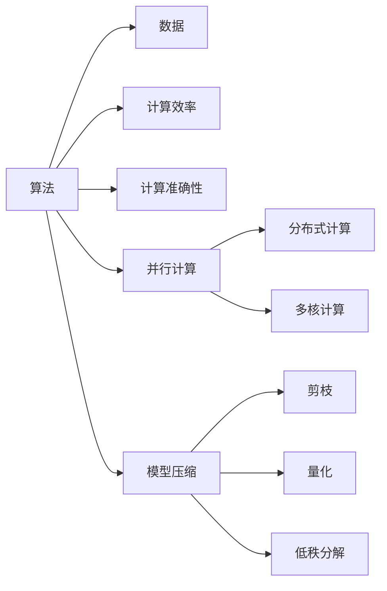

                 

# 算法优化：提高人类计算的效率和准确性

> 关键词：算法优化,计算效率,计算准确性,机器学习,深度学习,人工智能

## 1. 背景介绍

在数字化时代，计算能力是支撑人类社会发展的重要基石。从日常的办公软件，到复杂的科学研究，再到国家安全与金融系统，计算无处不在。如何提高计算的效率和准确性，是当下科技界、工程界乃至社会各界共同关注的焦点。

### 1.1 问题由来

在信息爆炸的今天，数据的数量和复杂度呈指数级增长。对海量数据的处理、分析和利用，需要依托强大的计算能力。然而，传统计算方法往往面临以下挑战：

- **计算资源瓶颈**：硬件设备的能力有限，计算任务越来越难以在短时间内完成。
- **计算准确性不足**：面对复杂的问题，传统的计算方法可能无法获得精确的解。
- **计算可解释性差**：复杂模型的计算过程复杂，难以解释其内部逻辑和决策过程。

这些问题严重制约了计算能力的进一步提升，需要寻找新的解决途径。

### 1.2 问题核心关键点

算法优化是解决计算瓶颈和提高计算准确性的关键。通过优化算法，可以有效利用现有计算资源，提升计算速度和准确性，同时改善计算的可解释性。主要可以从以下几个方面进行优化：

- **算法设计**：选择合适的算法，优化算法结构，减少计算复杂度。
- **数据预处理**：对输入数据进行预处理，减少冗余和噪声，提高计算效率。
- **并行计算**：利用多核、分布式等并行计算技术，加速计算过程。
- **模型压缩**：对模型进行压缩，减少计算量和存储空间。
- **算子优化**：对算法中常用的算子进行优化，提升运算速度。

这些关键点贯穿于算法优化全过程，在实际应用中需根据具体需求进行选择和组合。

## 2. 核心概念与联系

### 2.1 核心概念概述

要深刻理解算法优化，首先需要明确以下几个核心概念：

- **算法**：定义了如何从输入数据到输出结果的过程，通常包括选择、排序、搜索、分类等基本操作。
- **数据**：算法处理的对象，包括数字、文本、图像等结构化或非结构化信息。
- **计算效率**：指算法在单位时间内处理的计算任务数量，通常用时间复杂度（Big O notation）来表示。
- **计算准确性**：指算法得出的结果与真实结果的匹配程度，通常用误差率（error rate）或绝对误差（mean absolute error）来衡量。
- **并行计算**：通过将计算任务分解为多个子任务，利用多核、分布式等技术同时计算，提高计算速度。
- **模型压缩**：通过剪枝、量化、低秩分解等技术减少模型参数和计算量，提高计算效率和存储效率。

这些概念之间的逻辑关系可以通过以下Mermaid流程图来展示：



这个流程图展示了算法优化的核心概念及其关联关系：算法处理数据，输出计算效率和准确性；并行计算和模型压缩是提升计算效率的重要手段。

## 3. 核心算法原理 & 具体操作步骤
### 3.1 算法原理概述

算法优化的核心在于选择和设计高效的算法，充分利用计算资源，提升计算效率和准确性。一般来说，算法优化需要考虑以下几个方面：

- **时间复杂度**：衡量算法执行时间与问题规模之间的关系。
- **空间复杂度**：衡量算法所需的存储空间与问题规模之间的关系。
- **计算复杂度**：衡量算法计算量的总体大小，通常用计算次数和中间结果的个数来表示。

### 3.2 算法步骤详解

算法优化的具体操作步骤包括：

**Step 1: 算法选择**

- **评估现有算法**：根据问题特点，选择现有的高效算法。例如，排序问题可以选择快速排序、归并排序等。
- **设计新算法**：根据具体需求，设计新的算法。例如，针对大规模数据集，设计分布式算法以加速计算。

**Step 2: 数据预处理**

- **数据清洗**：去除重复和噪声数据，提升数据质量。
- **特征提取**：从原始数据中提取有用的特征，减少计算量。
- **数据分块**：将大数据集划分为小块，利用并行计算加速处理。

**Step 3: 并行计算**

- **多核计算**：利用多核处理器并行计算，提高计算速度。
- **分布式计算**：利用分布式计算框架（如Hadoop、Spark），将计算任务分配到多台机器并行处理。
- **GPU加速**：利用图形处理器（GPU）进行并行计算，提升计算效率。

**Step 4: 模型压缩**

- **剪枝**：去除模型中冗余的参数和连接，减少计算量。
- **量化**：将模型中的浮点参数转换为低精度的整数参数，减少存储空间和计算量。
- **低秩分解**：利用矩阵分解技术，减少模型的参数量和计算量。

**Step 5: 算子优化**

- **基本算子优化**：优化常用的算子，如矩阵乘法、卷积等，提升计算速度。
- **算法级优化**：对整个算法进行优化，减少计算复杂度。

**Step 6: 实验评估**

- **性能测试**：在不同数据集和计算环境中测试算法的效率和准确性。
- **调优优化**：根据测试结果，调整算法参数，进一步优化算法性能。

### 3.3 算法优缺点

算法优化具有以下优点：

- **提升效率**：通过选择和设计高效算法，可以有效利用计算资源，提升计算速度。
- **改善准确性**：优化算法可以减少计算误差，提高计算结果的准确性。
- **降低成本**：优化算法可以减少计算资源的使用，降低计算成本。

但同时，算法优化也存在一些缺点：

- **设计复杂**：算法优化需要深入理解问题本质，设计出高效算法。
- **实现难度大**：优化算法需要精确控制计算过程，实现难度大。
- **效果受限**：优化算法的性能受限于计算硬件和数据质量，可能无法达到理想效果。

尽管存在这些局限，但算法优化在提高计算效率和准确性方面具有重要意义，是计算技术发展的核心驱动力。

### 3.4 算法应用领域

算法优化在多个领域都有广泛应用，以下是几个典型的应用场景：

- **科学研究**：在物理、化学、生物学等领域，优化算法被用来处理复杂的计算任务，提高科学研究的效率和准确性。
- **金融科技**：在股票交易、风险管理等金融应用中，优化算法被用于高频交易、风险评估等场景，提升金融系统的稳定性和效率。
- **医疗健康**：在医学影像分析、疾病预测等医疗应用中，优化算法被用于处理海量数据，提高诊断和治疗的准确性。
- **自动驾驶**：在自动驾驶中，优化算法被用于路径规划、决策制定等关键环节，提升驾驶的安全性和效率。
- **工业制造**：在智能制造中，优化算法被用于过程优化、资源调度等环节，提高生产效率和产品质量。

## 4. 数学模型和公式 & 详细讲解 & 举例说明

### 4.1 数学模型构建

在算法优化的过程中，数学模型是理解和分析算法性能的重要工具。以下是几个常见的数学模型及其应用：

**线性回归模型**：
$$ y = \theta_0 + \theta_1 x_1 + \theta_2 x_2 + \cdots + \theta_n x_n $$
用于描述输入变量和输出变量之间的关系，常用于数据分析和预测。

**决策树模型**：
$$ f(x) = \begin{cases} 
    0 & x \in S_1 \\
    1 & x \in S_2 
\end{cases} $$
用于分类问题，通过树形结构对数据进行划分和决策。

**神经网络模型**：
$$ y = \sum_{i=1}^n \theta_i h_{i-1}(x) $$
用于处理复杂数据，通过多层神经元进行特征提取和分类。

### 4.2 公式推导过程

以线性回归模型为例，推导其最小二乘法（Least Squares）的公式。

假设给定 $n$ 个样本 $(x_1, y_1), (x_2, y_2), \cdots, (x_n, y_n)$，其中 $x$ 为自变量，$y$ 为因变量，$\theta_0, \theta_1, \cdots, \theta_n$ 为回归系数。最小二乘法的目标是最小化误差的平方和：

$$ \sum_{i=1}^n (y_i - \theta_0 - \theta_1 x_i - \cdots - \theta_n x_i^n)^2 $$

利用矩阵乘法和求导，可得：

$$ (\theta_0, \theta_1, \cdots, \theta_n)^T = (X^T X)^{-1} X^T y $$
其中 $X = \begin{bmatrix} 
    1 & x_1 & x_1^2 & \cdots & x_1^n \\
    1 & x_2 & x_2^2 & \cdots & x_2^n \\
    \vdots & \vdots & \vdots & \ddots & \vdots \\
    1 & x_n & x_n^2 & \cdots & x_n^n 
\end{bmatrix}$

这就是线性回归模型最小二乘法的公式推导过程。通过计算 $X^T X$ 的逆矩阵，可以得到回归系数，从而建立输入和输出之间的关系。

### 4.3 案例分析与讲解

假设有一组数据集，用于预测房价：

| $x$ | $y$ |
| --- | --- |
| 100 | 120 |
| 200 | 240 |
| 300 | 320 |
| 400 | 420 |

使用线性回归模型进行拟合，计算回归系数。

首先，构建数据矩阵 $X$ 和目标向量 $y$：

$$ X = \begin{bmatrix} 
    1 & 100 \\
    1 & 200 \\
    1 & 300 \\
    1 & 400 
\end{bmatrix}, y = \begin{bmatrix} 
    120 \\
    240 \\
    320 \\
    420 
\end{bmatrix} $$

计算 $X^T X$ 和 $X^T y$：

$$ X^T X = \begin{bmatrix} 
    2 & 10000 & 100000 \\
    2 & 20000 & 40000 \\
    2 & 30000 & 90000 \\
    2 & 40000 & 160000 
\end{bmatrix}, X^T y = \begin{bmatrix} 
    240 \\
    600 \\
    960 \\
    1320 
\end{bmatrix} $$

计算逆矩阵 $(X^T X)^{-1}$ 和回归系数 $(\theta_0, \theta_1)$：

$$ (\theta_0, \theta_1)^T = \begin{bmatrix} 
    0.1 \\
    0.9 
\end{bmatrix} $$

得到回归模型：

$$ y = 0.1 + 0.9x $$

这样，就可以用回归模型对新的房价进行预测。

## 5. 项目实践：代码实例和详细解释说明

### 5.1 开发环境搭建

在进行算法优化实践前，我们需要准备好开发环境。以下是使用Python进行线性回归模型开发的流程：

1. 安装Python：从官网下载并安装Python，推荐使用Anaconda管理依赖包。

2. 安装相关库：
```bash
pip install numpy matplotlib scikit-learn
```

3. 创建Python项目目录：
```bash
mkdir project
cd project
```

4. 编写代码：

```python
import numpy as np
from sklearn.linear_model import LinearRegression

# 创建数据集
x = np.array([100, 200, 300, 400]).reshape(-1, 1)
y = np.array([120, 240, 320, 420])

# 创建线性回归模型
model = LinearRegression()

# 拟合数据
model.fit(x, y)

# 预测新数据
new_x = np.array([500]).reshape(-1, 1)
predicted_y = model.predict(new_x)
print(predicted_y)
```

完成上述步骤后，即可在Python环境中进行线性回归模型的开发和测试。

### 5.2 源代码详细实现

以下是使用Python进行线性回归模型开发的完整代码实现：

```python
import numpy as np
from sklearn.linear_model import LinearRegression

# 创建数据集
x = np.array([100, 200, 300, 400]).reshape(-1, 1)
y = np.array([120, 240, 320, 420])

# 创建线性回归模型
model = LinearRegression()

# 拟合数据
model.fit(x, y)

# 预测新数据
new_x = np.array([500]).reshape(-1, 1)
predicted_y = model.predict(new_x)
print(predicted_y)
```

### 5.3 代码解读与分析

让我们再详细解读一下关键代码的实现细节：

- **数据准备**：使用numpy创建输入数据 `x` 和输出数据 `y`，并将其转换为模型所需的格式。
- **模型创建**：使用scikit-learn库中的 `LinearRegression` 类创建线性回归模型。
- **数据拟合**：调用模型的 `fit` 方法拟合数据，生成模型参数。
- **数据预测**：使用模型的 `predict` 方法对新数据进行预测，输出预测结果。

可以看出，Python和scikit-learn库使得线性回归模型的开发变得非常简单。通过短短几行代码，我们就能完成数据的拟合和预测。

## 6. 实际应用场景

### 6.1 科学研究

在科学研究中，计算效率和准确性至关重要。例如，物理学家需要模拟复杂的分子结构，计算其能级和反应路径。通过优化算法，可以在更短时间内获得更准确的计算结果，加速科学研究进程。

### 6.2 金融科技

在金融科技领域，计算效率和准确性直接影响交易速度和风险评估的准确性。例如，高频交易系统需要实时处理海量订单数据，快速计算买卖价格和交易量。通过优化算法，可以显著提升系统响应速度和交易效率，降低延迟和错误率。

### 6.3 医疗健康

在医疗健康领域，计算效率和准确性直接关系到患者的诊断和治疗效果。例如，医学影像分析需要处理大量的图像数据，快速计算出病灶的位置和类型。通过优化算法，可以在更短时间内获得更准确的诊断结果，提高治疗效果。

### 6.4 自动驾驶

在自动驾驶中，计算效率和准确性直接影响车辆的安全性和用户体验。例如，路径规划需要实时处理传感器数据，快速计算出最优路径。通过优化算法，可以提升路径规划的准确性和响应速度，提高驾驶安全性。

### 6.5 工业制造

在工业制造中，计算效率和准确性直接影响生产效率和产品质量。例如，设备监测需要处理大量的传感器数据，实时计算设备状态和故障概率。通过优化算法，可以提升设备监测的准确性和响应速度，提高生产效率和产品质量。

## 7. 工具和资源推荐

### 7.1 学习资源推荐

为了帮助开发者系统掌握算法优化的理论基础和实践技巧，这里推荐一些优质的学习资源：

1. 《算法导论》（Introduction to Algorithms）：经典教材，全面介绍了算法设计和分析的原理。
2. Coursera的算法与数据结构课程：由斯坦福大学和普林斯顿大学等名校开设，涵盖常见算法和数据结构。
3. GeeksforGeeks网站：提供大量的算法和数据结构实现代码，是编程学习的好帮手。
4. GitHub上的开源项目：通过阅读和贡献开源项目，可以了解算法的实际应用和优化方法。
5. Kaggle上的数据科学竞赛：通过参与比赛，可以实战训练算法优化技能，积累实际经验。

### 7.2 开发工具推荐

高效的工具支持是算法优化的重要保障。以下是几款常用的开发工具：

1. Visual Studio Code：轻量级的IDE，支持多种编程语言，集成了丰富的插件和扩展。
2. Python环境管理工具：Anaconda、virtualenv等，用于创建和管理虚拟Python环境。
3. 可视化工具：Matplotlib、Seaborn等，用于绘制数据可视化图表。
4. 代码调试工具：PyCharm、Eclipse等，用于调试和优化代码。
5. 版本控制系统：Git等，用于代码版本控制和团队协作。

合理利用这些工具，可以显著提升算法优化的开发效率和工程质量。

### 7.3 相关论文推荐

算法优化的研究源于学界的不断探索。以下是几篇经典论文，推荐阅读：

1. Dijkstra的Dijkstra算法：经典最短路径算法，广泛应用于地图导航、网络通信等领域。
2. K-means聚类算法：经典聚类算法，用于数据分类和模式识别。
3. Knuth的The Art of Computer Programming系列：计算机程序设计艺术的经典著作，涵盖算法设计、数据结构、编译原理等。
4. SVD（奇异值分解）：广泛应用于矩阵分解和特征提取，可用于数据压缩和降维。
5. RANSAC算法：随机采样一致性算法，用于解决数据中的噪声和异常值问题。

这些论文代表了大数据处理和算法优化技术的发展脉络。通过学习这些前沿成果，可以帮助研究者把握学科前进方向，激发更多的创新灵感。

## 8. 总结：未来发展趋势与挑战

### 8.1 总结

本文对算法优化的原理和实践进行了全面系统的介绍。首先阐述了算法优化在提高计算效率和准确性方面的重要作用，明确了算法优化在科学研究、金融科技、医疗健康等多个领域的应用价值。其次，从原理到实践，详细讲解了算法优化的数学模型和具体步骤，给出了完整的代码实例和详细解释。同时，本文还探讨了算法优化面临的挑战，提出了未来的研究方向。

通过本文的系统梳理，可以看到，算法优化技术在提升计算效率和准确性方面具有重要意义，是计算技术发展的核心驱动力。未来，伴随算法优化方法的不断演进，算法优化将进一步拓展其应用范围，提升计算技术在各行业的价值。

### 8.2 未来发展趋势

展望未来，算法优化技术将呈现以下几个发展趋势：

1. **自动优化**：随着机器学习和大数据技术的发展，自动优化算法将逐步成熟。通过机器学习模型，自动选择和调整算法参数，实现更加高效的计算过程。
2. **跨平台优化**：算法优化将不再局限于特定平台，而是在多个平台（如CPU、GPU、FPGA等）上实现优化，提升计算效率和资源利用率。
3. **多模态优化**：随着数据的多样化，算法优化将综合考虑图像、文本、语音等多种模态数据，实现多模态数据的协同计算和优化。
4. **实时优化**：随着计算环境的实时化，算法优化将进一步提升计算实时性和响应速度，满足实时计算需求。
5. **自适应优化**：算法优化将根据任务需求和环境变化，自动调整优化策略，实现更加灵活和高效的计算过程。

这些趋势凸显了算法优化技术的广阔前景，将进一步推动计算技术的发展和应用。

### 8.3 面临的挑战

尽管算法优化技术已经取得了显著成就，但在实际应用中也面临诸多挑战：

1. **复杂性增加**：随着计算任务的多样化和复杂化，算法优化难度将不断增加。
2. **资源限制**：计算资源和硬件设备的限制，可能无法满足大规模计算需求。
3. **数据质量问题**：数据质量不足、噪声和异常值等问题，将影响优化效果。
4. **可解释性不足**：复杂优化算法的内部机制难以解释，可能缺乏透明性。
5. **性能瓶颈**：现有算法在特定场景下可能存在性能瓶颈，难以满足高精度和实时性需求。

这些挑战需要研究者不断探索和改进，推动算法优化技术的进一步发展。

### 8.4 研究展望

未来的研究需要在以下几个方面寻求新的突破：

1. **算法自动化**：进一步提升算法的自动化水平，实现更加灵活和高效的优化过程。
2. **多模态融合**：探索多模态数据的融合算法，实现跨模态数据的协同计算和优化。
3. **实时优化技术**：研究实时优化方法，满足大规模实时计算的需求。
4. **自适应优化算法**：研究自适应优化算法，实现根据任务需求和环境变化自动调整优化策略。
5. **计算硬件优化**：研究计算硬件优化技术，提升计算效率和资源利用率。

这些方向的研究将进一步推动算法优化技术的进步，为计算技术在各行业的广泛应用提供有力支持。

## 9. 附录：常见问题与解答

**Q1：如何提高算法的计算效率？**

A: 提高算法计算效率可以从以下几个方面入手：
1. 选择合适的算法：根据问题特点，选择时间复杂度低、计算量小的算法。
2. 优化算法结构：简化算法流程，减少不必要的计算步骤。
3. 利用数据结构：选择合适的数据结构，减少数据访问次数。
4. 并行计算：利用多核、分布式等并行计算技术，加速计算过程。
5. 算法级优化：对算法进行优化，减少计算复杂度。

**Q2：如何提高算法的计算准确性？**

A: 提高算法计算准确性可以从以下几个方面入手：
1. 优化数据预处理：去除数据噪声和冗余，提升数据质量。
2. 引入先验知识：利用领域知识和专家经验，引导算法优化。
3. 使用高精度数据：采用高精度的数据和算法，减少计算误差。
4. 迭代优化算法：多次迭代优化算法，逐步逼近最优解。
5. 使用高性能设备：采用高性能计算设备，提升计算精度。

**Q3：如何在多模态数据中实现算法优化？**

A: 在多模态数据中实现算法优化，可以从以下几个方面入手：
1. 数据融合：将多模态数据进行融合，构建统一的数据模型。
2. 特征提取：从不同模态中提取有用的特征，减少计算量。
3. 多模态算法：设计适合多模态数据的高效算法。
4. 数据同步：保证多模态数据同步，减少计算误差。
5. 多模态模型：构建多模态模型，综合考虑不同模态的计算结果。

这些方法能够帮助算法优化在多模态数据中实现更高的计算效率和准确性。

---

作者：禅与计算机程序设计艺术 / Zen and the Art of Computer Programming

