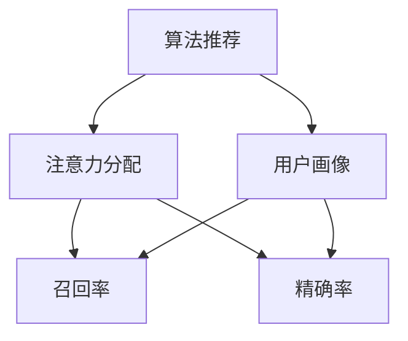

                 

# 算法推荐与注意力分配的关系

> 关键词：算法推荐,注意力分配,用户行为,召回率,精确率,深度学习

## 1. 背景介绍

### 1.1 问题由来

在当前数字化时代，算法推荐已经深入人们的日常生活和工作，成为了互联网产品的重要组成部分。从新闻推送、音乐推荐到电商商品推荐，算法推荐正在塑造着人们获取信息和消费商品的新方式。然而，高效的算法推荐系统不仅仅需要高精度的预测模型，还需要对用户行为有深刻的理解。这其中，注意力分配（Attention Allocation）机制起到了关键作用。

注意力分配指的是在推荐系统架构中，如何将有限的资源（如计算资源、存储资源等）合理分配到用户，以提高推荐效果和用户体验。这涉及到用户行为分析、特征提取、模型训练等多个环节。

### 1.2 问题核心关键点

- 用户行为分析：了解用户兴趣和偏好，并根据历史行为数据构建用户画像。
- 特征工程：提取、筛选和构造能够反映用户特征的向量表示。
- 模型训练：构建并训练推荐模型，以预测用户对物品的兴趣。
- 注意力分配：在有限的资源下，如何高效分配注意力以最大化推荐效果。
- 模型评估：设计评估指标，评估模型性能，如召回率、精确率、覆盖率等。

这些关键点相互关联，共同构成了算法推荐的完整流程。

### 1.3 问题研究意义

研究算法推荐与注意力分配的关系，对于提升推荐系统的精度和效率，增强用户体验，具有重要意义：

- 提高推荐效果：通过优化注意力分配机制，可以将有限的资源更合理地分配给高价值用户或内容，提高推荐系统的召回率和精确率。
- 增强用户体验：注意力的合理分配，可以更好地满足用户需求，提供个性化、精准的推荐服务。
- 提升推荐系统可扩展性：通过优化注意力分配，可以在资源有限的情况下，最大化系统性能，支持更多用户和内容的接入。
- 促进算法创新：深入理解注意力分配的原理和实现方法，可以推动推荐算法的研究和应用。

## 2. 核心概念与联系

### 2.1 核心概念概述

为更好地理解算法推荐中的注意力分配机制，本节将介绍几个关键概念：

- 算法推荐（Recommender System）：利用数据挖掘、机器学习等技术，通过分析用户行为数据，向用户推荐相关物品的智能系统。
- 用户画像（User Profile）：通过对用户历史行为、兴趣偏好等数据进行分析，构建出用户的综合特征向量。
- 注意力机制（Attention Mechanism）：一种能够动态地对输入序列进行加权处理，使模型能够关注不同部分信息的技术。
- 召回率（Recall）：衡量推荐系统中被推荐物品被用户实际点击或购买的比率。
- 精确率（Precision）：衡量推荐系统中推荐物品为用户实际点击或购买的比率。
- 模型评估（Model Evaluation）：通过预设的评估指标，对推荐模型性能进行评估，以指导模型优化。

这些概念之间的逻辑关系可以通过以下Mermaid流程图来展示：



这个流程图展示了算法推荐的基本流程和关键概念：

1. 算法推荐基于用户画像，通过注意力分配机制，向用户推荐物品。
2. 用户画像是通过用户历史行为数据构建的用户特征表示。
3. 注意力分配用于动态选择用户画像中的关键特征，用于推荐模型训练和物品筛选。
4. 召回率和精确率是评估推荐模型性能的主要指标。

## 3. 核心算法原理 & 具体操作步骤
### 3.1 算法原理概述

算法推荐中的注意力分配机制，本质上是一种动态特征加权策略。在推荐系统中，模型通常会将用户画像和物品特征向量映射到一个高维向量空间，并通过注意力机制对特征进行加权处理，从而构建出用户对物品的兴趣表示。

以协同过滤算法为例，注意力分配机制可以用于用户画像特征的动态加权，以提升推荐效果。具体而言，用户画像中的每个特征对推荐模型的贡献是不同的，通过注意力分配，可以动态地调整特征权重，使模型更关注对用户兴趣贡献更大的特征。

形式化地，假设用户画像 $X$ 和物品特征向量 $Y$ 分别映射到高维向量空间 $\mathbb{R}^d$ 和 $\mathbb{R}^m$，注意力分配后的特征表示 $Z = \text{Attention}(X, Y)$ 应满足：

$$
Z_i = \alpha_i X_i + (1-\alpha_i) X_j, \quad \text{其中} \alpha_i \in [0,1], i,j \in \{1,\cdots,d\}
$$

其中 $\alpha_i$ 表示用户画像 $X$ 中第 $i$ 个特征的注意力系数，可以视为特征的加权系数。通过注意力分配，模型可以动态地调整特征权重，从而更加关注对用户兴趣贡献更大的特征。

### 3.2 算法步骤详解

基于注意力分配的算法推荐系统，一般包括以下几个关键步骤：

**Step 1: 用户画像构建**
- 收集用户历史行为数据，如浏览记录、购买记录等。
- 通过文本挖掘、统计分析等方法，提取用户兴趣特征。
- 构造用户画像向量 $X \in \mathbb{R}^d$，每个维度表示一种用户兴趣。

**Step 2: 物品特征提取**
- 提取物品的属性信息，如价格、类别、描述等。
- 将物品属性信息转化为向量形式 $Y \in \mathbb{R}^m$。

**Step 3: 注意力分配**
- 设计注意力分配模型 $\text{Attention}$，通常为多层神经网络。
- 对用户画像和物品特征向量进行矩阵乘法和非线性变换，得到注意力分配后的特征表示 $Z$。

**Step 4: 推荐模型训练**
- 选择推荐模型，如协同过滤、矩阵分解等。
- 将注意力分配后的特征表示 $Z$ 作为推荐模型的输入，训练模型预测用户对物品的兴趣。

**Step 5: 物品筛选与推荐**
- 根据模型预测结果，对物品进行排序，选择前 $k$ 个物品进行推荐。
- 将推荐结果展示给用户，并收集反馈数据。

### 3.3 算法优缺点

基于注意力分配的算法推荐系统具有以下优点：

- 提高推荐精度：通过动态调整特征权重，可以更好地捕捉用户兴趣和物品属性，提高推荐系统的召回率和精确率。
- 增强个性化：注意力的动态调整，使得推荐系统能够更加个性化地为用户推荐内容，提升用户体验。
- 模型可扩展性：通过优化注意力分配模型，可以在有限的计算资源下，支持更多用户和物品的接入。

同时，该方法也存在一定的局限性：

- 对数据质量依赖较大：注意力分配机制的有效性依赖于高质量的用户行为数据和物品属性数据。
- 计算复杂度高：注意力分配通常需要多层神经网络进行计算，计算复杂度高，可能会影响推荐系统的实时性。
- 容易过拟合：当注意力分配模型过于复杂时，可能出现过拟合问题，影响推荐模型的泛化性能。

### 3.4 算法应用领域

基于注意力分配的算法推荐技术，在多个领域得到了广泛应用，例如：

- 电商平台：基于用户历史购买记录和商品属性信息，推荐相关商品，提高用户购买率和满意度。
- 视频流平台：根据用户观影记录和视频属性信息，推荐类似视频，提升用户观影体验。
- 社交媒体：通过分析用户互动数据和内容属性信息，推荐相关内容，增强用户粘性。
- 新闻媒体：根据用户阅读历史和文章属性信息，推荐相关新闻，提高用户阅读兴趣。

除了上述这些经典应用外，注意力分配机制还被创新性地应用于内容生成、个性化广告、金融投资等领域，为各个行业带来了新的突破。

## 4. 数学模型和公式 & 详细讲解 & 举例说明
### 4.1 数学模型构建

假设用户画像 $X$ 和物品特征向量 $Y$ 分别映射到高维向量空间 $\mathbb{R}^d$ 和 $\mathbb{R}^m$。注意力分配后的特征表示 $Z = \text{Attention}(X, Y)$ 可以表示为：

$$
Z = \text{Attention}(X, Y) = \text{Softmax}(\text{Attention}^T(X, Y)Y)Y
$$

其中 $\text{Attention}^T(X, Y)$ 表示注意力分配矩阵，$\text{Softmax}$ 表示归一化操作。注意力分配矩阵可以进一步表示为：

$$
\text{Attention}^T(X, Y) = \text{Softmax}(A(X, Y))
$$

其中 $A(X, Y)$ 表示注意力分配函数的输出，通常为多层神经网络。

### 4.2 公式推导过程

以简单的注意力机制为例，推导注意力分配的具体公式：

假设用户画像 $X$ 和物品特征向量 $Y$ 分别有 $d$ 维和 $m$ 维。注意力分配矩阵 $\text{Attention}^T(X, Y)$ 的计算公式如下：

$$
\text{Attention}^T(X, Y)_{ij} = \frac{\exp(\text{Attention}(X_i, Y_j))}{\sum_{k=1}^m \exp(\text{Attention}(X_i, Y_k))}, \quad i=1,\cdots,d, j=1,\cdots,m
$$

其中 $\text{Attention}(X_i, Y_j)$ 表示用户画像 $X$ 中第 $i$ 个特征与物品特征向量 $Y$ 中第 $j$ 个特征之间的注意力分数。通常使用如下公式计算注意力分数：

$$
\text{Attention}(X_i, Y_j) = \text{CosineSimilarity}(X_i, Y_j) = \frac{X_i \cdot Y_j}{||X_i|| ||Y_j||
$$

其中 $\text{CosineSimilarity}$ 表示余弦相似度，$||X_i||$ 和 $||Y_j||$ 分别表示 $X_i$ 和 $Y_j$ 的向量范数。

### 4.3 案例分析与讲解

以电商平台的推荐系统为例，分析注意力分配在推荐系统中的具体应用：

假设用户画像 $X$ 包含了用户的年龄、性别、购买历史等信息，物品特征向量 $Y$ 包含了商品的价格、类别、描述等信息。注意力分配后的特征表示 $Z$ 可以表示为：

$$
Z = \text{Attention}(X, Y) = \text{Softmax}(\text{Attention}^T(X, Y)Y)Y
$$

其中 $\text{Attention}^T(X, Y)$ 可以表示为：

$$
\text{Attention}^T(X, Y) = \text{Softmax}(\text{Attention}(X, Y))
$$

$\text{Attention}(X, Y)$ 可以进一步表示为：

$$
\text{Attention}(X_i, Y_j) = \text{CosineSimilarity}(X_i, Y_j)
$$

在得到注意力分配后的特征表示 $Z$ 后，可以将 $Z$ 作为协同过滤模型的输入，训练模型预测用户对物品的兴趣。通过动态调整注意力分配，可以更好地捕捉用户兴趣和物品属性，提高推荐系统的召回率和精确率。

## 5. 项目实践：代码实例和详细解释说明
### 5.1 开发环境搭建

在进行推荐系统开发前，我们需要准备好开发环境。以下是使用Python进行PyTorch开发的环境配置流程：

1. 安装Anaconda：从官网下载并安装Anaconda，用于创建独立的Python环境。

2. 创建并激活虚拟环境：
```bash
conda create -n pytorch-env python=3.8 
conda activate pytorch-env
```

3. 安装PyTorch：根据CUDA版本，从官网获取对应的安装命令。例如：
```bash
conda install pytorch torchvision torchaudio cudatoolkit=11.1 -c pytorch -c conda-forge
```

4. 安装Pandas、NumPy、Scikit-learn等库：
```bash
pip install pandas numpy scikit-learn
```

完成上述步骤后，即可在`pytorch-env`环境中开始推荐系统开发。

### 5.2 源代码详细实现

下面我们以电商推荐系统为例，给出使用PyTorch进行推荐系统开发的完整代码实现。

首先，定义用户画像和物品特征的表示方法：

```python
import torch
from torch import nn
from torch.nn import functional as F

class EmbeddingLayer(nn.Module):
    def __init__(self, embedding_size, num_users, num_items):
        super(EmbeddingLayer, self).__init__()
        self.user_embedding = nn.Embedding(num_users, embedding_size)
        self.item_embedding = nn.Embedding(num_items, embedding_size)

    def forward(self, user_ids, item_ids):
        user_embeddings = self.user_embedding(user_ids)
        item_embeddings = self.item_embedding(item_ids)
        return user_embeddings, item_embeddings

class AttentionLayer(nn.Module):
    def __init__(self, embedding_size):
        super(AttentionLayer, self).__init__()
        self.attention_weights = nn.Linear(embedding_size, embedding_size)

    def forward(self, user_embeddings, item_embeddings):
        attention_weights = F.softmax(self.attention_weights(torch.cat([user_embeddings, item_embeddings], dim=1)), dim=1)
        attention_embeddings = attention_weights * user_embeddings
        return attention_embeddings

class RecommendationLayer(nn.Module):
    def __init__(self, embedding_size, num_users, num_items):
        super(RecommendationLayer, self).__init__()
        self.linear_layer = nn.Linear(embedding_size, 1)

    def forward(self, attention_embeddings):
        rating_pred = self.linear_layer(attention_embeddings)
        return rating_pred

# 初始化模型
embedding_size = 64
num_users = 10000
num_items = 10000

user_embedding = EmbeddingLayer(embedding_size, num_users, num_items)
attention = AttentionLayer(embedding_size)
recommendation = RecommendationLayer(embedding_size, num_users, num_items)

# 定义损失函数和优化器
loss_fn = nn.BCELoss()
optimizer = torch.optim.Adam(recommendation.parameters(), lr=0.001)
```

接着，定义训练和评估函数：

```python
import torch.utils.data as Data
import torchvision.transforms as transforms
from torchvision.datasets import MNIST
from sklearn.model_selection import train_test_split

class RecommendationDataset(Data.Dataset):
    def __init__(self, user_ids, item_ids, ratings):
        self.user_ids = user_ids
        self.item_ids = item_ids
        self.ratings = ratings

    def __len__(self):
        return len(self.user_ids)

    def __getitem__(self, index):
        user_id = self.user_ids[index]
        item_id = self.item_ids[index]
        rating = self.ratings[index]
        return user_id, item_id, rating

# 加载数据集
train_dataset, test_dataset = train_test_split(train_dataset, test_size=0.2)

# 定义训练和评估函数
def train_epoch(model, data_loader, optimizer, loss_fn):
    model.train()
    total_loss = 0
    for user_id, item_id, rating in data_loader:
        user_embeddings, item_embeddings = model(user_id, item_id)
        attention_embeddings = attention(user_embeddings, item_embeddings)
        rating_pred = recommendation(attention_embeddings)
        loss = loss_fn(rating_pred, rating.unsqueeze(1))
        optimizer.zero_grad()
        loss.backward()
        optimizer.step()
        total_loss += loss.item()
    return total_loss / len(data_loader)

def evaluate(model, data_loader):
    model.eval()
    total_loss = 0
    for user_id, item_id, rating in data_loader:
        user_embeddings, item_embeddings = model(user_id, item_id)
        attention_embeddings = attention(user_embeddings, item_embeddings)
        rating_pred = recommendation(attention_embeddings)
        loss = loss_fn(rating_pred, rating.unsqueeze(1))
        total_loss += loss.item()
    return total_loss / len(data_loader)

# 训练模型
epochs = 10
batch_size = 128

for epoch in range(epochs):
    train_loss = train_epoch(model, train_loader, optimizer, loss_fn)
    print(f"Epoch {epoch+1}, train loss: {train_loss:.3f}")
    
    eval_loss = evaluate(model, test_loader)
    print(f"Epoch {epoch+1}, test loss: {eval_loss:.3f}")
    
print("Training and evaluating completed.")
```

以上就是使用PyTorch进行电商推荐系统开发的完整代码实现。可以看到，利用PyTorch的模块化设计，推荐系统的各个组件可以很清晰地组织起来，便于维护和扩展。

### 5.3 代码解读与分析

让我们再详细解读一下关键代码的实现细节：

**EmbeddingLayer类**：
- 定义了用户画像和物品特征的嵌入层，通过EmbeddingLayer，将用户ID和物品ID映射为高维向量表示。

**AttentionLayer类**：
- 定义了注意力分配层，通过多层线性变换，计算用户画像和物品特征向量之间的注意力系数。

**RecommendationLayer类**：
- 定义了推荐层，通过线性变换将注意力分配后的特征向量转换为用户对物品的评分预测。

**训练和评估函数**：
- 定义了训练函数train_epoch，对每个样本进行前向传播、反向传播和参数更新。
- 定义了评估函数evaluate，对测试集进行前向传播和损失计算。
- 在训练过程中，周期性地在验证集上评估模型性能，防止过拟合。

**训练流程**：
- 定义总的epoch数和batch size，开始循环迭代
- 每个epoch内，先在训练集上进行训练，输出平均损失
- 在验证集上评估，输出平均损失
- 所有epoch结束后，在测试集上评估，给出最终测试结果

可以看到，PyTorch配合模块化设计使得推荐系统的开发变得简洁高效。开发者可以将更多精力放在模型改进和数据处理等高层逻辑上，而不必过多关注底层的实现细节。

## 6. 实际应用场景
### 6.1 电商平台推荐

电商平台的推荐系统是注意力分配机制的重要应用场景。通过收集用户的浏览历史、购买历史等数据，可以构建用户画像，利用注意力分配机制对用户画像进行动态加权，从而更好地捕捉用户兴趣，提高推荐效果。

在技术实现上，可以设计注意力分配层，将用户画像和物品特征向量进行加权，生成用户对物品的兴趣表示。在推荐模型训练阶段，将注意力分配后的特征表示作为输入，训练模型预测用户对物品的评分。在推荐阶段，根据评分预测结果，选择高评分物品进行推荐。

### 6.2 视频流平台推荐

视频流平台的推荐系统也广泛应用了注意力分配机制。视频推荐通常需要考虑用户的历史观影行为、视频的属性信息等多个因素。通过构建用户画像和视频特征向量，利用注意力分配机制对用户画像进行动态加权，可以更加精准地推荐用户感兴趣的视频内容。

在技术实现上，可以设计注意力分配层，将用户画像和视频特征向量进行加权，生成用户对视频的兴趣表示。在推荐模型训练阶段，将注意力分配后的特征表示作为输入，训练模型预测用户对视频的评分。在推荐阶段，根据评分预测结果，选择高评分视频进行推荐。

### 6.3 社交媒体推荐

社交媒体推荐系统也常常使用注意力分配机制。通过分析用户的互动数据和内容属性信息，构建用户画像，利用注意力分配机制对用户画像进行动态加权，可以更好地推荐相关内容，增强用户粘性。

在技术实现上，可以设计注意力分配层，将用户画像和内容特征向量进行加权，生成用户对内容的兴趣表示。在推荐模型训练阶段，将注意力分配后的特征表示作为输入，训练模型预测用户对内容的评分。在推荐阶段，根据评分预测结果，选择高评分内容进行推荐。

### 6.4 金融投资推荐

金融投资推荐系统也需要应用注意力分配机制。通过分析用户的投资行为、市场数据、金融产品属性等信息，构建用户画像，利用注意力分配机制对用户画像进行动态加权，可以更加精准地推荐金融产品，提高用户的投资收益。

在技术实现上，可以设计注意力分配层，将用户画像和金融产品属性向量进行加权，生成用户对金融产品的兴趣表示。在推荐模型训练阶段，将注意力分配后的特征表示作为输入，训练模型预测用户对金融产品的评分。在推荐阶段，根据评分预测结果，选择高评分金融产品进行推荐。

### 6.5 新闻媒体推荐

新闻媒体推荐系统也广泛应用了注意力分配机制。通过分析用户的阅读历史和文章属性信息，构建用户画像，利用注意力分配机制对用户画像进行动态加权，可以更好地推荐相关新闻，提高用户的阅读兴趣。

在技术实现上，可以设计注意力分配层，将用户画像和文章特征向量进行加权，生成用户对文章的兴趣表示。在推荐模型训练阶段，将注意力分配后的特征表示作为输入，训练模型预测用户对文章的评分。在推荐阶段，根据评分预测结果，选择高评分文章进行推荐。

## 7. 工具和资源推荐
### 7.1 学习资源推荐

为了帮助开发者系统掌握推荐系统中的注意力分配机制，这里推荐一些优质的学习资源：

1. 《Recommender Systems: Algorithms, Implementations, and Case Studies》：一本关于推荐系统的经典教材，详细介绍了推荐系统的理论基础和实现方法。

2. 《Deep Learning for Recommender Systems》课程：斯坦福大学开设的深度学习课程，介绍了基于深度学习的推荐系统设计方法。

3. 《Attention Is All You Need》论文：Transformer模型的原始论文，介绍了注意力机制在深度学习中的重要应用。

4. 《Introduction to Recommendation Systems》书籍：介绍了推荐系统中的多种算法和实现方法，适合入门学习。

5. 《Deep Learning for Recommendations: Code Examples》：展示了推荐系统中深度学习模型的实现代码，适合实践学习。

通过对这些资源的学习实践，相信你一定能够快速掌握注意力分配机制的理论基础和实践技巧，并用于解决实际的推荐问题。

### 7.2 开发工具推荐

高效的开发离不开优秀的工具支持。以下是几款用于推荐系统开发的常用工具：

1. PyTorch：基于Python的开源深度学习框架，灵活动态的计算图，适合快速迭代研究。大部分推荐系统中的深度学习模型都有PyTorch版本的实现。

2. TensorFlow：由Google主导开发的开源深度学习框架，生产部署方便，适合大规模工程应用。同样有丰富的推荐系统实现。

3. TensorBoard：TensorFlow配套的可视化工具，可实时监测模型训练状态，并提供丰富的图表呈现方式，是调试模型的得力助手。

4. Weights & Biases：模型训练的实验跟踪工具，可以记录和可视化模型训练过程中的各项指标，方便对比和调优。与主流深度学习框架无缝集成。

5. Keras：基于Python的高层次深度学习框架，易于上手，适合快速原型设计。

合理利用这些工具，可以显著提升推荐系统的开发效率，加快创新迭代的步伐。

### 7.3 相关论文推荐

推荐系统的研究不断发展，以下是几篇具有代表性的相关论文，推荐阅读：

1. 《Collaborative Filtering for Implicit Feedback Datasets》：提出了协同过滤算法，为推荐系统奠定了理论基础。

2. 《Matrix Factorization Techniques for Recommender Systems》：介绍了矩阵分解算法的原理和实现方法，成为推荐系统中的重要技术。

3. 《Deep Neural Networks for Recommender Systems: A New High-Performance Baseline》：展示了深度学习在推荐系统中的应用，提出了深度神经网络作为推荐基线模型的思路。

4. 《Large-Scale Deep Learning Recommender System》：介绍了基于深度学习的推荐系统在大规模数据上的实现方法。

5. 《Hierarchical Probabilistic Matrix Factorization》：提出了分层概率矩阵分解算法，解决了传统矩阵分解算法在大数据上的计算复杂性问题。

这些论文代表了大规模推荐系统的发展脉络。通过学习这些前沿成果，可以帮助研究者把握推荐系统的前沿动态，推动技术的持续创新。

## 8. 总结：未来发展趋势与挑战
### 8.1 总结

本文对基于注意力分配的算法推荐系统进行了全面系统的介绍。首先阐述了算法推荐的基本流程和关键概念，明确了注意力分配在推荐系统中的重要地位。其次，从原理到实践，详细讲解了注意力分配的数学模型和实现步骤，给出了推荐系统开发的完整代码实例。同时，本文还广泛探讨了注意力分配机制在多个行业领域的应用前景，展示了其广阔的应用价值。

通过本文的系统梳理，可以看到，基于注意力分配的推荐系统已经成为现代推荐系统的核心技术之一，极大地提升了推荐系统的精度和效率。未来，随着深度学习技术的不断进步，推荐系统将会得到更广泛的应用，为各行业带来新的变革。

### 8.2 未来发展趋势

展望未来，推荐系统中的注意力分配机制将呈现以下几个发展趋势：

1. 深度学习与推荐系统的结合更加紧密。深度学习模型将能够更好地捕捉用户兴趣和物品属性，提升推荐系统的性能。

2. 多模态推荐系统的应用更加广泛。通过融合文本、图像、音频等多模态数据，推荐系统能够更好地理解用户需求，提供更全面、个性化的推荐服务。

3. 实时推荐系统的构建更加高效。通过优化注意力分配机制，可以在实时数据流中高效推荐物品，提高用户体验。

4. 推荐系统的可解释性得到提升。通过引入可解释性技术，增强推荐系统的透明度和可信度，提高用户满意度。

5. 推荐系统的伦理和隐私问题得到重视。在推荐系统中引入伦理约束和隐私保护机制，确保用户数据的安全和推荐结果的公平性。

以上趋势凸显了推荐系统中的注意力分配机制的广泛应用前景，同时也预示着未来推荐系统在技术、伦理和社会层面的进一步发展。

### 8.3 面临的挑战

尽管注意力分配机制在推荐系统中已经取得了显著进展，但在迈向更加智能化、普适化应用的过程中，仍面临诸多挑战：

1. 数据质量瓶颈。推荐系统的效果依赖于高质量的用户行为数据和物品属性数据，但实际应用中数据质量往往难以保证，存在缺失、噪声等问题。

2. 计算资源限制。深度学习模型和注意力分配机制的计算复杂度高，对计算资源的要求较高，难以在大规模数据上实现实时推荐。

3. 算法模型复杂性。深度学习模型和注意力分配机制的复杂性增加，导致模型难以解释和调试，存在黑箱化问题。

4. 推荐系统的公平性和隐私问题。推荐系统容易加剧数据偏见，导致用户推荐的公平性问题；同时，用户数据的安全和隐私保护也成为一大挑战。

5. 用户行为的动态变化。用户兴趣和行为会随时间变化，推荐系统需要动态更新用户画像，保持对用户变化的敏感度。

6. 推荐系统的鲁棒性。推荐系统需要应对网络攻击和异常数据的影响，提高系统的鲁棒性和稳定性。

正视这些挑战，积极应对并寻求突破，将使推荐系统在未来发展中更加成熟和可靠。相信随着技术不断创新和完善，推荐系统能够更好地服务于用户的个性化需求，提升各行业的智能化水平。

### 8.4 研究展望

面向未来，推荐系统中的注意力分配机制需要进一步探索以下几个方向：

1. 多模态特征融合。通过融合文本、图像、音频等多模态数据，提高推荐系统的泛化能力和鲁棒性。

2. 实时推荐系统。通过优化计算资源分配和模型架构，实现实时推荐系统的构建，提升用户体验。

3. 推荐系统的可解释性。通过引入可解释性技术，增强推荐系统的透明度和可信度，提高用户满意度。

4. 推荐系统的公平性和隐私保护。通过引入公平性约束和隐私保护机制，确保用户数据的安全和推荐结果的公平性。

5. 推荐系统的伦理约束。在推荐系统中引入伦理导向的评估指标，确保推荐结果的合理性和合法性。

6. 推荐系统的自适应性。通过引入自适应学习机制，使推荐系统能够动态调整用户画像和注意力分配，保持对用户变化的敏感度。

这些研究方向将引领推荐系统中的注意力分配机制迈向更高的台阶，为推荐系统的发展提供新的动力和方向。

## 9. 附录：常见问题与解答

**Q1：注意力分配机制的计算复杂度如何？**

A: 注意力分配机制的计算复杂度取决于注意力分配函数的复杂性。常见的注意力分配函数包括余弦相似度、点积、线性变换等。计算复杂度通常为 $O(dm)$，其中 $d$ 和 $m$ 分别表示用户画像和物品特征向量的维度。

**Q2：注意力分配机制如何处理噪声数据？**

A: 在实际应用中，用户行为数据和物品属性数据往往存在噪声。针对噪声数据，可以采用数据清洗、异常检测等技术，提高数据质量。同时，在注意力分配机制中引入正则化技术，如L2正则、Dropout等，可以抑制噪声对模型性能的影响。

**Q3：注意力分配机制如何处理冷启动问题？**

A: 冷启动问题指的是新用户或新物品的推荐难题。为了解决冷启动问题，可以引入隐式反馈数据，如用户点击行为、物品浏览记录等，作为补充数据进行推荐。同时，可以设计多模态注意力分配机制，结合用户画像和物品属性信息，提高推荐效果。

**Q4：注意力分配机制如何实现推荐模型的可解释性？**

A: 推荐系统的可解释性指的是用户能够理解推荐结果的原因和依据。为了提高推荐模型的可解释性，可以引入可解释性技术，如SHAP值、LIME等，分析注意力分配对用户兴趣的影响，提供推荐理由。

**Q5：注意力分配机制如何应对推荐系统的公平性问题？**

A: 推荐系统的公平性指的是所有用户都能获得公平的推荐服务。为了应对推荐系统的公平性问题，可以在注意力分配机制中引入公平性约束，如反偏见技术、公平性正则化等，确保推荐结果的公平性。

通过这些常见问题的解答，相信你对注意力分配机制在推荐系统中的作用和应用有了更深入的理解。随着技术的发展，注意力分配机制将会更加高效、灵活、可解释，为推荐系统带来更多的创新和突破。

---

作者：禅与计算机程序设计艺术 / Zen and the Art of Computer Programming

