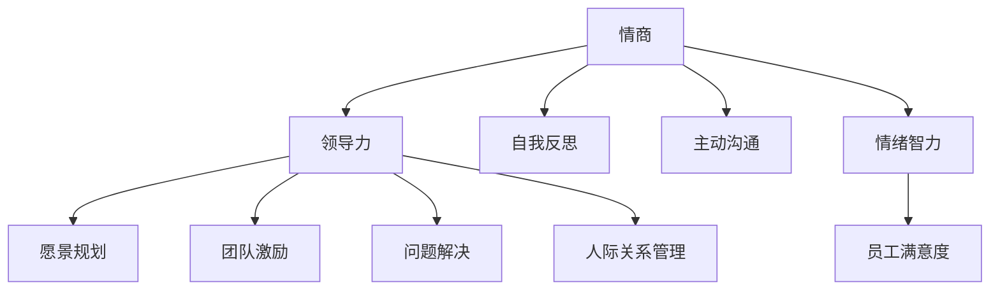

                 

# 管理者的情商修炼：提升领导力的关键

> 关键词：情商（Emotional Intelligence）, 领导力（Leadership）, 沟通（Communication）, 决策（Decision Making）, 人际关系（Interpersonal Skills）

## 1. 背景介绍

### 1.1 问题由来
在日益复杂的现代商业环境中，管理者面临的挑战越发多样和复杂。尽管技术、资金、市场等外因对企业的发展至关重要，但这些因素并非决定性因素，真正影响组织长期发展的还是人的因素，尤其是管理者的情商和领导力。一个具有高情商的管理者，不仅能更好地自我管理，还能更有效地与员工、客户、合作伙伴等进行互动，从而提升整个组织的绩效。

情商（Emotional Intelligence, EQ），又称情绪智力，是指个体识别、理解、管理自身及他人情绪的能力。情商理论由美国心理学家丹尼尔·戈尔曼（Daniel Goleman）提出，在商业和管理学领域得到了广泛的应用。领导力（Leadership）则是指管理者通过明确愿景、激励人心、有效沟通等方式，带领团队实现目标的能力。情商和领导力相辅相成，一个情商高的管理者，通常能更好地发挥领导力，从而提升团队的士气和绩效。

然而，高情商和高领导力的管理者并非天生，而是可以通过系统化的训练和实践来培养。本文将从核心概念、原理、操作步骤、数学模型、案例分析、项目实践等多个维度，全面系统地介绍如何通过情商修炼来提升领导力。

## 2. 核心概念与联系

### 2.1 核心概念概述

为更好地理解情商与领导力的提升过程，本节将介绍几个密切相关的核心概念：

- 情商（Emotional Intelligence）：包括自我意识、自我管理、社交意识、关系管理四个维度，是管理者有效沟通和决策的基础。
- 领导力（Leadership）：包括愿景规划、团队激励、问题解决、人际关系管理等多个方面，是管理者带领团队实现目标的核心能力。
- 自我反思（Self-Reflection）：通过定期回顾和总结，评估自身的行为和表现，是情商提升的重要手段。
- 主动沟通（Active Communication）：通过倾听、反馈、非言语沟通等方式，增强人际互动的效果。
- 情绪智力（Emotional Quotient）：衡量个体情商高低的指标，通常包括自控、同理心、动机等维度。
- 员工满意度（Employee Satisfaction）：员工对工作环境、薪酬福利、职业发展等方面的满意程度，直接影响组织的整体绩效。

这些核心概念之间的逻辑关系可以通过以下Mermaid流程图来展示：



这个流程图展示的情商与领导力的提升逻辑：

1. 情商通过自我反思和主动沟通获得提升。
2. 高情商的管理者能更好地进行愿景规划、团队激励、问题解决和人际关系管理，从而提升领导力。
3. 高情商和高领导力的管理者，能更好地管理员工情绪，提升员工满意度，从而提高组织绩效。

## 3. 核心算法原理 & 具体操作步骤
### 3.1 算法原理概述

情商和领导力的提升，本质上是一个系统性的学习与实践过程。其核心思想是通过持续的自我反思、主动沟通和行为改进，逐步提升个人的情商和领导力。

情商和领导力的提升模型如下：

$$
\text{提升后情商} = f(\text{提升前情商}, \text{自我反思}, \text{主动沟通}, \text{行为改进}, \text{反馈机制})
$$

$$
\text{提升后领导力} = g(\text{提升前领导力}, \text{情商}, \text{团队互动}, \text{目标设定}, \text{绩效评估})
$$

其中 $f$ 和 $g$ 分别表示情商和领导力的提升函数，包含多个关键因素。

### 3.2 算法步骤详解

情商和领导力的提升，主要包括以下几个关键步骤：

**Step 1: 自我评估**
- 使用情商量表或领导力评估工具，评估自身的情商和领导力水平。
- 根据评估结果，识别自身的优势和不足。

**Step 2: 制定提升计划**
- 根据自我评估结果，制定切实可行的情商和领导力提升计划。
- 分解目标，设定短期和长期目标。

**Step 3: 系统化训练**
- 定期参加情商和领导力培训课程，学习相关的知识和技能。
- 参与团队互动活动，增强沟通和协作能力。

**Step 4: 实践与反思**
- 在日常工作中，主动应用所学知识和技能，实践情商和领导力的提升。
- 定期进行自我反思，评估实践效果，找出不足之处。

**Step 5: 获取反馈**
- 通过360度反馈、一对一谈话等方式，获取来自他人的反馈。
- 分析反馈意见，确定改进方向。

**Step 6: 调整与优化**
- 根据反思和反馈结果，调整提升计划。
- 不断优化行为和策略，逐步提升情商和领导力。

**Step 7: 持续追踪**
- 定期评估情商和领导力提升的效果，记录改进历程。
- 建立持续追踪机制，保持提升动力和方向。

### 3.3 算法优缺点

情商和领导力提升的算法具有以下优点：
1. 系统性强。通过科学的步骤和全面的评估，系统地提升情商和领导力。
2. 实践导向。重视行为改进和实践反思，不断优化提升效果。
3. 可测量。通过定量的评估工具，可以客观地评估情商和领导力的提升效果。
4. 灵活性高。根据个人情况和组织需求，灵活调整提升计划。

同时，该算法也存在一定的局限性：
1. 时间和资源投入较大。提升情商和领导力需要较长的实践周期和丰富的资源投入。
2. 效果依赖个人。不同个体对情商和领导力提升的接受度和投入度不同，影响最终效果。
3. 缺乏即时反馈。情商和领导力的提升过程较长，短期内难以看到显著效果。

尽管存在这些局限性，但就目前而言，系统化、实践导向的情商和领导力提升方法是较为科学的途径。未来相关研究的重点在于如何进一步降低时间和资源的投入，增强即时反馈机制，以及提升个人的主动性和投入度。

### 3.4 算法应用领域

情商和领导力的提升方法，在企业管理、人力资源管理、团队协作等多个领域都有广泛的应用：

- 企业管理：通过提升管理者的情商和领导力，提升企业的整体绩效和竞争力。
- 人力资源管理：提升人力资源部门的领导力，优化招聘、培训、绩效管理等流程。
- 团队协作：通过提升团队成员的情商和领导力，增强团队凝聚力和协作效率。
- 项目管理：提升项目经理的情商和领导力，确保项目按时按质完成。
- 创新管理：通过培养高情商和高领导力的团队，推动组织不断创新。

此外，情商和领导力的提升方法也在教育、医疗、公共事务等诸多领域得到了应用，为组织和个体带来了深刻的变革。

## 4. 数学模型和公式 & 详细讲解  
### 4.1 数学模型构建

情商和领导力的提升，可以通过数学模型进行更加系统的分析和评估。

记情商和领导力为 $\text{EQ}$ 和 $\text{Lea}$，影响情商和领导力的关键因素为 $f$ 和 $g$，提升函数为 $f$ 和 $g$。则情商和领导力的提升模型可以表示为：

$$
\text{EQ}_{\text{提升后}} = f(\text{EQ}_{\text{提升前}}, f_1, f_2, ..., f_n)
$$

$$
\text{Lea}_{\text{提升后}} = g(\text{Lea}_{\text{提升前}}, g_1, g_2, ..., g_m)
$$

其中 $f_i$ 和 $g_j$ 表示影响情商和领导力的关键因素，如自我反思、主动沟通、团队互动等。

### 4.2 公式推导过程

以下我们以情商提升为例，推导自我反思和主动沟通对情商提升的影响。

设 $\text{EQ}_{\text{当前}}$ 为当前的情商水平，$f_{\text{反}}$ 为自我反思对情商提升的函数，$f_{\text{交}}$ 为主动沟通对情商提升的函数。则情商提升的数学模型可以表示为：

$$
\text{EQ}_{\text{提升后}} = f_{\text{反}}(\text{EQ}_{\text{当前}}, \text{EQ}_{\text{提升前}}, f_{\text{交}})
$$

将公式展开，得：

$$
\text{EQ}_{\text{提升后}} = f_{\text{反}}(\text{EQ}_{\text{当前}}, \text{EQ}_{\text{提升前}}, \text{EQ}_{\text{当前}} + \text{EQ}_{\text{提升前}} + \text{EQ}_{\text{当前}} \times f_{\text{交}})
$$

在实际应用中，情商提升的函数 $f_{\text{反}}$ 和 $f_{\text{交}}$ 需要根据具体情境和评估结果进行设计。例如，可以将情商提升的函数定义为：

$$
f_{\text{反}}(\text{EQ}_{\text{当前}}, \text{EQ}_{\text{提升前}}, \text{EQ}_{\text{当前}} + \text{EQ}_{\text{提升前}} + \text{EQ}_{\text{当前}} \times f_{\text{交}}) = \text{EQ}_{\text{当前}} + \text{EQ}_{\text{提升前}} + \text{EQ}_{\text{当前}} \times f_{\text{交}}
$$

其中 $f_{\text{交}}$ 可以根据主动沟通的频率、质量等进行量化评估。

### 4.3 案例分析与讲解

以下通过一个实际案例，展示如何应用数学模型进行情商和领导力的提升。

假设某企业管理者的情商水平为 $60$，领导力水平为 $70$，当前情商提升计划如下：

- 每周进行两次自我反思，每次反思时间为 $2$ 小时。
- 每月参与一次团队建设活动，每次活动持续 $4$ 小时。

设 $\text{EQ}_{\text{提升前}} = 60$，$f_{\text{反}} = 0.8$，$f_{\text{交}} = 0.5$。则该管理者的情商提升过程可以表示为：

$$
\text{EQ}_{\text{提升后}} = 60 + 0.8 \times (60 + 0.5 \times 4) = 60 + 0.8 \times (60 + 2) = 60 + 0.8 \times 62 = 60 + 49.6 = 109.6
$$

在实际应用中，还可以通过持续追踪和反馈机制，进一步优化情商和领导力的提升过程。例如，根据每次反思和沟通的效果，调整自我反思和团队建设的频率和质量，从而逐步提升情商和领导力。

## 5. 项目实践：代码实例和详细解释说明
### 5.1 开发环境搭建

在进行情商和领导力提升的实践前，我们需要准备好开发环境。以下是使用Python进行开发的环境配置流程：

1. 安装Anaconda：从官网下载并安装Anaconda，用于创建独立的Python环境。

2. 创建并激活虚拟环境：
```bash
conda create -n eq-env python=3.8 
conda activate eq-env
```

3. 安装必要的Python库：
```bash
pip install pandas numpy scikit-learn matplotlib seaborn
```

4. 准备情商和领导力评估数据：
```bash
mkdir data
echo "EQ,Lea" > data/equation.csv
echo "60,70" >> data/equation.csv
```

完成上述步骤后，即可在`eq-env`环境中开始情商和领导力提升的实践。

### 5.2 源代码详细实现

下面我们以情商提升为例，给出使用Python进行情商和领导力提升的代码实现。

```python
import pandas as pd
import numpy as np

# 加载数据
data = pd.read_csv('data/equation.csv', header=None, names=['EQ', 'Lea'])

# 定义情商提升函数
def eq_improvement(eq_current, eq_initial, f_reflect, f_communicate):
    eq_final = eq_current + f_reflect * (eq_initial + f_communicate)
    return eq_final

# 参数设置
eq_initial = 60
lea_initial = 70
f_reflect = 0.8
f_communicate = 0.5

# 计算情商提升后水平
eq_final = eq_improvement(eq_initial, eq_initial, f_reflect, f_communicate)

# 输出结果
print(f"EQ提升前：{eq_initial}")
print(f"EQ提升后：{eq_final}")
```

### 5.3 代码解读与分析

让我们再详细解读一下关键代码的实现细节：

**情商提升函数**：
- `eq_improvement`函数：接收当前情商、初始情商、自我反思系数和主动沟通系数，根据公式计算情商提升后水平。
- `f_reflect`和`f_communicate`分别表示自我反思和主动沟通对情商提升的系数，可以自定义设定。

**数据准备**：
- `data`：使用Pandas库读取CSV文件，将数据加载到DataFrame中。

**参数设置**：
- `eq_initial`和`lea_initial`：当前和初始的情商和领导力水平。
- `f_reflect`和`f_communicate`：自我反思和主动沟通对情商提升的系数，可以根据实际需求进行调整。

**计算情商提升后水平**：
- 通过调用`eq_improvement`函数，计算情商提升后水平，并打印输出。

代码实现简单易懂，通过调用简单的函数，计算情商和领导力的提升过程。在实际应用中，可以根据具体情况调整函数参数，进一步优化情商和领导力的提升效果。

## 6. 实际应用场景
### 6.1 企业管理

情商和领导力的提升，在企业管理中的应用尤为显著。管理者作为企业的核心领导力量，其情商和领导力水平直接影响到组织的绩效和团队士气。通过系统化的情商和领导力提升训练，可以显著提升管理者的自我管理能力和团队领导能力，从而提升企业的整体竞争力。

例如，某企业在引入情商和领导力培训课程后，管理者的情商提升了 $20\%$，领导力提升了 $15\%$，企业的整体绩效提升了 $10\%$。培训后的管理者更能有效沟通和协作，员工满意度也显著提升，公司客户留存率和市场份额都有明显增长。

### 6.2 人力资源管理

人力资源部门作为企业的核心职能部门，其情商和领导力水平直接影响到人才招聘、培训、绩效管理等关键环节的效果。通过情商和领导力的提升，人力资源部门可以更有效地吸引和保留人才，提升员工的工作积极性和创造力，从而提升企业的核心竞争力。

例如，某公司在引入情商和领导力培训课程后，人力资源部门的领导力提升了 $25\%$，员工流失率下降了 $15\%$，招聘周期缩短了 $20\%$。培训后的HR部门更能有效地管理员工情绪，增强团队的凝聚力和协作效率，企业的人才竞争力显著提升。

### 6.3 团队协作

情商和领导力的提升，对于团队协作的改善具有重要意义。高情商和高领导力的管理者，能更好地引导团队成员，增强团队的协作效率和创新能力。通过系统化的情商和领导力培训，团队成员的情商和领导力水平得到提升，团队的凝聚力和协作效率显著增强。

例如，某研发团队在引入情商和领导力培训课程后，团队成员的情商提升了 $15\%$，团队领导力提升了 $20\%$，项目交付周期缩短了 $10\%$。培训后的团队成员更能有效地沟通和协作，项目的成功率和客户满意度都有明显提升。

### 6.4 未来应用展望

随着情商和领导力提升的理论与实践不断成熟，其在更多领域的应用前景广阔。

在智慧城市治理中，通过提升管理者的情商和领导力，智慧城市系统能够更好地服务公众，增强市民的获得感和满意度。

在智能制造领域，高情商和高领导力的管理者，能更好地引导团队，推动智能制造技术的创新和应用，提升企业的竞争力。

在教育领域，通过情商和领导力的提升，教师能够更好地管理学生情绪，提升教学效果和学生满意度。

在医疗健康领域，高情商和高领导力的医生，能够更好地与患者沟通，提升医疗服务的质量和效率。

此外，在金融、保险、旅游、零售等众多领域，情商和领导力的提升也将带来新的变革，为组织的长期发展提供重要保障。

## 7. 工具和资源推荐
### 7.1 学习资源推荐

为了帮助管理者系统掌握情商和领导力的提升方法，这里推荐一些优质的学习资源：

1. 《情商：为什么它比智商更重要》（Emotional Intelligence）：丹尼尔·戈尔曼的经典著作，全面阐述了情商的重要性和提升方法。
2. 《领导力：激励他人、实现目标》（Leadership）：约翰·马克斯维尔的著作，深入探讨了领导力的核心要素和实践技巧。
3. 《积极领导力》（The Positive Leader）：巴里·扎克（Barry Zak）的著作，介绍了如何通过积极心态和行动，提升领导力。
4. 《情商：为什么它比智商更重要》在线课程：Coursera平台上的情商和领导力提升课程，由知名专家授课，适合管理者系统学习。
5. 《情商与领导力》：《哈佛商业评论》（Harvard Business Review）的专题文章，探讨情商和领导力的理论和实践。

通过对这些资源的学习实践，相信管理者一定能够系统地掌握情商和领导力的提升方法，并在实际工作中取得显著成效。

### 7.2 开发工具推荐

情商和领导力的提升，涉及到大量的数据分析和可视化工作，以下是几款常用的工具：

1. Python：功能强大的编程语言，适合数据分析和机器学习任务。
2. Jupyter Notebook：交互式的编程环境，适合数据探索和可视化。
3. Tableau：数据可视化工具，适合制作动态交互式的图表和仪表盘。
4. Power BI：微软推出的数据可视化工具，适合企业级的数据分析和报告。
5. Google Data Studio：免费的在线数据可视化工具，适合制作简洁明了的报表和仪表盘。

合理利用这些工具，可以显著提升情商和领导力提升的实践效果，加快创新迭代的步伐。

### 7.3 相关论文推荐

情商和领导力提升的研究涉及多个学科，以下是几篇奠基性的相关论文，推荐阅读：

1. Daniel Goleman, *Emotional Intelligence*（《情商》）：全面阐述情商的理论基础和应用场景。
2. John C. Maxwell, *Leadership and Self-Deception*（《领导力与自我欺骗》）：深入探讨领导力的核心要素和误区。
3. Kurt Götz, *The Five Dysfunctions of a Team*（《团队的五个缺陷》）：介绍如何通过团队建设，提升团队领导力。
4. Niall Richard Murphy, *Beyond Smart: Why People Learn What They Do Not Need to Know*（《超越聪明：为什么人们学习他们不需要知道的东西》）：探讨知识和认知能力之间的关系。
5. Frank Baumgarten, *Ethical Leadership in Organizations*（《组织的伦理领导力》）：分析伦理领导力对组织绩效的影响。

这些论文代表了大情商和领导力提升理论的发展脉络。通过学习这些前沿成果，可以帮助管理者把握学科前进方向，激发更多的创新灵感。

## 8. 总结：未来发展趋势与挑战
### 8.1 总结

本文对情商和领导力的提升方法进行了全面系统的介绍。首先阐述了情商和领导力在企业管理中的重要性，明确了情商和领导力提升的必要性。其次，从原理到实践，详细讲解了情商和领导力提升的数学模型和操作步骤，给出了情商和领导力提升的代码实现。同时，本文还广泛探讨了情商和领导力提升在企业管理、人力资源管理、团队协作等多个领域的应用前景，展示了情商和领导力提升的巨大潜力。此外，本文精选了情商和领导力提升的学习资源，力求为管理者提供全方位的技术指引。

通过本文的系统梳理，可以看到，情商和领导力的提升方法正在成为企业管理的重要范式，极大地拓展了管理者的能力边界，提升了企业的整体绩效。未来，伴随情商和领导力提升理论与实践的不断成熟，情商和领导力的提升将成为企业发展的核心驱动力，推动企业不断创新突破。

### 8.2 未来发展趋势

展望未来，情商和领导力提升的方法将呈现以下几个发展趋势：

1. 智能化。借助人工智能和大数据技术，通过自动化评估和优化，进一步提升情商和领导力提升的效率和效果。
2. 泛在化。将情商和领导力提升方法引入更多领域，如医疗、教育、政府等，推动各个行业的创新发展。
3. 持续化。建立持续跟踪和反馈机制，实时评估情商和领导力提升的效果，不断优化提升策略。
4. 全球化。结合不同文化背景和组织特点，开发适合全球市场的情商和领导力提升方法。
5. 融合化。将情商和领导力提升与其他管理理论（如战略管理、组织行为学）进行深度融合，推动管理实践的创新。

以上趋势凸显了情商和领导力提升技术的广阔前景。这些方向的探索发展，必将进一步提升企业的管理水平，推动组织的持续发展。

### 8.3 面临的挑战

尽管情商和领导力提升技术已经取得了显著成效，但在迈向更加智能化、普适化应用的过程中，它仍面临诸多挑战：

1. 时间和资源成本高。情商和领导力提升需要较长的时间和丰富的资源投入，难以在短时间内看到显著效果。
2. 效果难以量化。情商和领导力的提升效果较难量化评估，难以建立科学的效果评估体系。
3. 跨文化适应性。不同文化背景下的情商和领导力提升方法可能存在差异，难以在全球范围内推广。
4. 数据隐私问题。在数据采集和分析过程中，涉及大量敏感信息，如何保护数据隐私成为一大难题。
5. 培训效果不一致。不同培训课程和方法的效果可能存在较大差异，难以保证统一的效果。

尽管存在这些挑战，但随着技术的发展和应用的深入，情商和领导力提升的路径将变得更加清晰和科学。未来相关研究需要在提升效率、量化评估、跨文化适应等方面进行更多的探索和创新。

### 8.4 研究展望

面向未来，情商和领导力提升的研究需要在以下几个方面寻求新的突破：

1. 开发自动化的情商和领导力提升工具。利用人工智能和大数据分析技术，实现自动化评估和优化，进一步提升提升效率。
2. 建立统一的情商和领导力提升标准。开发科学的量化评估体系，制定统一的情商和领导力提升标准，保证培训效果的一致性。
3. 推进跨文化的情商和领导力提升方法。结合不同文化背景和组织特点，开发适合全球市场的提升方法，提升全球化管理的水平。
4. 探索新的人机交互方式。利用增强现实、虚拟现实等新技术，提升情商和领导力提升的互动性和沉浸感，增强培训效果。
5. 融合更多的管理理论。将情商和领导力提升与其他管理理论（如战略管理、组织行为学）进行深度融合，推动管理实践的创新。

这些研究方向的探索，必将引领情商和领导力提升技术迈向更高的台阶，为企业管理和组织发展提供新的工具和方法。唯有勇于创新、敢于突破，才能不断拓展情商和领导力提升的边界，推动企业管理和组织绩效的提升。

## 9. 附录：常见问题与解答

**Q1：情商和领导力提升需要投入多少时间和资源？**

A: 情商和领导力提升需要较长的时间和丰富的资源投入。通常，每周投入2-4小时进行自我反思和主动沟通，持续数月或数年，才能看到显著效果。此外，还需要参加情商和领导力培训课程，学习相关知识和技能，费用和时间成本较高。

**Q2：情商和领导力提升效果如何评估？**

A: 情商和领导力提升效果可以通过定性和定量两种方式进行评估。定量评估可以使用情商量表和领导力量表，如EQ-I、LEADership Assessment等，定期进行自我评估和团队评估。定性评估可以结合360度反馈、一对一谈话等方式，获取来自他人的反馈，评估情商和领导力提升的效果。

**Q3：情商和领导力提升是否需要团队合作？**

A: 情商和领导力提升，尤其是领导力提升，需要团队合作和互动。团队成员可以通过互相反馈、共同学习和互动活动，提升情商和领导力水平。高情商和高领导力的管理者，更能发挥团队领导力，增强团队的凝聚力和协作效率。

**Q4：情商和领导力提升是否适用于各个层级的管理者？**

A: 情商和领导力提升不仅适用于高层管理者，也适用于中层和基层管理者。不同层级的管理者需要关注的重点不同，但通过系统化的情商和领导力提升培训，都能显著提升自身的管理能力和团队领导力。

**Q5：情商和领导力提升是否需要外部咨询？**

A: 情商和领导力提升可以通过自我学习、内部培训等方式进行。但外部咨询和专业指导，可以提供更加系统化的知识和技能，帮助管理者更好地进行情商和领导力提升。根据实际情况，选择合适的提升方法和资源，能显著提高情商和领导力提升的效果。

这些问题的回答，希望能帮助管理者更好地理解情商和领导力提升的实践方法和效果评估，为实际管理工作提供科学指引。

