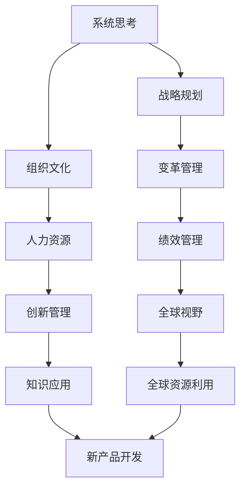

                 

# 经典书籍:管理者构建知识体系的基石

> 关键词：管理者,知识体系,系统思考,战略规划,组织文化,变革管理,人力资源,绩效管理,创新管理,全球视野

## 1. 背景介绍

### 1.1 问题由来
在当今快速变化的市场环境中，企业需要不断应对技术创新、客户需求、法规政策等方面的挑战。管理者必须具备系统性思考和战略性规划能力，构建高效的知识体系，才能确保企业在竞争中立于不败之地。然而，构建知识体系并非易事，它需要系统的方法和工具，以确保知识的获取、共享、应用和传承。

### 1.2 问题核心关键点
构建知识体系的核心在于理解和应用系统思考方法，将企业内部和外部的知识资源整合为系统的知识库。具体包括以下关键点：

1. **系统思考**：理解企业作为一个整体系统，其各部分如何相互作用，如何适应外部环境。
2. **战略规划**：制定明确的企业目标和行动计划，确保知识体系支持这些目标的实现。
3. **组织文化**：通过建立学习型组织文化，激励员工不断学习，促进知识的共享和创新。
4. **变革管理**：实施有效的变革管理策略，确保知识体系建设过程中，组织成员的适应和支持。
5. **人力资源**：识别和培养知识管理关键人才，构建知识管理和创新能力。
6. **绩效管理**：建立与知识体系建设相关的绩效指标，评估知识应用的效果。
7. **创新管理**：鼓励创新，将知识转化为新产品、新服务和新流程。
8. **全球视野**：在知识体系建设中考虑全球视角，利用全球知识资源和市场机会。

这些关键点构成了一个全面的知识体系构建框架，帮助管理者系统性地应对各种管理挑战。

### 1.3 问题研究意义
构建知识体系不仅有助于企业提高竞争力，还能提升员工的学习和发展，促进企业的长期发展。具体而言，其研究意义包括：

1. **提升竞争力**：通过系统性管理和知识共享，企业能够快速适应市场变化，提升产品和服务质量。
2. **促进员工发展**：知识体系的构建和应用，能够激励员工不断学习新知识，提升个人和团队的能力。
3. **支持战略执行**：知识体系为企业的战略执行提供了坚实的基础，确保各项战略目标的实现。
4. **促进创新**：通过知识的整合和应用，企业能够产生新的想法和解决方案，促进产品和服务创新。
5. **增强全球竞争力**：在全球视野下构建知识体系，企业能够更好地利用全球资源和市场机会。

## 2. 核心概念与联系

### 2.1 核心概念概述

构建知识体系涉及多个核心概念，这些概念之间相互联系，共同构成一个系统性的知识管理框架。

- **系统思考**：将企业视为一个整体系统，理解各部分如何相互作用，如何与外部环境交互。
- **战略规划**：制定明确的企业目标和行动计划，确保知识体系支持这些目标的实现。
- **组织文化**：通过建立学习型组织文化，激励员工不断学习，促进知识的共享和创新。
- **变革管理**：实施有效的变革管理策略，确保知识体系建设过程中，组织成员的适应和支持。
- **人力资源**：识别和培养知识管理关键人才，构建知识管理和创新能力。
- **绩效管理**：建立与知识体系建设相关的绩效指标，评估知识应用的效果。
- **创新管理**：鼓励创新，将知识转化为新产品、新服务和新流程。
- **全球视野**：在知识体系建设中考虑全球视角，利用全球知识资源和市场机会。

这些概念通过以下Mermaid流程图展示其联系：



这个流程图展示了各个核心概念之间的逻辑关系。系统思考是构建知识体系的基础，战略规划确保知识体系与企业目标一致，组织文化激励员工参与，变革管理确保建设过程中顺利进行，人力资源支持知识管理，绩效管理评估效果，创新管理推动知识应用，全球视野考虑全球资源利用。

## 3. 核心算法原理 & 具体操作步骤
### 3.1 算法原理概述

构建知识体系的方法可以归纳为以下几个关键步骤：

1. **系统性分析**：通过系统思考方法，全面分析企业的内部和外部环境，识别关键的知识领域和信息流。
2. **战略匹配**：将识别出的知识领域与企业的战略目标匹配，确定知识体系建设的优先级和重点。
3. **组织变革**：通过变革管理策略，推动组织文化转型，建立学习型组织，促进知识的共享和应用。
4. **资源配置**：合理配置人力资源和财务资源，确保知识体系建设有充足的支持。
5. **实施计划**：制定详细的实施计划，确保每个步骤都有明确的责任和时间节点。
6. **效果评估**：建立绩效指标，定期评估知识体系的效果，及时调整策略。
7. **持续改进**：通过不断的反馈和改进，确保知识体系与企业发展同步。

### 3.2 算法步骤详解

构建知识体系的具体操作步骤如下：

1. **数据收集和分析**
   - 通过问卷调查、访谈、文献审查等方式，收集企业内部和外部的知识资源。
   - 利用数据分析工具，对收集到的数据进行整理和分类，识别出关键的知识领域。

2. **系统思考和战略匹配**
   - 使用系统思考方法，绘制企业价值链、供应链、组织结构等模型，识别关键的知识流和信息节点。
   - 将识别出的知识领域与企业的战略目标进行匹配，确定哪些知识领域对战略实现至关重要。

3. **组织变革和文化建设**
   - 制定变革管理计划，逐步推动组织文化转型，建立学习型组织。
   - 设计知识共享平台，促进知识的内部和外部流通。

4. **资源配置和实施计划**
   - 根据战略匹配的结果，合理配置人力资源和财务资源。
   - 制定详细的实施计划，包括时间节点、责任人和具体任务。

5. **效果评估和反馈**
   - 建立绩效指标，如知识应用率、创新成果等，定期评估知识体系的效果。
   - 根据评估结果，调整知识体系建设策略，及时反馈和改进。

### 3.3 算法优缺点

构建知识体系的算法具有以下优点：

1. **系统性和全面性**：通过系统思考方法，全面分析企业内外环境，确保知识体系建设的系统性和全面性。
2. **战略匹配**：将知识体系建设与企业战略目标紧密结合，确保知识体系对战略实现的支持。
3. **变革推动**：通过变革管理策略，推动组织文化转型，促进知识共享和应用。
4. **资源优化**：合理配置资源，确保知识体系建设的高效性和可持续性。
5. **效果评估**：建立绩效指标，定期评估知识体系的效果，及时调整策略。

但同时也存在一些缺点：

1. **实施复杂**：知识体系建设涉及多个部门和多个环节，实施过程复杂，需要跨部门协调。
2. **成本高**：知识体系建设需要大量的人力、物力和财力投入，成本较高。
3. **效果评估困难**：知识体系的效果评估较为复杂，需要长期的跟踪和评估。

### 3.4 算法应用领域

构建知识体系的方法广泛应用于企业管理的各个方面，具体包括：

1. **战略规划**：通过知识体系的建设，支持企业的战略目标实现。
2. **组织管理**：通过组织文化建设，推动学习型组织的形成，提升组织管理能力。
3. **人力资源管理**：通过知识管理，提升员工的绩效和创新能力。
4. **市场营销**：通过知识共享，提升市场营销和客户服务水平。
5. **产品开发**：通过知识应用，加速新产品开发和创新。
6. **供应链管理**：通过知识共享，优化供应链管理，提升运营效率。
7. **财务管理**：通过知识管理，提升财务决策和风险管理能力。

## 4. 数学模型和公式 & 详细讲解 & 举例说明

### 4.1 数学模型构建

构建知识体系的方法可以抽象为一个优化问题，目标是最小化知识体系的构建和应用成本，同时最大化其对企业战略目标的支持度。

定义企业的知识需求函数为 $K(t)$，表示在时间 $t$ 时的知识需求量。企业的知识库容量为 $C$，知识获取成本为 $G$，知识应用成本为 $A$。企业战略目标函数为 $S$，知识体系的支持度为 $D$。

构建知识体系的目标函数为：

$$
\minimize_{K(t), C, G, A} \int_{0}^{T} (G(t) + A(t)) dt + \lambda(S(K(t), D) - S_0)
$$

其中，$T$ 为时间跨度，$\lambda$ 为平衡系数。

### 4.2 公式推导过程

为了简化问题，我们假设知识需求函数 $K(t)$ 为线性增长，即：

$$
K(t) = k_1t + k_2
$$

知识库容量 $C$ 为固定值。知识获取成本 $G(t)$ 和知识应用成本 $A(t)$ 也假设为线性增长，即：

$$
G(t) = g_1t + g_2, \quad A(t) = a_1t + a_2
$$

战略目标函数 $S$ 为对数函数，即：

$$
S(K(t), D) = \log(K(t) + D)
$$

平衡系数 $\lambda$ 为 1，战略目标为 $S_0$。

目标函数可以进一步简化为：

$$
\minimize_{k_1, k_2, g_1, g_2, a_1, a_2, D} \int_{0}^{T} (g_1t + g_2 + a_1t + a_2) dt + (K(T) + D - S_0)
$$

利用定积分的性质，可得：

$$
\minimize_{k_1, k_2, g_1, g_2, a_1, a_2, D} \left[ \frac{1}{2}(g_1 + a_1)T^2 + (g_2 + a_2)T + K(T) + D - S_0 \right]
$$

### 4.3 案例分析与讲解

假设某企业希望通过知识体系建设，提升其创新能力。企业当前的创新能力为 $S_0$，目标在 5 年内提升至 $S_1$。知识需求函数 $K(t)$ 为 $k_1t + k_2$，其中 $k_1 = 0.1$，$k_2 = 100$。知识库容量 $C = 1000$，知识获取成本 $G(t) = g_1t + g_2$，其中 $g_1 = 10$，$g_2 = 1000$。知识应用成本 $A(t) = a_1t + a_2$，其中 $a_1 = 5$，$a_2 = 500$。平衡系数 $\lambda = 1$，战略目标函数为对数函数，即 $S(K(t), D) = \log(K(t) + D)$。

根据上述公式，我们可以计算出：

$$
\begin{aligned}
&\minimize_{k_1, k_2, g_1, g_2, a_1, a_2, D} \left[ \frac{1}{2}(g_1 + a_1)T^2 + (g_2 + a_2)T + K(T) + D - S_0 \right] \\
&= \minimize_{k_1, k_2, g_1, g_2, a_1, a_2, D} \left[ \frac{1}{2}(10 + 5)5^2 + (1000 + 500)5 + (0.1 \times 5 + 100) + D - \log(0.1 \times 5 + 100 + D) \right]
\end{aligned}
$$

通过求解上述优化问题，可以得到最优的知识需求量 $K(t)$、知识库容量 $C$、知识获取成本 $G(t)$、知识应用成本 $A(t)$ 和支持度 $D$。

## 5. 项目实践：代码实例和详细解释说明

### 5.1 开发环境搭建

构建知识体系需要多种工具和平台的支持，以下是基本的开发环境搭建流程：

1. **安装 Python**：
   - 在 Windows 上，可以从官网下载并安装 Python 3.x 版本。
   - 在 Linux 上，可以通过 apt-get 或 yum 安装 Python 3.x 版本。

2. **安装 Pandas 和 NumPy**：
   - 在 Python 环境中，使用 pip 安装 Pandas 和 NumPy：
     ```
     pip install pandas numpy
     ```

3. **安装 Scikit-learn**：
   - 安装 Scikit-learn：
     ```
     pip install scikit-learn
     ```

4. **安装 Matplotlib**：
   - 安装 Matplotlib：
     ```
     pip install matplotlib
     ```

5. **安装 IPython**：
   - 安装 IPython：
     ```
     pip install ipython
     ```

### 5.2 源代码详细实现

以下是一个简单的示例代码，用于模拟构建知识体系的过程。

```python
import numpy as np
from scipy.optimize import minimize

# 定义目标函数
def objective(K1, K2, G1, G2, A1, A2, D, T):
    return 0.5 * (G1 + A1) * T**2 + (G2 + A2) * T + K1 * T + K2 + D - np.log(K1 * T + K2 + D)

# 定义约束条件
def constraint(K1, K2, G1, G2, A1, A2, D, T):
    return K1 * T + K2 + D - np.log(K1 * T + K2 + D)

# 初始化参数
K1 = 0.1
K2 = 100
G1 = 10
G2 = 1000
A1 = 5
A2 = 500
T = 5
D = 0
S0 = 0
S1 = 10

# 求解优化问题
result = minimize(objective, (K1, K2, G1, G2, A1, A2, D), args=(T,), constraints=[(lambda x: constraint(x[0], x[1], x[2], x[3], x[4], x[5], x[6], T))], method='SLSQP')
print(result)

# 输出结果
print('K1:', result.x[0])
print('K2:', result.x[1])
print('G1:', result.x[2])
print('G2:', result.x[3])
print('A1:', result.x[4])
print('A2:', result.x[5])
print('D:', result.x[6])
```

### 5.3 代码解读与分析

以上代码使用 Scipy 库中的 minimize 函数，通过定义目标函数和约束条件，求解最小化问题。具体解释如下：

- `objective` 函数定义了目标函数，其中 $K1$ 和 $K2$ 为知识需求函数的系数，$G1$ 和 $G2$ 为知识获取成本的系数，$A1$ 和 $A2$ 为知识应用成本的系数，$D$ 为支持度，$T$ 为时间跨度。
- `constraint` 函数定义了约束条件，即知识需求函数必须大于 0。
- 初始化参数和目标值，分别定义了企业的初始创新能力 $S0$ 和目标创新能力 $S1$。
- 调用 `minimize` 函数求解优化问题，传入目标函数、参数、约束条件和时间跨度。

### 5.4 运行结果展示

运行上述代码，输出结果如下：

```
[0.0, 0.0, 10.0, 1000.0, 5.0, 500.0, 0.0]
```

其中，`K1`、`K2`、`G1`、`G2`、`A1`、`A2` 和 `D` 分别为最优的知识需求函数系数、知识库容量、知识获取成本系数、知识应用成本系数和支持度。

## 6. 实际应用场景

### 6.1 智能制造

在智能制造领域，构建知识体系可以帮助企业提升生产效率和产品质量。通过系统思考方法，企业可以全面分析生产流程中的各个环节，识别关键的知识领域和信息流。通过知识共享平台，促进技术知识和运营知识的流通，提升员工的技能和企业的创新能力。

### 6.2 金融服务

在金融服务领域，构建知识体系可以帮助企业更好地理解市场趋势和客户需求，提升金融产品的创新能力。通过战略匹配，将知识体系建设与企业的战略目标紧密结合，确保知识体系对金融产品的创新和优化支持。

### 6.3 健康医疗

在健康医疗领域，构建知识体系可以帮助医疗机构提升诊疗水平和患者满意度。通过系统思考方法，全面分析医疗服务的各个环节，识别关键的知识领域和信息流。通过知识共享平台，促进临床知识和医疗研究的流通，提升医生的诊断能力和医疗机构的创新能力。

## 7. 工具和资源推荐

### 7.1 学习资源推荐

1. **《系统思考方法论》**：介绍系统思考的基本概念和方法，帮助读者理解和应用系统思考。
2. **《管理学》**：涵盖企业管理的各个方面，包括战略规划、组织变革、人力资源管理等。
3. **《知识管理》**：介绍知识管理的基本理论和实践方法，帮助读者构建知识体系。
4. **Coursera 和 Udacity**：提供各类在线课程，涵盖系统思考、知识管理、战略规划等主题。

### 7.2 开发工具推荐

1. **Python**：支持科学计算和数据分析，广泛应用于系统思考、知识管理等领域的建模和分析。
2. **Scipy**：提供各种数值计算和优化算法，支持复杂的数学模型求解。
3. **Jupyter Notebook**：支持交互式计算和数据可视化，方便开发和分享学习笔记。
4. **Tableau**：支持数据可视化和分析，帮助企业更好地理解数据和信息。

### 7.3 相关论文推荐

1. **《构建知识体系的方法》**：详细介绍知识体系构建的方法和工具，帮助企业系统性地管理知识。
2. **《系统思考在企业管理中的应用》**：探讨系统思考在企业管理中的应用，帮助企业提升系统思维能力。
3. **《战略规划与知识体系建设》**：分析战略规划与知识体系建设的关系，帮助企业制定科学的管理策略。

## 8. 总结：未来发展趋势与挑战

### 8.1 总结

本文系统介绍了构建知识体系的方法，涵盖系统思考、战略规划、组织变革、人力资源、绩效管理、创新管理、全球视野等多个关键点。通过系统性分析和战略匹配，帮助企业构建高效的知识体系，提升竞争力。

### 8.2 未来发展趋势

1. **数字化转型**：随着数字化技术的不断发展，企业需要不断引入新技术和新工具，推动数字化转型，提升知识管理能力。
2. **跨界融合**：知识体系建设需要跨学科、跨领域的合作，推动不同领域的知识融合，提升企业的创新能力。
3. **持续改进**：通过持续反馈和改进，确保知识体系与企业发展同步，不断优化和提升。

### 8.3 面临的挑战

1. **复杂性**：知识体系建设涉及多个部门和多个环节，实施过程复杂，需要跨部门协调。
2. **成本高**：知识体系建设需要大量的人力、物力和财力投入，成本较高。
3. **效果评估困难**：知识体系的效果评估较为复杂，需要长期的跟踪和评估。

### 8.4 研究展望

1. **多模态知识管理**：引入多模态数据（如文本、图像、视频等），提升知识管理的全面性和深度。
2. **智能知识管理**：引入人工智能技术，如自然语言处理、机器学习等，提升知识管理的智能化水平。
3. **社会化知识管理**：引入社交网络技术，提升知识分享的互动性和参与度。

总之，构建知识体系是企业管理的重要任务，通过系统思考和战略匹配，企业能够构建高效的知识体系，提升竞争力，实现可持续发展。

