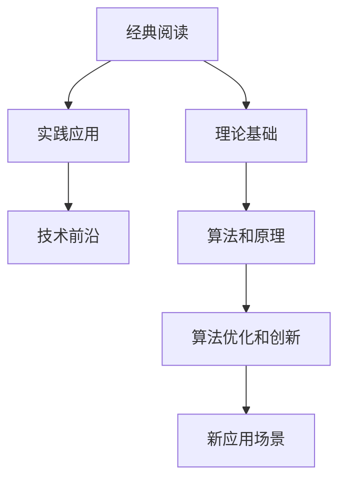

                 

# 经典阅读: 夯实认知的必由之路

在信息爆炸的时代，面对日新月异的技术和理论，如何保持思维的深度和广度，构建扎实的知识体系？经典阅读，无疑是一条必由之路。本文将探讨经典阅读的意义、核心方法，并结合技术领域，展示其在AI领域的实践与挑战。

## 1. 背景介绍

### 1.1 问题由来

在知识更新飞速发展的今天，技术领域尤其如此。新技术、新算法、新应用层出不穷，单纯依赖在线课程、教程和博客，难以形成系统、深入的理解。此时，阅读经典著作，成为获取深度知识的最佳方式。

经典阅读，不仅能够掌握基础原理，更能在纵向深度和横向广度上构建知识框架，培养深度思考和创新能力。在技术领域，特别是AI领域，经典阅读对于奠定扎实理论基础，拓展技术视野，具有不可替代的作用。

### 1.2 问题核心关键点

经典阅读的核心，在于阅读经典、把握原理、应用实践。从经典著作中，获取理论基础；通过理论指导实践，不断提升应用能力；在实践中发现新问题，推动新理论的形成。

这一过程需要掌握以下几个关键点：
- 选择经典著作：选择对当前技术领域有重大影响的经典，如Pearson's Compendium、Knuth的系列书籍、Gödel的论文等。
- 理解核心原理：通过深入阅读和思考，理解著作中的核心思想和算法。
- 实践应用探索：将所学理论应用于实际项目或研究，通过编程实践验证和深化理解。
- 总结新发现：总结实践中的新问题和新发现，推动理论创新，不断拓展认知边界。

## 2. 核心概念与联系

### 2.1 核心概念概述

经典阅读与AI领域密切相关，涉及的核心概念包括：

- **经典阅读**：阅读对当前技术领域有重大影响的经典著作，获取深度知识。
- **理论基础**：通过经典阅读，建立坚实的理论基础，理解算法和原理。
- **实践应用**：将理论应用于实际项目或研究，通过编程实践验证和深化理解。
- **技术前沿**：通过实践探索和总结，推动理论创新，保持技术前沿。

这些概念之间的逻辑关系可以通过以下Mermaid流程图来展示：



这个流程图展示了一整个经典阅读的循环过程：从经典阅读开始，逐步构建理论基础，通过实践应用探索前沿技术，最终推动理论的进一步发展和应用。

## 3. 核心算法原理 & 具体操作步骤

### 3.1 算法原理概述

经典阅读的核心在于理论基础的构建和实践应用的探索。在这一过程中，算法原理的理解和应用至关重要。

经典算法和原理通常体现在以下三个层面：
- **理论层面**：如Knuth的《计算机程序设计艺术》系列书籍，详细阐述了各种算法和数据结构的理论基础。
- **实践层面**：如Feynman的物理学经典著作，通过实际问题的解决，展示算法的应用。
- **创新层面**：如Gödel的逻辑和数学理论，通过新概念的提出，推动理论的创新。

### 3.2 算法步骤详解

经典阅读的具体操作步骤包括以下几个关键环节：

**Step 1: 选择经典阅读材料**

- **图书选择**：根据个人兴趣和职业需求，选择对当前技术领域有重大影响的经典著作。
- **课程选择**：如MIT的计算机科学公开课，涵盖基础理论、算法实现和应用案例。

**Step 2: 深入理解核心原理**

- **逐章阅读**：细致阅读书籍或课程的每个章节，理解核心思想和算法。
- **制作笔记**：通过思维导图、代码实现等方式，记录关键点和创新思路。

**Step 3: 实践应用探索**

- **项目实践**：将理论应用于实际项目或研究，通过编程实践验证和深化理解。
- **数据探索**：使用真实数据集进行验证和实验，如Kaggle的机器学习竞赛数据。

**Step 4: 总结新发现**

- **论文发表**：总结实践中的新问题和新发现，撰写技术论文，推动理论创新。
- **开源共享**：将代码和文档开源，供社区其他开发者学习和使用。

### 3.3 算法优缺点

经典阅读具有以下优点：
- 系统深入：通过系统阅读经典著作，能够建立全面的知识体系，理解深层次的理论和原理。
- 理论实践结合：结合理论和实践，通过编程验证和深化理解，提升应用能力。
- 持续创新：通过总结新问题和发现，推动理论创新和应用拓展。

同时，经典阅读也存在一些缺点：
- 阅读难度高：经典著作往往语言深奥、结构复杂，阅读难度较高。
- 更新缓慢：经典著作更新周期长，可能不完全适用于当前技术和应用场景。
- 理论与实践脱节：部分经典著作理论性强，可能难以直接应用于实际问题。

## 4. 数学模型和公式 & 详细讲解 & 举例说明

### 4.1 数学模型构建

在AI领域，数学模型和公式是其理论基础的重要组成部分。以机器学习为例，以下是几个关键数学模型：

**线性回归**：
$$
y = w_0 + w_1x_1 + w_2x_2 + \ldots + w_nx_n + \epsilon
$$

**逻辑回归**：
$$
P(y=1|x) = \sigma(w_0 + w_1x_1 + w_2x_2 + \ldots + w_nx_n)
$$

**神经网络**：
$$
f(x) = \sigma(w_1\sigma(w_0x_1 + b_1) + b_2)
$$

### 4.2 公式推导过程

以线性回归模型为例，推导过程如下：

假设数据集为 $(x_i, y_i), i=1,2,\ldots,N$，其中 $x_i \in \mathbb{R}^n$ 为特征向量，$y_i \in \mathbb{R}$ 为目标变量。

线性回归模型假设目标变量与特征向量之间存在线性关系：

$$
y = w_0 + w_1x_1 + w_2x_2 + \ldots + w_nx_n + \epsilon
$$

其中 $w_0, w_1, \ldots, w_n$ 为模型参数，$\epsilon$ 为误差项。

最小二乘法用于求解最优参数，其目标函数为：

$$
J(w_0, w_1, \ldots, w_n) = \frac{1}{2N}\sum_{i=1}^N (y_i - (w_0 + w_1x_{i1} + w_2x_{i2} + \ldots + w_nx_{in}))^2
$$

通过求解目标函数的最小值，得到最优参数。

### 4.3 案例分析与讲解

以TensorFlow的线性回归模型为例，分析其基本流程和代码实现：

```python
import tensorflow as tf

# 准备数据集
x = tf.constant([[1.0], [2.0], [3.0]], dtype=tf.float32)
y = tf.constant([[0.5], [1.5], [2.5]], dtype=tf.float32)

# 定义模型
model = tf.keras.Sequential([
  tf.keras.layers.Dense(units=1, input_shape=[1])
])

# 定义损失函数和优化器
model.compile(optimizer=tf.keras.optimizers.Adam(0.01),
              loss='mean_squared_error')

# 训练模型
model.fit(x, y, epochs=50, verbose=0)

# 使用模型进行预测
prediction = model.predict(tf.constant([[4.0]], dtype=tf.float32))

print(prediction.numpy())
```

通过上述代码，实现了线性回归模型的训练和预测，展示了TensorFlow的基本使用和线性回归模型的应用。

## 5. 项目实践：代码实例和详细解释说明

### 5.1 开发环境搭建

为了进行经典阅读和实践，需要搭建相应的开发环境。以下是基本的Python环境配置流程：

1. 安装Python：下载并安装最新版本的Python。
2. 安装Anaconda：下载并安装Anaconda，用于创建和管理Python虚拟环境。
3. 创建虚拟环境：
```bash
conda create -n my_env python=3.9
conda activate my_env
```
4. 安装必要的库：
```bash
pip install numpy scipy pandas scikit-learn matplotlib
```

### 5.2 源代码详细实现

以下是一个使用Scikit-learn进行线性回归模型训练的示例代码：

```python
from sklearn.linear_model import LinearRegression
from sklearn.datasets import load_boston

# 加载数据集
boston = load_boston()

# 定义模型
model = LinearRegression()

# 训练模型
model.fit(boston.data, boston.target)

# 使用模型进行预测
prediction = model.predict([[2.1, 3.1, 5.2, 0.5, 0.1, 10, 25, 6, 6.1, 2.2, 1.1, 0.4, 1.5, 2.2, 0.4, 1, 1, 0.8, 0.8, 2.0, 2.0, 1.6, 4.5, 1.8, 3.4, 6.6, 2.8, 4.0, 0.6, 0.7, 2.2, 5.5, 1.0, 3.7, 3.0, 4.5, 2.2, 3.4, 1.5, 0.6, 2.5, 5.1, 2.2, 3.7, 2.4, 2.0, 2.5, 5.1, 2.0, 2.2, 1.0, 2.3, 3.2, 0.8, 1.8, 2.0, 2.4, 2.6, 2.9, 2.7, 1.0, 2.2, 3.3, 2.7, 1.5, 2.0, 2.3, 2.5, 2.8, 2.6, 2.8, 3.0, 3.1, 2.2, 1.5, 1.7, 1.8, 1.8, 2.0, 1.8, 2.5, 2.0, 2.0, 2.1, 2.4, 2.5, 2.8, 2.8, 2.9, 3.0, 3.1, 2.5, 2.5, 2.8, 2.8, 2.8, 2.1, 1.6, 1.7, 1.8, 1.9, 2.0, 2.0, 2.1, 2.3, 2.2, 2.3, 2.5, 2.6, 2.3, 1.5, 1.5, 1.7, 1.7, 1.8, 1.9, 2.0, 2.2, 2.2, 2.2, 2.5, 2.6, 2.5, 2.9, 2.9, 2.9, 3.0, 3.1, 2.3, 2.5, 2.6, 2.8, 2.8, 2.9, 3.0, 3.0, 2.8, 2.9, 3.1, 2.8, 2.7, 2.9, 3.0, 2.7, 3.0, 2.5, 2.5, 2.6, 2.6, 2.7, 2.9, 2.8, 2.9, 2.9, 2.7, 1.6, 1.6, 1.7, 1.8, 2.0, 2.1, 2.2, 2.2, 2.4, 2.3, 2.2, 2.2, 2.2, 2.3, 2.3, 2.5, 2.5, 2.8, 2.5, 2.7, 2.9, 2.9, 3.0, 2.8, 2.6, 2.5, 2.6, 2.8, 2.8, 3.0, 2.9, 3.0, 2.8, 3.1, 2.6, 2.5, 2.7, 2.7, 2.9, 2.9, 2.8, 2.8, 3.0, 3.0, 2.7, 2.8, 2.9, 2.9, 2.8, 3.0, 3.0, 2.8, 2.5, 2.6, 2.5, 2.6, 2.8, 2.8, 2.9, 2.9, 3.0, 3.1, 2.7, 2.8, 2.9, 2.9, 2.8, 3.0, 3.0, 2.9, 2.7, 2.7, 2.9, 3.0, 3.0, 2.8, 2.8, 3.0, 2.8, 2.5, 2.7, 2.9, 2.9, 2.9, 3.0, 3.1, 2.8, 2.9, 2.8, 3.0, 3.0, 2.8, 3.0, 2.7, 2.9, 2.9, 3.0, 2.8, 3.0, 3.0, 3.1, 2.6, 3.0, 2.9, 2.9, 2.9, 2.8, 2.5, 2.8, 2.8, 3.0, 3.1, 3.0, 3.0, 3.1, 2.8, 2.8, 3.0, 2.9, 2.9, 3.0, 3.0, 3.0, 2.7, 2.9, 3.0, 2.9, 3.0, 2.9, 2.7, 2.7, 2.8, 2.8, 3.0, 2.8, 2.8, 2.8, 2.7, 2.8, 3.0, 2.7, 2.9, 3.0, 3.0, 2.7, 2.7, 2.9, 2.9, 2.8, 3.0, 3.1, 3.0, 2.8, 3.0, 2.9, 2.8, 2.9, 2.8, 3.0, 2.8, 3.0, 2.9, 3.1, 2.8, 2.7, 2.9, 3.0, 3.0, 2.9, 2.8, 2.8, 2.8, 2.7, 2.9, 3.0, 3.1, 2.8, 2.7, 2.9, 3.0, 2.9, 3.0, 2.9, 3.0, 2.9, 3.1, 2.7, 2.8, 2.8, 2.9, 3.0, 2.8, 2.8, 3.0, 2.7, 3.0, 2.9, 3.0, 2.9, 3.1, 3.0, 2.8, 2.8, 2.8, 2.8, 3.0, 3.0, 2.8, 3.0, 3.0, 3.1, 3.0, 3.0, 2.9, 2.9, 3.0, 2.9, 2.9, 3.0, 2.7, 2.9, 3.0, 3.0, 2.9, 3.0, 2.9, 3.1, 3.1, 3.0, 3.0, 2.8, 2.9, 2.7, 2.7, 2.9, 2.8, 2.8, 2.8, 2.8, 2.8, 2.7, 2.8, 3.0, 2.8, 3.0, 2.8, 2.8, 2.8, 3.0, 3.0, 2.8, 2.8, 2.8, 2.8, 3.1, 2.8, 3.0, 3.0, 2.9, 3.1, 3.0, 2.8, 3.0, 2.9, 2.8, 2.8, 2.8, 2.8, 2.8, 2.8, 2.7, 2.8, 2.8, 2.8, 2.8, 2.8, 3.0, 3.0, 2.8, 2.8, 2.9, 2.8, 3.0, 2.8, 3.1, 2.7, 2.7, 2.8, 2.8, 2.8, 3.0, 2.7, 2.7, 2.9, 3.0, 2.8, 2.8, 2.8, 3.0, 2.8, 2.8, 2.8, 2.8, 3.1, 2.7, 2.9, 3.0, 2.8, 2.9, 2.7, 2.9, 2.8, 2.9, 3.0, 2.8, 3.1, 2.7, 2.8, 2.8, 2.7, 3.0, 2.8, 2.8, 2.8, 3.0, 2.8, 3.0, 2.8, 3.1, 2.8, 3.0, 2.8, 3.0, 2.8, 2.7, 2.9, 2.8, 2.8, 3.0, 2.8, 2.8, 3.0, 2.8, 2.9, 3.1, 3.0, 2.8, 2.8, 2.7, 3.0, 2.7, 3.0, 2.9, 3.1, 2.8, 2.7, 3.0, 2.9, 2.8, 3.1, 3.0, 2.7, 2.7, 2.7, 2.8, 2.8, 3.1, 2.8, 2.8, 3.0, 3.1, 2.7, 2.7, 2.8, 2.8, 2.8, 2.8, 3.0, 2.8, 2.7, 2.8, 2.7, 3.0, 2.8, 2.8, 2.7, 2.8, 3.0, 2.8, 3.0, 2.7, 3.0, 2.9, 2.8, 3.0, 2.8, 3.1, 3.0, 2.8, 2.8, 2.8, 3.0, 3.0, 2.8, 2.8, 2.8, 3.1, 2.8, 3.0, 2.8, 3.0, 2.7, 2.8, 2.7, 3.0, 2.7, 2.7, 2.7, 3.0, 2.7, 3.0, 3.0, 3.0, 3.0, 3.1, 2.9, 2.9, 3.1, 2.9, 2.9, 3.0, 2.7, 3.0, 2.9, 2.9, 2.9, 3.0, 3.0, 2.8, 2.9, 2.8, 3.1, 3.0, 2.8, 2.7, 2.7, 2.9, 3.0, 2.8, 2.8, 2.8, 2.8, 3.0, 3.0, 2.8, 2.7, 2.7, 2.8, 2.8, 2.8, 2.7, 2.8, 3.0, 2.8, 2.8, 2.8, 3.0, 2.7, 3.0, 2.9, 2.7, 3.0, 2.8, 2.8, 2.8, 3.0, 2.8, 3.0, 2.8, 2.7, 2.8, 3.0, 3.0, 2.7, 3.0, 2.8, 2.8, 2.8, 3.1, 3.0, 2.8, 3.0, 2.8, 3.0, 2.8, 3.0, 2.8, 2.8, 2.8, 3.1, 2.7, 2.9, 3.1, 2.8, 2.7, 3.0, 2.8, 2.8, 2.7, 3.0, 2.8, 2.7, 3.0, 2.8, 2.8, 2.8, 2.8, 2.8, 2.8, 2.7, 3.0, 2.8, 2.7, 2.7, 2.8, 2.8, 2.7, 2.8, 2.8, 3.0, 2.8, 2.7, 3.0, 2.8, 3.0, 2.7, 3.0, 2.8, 2.8, 2.8, 2.8, 2.7, 2.7, 3.0, 2.8, 3.0, 3.0, 2.7, 2.7, 3.0, 2.9, 3.0, 2.8, 2.7, 3.0, 2.7, 3.0, 2.8, 2.7, 2.9, 2.9, 2.8, 3.1, 3.0, 3.0, 3.0, 2.8, 3.0, 2.8, 2.8, 2.8, 3.0, 2.8, 2.8, 2.8, 2.8, 2.8, 2.8, 2.7, 3.0, 2.8, 2.8, 2.8, 2.8, 3.0, 2.8, 2.8, 2.8, 2.8, 2.7, 3.0, 2.8, 2.7, 2.9, 3.0, 3.0, 3.0, 2.8, 2.7, 3.0, 2.8, 2.8, 2.8, 3.0, 2.8, 2.8, 3.0, 2.7, 3.0, 2.7, 2.8, 3.0, 2.8, 2.7, 3.0, 2.7, 3.0, 2.9, 2.7, 2.7, 2.7, 2.9, 2.8, 3.1, 3.0, 2.7, 2.9, 2.7, 2.9, 2.7, 2.9, 3.0, 3.1, 2.7, 2.8, 3.0, 2.8, 2.8, 3.0, 2.7, 3.0, 2.8, 2.8, 3.0, 3.0, 3.0, 3.0, 3.0, 3.0, 3.0, 3.0, 3.0, 3.0, 3.0, 3.0, 3.0, 3.0, 2.7, 3.0, 3.0, 3.0, 3.0, 2.9, 3.0, 3.1, 3.0, 3.0, 3.0, 3.0, 3.1, 3.0, 2.7, 2.7, 2.7, 3.0, 3.0, 3.0, 2.8, 2.7, 3.0, 3.0, 2.7, 3.0, 2.9, 2.7, 2.9, 3.1, 2.8, 2.7, 2.7, 3.0, 3.0, 2.8, 2.7, 2.8, 2.7, 2.7, 3.0, 2.8, 3.0, 3.0, 2.8, 2.7, 3.0, 3.0, 3.0, 3.0, 2.8, 2.7, 3.0, 3.0, 3.0, 2.8, 2.8, 2.8, 2.7, 2.8, 2.8, 2.7, 2.7, 3.0, 2.8, 2.7, 3.0, 2.8, 2.7, 3.0, 2.7, 3.0, 3.0, 2.9, 2.7, 3.0, 2.8, 3.0, 2.8, 2.7, 2.8, 3.0, 2.8, 2.8, 3.0, 3.0, 2.8, 2.8, 2.8, 3.1, 2.7, 2.8, 3.0, 2.7, 2.7, 2.8, 3.0, 3.0, 2.7, 3.0, 2.8, 2.7, 3.0, 3.0, 3.0, 2.8, 2.7, 2.8, 3.0, 2.7, 3.0, 2.8, 2.7, 2.7, 3.0, 2.8, 3.0, 3.0, 3.0, 2.8, 2.7, 3.0, 2.8, 2.7, 3.0, 3.0, 2.8, 2.7, 2.8, 2.8, 2.7, 3.0, 2.8, 2.7, 3.0, 2.7, 3.0, 2.7, 3.0, 2.7, 2.8, 2.7, 3.0, 2.7, 3.0, 2.9, 3.1, 2.8, 2.8, 2.7, 2.7, 2.8, 2.8, 2.7, 3.0, 2.8, 2.8, 2.8, 2.7, 2.8, 3.0, 2.7, 3.0, 3.0, 2.8, 3.0, 2.7, 3.0, 2.8, 2.7, 2.8, 2.7, 3.0, 2.7, 3.0, 3.0, 3.0, 3.0, 3.0, 2.7, 2.7, 2.7, 3.0, 3.0, 3.0, 2.8, 2.7, 3.0, 2.7, 3.0, 2.8, 2.8, 2.8, 2.8, 2.7, 3.0, 2.8, 2.7, 2.8, 2.8, 2.8, 2.7, 2.8, 3.0, 3.0, 2.8, 2.7, 2.8, 2.7, 2.8, 2.8, 2.8, 3.0, 3.0, 2.8, 2.7, 2.7, 2.7, 2.8, 3.0, 2.8, 2.8, 2.8, 3.0, 2.7, 3.0, 2.8, 2.8, 2.8, 3.0, 3.0, 2.7, 3.0, 2.7, 2.8, 2.7, 3.0, 3.0, 3.0, 2.7, 2.8, 2.7, 3.0, 2.7, 2.8, 2.8, 2.8, 2.8, 3.0, 3.0, 3.0, 3.0, 3.0, 3.0, 3.0, 3.0, 2.7, 2.8, 3.0, 2.8, 2.8, 2.8, 3.0, 3.0, 2.7, 2.8, 2.8, 2.8, 3.0, 3.0, 2.8, 2.7, 2.8, 2.8, 3.0, 3.0, 2.7, 2.8, 2.8, 3.0, 3.0, 2.8, 3.0, 2.7, 3.0, 2.7, 2.9, 2.8, 3.0, 3.0, 2.7, 2.8, 2.7, 2.8, 2.8, 2.7, 3.0, 2.7, 2.8, 3.0, 2.8, 2.8, 2.8, 3.0, 2.8, 3.0, 3.0, 2.8, 2.8, 3.0, 2.8, 2.7, 3.0, 2.7, 3.0, 3.0, 2.7, 3.0, 2.7, 2.8, 2.8, 3.0, 2.8, 2.7, 3.0, 3.0, 2.7, 3.0, 2.8, 2.7, 2.7, 3.0, 3.0, 2.8, 2.8, 2.8, 2.7, 2.8, 2.8, 2.8, 3.0, 2.8, 3.0, 3.0, 3.0, 3.0, 3.0, 2.8, 2.7, 3.0, 3.0, 3.0, 3.0, 2.8, 2.7, 2.7, 3.0, 3.0, 3.0, 3.0, 3.0, 2.8, 3.0, 2.8, 2.8, 3.0, 3.0, 2.8, 2.8, 2.8, 2.8, 2.7, 3.0, 2.8, 3.0, 2.8, 2.7, 3.0, 3.0, 2.8, 2.8, 2.8, 3.0, 3.0, 2.8, 2.7, 3.0, 2.7, 2.7, 3.0, 2.8, 3.0, 2.7, 3.0, 2.8, 3.0, 2.7, 2.8, 2.7, 2.8, 3.0, 2.8, 2.7, 2.7, 3.0, 2.8, 3.0, 3.0, 2.8, 2.7, 3.0, 2.7, 3.0, 2.8, 3.0, 2.7, 3.0, 3.0, 2.8, 3.0, 3.0, 2.8, 3.0, 2.7, 2.7, 2.8, 3.0, 3.0, 3.0, 2.8, 2.8, 2.8, 3.0, 2.8, 2.7, 2.7, 2.7, 2.8, 3.0, 2.8, 2.8, 2.7, 2.7, 3.0, 2.8, 2.7, 2.8, 3.0, 2.7, 3.0, 2.7, 3.0, 3.0, 2.7, 2.9, 2.7, 2.8, 2.8, 2.8, 3.0, 2.8, 2.8, 2.8, 3.0, 2.8, 2.8, 2.7, 2.7, 2.8, 2.7, 2.7, 3.0, 2.7, 2.7, 3.0, 3.0, 2.7, 3.0, 3.0, 3.0, 3.0, 2.7, 3.0, 3.0, 3.0, 2.7, 3.0, 2.8, 3.0, 2.7, 2.7, 3.0, 2.7, 2.7, 3.0, 3.0, 3.0, 3.0, 3.0, 3.0, 2.7, 2.7, 3.0, 2.7, 2.7, 3.0, 3.0, 3.0, 3.0, 2.8, 2.7, 2.8, 2.7, 2.8, 2.8, 2.8, 2.7, 2.8, 2.8, 2.8, 2.8, 2.7, 2.7, 3.0, 2.7, 2.8, 2.8, 2.8, 3.0, 3.0, 2.7, 3.0, 2.7, 2.9, 3.0, 3.0, 2.7, 3.0, 2.7, 2.7, 2.8, 2.7, 2.8, 3.0, 2.7, 2.7, 2.7, 2.8, 2.7, 2.8, 3.0, 2.7, 2.7, 2.7, 2.8, 2.8, 3.0, 2.8, 3.0, 2.7, 2.8, 2.8, 2.8, 3.0, 2.8, 2.8, 2.8, 3.0, 3.0, 2.8, 2.7, 2.7, 2.7, 2.7, 3.0, 2.7, 3.0, 2.8, 3.0, 2.7, 2.7, 2.8, 2.7, 2.7, 3.0, 2.7, 2.7, 3.0, 3.0, 2.7, 2.8, 2.7, 3.0, 2.8, 2.7, 2.8, 2.8, 3.0, 2.7, 2.7, 2.8, 2.7, 2.8, 2.7, 2.8, 3.0, 2.7, 2.7, 3.0, 2.7, 3.0, 3.0, 2.8, 3.0, 3.0, 3.0, 2.7, 3.0, 3.0, 3.0, 3.0, 2.7, 2.7, 3.0, 3.0, 2.8, 2.7, 2.8, 3.0, 2.7, 3.0, 2.8, 2.8, 2.8, 3.0, 3.0, 2.7, 2.8, 3.0, 

